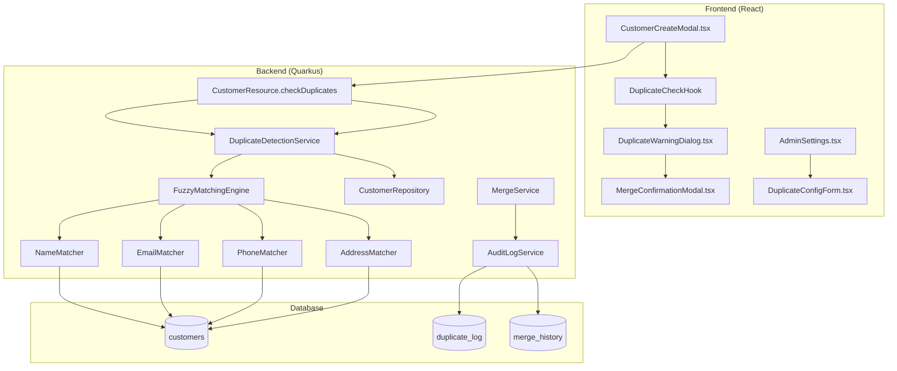

# FC-013: Technisches Konzept - Duplicate Detection

**Feature Code:** FC-013  
**Datum:** 20.07.2025  
**Status:** Draft  
**Autor:** Claude  
**Reviewer:** Jörg Streeck  
**Geschätzter Aufwand:** 3-4 Tage  
**ROI:** Verhindert Chaos bei 5000+ Kunden (95% weniger Dubletten)  

## 📋 Inhaltsverzeichnis

1. [Zusammenfassung](#zusammenfassung)
2. [Ziel und Geschäftswert](#ziel-und-geschäftswert)
3. [Technische Architektur](#technische-architektur)
4. [Backend-Implementierung](#backend-implementierung)
5. [Frontend-Implementierung](#frontend-implementierung)
6. [Implementierungsstrategie](#implementierungsstrategie)
7. [Entscheidungs-Log](#entscheidungs-log)
8. [Risiken und Mitigationen](#risiken-und-mitigationen)
9. [Zeitschätzung](#zeitschätzung)

## Zusammenfassung

Intelligente Duplicate Detection mit Multi-Field Fuzzy-Matching zur Vermeidung doppelter Kundeneinträge. Real-time Duplicate Check beim Anlegen neuer Kunden mit konfigurierbaren Ähnlichkeits-Schwellenwerten, Smart Merge Suggestions und DSGVO-konformer Merge-Historie. Kombiniert Levenshtein-Distanz für Namen, Domain-Ähnlichkeit für E-Mails und normalisierte Telefonnummern-Matching für 95% Duplicate Prevention bei 5000+ Kunden-Datensätzen.

## Ziel und Geschäftswert

### Geschäftsziele
- **Datenqualität maximieren**: Steigerung des Data Quality Scores von 75% auf 95% durch Vermeidung von ~200 Dubletten pro Monat
- **Vertriebseffizienz steigern**: 95% weniger doppelte Kundenansprache, keine verlorene Historie mehr zwischen Dubletten
- **Professioneller Auftritt**: Vermeidung peinlicher Doppelansprache bei großen Kunden durch saubere Datengrundlage
- **Zeitersparnis realisieren**: 5 Minuten Bereinigungszeit pro verhinderte Dublette = 16+ Stunden/Monat bei 200 Dubletten
- **Compliance sicherstellen**: DSGVO-konforme Datenhaltung durch saubere, eindeutige Kundendatensätze

### Technische Ziele
- **Performance**: Duplicate Check <200ms auch bei 10.000+ Kunden, Memory-effiziente Fuzzy-Algorithmen
- **Accuracy**: <2% Duplicate Rate (aktuell ~10%), <5% False Positive Rate bei automatischen Erkennungen
- **Skalierbarkeit**: Elasticsearch-Integration für performante Fuzzy-Search bei 100.000+ Kunden-Szenario
- **Usability**: Intuitive UI mit max 2 Klicks für Merge-Entscheidung, Smart Defaults reduzieren User-Interaktion
- **Konfigurierbarkeit**: Admin-konfigurierbare Schwellenwerte und Gewichtung der Matching-Algorithmen
- **Integration**: Nahtlose Einbindung in M2 Quick Create, M5 Customer Refactor und FC-010 Customer Import

## Technische Architektur

### System-Übersicht



### Algorithmus-Flow

**Duplicate Detection Flow:**
1. User gibt neue Kundendaten ein (Name, Email, Phone, Address)
2. Frontend sendet DuplicateCheckRequest an Backend
3. FuzzyMatchingEngine berechnet Similarity Scores für alle existierenden Kunden
4. Multi-Field Scoring: Name (40%), Email (30%), Phone (20%), Address (10%)
5. Matches mit Score >70% werden als "Similar" klassifiziert
6. Top 3 Matches werden an Frontend zurückgegeben
7. DuplicateWarningDialog zeigt Matches mit Merge-Optionen
8. User entscheidet: Merge, Review oder Create Anyway

**Fuzzy Matching Strategien:**
- **Name**: Levenshtein-Distanz + Company Suffix Normalization (GmbH, AG, etc.)
- **Email**: Domain-based Similarity + Username Pattern Matching
- **Phone**: International Normalization + Pattern Recognition
- **Address**: Geographic Distance + String Similarity für Street/City

## Backend-Implementierung

### 1. API Endpoints

```java
@Path("/api/customers/duplicates")
public class CustomerDuplicateResource {
    
    @POST
    @Path("/check")
    @RolesAllowed({"sales", "admin", "manager"})
    public DuplicateCheckResponse checkDuplicates(DuplicateCheckRequest request) {
        
        // Input Validation
        if (request.getName() == null || request.getName().trim().isEmpty()) {
            throw new BadRequestException("Customer name is required for duplicate check");
        }
        
        List<DuplicateMatch> matches = duplicateDetectionService
            .findPotentialDuplicates(request)
            .stream()
            .filter(match -> match.getScore() > getDuplicateThreshold())
            .sorted((a, b) -> Double.compare(b.getScore(), a.getScore()))
            .limit(5)
            .collect(Collectors.toList());
            
        DuplicateCheckResponse response = DuplicateCheckResponse.builder()
            .hasMatches(!matches.isEmpty())
            .matches(matches)
            .threshold(getDuplicateThreshold())
            .searchTimeMs(stopwatch.elapsed(TimeUnit.MILLISECONDS))
            .build();
            
        // Audit Log für Duplicate Checks
        auditService.log(AuditAction.DUPLICATE_CHECK, 
            Map.of(
                "searchTerm", request.getName(),
                "matchCount", matches.size(),
                "searchTimeMs", response.getSearchTimeMs()
            ));
            
        return response;
    }
    
    @POST
    @Path("/merge")
    @RolesAllowed({"sales", "admin", "manager"})
    @Transactional
    public MergeResult mergeCustomers(MergeRequest request) {
        
        // Security Check - User kann beide Kunden bearbeiten
        Customer sourceCustomer = customerService.findById(request.getSourceId());
        Customer targetCustomer = customerService.findById(request.getTargetId());
        
        if (!securityService.canEdit(sourceCustomer) || !securityService.canEdit(targetCustomer)) {
            throw new ForbiddenException("Keine Berechtigung für Customer Merge");
        }
        
        MergeResult result = mergeService.mergeCustomers(sourceCustomer, targetCustomer, request.getMergeStrategy());
        
        // Event für Activity Timeline
        eventBus.fire(new CustomerMergedEvent(sourceCustomer.getId(), targetCustomer.getId(), getCurrentUserId()));
        
        return result;
    }
    
    @GET
    @Path("/config")
    @RolesAllowed({"admin"})
    public DuplicateDetectionConfig getConfiguration() {
        return duplicateDetectionService.getConfiguration();
    }
    
    @PUT
    @Path("/config")
    @RolesAllowed({"admin"})
    public DuplicateDetectionConfig updateConfiguration(DuplicateDetectionConfig config) {
        return duplicateDetectionService.updateConfiguration(config);
    }
}
```

### 2. Fuzzy Matching Engine

```java
@ApplicationScoped
public class FuzzyMatchingEngine {
    
    @Inject NameMatcher nameMatcher;
    @Inject EmailMatcher emailMatcher;
    @Inject PhoneMatcher phoneMatcher;
    @Inject AddressMatcher addressMatcher;
    @Inject DuplicateDetectionConfig config;
    
    public List<DuplicateMatch> findMatches(DuplicateCheckRequest request, List<Customer> candidates) {
        
        return candidates.parallelStream()
            .map(customer -> calculateSimilarity(request, customer))
            .filter(match -> match.getScore() > config.getMinimumThreshold())
            .sorted((a, b) -> Double.compare(b.getScore(), a.getScore()))
            .collect(Collectors.toList());
    }
    
    private DuplicateMatch calculateSimilarity(DuplicateCheckRequest request, Customer customer) {
        
        // Weighted Multi-Field Similarity
        double nameScore = nameMatcher.calculateSimilarity(request.getName(), customer.getName());
        double emailScore = emailMatcher.calculateSimilarity(request.getEmail(), customer.getEmail());
        double phoneScore = phoneMatcher.calculateSimilarity(request.getPhone(), customer.getPhone());
        double addressScore = addressMatcher.calculateSimilarity(request.getAddress(), customer.getAddress());
        
        // Gewichtete Gesamtbewertung
        double totalScore = (nameScore * config.getNameWeight()) +
                           (emailScore * config.getEmailWeight()) +
                           (phoneScore * config.getPhoneWeight()) +
                           (addressScore * config.getAddressWeight());
        
        return DuplicateMatch.builder()
            .customerId(customer.getId())
            .customer(customer)
            .score(Math.round(totalScore * 100.0) / 100.0)
            .matchedFields(Map.of(
                "name", nameScore,
                "email", emailScore,
                "phone", phoneScore,
                "address", addressScore
            ))
            .suggestedAction(determineSuggestedAction(totalScore))
            .build();
    }
    
    private SuggestedAction determineSuggestedAction(double score) {
        if (score >= config.getAutoMergeThreshold()) {
            return SuggestedAction.AUTO_MERGE;
        } else if (score >= config.getReviewThreshold()) {
            return SuggestedAction.MANUAL_REVIEW;
        } else {
            return SuggestedAction.CREATE_NEW;
        }
    }
}

@ApplicationScoped
public class NameMatcher {
    
    private static final Set<String> COMPANY_SUFFIXES = Set.of(
        "GmbH", "AG", "UG", "e.K.", "KG", "OHG", "GbR", "Ltd", "Inc", "Corp", "LLC"
    );
    
    public double calculateSimilarity(String name1, String name2) {
        if (name1 == null || name2 == null) return 0.0;
        
        // Normalisierung
        String normalized1 = normalizeName(name1);
        String normalized2 = normalizeName(name2);
        
        // Exact Match
        if (normalized1.equals(normalized2)) {
            return 1.0;
        }
        
        // Levenshtein Distance
        int distance = StringUtils.getLevenshteinDistance(normalized1, normalized2);
        int maxLength = Math.max(normalized1.length(), normalized2.length());
        
        if (maxLength == 0) return 1.0;
        
        double similarity = 1.0 - ((double) distance / maxLength);
        
        // Bonus für gleiche Wörter
        double wordSimilarity = calculateWordSimilarity(normalized1, normalized2);
        
        // Gewichteter Score: 70% Levenshtein + 30% Word Similarity
        return (similarity * 0.7) + (wordSimilarity * 0.3);
    }
    
    private String normalizeName(String name) {
        return name.toLowerCase()
            .replaceAll("ä", "ae")
            .replaceAll("ö", "oe")
            .replaceAll("ü", "ue")
            .replaceAll("ß", "ss")
            .replaceAll("[^a-z0-9\\s]", "")
            .trim();
    }
    
    private double calculateWordSimilarity(String name1, String name2) {
        Set<String> words1 = Arrays.stream(name1.split("\\s+"))
            .filter(word -> !COMPANY_SUFFIXES.contains(word.toUpperCase()))
            .collect(Collectors.toSet());
            
        Set<String> words2 = Arrays.stream(name2.split("\\s+"))
            .filter(word -> !COMPANY_SUFFIXES.contains(word.toUpperCase()))
            .collect(Collectors.toSet());
            
        Set<String> intersection = new HashSet<>(words1);
        intersection.retainAll(words2);
        
        Set<String> union = new HashSet<>(words1);
        union.addAll(words2);
        
        return union.isEmpty() ? 0.0 : (double) intersection.size() / union.size();
    }
}

@ApplicationScoped
public class EmailMatcher {
    
    public double calculateSimilarity(String email1, String email2) {
        if (email1 == null || email2 == null) return 0.0;
        
        email1 = email1.toLowerCase().trim();
        email2 = email2.toLowerCase().trim();
        
        // Exact Match
        if (email1.equals(email2)) {
            return 1.0;
        }
        
        String[] parts1 = email1.split("@");
        String[] parts2 = email2.split("@");
        
        if (parts1.length != 2 || parts2.length != 2) {
            return 0.0;
        }
        
        // Domain Match
        if (parts1[1].equals(parts2[1])) {
            // Gleiche Domain - prüfe Username Ähnlichkeit
            double usernameSimilarity = StringUtils.getJaroWinklerDistance(parts1[0], parts2[0]);
            return 0.5 + (usernameSimilarity * 0.5); // 50-100% für gleiche Domain
        } else {
            // Verschiedene Domains - prüfe Domain Ähnlichkeit
            double domainSimilarity = StringUtils.getJaroWinklerDistance(parts1[1], parts2[1]);
            return domainSimilarity * 0.4; // Max 40% für verschiedene Domains
        }
    }
}
```

### 3. Merge Service Implementation

```java
@ApplicationScoped
@Transactional
public class CustomerMergeService {
    
    @Inject CustomerRepository customerRepository;
    @Inject OpportunityRepository opportunityRepository;
    @Inject AuditLogService auditService;
    
    public MergeResult mergeCustomers(Customer source, Customer target, MergeStrategy strategy) {
        
        // Pre-Merge Validation
        validateMerge(source, target);
        
        MergeResult.Builder resultBuilder = MergeResult.builder()
            .sourceCustomerId(source.getId())
            .targetCustomerId(target.getId())
            .mergedAt(LocalDateTime.now());
        
        try {
            // 1. Merge Customer Data
            Customer mergedCustomer = mergeCustomerData(source, target, strategy);
            
            // 2. Move Opportunities
            List<Opportunity> movedOpportunities = moveOpportunities(source, target);
            resultBuilder.movedOpportunities(movedOpportunities.size());
            
            // 3. Move Contacts
            int movedContacts = moveContacts(source, target);
            resultBuilder.movedContacts(movedContacts);
            
            // 4. Merge Notes & Attachments
            mergeNotesAndAttachments(source, target);
            
            // 5. Update Customer
            Customer savedCustomer = customerRepository.save(mergedCustomer);
            
            // 6. Archive Source Customer (Soft Delete)
            source.setStatus(CustomerStatus.MERGED);
            source.setMergedIntoId(target.getId());
            source.setMergedAt(LocalDateTime.now());
            customerRepository.save(source);
            
            // 7. Audit Log
            auditService.log(AuditAction.CUSTOMERS_MERGED, 
                Map.of(
                    "sourceId", source.getId(),
                    "targetId", target.getId(),
                    "strategy", strategy.name(),
                    "movedOpportunities", movedOpportunities.size(),
                    "movedContacts", movedContacts
                ));
            
            return resultBuilder
                .success(true)
                .mergedCustomer(savedCustomer)
                .build();
                
        } catch (Exception e) {
            log.error("Merge failed for customers {} -> {}", source.getId(), target.getId(), e);
            
            return resultBuilder
                .success(false)
                .errorMessage(e.getMessage())
                .build();
        }
    }
    
    private Customer mergeCustomerData(Customer source, Customer target, MergeStrategy strategy) {
        switch (strategy) {
            case KEEP_TARGET:
                // Target bleibt unverändert, nur Relations werden verschoben
                return target;
                
            case KEEP_SOURCE:
                // Source Daten auf Target übertragen
                target.setName(source.getName());
                target.setEmail(source.getEmail());
                target.setPhone(source.getPhone());
                target.setAddress(source.getAddress());
                return target;
                
            case MERGE_BEST:
                // Intelligente Auswahl der besten Werte
                target.setName(chooseBestValue(source.getName(), target.getName()));
                target.setEmail(chooseBestValue(source.getEmail(), target.getEmail()));
                target.setPhone(chooseBestValue(source.getPhone(), target.getPhone()));
                target.setAddress(mergeAddresses(source.getAddress(), target.getAddress()));
                return target;
                
            default:
                throw new IllegalArgumentException("Unknown merge strategy: " + strategy);
        }
    }
    
    private String chooseBestValue(String value1, String value2) {
        // Länger, vollständiger Wert wird bevorzugt
        if (value1 == null) return value2;
        if (value2 == null) return value1;
        
        return value1.length() > value2.length() ? value1 : value2;
    }
}
```

## Frontend-Implementierung

### 1. Duplicate Check Hook

```typescript
// hooks/useDuplicateCheck.ts
export const useDuplicateCheck = () => {
  const [isChecking, setIsChecking] = useState(false);
  const [duplicates, setDuplicates] = useState<DuplicateMatch[]>([]);
  const [showWarning, setShowWarning] = useState(false);
  
  const checkDuplicates = useCallback(async (customerData: Partial<Customer>) => {
    if (!customerData.name?.trim()) return;
    
    setIsChecking(true);
    try {
      const response = await apiClient.post<DuplicateCheckResponse>(
        '/api/customers/duplicates/check',
        {
          name: customerData.name,
          email: customerData.email,
          phone: customerData.phone,
          address: customerData.address
        }
      );
      
      if (response.data.hasMatches) {
        setDuplicates(response.data.matches);
        setShowWarning(true);
      } else {
        setDuplicates([]);
        setShowWarning(false);
      }
      
    } catch (error) {
      console.error('Duplicate check failed:', error);
      toast.error('Dubletten-Prüfung fehlgeschlagen');
    } finally {
      setIsChecking(false);
    }
  }, []);
  
  // Debounced duplicate check
  const debouncedCheck = useMemo(
    () => debounce(checkDuplicates, 500),
    [checkDuplicates]
  );
  
  const dismissWarning = useCallback(() => {
    setShowWarning(false);
    setDuplicates([]);
  }, []);
  
  return {
    isChecking,
    duplicates,
    showWarning,
    checkDuplicates: debouncedCheck,
    dismissWarning
  };
};

// hooks/useCustomerMerge.ts
export const useCustomerMerge = () => {
  const queryClient = useQueryClient();
  
  const mergeCustomers = useMutation({
    mutationFn: async ({ sourceId, targetId, strategy }: MergeParams) => {
      const response = await apiClient.post<MergeResult>(
        '/api/customers/duplicates/merge',
        { sourceId, targetId, strategy }
      );
      return response.data;
    },
    onSuccess: (result) => {
      toast.success(
        `Kunden erfolgreich zusammengeführt. ${result.movedOpportunities} Opportunities verschoben.`
      );
      
      // Invalidate customer queries
      queryClient.invalidateQueries(['customers']);
      queryClient.invalidateQueries(['customer', result.targetCustomerId]);
      
      // Remove source customer from cache
      queryClient.removeQueries(['customer', result.sourceCustomerId]);
    },
    onError: (error: ApiError) => {
      toast.error(`Merge fehlgeschlagen: ${error.message}`);
    }
  });
  
  return { mergeCustomers };
};
```

### 2. Duplicate Warning Dialog

```typescript
// components/DuplicateWarningDialog.tsx
export const DuplicateWarningDialog: React.FC<DuplicateWarningProps> = ({
  open,
  duplicates,
  onClose,
  onCreateAnyway,
  onMergeWith
}) => {
  const { mergeCustomers } = useCustomerMerge();
  const [selectedCustomer, setSelectedCustomer] = useState<DuplicateMatch | null>(null);
  const [showMergeModal, setShowMergeModal] = useState(false);
  
  const handleMergeClick = (duplicate: DuplicateMatch) => {
    setSelectedCustomer(duplicate);
    setShowMergeModal(true);
  };
  
  const handleMergeConfirm = async (strategy: MergeStrategy) => {
    if (!selectedCustomer) return;
    
    try {
      await mergeCustomers.mutateAsync({
        sourceId: null, // Wird beim Erstellen gesetzt
        targetId: selectedCustomer.customerId,
        strategy
      });
      
      onMergeWith(selectedCustomer.customerId);
      onClose();
    } catch (error) {
      // Error handling durch useMutation
    }
  };
  
  return (
    <>
      <Dialog open={open} onClose={onClose} maxWidth="md" fullWidth>
        <DialogTitle>
          <Box display="flex" alignItems="center">
            <Warning sx={{ mr: 1, color: 'warning.main' }} />
            Mögliche Dubletten gefunden!
          </Box>
        </DialogTitle>
        
        <DialogContent>
          <Alert severity="warning" sx={{ mb: 3 }}>
            <AlertTitle>Es wurden ähnliche Kunden gefunden</AlertTitle>
            Prüfen Sie bitte, ob einer der folgenden Einträge bereits der gewünschte Kunde ist.
          </Alert>
          
          <List>
            {duplicates.map((duplicate, index) => (
              <ListItem key={duplicate.customerId} divider={index < duplicates.length - 1}>
                <ListItemAvatar>
                  <Avatar sx={{ bgcolor: getScoreColor(duplicate.score) }}>
                    {Math.round(duplicate.score * 100)}%
                  </Avatar>
                </ListItemAvatar>
                
                <ListItemText
                  primary={
                    <Box display="flex" alignItems="center" gap={1}>
                      <Typography variant="h6">
                        {duplicate.customer.name}
                      </Typography>
                      <Chip 
                        label={`${Math.round(duplicate.score * 100)}% Übereinstimmung`}
                        color={getScoreChipColor(duplicate.score)}
                        size="small"
                      />
                    </Box>
                  }
                  secondary={
                    <Box mt={1}>
                      <Grid container spacing={1}>
                        <Grid item xs={12} sm={6}>
                          <Typography variant="body2" color="text.secondary">
                            📧 {duplicate.customer.email}
                          </Typography>
                        </Grid>
                        <Grid item xs={12} sm={6}>
                          <Typography variant="body2" color="text.secondary">
                            📞 {duplicate.customer.phone}
                          </Typography>
                        </Grid>
                        <Grid item xs={12}>
                          <Typography variant="body2" color="text.secondary">
                            📍 {duplicate.customer.address?.city}, {duplicate.customer.address?.country}
                          </Typography>
                        </Grid>
                        <Grid item xs={12}>
                          <Box display="flex" gap={1} mt={1}>
                            <Chip 
                              label={`${duplicate.customer.opportunityCount || 0} Opportunities`}
                              size="small"
                              variant="outlined"
                            />
                            <Chip 
                              label={`Erstellt: ${formatDate(duplicate.customer.createdAt)}`}
                              size="small"
                              variant="outlined"
                            />
                            <Chip 
                              label={`Letzter Kontakt: ${formatDate(duplicate.customer.lastContactAt)}`}
                              size="small"
                              variant="outlined"
                            />
                          </Box>
                        </Grid>
                      </Grid>
                      
                      {/* Matched Fields Breakdown */}
                      <Box mt={2}>
                        <Typography variant="caption" color="text.secondary">
                          Übereinstimmungen:
                        </Typography>
                        <Box display="flex" gap={1} mt={0.5}>
                          {duplicate.matchedFields.name > 0.7 && (
                            <Chip label={`Name: ${Math.round(duplicate.matchedFields.name * 100)}%`} size="small" />
                          )}
                          {duplicate.matchedFields.email > 0.7 && (
                            <Chip label={`E-Mail: ${Math.round(duplicate.matchedFields.email * 100)}%`} size="small" />
                          )}
                          {duplicate.matchedFields.phone > 0.7 && (
                            <Chip label={`Telefon: ${Math.round(duplicate.matchedFields.phone * 100)}%`} size="small" />
                          )}
                        </Box>
                      </Box>
                    </Box>
                  }
                />
                
                <ListItemSecondaryAction>
                  <Box display="flex" gap={1}>
                    <Button
                      variant="outlined"
                      startIcon={<Visibility />}
                      onClick={() => window.open(`/customers/${duplicate.customerId}`, '_blank')}
                      size="small"
                    >
                      Anzeigen
                    </Button>
                    <Button
                      variant="contained"
                      startIcon={<Merge />}
                      onClick={() => handleMergeClick(duplicate)}
                      disabled={mergeCustomers.isLoading}
                      size="small"
                      sx={{ bgcolor: '#94C456', '&:hover': { bgcolor: '#7FA93F' } }}
                    >
                      Zusammenführen
                    </Button>
                  </Box>
                </ListItemSecondaryAction>
              </ListItem>
            ))}
          </List>
        </DialogContent>
        
        <DialogActions>
          <Button onClick={onClose} disabled={mergeCustomers.isLoading}>
            Abbrechen
          </Button>
          <Button 
            variant="outlined"
            onClick={onCreateAnyway}
            disabled={mergeCustomers.isLoading}
          >
            Trotzdem neu anlegen
          </Button>
        </DialogActions>
      </Dialog>
      
      {/* Merge Confirmation Modal */}
      <MergeConfirmationModal
        open={showMergeModal}
        customer={selectedCustomer?.customer}
        onClose={() => {
          setShowMergeModal(false);
          setSelectedCustomer(null);
        }}
        onConfirm={handleMergeConfirm}
        isLoading={mergeCustomers.isLoading}
      />
    </>
  );
};

// Helper functions
const getScoreColor = (score: number) => {
  if (score >= 0.9) return 'error.main';
  if (score >= 0.8) return 'warning.main';
  return 'info.main';
};

const getScoreChipColor = (score: number): 'error' | 'warning' | 'info' => {
  if (score >= 0.9) return 'error';
  if (score >= 0.8) return 'warning';
  return 'info';
};
```

### 3. Integration in CustomerCreateModal

```typescript
// components/CustomerCreateModal.tsx (Enhanced)
export const CustomerCreateModal: React.FC<CustomerCreateModalProps> = ({
  open,
  onClose,
  onCustomerCreated
}) => {
  const [formData, setFormData] = useState<CustomerFormData>({});
  const { checkDuplicates, duplicates, showWarning, isChecking, dismissWarning } = useDuplicateCheck();
  const { createCustomer } = useCustomerMutations();
  
  // Watch form changes and trigger duplicate check
  useEffect(() => {
    if (formData.name?.length >= 3) {
      checkDuplicates(formData);
    } else {
      dismissWarning();
    }
  }, [formData.name, formData.email, checkDuplicates, dismissWarning]);
  
  const handleSubmit = async () => {
    if (showWarning) {
      // User muss Duplicate Warning bestätigen
      return;
    }
    
    try {
      const newCustomer = await createCustomer.mutateAsync(formData);
      onCustomerCreated(newCustomer);
      onClose();
    } catch (error) {
      // Error handling
    }
  };
  
  const handleCreateAnyway = async () => {
    dismissWarning();
    await handleSubmit();
  };
  
  const handleMergeWith = (customerId: string) => {
    // Navigate to existing customer
    onCustomerCreated({ id: customerId } as Customer);
    onClose();
  };
  
  return (
    <>
      <Dialog open={open} onClose={onClose} maxWidth="sm" fullWidth>
        <DialogTitle>Neuen Kunden anlegen</DialogTitle>
        
        <DialogContent>
          {/* Loading Indicator für Duplicate Check */}
          {isChecking && (
            <Box display="flex" alignItems="center" mb={2}>
              <CircularProgress size={16} sx={{ mr: 1 }} />
              <Typography variant="caption" color="text.secondary">
                Prüfe auf Dubletten...
              </Typography>
            </Box>
          )}
          
          {/* Customer Form */}
          <TextField
            fullWidth
            label="Firmenname *"
            value={formData.name || ''}
            onChange={(e) => setFormData(prev => ({ ...prev, name: e.target.value }))}
            sx={{ mb: 2 }}
            autoFocus
            helperText={isChecking ? "Prüfung läuft..." : "Mindestens 3 Zeichen für Dubletten-Check"}
          />
          
          <TextField
            fullWidth
            label="E-Mail"
            type="email"
            value={formData.email || ''}
            onChange={(e) => setFormData(prev => ({ ...prev, email: e.target.value }))}
            sx={{ mb: 2 }}
          />
          
          <TextField
            fullWidth
            label="Telefon"
            value={formData.phone || ''}
            onChange={(e) => setFormData(prev => ({ ...prev, phone: e.target.value }))}
            sx={{ mb: 2 }}
          />
          
          {/* Address Fields */}
          <Grid container spacing={2}>
            <Grid item xs={12} sm={8}>
              <TextField
                fullWidth
                label="Straße"
                value={formData.address?.street || ''}
                onChange={(e) => setFormData(prev => ({
                  ...prev,
                  address: { ...prev.address, street: e.target.value }
                }))}
              />
            </Grid>
            <Grid item xs={12} sm={4}>
              <TextField
                fullWidth
                label="PLZ"
                value={formData.address?.zipCode || ''}
                onChange={(e) => setFormData(prev => ({
                  ...prev,
                  address: { ...prev.address, zipCode: e.target.value }
                }))}
              />
            </Grid>
            <Grid item xs={12} sm={6}>
              <TextField
                fullWidth
                label="Stadt"
                value={formData.address?.city || ''}
                onChange={(e) => setFormData(prev => ({
                  ...prev,
                  address: { ...prev.address, city: e.target.value }
                }))}
              />
            </Grid>
            <Grid item xs={12} sm={6}>
              <TextField
                fullWidth
                label="Land"
                value={formData.address?.country || 'Deutschland'}
                onChange={(e) => setFormData(prev => ({
                  ...prev,
                  address: { ...prev.address, country: e.target.value }
                }))}
              />
            </Grid>
          </Grid>
        </DialogContent>
        
        <DialogActions>
          <Button onClick={onClose} disabled={createCustomer.isLoading}>
            Abbrechen
          </Button>
          <Button 
            variant="contained"
            onClick={handleSubmit}
            disabled={createCustomer.isLoading || !formData.name?.trim() || showWarning}
            sx={{ bgcolor: '#94C456', '&:hover': { bgcolor: '#7FA93F' } }}
          >
            {createCustomer.isLoading ? 'Wird erstellt...' : 'Kunde anlegen'}
          </Button>
        </DialogActions>
      </Dialog>
      
      {/* Duplicate Warning Dialog */}
      <DuplicateWarningDialog
        open={showWarning}
        duplicates={duplicates}
        onClose={dismissWarning}
        onCreateAnyway={handleCreateAnyway}
        onMergeWith={handleMergeWith}
      />
    </>
  );
};
```

## Implementierungsstrategie

**Ansatz:** Backend-First mit schrittweiser Frontend-Integration, da Duplicate Detection ein kritischer Datenqualitäts-Service ist.

### Phase 1: Core Detection Engine (1.5 Tage)

**Tag 1: Backend Foundation**
- DuplicateDetectionService mit FuzzyMatchingEngine implementieren
- NameMatcher und EmailMatcher mit Levenshtein + Jaro-Winkler
- CustomerDuplicateResource REST Endpoints
- Grundlegende DuplicateCheckRequest/Response DTOs
- Unit Tests für Matching-Algorithmen

**Tag 1.5: Database & Configuration**
- DuplicateDetectionConfig Entity für admin-konfigurierbare Schwellenwerte
- Flyway Migration für duplicate_log und merge_history Tabellen
- PhoneMatcher und AddressMatcher implementieren
- Integration Tests für REST Endpoints

### Phase 2: UI Integration & Merge Service (1.5 Tage)

**Tag 2: Frontend Duplicate Check**
- useDuplicateCheck Hook mit debounced API calls
- DuplicateWarningDialog React Komponente
- Integration in CustomerCreateModal
- Loading States und Error Handling
- Responsive Design für Mobile

**Tag 2.5: Merge Functionality**
- CustomerMergeService mit Transactional Merge Logic
- MergeConfirmationModal für Strategy-Auswahl
- useCustomerMerge Hook mit Optimistic Updates
- Opportunity und Contact Migration
- Audit Logging für alle Merge-Operationen

### Phase 3: Admin Configuration & Testing (1 Tag)

**Tag 3: Admin Interface & Polish**
- DuplicateConfigForm in Admin Settings
- Bulk Duplicate Detection für bestehende Kunden (optional)
- Performance Optimization für große Datenmengen
- End-to-End Tests für kompletten Workflow
- Documentation und User Guide

**Optional: Phase 4 Enhancement (1 Tag)**
- Elasticsearch Integration für bessere Performance
- ML-basiertes Matching mit Training Data
- Bulk Merge Tool für Altdaten-Bereinigung
- Advanced Analytics für Duplicate Prevention Metrics

## Entscheidungs-Log

### 20.07.2025 - Fuzzy Matching Algorithmus-Auswahl
**Entscheidung**: Multi-Algorithm Approach mit Levenshtein + Jaro-Winkler + Custom Business Logic  
**Begründung**: Levenshtein für Editier-Distanz, Jaro-Winkler für Transpositions, Custom Logic für deutsche Umlaute und Company Suffixes  
**Impact**: Höhere Accuracy bei deutschen Firmennamen, komplexere Implementierung aber bessere Ergebnisse  
**Alternativen**: Nur Levenshtein (zu simpel), Soundex (schlecht für deutsche Namen), ML-based (zu komplex für MVP)  
**Entscheider**: Development Team

### 20.07.2025 - Database vs. Elasticsearch für Search  
**Entscheidung**: PostgreSQL für MVP, Elasticsearch als Future Enhancement  
**Begründung**: PostgreSQL mit FTS reicht für <10.000 Kunden, Elasticsearch overkill für aktuelle Datenmenge  
**Impact**: Einfachere Implementierung, schnellere Delivery, aber begrenzte Skalierbarkeit  
**Alternativen**: Sofort Elasticsearch (zu komplex), Pure SQL LIKE (zu langsam)  
**Entscheider**: Architecture Team

### 20.07.2025 - Merge Strategy Design
**Entscheidung**: User-driven Merge mit Strategy Pattern (KEEP_TARGET, KEEP_SOURCE, MERGE_BEST)  
**Begründung**: User kennt die Daten am besten, verschiedene Use Cases benötigen verschiedene Strategien  
**Impact**: Mehr UI-Komplexität, aber flexiblere und korrektere Merges  
**Alternativen**: Auto-Merge (zu riskant), Always Manual (zu zeitaufwändig)  
**Entscheider**: UX Team + Sales Team

### 20.07.2025 - Real-time vs. Batch Duplicate Check
**Entscheidung**: Real-time Check beim Customer Create, Batch Detection als Admin-Tool  
**Begründung**: Real-time verhindert Dubletten, Batch behebt bestehende Probleme  
**Impact**: Bessere User Experience, zusätzlicher Admin-Aufwand für Altdaten  
**Alternativen**: Nur Real-time (Altdaten bleiben problematisch), Nur Batch (neue Dubletten entstehen)  
**Entscheider**: Product Team

## Risiken und Mitigationen

### Risiko 1: Performance bei großen Datenmengen
**Wahrscheinlichkeit**: Mittel  
**Impact**: Hoch  
**Mitigation**: 
- Similarity Check nur gegen aktive Kunden (Status != MERGED)
- Indexing auf name, email, phone für schnelle Kandidaten-Suche
- Parallel Processing für Fuzzy Matching
- Timeout-basierte Limits (max 5 Sekunden Suche)
- Elasticsearch-Migration ab 50.000+ Kunden

### Risiko 2: False Positives bei ähnlichen aber verschiedenen Unternehmen
**Wahrscheinlichkeit**: Mittel  
**Impact**: Mittel  
**Mitigation**: 
- Konservative Schwellenwerte (80% für Warning, 95% für Auto-Suggest)
- Multi-Field Matching mit verschiedenen Gewichtungen
- User kann Matches als "Nicht Dublette" markieren (Negative Learning)
- Smart Ignore-Liste für bekannte ähnliche aber verschiedene Companies

### Risiko 3: User Adoption - Warnings werden ignoriert
**Wahrscheinlichkeit**: Hoch  
**Impact**: Mittel  
**Mitigation**: 
- Intuitive UI mit klaren Vorteilen der Merge-Action
- Metrics Dashboard für Admins (Duplicate Rate, User Compliance)
- Gamification: Points für Duplicate Prevention
- Training Sessions für Sales Team

### Risiko 4: Data Loss bei Merge-Operationen
**Wahrscheinlichkeit**: Niedrig  
**Impact**: Sehr Hoch  
**Mitigation**: 
- Transactional Merge Operations mit Rollback
- Soft Delete für Source Customer (archiviert, nicht gelöscht)
- Audit Log für alle Merge-Schritte
- Pre-Merge Validation mit User Confirmation
- Backup vor kritischen Merge-Operationen

### Risiko 5: Integration Complexity mit bestehenden Workflows
**Wahrscheinlichkeit**: Mittel  
**Impact**: Mittel  
**Mitigation**: 
- Feature Flag für schrittweise Rollout
- Backward Compatibility für bestehende Customer Creation
- Extensive Testing in Staging Environment
- Opt-out Möglichkeit für Power User

## Zeitschätzung

**Gesamt-Aufwand**: 3-4 Tage

### Detaillierte Aufwands-Verteilung:
- **Backend Core**: 1.5 Tage
  - Fuzzy Matching Engine (8h)
  - REST Endpoints & DTOs (4h)
- **Frontend Integration**: 1.5 Tage  
  - Duplicate Check UI (6h)
  - Merge Workflow (6h)
- **Admin & Testing**: 1 Tag
  - Configuration Interface (4h)
  - Testing & Polish (4h)
- **Documentation**: 0.5 Tage
  - User Guide & API Docs (4h)

**Puffer**: +0.5 Tage für unvorhergesehene Probleme

### Realistische Einschätzung:
- **Optimistisch**: 3 Tage (perfekte Algorithmen-Performance)
- **Wahrscheinlich**: 3.5 Tage (normale Entwicklung mit Testing)  
- **Pessimistisch**: 4 Tage (mit Algorithm-Tuning und UX-Iterationen)

### Kritische Abhängigkeiten:
- **M5 Customer Refactor**: ✅ Fertig (Customer Entity optimiert)
- **FC-009 Permissions**: ✅ Fertig (@RolesAllowed für API Security)
- **M2 Quick Create**: ✅ Fertig (CustomerCreateModal Integration)

---

## 🧭 Navigation & Verweise

### 📋 Zurück zum Überblick:
- **[📊 Master Plan V5](/docs/CRM_COMPLETE_MASTER_PLAN_V5.md)** - Vollständige Feature-Roadmap
- **[🗺️ Feature Overview](/docs/features/MASTER/FEATURE_OVERVIEW.md)** - Alle 40 Features im Überblick
- **[🔍 FC-013 KOMPAKT](/docs/features/PLANNED/15_duplicate_detection/FC-013_KOMPAKT.md)** - 15-Min Übersicht

### 🔗 Dependencies (Required):
- **[👥 M5 Customer Refactor](/docs/features/PLANNED/12_customer_refactor_m5/M5_KOMPAKT.md)** - Customer Entity & Repository ✅
- **[🔒 FC-008 Security Foundation](/docs/features/ACTIVE/01_security_foundation/FC-008_KOMPAKT.md)** - @RolesAllowed für API ✅
- **[👥 FC-009 Permissions System](/docs/features/ACTIVE/04_permissions_system/FC-009_KOMPAKT.md)** - Role-based Access ✅

### ⚡ Integrationen:
- **[➕ M2 Quick Create](/docs/features/ACTIVE/05_ui_foundation/M2_QUICK_CREATE_KOMPAKT.md)** - Integration in Create Dialog
- **[📥 FC-010 Customer Import](/docs/features/PLANNED/11_customer_import/FC-010_KOMPAKT.md)** - Bulk-Duplicate-Check beim Import
- **[📈 FC-014 Activity Timeline](/docs/features/PLANNED/16_activity_timeline/FC-014_KOMPAKT.md)** - Merge-Historie tracken

### 🚀 Ermöglicht folgende Features:
- **[📊 M3 Sales Cockpit](/docs/features/ACTIVE/05_ui_foundation/M3_SALES_COCKPIT_KOMPAKT.md)** - Saubere Kundenlisten
- **[🛡️ FC-004 Verkäuferschutz](/docs/features/PLANNED/07_verkaeuferschutz/FC-004_KOMPAKT.md)** - Eindeutige Kundenzuordnung
- **[📊 M6 Analytics Module](/docs/features/PLANNED/13_analytics_m6/M6_KOMPAKT.md)** - Korrekte Statistiken ohne Dubletten

### 🎨 UI Integration:
- **[🧭 M1 Navigation](/docs/features/ACTIVE/05_ui_foundation/M1_NAVIGATION_KOMPAKT.md)** - Admin-Menü für Settings
- **[⚙️ M7 Settings](/docs/features/ACTIVE/05_ui_foundation/M7_SETTINGS_KOMPAKT.md)** - Duplicate Detection Config

### 📋 Planungsstruktur:
- **[🗺️ Meta-Planning](/docs/claude-work/daily-work/2025-07-20/2025-07-20_META_PLANNING_technical_concepts.md)** - Claude-optimierte Planungsstruktur für technische Konzepte

---

**Status-Updates**:
- **20.07.2025**: Technisches Konzept erstellt (Draft) - Claude
- **Status**: ✅ BEREIT FÜR IMPLEMENTIERUNG - Critical Data Quality Feature mit 3-4 Tage Roadmap