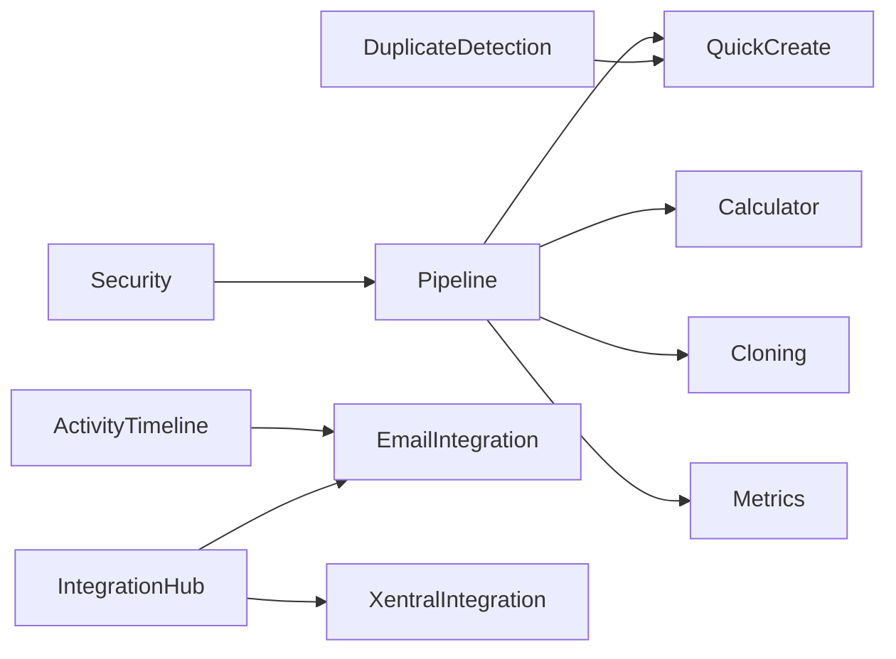

# 🎯 VOLLSTÄNDIGE Feature-Reihenfolge mit ALLEN Features

**Erstellt:** 18.07.2025  
**Status:** Komplette Sequenz inkl. FC-013 bis FC-020  
**Prinzipien:** Abhängigkeiten → Quick Wins → Funktionale Vollständigkeit → Business Value

## 📋 MASTER FEATURE SEQUENZ

### 🔥 **WOCHE 1-2: Foundation & Core Pipeline**

#### Tag 1: Security Foundation (1 Tag) ✅ 85% FERTIG
```typescript
// Blockiert ALLES - muss zuerst!
1. Keycloak Login/Logout ✅ FERTIG
2. JWT Security Context Backend ✅ FERTIG
3. Tests reaktivieren 🔄 TODO-024/028
```
**Output:** Alle APIs secured, User-Context verfügbar

#### Tag 2-5: Opportunity Pipeline (4 Tage) 🆕 M4
```typescript
// Das HERZSTÜCK - mit integrierter Bonitätsprüfung!
4. Opportunity Entity & API (1 Tag)
5. Pipeline UI mit Drag&Drop (2 Tage)
6. FC-011 Bonitätsprüfung Integration (1 Tag)
```
**Output:** Funktionsfähige Pipeline mit Credit Check

#### Tag 6-7: Quick Wins Implementation (2 Tage) 🆕 FC-020
```typescript
// Sofortige Produktivitätssteigerung!
7. Keyboard Shortcuts Framework (0.5 Tag)
8. Smart Search Parser (0.5 Tag)
9. Bulk Actions für Opportunities (0.5 Tag)
10. Excel Export Engine (0.5 Tag)
```
**Output:** Power-User Features aktiv

#### Tag 8-9: Duplicate Detection (2 Tage) 🆕 FC-013
```typescript
// Datenqualität von Anfang an!
11. Fuzzy Matching Backend Service (1 Tag)
12. Duplicate Warning UI (1 Tag)
```
**Output:** Keine doppelten Kunden mehr

#### Tag 10-12: Quick Create FAB (3 Tage) 🔄 M2
```typescript
// NACH Pipeline - braucht Customer & Opportunity Entities!
13. Floating Action Button in MainLayoutV2 (0.5 Tag)
14. Quick Create Modals (Customer/Opportunity) (1.5 Tage)
15. Smart Defaults & Context-Awareness (1 Tag)
```
**Output:** Produktivitäts-Boost durch schnelle Erfassung

---

### 🚀 **WOCHE 3-4: Process & Data Quality**

#### Tag 13-15: Activity Timeline (3 Tage) 🆕 FC-014
```typescript
// 360° Kundensicht
16. Activity Entity & Service (1 Tag)
17. Timeline UI Component (1 Tag)
18. Integration mit Email/Phone/Calendar (1 Tag)
```
**Output:** Vollständige Kundenhistorie

#### Tag 16-17: Opportunity Cloning (2 Tage) 🆕 FC-016
```typescript
// Quick Win für Folgegeschäfte
19. Clone Service & API (1 Tag)
20. Clone UI mit Smart Templates (1 Tag)
```
**Output:** 80% Zeitersparnis bei Renewals

#### Tag 18-20: Calculator Integration (3 Tage) 🔄 M8
```typescript
// JETZT macht Calculator Sinn - nach Pipeline!
21. Calculator Modal in Stage "Angebot"
22. Context-Passing von Opportunity
23. PDF-Generator Erweiterung
```
**Output:** Vollständiger Angebotsprozess

#### Tag 21-23: Sales Metrics Dashboard (3 Tage) 🆕 FC-019
```typescript
// Management braucht Insights!
24. Metrics Calculation Engine (1 Tag)
25. Dashboard UI Components (1 Tag)
26. Real-time Alerts System (1 Tag)
```
**Output:** Sales Velocity, Win Rates, Trends

---

### 📱 **WOCHE 5-6: Mobile & Communication**

#### Tag 24-28: Mobile PWA (5 Tage) 🆕 FC-018
```typescript
// Außendienst Support
27. PWA Setup + Service Worker (1 Tag)
28. Offline Sync Manager (1 Tag)
29. Visitenkarten Scanner (1 Tag)
30. Voice-to-Text Integration (1 Tag)
31. Mobile UI Optimization (1 Tag)
```
**Output:** Vollständige Mobile-Lösung

#### Tag 29-31: Deal Loss Analysis (3 Tage) 🆕 FC-015
```typescript
// Aus Niederlagen lernen
32. Loss Analysis Modal (1 Tag)
33. Quarterly Reports (1 Tag)
34. Competitor Intelligence (1 Tag)
```
**Output:** Systematisches Lernen aus Verlusten

#### Tag 32-40: Integration Hub (8-10 Tage) 🆕 FC-021
```typescript
// KRITISCH: Muss VOR allen anderen Integrationen kommen!
35. Core Integration Registry (2 Tage)
36. Adapter Pattern Implementation (2 Tage)
37. Monitoring Dashboard (2 Tage)
38. Webhook Management (1 Tag)
39. Error Recovery & Retry Logic (1 Tag)
40. Testing mit Mock-Integration (1-2 Tage)
```
**Output:** Zentrale Integration Platform bereit für alle Schnittstellen

---

### 💎 **WOCHE 7-8: UI Enhancement & Team Features**

#### Tag 41-48: UI Foundation Enhancement (8 Tage) 🟡 50% FERTIG
```typescript
// Sales Command Center intelligent erweitern!
41. M3 Sales Cockpit KI-Integration (3 Tage)
42. M1 Navigation Rolle-basiert (2 Tage)
43. M7 Settings Tab-Inhalte (3 Tage)
```
**Output:** Intelligente 3-Spalten Oberfläche mit KI

#### Tag 49-51: Team-Kommunikation (3 Tage) 🔄 FC-012
```typescript
44. Chat-System pro Kunde/Opportunity
45. @mentions & Notifications
46. Activity Feed Integration
```
**Output:** Team-Kollaboration aktiv

#### Tag 52-53: Permissions System (2 Tage) 🔄 FC-009
```typescript
// KRITISCH für Multi-User System
47. Permission Tables & Entities (1 Tag)
48. Role-Based Access Control (1 Tag)
```
**Output:** Sichere Multi-User Basis

---

### 📊 **MONAT 2: Analytics & Integrations**

#### Woche 9: Advanced Features
- **FC-004 Verkäuferschutz** (4 Tage)
- **FC-010 Chef-Dashboard** (4 Tage)
- **M6 Analytics & Reports** (5 Tage)

#### Woche 10-11: Integration Platform & First Integrations
- **FC-003 E-Mail Integration** (5 Tage) - JETZT mit Integration Hub Patterns!
- **FC-005 Xentral Integration** (3 Tage) - Reduziert von 5 auf 3 Tage dank Hub!
- **FC-008 Customer Import** (5 Tage) - Reduziert von 10 auf 5 Tage dank Hub!
- **Calendar & Phone Integration** (2 Tage) - Reduziert von 3 auf 2 Tage!

#### Woche 11-12: Customer Experience
- **M5 Customer Management Refactor** (3 Tage)
- **Dark Mode** (2 Tage)
- **Advanced Search & Filters** (3 Tage)

---

### 🎮 **MONAT 3: Excellence & Innovation**

#### Woche 13-14: Gamification & AI
- **FC-017 Sales Gamification** (10 Tage)
- **KI Features** (Lead Scoring, Next Best Action)
- **Predictive Analytics**

#### Woche 15-16: Enterprise Features
- **Advanced Security/2FA** (3 Tage)
- **DevOps & Monitoring** (5 Tage)
- **Backup & Recovery** (3 Tage)
- **Multi-Tenant Support**

---

## 🎯 WARUM DIESE REIHENFOLGE?

### 1. **Quick Wins zuerst:**
- **Woche 1:** Pipeline + Keyboard Shortcuts = sofort produktiver
- **Woche 2:** Duplicate Detection + Activity Timeline = bessere Datenqualität
- **FC-020 Quick Wins** direkt nach Pipeline für maximalen Impact

### 2. **Logische Abhängigkeiten:**


### 3. **Business Value Maximierung:**
1. **Sofort:** Opportunity Management + Produktivitäts-Tools
2. **Woche 2:** Datenqualität + Kundenkontext
3. **Woche 3-4:** Mobile für Außendienst
4. **Monat 2+:** Skalierung & Innovation
5. **Integration Hub:** Reduziert Aufwand für alle weiteren Integrationen um 70%

### 4. **Risiko-Minimierung:**
- Duplicate Detection früh = saubere Daten von Anfang an
- Integration Hub vor weiteren Integrationen = einheitliche Patterns
- Mobile PWA vor Desktop-Refinements = Außendienst nicht vergessen
- Metrics früh = Management Buy-In

---

## 📊 Neue Meilenstein-Übersicht

| Zeitpunkt | Was ist fertig | Business Impact |
|-----------|----------------|-----------------|
| **Tag 5** | Pipeline + Bonitätsprüfung | Sales-Prozess läuft |
| **Tag 7** | Quick Wins (Shortcuts, Excel) | 50% schnellere Bedienung |
| **Tag 9** | Duplicate Detection | Saubere Kundendaten |
| **Tag 15** | Activity Timeline | Vollständiger Kontext |
| **Tag 23** | Sales Metrics Dashboard | Management Insights |
| **Tag 28** | Mobile PWA | Außendienst voll ausgestattet |
| **Tag 40** | Integration Hub | **Alle Integrationen 70% schneller** |
| **Monat 1** | Core CRM komplett | **VOLL PRODUKTIV** |
| **Monat 2** | Integrationen + Analytics | **ENTERPRISE READY** |
| **Monat 3** | Gamification + AI | **MARKTFÜHREND** |

---

## ✅ Vorteile der neuen Sequenz:

1. **FC-020 Quick Wins** direkt nach Pipeline = sofortiger Nutzen
2. **FC-013 Duplicate Detection** früh = Datenqualität von Anfang an
3. **FC-021 Integration Hub VOR allen Integrationen** = 70% Zeitersparnis bei ALLEN weiteren Integrationen
4. **FC-014 Activity Timeline** vor Email = bessere Integration
5. **FC-018 Mobile PWA** in Woche 5-6 = Außendienst nicht vernachlässigt
6. **FC-019 Metrics** früh = Management sieht Fortschritt

---

## 🚀 EMPFEHLUNG: 

**Starte SOFORT mit M4 Opportunity Pipeline**, dann direkt **FC-020 Quick Wins** für maximalen Impact!

Die UI Foundation Entscheidungen sind geklärt:
- ✅ D1: OpenAI API
- ✅ D2: Polling für MVP
- ✅ D3: Sidebar (existiert bereits)

**Keine Blocker mehr - Full Speed ahead!** 🚀