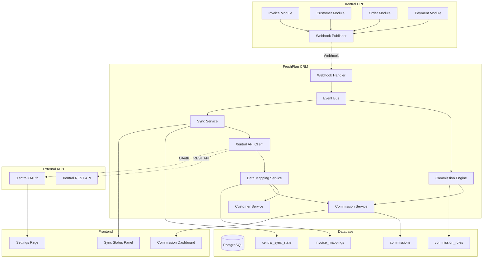

# FC-005: Technisches Konzept - Xentral Integration & Provisions-Engine

**Feature Code:** FC-005  
**Datum:** 2025-07-20  
**Status:** Draft  
**Autor:** Claude  
**Reviewer:** TBD  

## 📋 Inhaltsverzeichnis

1. [Zusammenfassung](#zusammenfassung)
2. [Ziel und Geschäftswert](#ziel-und-geschäftswert)
3. [Technische Architektur](#technische-architektur)
4. [Backend-Implementierung](#backend-implementierung)
5. [Frontend-Implementierung](#frontend-implementierung)
6. [Implementierungsstrategie](#implementierungsstrategie)
7. [Entscheidungs-Log](#entscheidungs-log)
8. [Risiken und Mitigationen](#risiken-und-mitigationen)
9. [Zeitschätzung](#zeitschätzung)

## Zusammenfassung

FC-005 implementiert eine vollständige Integration mit dem Xentral ERP-System zur automatischen Provisionsberechnung und Daten-Synchronisation. Das System verwendet Webhooks für Echtzeit-Updates und REST API Calls für Batch-Synchronisation, um manuelle Provisionsfehler zu eliminieren und Sales-Prozesse zu automatisieren.

## Ziel und Geschäftswert

### Geschäftsziele
- **Provisionsfehler eliminieren**: 0 manuelle Fehler durch automatische Berechnung
- **Reaktionszeit reduzieren**: <2 Sekunden von Zahlung zu Provisionsbenachrichtigung
- **Prozessautomatisierung**: Vollständiger Datenfluss ohne manuelle Eingriffe
- **Transparenz schaffen**: Real-time Einblick in Umsatz und Provisionen

### Technische Ziele
- **Performance**: <100ms API Response Times für Sync-Operations
- **Verfügbarkeit**: 99.9% mit Fallback-Mechanismen bei API-Ausfällen
- **Datenintegrität**: Eventual Consistency mit Conflict Resolution
- **Sicherheit**: OAuth 2.0 + Webhook Signature Validation

## Technische Architektur

### System-Übersicht



### Datenfluss-Szenarien

**Szenario 1: Zahlung eingegangen (Real-time)**
1. Zahlung in Xentral → Webhook an CRM
2. Webhook Handler → Event Bus → Commission Engine
3. Commission Engine → Provision berechnen → Notification

**Szenario 2: Batch-Synchronisation (Fallback)**
1. Scheduled Job → Xentral API Client
2. API Client → Invoice Data → Data Mapping Service
3. Mapping Service → Commission Service → Database

**Szenario 3: Neuer Auftrag (CRM → Xentral)**
1. Deal Won in CRM → Order Creation Event
2. Xentral API Client → Create Order in Xentral
3. Response → Update Deal with Xentral Order ID

## Backend-Implementierung

### 1. API Endpoints

**Webhook Endpoints:**
```java
@Path("/api/webhooks/xentral")
@ApplicationScoped
public class XentralWebhookResource {
    
    @Inject
    XentralWebhookValidator webhookValidator;
    
    @Inject
    Event<XentralWebhookEvent> webhookEvents;
    
    @POST
    @Consumes(MediaType.APPLICATION_JSON)
    public Response handleWebhook(
        @HeaderParam("X-Xentral-Signature") String signature,
        @HeaderParam("X-Xentral-Event") String eventType,
        XentralWebhookPayload payload
    ) {
        try {
            // Validate webhook signature
            if (!webhookValidator.isValid(signature, payload)) {
                return Response.status(Response.Status.UNAUTHORIZED)
                    .entity("Invalid signature")
                    .build();
            }
            
            // Fire async event for processing
            var event = XentralWebhookEvent.builder()
                .eventType(eventType)
                .payload(payload)
                .receivedAt(Instant.now())
                .build();
            
            webhookEvents.fireAsync(event);
            
            return Response.ok()
                .entity(Map.of("status", "received", "timestamp", Instant.now()))
                .build();
                
        } catch (Exception e) {
            Log.error("Error processing Xentral webhook", e);
            return Response.status(Response.Status.INTERNAL_SERVER_ERROR)
                .entity("Processing error")
                .build();
        }
    }
}
```

**Management Endpoints:**
```java
@Path("/api/admin/xentral")
@RolesAllowed({"admin", "manager"})
public class XentralManagementResource {
    
    @Inject
    XentralSyncService syncService;
    
    @Inject
    XentralConfigService configService;
    
    @POST
    @Path("/sync/manual")
    public Response triggerManualSync(
        @QueryParam("since") String since,
        @QueryParam("type") String syncType
    ) {
        syncService.triggerManualSync(since, syncType);
        return Response.accepted().build();
    }
    
    @GET
    @Path("/sync/status")
    public XentralSyncStatusResponse getSyncStatus() {
        return syncService.getSyncStatus();
    }
    
    @POST
    @Path("/config/test")
    public Response testConnection() {
        boolean isConnected = configService.testConnection();
        return Response.ok(Map.of("connected", isConnected)).build();
    }
}
```

### 2. Datenmodell

**Commission Entity:**
```java
@Entity
@Table(name = "commissions")
public class Commission {
    @Id
    private UUID id;
    
    @Column(name = "sales_rep_id", nullable = false)
    private UUID salesRepId;
    
    @Column(name = "customer_id", nullable = false)
    private UUID customerId;
    
    @Column(name = "xentral_invoice_id", nullable = false)
    private String xentralInvoiceId;
    
    @Column(name = "invoice_amount", nullable = false, precision = 10, scale = 2)
    private BigDecimal invoiceAmount;
    
    @Column(name = "commission_amount", nullable = false, precision = 10, scale = 2)
    private BigDecimal commissionAmount;
    
    @Column(name = "commission_rate", nullable = false, precision = 5, scale = 4)
    private BigDecimal commissionRate; // e.g., 0.0300 für 3%
    
    @Column(name = "payment_date")
    private LocalDate paymentDate;
    
    @Column(name = "commission_status")
    @Enumerated(EnumType.STRING)
    private CommissionStatus status; // PENDING, CALCULATED, PAID, CANCELLED
    
    @Column(name = "xentral_data")
    @Type(type = "jsonb")
    private Map<String, Object> xentralData;
    
    @CreationTimestamp
    private Instant createdAt;
    
    @UpdateTimestamp
    private Instant updatedAt;
}
```

**Xentral Sync State:**
```java
@Entity
@Table(name = "xentral_sync_state")
public class XentralSyncState {
    @Id
    private String syncType; // "invoices", "customers", "orders"
    
    @Column(name = "last_sync_timestamp", nullable = false)
    private Instant lastSyncTimestamp;
    
    @Column(name = "last_successful_sync")
    private Instant lastSuccessfulSync;
    
    @Column(name = "sync_status")
    @Enumerated(EnumType.STRING)
    private SyncStatus status; // IDLE, RUNNING, ERROR, COMPLETED
    
    @Column(name = "error_message")
    private String errorMessage;
    
    @Column(name = "records_processed")
    private Integer recordsProcessed;
    
    @Column(name = "errors_count")
    private Integer errorsCount;
    
    @UpdateTimestamp
    private Instant updatedAt;
}
```

**Commission Rules:**
```java
@Entity
@Table(name = "commission_rules")
public class CommissionRule {
    @Id
    private UUID id;
    
    @Column(name = "rule_name", nullable = false)
    private String ruleName;
    
    @Column(name = "customer_type")
    private String customerType; // "standard", "key_account", "new_customer"
    
    @Column(name = "product_category")
    private String productCategory;
    
    @Column(name = "commission_rate", nullable = false, precision = 5, scale = 4)
    private BigDecimal commissionRate;
    
    @Column(name = "min_order_value", precision = 10, scale = 2)
    private BigDecimal minOrderValue;
    
    @Column(name = "max_order_value", precision = 10, scale = 2)
    private BigDecimal maxOrderValue;
    
    @Column(name = "valid_from", nullable = false)
    private LocalDate validFrom;
    
    @Column(name = "valid_until")
    private LocalDate validUntil;
    
    @Column(name = "is_active")
    private boolean active = true;
    
    @Column(name = "priority")
    private Integer priority; // For rule precedence
}
```

### 3. Business Logic

**Commission Engine:**
```java
@ApplicationScoped
public class CommissionEngine {
    
    @Inject
    CommissionRuleRepository ruleRepository;
    
    @Inject
    CommissionRepository commissionRepository;
    
    @Inject
    CustomerService customerService;
    
    @Inject
    NotificationService notificationService;
    
    public void onPaymentReceived(@ObservesAsync PaymentReceivedEvent event) {
        try {
            // Find responsible sales rep
            UUID salesRepId = findResponsibleSalesRep(event.getCustomerId());
            if (salesRepId == null) {
                Log.warn("No sales rep found for customer: " + event.getCustomerId());
                return;
            }
            
            // Calculate commission
            CommissionCalculation calculation = calculateCommission(
                event.getInvoiceAmount(),
                event.getCustomerId(),
                event.getProductCategory()
            );
            
            // Create commission record
            Commission commission = Commission.builder()
                .salesRepId(salesRepId)
                .customerId(event.getCustomerId())
                .xentralInvoiceId(event.getXentralInvoiceId())
                .invoiceAmount(event.getInvoiceAmount())
                .commissionAmount(calculation.getAmount())
                .commissionRate(calculation.getRate())
                .paymentDate(event.getPaymentDate())
                .status(CommissionStatus.CALCULATED)
                .xentralData(event.getXentralData())
                .build();
            
            commissionRepository.persist(commission);
            
            // Send notification
            notificationService.notifySalesRep(
                salesRepId,
                "Neue Provision berechnet: " + calculation.getAmount() + "€",
                commission.getId()
            );
            
            Log.info("Commission calculated: " + calculation.getAmount() + 
                    " for sales rep: " + salesRepId);
                    
        } catch (Exception e) {
            Log.error("Error processing payment for commission", e);
            // Could trigger retry mechanism or alert
        }
    }
    
    private CommissionCalculation calculateCommission(
        BigDecimal invoiceAmount,
        UUID customerId,
        String productCategory
    ) {
        // Find applicable rules (ordered by priority)
        List<CommissionRule> rules = ruleRepository
            .findApplicableRules(customerId, productCategory, invoiceAmount);
        
        if (rules.isEmpty()) {
            // Default rule: 3%
            return CommissionCalculation.builder()
                .amount(invoiceAmount.multiply(new BigDecimal("0.03")))
                .rate(new BigDecimal("0.03"))
                .appliedRuleName("Default 3%")
                .build();
        }
        
        CommissionRule rule = rules.get(0); // Highest priority
        BigDecimal commissionAmount = invoiceAmount.multiply(rule.getCommissionRate());
        
        return CommissionCalculation.builder()
            .amount(commissionAmount)
            .rate(rule.getCommissionRate())
            .appliedRuleName(rule.getRuleName())
            .ruleId(rule.getId())
            .build();
    }
    
    private UUID findResponsibleSalesRep(UUID customerId) {
        // Logic to find sales rep:
        // 1. Check current opportunity owner
        // 2. Check customer account manager
        // 3. Check last activity creator
        // 4. Fallback to default rep
        
        return customerService.getResponsibleSalesRep(customerId);
    }
}
```

**Xentral API Client:**
```java
@ApplicationScoped
public class XentralApiClient {
    
    @Inject
    @RestClient
    XentralRestClient restClient;
    
    @Inject
    XentralAuthService authService;
    
    public List<XentralInvoice> getInvoicesSince(Instant since) {
        try {
            String accessToken = authService.getAccessToken();
            
            return restClient.getInvoices(
                "Bearer " + accessToken,
                since.toString(),
                100 // page size
            );
            
        } catch (Exception e) {
            Log.error("Error fetching invoices from Xentral", e);
            throw new XentralApiException("Failed to fetch invoices", e);
        }
    }
    
    public XentralOrder createOrder(CreateOrderRequest request) {
        try {
            String accessToken = authService.getAccessToken();
            
            XentralOrderPayload payload = XentralOrderPayload.builder()
                .customerId(request.getXentralCustomerId())
                .items(mapOrderItems(request.getItems()))
                .totalAmount(request.getTotalAmount())
                .notes(request.getNotes())
                .build();
            
            return restClient.createOrder("Bearer " + accessToken, payload);
            
        } catch (Exception e) {
            Log.error("Error creating order in Xentral", e);
            throw new XentralApiException("Failed to create order", e);
        }
    }
    
    public List<XentralCustomer> getCustomersSince(Instant since) {
        try {
            String accessToken = authService.getAccessToken();
            
            return restClient.getCustomers(
                "Bearer " + accessToken,
                since.toString(),
                100
            );
            
        } catch (Exception e) {
            Log.error("Error fetching customers from Xentral", e);
            throw new XentralApiException("Failed to fetch customers", e);
        }
    }
}
```

**Sync Service:**
```java
@ApplicationScoped
public class XentralSyncService {
    
    @Inject
    XentralApiClient apiClient;
    
    @Inject
    XentralSyncStateRepository syncStateRepository;
    
    @Inject
    DataMappingService mappingService;
    
    @Scheduled(every = "6h")
    @Transactional
    public void scheduledSync() {
        Log.info("Starting scheduled Xentral sync");
        
        syncInvoices();
        syncCustomers();
        syncOrders();
        
        Log.info("Scheduled Xentral sync completed");
    }
    
    @Transactional
    public void syncInvoices() {
        try {
            XentralSyncState state = syncStateRepository
                .findById("invoices")
                .orElse(createInitialSyncState("invoices"));
            
            updateSyncStatus(state, SyncStatus.RUNNING);
            
            List<XentralInvoice> invoices = apiClient
                .getInvoicesSince(state.getLastSyncTimestamp());
            
            int processed = 0;
            int errors = 0;
            
            for (XentralInvoice invoice : invoices) {
                try {
                    mappingService.processInvoice(invoice);
                    processed++;
                } catch (Exception e) {
                    Log.error("Error processing invoice: " + invoice.getId(), e);
                    errors++;
                }
            }
            
            // Update sync state
            state.setLastSyncTimestamp(Instant.now());
            state.setLastSuccessfulSync(Instant.now());
            state.setRecordsProcessed(processed);
            state.setErrorsCount(errors);
            state.setStatus(SyncStatus.COMPLETED);
            
            syncStateRepository.persist(state);
            
            Log.info("Invoice sync completed: {} processed, {} errors", processed, errors);
            
        } catch (Exception e) {
            Log.error("Critical error in invoice sync", e);
            updateSyncError("invoices", e.getMessage());
        }
    }
    
    private void updateSyncStatus(XentralSyncState state, SyncStatus status) {
        state.setStatus(status);
        state.setUpdatedAt(Instant.now());
        syncStateRepository.persist(state);
    }
    
    private void updateSyncError(String syncType, String errorMessage) {
        XentralSyncState state = syncStateRepository.findById(syncType)
            .orElse(createInitialSyncState(syncType));
        
        state.setStatus(SyncStatus.ERROR);
        state.setErrorMessage(errorMessage);
        state.setUpdatedAt(Instant.now());
        
        syncStateRepository.persist(state);
    }
}
```

### 4. Datenbank-Änderungen

**Migration V1.0__create_xentral_integration_tables.sql:**
```sql
-- Commissions Table
CREATE TABLE commissions (
    id UUID PRIMARY KEY DEFAULT gen_random_uuid(),
    sales_rep_id UUID NOT NULL REFERENCES users(id),
    customer_id UUID NOT NULL REFERENCES customers(id),
    xentral_invoice_id VARCHAR(100) NOT NULL,
    invoice_amount DECIMAL(10,2) NOT NULL CHECK (invoice_amount >= 0),
    commission_amount DECIMAL(10,2) NOT NULL CHECK (commission_amount >= 0),
    commission_rate DECIMAL(5,4) NOT NULL CHECK (commission_rate >= 0 AND commission_rate <= 1),
    payment_date DATE,
    commission_status VARCHAR(20) NOT NULL DEFAULT 'PENDING',
    xentral_data JSONB,
    created_at TIMESTAMP WITH TIME ZONE DEFAULT NOW(),
    updated_at TIMESTAMP WITH TIME ZONE DEFAULT NOW()
);

-- Xentral Sync State Table
CREATE TABLE xentral_sync_state (
    sync_type VARCHAR(50) PRIMARY KEY,
    last_sync_timestamp TIMESTAMP WITH TIME ZONE NOT NULL DEFAULT NOW(),
    last_successful_sync TIMESTAMP WITH TIME ZONE,
    sync_status VARCHAR(20) NOT NULL DEFAULT 'IDLE',
    error_message TEXT,
    records_processed INTEGER DEFAULT 0,
    errors_count INTEGER DEFAULT 0,
    updated_at TIMESTAMP WITH TIME ZONE DEFAULT NOW()
);

-- Commission Rules Table
CREATE TABLE commission_rules (
    id UUID PRIMARY KEY DEFAULT gen_random_uuid(),
    rule_name VARCHAR(255) NOT NULL,
    customer_type VARCHAR(50),
    product_category VARCHAR(100),
    commission_rate DECIMAL(5,4) NOT NULL CHECK (commission_rate >= 0 AND commission_rate <= 1),
    min_order_value DECIMAL(10,2),
    max_order_value DECIMAL(10,2),
    valid_from DATE NOT NULL,
    valid_until DATE,
    is_active BOOLEAN DEFAULT TRUE,
    priority INTEGER DEFAULT 0,
    created_at TIMESTAMP WITH TIME ZONE DEFAULT NOW()
);

-- Invoice Mappings for deduplication
CREATE TABLE invoice_mappings (
    xentral_invoice_id VARCHAR(100) PRIMARY KEY,
    crm_commission_id UUID REFERENCES commissions(id),
    processed_at TIMESTAMP WITH TIME ZONE DEFAULT NOW(),
    checksum VARCHAR(64) -- For change detection
);

-- Xentral Configuration
CREATE TABLE xentral_config (
    id UUID PRIMARY KEY DEFAULT gen_random_uuid(),
    api_base_url VARCHAR(255) NOT NULL,
    client_id VARCHAR(100) NOT NULL,
    webhook_secret VARCHAR(255) NOT NULL,
    is_active BOOLEAN DEFAULT TRUE,
    created_at TIMESTAMP WITH TIME ZONE DEFAULT NOW(),
    updated_at TIMESTAMP WITH TIME ZONE DEFAULT NOW()
);

-- Indexes for Performance
CREATE INDEX idx_commissions_sales_rep_date 
    ON commissions(sales_rep_id, payment_date DESC);

CREATE INDEX idx_commissions_customer_status 
    ON commissions(customer_id, commission_status);

CREATE INDEX idx_commissions_xentral_invoice 
    ON commissions(xentral_invoice_id);

CREATE INDEX idx_commission_rules_active_priority 
    ON commission_rules(is_active, priority DESC) WHERE is_active = TRUE;

CREATE INDEX idx_commission_rules_customer_type 
    ON commission_rules(customer_type, product_category) WHERE is_active = TRUE;

-- Initial Data
INSERT INTO xentral_sync_state (sync_type, last_sync_timestamp) VALUES
    ('invoices', NOW() - INTERVAL '30 days'),
    ('customers', NOW() - INTERVAL '30 days'),
    ('orders', NOW() - INTERVAL '30 days');

-- Default Commission Rules
INSERT INTO commission_rules (rule_name, commission_rate, valid_from, priority) VALUES
    ('Standard Commission', 0.0300, CURRENT_DATE, 0),
    ('New Customer Bonus', 0.0500, CURRENT_DATE, 10),
    ('Key Account Premium', 0.0400, CURRENT_DATE, 5);
```

## Frontend-Implementierung

### 1. Komponenten-Struktur

Da FC-005 ein reines Backend-Feature ist, beschränkt sich die Frontend-Implementation auf Administrative UI und Dashboard-Integration.

**Commission Dashboard Component:**
```typescript
interface CommissionDashboardProps {
  salesRepId?: string;
  timeRange?: DateRange;
}

export const CommissionDashboard: React.FC<CommissionDashboardProps> = ({
  salesRepId,
  timeRange = { from: startOfMonth(new Date()), to: new Date() }
}) => {
  const { data: commissions, isLoading } = useCommissions(salesRepId, timeRange);
  const { data: summary } = useCommissionSummary(salesRepId, timeRange);
  
  if (isLoading) return <CommissionSkeleton />;
  
  return (
    <div className="space-y-6">
      <div className="grid grid-cols-3 gap-4">
        <Card>
          <CardHeader className="pb-2">
            <CardTitle className="text-sm font-medium">
              Provisionen Gesamt
            </CardTitle>
          </CardHeader>
          <CardContent>
            <div className="text-2xl font-bold">
              {formatCurrency(summary?.totalCommissions || 0)}
            </div>
            <p className="text-xs text-muted-foreground">
              +{summary?.percentageChange || 0}% vs. Vormonat
            </p>
          </CardContent>
        </Card>
        
        <Card>
          <CardHeader className="pb-2">
            <CardTitle className="text-sm font-medium">
              Offene Provisionen
            </CardTitle>
          </CardHeader>
          <CardContent>
            <div className="text-2xl font-bold">
              {formatCurrency(summary?.pendingCommissions || 0)}
            </div>
            <p className="text-xs text-muted-foreground">
              {summary?.pendingCount || 0} Zahlungen ausstehend
            </p>
          </CardContent>
        </Card>
        
        <Card>
          <CardHeader className="pb-2">
            <CardTitle className="text-sm font-medium">
              Durchschnittliche Rate
            </CardTitle>
          </CardHeader>
          <CardContent>
            <div className="text-2xl font-bold">
              {((summary?.averageRate || 0) * 100).toFixed(1)}%
            </div>
            <p className="text-xs text-muted-foreground">
              Basis: {summary?.transactionsCount || 0} Transaktionen
            </p>
          </CardContent>
        </Card>
      </div>
      
      <Card>
        <CardHeader>
          <CardTitle>Provisions-Timeline</CardTitle>
        </CardHeader>
        <CardContent>
          <DataTable
            columns={commissionColumns}
            data={commissions || []}
            searchPlaceholder="Suche nach Kunde oder Rechnung..."
          />
        </CardContent>
      </Card>
    </div>
  );
};
```

**Xentral Sync Status Component:**
```typescript
export const XentralSyncStatus: React.FC = () => {
  const { data: syncStatus, refetch } = useXentralSyncStatus();
  const { mutate: triggerSync } = useTriggerManualSync();
  
  return (
    <Card>
      <CardHeader className="flex flex-row items-center justify-between">
        <CardTitle>Xentral Synchronisation</CardTitle>
        <Button
          variant="outline"
          size="sm"
          onClick={() => triggerSync()}
          disabled={syncStatus?.isRunning}
        >
          {syncStatus?.isRunning ? (
            <>
              <Loader2 className="mr-2 h-4 w-4 animate-spin" />
              Synchronisiert...
            </>
          ) : (
            <>
              <RefreshCw className="mr-2 h-4 w-4" />
              Manuell synchronisieren
            </>
          )}
        </Button>
      </CardHeader>
      <CardContent>
        <div className="space-y-4">
          {syncStatus?.states.map((state) => (
            <div key={state.syncType} className="flex items-center justify-between">
              <div className="flex items-center gap-2">
                <div className={cn(
                  "w-2 h-2 rounded-full",
                  state.status === 'COMPLETED' && "bg-green-500",
                  state.status === 'RUNNING' && "bg-yellow-500 animate-pulse",
                  state.status === 'ERROR' && "bg-red-500",
                  state.status === 'IDLE' && "bg-gray-400"
                )} />
                <span className="font-medium">{state.syncType}</span>
              </div>
              <div className="text-sm text-muted-foreground">
                {state.lastSuccessfulSync && 
                  formatDistance(new Date(state.lastSuccessfulSync), new Date(), { 
                    addSuffix: true,
                    locale: de
                  })
                }
              </div>
            </div>
          ))}
          
          {syncStatus?.errors && syncStatus.errors.length > 0 && (
            <Alert variant="destructive">
              <AlertTriangle className="h-4 w-4" />
              <AlertTitle>Synchronisation Fehler</AlertTitle>
              <AlertDescription>
                {syncStatus.errors.map((error, index) => (
                  <div key={index} className="text-sm">
                    {error.syncType}: {error.message}
                  </div>
                ))}
              </AlertDescription>
            </Alert>
          )}
        </div>
      </CardContent>
    </Card>
  );
};
```

### 2. State Management

**API Hooks:**
```typescript
export const useCommissions = (
  salesRepId?: string, 
  timeRange?: DateRange
) => {
  return useQuery({
    queryKey: ['commissions', salesRepId, timeRange],
    queryFn: () => api.commissions.getCommissions({ salesRepId, timeRange }),
    staleTime: 5 * 60 * 1000, // 5 minutes
  });
};

export const useCommissionSummary = (
  salesRepId?: string,
  timeRange?: DateRange
) => {
  return useQuery({
    queryKey: ['commission-summary', salesRepId, timeRange],
    queryFn: () => api.commissions.getSummary({ salesRepId, timeRange }),
    staleTime: 10 * 60 * 1000, // 10 minutes
  });
};

export const useXentralSyncStatus = () => {
  return useQuery({
    queryKey: ['xentral-sync-status'],
    queryFn: () => api.xentral.getSyncStatus(),
    refetchInterval: 30 * 1000, // 30 seconds when sync is running
    select: (data) => ({
      isRunning: data.states.some(s => s.status === 'RUNNING'),
      states: data.states,
      errors: data.states
        .filter(s => s.status === 'ERROR')
        .map(s => ({ syncType: s.syncType, message: s.errorMessage }))
    })
  });
};

export const useTriggerManualSync = () => {
  const queryClient = useQueryClient();
  
  return useMutation({
    mutationFn: (params: { syncType?: string; since?: string }) => 
      api.xentral.triggerSync(params),
    onSuccess: () => {
      queryClient.invalidateQueries({ queryKey: ['xentral-sync-status'] });
      toast.success('Synchronisation gestartet');
    },
    onError: (error) => {
      toast.error('Fehler beim Starten der Synchronisation: ' + error.message);
    }
  });
};
```

### 3. UI/UX Design

**Integration in Sales Cockpit:**
```typescript
// Add to M3 Sales Cockpit as Commission Widget
export const CommissionWidget: React.FC<{ userId: string }> = ({ userId }) => {
  const { data: monthlyCommissions } = useCommissions(userId, {
    from: startOfMonth(new Date()),
    to: new Date()
  });
  
  const totalThisMonth = monthlyCommissions?.reduce((sum, c) => 
    sum + c.commissionAmount, 0) || 0;
  
  return (
    <Card className="h-full">
      <CardHeader className="pb-2">
        <CardTitle className="text-lg flex items-center gap-2">
          <Euro className="h-5 w-5" />
          Provisionen
        </CardTitle>
      </CardHeader>
      <CardContent>
        <div className="text-3xl font-bold text-green-600">
          {formatCurrency(totalThisMonth)}
        </div>
        <p className="text-sm text-muted-foreground">
          Dieser Monat ({monthlyCommissions?.length || 0} Zahlungen)
        </p>
        <div className="mt-4">
          <Button variant="outline" size="sm" asChild>
            <Link to="/commissions">Details anzeigen</Link>
          </Button>
        </div>
      </CardContent>
    </Card>
  );
};
```

### 4. Integration

Da FC-005 primär Backend-fokussiert ist, erfolgt die Frontend-Integration hauptsächlich über:

1. **Dashboard Widgets** in M3 Sales Cockpit
2. **Admin Panel** für Sync-Status und Configuration  
3. **Notification Integration** für neue Provisionen
4. **Settings Page** für Xentral-Konfiguration

## Implementierungsstrategie

### Phase 1: Webhook Foundation (2-3 Tage)

#### Sprint 1.1: Webhook Infrastruktur (1.5 Tage)
1. **Tag 1 Vormittag**: 
   - Database Migrations erstellen
   - Webhook Endpoint Setup
   - Signature Validation implementieren
2. **Tag 1 Nachmittag**:
   - Event Bus Integration
   - Basic Webhook Handler
   - Unit Tests für Webhook Validation
3. **Tag 2 Vormittag**:
   - Commission Entity & Repository
   - Commission Engine Grundgerüst
   - Error Handling & Logging

#### Sprint 1.2: Commission Calculation (1.5 Tage)
1. **Tag 2 Nachmittag**:
   - Commission Rules System
   - Basic Calculation Logic
   - Sales Rep Assignment Logic
2. **Tag 3 Vormittag**:
   - Commission Rules Repository
   - Rule Priority & Matching
   - Default Rules Setup
3. **Tag 3 Nachmittag**:
   - Integration Tests für Commission Flow
   - Commission Notification Service
   - Basic Admin Endpoints

### Phase 2: API Client & Sync (3-4 Tage)

#### Sprint 2.1: Xentral API Client (2 Tage)
1. **Tag 4 Vormittag**:
   - OAuth Service für Xentral
   - REST Client Interface
   - API Configuration Management
2. **Tag 4 Nachmittag**:
   - Invoice API Integration
   - Customer API Integration
   - Error Handling & Retry Logic
3. **Tag 5 Vormittag**:
   - Order Creation API
   - Data Mapping Service
   - API Rate Limiting
4. **Tag 5 Nachmittag**:
   - Unit Tests für API Client
   - Mock API für Testing
   - Connection Testing Endpoint

#### Sprint 2.2: Sync Service (2 Tage)
1. **Tag 6 Vormittag**:
   - Sync State Management
   - Scheduled Sync Jobs
   - Batch Processing Logic
2. **Tag 6 Nachmittag**:
   - Manual Sync Triggers
   - Incremental Sync Logic
   - Conflict Resolution
3. **Tag 7 Vormittag**:
   - Sync Monitoring & Alerting
   - Performance Optimization
   - Comprehensive Error Handling
4. **Tag 7 Nachmittag**:
   - Integration Tests für Sync
   - Load Testing für Batch Operations
   - Sync Status API

### Phase 3: Frontend Integration (1-2 Tage)

#### Sprint 3.1: Dashboard Integration (1 Tag)
1. **Tag 8 Vormittag**:
   - Commission Dashboard Component
   - Commission Summary API
   - Data Visualization Components
2. **Tag 8 Nachmittag**:
   - Integration in M3 Sales Cockpit
   - Sync Status Component
   - Admin Panel Basic UI

#### Sprint 3.2: Configuration & Polish (1 Tag)
1. **Tag 9 Vormittag**:
   - Xentral Configuration UI
   - Connection Testing Frontend
   - Commission Rules Management
2. **Tag 9 Nachmittag**:
   - E2E Tests für Complete Flow
   - Performance Testing
   - Documentation & User Guide

### Phase 4: Production Setup (1 Tag)

#### Sprint 4.1: Deployment & Monitoring (1 Tag)
1. **Tag 10 Vormittag**:
   - Production Webhook Endpoint Setup
   - Xentral Webhook Registration
   - Security Review & Hardening
2. **Tag 10 Nachmittag**:
   - Monitoring & Alerting Setup
   - Production Testing mit real Data
   - Go-Live Checklist & Training

## Entscheidungs-Log

### 2025-07-20 - Webhook vs. Polling Architecture
**Entscheidung**: Hybrid - Webhooks für Real-time + Scheduled Polling als Fallback  
**Begründung**: Webhooks bieten <2s Latenz, Polling sichert Vollständigkeit bei Webhook-Ausfällen  
**Impact**: Höhere Architektur-Komplexität aber garantierte Datenintegrität  
**Alternativen**: Nur Webhooks (Risiko Missing Events), Nur Polling (Höhere Latenz)  
**Entscheider**: Claude basierend auf Reliability-Anforderungen

### 2025-07-20 - Commission Rules Storage
**Entscheidung**: Database-basierte Rules mit Priority System  
**Begründung**: Flexibilität für komplexe Provisionsstrukturen ohne Code-Änderungen  
**Impact**: Runtime Rule Changes möglich, UI für Rule Management erforderlich  
**Alternativen**: Hard-coded Rules (unflexibel), External Rules Engine (Overkill)  
**Entscheider**: Claude basierend auf Business-Flexibilität

### 2025-07-20 - Data Storage Strategy
**Entscheidung**: Local Commission Records + Xentral Data Cache  
**Begründung**: Performance für Reporting + Offline-Capability bei API-Ausfällen  
**Impact**: Zusätzlicher Storage aber autonome CRM-Operation  
**Alternativen**: Pure API-based (Xentral Dependency), Event Sourcing (zu komplex)  
**Entscheider**: Claude basierend auf Availability-Anforderungen

## Risiken und Mitigationen

### Risiko 1: Xentral API Verfügbarkeit
**Wahrscheinlichkeit**: Mittel  
**Impact**: Hoch  
**Mitigation**:
- Fallback auf Scheduled Sync alle 6h
- Local Data Caching für kritische Operations
- API Health Monitoring mit Alerts
- Graceful Degradation bei API-Ausfällen

### Risiko 2: Webhook Delivery Failures
**Wahrscheinlichkeit**: Hoch  
**Impact**: Mittel  
**Mitigation**:
- Webhook Signature Validation
- Idempotent Webhook Processing
- Retry Mechanism mit exponential Backoff
- Scheduled Sync als Safety Net

### Risiko 3: Commission Calculation Errors
**Wahrscheinlichkeit**: Niedrig  
**Impact**: Hoch  
**Mitigation**:
- Comprehensive Unit Tests für alle Rules
- Commission Audit Log mit Manual Review
- Rollback Mechanism für incorrect Calculations
- Separate Approval Workflow für high-value Commissions

### Risiko 4: OAuth Token Expiration
**Wahrscheinlichkeit**: Mittel  
**Impact**: Mittel  
**Mitigation**:
- Automatic Token Refresh Logic
- Token Expiry Monitoring
- Fallback Authentication Methods
- Admin Alerts bei Auth Failures

## Zeitschätzung

**Gesamt-Aufwand**: 8-10 Tage

- **Backend**: 6-7 Tage
  - Webhook Infrastructure: 1.5 Tage
  - Commission Engine: 1.5 Tage
  - API Client: 2 Tage
  - Sync Service: 2 Tage
- **Frontend**: 1-2 Tage
  - Dashboard Integration: 1 Tag
  - Admin UI: 1 Tag
- **Integration & Testing**: 1 Tag
  - E2E Testing: 0.5 Tage
  - Production Setup: 0.5 Tage

**Puffer**: +1 Tag für Xentral API Dokumentations-Lücken und Production Webhook Setup

---

**Status-Updates**:
- 2025-07-20: Technisches Konzept erstellt (Draft)
- TBD: Review durch Team Lead + Xentral API Documentation Review
- TBD: OAuth Credentials Setup mit Xentral
- TBD: Implementierung Start