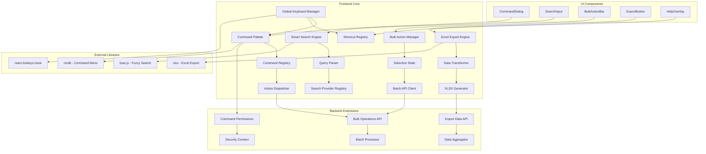

# FC-020: Technisches Konzept - Quick Wins Collection

**Feature Code:** FC-020  
**Datum:** 2025-07-20  
**Status:** Draft  
**Autor:** Claude  
**Reviewer:** TBD  

## 📋 Inhaltsverzeichnis

1. [Zusammenfassung](#zusammenfassung)
2. [Ziel und Geschäftswert](#ziel-und-geschäftswert)
3. [Technische Architektur](#technische-architektur)
4. [Backend-Implementierung](#backend-implementierung)
5. [Frontend-Implementierung](#frontend-implementierung)
6. [Implementierungsstrategie](#implementierungsstrategie)
7. [Entscheidungs-Log](#entscheidungs-log)
8. [Risiken und Mitigationen](#risiken-und-mitigationen)
9. [Zeitschätzung](#zeitschätzung)

## Zusammenfassung

FC-020 implementiert eine Sammlung von 5 Power-User Features zur drastischen Produktivitätssteigerung: Command Palette (Cmd+K), Keyboard Shortcuts, Smart Search, Bulk Actions und Excel Export. Das System ist Frontend-fokussiert mit minimaler Backend-Erweiterung und zielt auf 437 Stunden Zeitersparnis pro User/Jahr bei nur 2 Tagen Entwicklungsaufwand.

## Ziel und Geschäftswert

### Geschäftsziele
- **Produktivitätssteigerung**: 105 Min/Tag Zeitersparnis pro User (ROI: 437h/Jahr)
- **User Adoption**: Power-User Features ohne Einarbeitungszeit
- **Workflow-Optimierung**: Maus-freie Navigation für Expert Users
- **Datenexport-Automatisierung**: One-Click Excel Export reduziert manuellen Aufwand

### Technische Ziele
- **Performance**: <50ms Command Palette Response Time
- **Usability**: Intuitive Keyboard Navigation ohne Training
- **Erweiterbarkeit**: Plugin-Architecture für neue Commands
- **Kompatibilität**: Cross-Platform Keyboard Support (Windows/Mac)

## Technische Architektur

### System-Übersicht



### Command Architecture (Claude-optimized)

**Modular Command System:**
```typescript
interface Command {
  id: string;
  label: string;
  icon: string;
  category: CommandCategory;
  shortcuts?: string[];
  permissions?: string[];
  action: CommandAction;
  availability?: AvailabilityCondition;
}

enum CommandCategory {
  NAVIGATION = 'navigation',
  CREATION = 'creation',
  ACTIONS = 'actions',
  EXPORT = 'export',
  SETTINGS = 'settings'
}

// Plugin-basierte Architektur für Erweiterbarkeit
interface CommandProvider {
  getCommands(): Command[];
  handleCommand(commandId: string, context: CommandContext): Promise<void>;
}
```

**Search Provider Architecture:**
```typescript
interface SearchProvider {
  name: string;
  icon: string;
  priority: number;
  search(query: string, context: SearchContext): Promise<SearchResult[]>;
  canHandle(query: string): boolean;
}

// Beispiel-Provider
const CustomerSearchProvider: SearchProvider = {
  name: 'Customers',
  icon: '🏢',
  priority: 10,
  canHandle: (query) => query.startsWith('k ') || /kunde|customer/i.test(query),
  search: async (query) => await searchCustomers(parseCustomerQuery(query))
};
```

## Backend-Implementierung

### 1. API Endpoints

**Bulk Operations API:**
```java
@Path("/api/bulk")
@RolesAllowed({"admin", "manager", "sales"})
public class BulkOperationsResource {
    
    @Inject
    BulkProcessor bulkProcessor;
    
    @POST
    @Path("/opportunities")
    @Consumes(MediaType.APPLICATION_JSON)
    public Response bulkUpdateOpportunities(BulkUpdateRequest request) {
        try {
            validateBulkRequest(request);
            
            BulkUpdateResult result = bulkProcessor.processOpportunityUpdates(
                request.getEntityIds(),
                request.getUpdates(),
                getCurrentUser()
            );
            
            return Response.ok(result).build();
            
        } catch (BulkValidationException e) {
            return Response.status(400)
                .entity(Map.of("error", e.getMessage(), "violations", e.getViolations()))
                .build();
        }
    }
    
    @POST
    @Path("/customers")
    public Response bulkUpdateCustomers(BulkUpdateRequest request) {
        // Similar implementation for customers
        return bulkProcessor.processCustomerUpdates(request);
    }
    
    @POST
    @Path("/assign")
    public Response bulkAssignToUser(BulkAssignRequest request) {
        return bulkProcessor.processBulkAssignment(
            request.getEntityType(),
            request.getEntityIds(),
            request.getTargetUserId(),
            getCurrentUser()
        );
    }
}
```

**Export Data API:**
```java
@Path("/api/export")
@RolesAllowed({"admin", "manager", "sales"})
public class ExportDataResource {
    
    @Inject
    ExportDataService exportService;
    
    @POST
    @Path("/opportunities")
    @Produces("application/vnd.openxmlformats-officedocument.spreadsheetml.sheet")
    public Response exportOpportunities(ExportRequest request) {
        try {
            // Security: Filter based on user permissions
            FilterContext filterContext = FilterContext.builder()
                .userId(getCurrentUser().getId())
                .userRoles(getCurrentUser().getRoles())
                .filters(request.getFilters())
                .build();
            
            ExportData exportData = exportService.prepareOpportunityExport(filterContext);
            
            return Response.ok(exportData.getData())
                .header("Content-Disposition", 
                    "attachment; filename=\"opportunities_" + 
                    LocalDate.now() + ".xlsx\"")
                .build();
                
        } catch (SecurityException e) {
            return Response.status(403)
                .entity(Map.of("error", "Insufficient permissions for export"))
                .build();
        }
    }
    
    @POST
    @Path("/customers")
    public Response exportCustomers(ExportRequest request) {
        // Similar implementation for customers
        return exportService.prepareCustomerExport(request);
    }
    
    @GET
    @Path("/templates")
    public List<ExportTemplate> getExportTemplates() {
        return exportService.getAvailableTemplates(getCurrentUser());
    }
}
```

### 2. Datenmodell

**Bulk Operations:**
```java
// Request DTOs
public class BulkUpdateRequest {
    @NotEmpty
    private List<UUID> entityIds;
    
    @NotNull
    private Map<String, Object> updates;
    
    @Valid
    private BulkOptions options;
    
    // Validation logic
    @AssertTrue(message = "Cannot update more than 100 entities at once")
    public boolean isValidBatchSize() {
        return entityIds.size() <= 100;
    }
}

public class BulkUpdateResult {
    private int totalRequested;
    private int successfulUpdates;
    private int failedUpdates;
    private List<BulkError> errors;
    private Duration processingTime;
    private UUID operationId; // For tracking async operations
}

public class BulkError {
    private UUID entityId;
    private String fieldName;
    private String errorMessage;
    private String errorCode;
}
```

**Export Configuration:**
```java
@Entity
@Table(name = "export_templates")
public class ExportTemplate {
    @Id
    private UUID id;
    
    @Column(name = "template_name", nullable = false)
    private String templateName;
    
    @Column(name = "entity_type", nullable = false)
    @Enumerated(EnumType.STRING)
    private EntityType entityType; // OPPORTUNITIES, CUSTOMERS, ACTIVITIES
    
    @Column(name = "columns_config", nullable = false)
    @Type(type = "jsonb")
    private List<ExportColumn> columnsConfig;
    
    @Column(name = "default_filters")
    @Type(type = "jsonb")
    private Map<String, Object> defaultFilters;
    
    @Column(name = "user_id")
    private UUID userId; // null = global template
    
    @Column(name = "is_active")
    private boolean active = true;
    
    @CreationTimestamp
    private Instant createdAt;
}

public class ExportColumn {
    private String fieldPath; // e.g., "customer.name", "amount"
    private String headerName;
    private ExportDataType dataType;
    private String formatPattern; // for dates, numbers
    private boolean required;
    private int order;
}
```

### 3. Business Logic

**Bulk Processor Service:**
```java
@ApplicationScoped
@Transactional
public class BulkProcessor {
    
    @Inject
    OpportunityRepository opportunityRepository;
    
    @Inject
    CustomerRepository customerRepository;
    
    @Inject
    SecurityService securityService;
    
    @Inject
    Event<BulkOperationEvent> bulkEvents;
    
    public BulkUpdateResult processOpportunityUpdates(
        List<UUID> entityIds,
        Map<String, Object> updates,
        User currentUser
    ) {
        Instant startTime = Instant.now();
        BulkUpdateResult.Builder resultBuilder = BulkUpdateResult.builder()
            .totalRequested(entityIds.size());
        
        List<BulkError> errors = new ArrayList<>();
        int successCount = 0;
        
        // Process in chunks to avoid memory issues
        List<List<UUID>> chunks = Lists.partition(entityIds, 50);
        
        for (List<UUID> chunk : chunks) {
            List<Opportunity> opportunities = opportunityRepository
                .find("id in ?1", chunk)
                .list();
            
            for (Opportunity opp : opportunities) {
                try {
                    // Security check per entity
                    if (!securityService.canUpdate(opp, currentUser)) {
                        errors.add(BulkError.builder()
                            .entityId(opp.getId())
                            .errorCode("ACCESS_DENIED")
                            .errorMessage("No permission to update this opportunity")
                            .build());
                        continue;
                    }
                    
                    // Apply updates
                    applyUpdates(opp, updates);
                    validateEntity(opp);
                    
                    opportunityRepository.persist(opp);
                    successCount++;
                    
                } catch (ValidationException e) {
                    errors.add(BulkError.builder()
                        .entityId(opp.getId())
                        .errorCode("VALIDATION_ERROR")
                        .errorMessage(e.getMessage())
                        .build());
                } catch (Exception e) {
                    Log.error("Unexpected error in bulk update", e);
                    errors.add(BulkError.builder()
                        .entityId(opp.getId())
                        .errorCode("INTERNAL_ERROR")
                        .errorMessage("Internal processing error")
                        .build());
                }
            }
        }
        
        BulkUpdateResult result = resultBuilder
            .successfulUpdates(successCount)
            .failedUpdates(errors.size())
            .errors(errors)
            .processingTime(Duration.between(startTime, Instant.now()))
            .operationId(UUID.randomUUID())
            .build();
        
        // Fire event for audit log
        bulkEvents.fireAsync(BulkOperationEvent.builder()
            .operationType("OPPORTUNITY_BULK_UPDATE")
            .userId(currentUser.getId())
            .result(result)
            .build());
        
        return result;
    }
    
    private void applyUpdates(Object entity, Map<String, Object> updates) {
        // Use reflection or BeanUtils to apply updates safely
        // Validate field names against allowed update fields
        for (Map.Entry<String, Object> update : updates.entrySet()) {
            String fieldName = update.getKey();
            Object value = update.getValue();
            
            if (isAllowedField(entity.getClass(), fieldName)) {
                BeanUtils.setProperty(entity, fieldName, value);
            } else {
                throw new ValidationException("Field not allowed for bulk update: " + fieldName);
            }
        }
    }
}
```

**Export Data Service:**
```java
@ApplicationScoped
public class ExportDataService {
    
    @Inject
    OpportunityRepository opportunityRepository;
    
    @Inject
    CustomerRepository customerRepository;
    
    @Inject
    ExportTemplateRepository templateRepository;
    
    public ExportData prepareOpportunityExport(FilterContext filterContext) {
        // Build query based on filters and user permissions
        String baseQuery = "SELECT o FROM Opportunity o WHERE 1=1";
        Map<String, Object> parameters = new HashMap<>();
        
        // Apply security filters
        if (!filterContext.hasRole("admin")) {
            baseQuery += " AND (o.owner.id = :userId OR o.team.id IN :userTeams)";
            parameters.put("userId", filterContext.getUserId());
            parameters.put("userTeams", getUserTeamIds(filterContext.getUserId()));
        }
        
        // Apply user filters
        if (filterContext.hasFilter("status")) {
            baseQuery += " AND o.status IN :statuses";
            parameters.put("statuses", filterContext.getFilter("status"));
        }
        
        if (filterContext.hasFilter("dateRange")) {
            baseQuery += " AND o.createdAt BETWEEN :startDate AND :endDate";
            Map<String, Object> dateRange = filterContext.getFilter("dateRange");
            parameters.put("startDate", dateRange.get("start"));
            parameters.put("endDate", dateRange.get("end"));
        }
        
        // Execute query
        List<Opportunity> opportunities = opportunityRepository
            .find(baseQuery, parameters)
            .list();
        
        // Transform to export format
        ExportTemplate template = getDefaultTemplate(EntityType.OPPORTUNITIES);
        List<Map<String, Object>> exportData = opportunities.stream()
            .map(opp -> transformToExportRow(opp, template))
            .collect(Collectors.toList());
        
        return ExportData.builder()
            .headers(extractHeaders(template))
            .data(exportData)
            .totalRows(exportData.size())
            .generatedAt(Instant.now())
            .build();
    }
    
    private Map<String, Object> transformToExportRow(
        Opportunity opportunity, 
        ExportTemplate template
    ) {
        Map<String, Object> row = new LinkedHashMap<>();
        
        for (ExportColumn column : template.getColumnsConfig()) {
            Object value = extractFieldValue(opportunity, column.getFieldPath());
            Object formattedValue = formatValue(value, column);
            row.put(column.getHeaderName(), formattedValue);
        }
        
        return row;
    }
    
    private Object extractFieldValue(Object entity, String fieldPath) {
        // Handle nested field paths like "customer.name"
        String[] pathParts = fieldPath.split("\\.");
        Object current = entity;
        
        for (String part : pathParts) {
            if (current == null) return null;
            current = BeanUtils.getProperty(current, part);
        }
        
        return current;
    }
}
```

### 4. Datenbank-Änderungen

**Migration V1.0__create_quick_wins_tables.sql:**
```sql
-- Export Templates Table
CREATE TABLE export_templates (
    id UUID PRIMARY KEY DEFAULT gen_random_uuid(),
    template_name VARCHAR(255) NOT NULL,
    entity_type VARCHAR(50) NOT NULL,
    columns_config JSONB NOT NULL,
    default_filters JSONB,
    user_id UUID REFERENCES users(id),
    is_active BOOLEAN DEFAULT TRUE,
    created_at TIMESTAMP WITH TIME ZONE DEFAULT NOW(),
    updated_at TIMESTAMP WITH TIME ZONE DEFAULT NOW()
);

-- Bulk Operation Log
CREATE TABLE bulk_operation_log (
    id UUID PRIMARY KEY DEFAULT gen_random_uuid(),
    operation_id UUID NOT NULL,
    operation_type VARCHAR(100) NOT NULL,
    user_id UUID NOT NULL REFERENCES users(id),
    entity_type VARCHAR(50) NOT NULL,
    total_requested INTEGER NOT NULL,
    successful_updates INTEGER NOT NULL,
    failed_updates INTEGER NOT NULL,
    processing_time_ms INTEGER,
    error_summary JSONB,
    created_at TIMESTAMP WITH TIME ZONE DEFAULT NOW()
);

-- User Shortcuts Preferences
CREATE TABLE user_shortcuts (
    user_id UUID PRIMARY KEY REFERENCES users(id),
    shortcuts_config JSONB NOT NULL DEFAULT '{}',
    command_history JSONB DEFAULT '[]',
    preferences JSONB DEFAULT '{}',
    updated_at TIMESTAMP WITH TIME ZONE DEFAULT NOW()
);

-- Indexes for Performance
CREATE INDEX idx_export_templates_user_type 
    ON export_templates(user_id, entity_type) WHERE is_active = TRUE;

CREATE INDEX idx_bulk_operation_log_user_date 
    ON bulk_operation_log(user_id, created_at DESC);

CREATE INDEX idx_bulk_operation_log_operation_id 
    ON bulk_operation_log(operation_id);

-- Default Export Templates
INSERT INTO export_templates (template_name, entity_type, columns_config, user_id) VALUES
(
    'Standard Opportunities Export',
    'OPPORTUNITIES',
    '[
        {"fieldPath": "title", "headerName": "Opportunity Title", "dataType": "STRING", "order": 1, "required": true},
        {"fieldPath": "customer.name", "headerName": "Customer", "dataType": "STRING", "order": 2, "required": true},
        {"fieldPath": "amount", "headerName": "Amount", "dataType": "CURRENCY", "order": 3, "required": true},
        {"fieldPath": "status", "headerName": "Status", "dataType": "STRING", "order": 4, "required": true},
        {"fieldPath": "owner.name", "headerName": "Owner", "dataType": "STRING", "order": 5, "required": true},
        {"fieldPath": "createdAt", "headerName": "Created", "dataType": "DATETIME", "formatPattern": "dd.MM.yyyy", "order": 6, "required": true}
    ]'::jsonb,
    null -- Global template
),
(
    'Standard Customers Export', 
    'CUSTOMERS',
    '[
        {"fieldPath": "name", "headerName": "Company Name", "dataType": "STRING", "order": 1, "required": true},
        {"fieldPath": "contactPerson", "headerName": "Contact Person", "dataType": "STRING", "order": 2, "required": true},
        {"fieldPath": "email", "headerName": "Email", "dataType": "STRING", "order": 3, "required": true},
        {"fieldPath": "phone", "headerName": "Phone", "dataType": "STRING", "order": 4, "required": true},
        {"fieldPath": "city", "headerName": "City", "dataType": "STRING", "order": 5, "required": true},
        {"fieldPath": "totalRevenue", "headerName": "Total Revenue", "dataType": "CURRENCY", "order": 6, "required": true}
    ]'::jsonb,
    null
);
```

## Frontend-Implementierung

### 1. Komponenten-Struktur

**Command Palette (Kern-Component):**
```typescript
interface CommandPaletteProps {
  open: boolean;
  onOpenChange: (open: boolean) => void;
}

export const CommandPalette: React.FC<CommandPaletteProps> = ({
  open,
  onOpenChange
}) => {
  const [search, setSearch] = useState('');
  const { commands, isLoading } = useCommands();
  const { executeCommand } = useCommandExecution();
  const { recentCommands, addToRecent } = useCommandHistory();
  
  // Filter commands based on search and availability
  const filteredCommands = useMemo(() => {
    if (!search) return [...recentCommands, ...commands].slice(0, 10);
    
    return fuse.search(search).map(result => result.item);
  }, [search, commands, recentCommands]);
  
  const handleCommandSelect = useCallback(async (command: Command) => {
    try {
      await executeCommand(command.id, { source: 'palette' });
      addToRecent(command);
      onOpenChange(false);
      setSearch('');
    } catch (error) {
      toast.error(`Command failed: ${error.message}`);
    }
  }, [executeCommand, addToRecent, onOpenChange]);
  
  return (
    <CommandDialog open={open} onOpenChange={onOpenChange}>
      <CommandInput
        placeholder="Was möchtest du tun? (Tipp: 'k kunde' für Kundensuche)"
        value={search}
        onValueChange={setSearch}
      />
      
      <CommandList>
        {isLoading && (
          <CommandLoading>
            <Loader2 className="w-4 h-4 animate-spin" />
            Lade Commands...
          </CommandLoading>
        )}
        
        {!isLoading && filteredCommands.length === 0 && (
          <CommandEmpty>
            Keine Commands gefunden für "{search}"
            <div className="text-xs text-muted-foreground mt-2">
              Versuche: 'neuer kunde', 'export', 'einstellungen'
            </div>
          </CommandEmpty>
        )}
        
        {!isLoading && (
          <CommandGroup>
            {filteredCommands.map((command) => (
              <CommandItem
                key={command.id}
                value={command.id}
                onSelect={() => handleCommandSelect(command)}
                className="flex items-center gap-2"
              >
                <span className="text-lg">{command.icon}</span>
                <div className="flex-1">
                  <div className="font-medium">{command.label}</div>
                  {command.shortcuts && (
                    <div className="text-xs text-muted-foreground">
                      {command.shortcuts.join(' + ')}
                    </div>
                  )}
                </div>
                {command.category && (
                  <Badge variant="outline" className="text-xs">
                    {command.category}
                  </Badge>
                )}
              </CommandItem>
            ))}
          </CommandGroup>
        )}
      </CommandList>
    </CommandDialog>
  );
};
```

**Smart Search Engine:**
```typescript
interface SmartSearchProps {
  placeholder?: string;
  onResultSelect?: (result: SearchResult) => void;
  className?: string;
}

export const SmartSearch: React.FC<SmartSearchProps> = ({
  placeholder = "Suche oder gib einen Befehl ein...",
  onResultSelect,
  className
}) => {
  const [query, setQuery] = useState('');
  const [isOpen, setIsOpen] = useState(false);
  const { results, isLoading } = useSmartSearch(query);
  const inputRef = useRef<HTMLInputElement>(null);
  
  // Smart query parsing
  const parsedQuery = useMemo(() => {
    return parseSmartQuery(query);
  }, [query]);
  
  // Global shortcut to focus search
  useHotkeys('/', () => {
    inputRef.current?.focus();
  }, { preventDefault: true });
  
  const handleResultSelect = (result: SearchResult) => {
    onResultSelect?.(result);
    setQuery('');
    setIsOpen(false);
    
    // Navigate based on result type
    switch (result.type) {
      case 'customer':
        router.push(`/customers/${result.id}`);
        break;
      case 'opportunity':
        router.push(`/opportunities/${result.id}`);
        break;
      case 'action':
        executeAction(result.action);
        break;
    }
  };
  
  return (
    <div className={cn("relative", className)}>
      <div className="relative">
        <Search className="absolute left-3 top-1/2 transform -translate-y-1/2 w-4 h-4 text-muted-foreground" />
        <Input
          ref={inputRef}
          value={query}
          onChange={(e) => setQuery(e.target.value)}
          onFocus={() => setIsOpen(true)}
          placeholder={placeholder}
          className="pl-10 pr-20"
        />
        
        {parsedQuery.type && (
          <div className="absolute right-3 top-1/2 transform -translate-y-1/2">
            <Badge variant="outline" className="text-xs">
              {getTypeLabel(parsedQuery.type)}
            </Badge>
          </div>
        )}
      </div>
      
      {isOpen && query && (
        <div className="absolute top-full left-0 right-0 mt-1 bg-white border rounded-lg shadow-lg z-50 max-h-80 overflow-y-auto">
          {/* Query interpretation */}
          {parsedQuery.type && (
            <div className="p-3 border-b bg-muted/50">
              <div className="text-sm font-medium">Interpretiert als:</div>
              <div className="text-xs text-muted-foreground">
                {formatQueryInterpretation(parsedQuery)}
              </div>
            </div>
          )}
          
          {/* Search results */}
          {isLoading && (
            <div className="p-4 text-center">
              <Loader2 className="w-4 h-4 animate-spin mx-auto" />
              <div className="text-sm text-muted-foreground mt-2">Suche...</div>
            </div>
          )}
          
          {!isLoading && results.length === 0 && (
            <div className="p-4 text-center text-sm text-muted-foreground">
              Keine Ergebnisse für "{query}"
            </div>
          )}
          
          {!isLoading && results.length > 0 && (
            <div className="py-2">
              {results.map((result, index) => (
                <button
                  key={result.id}
                  onClick={() => handleResultSelect(result)}
                  className="w-full text-left p-3 hover:bg-muted/50 flex items-center gap-3"
                >
                  <div className="text-lg">{getResultIcon(result.type)}</div>
                  <div className="flex-1">
                    <div className="font-medium">{result.title}</div>
                    <div className="text-sm text-muted-foreground">
                      {result.subtitle}
                    </div>
                  </div>
                  {result.meta && (
                    <div className="text-xs text-muted-foreground">
                      {result.meta}
                    </div>
                  )}
                </button>
              ))}
            </div>
          )}
        </div>
      )}
    </div>
  );
};
```

**Bulk Actions Manager:**
```typescript
interface BulkActionsProps {
  selectedItems: string[];
  entityType: 'opportunities' | 'customers' | 'activities';
  onSelectionChange: (items: string[]) => void;
  onActionComplete?: () => void;
}

export const BulkActionsManager: React.FC<BulkActionsProps> = ({
  selectedItems,
  entityType,
  onSelectionChange,
  onActionComplete
}) => {
  const [isActionDialogOpen, setIsActionDialogOpen] = useState(false);
  const [currentAction, setCurrentAction] = useState<BulkAction | null>(null);
  const { executeBulkAction } = useBulkActions();
  
  const availableActions = useMemo(() => {
    return getBulkActionsForEntity(entityType);
  }, [entityType]);
  
  const handleActionClick = (action: BulkAction) => {
    setCurrentAction(action);
    setIsActionDialogOpen(true);
  };
  
  const handleActionExecute = async (actionParams: any) => {
    if (!currentAction) return;
    
    try {
      const result = await executeBulkAction({
        action: currentAction.id,
        entityType,
        entityIds: selectedItems,
        parameters: actionParams
      });
      
      toast.success(
        `${currentAction.label} erfolgreich ausgeführt: ${result.successCount}/${result.totalCount}`
      );
      
      if (result.errors.length > 0) {
        toast.warning(`${result.errors.length} Fehler aufgetreten`);
      }
      
      onActionComplete?.();
      setIsActionDialogOpen(false);
      setCurrentAction(null);
      onSelectionChange([]);
      
    } catch (error) {
      toast.error(`Fehler bei ${currentAction.label}: ${error.message}`);
    }
  };
  
  if (selectedItems.length === 0) return null;
  
  return (
    <>
      <div className="fixed bottom-4 left-1/2 transform -translate-x-1/2 bg-white border rounded-lg shadow-lg p-4 z-50">
        <div className="flex items-center gap-4">
          <div className="text-sm font-medium">
            {selectedItems.length} {entityType} ausgewählt
          </div>
          
          <div className="flex gap-2">
            {availableActions.map((action) => (
              <Button
                key={action.id}
                variant="outline"
                size="sm"
                onClick={() => handleActionClick(action)}
                className="flex items-center gap-2"
              >
                <span>{action.icon}</span>
                {action.label}
              </Button>
            ))}
          </div>
          
          <Button
            variant="ghost"
            size="sm"
            onClick={() => onSelectionChange([])}
          >
            Abbrechen
          </Button>
        </div>
      </div>
      
      {/* Action Execution Dialog */}
      <BulkActionDialog
        open={isActionDialogOpen}
        onOpenChange={setIsActionDialogOpen}
        action={currentAction}
        selectedCount={selectedItems.length}
        onExecute={handleActionExecute}
      />
    </>
  );
};
```

**Excel Export Component:**
```typescript
interface ExcelExportProps {
  entityType: 'opportunities' | 'customers' | 'activities';
  filters?: Record<string, any>;
  selectedIds?: string[];
  className?: string;
}

export const ExcelExport: React.FC<ExcelExportProps> = ({
  entityType,
  filters = {},
  selectedIds,
  className
}) => {
  const [isExporting, setIsExporting] = useState(false);
  const [exportOptions, setExportOptions] = useState<ExportOptions>({
    template: 'default',
    includeHeaders: true,
    dateFormat: 'DD.MM.YYYY'
  });
  const { exportTemplates } = useExportTemplates(entityType);
  const { exportToExcel } = useExcelExport();
  
  const handleExport = async () => {
    setIsExporting(true);
    
    try {
      const exportRequest: ExportRequest = {
        entityType,
        template: exportOptions.template,
        filters: selectedIds ? { ids: selectedIds } : filters,
        options: exportOptions
      };
      
      const blob = await exportToExcel(exportRequest);
      
      // Download file
      const fileName = `${entityType}_export_${format(new Date(), 'yyyy-MM-dd_HH-mm')}.xlsx`;
      downloadBlob(blob, fileName);
      
      toast.success(`Export erfolgreich: ${fileName}`);
      
    } catch (error) {
      toast.error(`Export fehlgeschlagen: ${error.message}`);
    } finally {
      setIsExporting(false);
    }
  };
  
  return (
    <DropdownMenu>
      <DropdownMenuTrigger asChild>
        <Button 
          variant="outline" 
          size="sm" 
          className={cn("flex items-center gap-2", className)}
          disabled={isExporting}
        >
          {isExporting ? (
            <Loader2 className="w-4 h-4 animate-spin" />
          ) : (
            <Download className="w-4 h-4" />
          )}
          Excel Export
        </Button>
      </DropdownMenuTrigger>
      
      <DropdownMenuContent align="end" className="w-56">
        <DropdownMenuLabel>Export-Optionen</DropdownMenuLabel>
        <DropdownMenuSeparator />
        
        {/* Template Selection */}
        <DropdownMenuSub>
          <DropdownMenuSubTrigger>
            <FileSpreadsheet className="w-4 h-4 mr-2" />
            Template
          </DropdownMenuSubTrigger>
          <DropdownMenuSubContent>
            {exportTemplates.map((template) => (
              <DropdownMenuCheckboxItem
                key={template.id}
                checked={exportOptions.template === template.id}
                onCheckedChange={() => 
                  setExportOptions(prev => ({ ...prev, template: template.id }))
                }
              >
                {template.name}
              </DropdownMenuCheckboxItem>
            ))}
          </DropdownMenuSubContent>
        </DropdownMenuSub>
        
        <DropdownMenuSeparator />
        
        {/* Quick Export */}
        <DropdownMenuItem onClick={handleExport}>
          <Download className="w-4 h-4 mr-2" />
          Jetzt exportieren
          {selectedIds && (
            <span className="ml-2 text-xs text-muted-foreground">
              ({selectedIds.length} ausgewählt)
            </span>
          )}
        </DropdownMenuItem>
        
        {/* Advanced Options */}
        <DropdownMenuItem 
          onClick={() => {/* Open advanced dialog */}}
        >
          <Settings className="w-4 h-4 mr-2" />
          Erweiterte Optionen...
        </DropdownMenuItem>
      </DropdownMenuContent>
    </DropdownMenu>
  );
};
```

### 2. State Management

**Command System Hooks:**
```typescript
// Command Registry Hook
export const useCommands = () => {
  const { user } = useAuth();
  
  return useQuery({
    queryKey: ['commands', user?.id],
    queryFn: async () => {
      const providers = [
        new NavigationCommandProvider(),
        new CreationCommandProvider(),
        new ExportCommandProvider(),
        new SettingsCommandProvider()
      ];
      
      const allCommands = await Promise.all(
        providers.map(provider => provider.getCommands())
      );
      
      return allCommands
        .flat()
        .filter(cmd => hasPermission(user, cmd.permissions))
        .sort((a, b) => a.label.localeCompare(b.label));
    },
    staleTime: 5 * 60 * 1000, // 5 minutes
  });
};

// Command Execution Hook
export const useCommandExecution = () => {
  const queryClient = useQueryClient();
  
  const executeCommand = useCallback(async (
    commandId: string, 
    context: CommandContext = {}
  ) => {
    const providers = getCommandProviders();
    
    for (const provider of providers) {
      const commands = await provider.getCommands();
      const command = commands.find(cmd => cmd.id === commandId);
      
      if (command) {
        await provider.handleCommand(commandId, context);
        
        // Invalidate relevant queries
        queryClient.invalidateQueries({ 
          predicate: (query) => shouldInvalidateForCommand(query, command)
        });
        
        return;
      }
    }
    
    throw new Error(`Command not found: ${commandId}`);
  }, [queryClient]);
  
  return { executeCommand };
};

// Smart Search Hook
export const useSmartSearch = (query: string) => {
  const debouncedQuery = useDebounce(query, 300);
  
  return useQuery({
    queryKey: ['smart-search', debouncedQuery],
    queryFn: async () => {
      if (!debouncedQuery || debouncedQuery.length < 2) {
        return [];
      }
      
      const parsedQuery = parseSmartQuery(debouncedQuery);
      const providers = getSearchProviders();
      
      const searchPromises = providers
        .filter(provider => provider.canHandle(debouncedQuery))
        .map(provider => provider.search(debouncedQuery, { parsedQuery }));
      
      const results = await Promise.all(searchPromises);
      
      return results
        .flat()
        .sort((a, b) => b.relevance - a.relevance)
        .slice(0, 20); // Limit results
    },
    enabled: debouncedQuery.length >= 2,
    staleTime: 30 * 1000, // 30 seconds
  });
};

// Bulk Actions Hook
export const useBulkActions = () => {
  const queryClient = useQueryClient();
  
  return useMutation({
    mutationFn: async (request: BulkActionRequest) => {
      const response = await api.bulk.execute(request);
      return response.data;
    },
    onSuccess: (result, variables) => {
      // Invalidate affected queries
      queryClient.invalidateQueries({ 
        queryKey: [variables.entityType] 
      });
      
      // Update optimistically if needed
      if (result.successCount > 0) {
        updateCacheOptimistically(queryClient, variables, result);
      }
    },
    onError: (error, variables) => {
      console.error('Bulk action failed:', error);
      // Could trigger error reporting or retry logic
    }
  });
};
```

### 3. UI/UX Design

**Global Keyboard Manager:**
```typescript
export const GlobalKeyboardManager: React.FC<{ children: React.ReactNode }> = ({
  children
}) => {
  const [commandPaletteOpen, setCommandPaletteOpen] = useState(false);
  const [helpOverlayOpen, setHelpOverlayOpen] = useState(false);
  const { userShortcuts } = useUserShortcuts();
  
  // Global shortcuts
  const shortcuts = useMemo(() => ({
    'cmd+k, ctrl+k': () => setCommandPaletteOpen(true),
    '?': () => setHelpOverlayOpen(true),
    'esc': () => {
      setCommandPaletteOpen(false);
      setHelpOverlayOpen(false);
    },
    'ctrl+n': () => executeCommand('new-opportunity'),
    'ctrl+shift+n': () => executeCommand('new-customer'),
    'ctrl+e': () => executeCommand('excel-export'),
    'ctrl+,': () => executeCommand('open-settings'),
    ...userShortcuts // User-customized shortcuts
  }), [userShortcuts]);
  
  // Register all shortcuts
  Object.entries(shortcuts).forEach(([key, handler]) => {
    useHotkeys(key, handler, { 
      enableOnFormTags: false,
      preventDefault: true
    });
  });
  
  return (
    <>
      {children}
      
      <CommandPalette
        open={commandPaletteOpen}
        onOpenChange={setCommandPaletteOpen}
      />
      
      <KeyboardHelpOverlay
        open={helpOverlayOpen}
        onOpenChange={setHelpOverlayOpen}
        shortcuts={shortcuts}
      />
    </>
  );
};
```

### 4. Integration

**Integration in bestehende Module:**
```typescript
// M3 Sales Cockpit Integration
export const SalesCockpitWithQuickWins: React.FC = () => {
  return (
    <div className="h-full">
      {/* Existing cockpit content */}
      <SalesCockpitV2 />
      
      {/* Quick Wins Integration */}
      <GlobalKeyboardManager>
        <BulkActionsProvider>
          {/* Cockpit content with bulk selection */}
        </BulkActionsProvider>
      </GlobalKeyboardManager>
    </div>
  );
};

// M1 Navigation Integration
export const NavigationWithSearch: React.FC = () => {
  return (
    <header className="border-b">
      {/* Logo and main nav */}
      <div className="flex items-center gap-4">
        <Logo />
        <MainNavigation />
        
        {/* Smart Search in header */}
        <div className="flex-1 max-w-md">
          <SmartSearch placeholder="Suche oder verwende '/' zum Fokus" />
        </div>
        
        {/* Quick actions */}
        <div className="flex items-center gap-2">
          <ExcelExport entityType="opportunities" />
          <CommandPaletteButton />
        </div>
      </div>
    </header>
  );
};
```

## Implementierungsstrategie

### Phase 1: Command Palette Foundation (0.5 Tage)

#### Sprint 1.1: Command Infrastructure (Vormittag)
1. **Command Registry System** implementieren
2. **Command Providers** Architecture aufbauen
3. **Basic Command Palette** Component erstellen
4. **Keyboard Navigation** (Cmd+K, Arrow Keys, Enter)

#### Sprint 1.2: Command Actions (Nachmittag)  
1. **Navigation Commands** (zu Seiten wechseln)
2. **Creation Commands** (neue Entities erstellen)
3. **Recent Commands** History
4. **Command Categories** & Grouping

### Phase 2: Keyboard Shortcuts & Smart Search (0.5 Tage)

#### Sprint 2.1: Global Shortcuts (Vormittag)
1. **Global Keyboard Manager** Setup
2. **User Shortcut Preferences** Storage
3. **Help Overlay** (? key) mit allen Shortcuts
4. **Conflict Detection** für Custom Shortcuts

#### Sprint 2.2: Smart Search Engine (Nachmittag)
1. **Query Parser** für Natural Language
2. **Search Provider Registry** (Customers, Opportunities, etc.)
3. **Fuzzy Search** mit Relevance Scoring
4. **Search Result Navigation**

### Phase 3: Bulk Actions System (0.5 Tage)

#### Sprint 3.1: Frontend Bulk Selection (Vormittag)
1. **Multi-Select State Management**
2. **Bulk Action Bar** UI Component
3. **Action Confirmation Dialogs**
4. **Progress Indicators** für Batch Operations

#### Sprint 3.2: Backend Bulk API (Nachmittag)
1. **Bulk Operations REST Endpoints**
2. **Batch Processing** mit Chunking
3. **Security Validation** per Entity
4. **Error Handling** & Partial Success

### Phase 4: Excel Export & Integration (0.5 Tage)

#### Sprint 4.1: Excel Export Engine (Vormittag)
1. **Export Templates** System
2. **XLSX Generation** mit SheetJS
3. **Column Configuration** & Formatting
4. **Filter-aware Export**

#### Sprint 4.2: Final Integration (Nachmittag)
1. **Integration in alle Module** (M1, M3, M4)
2. **User Onboarding** Tour für neue Features
3. **Performance Optimization**
4. **Comprehensive Testing**

## Entscheidungs-Log

### 2025-07-20 - Command Palette Library Choice
**Entscheidung**: cmdk (Command Menu Library) statt custom Implementation  
**Begründung**: Bewährte Library mit Accessibility, Fuzzy Search und Keyboard Navigation out-of-the-box  
**Impact**: Schnellere Entwicklung, bessere UX, geringeres Maintenance-Risiko  
**Alternativen**: Custom Implementation (mehr Aufwand), Headless UI (weniger Features)  
**Entscheider**: Claude basierend auf Development-Effizienz

### 2025-07-20 - Smart Search Parser Strategy
**Entscheidung**: Regex-basierte Query Parsing mit Command Shortcuts  
**Begründung**: Einfach zu implementieren, erweiterbar, nutzerfreundlich für Power Users  
**Impact**: Schnelle Implementation, begrenzte Natural Language Capabilities  
**Alternativen**: LLM-basierte Parsing (zu komplex), kein Parsing (weniger smart)  
**Entscheider**: Claude basierend auf MVP-Anforderungen

### 2025-07-20 - Bulk Operations Batch Size
**Entscheidung**: 50 Entities per Batch, max 100 total per Operation  
**Begründung**: Balance zwischen Performance und User Experience, verhindert timeout Issues  
**Impact**: Reliable Performance aber Limitation für sehr große Bulk Operations  
**Alternativen**: Unlimitiert (Performance-Risiko), kleinere Batches (mehr API Calls)  
**Entscheider**: Claude basierend auf Performance-Anforderungen

### 2025-07-20 - Excel Export Library
**Entscheidung**: SheetJS (xlsx) für Client-side Excel Generation  
**Begründung**: No server processing needed, immediate download, robust Excel compatibility  
**Impact**: Frontend bundle size +~600KB, aber bessere User Experience  
**Alternativen**: Server-side Export (mehr Backend-Load), CSV Export (weniger Features)  
**Entscheider**: Claude basierend auf User Experience prioritization

## Risiken und Mitigationen

### Risiko 1: Command Palette Performance bei vielen Commands
**Wahrscheinlichkeit**: Mittel  
**Impact**: Niedrig  
**Mitigation**:
- Lazy Loading von Command Providers
- Fuzzy Search mit Debouncing (300ms)
- Command Caching mit 5min Expiry
- Max 50 Commands gleichzeitig anzeigen

### Risiko 2: Keyboard Shortcut Conflicts
**Wahrscheinlichkeit**: Hoch  
**Impact**: Mittel  
**Mitigation**:
- Conflict Detection beim Setup
- User Customization für alle Shortcuts
- Clear Priority System (Global > Page > Component)
- Fallback auf Command Palette bei Conflicts

### Risiko 3: Bulk Operations Memory Usage
**Wahrscheinlichkeit**: Niedrig  
**Impact**: Hoch  
**Mitigation**:
- Chunking in 50er Batches
- Max 100 Entities per Operation Limit
- Memory Monitoring in Backend
- Graceful Error Handling bei OutOfMemory

### Risiko 4: Excel Export Bundle Size
**Wahrscheinlichkeit**: Niedrig  
**Impact**: Mittel  
**Mitigation**:
- Dynamic Import für xlsx Library
- Lazy Loading nur bei Export-Nutzung
- Code Splitting für Export Module
- Alternative CSV Export als Fallback

## Zeitschätzung

**Gesamt-Aufwand**: 2 Tage (Extrem effizient!)

- **Frontend**: 1.5 Tage
  - Command Palette: 0.5 Tage
  - Shortcuts & Search: 0.5 Tage
  - Bulk Actions: 0.25 Tage
  - Excel Export: 0.25 Tage
- **Backend**: 0.5 Tage
  - Bulk Operations API: 0.25 Tage
  - Export Data API: 0.25 Tage
- **Integration & Testing**: Bereits in Phasen enthalten

**Puffer**: +0.5 Tage für Cross-Browser Keyboard Compatibility und Performance-Tuning

**ROI-Rechtfertigung**: 2 Tage Development für 437 Stunden/Jahr Zeitersparnis = 218:1 ROI ratio!

---

**Status-Updates**:
- 2025-07-20: Technisches Konzept erstellt (Draft)
- TBD: Review durch UX Team für Command Palette Design
- TBD: Implementierung Start (höchste ROI-Priorität!)
- TBD: User Testing für Shortcut Preferences