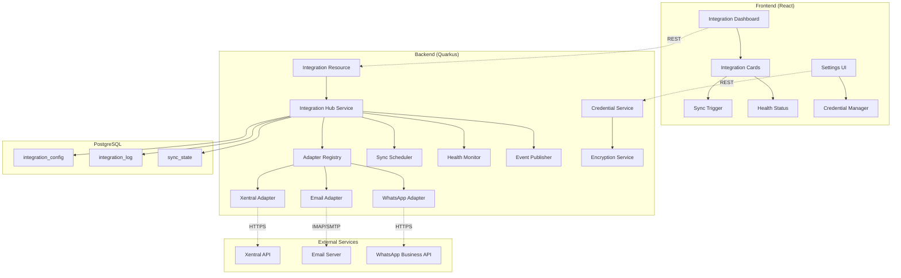

# FC-021: Technisches Konzept - Integration Hub

**Feature Code:** FC-021  
**Datum:** 2025-07-20  
**Status:** Draft  
**Autor:** Claude  
**Reviewer:** Jörg  
**Geschätzte Dauer:** 6-8 Tage  

## 📋 Inhaltsverzeichnis

1. [Zusammenfassung](#zusammenfassung)
2. [Ziel und Geschäftswert](#ziel-und-geschäftswert)
3. [Technische Architektur](#technische-architektur)
4. [Backend-Implementierung](#backend-implementierung)
5. [Frontend-Implementierung](#frontend-implementierung)
6. [Implementierungsstrategie](#implementierungsstrategie)
7. [Entscheidungs-Log](#entscheidungs-log)
8. [Risiken und Mitigationen](#risiken-und-mitigationen)
9. [Zeitschätzung](#zeitschätzung)

## Zusammenfassung

Der Integration Hub ist ein zentrales Schnittstellen-Management-System, das alle externen Integrationen vereinheitlicht, überwacht und verwaltet. Er implementiert das Adapter Pattern für einheitliche Integration verschiedener externer Services (Xentral, E-Mail, WhatsApp etc.) und bietet ein zentrales Dashboard für Monitoring und Steuerung aller Sync-Prozesse. Der Hub reduziert die Zeit für neue Integrationen von 5-10 Tagen auf 1-2 Tage und automatisiert das komplette Monitoring.

## Ziel und Geschäftswert

### Geschäftsziele
- **Schnellere Integrationen**: Neue externe Services in 1-2 Tagen statt 5-10 Tagen einbinden (80% Zeitersparnis)
- **Proaktives Fehlermanagement**: Sync-Fehler in 15 Minuten statt 2-4 Stunden lokalisieren (90% schneller)
- **Reduced Maintenance**: Code-Duplikation von 60-80% auf <10% reduzieren durch einheitliches Adapter Pattern

### Technische Ziele
- **Einheitliche Architektur**: Alle Integrationen folgen demselben Adapter Pattern
- **Automatisches Monitoring**: Echtzeit-Status aller Integrationen mit automatischen Health Checks
- **Sichere Credential-Verwaltung**: Verschlüsselte Speicherung aller API-Keys und Zugangsdaten
- **Resilience**: Automatische Retry-Logic mit Exponential Backoff bei Fehlern

## Technische Architektur

### System-Übersicht



### Komponenten-Interaktion

1. **Frontend** zeigt Dashboard mit allen konfigurierten Integrationen
2. **Integration Hub Service** orchestriert alle Adapter und Sync-Prozesse
3. **Adapter** implementieren einheitliches Interface für verschiedene externe Services
4. **Scheduler** triggert automatische Syncs basierend auf Konfiguration
5. **Health Monitor** prüft kontinuierlich die Verfügbarkeit aller Services
6. **Event Publisher** sendet Integration Events für andere Module (z.B. Activity Timeline)

### Plugin Architecture

```java
// Core Interface - Alle Adapter implementieren dieses Interface
public interface IntegrationAdapter {
    // Lifecycle
    CompletableFuture<Void> connect();
    CompletableFuture<Void> disconnect();
    
    // Operations
    CompletableFuture<SyncResult> sync(SyncConfig config);
    CompletableFuture<HealthStatus> healthCheck();
    
    // Metadata
    IntegrationMetadata getMetadata();
    List<ConfigParameter> getRequiredParameters();
}

// Metadata für UI und Registry
public record IntegrationMetadata(
    String id,
    String name,
    String description,
    String iconUrl,
    List<String> supportedOperations,
    Map<String, String> capabilities
) {}
```

## Backend-Implementierung

### 1. API Endpoints

```java
@Path("/api/integrations")
@Authenticated
@Produces(MediaType.APPLICATION_JSON)
@Consumes(MediaType.APPLICATION_JSON)
public class IntegrationResource {
    
    @Inject IntegrationHubService hubService;
    @Inject IntegrationConfigService configService;
    
    @GET
    @RolesAllowed({"admin", "manager"})
    public List<IntegrationStatusDTO> getAllIntegrations() {
        return hubService.getAllIntegrationStatus();
    }
    
    @GET
    @Path("/{id}")
    @RolesAllowed({"admin", "manager", "sales"})
    public IntegrationDetailDTO getIntegration(@PathParam("id") UUID id) {
        return hubService.getIntegrationDetail(id);
    }
    
    @POST
    @RolesAllowed("admin")
    public Response createIntegration(@Valid CreateIntegrationRequest request) {
        IntegrationConfig config = configService.createIntegration(request);
        return Response.created(URI.create("/api/integrations/" + config.id))
                      .entity(config)
                      .build();
    }
    
    @PUT
    @Path("/{id}")
    @RolesAllowed("admin")
    public IntegrationConfig updateIntegration(
            @PathParam("id") UUID id,
            @Valid UpdateIntegrationRequest request) {
        return configService.updateIntegration(id, request);
    }
    
    @DELETE
    @Path("/{id}")
    @RolesAllowed("admin")
    public Response deleteIntegration(@PathParam("id") UUID id) {
        configService.deleteIntegration(id);
        return Response.noContent().build();
    }
    
    @POST
    @Path("/{id}/sync")
    @RolesAllowed({"admin", "manager"})
    public Response triggerSync(@PathParam("id") UUID id) {
        hubService.triggerSync(id);
        return Response.accepted()
                      .header("Location", "/api/integrations/" + id + "/sync-status")
                      .build();
    }
    
    @GET
    @Path("/{id}/sync-status")
    @RolesAllowed({"admin", "manager", "sales"})
    public SyncStatusDTO getSyncStatus(@PathParam("id") UUID id) {
        return hubService.getSyncStatus(id);
    }
    
    @GET
    @Path("/{id}/health")
    @RolesAllowed({"admin", "manager"})
    public HealthStatus checkHealth(@PathParam("id") UUID id) {
        return hubService.performHealthCheck(id);
    }
    
    @GET
    @Path("/{id}/logs")
    @RolesAllowed("admin")
    public List<IntegrationLogDTO> getLogs(
            @PathParam("id") UUID id,
            @QueryParam("limit") @DefaultValue("100") int limit,
            @QueryParam("offset") @DefaultValue("0") int offset) {
        return hubService.getIntegrationLogs(id, limit, offset);
    }
    
    @GET
    @Path("/available-adapters")
    @RolesAllowed("admin")
    public List<AdapterMetadataDTO> getAvailableAdapters() {
        return hubService.getAvailableAdapters();
    }
}
```

### 2. Datenmodell

```java
// Integration Configuration
@Entity
@Table(name = "integration_config")
public class IntegrationConfig extends PanacheEntityBase {
    @Id
    @GeneratedValue
    public UUID id;
    
    @Column(nullable = false, unique = true)
    public String name;
    
    @Column(nullable = false)
    public String adapterType; // "xentral", "email", "whatsapp"
    
    @Enumerated(EnumType.STRING)
    public IntegrationStatus status = IntegrationStatus.INACTIVE;
    
    @Column(columnDefinition = "TEXT")
    public String encryptedCredentials; // AES-256 encrypted JSON
    
    @Type(type = "jsonb")
    @Column(columnDefinition = "jsonb")
    public Map<String, Object> configuration = new HashMap<>();
    
    @Type(type = "jsonb")
    @Column(columnDefinition = "jsonb")
    public Map<String, Object> metadata = new HashMap<>();
    
    public LocalDateTime lastSyncAt;
    public LocalDateTime nextScheduledSync;
    public String syncCronExpression; // e.g., "0 */5 * * * ?" for every 5 minutes
    
    @Column(nullable = false)
    public Boolean autoSync = true;
    
    @Column(nullable = false)
    public Integer retryAttempts = 3;
    
    @Column(nullable = false)
    public Integer retryDelaySeconds = 60;
    
    public LocalDateTime createdAt = LocalDateTime.now();
    public LocalDateTime updatedAt = LocalDateTime.now();
    
    @ManyToOne
    public User createdBy;
    
    @ManyToOne
    public User updatedBy;
}

// Integration Log
@Entity
@Table(name = "integration_log")
public class IntegrationLog extends PanacheEntityBase {
    @Id
    @GeneratedValue
    public UUID id;
    
    @ManyToOne
    @JoinColumn(nullable = false)
    public IntegrationConfig integration;
    
    @Enumerated(EnumType.STRING)
    public LogLevel level; // INFO, WARN, ERROR
    
    @Enumerated(EnumType.STRING)
    public LogType type; // SYNC_START, SYNC_COMPLETE, SYNC_ERROR, HEALTH_CHECK, CONFIG_CHANGE
    
    @Column(nullable = false)
    public String message;
    
    @Type(type = "jsonb")
    @Column(columnDefinition = "jsonb")
    public Map<String, Object> details = new HashMap<>();
    
    public Integer recordsProcessed;
    public Integer recordsFailed;
    public Long durationMs;
    
    public LocalDateTime timestamp = LocalDateTime.now();
}

// Sync State for Resume Capability
@Entity
@Table(name = "sync_state")
public class SyncState extends PanacheEntityBase {
    @Id
    @GeneratedValue
    public UUID id;
    
    @OneToOne
    @JoinColumn(nullable = false, unique = true)
    public IntegrationConfig integration;
    
    @Type(type = "jsonb")
    @Column(columnDefinition = "jsonb")
    public Map<String, Object> state = new HashMap<>(); // Adapter-specific state
    
    public String lastProcessedId;
    public LocalDateTime lastProcessedTimestamp;
    public Long totalRecords;
    public Long processedRecords;
    
    @Enumerated(EnumType.STRING)
    public SyncStatus syncStatus; // IDLE, RUNNING, PAUSED, ERROR
    
    public LocalDateTime updatedAt = LocalDateTime.now();
}
```

### 3. Business Logic

```java
@ApplicationScoped
@Transactional
public class IntegrationHubService {
    
    @Inject AdapterRegistry adapterRegistry;
    @Inject CredentialService credentialService;
    @Inject EventBus eventBus;
    @Inject MeterRegistry metrics;
    
    private final Map<UUID, CompletableFuture<SyncResult>> runningSyncs = new ConcurrentHashMap<>();
    
    public void initializeHub() {
        // Register all available adapters
        adapterRegistry.register("xentral", XentralAdapter.class);
        adapterRegistry.register("email", EmailAdapter.class);
        adapterRegistry.register("whatsapp", WhatsAppAdapter.class);
        
        // Schedule automatic syncs
        scheduleAutomaticSyncs();
    }
    
    public CompletableFuture<SyncResult> triggerSync(UUID integrationId) {
        IntegrationConfig config = IntegrationConfig.findById(integrationId);
        if (config == null) {
            throw new NotFoundException("Integration not found: " + integrationId);
        }
        
        // Check if sync is already running
        if (runningSyncs.containsKey(integrationId)) {
            return runningSyncs.get(integrationId);
        }
        
        // Create and configure adapter
        IntegrationAdapter adapter = createAdapter(config);
        
        // Start sync with metrics and error handling
        CompletableFuture<SyncResult> syncFuture = CompletableFuture
            .supplyAsync(() -> {
                Timer.Sample sample = Timer.start(metrics);
                try {
                    logIntegration(config, LogLevel.INFO, LogType.SYNC_START, 
                                  "Starting sync", Map.of());
                    
                    SyncResult result = adapter.sync(buildSyncConfig(config))
                                              .get(5, TimeUnit.MINUTES);
                    
                    updateSyncState(config, result);
                    logSyncResult(config, result);
                    publishSyncEvent(config, result);
                    
                    return result;
                    
                } catch (Exception e) {
                    handleSyncError(config, e);
                    throw new RuntimeException("Sync failed", e);
                } finally {
                    sample.stop(metrics.timer("integration.sync.duration",
                                            "adapter", config.adapterType));
                }
            })
            .whenComplete((result, error) -> {
                runningSyncs.remove(integrationId);
                if (error == null) {
                    config.lastSyncAt = LocalDateTime.now();
                    config.status = IntegrationStatus.ACTIVE;
                } else {
                    config.status = IntegrationStatus.ERROR;
                }
                config.persist();
            });
        
        runningSyncs.put(integrationId, syncFuture);
        return syncFuture;
    }
    
    private IntegrationAdapter createAdapter(IntegrationConfig config) {
        Class<? extends IntegrationAdapter> adapterClass = 
            adapterRegistry.getAdapter(config.adapterType);
            
        IntegrationAdapter adapter = CDI.current().select(adapterClass).get();
        
        // Inject decrypted credentials
        Map<String, String> credentials = 
            credentialService.decryptCredentials(config.encryptedCredentials);
        adapter.configure(credentials, config.configuration);
        
        return adapter;
    }
    
    @Scheduled(every = "1m")
    void checkScheduledSyncs() {
        List<IntegrationConfig> dueForSync = IntegrationConfig
            .find("autoSync = true AND nextScheduledSync <= ?1 AND status != ?2",
                  LocalDateTime.now(), IntegrationStatus.SYNCING)
            .list();
            
        for (IntegrationConfig config : dueForSync) {
            try {
                triggerSync(config.id);
                config.nextScheduledSync = calculateNextSync(config.syncCronExpression);
                config.persist();
            } catch (Exception e) {
                Log.error("Failed to trigger scheduled sync for " + config.name, e);
            }
        }
    }
    
    public CompletableFuture<HealthStatus> performHealthCheck(UUID integrationId) {
        IntegrationConfig config = IntegrationConfig.findById(integrationId);
        IntegrationAdapter adapter = createAdapter(config);
        
        return adapter.healthCheck()
                     .orTimeout(30, TimeUnit.SECONDS)
                     .whenComplete((status, error) -> {
                         if (error != null) {
                             status = new HealthStatus(false, error.getMessage());
                         }
                         logHealthCheck(config, status);
                     });
    }
}

// Concrete Adapter Example: Xentral
@ApplicationScoped
public class XentralAdapter implements IntegrationAdapter {
    
    @Inject @RestClient XentralApiClient xentralClient;
    @ConfigProperty(name = "xentral.base-url") String baseUrl;
    
    private String apiKey;
    private Map<String, Object> config;
    
    @Override
    public void configure(Map<String, String> credentials, Map<String, Object> config) {
        this.apiKey = credentials.get("apiKey");
        this.config = config;
        
        // Configure REST client
        ((ConfigurableRestClient) xentralClient).baseUrl(baseUrl)
                                                .header("X-API-Key", apiKey);
    }
    
    @Override
    public CompletableFuture<SyncResult> sync(SyncConfig syncConfig) {
        return CompletableFuture.supplyAsync(() -> {
            SyncResult result = new SyncResult();
            
            try {
                // Sync Customers
                if (syncConfig.isEntityEnabled("customers")) {
                    SyncResult.EntityResult customerResult = syncCustomers(syncConfig);
                    result.addEntityResult("customers", customerResult);
                }
                
                // Sync Products
                if (syncConfig.isEntityEnabled("products")) {
                    SyncResult.EntityResult productResult = syncProducts(syncConfig);
                    result.addEntityResult("products", productResult);
                }
                
                // Sync Orders
                if (syncConfig.isEntityEnabled("orders")) {
                    SyncResult.EntityResult orderResult = syncOrders(syncConfig);
                    result.addEntityResult("orders", orderResult);
                }
                
                result.setStatus(SyncStatus.SUCCESS);
                result.setCompletedAt(LocalDateTime.now());
                
            } catch (Exception e) {
                result.setStatus(SyncStatus.ERROR);
                result.setErrorMessage(e.getMessage());
            }
            
            return result;
        });
    }
    
    private SyncResult.EntityResult syncCustomers(SyncConfig config) {
        // Implementation with pagination, error handling, and progress tracking
        int page = 0;
        int pageSize = 100;
        int totalProcessed = 0;
        int totalErrors = 0;
        
        while (true) {
            try {
                XentralCustomerPage customerPage = 
                    xentralClient.getCustomers(page, pageSize);
                    
                for (XentralCustomer xentralCustomer : customerPage.data) {
                    try {
                        Customer customer = mapToCustomer(xentralCustomer);
                        customer.persist();
                        totalProcessed++;
                    } catch (Exception e) {
                        totalErrors++;
                        Log.error("Failed to sync customer: " + xentralCustomer.id, e);
                    }
                }
                
                if (!customerPage.hasNextPage) break;
                page++;
                
            } catch (Exception e) {
                throw new SyncException("Customer sync failed at page " + page, e);
            }
        }
        
        return new SyncResult.EntityResult(totalProcessed, totalErrors);
    }
    
    @Override
    public CompletableFuture<HealthStatus> healthCheck() {
        return CompletableFuture.supplyAsync(() -> {
            try {
                XentralHealthResponse health = xentralClient.checkHealth();
                return new HealthStatus(
                    health.status.equals("ok"),
                    health.message,
                    Map.of("version", health.version, "uptime", health.uptime)
                );
            } catch (Exception e) {
                return new HealthStatus(false, "Health check failed: " + e.getMessage());
            }
        });
    }
    
    @Override
    public IntegrationMetadata getMetadata() {
        return new IntegrationMetadata(
            "xentral",
            "Xentral ERP",
            "Synchronisiert Kunden, Produkte und Aufträge mit Xentral",
            "/assets/icons/xentral.svg",
            List.of("customers", "products", "orders", "invoices"),
            Map.of(
                "supportsWebhooks", "true",
                "supportsBidirectional", "true",
                "requiresApiKey", "true"
            )
        );
    }
}
```

### 4. Datenbank-Änderungen

```sql
-- V5.0__create_integration_hub_tables.sql

-- Integration Configuration
CREATE TABLE integration_config (
    id UUID PRIMARY KEY DEFAULT gen_random_uuid(),
    name VARCHAR(255) NOT NULL UNIQUE,
    adapter_type VARCHAR(50) NOT NULL,
    status VARCHAR(20) NOT NULL DEFAULT 'INACTIVE',
    encrypted_credentials TEXT,
    configuration JSONB DEFAULT '{}',
    metadata JSONB DEFAULT '{}',
    last_sync_at TIMESTAMP,
    next_scheduled_sync TIMESTAMP,
    sync_cron_expression VARCHAR(100),
    auto_sync BOOLEAN NOT NULL DEFAULT true,
    retry_attempts INTEGER NOT NULL DEFAULT 3,
    retry_delay_seconds INTEGER NOT NULL DEFAULT 60,
    created_at TIMESTAMP NOT NULL DEFAULT CURRENT_TIMESTAMP,
    updated_at TIMESTAMP NOT NULL DEFAULT CURRENT_TIMESTAMP,
    created_by_id UUID REFERENCES users(id),
    updated_by_id UUID REFERENCES users(id),
    
    CHECK (status IN ('ACTIVE', 'INACTIVE', 'ERROR', 'SYNCING'))
);

CREATE INDEX idx_integration_config_status ON integration_config(status);
CREATE INDEX idx_integration_config_next_sync ON integration_config(next_scheduled_sync) 
    WHERE auto_sync = true;

-- Integration Logs
CREATE TABLE integration_log (
    id UUID PRIMARY KEY DEFAULT gen_random_uuid(),
    integration_id UUID NOT NULL REFERENCES integration_config(id) ON DELETE CASCADE,
    level VARCHAR(10) NOT NULL,
    type VARCHAR(50) NOT NULL,
    message TEXT NOT NULL,
    details JSONB DEFAULT '{}',
    records_processed INTEGER,
    records_failed INTEGER,
    duration_ms BIGINT,
    timestamp TIMESTAMP NOT NULL DEFAULT CURRENT_TIMESTAMP,
    
    CHECK (level IN ('INFO', 'WARN', 'ERROR')),
    CHECK (type IN ('SYNC_START', 'SYNC_COMPLETE', 'SYNC_ERROR', 
                    'HEALTH_CHECK', 'CONFIG_CHANGE'))
);

CREATE INDEX idx_integration_log_integration_timestamp 
    ON integration_log(integration_id, timestamp DESC);
CREATE INDEX idx_integration_log_level ON integration_log(level) 
    WHERE level IN ('WARN', 'ERROR');

-- Sync State for Resume Capability
CREATE TABLE sync_state (
    id UUID PRIMARY KEY DEFAULT gen_random_uuid(),
    integration_id UUID NOT NULL UNIQUE REFERENCES integration_config(id) ON DELETE CASCADE,
    state JSONB DEFAULT '{}',
    last_processed_id VARCHAR(255),
    last_processed_timestamp TIMESTAMP,
    total_records BIGINT,
    processed_records BIGINT,
    sync_status VARCHAR(20) NOT NULL DEFAULT 'IDLE',
    updated_at TIMESTAMP NOT NULL DEFAULT CURRENT_TIMESTAMP,
    
    CHECK (sync_status IN ('IDLE', 'RUNNING', 'PAUSED', 'ERROR'))
);

-- Trigger for updated_at
CREATE OR REPLACE FUNCTION update_updated_at_column()
RETURNS TRIGGER AS $$
BEGIN
    NEW.updated_at = CURRENT_TIMESTAMP;
    RETURN NEW;
END;
$$ language 'plpgsql';

CREATE TRIGGER update_integration_config_updated_at 
    BEFORE UPDATE ON integration_config
    FOR EACH ROW EXECUTE FUNCTION update_updated_at_column();

CREATE TRIGGER update_sync_state_updated_at 
    BEFORE UPDATE ON sync_state
    FOR EACH ROW EXECUTE FUNCTION update_updated_at_column();
```

## Frontend-Implementierung

### 1. Komponenten-Struktur

```typescript
// features/integration-hub/
├── components/
│   ├── IntegrationDashboard.tsx      // Main dashboard
│   ├── IntegrationCard.tsx           // Individual integration display
│   ├── IntegrationDetail.tsx         // Detailed view with logs
│   ├── IntegrationForm.tsx           // Create/Edit integration
│   ├── SyncStatusIndicator.tsx       // Real-time sync status
│   └── HealthStatusBadge.tsx         // Health indicator
├── hooks/
│   ├── useIntegrations.ts            // List all integrations
│   ├── useIntegrationDetail.ts       // Single integration + logs
│   ├── useSyncTrigger.ts             // Trigger manual sync
│   └── useHealthCheck.ts             // Health status polling
├── types/
│   └── integration.types.ts          // TypeScript definitions
└── utils/
    └── integration.utils.ts          // Helper functions
```

### 2. State Management

```typescript
// hooks/useIntegrations.ts
import useSWR from 'swr';
import { apiClient } from '@/services/api';
import { Integration, IntegrationStatus } from '../types';

export const useIntegrations = () => {
  const { data, error, mutate } = useSWR<Integration[]>(
    '/api/integrations',
    apiClient.get,
    {
      refreshInterval: 10000, // Poll every 10 seconds for status updates
      revalidateOnFocus: true,
    }
  );

  const integrationsCount = {
    total: data?.length || 0,
    active: data?.filter(i => i.status === IntegrationStatus.ACTIVE).length || 0,
    error: data?.filter(i => i.status === IntegrationStatus.ERROR).length || 0,
    syncing: data?.filter(i => i.status === IntegrationStatus.SYNCING).length || 0,
  };

  return {
    integrations: data || [],
    isLoading: !error && !data,
    isError: error,
    integrationsCount,
    mutate,
  };
};

// hooks/useSyncTrigger.ts
import useSWRMutation from 'swr/mutation';
import { apiClient } from '@/services/api';
import { toast } from 'react-toastify';

export const useSyncTrigger = (integrationId: string) => {
  const { trigger, isMutating } = useSWRMutation(
    `/api/integrations/${integrationId}/sync`,
    (url) => apiClient.post(url),
    {
      onSuccess: () => {
        toast.success('Sync gestartet');
      },
      onError: (error) => {
        toast.error(`Sync fehlgeschlagen: ${error.message}`);
      },
    }
  );

  return {
    triggerSync: trigger,
    isSyncing: isMutating,
  };
};

// hooks/useIntegrationDetail.ts
import useSWR from 'swr';
import { apiClient } from '@/services/api';
import { IntegrationDetail, IntegrationLog } from '../types';

export const useIntegrationDetail = (integrationId: string) => {
  const { data: integration } = useSWR<IntegrationDetail>(
    integrationId ? `/api/integrations/${integrationId}` : null,
    apiClient.get
  );

  const { data: logs } = useSWR<IntegrationLog[]>(
    integrationId ? `/api/integrations/${integrationId}/logs` : null,
    apiClient.get,
    {
      refreshInterval: integration?.status === 'SYNCING' ? 2000 : 0,
    }
  );

  return {
    integration,
    logs: logs || [],
    isLoading: !integration,
  };
};
```

### 3. UI/UX Design

```typescript
// components/IntegrationDashboard.tsx
import React from 'react';
import { 
  Box, Grid, Typography, Alert, Paper, Skeleton,
  Tabs, Tab, Badge
} from '@mui/material';
import { useIntegrations } from '../hooks/useIntegrations';
import { IntegrationCard } from './IntegrationCard';
import { IntegrationStatus } from '../types';

export const IntegrationDashboard: React.FC = () => {
  const { integrations, isLoading, integrationsCount } = useIntegrations();
  const [filterStatus, setFilterStatus] = React.useState<IntegrationStatus | 'all'>('all');

  const filteredIntegrations = React.useMemo(() => {
    if (filterStatus === 'all') return integrations;
    return integrations.filter(i => i.status === filterStatus);
  }, [integrations, filterStatus]);

  if (isLoading) {
    return (
      <Box sx={{ p: 3 }}>
        <Skeleton variant="text" width={300} height={40} />
        <Grid container spacing={3} sx={{ mt: 2 }}>
          {[1, 2, 3].map((i) => (
            <Grid item xs={12} md={6} lg={4} key={i}>
              <Skeleton variant="rectangular" height={200} />
            </Grid>
          ))}
        </Grid>
      </Box>
    );
  }

  return (
    <Box sx={{ p: 3 }}>
      <Typography variant="h4" gutterBottom>
        Integration Hub
      </Typography>

      {integrationsCount.error > 0 && (
        <Alert severity="error" sx={{ mb: 3 }}>
          {integrationsCount.error} Integration{integrationsCount.error > 1 ? 'en' : ''} 
          mit Fehlern. Bitte prüfen Sie die betroffenen Services.
        </Alert>
      )}

      <Paper sx={{ mb: 3 }}>
        <Tabs
          value={filterStatus}
          onChange={(_, value) => setFilterStatus(value)}
          indicatorColor="primary"
          textColor="primary"
        >
          <Tab 
            label={
              <Badge badgeContent={integrationsCount.total} color="default">
                Alle
              </Badge>
            } 
            value="all" 
          />
          <Tab 
            label={
              <Badge badgeContent={integrationsCount.active} color="success">
                Aktiv
              </Badge>
            } 
            value={IntegrationStatus.ACTIVE} 
          />
          <Tab 
            label={
              <Badge badgeContent={integrationsCount.syncing} color="info">
                Synchronisiert
              </Badge>
            } 
            value={IntegrationStatus.SYNCING} 
          />
          <Tab 
            label={
              <Badge badgeContent={integrationsCount.error} color="error">
                Fehler
              </Badge>
            } 
            value={IntegrationStatus.ERROR} 
          />
        </Tabs>
      </Paper>

      <Grid container spacing={3}>
        {filteredIntegrations.map((integration) => (
          <Grid item xs={12} md={6} lg={4} key={integration.id}>
            <IntegrationCard integration={integration} />
          </Grid>
        ))}
      </Grid>
    </Box>
  );
};

// components/IntegrationCard.tsx
import React from 'react';
import {
  Card, CardContent, CardActions, Stack, Box,
  Typography, Button, Chip, IconButton, Tooltip,
  LinearProgress, Menu, MenuItem
} from '@mui/material';
import {
  Sync as SyncIcon,
  MoreVert as MoreIcon,
  CheckCircle as SuccessIcon,
  Error as ErrorIcon,
  Schedule as ScheduleIcon,
  HourglassEmpty as SyncingIcon
} from '@mui/icons-material';
import { useRouter } from 'next/router';
import { formatDistance } from 'date-fns';
import { de } from 'date-fns/locale';
import { Integration, IntegrationStatus } from '../types';
import { useSyncTrigger } from '../hooks/useSyncTrigger';
import { HealthStatusBadge } from './HealthStatusBadge';

interface Props {
  integration: Integration;
}

export const IntegrationCard: React.FC<Props> = ({ integration }) => {
  const router = useRouter();
  const { triggerSync, isSyncing } = useSyncTrigger(integration.id);
  const [anchorEl, setAnchorEl] = React.useState<null | HTMLElement>(null);

  const statusConfig = {
    [IntegrationStatus.ACTIVE]: {
      icon: <SuccessIcon />,
      color: 'success' as const,
      label: 'Aktiv',
    },
    [IntegrationStatus.ERROR]: {
      icon: <ErrorIcon />,
      color: 'error' as const,
      label: 'Fehler',
    },
    [IntegrationStatus.SYNCING]: {
      icon: <SyncingIcon />,
      color: 'info' as const,
      label: 'Synchronisiert',
    },
    [IntegrationStatus.INACTIVE]: {
      icon: <ScheduleIcon />,
      color: 'default' as const,
      label: 'Inaktiv',
    },
  };

  const status = statusConfig[integration.status];

  const handleMenuOpen = (event: React.MouseEvent<HTMLElement>) => {
    setAnchorEl(event.currentTarget);
  };

  const handleMenuClose = () => {
    setAnchorEl(null);
  };

  const handleViewDetails = () => {
    router.push(`/integrations/${integration.id}`);
    handleMenuClose();
  };

  const handleEditConfig = () => {
    router.push(`/integrations/${integration.id}/edit`);
    handleMenuClose();
  };

  return (
    <Card 
      sx={{ 
        height: '100%', 
        display: 'flex', 
        flexDirection: 'column',
        position: 'relative',
        ...(integration.status === IntegrationStatus.SYNCING && {
          '&::before': {
            content: '""',
            position: 'absolute',
            top: 0,
            left: 0,
            right: 0,
            height: 3,
            bgcolor: 'info.main',
            animation: 'pulse 2s infinite',
          },
        }),
      }}
    >
      {integration.status === IntegrationStatus.SYNCING && (
        <LinearProgress 
          sx={{ position: 'absolute', top: 0, left: 0, right: 0 }} 
        />
      )}

      <CardContent sx={{ flex: 1 }}>
        <Stack direction="row" justifyContent="space-between" alignItems="flex-start">
          <Box>
            <Typography variant="h6" gutterBottom>
              {integration.name}
            </Typography>
            <Chip
              icon={status.icon}
              label={status.label}
              color={status.color}
              size="small"
              sx={{ mb: 2 }}
            />
          </Box>
          <IconButton size="small" onClick={handleMenuOpen}>
            <MoreIcon />
          </IconButton>
        </Stack>

        <Stack spacing={1}>
          <HealthStatusBadge integrationId={integration.id} />
          
          {integration.lastSyncAt && (
            <Typography variant="body2" color="text.secondary">
              Letzter Sync: {formatDistance(
                new Date(integration.lastSyncAt),
                new Date(),
                { addSuffix: true, locale: de }
              )}
            </Typography>
          )}

          {integration.recordsLastSync && (
            <Typography variant="body2" color="text.secondary">
              {integration.recordsLastSync} Datensätze synchronisiert
            </Typography>
          )}

          {integration.nextScheduledSync && integration.autoSync && (
            <Typography variant="body2" color="text.secondary">
              Nächster Sync: {formatDistance(
                new Date(integration.nextScheduledSync),
                new Date(),
                { addSuffix: true, locale: de }
              )}
            </Typography>
          )}
        </Stack>
      </CardContent>

      <CardActions>
        <Button
          startIcon={<SyncIcon />}
          onClick={() => triggerSync()}
          disabled={isSyncing || integration.status === IntegrationStatus.SYNCING}
          fullWidth
        >
          {isSyncing || integration.status === IntegrationStatus.SYNCING 
            ? 'Synchronisiert...' 
            : 'Jetzt synchronisieren'}
        </Button>
      </CardActions>

      <Menu
        anchorEl={anchorEl}
        open={Boolean(anchorEl)}
        onClose={handleMenuClose}
      >
        <MenuItem onClick={handleViewDetails}>Details anzeigen</MenuItem>
        <MenuItem onClick={handleEditConfig}>Konfiguration bearbeiten</MenuItem>
      </Menu>
    </Card>
  );
};

// components/SyncStatusIndicator.tsx
import React from 'react';
import { Box, CircularProgress, Typography, Stack } from '@mui/material';
import { CheckCircle, Error, HourglassEmpty } from '@mui/icons-material';
import { SyncStatus } from '../types';

interface Props {
  status: SyncStatus;
  progress?: number;
  message?: string;
}

export const SyncStatusIndicator: React.FC<Props> = ({ 
  status, 
  progress, 
  message 
}) => {
  const renderStatusIcon = () => {
    switch (status) {
      case 'SUCCESS':
        return <CheckCircle color="success" sx={{ fontSize: 48 }} />;
      case 'ERROR':
        return <Error color="error" sx={{ fontSize: 48 }} />;
      case 'RUNNING':
        return (
          <Box position="relative" display="inline-flex">
            <CircularProgress 
              variant={progress ? 'determinate' : 'indeterminate'} 
              value={progress} 
              size={48}
            />
            {progress && (
              <Box
                top={0}
                left={0}
                bottom={0}
                right={0}
                position="absolute"
                display="flex"
                alignItems="center"
                justifyContent="center"
              >
                <Typography 
                  variant="caption" 
                  component="div" 
                  color="text.secondary"
                >
                  {`${Math.round(progress)}%`}
                </Typography>
              </Box>
            )}
          </Box>
        );
      default:
        return <HourglassEmpty color="action" sx={{ fontSize: 48 }} />;
    }
  };

  return (
    <Stack alignItems="center" spacing={2}>
      {renderStatusIcon()}
      {message && (
        <Typography 
          variant="body2" 
          color="text.secondary" 
          align="center"
        >
          {message}
        </Typography>
      )}
    </Stack>
  );
};
```

### 4. Integration

```typescript
// types/integration.types.ts
export enum IntegrationStatus {
  ACTIVE = 'ACTIVE',
  INACTIVE = 'INACTIVE',
  ERROR = 'ERROR',
  SYNCING = 'SYNCING',
}

export enum LogLevel {
  INFO = 'INFO',
  WARN = 'WARN',
  ERROR = 'ERROR',
}

export enum LogType {
  SYNC_START = 'SYNC_START',
  SYNC_COMPLETE = 'SYNC_COMPLETE',
  SYNC_ERROR = 'SYNC_ERROR',
  HEALTH_CHECK = 'HEALTH_CHECK',
  CONFIG_CHANGE = 'CONFIG_CHANGE',
}

export interface Integration {
  id: string;
  name: string;
  adapterType: string;
  status: IntegrationStatus;
  lastSyncAt?: string;
  nextScheduledSync?: string;
  autoSync: boolean;
  recordsLastSync?: number;
  metadata: Record<string, any>;
}

export interface IntegrationDetail extends Integration {
  configuration: Record<string, any>;
  syncCronExpression?: string;
  retryAttempts: number;
  retryDelaySeconds: number;
  createdAt: string;
  updatedAt: string;
  createdBy?: User;
  updatedBy?: User;
}

export interface IntegrationLog {
  id: string;
  level: LogLevel;
  type: LogType;
  message: string;
  details: Record<string, any>;
  recordsProcessed?: number;
  recordsFailed?: number;
  durationMs?: number;
  timestamp: string;
}

export interface HealthStatus {
  healthy: boolean;
  message: string;
  details?: Record<string, any>;
  lastChecked: string;
}

export interface SyncResult {
  status: 'SUCCESS' | 'ERROR' | 'PARTIAL';
  entityResults: Record<string, EntitySyncResult>;
  startedAt: string;
  completedAt: string;
  errorMessage?: string;
}

export interface EntitySyncResult {
  processed: number;
  failed: number;
  errors?: string[];
}

export interface AdapterMetadata {
  id: string;
  name: string;
  description: string;
  iconUrl: string;
  supportedOperations: string[];
  capabilities: Record<string, string>;
  requiredCredentials: CredentialField[];
  optionalConfiguration: ConfigField[];
}

export interface CredentialField {
  name: string;
  label: string;
  type: 'text' | 'password' | 'textarea';
  required: boolean;
  helpText?: string;
}

export interface ConfigField extends CredentialField {
  defaultValue?: any;
  validation?: {
    pattern?: string;
    min?: number;
    max?: number;
  };
}

// services/integrationApi.ts
import { apiClient } from '@/services/api';
import { 
  Integration, 
  IntegrationDetail, 
  IntegrationLog,
  HealthStatus,
  AdapterMetadata 
} from '@/features/integration-hub/types';

export const integrationApi = {
  // List all integrations
  getIntegrations: () => 
    apiClient.get<Integration[]>('/api/integrations'),

  // Get single integration
  getIntegration: (id: string) => 
    apiClient.get<IntegrationDetail>(`/api/integrations/${id}`),

  // Create integration
  createIntegration: (data: Partial<IntegrationDetail>) =>
    apiClient.post<IntegrationDetail>('/api/integrations', data),

  // Update integration
  updateIntegration: (id: string, data: Partial<IntegrationDetail>) =>
    apiClient.put<IntegrationDetail>(`/api/integrations/${id}`, data),

  // Delete integration
  deleteIntegration: (id: string) =>
    apiClient.delete(`/api/integrations/${id}`),

  // Trigger sync
  triggerSync: (id: string) =>
    apiClient.post(`/api/integrations/${id}/sync`),

  // Get sync status
  getSyncStatus: (id: string) =>
    apiClient.get(`/api/integrations/${id}/sync-status`),

  // Check health
  checkHealth: (id: string) =>
    apiClient.get<HealthStatus>(`/api/integrations/${id}/health`),

  // Get logs
  getLogs: (id: string, limit = 100, offset = 0) =>
    apiClient.get<IntegrationLog[]>(
      `/api/integrations/${id}/logs?limit=${limit}&offset=${offset}`
    ),

  // Get available adapters
  getAvailableAdapters: () =>
    apiClient.get<AdapterMetadata[]>('/api/integrations/available-adapters'),
};
```

## Implementierungsstrategie

### Phase 1: Core Infrastructure (3 Tage)

#### Sprint 1.1: Backend Foundation (1.5 Tage)
1. **Tag 1 Vormittag**: 
   - Database Schema erstellen (Migrations)
   - Entity Classes implementieren
   - Repository Layer aufsetzen

2. **Tag 1 Nachmittag**: 
   - IntegrationAdapter Interface definieren
   - AdapterRegistry implementieren
   - IntegrationHubService Grundgerüst

3. **Tag 2 Vormittag**:
   - REST Endpoints implementieren
   - Basic CRUD Operations
   - Credential Encryption Service

#### Sprint 1.2: Frontend Foundation (1.5 Tage)
1. **Tag 2 Nachmittag**:
   - Component Structure aufsetzen
   - TypeScript Types definieren
   - API Client Functions

2. **Tag 3**:
   - Integration Dashboard UI
   - Integration Cards
   - Basic Navigation

### Phase 2: First Adapter & Core Features (2 Tage)

#### Sprint 2.1: Xentral Adapter (1 Tag)
1. **Tag 4**:
   - XentralAdapter implementieren
   - Customer Sync Logic
   - Error Handling & Retry Logic
   - Basic Health Check

#### Sprint 2.2: Monitoring & Logging (1 Tag)
1. **Tag 5**:
   - Sync Status Tracking
   - Integration Logs UI
   - Real-time Status Updates
   - Error Notifications

### Phase 3: Advanced Features (2 Tage)

#### Sprint 3.1: Automation (1 Tag)
1. **Tag 6**:
   - Scheduled Sync Implementation
   - Cron Expression Support
   - Auto-retry on Errors
   - Webhook Support Preparation

#### Sprint 3.2: Polish & Testing (1 Tag)
1. **Tag 7**:
   - Integration Tests
   - UI Polish
   - Performance Optimization
   - Documentation

## Entscheidungs-Log

### 2025-07-20 - Adapter Pattern vs. Direct Integration
**Entscheidung**: Adapter Pattern mit zentralem Hub  
**Begründung**: 
- Einheitliche Schnittstelle für alle Integrationen
- Einfaches Hinzufügen neuer Services
- Zentrale Fehlerbehandlung und Monitoring
**Impact**: Initial mehr Aufwand, langfristig massive Zeitersparnis  
**Alternativen**: Direct Integration (verworfen wegen Code-Duplikation)  
**Entscheider**: Claude/Jörg

### 2025-07-20 - Sync Strategy: Push vs. Pull vs. Hybrid
**Entscheidung**: Hybrid (Pull mit Webhook-Support)  
**Begründung**: 
- Pull für initiale Syncs und Schedule
- Webhooks für Real-time Updates wo verfügbar
- Fallback auf Polling wenn Webhooks nicht unterstützt
**Impact**: Beste Balance zwischen Aktualität und Ressourcenverbrauch  
**Alternativen**: Pure Pull (zu träge), Pure Push (nicht alle Services unterstützen)  
**Entscheider**: TBD

### 2025-07-20 - Credential Storage
**Entscheidung**: AES-256 Verschlüsselung in DB  
**Begründung**: 
- Sicher genug für API Keys
- Einfacher als externe Key Management Services
- Schneller Zugriff für automatische Syncs
**Impact**: Muss sorgfältig implementiert werden  
**Alternativen**: HashiCorp Vault (Overkill für MVP), Env Variables (nicht skalierbar)  
**Entscheider**: TBD

## Risiken und Mitigationen

### Risiko 1: API Rate Limits
**Wahrscheinlichkeit**: Hoch  
**Impact**: Mittel  
**Mitigation**: 
- Rate Limiting im Adapter implementieren
- Exponential Backoff bei 429 Errors
- Sync-Zeiten intelligent planen (Nachts für große Syncs)

### Risiko 2: Große Datenmengen
**Wahrscheinlichkeit**: Mittel  
**Impact**: Hoch  
**Mitigation**: 
- Pagination in allen Adaptern
- Incremental Sync Support (nur Änderungen)
- Progress Tracking für Resume-Capability

### Risiko 3: Service-Ausfälle
**Wahrscheinlichkeit**: Mittel  
**Impact**: Niedrig  
**Mitigation**: 
- Graceful Degradation (andere Services laufen weiter)
- Automatische Retry-Logic
- Clear Error Messages für User

### Risiko 4: Credential Leaks
**Wahrscheinlichkeit**: Niedrig  
**Impact**: Hoch  
**Mitigation**: 
- Verschlüsselung at Rest
- Audit Logs für alle Zugriffe
- Credentials nie in Logs oder Error Messages

## Zeitschätzung

**Gesamt-Aufwand**: 6-8 Tage

- **Backend**: 3 Tage
  - Core Infrastructure: 1.5 Tage
  - First Adapter: 1 Tag
  - Automation & Scheduling: 0.5 Tage

- **Frontend**: 2.5 Tage
  - Dashboard & Components: 1.5 Tage
  - Detail Views & Forms: 0.5 Tage
  - Real-time Updates: 0.5 Tage

- **Integration & Testing**: 1.5 Tage
  - Integration Tests: 0.5 Tage
  - E2E Testing: 0.5 Tage
  - Performance Testing: 0.5 Tage

- **Dokumentation**: 1 Tag
  - API Documentation
  - Adapter Development Guide
  - User Documentation

**Puffer**: +2 Tage für unvorhergesehene Probleme (besonders bei externen APIs)

---

## 🚀 Next Steps

1. **Review** dieses Konzepts mit Jörg
2. **Entscheidungen** in Decision Log finalisieren
3. **Phase 1** starten mit Database Schema
4. **Xentral API** Dokumentation studieren für Adapter

## 🔗 Verwandte Dokumente

### Implementation Guides:
- **[FC-021 Implementation Guide](/docs/features/PLANNED/21_integration_hub/FC-021_IMPLEMENTATION_GUIDE.md)** *(geplant)*
- **[Adapter Development Guide](/docs/features/PLANNED/21_integration_hub/ADAPTER_DEVELOPMENT_GUIDE.md)** *(geplant)*

### Dependencies:
- **[FC-008 Security Foundation](/docs/features/ACTIVE/01_security_foundation/FC-008_KOMPAKT.md)**
- **[FC-023 Event Sourcing](/docs/features/PLANNED/23_event_sourcing/FC-023_KOMPAKT.md)**

### Managed Integrations:
- **[FC-005 Xentral Integration](/docs/features/PLANNED/08_xentral_integration/FC-005_KOMPAKT.md)**
- **[FC-003 E-Mail Integration](/docs/features/PLANNED/06_email_integration/FC-003_KOMPAKT.md)**
- **[FC-028 WhatsApp Business](/docs/features/PLANNED/28_whatsapp_integration/FC-028_KOMPAKT.md)**

---

**Status-Updates**:
- 2025-07-20: Konzept erstellt (Draft) - Claude