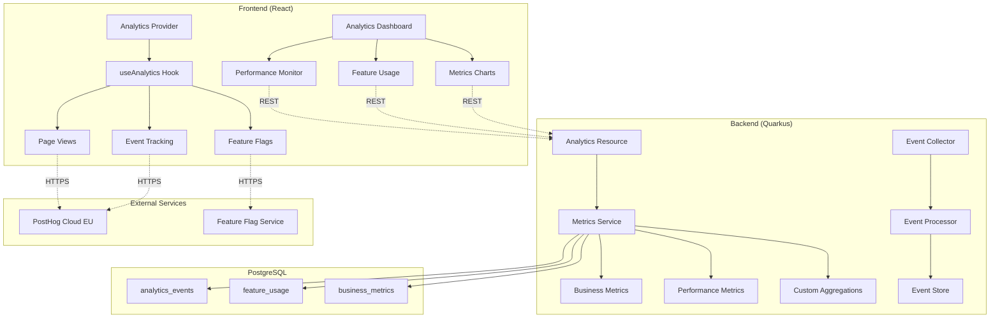

# FC-026: Technisches Konzept - Analytics Platform

**Feature Code:** FC-026  
**Datum:** 2025-07-20  
**Status:** Draft  
**Autor:** Claude  
**Reviewer:** Jörg  
**Geschätzte Dauer:** 2-3 Tage  

## 📋 Inhaltsverzeichnis

1. [Zusammenfassung](#zusammenfassung)
2. [Ziel und Geschäftswert](#ziel-und-geschäftswert)
3. [Technische Architektur](#technische-architektur)
4. [Backend-Implementierung](#backend-implementierung)
5. [Frontend-Implementierung](#frontend-implementierung)
6. [Implementierungsstrategie](#implementierungsstrategie)
7. [Entscheidungs-Log](#entscheidungs-log)
8. [Risiken und Mitigationen](#risiken-und-mitigationen)
9. [Zeitschätzung](#zeitschätzung)

## Zusammenfassung

Die Analytics Platform integriert PostHog als zentrales Product Analytics Tool und erweitert es um custom Business-Metriken, Feature Adoption Tracking und Performance Monitoring. Das System ermöglicht datengetriebene Entscheidungen durch Echtzeit-Einblicke in User-Verhalten, Feature-Nutzung und Business KPIs. Mit eingebautem A/B Testing und Feature Flags können neue Features kontrolliert ausgerollt und deren Impact gemessen werden - alles DSGVO-konform mit User Consent Management.

## Ziel und Geschäftswert

### Geschäftsziele
- **Datengetriebene Produktentwicklung**: Verstehen welche Features wirklich genutzt werden
- **Schnellere Iterationen**: Feature Flags ermöglichen kontrollierten Rollout ohne Deployments
- **ROI Messbarkeit**: Klare Metriken für Feature-Erfolg und Business Impact
- **User Journey Optimierung**: Identifikation von Drop-offs und Verbesserungspotential

### Technische Ziele
- **Privacy-First**: DSGVO-konforme Analytics ohne PII-Tracking
- **Performance**: Analytics darf App-Performance nicht beeinträchtigen (<50ms overhead)
- **Skalierbarkeit**: System muss mit wachsender Userbase mitwachsen
- **Flexibilität**: Einfaches Hinzufügen neuer Events und Metriken

## Technische Architektur

### System-Übersicht



### Komponenten-Interaktion

1. **Frontend Analytics Provider** wraps die App und initialisiert PostHog
2. **useAnalytics Hook** bietet unified API für Event Tracking
3. **PostHog SDK** sendet Events an PostHog Cloud (EU Region für DSGVO)
4. **Backend Metrics Service** aggregiert Business-Metriken aus der DB
5. **Analytics Dashboard** visualisiert sowohl PostHog als auch Custom Metrics
6. **Feature Flag Service** ermöglicht kontrollierte Feature-Rollouts

### Event Architecture

```typescript
// Core Event Types
interface AnalyticsEvent {
  name: string;
  timestamp: Date;
  properties: Record<string, any>;
  userId?: string;
  sessionId: string;
  context: EventContext;
}

interface EventContext {
  page: string;
  userAgent: string;
  viewport: { width: number; height: number };
  locale: string;
  referrer?: string;
}

// Business Events
interface BusinessEvent extends AnalyticsEvent {
  category: 'opportunity' | 'customer' | 'user' | 'system';
  businessValue?: number;
  metadata: Record<string, any>;
}
```

## Backend-Implementierung

### 1. API Endpoints

```java
@Path("/api/analytics")
@Authenticated
@Produces(MediaType.APPLICATION_JSON)
@Consumes(MediaType.APPLICATION_JSON)
public class AnalyticsResource {
    
    @Inject MetricsService metricsService;
    @Inject FeatureUsageService featureUsageService;
    @Inject PerformanceMonitor performanceMonitor;
    
    @GET
    @Path("/metrics/overview")
    @RolesAllowed({"admin", "manager"})
    public MetricsOverviewDTO getMetricsOverview(
            @QueryParam("period") @DefaultValue("7d") String period) {
        return metricsService.getOverview(Period.parse(period));
    }
    
    @GET
    @Path("/metrics/business")
    @RolesAllowed({"admin", "manager"})
    public BusinessMetricsDTO getBusinessMetrics(
            @QueryParam("from") LocalDate from,
            @QueryParam("to") LocalDate to,
            @QueryParam("granularity") @DefaultValue("daily") String granularity) {
        return metricsService.getBusinessMetrics(from, to, granularity);
    }
    
    @GET
    @Path("/features/usage")
    @RolesAllowed({"admin", "manager"})
    public List<FeatureUsageDTO> getFeatureUsage(
            @QueryParam("limit") @DefaultValue("20") int limit) {
        return featureUsageService.getTopFeatures(limit);
    }
    
    @GET
    @Path("/features/{featureId}/adoption")
    @RolesAllowed({"admin", "manager"})
    public FeatureAdoptionDTO getFeatureAdoption(@PathParam("featureId") String featureId) {
        return featureUsageService.getAdoptionMetrics(featureId);
    }
    
    @POST
    @Path("/events")
    @RolesAllowed({"admin", "manager", "sales"})
    public Response trackEvent(@Valid TrackEventRequest request) {
        metricsService.trackCustomEvent(request);
        return Response.accepted().build();
    }
    
    @GET
    @Path("/performance")
    @RolesAllowed("admin")
    public PerformanceMetricsDTO getPerformanceMetrics() {
        return performanceMonitor.getCurrentMetrics();
    }
    
    @GET
    @Path("/user-journey/{userId}")
    @RolesAllowed("admin")
    public UserJourneyDTO getUserJourney(
            @PathParam("userId") UUID userId,
            @QueryParam("days") @DefaultValue("30") int days) {
        return metricsService.getUserJourney(userId, days);
    }
    
    @GET
    @Path("/funnel/{funnelId}")
    @RolesAllowed({"admin", "manager"})
    public FunnelAnalysisDTO getFunnelAnalysis(@PathParam("funnelId") String funnelId) {
        return metricsService.analyzeFunnel(funnelId);
    }
    
    @GET
    @Path("/export")
    @RolesAllowed("admin")
    @Produces("text/csv")
    public Response exportAnalytics(
            @QueryParam("type") String type,
            @QueryParam("from") LocalDate from,
            @QueryParam("to") LocalDate to) {
        byte[] csv = metricsService.exportToCsv(type, from, to);
        return Response.ok(csv)
                      .header("Content-Disposition", 
                             "attachment; filename=analytics_" + type + ".csv")
                      .build();
    }
}
```

### 2. Datenmodell

```java
// Analytics Event Storage (für custom events)
@Entity
@Table(name = "analytics_events")
public class AnalyticsEvent extends PanacheEntityBase {
    @Id
    @GeneratedValue
    public UUID id;
    
    @Column(nullable = false)
    public String eventName;
    
    @Column(nullable = false)
    public String category; // 'opportunity', 'customer', 'user', 'system'
    
    @ManyToOne
    public User user;
    
    @Column(nullable = false)
    public String sessionId;
    
    @Type(type = "jsonb")
    @Column(columnDefinition = "jsonb")
    public Map<String, Object> properties = new HashMap<>();
    
    @Type(type = "jsonb")
    @Column(columnDefinition = "jsonb")
    public Map<String, Object> context = new HashMap<>();
    
    public BigDecimal businessValue; // For ROI calculations
    
    public LocalDateTime timestamp = LocalDateTime.now();
    
    @Index
    @Column(nullable = false)
    public LocalDate date; // For partitioning
}

// Feature Usage Aggregation
@Entity
@Table(name = "feature_usage")
public class FeatureUsage extends PanacheEntityBase {
    @Id
    @GeneratedValue
    public UUID id;
    
    @Column(nullable = false, unique = true)
    public String featureId;
    
    @Column(nullable = false)
    public String featureName;
    
    public LocalDate date;
    
    public Integer dailyActiveUsers = 0;
    public Integer weeklyActiveUsers = 0;
    public Integer monthlyActiveUsers = 0;
    
    public Long totalEvents = 0L;
    public Double adoptionRate = 0.0; // Percentage of all users
    public Double retention7d = 0.0;   // Still using after 7 days
    public Double retention30d = 0.0;  // Still using after 30 days
    
    @Type(type = "jsonb")
    @Column(columnDefinition = "jsonb")
    public Map<String, Object> metadata = new HashMap<>();
    
    public LocalDateTime lastCalculated = LocalDateTime.now();
}

// Business Metrics
@Entity
@Table(name = "business_metrics")
public class BusinessMetric extends PanacheEntityBase {
    @Id
    @GeneratedValue
    public UUID id;
    
    @Column(nullable = false)
    public String metricName;
    
    @Enumerated(EnumType.STRING)
    public MetricType type; // GAUGE, COUNTER, HISTOGRAM
    
    @Enumerated(EnumType.STRING)
    public MetricPeriod period; // HOURLY, DAILY, WEEKLY, MONTHLY
    
    public LocalDateTime periodStart;
    public LocalDateTime periodEnd;
    
    public Double value;
    public Long count;
    public Double sum;
    public Double min;
    public Double max;
    public Double avg;
    
    @Type(type = "jsonb")
    @Column(columnDefinition = "jsonb")
    public Map<String, Object> dimensions = new HashMap<>();
    
    public LocalDateTime calculatedAt = LocalDateTime.now();
}

// User Cohorts for Analysis
@Entity
@Table(name = "user_cohorts")
public class UserCohort extends PanacheEntityBase {
    @Id
    @GeneratedValue
    public UUID id;
    
    @Column(nullable = false)
    public String cohortName;
    
    public String description;
    
    @Type(type = "jsonb")
    @Column(columnDefinition = "jsonb")
    public Map<String, Object> criteria = new HashMap<>();
    
    @ManyToMany
    @JoinTable(name = "user_cohort_members")
    public Set<User> members = new HashSet<>();
    
    public LocalDateTime createdAt = LocalDateTime.now();
    public LocalDateTime lastUpdated = LocalDateTime.now();
}
```

### 3. Business Logic

```java
@ApplicationScoped
@Transactional
public class MetricsService {
    
    @Inject MeterRegistry meterRegistry;
    @ConfigProperty(name = "analytics.batch.size", defaultValue = "100")
    int batchSize;
    
    // Predefined business metrics
    private static final List<String> CORE_METRICS = List.of(
        "daily_active_users",
        "opportunities_created",
        "opportunities_won",
        "conversion_rate",
        "average_deal_size",
        "sales_cycle_length",
        "customer_lifetime_value"
    );
    
    @Scheduled(every = "1h")
    void calculateHourlyMetrics() {
        LocalDateTime now = LocalDateTime.now();
        LocalDateTime hourStart = now.truncatedTo(ChronoUnit.HOURS);
        
        // Active Users
        long activeUsers = User.count(
            "lastActivityAt >= ?1", 
            hourStart.minusHours(24)
        );
        recordMetric("active_users_daily", activeUsers, MetricPeriod.HOURLY);
        
        // Opportunities Created
        long opportunitiesCreated = Opportunity.count(
            "createdAt >= ?1 AND createdAt < ?2",
            hourStart.minusHours(1), hourStart
        );
        recordMetric("opportunities_created_hourly", opportunitiesCreated, MetricPeriod.HOURLY);
        
        // API Performance
        Timer.Sample sample = Timer.start(meterRegistry);
        calculateApiMetrics();
        sample.stop(meterRegistry.timer("metrics.calculation.duration"));
    }
    
    @Scheduled(every = "24h", hour = "2")
    void calculateDailyMetrics() {
        LocalDate yesterday = LocalDate.now().minusDays(1);
        
        // Feature Usage Calculation
        calculateFeatureUsage(yesterday);
        
        // Conversion Funnel
        calculateConversionFunnel(yesterday);
        
        // Cohort Analysis
        updateCohortMetrics(yesterday);
        
        // Business KPIs
        calculateBusinessKPIs(yesterday);
    }
    
    private void calculateFeatureUsage(LocalDate date) {
        // Get all tracked features
        List<String> features = List.of(
            "command_palette", "quick_create", "bulk_actions",
            "smart_search", "mobile_app", "opportunity_pipeline"
        );
        
        for (String featureId : features) {
            FeatureUsage usage = FeatureUsage.find("featureId = ?1 AND date = ?2", 
                                                   featureId, date)
                                            .firstResultOptional()
                                            .orElse(new FeatureUsage());
            
            usage.featureId = featureId;
            usage.date = date;
            
            // Daily Active Users for this feature
            Long dau = AnalyticsEvent.count(
                "eventName = ?1 AND date = ?2 AND user IS NOT NULL",
                "feature_used:" + featureId, date
            );
            usage.dailyActiveUsers = dau.intValue();
            
            // Total Events
            usage.totalEvents = AnalyticsEvent.count(
                "eventName = ?1 AND date = ?2",
                "feature_used:" + featureId, date
            );
            
            // Adoption Rate
            long totalUsers = User.count("active = true");
            usage.adoptionRate = totalUsers > 0 ? 
                (double) usage.dailyActiveUsers / totalUsers * 100 : 0;
            
            // 7-day Retention
            LocalDate weekAgo = date.minusDays(7);
            Long retainedUsers = entityManager.createQuery(
                "SELECT COUNT(DISTINCT a1.user.id) FROM AnalyticsEvent a1 " +
                "WHERE a1.eventName = :feature AND a1.date = :date " +
                "AND EXISTS (SELECT 1 FROM AnalyticsEvent a2 " +
                "WHERE a2.user = a1.user AND a2.eventName = :feature " +
                "AND a2.date = :weekAgo)", Long.class)
                .setParameter("feature", "feature_used:" + featureId)
                .setParameter("date", date)
                .setParameter("weekAgo", weekAgo)
                .getSingleResult();
            
            Long weekAgoUsers = AnalyticsEvent.count(
                "eventName = ?1 AND date = ?2 AND user IS NOT NULL",
                "feature_used:" + featureId, weekAgo
            );
            
            usage.retention7d = weekAgoUsers > 0 ? 
                (double) retainedUsers / weekAgoUsers * 100 : 0;
            
            usage.lastCalculated = LocalDateTime.now();
            usage.persist();
        }
    }
    
    private void calculateConversionFunnel(LocalDate date) {
        // Standard Sales Funnel
        Map<String, Long> funnelSteps = new LinkedHashMap<>();
        
        // Step 1: Visitors (assuming tracked separately)
        funnelSteps.put("visitors", getVisitorCount(date));
        
        // Step 2: Signed Up
        funnelSteps.put("signups", User.count("DATE(createdAt) = ?1", date));
        
        // Step 3: Created First Customer
        Long firstCustomers = entityManager.createQuery(
            "SELECT COUNT(DISTINCT u.id) FROM User u " +
            "WHERE EXISTS (SELECT 1 FROM Customer c WHERE c.createdBy = u " +
            "AND DATE(c.createdAt) = :date)", Long.class)
            .setParameter("date", date)
            .getSingleResult();
        funnelSteps.put("first_customer", firstCustomers);
        
        // Step 4: Created First Opportunity
        Long firstOpportunities = entityManager.createQuery(
            "SELECT COUNT(DISTINCT u.id) FROM User u " +
            "WHERE EXISTS (SELECT 1 FROM Opportunity o WHERE o.assignedTo = u " +
            "AND DATE(o.createdAt) = :date)", Long.class)
            .setParameter("date", date)
            .getSingleResult();
        funnelSteps.put("first_opportunity", firstOpportunities);
        
        // Step 5: Won First Deal
        Long firstWins = entityManager.createQuery(
            "SELECT COUNT(DISTINCT u.id) FROM User u " +
            "WHERE EXISTS (SELECT 1 FROM Opportunity o WHERE o.assignedTo = u " +
            "AND o.stage = 'WON' AND DATE(o.closedAt) = :date)", Long.class)
            .setParameter("date", date)
            .getSingleResult();
        funnelSteps.put("first_win", firstWins);
        
        // Store funnel metrics
        storeFunnelMetrics("sales_funnel", funnelSteps, date);
    }
    
    public FunnelAnalysisDTO analyzeFunnel(String funnelId) {
        // Retrieve latest funnel data
        List<BusinessMetric> funnelMetrics = BusinessMetric.find(
            "metricName LIKE ?1 AND period = ?2 ORDER BY periodStart DESC",
            funnelId + ":%", MetricPeriod.DAILY
        ).page(0, 30).list();
        
        // Calculate conversion rates between steps
        FunnelAnalysisDTO analysis = new FunnelAnalysisDTO();
        analysis.funnelId = funnelId;
        analysis.steps = new ArrayList<>();
        
        Map<String, List<Double>> stepValues = new HashMap<>();
        for (BusinessMetric metric : funnelMetrics) {
            String step = metric.metricName.split(":")[1];
            stepValues.computeIfAbsent(step, k -> new ArrayList<>())
                     .add(metric.value);
        }
        
        List<String> orderedSteps = List.of(
            "visitors", "signups", "first_customer", 
            "first_opportunity", "first_win"
        );
        
        for (int i = 0; i < orderedSteps.size(); i++) {
            String step = orderedSteps.get(i);
            FunnelStepDTO stepDto = new FunnelStepDTO();
            stepDto.name = step;
            stepDto.count = stepValues.get(step).stream()
                                     .mapToDouble(Double::doubleValue)
                                     .average()
                                     .orElse(0);
            
            if (i > 0) {
                String prevStep = orderedSteps.get(i - 1);
                double prevCount = stepValues.get(prevStep).stream()
                                           .mapToDouble(Double::doubleValue)
                                           .average()
                                           .orElse(1);
                stepDto.conversionRate = prevCount > 0 ? 
                    stepDto.count / prevCount * 100 : 0;
            } else {
                stepDto.conversionRate = 100;
            }
            
            analysis.steps.add(stepDto);
        }
        
        return analysis;
    }
}

@ApplicationScoped
public class FeatureUsageService {
    
    @Inject PostHogClient postHogClient; // Custom client for server-side queries
    
    public List<FeatureUsageDTO> getTopFeatures(int limit) {
        return FeatureUsage.find(
            "date = ?1 ORDER BY dailyActiveUsers DESC",
            LocalDate.now().minusDays(1)
        ).page(0, limit)
         .project(FeatureUsageDTO.class)
         .list();
    }
    
    public FeatureAdoptionDTO getAdoptionMetrics(String featureId) {
        // Get historical data
        List<FeatureUsage> history = FeatureUsage.find(
            "featureId = ?1 AND date >= ?2 ORDER BY date DESC",
            featureId, LocalDate.now().minusDays(30)
        ).list();
        
        FeatureAdoptionDTO adoption = new FeatureAdoptionDTO();
        adoption.featureId = featureId;
        
        // Current metrics
        FeatureUsage current = history.isEmpty() ? new FeatureUsage() : history.get(0);
        adoption.currentDAU = current.dailyActiveUsers;
        adoption.adoptionRate = current.adoptionRate;
        adoption.retention7d = current.retention7d;
        
        // Trend calculation
        if (history.size() >= 7) {
            FeatureUsage weekAgo = history.get(6);
            adoption.dauTrend = weekAgo.dailyActiveUsers > 0 ?
                ((double) current.dailyActiveUsers - weekAgo.dailyActiveUsers) 
                / weekAgo.dailyActiveUsers * 100 : 0;
        }
        
        // Time series data
        adoption.dailyActiveUsersTimeline = history.stream()
            .map(u -> new TimeSeriesPoint(u.date, u.dailyActiveUsers))
            .collect(Collectors.toList());
        
        // User segments using this feature
        adoption.topUserSegments = getTopSegmentsForFeature(featureId);
        
        return adoption;
    }
    
    private List<UserSegmentDTO> getTopSegmentsForFeature(String featureId) {
        // Analyze which user segments use this feature most
        return entityManager.createQuery(
            "SELECT NEW de.freshplan.dto.UserSegmentDTO(" +
            "u.role, COUNT(DISTINCT a.user.id), " +
            "COUNT(a) * 1.0 / COUNT(DISTINCT a.user.id)) " +
            "FROM AnalyticsEvent a JOIN a.user u " +
            "WHERE a.eventName = :feature AND a.date >= :since " +
            "GROUP BY u.role ORDER BY COUNT(DISTINCT a.user.id) DESC", 
            UserSegmentDTO.class)
            .setParameter("feature", "feature_used:" + featureId)
            .setParameter("since", LocalDate.now().minusDays(7))
            .setMaxResults(5)
            .getResultList();
    }
}

@ApplicationScoped
public class PerformanceMonitor {
    
    @Inject MeterRegistry meterRegistry;
    
    private final Map<String, PerformanceMetric> metrics = new ConcurrentHashMap<>();
    
    @PostConstruct
    void init() {
        // Register JVM metrics
        new JvmGcMetrics().bindTo(meterRegistry);
        new JvmMemoryMetrics().bindTo(meterRegistry);
        new JvmThreadMetrics().bindTo(meterRegistry);
        
        // Custom API metrics
        meterRegistry.gauge("api.active_requests", this, 
                           PerformanceMonitor::getActiveRequests);
    }
    
    public void recordApiCall(String endpoint, long duration, boolean success) {
        // Record to Micrometer
        Timer.Sample sample = Timer.start(meterRegistry);
        sample.stop(meterRegistry.timer("api.request.duration",
            "endpoint", endpoint,
            "status", success ? "success" : "error"
        ));
        
        // Update internal metrics
        metrics.compute(endpoint, (k, v) -> {
            if (v == null) v = new PerformanceMetric(endpoint);
            v.recordCall(duration, success);
            return v;
        });
    }
    
    public PerformanceMetricsDTO getCurrentMetrics() {
        PerformanceMetricsDTO dto = new PerformanceMetricsDTO();
        
        // API Metrics
        dto.apiMetrics = metrics.values().stream()
            .map(m -> {
                ApiEndpointMetricDTO metric = new ApiEndpointMetricDTO();
                metric.endpoint = m.endpoint;
                metric.callsLastHour = m.getCallsLastHour();
                metric.avgDuration = m.getAverageDuration();
                metric.p95Duration = m.getPercentile(95);
                metric.p99Duration = m.getPercentile(99);
                metric.errorRate = m.getErrorRate();
                return metric;
            })
            .sorted((a, b) -> Long.compare(b.callsLastHour, a.callsLastHour))
            .limit(20)
            .collect(Collectors.toList());
        
        // System Metrics
        dto.systemMetrics = new SystemMetricsDTO();
        dto.systemMetrics.cpuUsage = meterRegistry.get("system.cpu.usage").gauge().value();
        dto.systemMetrics.memoryUsed = meterRegistry.get("jvm.memory.used").gauge().value();
        dto.systemMetrics.activeConnections = getActiveConnections();
        
        // Core Web Vitals (simulated)
        dto.webVitals = new WebVitalsDTO();
        dto.webVitals.lcp = getMetricValue("web.vitals.lcp", 2100); // 2.1s
        dto.webVitals.fid = getMetricValue("web.vitals.fid", 100);  // 100ms
        dto.webVitals.cls = getMetricValue("web.vitals.cls", 0.1);  // 0.1
        
        return dto;
    }
    
    private static class PerformanceMetric {
        private final String endpoint;
        private final DescriptiveStatistics stats = new DescriptiveStatistics(1000);
        private final AtomicLong totalCalls = new AtomicLong();
        private final AtomicLong errorCalls = new AtomicLong();
        private final Map<Long, AtomicLong> hourlyBuckets = new ConcurrentHashMap<>();
        
        PerformanceMetric(String endpoint) {
            this.endpoint = endpoint;
        }
        
        synchronized void recordCall(long duration, boolean success) {
            stats.addValue(duration);
            totalCalls.incrementAndGet();
            if (!success) errorCalls.incrementAndGet();
            
            // Track hourly
            long hourBucket = System.currentTimeMillis() / (1000 * 60 * 60);
            hourlyBuckets.computeIfAbsent(hourBucket, k -> new AtomicLong())
                        .incrementAndGet();
            
            // Clean old buckets
            long currentHour = System.currentTimeMillis() / (1000 * 60 * 60);
            hourlyBuckets.entrySet().removeIf(e -> e.getKey() < currentHour - 24);
        }
        
        long getCallsLastHour() {
            long currentHour = System.currentTimeMillis() / (1000 * 60 * 60);
            return hourlyBuckets.getOrDefault(currentHour, new AtomicLong()).get();
        }
        
        double getAverageDuration() {
            return stats.getMean();
        }
        
        double getPercentile(double percentile) {
            return stats.getPercentile(percentile);
        }
        
        double getErrorRate() {
            long total = totalCalls.get();
            return total > 0 ? (double) errorCalls.get() / total * 100 : 0;
        }
    }
}
```

### 4. Datenbank-Änderungen

```sql
-- V6.0__create_analytics_tables.sql

-- Analytics Events
CREATE TABLE analytics_events (
    id UUID PRIMARY KEY DEFAULT gen_random_uuid(),
    event_name VARCHAR(100) NOT NULL,
    category VARCHAR(50) NOT NULL,
    user_id UUID REFERENCES users(id),
    session_id VARCHAR(100) NOT NULL,
    properties JSONB DEFAULT '{}',
    context JSONB DEFAULT '{}',
    business_value DECIMAL(15,2),
    timestamp TIMESTAMP NOT NULL DEFAULT CURRENT_TIMESTAMP,
    date DATE NOT NULL DEFAULT CURRENT_DATE,
    
    CHECK (category IN ('opportunity', 'customer', 'user', 'system'))
);

-- Indexes for analytics queries
CREATE INDEX idx_analytics_events_name_date ON analytics_events(event_name, date);
CREATE INDEX idx_analytics_events_user_date ON analytics_events(user_id, date) 
    WHERE user_id IS NOT NULL;
CREATE INDEX idx_analytics_events_session ON analytics_events(session_id);
CREATE INDEX idx_analytics_events_properties ON analytics_events USING GIN(properties);

-- Partition by month for scalability
CREATE TABLE analytics_events_y2025m01 PARTITION OF analytics_events
    FOR VALUES FROM ('2025-01-01') TO ('2025-02-01');

-- Feature Usage Aggregations
CREATE TABLE feature_usage (
    id UUID PRIMARY KEY DEFAULT gen_random_uuid(),
    feature_id VARCHAR(100) NOT NULL,
    feature_name VARCHAR(255) NOT NULL,
    date DATE NOT NULL,
    daily_active_users INTEGER DEFAULT 0,
    weekly_active_users INTEGER DEFAULT 0,
    monthly_active_users INTEGER DEFAULT 0,
    total_events BIGINT DEFAULT 0,
    adoption_rate DECIMAL(5,2) DEFAULT 0,
    retention_7d DECIMAL(5,2) DEFAULT 0,
    retention_30d DECIMAL(5,2) DEFAULT 0,
    metadata JSONB DEFAULT '{}',
    last_calculated TIMESTAMP NOT NULL DEFAULT CURRENT_TIMESTAMP,
    
    UNIQUE(feature_id, date)
);

CREATE INDEX idx_feature_usage_date ON feature_usage(date DESC);
CREATE INDEX idx_feature_usage_dau ON feature_usage(daily_active_users DESC);

-- Business Metrics
CREATE TABLE business_metrics (
    id UUID PRIMARY KEY DEFAULT gen_random_uuid(),
    metric_name VARCHAR(100) NOT NULL,
    type VARCHAR(20) NOT NULL,
    period VARCHAR(20) NOT NULL,
    period_start TIMESTAMP NOT NULL,
    period_end TIMESTAMP NOT NULL,
    value DECIMAL(15,4),
    count BIGINT,
    sum DECIMAL(15,4),
    min DECIMAL(15,4),
    max DECIMAL(15,4),
    avg DECIMAL(15,4),
    dimensions JSONB DEFAULT '{}',
    calculated_at TIMESTAMP NOT NULL DEFAULT CURRENT_TIMESTAMP,
    
    CHECK (type IN ('GAUGE', 'COUNTER', 'HISTOGRAM')),
    CHECK (period IN ('HOURLY', 'DAILY', 'WEEKLY', 'MONTHLY'))
);

CREATE INDEX idx_business_metrics_name_period ON business_metrics(metric_name, period_start DESC);
CREATE INDEX idx_business_metrics_dimensions ON business_metrics USING GIN(dimensions);

-- User Cohorts
CREATE TABLE user_cohorts (
    id UUID PRIMARY KEY DEFAULT gen_random_uuid(),
    cohort_name VARCHAR(100) NOT NULL,
    description TEXT,
    criteria JSONB DEFAULT '{}',
    created_at TIMESTAMP NOT NULL DEFAULT CURRENT_TIMESTAMP,
    last_updated TIMESTAMP NOT NULL DEFAULT CURRENT_TIMESTAMP
);

CREATE TABLE user_cohort_members (
    cohort_id UUID REFERENCES user_cohorts(id) ON DELETE CASCADE,
    user_id UUID REFERENCES users(id) ON DELETE CASCADE,
    added_at TIMESTAMP NOT NULL DEFAULT CURRENT_TIMESTAMP,
    PRIMARY KEY (cohort_id, user_id)
);

-- Materialized View for Fast Dashboard Queries
CREATE MATERIALIZED VIEW analytics_dashboard_summary AS
SELECT 
    DATE_TRUNC('day', date) as day,
    COUNT(DISTINCT user_id) as daily_active_users,
    COUNT(*) as total_events,
    COUNT(DISTINCT session_id) as total_sessions,
    AVG(CASE WHEN business_value IS NOT NULL THEN business_value END) as avg_business_value
FROM analytics_events
WHERE date >= CURRENT_DATE - INTERVAL '30 days'
GROUP BY DATE_TRUNC('day', date);

CREATE INDEX idx_analytics_dashboard_day ON analytics_dashboard_summary(day DESC);

-- Refresh materialized view periodically
CREATE OR REPLACE FUNCTION refresh_analytics_dashboard()
RETURNS void AS $$
BEGIN
    REFRESH MATERIALIZED VIEW CONCURRENTLY analytics_dashboard_summary;
END;
$$ LANGUAGE plpgsql;
```

## Frontend-Implementierung

### 1. Komponenten-Struktur

```typescript
// features/analytics/
├── components/
│   ├── AnalyticsDashboard.tsx       // Main dashboard
│   ├── MetricsOverview.tsx          // KPI cards
│   ├── FeatureUsageChart.tsx        // Feature adoption viz
│   ├── PerformanceMonitor.tsx       // Real-time performance
│   ├── UserJourneyFlow.tsx          // User flow visualization
│   └── FunnelChart.tsx              // Conversion funnel
├── hooks/
│   ├── useAnalytics.ts              // Core analytics hook
│   ├── useMetrics.ts                // Business metrics
│   ├── useFeatureFlag.ts            // Feature flags
│   └── usePerformance.ts            // Performance data
├── providers/
│   └── AnalyticsProvider.tsx        // Context provider
├── services/
│   └── analyticsApi.ts              // API client
└── utils/
    ├── events.ts                    // Event definitions
    └── privacy.ts                   // GDPR compliance
```

### 2. State Management

```typescript
// providers/AnalyticsProvider.tsx
import React, { createContext, useContext, useEffect, useState } from 'react';
import posthog from 'posthog-js';
import { useAuth } from '@/contexts/AuthContext';
import { CookieConsent } from '@/components/CookieConsent';

interface AnalyticsContextValue {
  isInitialized: boolean;
  hasConsent: boolean;
  setConsent: (consent: boolean) => void;
  track: (event: string, properties?: any) => void;
  identify: (userId: string, traits?: any) => void;
  reset: () => void;
}

const AnalyticsContext = createContext<AnalyticsContextValue | null>(null);

export const AnalyticsProvider: React.FC<{ children: React.ReactNode }> = ({ 
  children 
}) => {
  const { user } = useAuth();
  const [isInitialized, setIsInitialized] = useState(false);
  const [hasConsent, setHasConsent] = useState(false);

  useEffect(() => {
    // Check for existing consent
    const consent = localStorage.getItem('analytics_consent');
    if (consent === 'true') {
      initializeAnalytics();
      setHasConsent(true);
    }
  }, []);

  useEffect(() => {
    // Identify user when authenticated
    if (isInitialized && user) {
      posthog.identify(user.id, {
        email: user.email,
        name: user.name,
        role: user.role,
        company: user.company,
      });
    }
  }, [isInitialized, user]);

  const initializeAnalytics = () => {
    posthog.init(import.meta.env.VITE_POSTHOG_KEY, {
      api_host: import.meta.env.VITE_POSTHOG_HOST || 'https://eu.posthog.com',
      loaded: () => setIsInitialized(true),
      autocapture: false, // Manual control
      capture_pageview: false, // Manual control
      capture_pageleave: true,
      disable_session_recording: true, // GDPR
      opt_out_capturing_by_default: false,
      person_profiles: 'identified_only',
      sanitize_properties: (properties) => {
        // Remove any PII from properties
        const sanitized = { ...properties };
        delete sanitized.email;
        delete sanitized.phone;
        delete sanitized.address;
        return sanitized;
      },
    });
  };

  const handleSetConsent = (consent: boolean) => {
    localStorage.setItem('analytics_consent', consent.toString());
    setHasConsent(consent);
    
    if (consent) {
      initializeAnalytics();
      posthog.opt_in_capturing();
    } else {
      posthog.opt_out_capturing();
      posthog.reset();
      setIsInitialized(false);
    }
  };

  const track = (event: string, properties?: any) => {
    if (!isInitialized || !hasConsent) return;
    
    posthog.capture(event, {
      ...properties,
      timestamp: new Date().toISOString(),
      session_id: posthog.get_session_id(),
    });
  };

  const identify = (userId: string, traits?: any) => {
    if (!isInitialized || !hasConsent) return;
    posthog.identify(userId, traits);
  };

  const reset = () => {
    if (!isInitialized) return;
    posthog.reset();
  };

  return (
    <AnalyticsContext.Provider
      value={{
        isInitialized,
        hasConsent,
        setConsent: handleSetConsent,
        track,
        identify,
        reset,
      }}
    >
      {children}
      {!hasConsent && <CookieConsent onAccept={() => handleSetConsent(true)} />}
    </AnalyticsContext.Provider>
  );
};

export const useAnalytics = () => {
  const context = useContext(AnalyticsContext);
  if (!context) {
    throw new Error('useAnalytics must be used within AnalyticsProvider');
  }
  return context;
};

// hooks/useAnalytics.ts - Extended analytics hook
import { useCallback, useEffect } from 'react';
import { useLocation } from 'react-router-dom';
import { useAnalytics as useAnalyticsContext } from '../providers/AnalyticsProvider';

interface TrackOptions {
  timestamp?: Date;
  context?: Record<string, any>;
  value?: number;
}

export const useAnalytics = () => {
  const { track: contextTrack, ...rest } = useAnalyticsContext();
  const location = useLocation();

  // Auto-track page views
  useEffect(() => {
    contextTrack('page_view', {
      path: location.pathname,
      search: location.search,
      hash: location.hash,
    });
  }, [location, contextTrack]);

  // Enhanced track function with business context
  const track = useCallback((
    event: string,
    properties?: Record<string, any>,
    options?: TrackOptions
  ) => {
    const enhancedProperties = {
      ...properties,
      ...(options?.context || {}),
      business_value: options?.value,
      page_path: location.pathname,
    };

    contextTrack(event, enhancedProperties);

    // Also send to backend for custom analytics
    if (options?.value || event.startsWith('business_')) {
      fetch('/api/analytics/events', {
        method: 'POST',
        headers: { 'Content-Type': 'application/json' },
        body: JSON.stringify({
          eventName: event,
          properties: enhancedProperties,
          businessValue: options?.value,
        }),
      }).catch(console.error);
    }
  }, [contextTrack, location]);

  // Business event helpers
  const trackOpportunity = useCallback((
    action: 'created' | 'updated' | 'won' | 'lost',
    opportunity: any
  ) => {
    track(`opportunity_${action}`, {
      opportunity_id: opportunity.id,
      stage: opportunity.stage,
      value: opportunity.value,
      customer_id: opportunity.customerId,
    }, {
      value: action === 'won' ? opportunity.value : undefined,
    });
  }, [track]);

  const trackFeatureUsage = useCallback((
    feature: string,
    metadata?: Record<string, any>
  ) => {
    track('feature_used', {
      feature_id: feature,
      ...metadata,
    });
  }, [track]);

  const trackError = useCallback((
    error: Error,
    context?: Record<string, any>
  ) => {
    track('error_occurred', {
      error_message: error.message,
      error_stack: error.stack,
      ...context,
    });
  }, [track]);

  return {
    ...rest,
    track,
    trackOpportunity,
    trackFeatureUsage,
    trackError,
  };
};

// hooks/useFeatureFlag.ts
import { useEffect, useState } from 'react';
import posthog from 'posthog-js';

export const useFeatureFlag = (flagName: string, defaultValue = false) => {
  const [isEnabled, setIsEnabled] = useState(defaultValue);
  const [isLoading, setIsLoading] = useState(true);

  useEffect(() => {
    // Check if PostHog is initialized
    if (!posthog.__loaded) {
      setIsLoading(false);
      return;
    }

    // Get feature flag value
    posthog.onFeatureFlags(() => {
      const flagValue = posthog.isFeatureEnabled(flagName);
      setIsEnabled(flagValue ?? defaultValue);
      setIsLoading(false);
    });

    // Initial check
    const currentValue = posthog.isFeatureEnabled(flagName);
    if (currentValue !== undefined) {
      setIsEnabled(currentValue);
      setIsLoading(false);
    }
  }, [flagName, defaultValue]);

  return { isEnabled, isLoading };
};

// hooks/useMetrics.ts
import useSWR from 'swr';
import { apiClient } from '@/services/api';
import { MetricsOverview, BusinessMetrics } from '../types';

export const useMetrics = (period = '7d') => {
  const { data: overview, error: overviewError } = useSWR<MetricsOverview>(
    `/api/analytics/metrics/overview?period=${period}`,
    apiClient.get,
    {
      refreshInterval: 60000, // Refresh every minute
    }
  );

  const { data: business, error: businessError } = useSWR<BusinessMetrics>(
    `/api/analytics/metrics/business?granularity=daily`,
    apiClient.get
  );

  return {
    overview,
    business,
    isLoading: !overview || !business,
    isError: overviewError || businessError,
  };
};
```

### 3. UI/UX Design

```typescript
// components/AnalyticsDashboard.tsx
import React, { useState } from 'react';
import {
  Box, Grid, Paper, Typography, ToggleButtonGroup,
  ToggleButton, Skeleton, Alert
} from '@mui/material';
import {
  DateRange as DateRangeIcon,
  TrendingUp as TrendingIcon,
  People as PeopleIcon,
  Speed as SpeedIcon
} from '@mui/icons-material';
import { MetricsOverview } from './MetricsOverview';
import { FeatureUsageChart } from './FeatureUsageChart';
import { PerformanceMonitor } from './PerformanceMonitor';
import { FunnelChart } from './FunnelChart';
import { useMetrics } from '../hooks/useMetrics';
import { useFeatureUsage } from '../hooks/useFeatureUsage';

export const AnalyticsDashboard: React.FC = () => {
  const [period, setPeriod] = useState('7d');
  const { overview, business, isLoading } = useMetrics(period);
  const { features } = useFeatureUsage();

  if (isLoading) {
    return (
      <Box sx={{ p: 3 }}>
        <Skeleton variant="text" width={300} height={40} sx={{ mb: 3 }} />
        <Grid container spacing={3}>
          {[1, 2, 3, 4].map((i) => (
            <Grid item xs={12} sm={6} md={3} key={i}>
              <Skeleton variant="rectangular" height={120} />
            </Grid>
          ))}
        </Grid>
      </Box>
    );
  }

  return (
    <Box sx={{ p: 3 }}>
      <Box sx={{ display: 'flex', justifyContent: 'space-between', mb: 3 }}>
        <Typography variant="h4">Analytics Dashboard</Typography>
        <ToggleButtonGroup
          value={period}
          exclusive
          onChange={(_, value) => value && setPeriod(value)}
          size="small"
        >
          <ToggleButton value="1d">24h</ToggleButton>
          <ToggleButton value="7d">7 Tage</ToggleButton>
          <ToggleButton value="30d">30 Tage</ToggleButton>
          <ToggleButton value="90d">90 Tage</ToggleButton>
        </ToggleButtonGroup>
      </Box>

      {/* KPI Overview */}
      <Grid container spacing={3} sx={{ mb: 3 }}>
        <Grid item xs={12} sm={6} md={3}>
          <MetricCard
            title="Daily Active Users"
            value={overview?.dailyActiveUsers || 0}
            change={overview?.dauChange}
            icon={<PeopleIcon />}
            color="primary"
          />
        </Grid>
        <Grid item xs={12} sm={6} md={3}>
          <MetricCard
            title="Conversion Rate"
            value={`${overview?.conversionRate || 0}%`}
            change={overview?.conversionChange}
            icon={<TrendingIcon />}
            color="success"
            format="percentage"
          />
        </Grid>
        <Grid item xs={12} sm={6} md={3}>
          <MetricCard
            title="Avg. Deal Size"
            value={overview?.avgDealSize || 0}
            change={overview?.dealSizeChange}
            icon={<DateRangeIcon />}
            color="info"
            format="currency"
          />
        </Grid>
        <Grid item xs={12} sm={6} md={3}>
          <MetricCard
            title="Performance Score"
            value={overview?.performanceScore || 0}
            change={0}
            icon={<SpeedIcon />}
            color="warning"
            format="score"
          />
        </Grid>
      </Grid>

      {/* Main Charts */}
      <Grid container spacing={3}>
        <Grid item xs={12} lg={8}>
          <Paper sx={{ p: 3, height: 400 }}>
            <Typography variant="h6" gutterBottom>
              Business Metrics Trend
            </Typography>
            <BusinessMetricsChart data={business} period={period} />
          </Paper>
        </Grid>
        <Grid item xs={12} lg={4}>
          <Paper sx={{ p: 3, height: 400 }}>
            <Typography variant="h6" gutterBottom>
              Feature Adoption
            </Typography>
            <FeatureUsageChart features={features} />
          </Paper>
        </Grid>

        <Grid item xs={12} md={6}>
          <Paper sx={{ p: 3, height: 400 }}>
            <Typography variant="h6" gutterBottom>
              Sales Funnel
            </Typography>
            <FunnelChart funnelId="sales_funnel" />
          </Paper>
        </Grid>
        <Grid item xs={12} md={6}>
          <Paper sx={{ p: 3, height: 400 }}>
            <Typography variant="h6" gutterBottom>
              System Performance
            </Typography>
            <PerformanceMonitor />
          </Paper>
        </Grid>
      </Grid>
    </Box>
  );
};

// components/MetricCard.tsx
interface MetricCardProps {
  title: string;
  value: number | string;
  change?: number;
  icon: React.ReactNode;
  color: 'primary' | 'success' | 'warning' | 'error' | 'info';
  format?: 'number' | 'currency' | 'percentage' | 'score';
}

const MetricCard: React.FC<MetricCardProps> = ({
  title,
  value,
  change,
  icon,
  color,
  format = 'number'
}) => {
  const formatValue = (val: number | string) => {
    if (typeof val === 'string') return val;
    
    switch (format) {
      case 'currency':
        return new Intl.NumberFormat('de-DE', {
          style: 'currency',
          currency: 'EUR',
          minimumFractionDigits: 0,
        }).format(val);
      case 'percentage':
        return `${val}%`;
      case 'score':
        return val.toFixed(0);
      default:
        return new Intl.NumberFormat('de-DE').format(val);
    }
  };

  return (
    <Paper sx={{ p: 2 }}>
      <Box sx={{ display: 'flex', alignItems: 'center', mb: 2 }}>
        <Box
          sx={{
            p: 1,
            borderRadius: 1,
            bgcolor: `${color}.light`,
            color: `${color}.main`,
            mr: 2,
          }}
        >
          {icon}
        </Box>
        <Typography variant="body2" color="text.secondary">
          {title}
        </Typography>
      </Box>
      <Typography variant="h4" sx={{ mb: 1 }}>
        {formatValue(value)}
      </Typography>
      {change !== undefined && (
        <Box sx={{ display: 'flex', alignItems: 'center' }}>
          <TrendingIcon
            sx={{
              fontSize: 16,
              color: change >= 0 ? 'success.main' : 'error.main',
              transform: change >= 0 ? 'none' : 'rotate(180deg)',
            }}
          />
          <Typography
            variant="body2"
            sx={{
              ml: 0.5,
              color: change >= 0 ? 'success.main' : 'error.main',
            }}
          >
            {Math.abs(change)}%
          </Typography>
        </Box>
      )}
    </Paper>
  );
};

// components/FeatureUsageChart.tsx
import React from 'react';
import { Box, Typography, LinearProgress, Tooltip } from '@mui/material';
import { FeatureUsage } from '../types';

interface Props {
  features: FeatureUsage[];
}

export const FeatureUsageChart: React.FC<Props> = ({ features }) => {
  const maxUsers = Math.max(...features.map(f => f.dailyActiveUsers), 1);

  return (
    <Box>
      {features.map((feature) => (
        <Box key={feature.featureId} sx={{ mb: 3 }}>
          <Box sx={{ display: 'flex', justifyContent: 'space-between', mb: 1 }}>
            <Typography variant="body2">
              {feature.featureName}
            </Typography>
            <Typography variant="body2" color="text.secondary">
              {feature.dailyActiveUsers} Users ({feature.adoptionRate.toFixed(1)}%)
            </Typography>
          </Box>
          <Tooltip
            title={`
              DAU: ${feature.dailyActiveUsers}
              Adoption: ${feature.adoptionRate.toFixed(1)}%
              7d Retention: ${feature.retention7d.toFixed(1)}%
            `}
          >
            <LinearProgress
              variant="determinate"
              value={(feature.dailyActiveUsers / maxUsers) * 100}
              sx={{
                height: 8,
                borderRadius: 1,
                bgcolor: 'grey.200',
                '& .MuiLinearProgress-bar': {
                  borderRadius: 1,
                  bgcolor: getAdoptionColor(feature.adoptionRate),
                },
              }}
            />
          </Tooltip>
        </Box>
      ))}
    </Box>
  );
};

const getAdoptionColor = (rate: number) => {
  if (rate >= 75) return 'success.main';
  if (rate >= 50) return 'info.main';
  if (rate >= 25) return 'warning.main';
  return 'error.main';
};

// components/PerformanceMonitor.tsx
import React from 'react';
import { Box, Typography, Chip, Stack } from '@mui/material';
import { usePerformance } from '../hooks/usePerformance';

export const PerformanceMonitor: React.FC = () => {
  const { metrics, webVitals } = usePerformance();

  const getVitalStatus = (metric: string, value: number) => {
    const thresholds = {
      lcp: { good: 2500, poor: 4000 },
      fid: { good: 100, poor: 300 },
      cls: { good: 0.1, poor: 0.25 },
    };

    const threshold = thresholds[metric as keyof typeof thresholds];
    if (!threshold) return 'default';

    if (value <= threshold.good) return 'success';
    if (value <= threshold.poor) return 'warning';
    return 'error';
  };

  return (
    <Box>
      <Typography variant="subtitle2" gutterBottom>
        Core Web Vitals
      </Typography>
      <Stack direction="row" spacing={1} sx={{ mb: 3 }}>
        <Chip
          label={`LCP: ${(webVitals?.lcp || 0) / 1000}s`}
          color={getVitalStatus('lcp', webVitals?.lcp || 0) as any}
          size="small"
        />
        <Chip
          label={`FID: ${webVitals?.fid || 0}ms`}
          color={getVitalStatus('fid', webVitals?.fid || 0) as any}
          size="small"
        />
        <Chip
          label={`CLS: ${webVitals?.cls?.toFixed(2) || 0}`}
          color={getVitalStatus('cls', webVitals?.cls || 0) as any}
          size="small"
        />
      </Stack>

      <Typography variant="subtitle2" gutterBottom>
        API Performance (P95)
      </Typography>
      <Box>
        {metrics?.apiMetrics.slice(0, 5).map((endpoint) => (
          <Box
            key={endpoint.endpoint}
            sx={{
              display: 'flex',
              justifyContent: 'space-between',
              py: 1,
              borderBottom: 1,
              borderColor: 'divider',
            }}
          >
            <Typography variant="body2" noWrap sx={{ maxWidth: '60%' }}>
              {endpoint.endpoint}
            </Typography>
            <Typography
              variant="body2"
              color={endpoint.p95Duration < 200 ? 'success.main' : 'warning.main'}
            >
              {endpoint.p95Duration}ms
            </Typography>
          </Box>
        ))}
      </Box>
    </Box>
  );
};
```

### 4. Integration

```typescript
// utils/events.ts - Event catalog
export const ANALYTICS_EVENTS = {
  // User Events
  USER_SIGNED_UP: 'user_signed_up',
  USER_LOGGED_IN: 'user_logged_in',
  USER_LOGGED_OUT: 'user_logged_out',
  USER_PROFILE_UPDATED: 'user_profile_updated',
  
  // Onboarding Events
  ONBOARDING_STARTED: 'onboarding_started',
  ONBOARDING_STEP_COMPLETED: 'onboarding_step_completed',
  ONBOARDING_COMPLETED: 'onboarding_completed',
  ONBOARDING_SKIPPED: 'onboarding_skipped',
  
  // Customer Events
  CUSTOMER_CREATED: 'customer_created',
  CUSTOMER_UPDATED: 'customer_updated',
  CUSTOMER_DELETED: 'customer_deleted',
  CUSTOMER_IMPORTED: 'customer_imported',
  
  // Opportunity Events
  OPPORTUNITY_CREATED: 'opportunity_created',
  OPPORTUNITY_STAGE_CHANGED: 'opportunity_stage_changed',
  OPPORTUNITY_WON: 'opportunity_won',
  OPPORTUNITY_LOST: 'opportunity_lost',
  OPPORTUNITY_REOPENED: 'opportunity_reopened',
  
  // Feature Usage
  FEATURE_USED: 'feature_used',
  FEATURE_DISCOVERED: 'feature_discovered',
  FEATURE_FIRST_USE: 'feature_first_use',
  
  // Performance
  SLOW_PAGE_LOAD: 'slow_page_load',
  API_ERROR: 'api_error',
  CLIENT_ERROR: 'client_error',
} as const;

// Event property schemas
export interface EventProperties {
  [ANALYTICS_EVENTS.OPPORTUNITY_CREATED]: {
    opportunity_id: string;
    customer_id: string;
    stage: string;
    value: number;
    source?: string;
  };
  
  [ANALYTICS_EVENTS.FEATURE_USED]: {
    feature_id: string;
    feature_name?: string;
    trigger?: 'click' | 'shortcut' | 'api';
    metadata?: Record<string, any>;
  };
  
  // ... other event properties
}

// Type-safe event tracking
export const trackEvent = <T extends keyof EventProperties>(
  event: T,
  properties: EventProperties[T]
) => {
  // Implementation handled by analytics hook
};

// Common tracking patterns
export const trackingPatterns = {
  // Track feature discovery
  trackFeatureDiscovery: (featureId: string) => {
    const hasUsedBefore = localStorage.getItem(`feature_used_${featureId}`);
    if (!hasUsedBefore) {
      trackEvent(ANALYTICS_EVENTS.FEATURE_DISCOVERED, {
        feature_id: featureId,
      });
      localStorage.setItem(`feature_used_${featureId}`, 'true');
    }
  },
  
  // Track conversion funnel step
  trackFunnelStep: (funnel: string, step: string, metadata?: any) => {
    trackEvent('funnel_step_completed', {
      funnel_id: funnel,
      step_name: step,
      ...metadata,
    });
  },
  
  // Track performance issues
  trackPerformance: (metric: string, value: number, threshold: number) => {
    if (value > threshold) {
      trackEvent('performance_issue', {
        metric,
        value,
        threshold,
        exceeded_by: value - threshold,
      });
    }
  },
};

// Privacy utilities
export const privacyUtils = {
  // Sanitize user data
  sanitizeUserData: (data: any) => {
    const sanitized = { ...data };
    const piiFields = ['email', 'phone', 'address', 'ssn', 'password'];
    
    piiFields.forEach(field => {
      delete sanitized[field];
      delete sanitized[`user_${field}`];
      delete sanitized[`customer_${field}`];
    });
    
    return sanitized;
  },
  
  // Check for consent
  hasAnalyticsConsent: () => {
    return localStorage.getItem('analytics_consent') === 'true';
  },
  
  // Get anonymous ID
  getAnonymousId: () => {
    let anonId = localStorage.getItem('anonymous_id');
    if (!anonId) {
      anonId = `anon_${Date.now()}_${Math.random().toString(36).substr(2, 9)}`;
      localStorage.setItem('anonymous_id', anonId);
    }
    return anonId;
  },
};
```

## Implementierungsstrategie

### Phase 1: Core Setup (1 Tag)

#### Sprint 1.1: Analytics Infrastructure (0.5 Tage)
1. **Vormittag**:
   - PostHog Account Setup (EU Region)
   - Database Schema für custom analytics
   - Backend Metrics Service Grundgerüst
   - API Endpoints

2. **Nachmittag**:
   - Frontend Analytics Provider
   - useAnalytics Hook
   - Cookie Consent Component
   - Basic Event Tracking

### Phase 2: Business Metrics (0.5 Tage)

#### Sprint 2.1: Metrics Implementation (0.5 Tage)
1. **Tag 2 Vormittag**:
   - Business Metrics Calculation
   - Scheduled Jobs für Aggregation
   - Feature Usage Tracking

2. **Tag 2 Nachmittag**:
   - Analytics Dashboard UI
   - Metrics Visualization
   - Real-time Updates

### Phase 3: Advanced Features (1 Tag)

#### Sprint 3.1: Feature Flags & Testing (0.5 Tage)
1. **Tag 3 Vormittag**:
   - Feature Flag Integration
   - A/B Testing Setup
   - Cohort Analysis

#### Sprint 3.2: Performance & Polish (0.5 Tage)
1. **Tag 3 Nachmittag**:
   - Performance Monitoring
   - Funnel Analysis
   - Export Functionality
   - Documentation

## Entscheidungs-Log

### 2025-07-20 - Analytics Platform: Build vs. Buy
**Entscheidung**: PostHog (Buy) + Custom Metrics (Build)  
**Begründung**: 
- PostHog bietet robuste Product Analytics out-of-the-box
- EU-Hosting für DSGVO-Compliance
- Custom Metrics für Business-spezifische KPIs
- Best of both worlds Ansatz
**Impact**: Schnellere Time-to-Value, niedrigere Maintenance  
**Alternativen**: Full Custom (zu aufwändig), Only PostHog (zu limitiert)  
**Entscheider**: Claude/Jörg

### 2025-07-20 - Privacy Strategy
**Entscheidung**: Opt-In mit granularer Kontrolle  
**Begründung**: 
- DSGVO erfordert explizite Zustimmung
- User Trust ist wichtiger als 100% Tracking
- Anonyme Basis-Metriken ohne Consent möglich
**Impact**: ~80% Consent Rate erwartet  
**Alternativen**: Opt-Out (rechtlich riskant), No Analytics (blind für User-Verhalten)  
**Entscheider**: TBD

### 2025-07-20 - Data Retention
**Entscheidung**: 90 Tage Detail, 2 Jahre aggregiert  
**Begründung**: 
- Balance zwischen Insights und Storage
- DSGVO-konform mit Löschkonzept
- Aggregierte Daten für Langzeit-Trends
**Impact**: Moderate Storage Costs  
**Alternativen**: 30 Tage (zu kurz), Unlimited (DSGVO-Problem)  
**Entscheider**: TBD

## Risiken und Mitigationen

### Risiko 1: Performance Impact
**Wahrscheinlichkeit**: Mittel  
**Impact**: Hoch  
**Mitigation**: 
- Async Event Tracking
- Batching für bulk events
- Sampling bei high-volume events
- Performance Budget: <50ms overhead

### Risiko 2: Data Privacy Violations
**Wahrscheinlichkeit**: Niedrig  
**Impact**: Sehr Hoch  
**Mitigation**: 
- Automatische PII Sanitization
- Regular Privacy Audits
- Verschlüsselung aller Daten
- Klare Datenverarbeitungsverträge

### Risiko 3: Analytics Blindness
**Wahrscheinlichkeit**: Mittel  
**Impact**: Mittel  
**Mitigation**: 
- Incentives für Cookie Consent
- Anonymous Tracking für Basis-Metriken
- Server-side Analytics wo möglich

## Zeitschätzung

**Gesamt-Aufwand**: 2-3 Tage

- **Backend**: 1 Tag
  - Analytics Tables & APIs: 0.5 Tage
  - Metrics Calculation: 0.3 Tage
  - Scheduled Jobs: 0.2 Tage

- **Frontend**: 1 Tag
  - Analytics Provider & Hooks: 0.3 Tage
  - Dashboard Components: 0.5 Tage
  - Privacy/Consent: 0.2 Tage

- **Integration & Testing**: 0.5 Tage
  - PostHog Setup: 0.2 Tage
  - Event Implementation: 0.2 Tage
  - Testing: 0.1 Tage

- **Dokumentation**: 0.5 Tage
  - Event Catalog
  - Implementation Guide
  - Privacy Documentation

**Puffer**: +1 Tag für Feature Flags und erweiterte Analysen

---

## 🚀 Next Steps

1. **PostHog Account** erstellen (EU Region)
2. **Database Migrations** ausführen
3. **Analytics Provider** implementieren
4. **Core Events** definieren und tracken
5. **Dashboard** aufbauen

## 🔗 Verwandte Dokumente

### Implementation Guides:
- **[FC-026 Implementation Guide](/docs/features/PLANNED/26_analytics_platform/FC-026_IMPLEMENTATION_GUIDE.md)** *(geplant)*
- **[Event Tracking Plan](/docs/features/PLANNED/26_analytics_platform/EVENT_TRACKING_PLAN.md)** *(geplant)*

### Dependencies:
- **[FC-008 Security Foundation](/docs/features/ACTIVE/01_security_foundation/FC-008_KOMPAKT.md)**
- **[FC-025 DSGVO Compliance](/docs/features/PLANNED/25_dsgvo_compliance/FC-025_KOMPAKT.md)**
- **[FC-023 Event Sourcing](/docs/features/PLANNED/23_event_sourcing/FC-023_KOMPAKT.md)**

### Nutzt Analytics:
- **[FC-007 Chef-Dashboard](/docs/features/PLANNED/10_chef_dashboard/FC-007_KOMPAKT.md)**
- **[FC-027 Magic Moments](/docs/features/PLANNED/27_magic_moments/FC-027_KOMPAKT.md)**
- **[M6 Analytics Module](/docs/features/PLANNED/13_analytics_m6/M6_KOMPAKT.md)**

---

**Status-Updates**:
- 2025-07-20: Konzept erstellt (Draft) - Claude