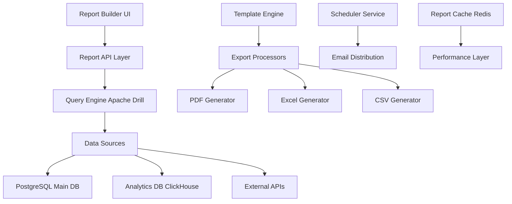

# 📊 FC-037: Advanced Reporting Engine - TECH CONCEPT

**Feature-Code:** FC-037  
**Feature-Name:** Advanced Reporting Engine  
**Kategorie:** Business Intelligence & Analytics  
**Priorität:** HIGH  
**Geschätzter Aufwand:** 7 Tage  
**Status:** 📋 PLANNED - Tech Concept verfügbar  

---

## 🧠 CLAUDE WORKING SECTION (15-Min Context Chunk)

### ⚡ SOFORT STARTEN (2 Minuten):
```bash
# 1. Reporting Engine Backend Setup
cd backend/src/main/java/de/freshplan/domain
mkdir reporting && cd reporting
touch ReportEngine.java ReportTemplate.java ReportScheduler.java

# 2. Frontend Report Builder
cd frontend/src/features
mkdir reporting && cd reporting
touch ReportBuilder.tsx ReportViewer.tsx ReportDashboard.tsx
```

### 📋 IMPLEMENTIERUNGS-CHECKLISTE:
- [ ] **Phase 1:** Report Data Layer & SQL Query Builder (Tag 1-2)
- [ ] **Phase 2:** Visual Report Builder UI (Tag 3-4)  
- [ ] **Phase 3:** Template Engine & Export Formats (Tag 5-6)
- [ ] **Phase 4:** Scheduled Reports & Distribution (Tag 7)

---

## 🎯 FEATURE OVERVIEW

### Was ist Advanced Reporting Engine?
Umfassende Business Intelligence Lösung mit visuellen Report-Designer, SQL Query Builder, automatisierte Berichte, Multi-Format Export (PDF, Excel, CSV) und Scheduled Report Distribution für alle Geschäftsbereiche.

### Business Value
- **Self-Service Analytics** für alle Benutzerrollen ohne IT-Abhängigkeit
- **Automatisierte Management-Reports** mit Scheduled Distribution  
- **Datengetriebene Entscheidungen** durch Custom KPI Dashboards
- **Compliance-Reports** für Audits und Geschäftsführung

### Erfolgsmetriken
- 80% weniger manuelle Report-Erstellung durch Automatisierung
- 50% schnellere Business-Entscheidungen durch Self-Service Analytics
- 90% Reduktion IT-Anfragen für Standard-Reports

---

## 🏗️ TECHNISCHE ARCHITEKTUR

### Tech Stack
- **Backend:** Apache Superset + Custom Quarkus API Layer
- **Query Engine:** Apache Drill für Multi-Source Queries
- **Frontend:** React + Apache ECharts + Custom Report Builder
- **Export:** Apache POI (Excel), iText (PDF), OpenCSV
- **Scheduling:** Quartz Scheduler + Email Distribution

### System Architecture


### Component Architecture
```typescript
reporting/
├── components/
│   ├── ReportBuilder.tsx          # Visual Report Designer
│   ├── QueryBuilder.tsx           # SQL Query Visual Builder  
│   ├── ChartDesigner.tsx          # Chart Configuration UI
│   ├── ReportViewer.tsx           # Report Display Component
│   ├── ReportDashboard.tsx        # Reports Overview
│   ├── ScheduleManager.tsx        # Report Scheduling UI
│   └── ExportManager.tsx          # Export Options Panel
├── hooks/
│   ├── useReportBuilder.ts        # Report Building Logic
│   ├── useQueryBuilder.ts         # Query Construction
│   ├── useReportData.ts           # Data Fetching
│   ├── useReportExport.ts         # Export Functionality
│   └── useReportScheduling.ts     # Scheduling Management
├── services/
│   ├── reportingApi.ts            # Reporting API Client
│   ├── queryEngine.ts             # Query Execution Service
│   ├── chartEngine.ts             # Chart Generation Service
│   └── exportService.ts           # Export Processing
└── utils/
    ├── queryValidation.ts         # SQL Query Validation
    ├── chartHelpers.ts            # Chart Configuration Utils
    ├── reportTemplates.ts         # Pre-built Report Templates
    └── dataFormatters.ts          # Data Transformation Utils
```

---

## 🔧 QUERY ENGINE & DATA LAYER

### Apache Drill Integration
```java
@ApplicationScoped
public class QueryEngineService {
    
    @ConfigProperty(name = "drill.connection.url")
    String drillConnectionUrl;
    
    @ConfigProperty(name = "drill.username")
    String drillUsername;
    
    @ConfigProperty(name = "drill.password")
    String drillPassword;
    
    private Connection drillConnection;
    
    @PostConstruct
    void initializeDrillConnection() {
        try {
            Class.forName("org.apache.drill.jdbc.Driver");
            this.drillConnection = DriverManager.getConnection(
                drillConnectionUrl, 
                drillUsername, 
                drillPassword
            );
        } catch (Exception e) {
            Log.error("Failed to initialize Apache Drill connection", e);
            throw new QueryEngineException("Cannot connect to query engine", e);
        }
    }
    
    public CompletionStage<QueryResult> executeQuery(QueryRequest request) {
        return CompletableFuture.supplyAsync(() -> {
            try {
                // 1. Validate query for security
                validateQuery(request.getQuery());
                
                // 2. Apply user-based data filters
                String enhancedQuery = applyDataFilters(request.getQuery(), request.getUserId());
                
                // 3. Execute query with timeout
                try (PreparedStatement stmt = drillConnection.prepareStatement(enhancedQuery)) {
                    stmt.setQueryTimeout(300); // 5 minutes max
                    
                    // Set parameters
                    setQueryParameters(stmt, request.getParameters());
                    
                    try (ResultSet rs = stmt.executeQuery()) {
                        return buildQueryResult(rs, request);
                    }
                }
            } catch (SQLException e) {
                Log.error("Query execution failed", e);
                throw new QueryExecutionException("Failed to execute query", e);
            }
        });
    }
    
    private void validateQuery(String query) {
        // Security validation
        String upperQuery = query.toUpperCase().trim();
        
        // Block dangerous operations
        List<String> forbiddenOperations = List.of(
            "DROP", "DELETE", "UPDATE", "INSERT", "CREATE", "ALTER",
            "TRUNCATE", "GRANT", "REVOKE", "EXEC"
        );
        
        for (String operation : forbiddenOperations) {
            if (upperQuery.contains(operation)) {
                throw new SecurityException("Operation not allowed: " + operation);
            }
        }
        
        // Block system tables
        if (upperQuery.contains("INFORMATION_SCHEMA") || 
            upperQuery.contains("PG_") || 
            upperQuery.contains("SYS.")) {
            throw new SecurityException("System tables access not allowed");
        }
        
        // Validate query structure
        if (!upperQuery.startsWith("SELECT") && !upperQuery.startsWith("WITH")) {
            throw new SecurityException("Only SELECT queries are allowed");
        }
    }
    
    private String applyDataFilters(String query, UUID userId) {
        // Apply row-level security based on user role
        User user = userRepository.findById(userId);
        
        switch (user.getRole()) {
            case SALES_REP:
                // Sales reps only see their own customers
                return addWhereClause(query, String.format(
                    "customers.sales_rep_id = '%s'", userId
                ));
            
            case MANAGER:
                // Managers see their team's data
                List<UUID> teamMemberIds = getTeamMemberIds(userId);
                return addWhereClause(query, String.format(
                    "customers.sales_rep_id IN (%s)", 
                    teamMemberIds.stream()
                        .map(id -> "'" + id + "'")
                        .collect(Collectors.joining(", "))
                ));
            
            case ADMIN:
                // Admins see all data
                return query;
                
            default:
                throw new SecurityException("Unknown user role: " + user.getRole());
        }
    }
    
    private QueryResult buildQueryResult(ResultSet rs, QueryRequest request) throws SQLException {
        List<Map<String, Object>> rows = new ArrayList<>();
        List<ColumnMetadata> columns = new ArrayList<>();
        
        // Extract column metadata
        ResultSetMetaData metaData = rs.getMetaData();
        for (int i = 1; i <= metaData.getColumnCount(); i++) {
            columns.add(ColumnMetadata.builder()
                .name(metaData.getColumnName(i))
                .type(metaData.getColumnTypeName(i))
                .displayName(formatColumnName(metaData.getColumnName(i)))
                .build());
        }
        
        // Extract data rows
        while (rs.next()) {
            Map<String, Object> row = new HashMap<>();
            for (int i = 1; i <= metaData.getColumnCount(); i++) {
                String columnName = metaData.getColumnName(i);
                Object value = rs.getObject(i);
                row.put(columnName, formatValue(value, metaData.getColumnType(i)));
            }
            rows.add(row);
        }
        
        return QueryResult.builder()
            .columns(columns)
            .rows(rows)
            .totalRows(rows.size())
            .executionTimeMs(request.getExecutionTime())
            .query(request.getQuery())
            .build();
    }
}
```

### Report Template Engine
```java
@ApplicationScoped
public class ReportTemplateService {
    
    @Inject
    QueryEngineService queryEngine;
    
    @Inject
    ChartGenerationService chartService;
    
    public CompletionStage<Report> generateReport(ReportTemplate template, Map<String, Object> parameters) {
        return CompletableFuture.supplyAsync(() -> {
            try {
                Report.Builder reportBuilder = Report.builder()
                    .templateId(template.getId())
                    .title(template.getTitle())
                    .generatedAt(LocalDateTime.now())
                    .parameters(parameters);
                
                List<ReportSection> sections = new ArrayList<>();
                
                // Process each section in the template
                for (ReportSectionTemplate sectionTemplate : template.getSections()) {
                    ReportSection section = generateSection(sectionTemplate, parameters);
                    sections.add(section);
                }
                
                return reportBuilder
                    .sections(sections)
                    .build();
                    
            } catch (Exception e) {
                Log.error("Failed to generate report", e);
                throw new ReportGenerationException("Report generation failed", e);
            }
        });
    }
    
    private ReportSection generateSection(ReportSectionTemplate template, Map<String, Object> parameters) {
        switch (template.getType()) {
            case QUERY_TABLE:
                return generateTableSection(template, parameters);
            case CHART:
                return generateChartSection(template, parameters);
            case TEXT:
                return generateTextSection(template, parameters);
            case KPI_CARDS:
                return generateKpiSection(template, parameters);
            default:
                throw new UnsupportedOperationException("Section type not supported: " + template.getType());
        }
    }
    
    private ReportSection generateTableSection(ReportSectionTemplate template, Map<String, Object> parameters) {
        // Execute query for table data
        QueryRequest queryRequest = QueryRequest.builder()
            .query(template.getQuery())
            .parameters(parameters)
            .userId((UUID) parameters.get("userId"))
            .build();
        
        QueryResult queryResult = queryEngine.executeQuery(queryRequest).toCompletableFuture().join();
        
        return ReportSection.builder()
            .id(template.getId())
            .title(template.getTitle())
            .type(SectionType.TABLE)
            .data(TableData.builder()
                .columns(queryResult.getColumns())
                .rows(queryResult.getRows())
                .formatting(template.getTableFormatting())
                .build())
            .build();
    }
    
    private ReportSection generateChartSection(ReportSectionTemplate template, Map<String, Object> parameters) {
        // Execute query for chart data
        QueryResult queryResult = executeTemplateQuery(template, parameters);
        
        // Generate chart configuration
        ChartConfiguration chartConfig = ChartConfiguration.builder()
            .type(template.getChartType())
            .xAxis(template.getXAxisColumn())
            .yAxis(template.getYAxisColumns())
            .title(template.getTitle())
            .colors(List.of("#94C456", "#004F7B", "#FFA726", "#9C27B0"))
            .build();
        
        ChartData chartData = chartService.generateChart(queryResult, chartConfig);
        
        return ReportSection.builder()
            .id(template.getId())
            .title(template.getTitle())
            .type(SectionType.CHART)
            .data(chartData)
            .build();
    }
}
```

---

## 🎨 VISUAL REPORT BUILDER

### Report Builder Component
```typescript
export const ReportBuilder: React.FC<ReportBuilderProps> = ({
  template,
  onSave,
  onPreview
}) => {
  const [reportTemplate, setReportTemplate] = useState<ReportTemplate>(
    template || createEmptyTemplate()
  );
  const [previewData, setPreviewData] = useState<Report | null>(null);
  const [isPreviewLoading, setIsPreviewLoading] = useState(false);
  
  const handleAddSection = (sectionType: SectionType) => {
    const newSection = createEmptySection(sectionType);
    setReportTemplate(prev => ({
      ...prev,
      sections: [...prev.sections, newSection]
    }));
  };
  
  const handleSectionUpdate = (sectionId: string, updates: Partial<ReportSectionTemplate>) => {
    setReportTemplate(prev => ({
      ...prev,
      sections: prev.sections.map(section =>
        section.id === sectionId ? { ...section, ...updates } : section
      )
    }));
  };
  
  const handlePreview = async () => {
    setIsPreviewLoading(true);
    try {
      const preview = await reportingApi.generatePreview(reportTemplate, {
        userId: getCurrentUserId(),
        dateRange: getDefaultDateRange()
      });
      setPreviewData(preview);
    } catch (error) {
      toast.error('Fehler beim Erstellen der Vorschau');
    } finally {
      setIsPreviewLoading(false);
    }
  };
  
  return (
    <Container maxWidth="xl" sx={{ py: 3 }}>
      <Box sx={{ display: 'flex', height: 'calc(100vh - 200px)' }}>
        {/* Report Designer Panel */}
        <Paper sx={{ width: '60%', p: 2, mr: 2, overflow: 'auto' }}>
          <Box sx={{ mb: 3 }}>
            <Typography variant="h5" fontFamily="Antonio Bold" gutterBottom>
              Report Designer
            </Typography>
            
            {/* Report Metadata */}
            <Grid container spacing={2} sx={{ mb: 3 }}>
              <Grid item xs={8}>
                <TextField
                  fullWidth
                  label="Report Titel"
                  value={reportTemplate.title}
                  onChange={(e) => setReportTemplate(prev => ({
                    ...prev,
                    title: e.target.value
                  }))}
                />
              </Grid>
              <Grid item xs={4}>
                <FormControl fullWidth>
                  <InputLabel>Kategorie</InputLabel>
                  <Select
                    value={reportTemplate.category}
                    onChange={(e) => setReportTemplate(prev => ({
                      ...prev,
                      category: e.target.value as ReportCategory
                    }))}
                  >
                    <MenuItem value="SALES">Vertrieb</MenuItem>
                    <MenuItem value="FINANCE">Finanzen</MenuItem>
                    <MenuItem value="OPERATIONS">Betrieb</MenuItem>
                    <MenuItem value="MANAGEMENT">Management</MenuItem>
                  </Select>
                </FormControl>
              </Grid>
            </Grid>
          </Box>
          
          {/* Section Builder */}
          <Box sx={{ mb: 3 }}>
            <Typography variant="h6" gutterBottom>
              Report-Abschnitte
            </Typography>
            
            <Box sx={{ mb: 2 }}>
              <ButtonGroup variant="outlined">
                <Button
                  startIcon={<TableViewIcon />}
                  onClick={() => handleAddSection('QUERY_TABLE')}
                >
                  Tabelle
                </Button>
                <Button
                  startIcon={<BarChartIcon />}
                  onClick={() => handleAddSection('CHART')}
                >
                  Diagramm
                </Button>
                <Button
                  startIcon={<TextFieldsIcon />}
                  onClick={() => handleAddSection('TEXT')}
                >
                  Text
                </Button>
                <Button
                  startIcon={<DashboardIcon />}
                  onClick={() => handleAddSection('KPI_CARDS')}
                >
                  KPI Cards
                </Button>
              </ButtonGroup>
            </Box>
            
            {/* Sections List */}
            <DragDropContext onDragEnd={handleSectionReorder}>
              <Droppable droppableId="sections">
                {(provided) => (
                  <Box
                    {...provided.droppableProps}
                    ref={provided.innerRef}
                  >
                    {reportTemplate.sections.map((section, index) => (
                      <Draggable 
                        key={section.id} 
                        draggableId={section.id} 
                        index={index}
                      >
                        {(provided) => (
                          <Box
                            ref={provided.innerRef}
                            {...provided.draggableProps}
                            {...provided.dragHandleProps}
                            sx={{ mb: 2 }}
                          >
                            <SectionEditor
                              section={section}
                              onUpdate={(updates) => handleSectionUpdate(section.id, updates)}
                              onDelete={() => handleSectionDelete(section.id)}
                            />
                          </Box>
                        )}
                      </Draggable>
                    ))}
                    {provided.placeholder}
                  </Box>
                )}
              </Droppable>
            </DragDropContext>
          </Box>
          
          {/* Actions */}
          <Box sx={{ display: 'flex', gap: 2 }}>
            <Button
              variant="outlined"
              startIcon={<PreviewIcon />}
              onClick={handlePreview}
              disabled={isPreviewLoading}
            >
              Vorschau
            </Button>
            <Button
              variant="contained"
              startIcon={<SaveIcon />}
              onClick={() => onSave(reportTemplate)}
              sx={{ bgcolor: '#94C456' }}
            >
              Speichern
            </Button>
          </Box>
        </Paper>
        
        {/* Preview Panel */}
        <Paper sx={{ width: '40%', p: 2, overflow: 'auto' }}>
          <Typography variant="h6" gutterBottom>
            Vorschau
          </Typography>
          
          {isPreviewLoading ? (
            <ReportPreviewSkeleton />
          ) : previewData ? (
            <ReportViewer report={previewData} />
          ) : (
            <Box sx={{ 
              display: 'flex', 
              alignItems: 'center', 
              justifyContent: 'center',
              height: 200,
              color: 'text.secondary',
              border: '2px dashed #e0e0e0',
              borderRadius: 1
            }}>
              <Typography>
                Klicken Sie auf "Vorschau" um den Report zu sehen
              </Typography>
            </Box>
          )}
        </Paper>
      </Box>
    </Container>
  );
};

// Section Editor Component
const SectionEditor: React.FC<SectionEditorProps> = ({
  section,
  onUpdate,
  onDelete
}) => {
  const [expanded, setExpanded] = useState(false);
  
  return (
    <Accordion expanded={expanded} onChange={() => setExpanded(!expanded)}>
      <AccordionSummary expandIcon={<ExpandMoreIcon />}>
        <Box sx={{ display: 'flex', alignItems: 'center', width: '100%' }}>
          <getSectionIcon(section.type) />
          <Typography sx={{ ml: 1, flexGrow: 1 }}>
            {section.title || 'Unbenannter Abschnitt'}
          </Typography>
          <Chip size="small" label={getSectionTypeLabel(section.type)} />
        </Box>
      </AccordionSummary>
      
      <AccordionDetails>
        {section.type === 'QUERY_TABLE' && (
          <TableSectionEditor section={section} onUpdate={onUpdate} />
        )}
        {section.type === 'CHART' && (
          <ChartSectionEditor section={section} onUpdate={onUpdate} />
        )}
        {section.type === 'TEXT' && (
          <TextSectionEditor section={section} onUpdate={onUpdate} />
        )}
        {section.type === 'KPI_CARDS' && (
          <KpiSectionEditor section={section} onUpdate={onUpdate} />
        )}
        
        <Box sx={{ mt: 2, display: 'flex', justifyContent: 'flex-end' }}>
          <Button
            color="error"
            startIcon={<DeleteIcon />}
            onClick={() => onDelete()}
          >
            Löschen
          </Button>
        </Box>
      </AccordionDetails>
    </Accordion>
  );
};
```

### Query Builder Component
```typescript
export const QueryBuilder: React.FC<QueryBuilderProps> = ({
  initialQuery,
  onQueryChange,
  availableTables
}) => {
  const [query, setQuery] = useState(initialQuery || '');
  const [selectedTables, setSelectedTables] = useState<string[]>([]);
  const [selectedColumns, setSelectedColumns] = useState<Column[]>([]);
  const [filters, setFilters] = useState<QueryFilter[]>([]);
  const [queryResult, setQueryResult] = useState<QueryResult | null>(null);
  const [isValidating, setIsValidating] = useState(false);
  
  const handleValidateQuery = async () => {
    setIsValidating(true);
    try {
      const result = await reportingApi.validateQuery(query);
      setQueryResult(result);
      onQueryChange(query);
    } catch (error) {
      toast.error('Query validation failed');
    } finally {
      setIsValidating(false);
    }
  };
  
  const handleVisualQueryBuild = () => {
    const sqlQuery = buildSqlFromComponents({
      tables: selectedTables,
      columns: selectedColumns,
      filters: filters
    });
    setQuery(sqlQuery);
  };
  
  return (
    <Box>
      <Tabs value={queryBuilderMode} onChange={setQueryBuilderMode}>
        <Tab label="Visueller Builder" value="visual" />
        <Tab label="SQL Editor" value="sql" />
      </Tabs>
      
      {queryBuilderMode === 'visual' ? (
        <Box sx={{ mt: 2 }}>
          {/* Visual Query Builder */}
          <Grid container spacing={2}>
            <Grid item xs={4}>
              <Typography variant="h6" gutterBottom>
                Tabellen
              </Typography>
              <TableSelector
                tables={availableTables}
                selected={selectedTables}
                onSelectionChange={setSelectedTables}
              />
            </Grid>
            
            <Grid item xs={4}>
              <Typography variant="h6" gutterBottom>
                Spalten
              </Typography>
              <ColumnSelector
                tables={selectedTables}
                selected={selectedColumns}
                onSelectionChange={setSelectedColumns}
              />
            </Grid>
            
            <Grid item xs={4}>
              <Typography variant="h6" gutterBottom>
                Filter
              </Typography>
              <FilterBuilder
                filters={filters}
                availableColumns={selectedColumns}
                onFiltersChange={setFilters}
              />
            </Grid>
          </Grid>
          
          <Box sx={{ mt: 2 }}>
            <Button
              variant="contained"
              onClick={handleVisualQueryBuild}
              startIcon={<BuildIcon />}
            >
              SQL generieren
            </Button>
          </Box>
        </Box>
      ) : (
        <Box sx={{ mt: 2 }}>
          {/* SQL Editor */}
          <MonacoEditor
            width="100%"
            height="300px"
            language="sql"
            theme="vs-light"
            value={query}
            onChange={setQuery}
            options={{
              minimap: { enabled: false },
              lineNumbers: 'on',
              roundedSelection: false,
              scrollBeyondLastLine: false,
              automaticLayout: true
            }}
          />
        </Box>
      )}
      
      <Box sx={{ mt: 2, display: 'flex', gap: 2 }}>
        <Button
          variant="outlined"
          onClick={handleValidateQuery}
          disabled={isValidating || !query.trim()}
          startIcon={<PlayArrowIcon />}
        >
          Query testen
        </Button>
        
        {queryResult && (
          <Chip
            color={queryResult.isValid ? 'success' : 'error'}
            label={queryResult.isValid ? 
              `${queryResult.rowCount} Zeilen` : 
              'Fehler in Query'
            }
          />
        )}
      </Box>
      
      {queryResult && queryResult.isValid && (
        <Box sx={{ mt: 2 }}>
          <Typography variant="h6" gutterBottom>
            Query Ergebnis (erste 10 Zeilen)
          </Typography>
          <QueryResultPreview result={queryResult} />
        </Box>
      )}
    </Box>
  );
};
```

---

## 📁 EXPORT & DISTRIBUTION

### Export Service
```java
@ApplicationScoped
public class ReportExportService {
    
    @Inject
    PDFExportProcessor pdfProcessor;
    
    @Inject
    ExcelExportProcessor excelProcessor;
    
    @Inject
    CSVExportProcessor csvProcessor;
    
    public CompletionStage<ExportResult> exportReport(Report report, ExportFormat format) {
        return CompletableFuture.supplyAsync(() -> {
            try {
                switch (format) {
                    case PDF:
                        return pdfProcessor.export(report);
                    case EXCEL:
                        return excelProcessor.export(report);
                    case CSV:
                        return csvProcessor.export(report);
                    default:
                        throw new UnsupportedOperationException("Export format not supported: " + format);
                }
            } catch (Exception e) {
                Log.error("Report export failed", e);
                throw new ReportExportException("Export failed", e);
            }
        });
    }
}

@ApplicationScoped
public class PDFExportProcessor {
    
    public ExportResult export(Report report) throws DocumentException, IOException {
        ByteArrayOutputStream outputStream = new ByteArrayOutputStream();
        
        Document document = new Document(PageSize.A4);
        PdfWriter writer = PdfWriter.getInstance(document, outputStream);
        
        document.open();
        
        // Add report header
        addReportHeader(document, report);
        
        // Process each section
        for (ReportSection section : report.getSections()) {
            addSection(document, section);
        }
        
        // Add footer with generation info
        addReportFooter(document, report);
        
        document.close();
        
        return ExportResult.builder()
            .format(ExportFormat.PDF)
            .fileName(generateFileName(report, "pdf"))
            .data(outputStream.toByteArray())
            .size(outputStream.size())
            .build();
    }
    
    private void addSection(Document document, ReportSection section) throws DocumentException {
        // Section title
        Paragraph title = new Paragraph(section.getTitle(), 
            FontFactory.getFont(FontFactory.HELVETICA_BOLD, 14));
        title.setSpacingAfter(10);
        document.add(title);
        
        switch (section.getType()) {
            case TABLE:
                addTableSection(document, (TableData) section.getData());
                break;
            case CHART:
                addChartSection(document, (ChartData) section.getData());
                break;
            case TEXT:
                addTextSection(document, (TextData) section.getData());
                break;
            case KPI_CARDS:
                addKpiSection(document, (KpiData) section.getData());
                break;
        }
        
        document.add(new Paragraph(" ")); // Add spacing
    }
    
    private void addTableSection(Document document, TableData tableData) throws DocumentException {
        PdfPTable table = new PdfPTable(tableData.getColumns().size());
        table.setWidthPercentage(100);
        
        // Add headers
        for (ColumnMetadata column : tableData.getColumns()) {
            PdfPCell header = new PdfPCell(new Phrase(column.getDisplayName(), 
                FontFactory.getFont(FontFactory.HELVETICA_BOLD)));
            header.setBackgroundColor(new BaseColor(148, 196, 86)); // Freshfoodz Grün
            header.setHorizontalAlignment(Element.ALIGN_CENTER);
            table.addCell(header);
        }
        
        // Add data rows
        for (Map<String, Object> row : tableData.getRows()) {
            for (ColumnMetadata column : tableData.getColumns()) {
                Object value = row.get(column.getName());
                String cellValue = formatCellValue(value, column.getType());
                table.addCell(new PdfPCell(new Phrase(cellValue)));
            }
        }
        
        document.add(table);
    }
}
```

### Scheduled Reports
```java
@ApplicationScoped
public class ReportSchedulerService {
    
    @Inject
    ReportTemplateService templateService;
    
    @Inject
    ReportExportService exportService;
    
    @Inject
    EmailService emailService;
    
    @Scheduled(every = "1h")
    public void processScheduledReports() {
        Log.info("Processing scheduled reports");
        
        LocalDateTime now = LocalDateTime.now();
        
        List<ScheduledReport> dueReports = scheduledReportRepository
            .findDueReports(now);
        
        dueReports.parallelStream()
            .forEach(this::processScheduledReport);
    }
    
    private void processScheduledReport(ScheduledReport scheduledReport) {
        try {
            Log.info("Processing scheduled report: " + scheduledReport.getId());
            
            // 1. Generate report
            Map<String, Object> parameters = buildReportParameters(scheduledReport);
            Report report = templateService
                .generateReport(scheduledReport.getTemplate(), parameters)
                .toCompletableFuture()
                .join();
            
            // 2. Export in requested formats
            List<ExportResult> exports = new ArrayList<>();
            for (ExportFormat format : scheduledReport.getExportFormats()) {
                ExportResult exportResult = exportService
                    .exportReport(report, format)
                    .toCompletableFuture()
                    .join();
                exports.add(exportResult);
            }
            
            // 3. Distribute via email
            if (scheduledReport.isEmailDistribution()) {
                distributeViaEmail(scheduledReport, report, exports);
            }
            
            // 4. Save to file system if configured
            if (scheduledReport.getFileSystemPath() != null) {
                saveToFileSystem(scheduledReport, exports);
            }
            
            // 5. Update next execution time
            updateNextExecution(scheduledReport);
            
            Log.info("Successfully processed scheduled report: " + scheduledReport.getId());
            
        } catch (Exception e) {
            Log.error("Failed to process scheduled report: " + scheduledReport.getId(), e);
            handleScheduledReportError(scheduledReport, e);
        }
    }
    
    private void distributeViaEmail(
        ScheduledReport scheduledReport, 
        Report report, 
        List<ExportResult> exports
    ) {
        EmailRequest emailRequest = EmailRequest.builder()
            .to(scheduledReport.getRecipients())
            .subject(String.format("Automated Report: %s", report.getTitle()))
            .body(generateEmailBody(report, scheduledReport))
            .attachments(exports.stream()
                .map(export -> EmailAttachment.builder()
                    .fileName(export.getFileName())
                    .data(export.getData())
                    .mimeType(export.getFormat().getMimeType())
                    .build())
                .collect(Collectors.toList()))
            .build();
        
        emailService.sendEmail(emailRequest);
    }
    
    private String generateEmailBody(Report report, ScheduledReport scheduledReport) {
        return String.format("""
            Hallo,
            
            anbei finden Sie den automatisch generierten Report "%s".
            
            Report-Details:
            - Erstellt am: %s
            - Datenstand: %s
            - Nächste Ausführung: %s
            
            Bei Fragen wenden Sie sich an das Sales-Team.
            
            Mit freundlichen Grüßen,
            FreshPlan Sales Tool
            """,
            report.getTitle(),
            formatDateTime(report.getGeneratedAt()),
            formatDateTime(LocalDateTime.now()),
            formatDateTime(scheduledReport.getNextExecution())
        );
    }
}
```

---

## 🧪 TESTING & PERFORMANCE

### Query Performance Testing
```java
@QuarkusTest
class QueryEngineServiceTest {
    
    @Inject
    QueryEngineService queryEngine;
    
    @Test
    void shouldExecuteSimpleQueryWithinTimeout() {
        // Given
        QueryRequest request = QueryRequest.builder()
            .query("SELECT COUNT(*) as customer_count FROM customers")
            .userId(createTestUserId())
            .build();
        
        // When
        long startTime = System.currentTimeMillis();
        QueryResult result = queryEngine.executeQuery(request)
            .toCompletableFuture()
            .join();
        long executionTime = System.currentTimeMillis() - startTime;
        
        // Then
        assertThat(result).isNotNull();
        assertThat(result.getRows()).isNotEmpty();
        assertThat(executionTime).isLessThan(5000); // 5 seconds max
    }
    
    @Test
    void shouldBlockDangerousQueries() {
        // Given
        QueryRequest request = QueryRequest.builder()
            .query("DROP TABLE customers")
            .userId(createTestUserId())
            .build();
        
        // When & Then
        assertThatThrownBy(() -> 
            queryEngine.executeQuery(request).toCompletableFuture().join()
        ).hasRootCauseInstanceOf(SecurityException.class);
    }
    
    @Test
    void shouldApplyRowLevelSecurity() {
        // Given
        UUID salesRepId = createTestSalesRep();
        QueryRequest request = QueryRequest.builder()
            .query("SELECT * FROM customers")
            .userId(salesRepId)
            .build();
        
        // When
        QueryResult result = queryEngine.executeQuery(request)
            .toCompletableFuture()
            .join();
        
        // Then
        assertThat(result.getRows()).allSatisfy(row -> {
            assertThat(row.get("sales_rep_id")).isEqualTo(salesRepId.toString());
        });
    }
}
```

### Performance Optimization
```java
@ApplicationScoped
public class QueryOptimizationService {
    
    @Inject
    @ConfigProperty(name = "query.cache.enabled", defaultValue = "true")
    boolean cacheEnabled;
    
    @Inject
    @ConfigProperty(name = "query.cache.ttl.minutes", defaultValue = "15")
    int cacheTtlMinutes;
    
    private final Cache<String, QueryResult> queryCache = 
        Caffeine.newBuilder()
            .maximumSize(1000)
            .expireAfterWrite(15, TimeUnit.MINUTES)
            .recordStats()
            .build();
    
    public CompletionStage<QueryResult> executeOptimizedQuery(QueryRequest request) {
        if (cacheEnabled && isQueryCacheable(request)) {
            String cacheKey = generateCacheKey(request);
            QueryResult cached = queryCache.getIfPresent(cacheKey);
            
            if (cached != null) {
                Log.debug("Query cache hit: " + cacheKey);
                return CompletableFuture.completedFuture(cached);
            }
            
            return queryEngine.executeQuery(request)
                .thenApply(result -> {
                    queryCache.put(cacheKey, result);
                    return result;
                });
        }
        
        return queryEngine.executeQuery(request);
    }
    
    private boolean isQueryCacheable(QueryRequest request) {
        String query = request.getQuery().toLowerCase().trim();
        
        // Don't cache queries with time-sensitive functions
        List<String> nonCacheableFunctions = List.of(
            "now()", "current_timestamp", "current_date",
            "random()", "uuid_generate"
        );
        
        return nonCacheableFunctions.stream()
            .noneMatch(query::contains);
    }
    
    @Scheduled(every = "1h")
    public void logCacheStatistics() {
        CacheStats stats = queryCache.stats();
        Log.info(String.format(
            "Query cache stats - Hit rate: %.2f%%, Evictions: %d, Size: %d",
            stats.hitRate() * 100,
            stats.evictionCount(),
            queryCache.estimatedSize()
        ));
    }
}
```

---

## 🔗 NAVIGATION & DEPENDENCIES

### 🧭 VOLLSTÄNDIGE FEATURE-NAVIGATION (40 Features)

#### 🟢 ACTIVE Features (9)
- [FC-008 Security Foundation](/docs/features/ACTIVE/01_security_foundation/FC-008_KOMPAKT.md)
- [M4 Opportunity Pipeline](/docs/features/ACTIVE/02_opportunity_pipeline/M4_KOMPAKT.md)
- [M8 Calculator Modal](/docs/features/ACTIVE/03_calculator_modal/M8_KOMPAKT.md)
- [FC-009 Permissions System](/docs/features/ACTIVE/04_permissions_system/FC-009_KOMPAKT.md)
- [M1 Navigation](/docs/features/ACTIVE/05_ui_foundation/M1_NAVIGATION_KOMPAKT.md)
- [M2 Quick Create](/docs/features/ACTIVE/05_ui_foundation/M2_QUICK_CREATE_KOMPAKT.md)
- [M3 Sales Cockpit](/docs/features/ACTIVE/05_ui_foundation/M3_SALES_COCKPIT_KOMPAKT.md)
- [M7 Settings](/docs/features/ACTIVE/05_ui_foundation/M7_SETTINGS_KOMPAKT.md)

#### 🔵 PLANNED Features (31)
- [FC-003 E-Mail Integration](/docs/features/PLANNED/06_email_integration/FC-003_TECH_CONCEPT.md)
- [FC-004 Verkäuferschutz](/docs/features/PLANNED/07_verkaeuferschutz/FC-004_TECH_CONCEPT.md)
- [FC-005 Xentral Integration](/docs/features/PLANNED/08_xentral_integration/FC-005_KOMPAKT.md)
- [FC-006 Mobile App](/docs/features/PLANNED/09_mobile_app/FC-006_TECH_CONCEPT.md)
- [FC-007 Chef-Dashboard](/docs/features/PLANNED/10_chef_dashboard/FC-007_TECH_CONCEPT.md)
- [FC-010 Customer Import](/docs/features/PLANNED/11_customer_import/FC-010_TECH_CONCEPT.md)
- [M5 Customer Refactor](/docs/features/PLANNED/12_customer_refactor_m5/M5_KOMPAKT.md)
- [M6 Analytics Module](/docs/features/PLANNED/13_analytics_m6/M6_KOMPAKT.md)
- [FC-012 Team Communication](/docs/features/PLANNED/14_team_communication/FC-012_KOMPAKT.md)
- [FC-013 Duplicate Detection](/docs/features/PLANNED/15_duplicate_detection/FC-013_KOMPAKT.md)
- [FC-014 Activity Timeline](/docs/features/PLANNED/16_activity_timeline/FC-014_KOMPAKT.md)
- [FC-015 Deal Loss Analysis](/docs/features/PLANNED/17_deal_loss_analysis/FC-015_KOMPAKT.md)
- [FC-016 Opportunity Cloning](/docs/features/PLANNED/18_opportunity_cloning/FC-016_KOMPAKT.md)
- [FC-017 Sales Gamification](/docs/features/PLANNED/99_sales_gamification/FC-017_KOMPAKT.md)
- [FC-018 Mobile PWA](/docs/features/PLANNED/09_mobile_app/FC-018_MOBILE_FIELD_SALES.md)
- [FC-019 Advanced Sales Metrics](/docs/features/PLANNED/19_advanced_metrics/FC-019_KOMPAKT.md)
- [FC-020 Quick Wins](/docs/features/PLANNED/20_quick_wins/FC-020_TECH_CONCEPT.md)
- [FC-021 Integration Hub](/docs/features/PLANNED/21_integration_hub/FC-021_TECH_CONCEPT.md)
- [FC-022 Mobile Light](/docs/features/PLANNED/22_mobile_light/FC-022_KOMPAKT.md)
- [FC-023 Event Sourcing](/docs/features/PLANNED/23_event_sourcing/FC-023_TECH_CONCEPT.md)
- [FC-024 File Management](/docs/features/PLANNED/24_file_management/FC-024_TECH_CONCEPT.md)
- [FC-025 DSGVO Compliance](/docs/features/PLANNED/25_dsgvo_compliance/FC-025_TECH_CONCEPT.md)
- [FC-026 Analytics Platform](/docs/features/PLANNED/26_analytics_platform/FC-026_TECH_CONCEPT.md)
- [FC-027 Magic Moments](/docs/features/PLANNED/27_magic_moments/FC-027_KOMPAKT.md)
- [FC-028 WhatsApp Business](/docs/features/PLANNED/28_whatsapp_integration/FC-028_KOMPAKT.md)
- [FC-029 Voice-First Interface](/docs/features/PLANNED/29_voice_first/FC-029_TECH_CONCEPT.md)
- [FC-030 One-Tap Actions](/docs/features/PLANNED/30_one_tap_actions/FC-030_TECH_CONCEPT.md)
- [FC-031 Smart Templates](/docs/features/PLANNED/31_smart_templates/FC-031_TECH_CONCEPT.md)
- [FC-032 Offline-First](/docs/features/PLANNED/32_offline_first/FC-032_TECH_CONCEPT.md)
- [FC-033 Visual Customer Cards](/docs/features/PLANNED/33_visual_cards/FC-033_TECH_CONCEPT.md)
- [FC-034 Instant Insights](/docs/features/PLANNED/34_instant_insights/FC-034_TECH_CONCEPT.md)
- [FC-035 Social Selling Helper](/docs/features/PLANNED/35_social_selling/FC-035_TECH_CONCEPT.md)
- [FC-036 Beziehungsmanagement](/docs/features/PLANNED/36_relationship_mgmt/FC-036_TECH_CONCEPT.md)
- **→ FC-037 Advanced Reporting Engine** ← **SIE SIND HIER**
- [FC-038 Multi-Tenant Architecture](#) ← **NÄCHSTES TECH CONCEPT**
- [FC-039 API Gateway](#) ← **SESSION 15**
- [FC-040 Performance Monitoring](#) ← **SESSION 15**

### 📋 ABHÄNGIGKEITEN
- **Benötigt:** FC-026 Analytics Platform (Datengrundlage)
- **Ergänzt:** FC-023 Event Sourcing (Audit Reports)
- **Basis für:** Business Intelligence Dashboard

---

### 🔒 SECURITY & AUTHORIZATION
- **Row-Level Security:** Automatische Datenfilterung basierend auf Benutzerrolle
- **Query Validation:** Blockierung gefährlicher SQL-Operationen
- **Data Access Control:** Granulare Berechtigungen pro Tabelle/Spalte
- **Audit Logging:** Vollständige Protokollierung aller Report-Zugriffe

### 🚀 DEPLOYMENT STRATEGY
```yaml
# Phase 1 (Tag 1-2): Foundation
- Apache Drill Setup
- Query Engine Service
- Basic Security Layer

# Phase 2 (Tag 3-4): UI Builder
- Visual Report Builder
- Query Builder Component
- Preview Functionality

# Phase 3 (Tag 5-6): Export & Templates
- PDF/Excel/CSV Export
- Template Management
- Performance Optimization

# Phase 4 (Tag 7): Distribution
- Scheduled Reports
- Email Distribution
- Monitoring & Alerting
```

### 🎯 SUCCESS CRITERIA
- ✅ Visual Report Builder mit Drag & Drop
- ✅ Apache Drill Integration funktionsfähig
- ✅ Export in alle Formate (PDF, Excel, CSV)
- ✅ Automatisierte Report-Distribution
- ✅ Row-Level Security für alle Benutzerrollen
- ✅ Query Performance < 30 Sekunden für Standard-Reports
- ✅ Self-Service für 80% der Report-Anfragen

---

**⏱️ GESCHÄTZTE IMPLEMENTIERUNGSZEIT:** 7 Tage  
**🎯 BUSINESS IMPACT:** Sehr Hoch (Self-Service Analytics)  
**🔧 TECHNISCHE KOMPLEXITÄT:** Sehr Hoch (Apache Drill, Visual Builder)  
**📊 ROI:** Break-even nach 8 Wochen durch Automatisierung von Management-Reports