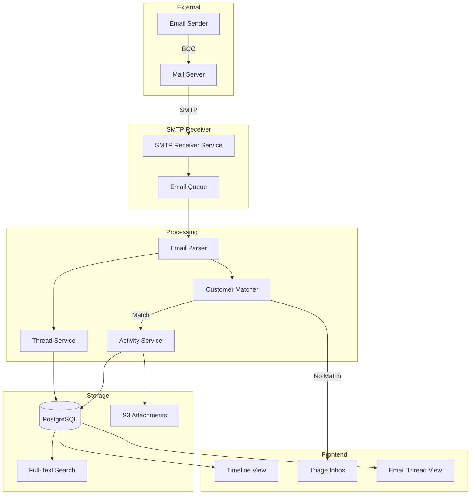
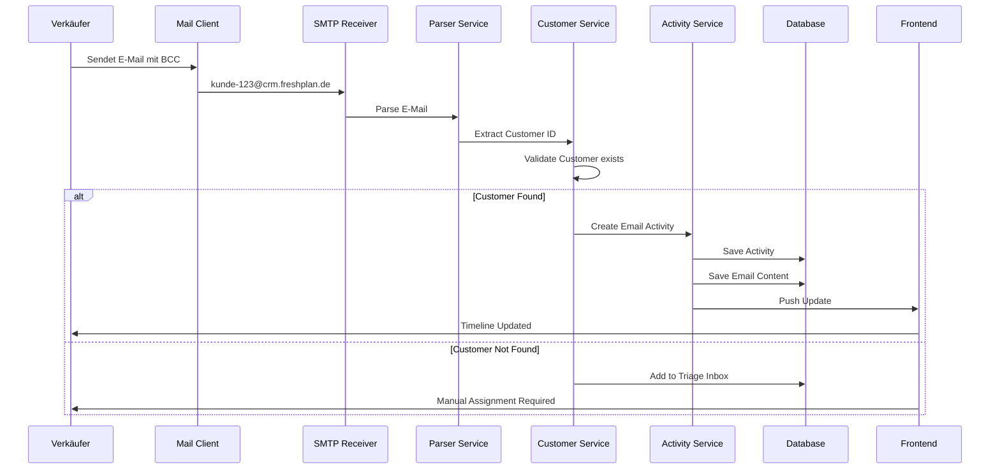

# FC-003: Technisches Konzept - E-Mail Integration (BCC-to-CRM)

**Feature Code:** FC-003  
**Datum:** 2025-07-20  
**Status:** ✅ Tech Concept Complete  
**Autor:** Claude  
**Reviewer:** Jörg  
**Geschätzte Dauer:** 5-7 Tage  

## 📋 Inhaltsverzeichnis

1. [Zusammenfassung](#zusammenfassung)
2. [Ziel und Geschäftswert](#ziel-und-geschäftswert)
3. [Technische Architektur](#technische-architektur)
4. [Backend-Implementierung](#backend-implementierung)
5. [Frontend-Implementierung](#frontend-implementierung)
6. [Implementierungsstrategie](#implementierungsstrategie)
7. [Entscheidungs-Log](#entscheidungs-log)
8. [Risiken und Mitigationen](#risiken-und-mitigationen)
9. [Zeitschätzung](#zeitschätzung)

## Zusammenfassung

FC-003 implementiert eine automatische E-Mail-Integration via BCC-to-CRM. Verkäufer senden E-Mails per BCC an `kunde-{customerId}@crm.freshplan.de`, das System ordnet diese automatisch dem richtigen Kunden zu und erstellt Timeline-Einträge. Unbekannte E-Mails landen in einer Triage-Inbox zur manuellen Zuordnung. Das Feature spart 30-45 Minuten pro Verkäufer pro Tag.

## Ziel und Geschäftswert

### Geschäftsziele
- **Zeitersparnis**: 30-45 Minuten/Tag pro Verkäufer durch automatische E-Mail-Erfassung
- **Vollständige Historie**: Lückenlose Kommunikations-Timeline für jeden Kunden
- **Compliance**: Automatische Dokumentation aller Kundenkommunikation

### Technische Ziele
- **Performance**: <2 Sekunden Verarbeitungszeit pro E-Mail
- **Accuracy**: 95%+ korrekte automatische Zuordnung
- **Skalierbarkeit**: Verarbeitung von 10.000+ E-Mails/Tag

## Technische Architektur

### System-Übersicht



### E-Mail Flow Detail



## Backend-Implementierung

### 1. Email Receiver Service

```java
@ApplicationScoped
@Startup
public class SmtpReceiverService {
    
    @ConfigProperty(name = "email.receiver.host", defaultValue = "0.0.0.0")
    String smtpHost;
    
    @ConfigProperty(name = "email.receiver.port", defaultValue = "25")
    int smtpPort;
    
    @ConfigProperty(name = "email.receiver.domain")
    String emailDomain; // crm.freshplan.de
    
    @Inject
    EmailProcessingService processingService;
    
    private SMTPServer smtpServer;
    
    void onStart(@Observes StartupEvent ev) {
        SMTPServer.Builder builder = SMTPServer
            .port(smtpPort)
            .hostName(smtpHost)
            .messageHandlerFactory(new MessageHandlerFactory() {
                @Override
                public MessageHandler create(MessageContext ctx) {
                    return new CrmMessageHandler(processingService);
                }
            });
            
        smtpServer = builder.build();
        smtpServer.start();
        
        Log.info("SMTP Server started on " + smtpHost + ":" + smtpPort);
    }
    
    void onStop(@Observes ShutdownEvent ev) {
        if (smtpServer != null) {
            smtpServer.stop();
        }
    }
}

class CrmMessageHandler implements MessageHandler {
    private final EmailProcessingService processingService;
    private String from;
    private List<String> recipients = new ArrayList<>();
    
    CrmMessageHandler(EmailProcessingService processingService) {
        this.processingService = processingService;
    }
    
    @Override
    public void from(String from) throws RejectException {
        this.from = from;
    }
    
    @Override
    public void recipient(String recipient) throws RejectException {
        // Validate it's for our domain
        if (!recipient.endsWith("@crm.freshplan.de")) {
            throw new RejectException("Invalid recipient domain");
        }
        recipients.add(recipient);
    }
    
    @Override
    public void data(InputStream data) throws IOException {
        try {
            MimeMessage message = new MimeMessage(
                Session.getDefaultInstance(new Properties()), 
                data
            );
            
            IncomingEmail email = IncomingEmail.builder()
                .from(from)
                .recipients(recipients)
                .subject(message.getSubject())
                .messageId(message.getMessageID())
                .inReplyTo(getHeader(message, "In-Reply-To"))
                .references(getHeader(message, "References"))
                .sentDate(message.getSentDate())
                .rawMessage(data)
                .build();
                
            processingService.processAsync(email);
            
        } catch (MessagingException e) {
            Log.error("Failed to parse email", e);
            throw new RejectException("Invalid email format");
        }
    }
}
```

### 2. Email Processing Service

```java
@ApplicationScoped
@Transactional
public class EmailProcessingService {
    
    @Inject
    CustomerRepository customerRepository;
    
    @Inject
    EmailActivityService emailActivityService;
    
    @Inject
    EmailThreadService threadService;
    
    @Inject
    AttachmentService attachmentService;
    
    @Inject
    TriageInboxService triageService;
    
    @Inject
    Event<EmailReceivedEvent> emailReceivedEvent;
    
    @Async
    public CompletionStage<Void> processAsync(IncomingEmail email) {
        return CompletableFuture.runAsync(() -> {
            try {
                processEmail(email);
            } catch (Exception e) {
                Log.error("Failed to process email: " + email.getMessageId(), e);
                // Add to dead letter queue
                triageService.addToDeadLetter(email, e.getMessage());
            }
        });
    }
    
    private void processEmail(IncomingEmail email) {
        // 1. Parse recipient to extract customer ID
        Optional<CustomerEmailMatch> match = parseCustomerFromRecipients(email);
        
        if (match.isPresent()) {
            // 2. Create email activity for customer
            processCustomerEmail(match.get(), email);
        } else {
            // 3. Add to triage inbox
            processUnmatchedEmail(email);
        }
    }
    
    private Optional<CustomerEmailMatch> parseCustomerFromRecipients(IncomingEmail email) {
        // Pattern: kunde-{uuid}@crm.freshplan.de or {customerNumber}@crm.freshplan.de
        Pattern uuidPattern = Pattern.compile("kunde-([a-f0-9-]{36})@crm\\.freshplan\\.de");
        Pattern numberPattern = Pattern.compile("([0-9]+)@crm\\.freshplan\\.de");
        
        for (String recipient : email.getRecipients()) {
            // Try UUID pattern
            Matcher uuidMatcher = uuidPattern.matcher(recipient.toLowerCase());
            if (uuidMatcher.matches()) {
                UUID customerId = UUID.fromString(uuidMatcher.group(1));
                Optional<Customer> customer = customerRepository.findById(customerId);
                if (customer.isPresent()) {
                    return Optional.of(new CustomerEmailMatch(customer.get(), recipient));
                }
            }
            
            // Try customer number pattern
            Matcher numberMatcher = numberPattern.matcher(recipient.toLowerCase());
            if (numberMatcher.matches()) {
                String customerNumber = numberMatcher.group(1);
                Optional<Customer> customer = customerRepository.findByCustomerNumber(customerNumber);
                if (customer.isPresent()) {
                    return Optional.of(new CustomerEmailMatch(customer.get(), recipient));
                }
            }
        }
        
        return Optional.empty();
    }
    
    private void processCustomerEmail(CustomerEmailMatch match, IncomingEmail email) {
        // 1. Parse email content
        EmailContent content = parseEmailContent(email);
        
        // 2. Find or create thread
        EmailThread thread = threadService.findOrCreateThread(
            email.getMessageId(),
            email.getInReplyTo(),
            email.getReferences(),
            match.getCustomer().getId()
        );
        
        // 3. Create email activity
        EmailActivity activity = emailActivityService.createEmailActivity(
            match.getCustomer(),
            email.getFrom(),
            content,
            thread,
            ActivityDirection.INCOMING
        );
        
        // 4. Process attachments
        if (!content.getAttachments().isEmpty()) {
            attachmentService.processEmailAttachments(
                activity.getId(),
                content.getAttachments()
            );
        }
        
        // 5. Fire event
        emailReceivedEvent.fire(new EmailReceivedEvent(
            match.getCustomer().getId(),
            activity.getId(),
            email.getFrom()
        ));
        
        Log.info("Email processed for customer " + match.getCustomer().getId() + 
                 " with activity " + activity.getId());
    }
    
    private void processUnmatchedEmail(IncomingEmail email) {
        // Try to find customer by sender email
        Optional<Customer> senderCustomer = customerRepository
            .findByContactEmail(email.getFrom());
            
        TriageEmail triageEmail = triageService.createTriageEmail(
            email,
            senderCustomer.orElse(null),
            "No matching recipient pattern"
        );
        
        Log.info("Email added to triage inbox: " + triageEmail.getId());
    }
    
    private EmailContent parseEmailContent(IncomingEmail email) {
        try {
            MimeMessage message = new MimeMessage(
                Session.getDefaultInstance(new Properties()), 
                email.getRawMessage()
            );
            
            EmailContent content = new EmailContent();
            content.setSubject(message.getSubject());
            
            // Parse body and attachments
            parseMessagePart(message, content);
            
            return content;
            
        } catch (Exception e) {
            throw new EmailParsingException("Failed to parse email content", e);
        }
    }
    
    private void parseMessagePart(Part part, EmailContent content) throws Exception {
        if (part.isMimeType("text/plain")) {
            content.setPlainText((String) part.getContent());
        } else if (part.isMimeType("text/html")) {
            content.setHtmlText((String) part.getContent());
        } else if (part.isMimeType("multipart/*")) {
            Multipart multipart = (Multipart) part.getContent();
            for (int i = 0; i < multipart.getCount(); i++) {
                parseMessagePart(multipart.getBodyPart(i), content);
            }
        } else if (Part.ATTACHMENT.equalsIgnoreCase(part.getDisposition())) {
            EmailAttachment attachment = new EmailAttachment();
            attachment.setFileName(part.getFileName());
            attachment.setContentType(part.getContentType());
            attachment.setSize(part.getSize());
            attachment.setContent(part.getInputStream());
            content.addAttachment(attachment);
        }
    }
}
```

### 3. Email Activity Service

```java
@ApplicationScoped
public class EmailActivityService {
    
    @Inject
    ActivityRepository activityRepository;
    
    @Inject
    EmailRepository emailRepository;
    
    @PersistenceContext
    EntityManager em;
    
    public EmailActivity createEmailActivity(
        Customer customer,
        String from,
        EmailContent content,
        EmailThread thread,
        ActivityDirection direction
    ) {
        // 1. Create base activity
        Activity activity = new Activity();
        activity.setCustomerId(customer.getId());
        activity.setType(ActivityType.EMAIL);
        activity.setDirection(direction);
        activity.setSubject(content.getSubject());
        activity.setDescription(extractPreview(content));
        activity.setActivityDate(LocalDateTime.now());
        activity.setCreatedBy(getSystemUserId());
        
        activityRepository.persist(activity);
        
        // 2. Create email-specific data
        Email email = new Email();
        email.setActivityId(activity.getId());
        email.setThreadId(thread.getId());
        email.setFromAddress(from);
        email.setToAddresses(thread.getParticipants());
        email.setSubject(content.getSubject());
        email.setPlainTextBody(content.getPlainText());
        email.setHtmlBody(content.getHtmlText());
        email.setHasAttachments(!content.getAttachments().isEmpty());
        
        emailRepository.persist(email);
        
        // 3. Update thread
        thread.setLastActivityDate(LocalDateTime.now());
        thread.incrementMessageCount();
        
        return new EmailActivity(activity, email);
    }
    
    private String extractPreview(EmailContent content) {
        String text = content.getPlainText() != null 
            ? content.getPlainText() 
            : stripHtml(content.getHtmlText());
            
        if (text == null) return "";
        
        // First 200 chars or first paragraph
        int endIndex = Math.min(text.length(), 200);
        int newlineIndex = text.indexOf('\n');
        if (newlineIndex > 0 && newlineIndex < endIndex) {
            endIndex = newlineIndex;
        }
        
        return text.substring(0, endIndex).trim() + 
               (text.length() > endIndex ? "..." : "");
    }
}
```

### 4. Email Thread Management

```java
@ApplicationScoped
public class EmailThreadService {
    
    @Inject
    EmailThreadRepository threadRepository;
    
    public EmailThread findOrCreateThread(
        String messageId,
        String inReplyTo,
        String references,
        UUID customerId
    ) {
        // 1. Try to find existing thread
        if (inReplyTo != null) {
            Optional<EmailThread> thread = threadRepository
                .findByMessageId(inReplyTo);
            if (thread.isPresent()) {
                return thread.get();
            }
        }
        
        // 2. Check references header
        if (references != null) {
            String[] refs = references.split("\\s+");
            for (String ref : refs) {
                Optional<EmailThread> thread = threadRepository
                    .findByMessageId(ref.trim());
                if (thread.isPresent()) {
                    return thread.get();
                }
            }
        }
        
        // 3. Create new thread
        EmailThread thread = new EmailThread();
        thread.setCustomerId(customerId);
        thread.setRootMessageId(messageId);
        thread.setSubject(extractThreadSubject(messageId));
        thread.setStartedAt(LocalDateTime.now());
        thread.setLastActivityDate(LocalDateTime.now());
        thread.setMessageCount(0);
        
        threadRepository.persist(thread);
        
        return thread;
    }
}
```

### 5. Triage Inbox Service

```java
@ApplicationScoped
public class TriageInboxService {
    
    @Inject
    TriageEmailRepository repository;
    
    @Inject
    EmailActivityService emailActivityService;
    
    @Inject
    Event<EmailAssignedEvent> emailAssignedEvent;
    
    public TriageEmail createTriageEmail(
        IncomingEmail email,
        Customer suggestedCustomer,
        String reason
    ) {
        EmailContent content = parseEmailContent(email);
        
        TriageEmail triageEmail = new TriageEmail();
        triageEmail.setFromAddress(email.getFrom());
        triageEmail.setToAddresses(email.getRecipients());
        triageEmail.setSubject(content.getSubject());
        triageEmail.setPlainTextBody(content.getPlainText());
        triageEmail.setHtmlBody(content.getHtmlText());
        triageEmail.setReceivedAt(LocalDateTime.now());
        triageEmail.setStatus(TriageStatus.PENDING);
        triageEmail.setReason(reason);
        
        if (suggestedCustomer != null) {
            triageEmail.setSuggestedCustomerId(suggestedCustomer.getId());
            triageEmail.setSuggestionConfidence(0.7f); // Based on email match
        }
        
        repository.persist(triageEmail);
        
        return triageEmail;
    }
    
    @Transactional
    public void assignToCustomer(UUID triageEmailId, UUID customerId, UUID userId) {
        TriageEmail triageEmail = repository.findById(triageEmailId)
            .orElseThrow(() -> new TriageEmailNotFoundException(triageEmailId));
            
        Customer customer = customerRepository.findById(customerId)
            .orElseThrow(() -> new CustomerNotFoundException(customerId));
            
        // Create email activity
        EmailThread thread = threadService.findOrCreateThread(
            UUID.randomUUID().toString(), // Generate message ID
            null,
            null,
            customerId
        );
        
        EmailActivity activity = emailActivityService.createEmailActivity(
            customer,
            triageEmail.getFromAddress(),
            mapToEmailContent(triageEmail),
            thread,
            ActivityDirection.INCOMING
        );
        
        // Update triage status
        triageEmail.setStatus(TriageStatus.ASSIGNED);
        triageEmail.setAssignedToCustomerId(customerId);
        triageEmail.setAssignedByUserId(userId);
        triageEmail.setAssignedAt(LocalDateTime.now());
        triageEmail.setResultingActivityId(activity.getId());
        
        // Fire event
        emailAssignedEvent.fire(new EmailAssignedEvent(
            customerId,
            activity.getId(),
            userId
        ));
    }
}
```

### 6. Database Schema

```sql
-- V8.0__create_email_tables.sql

-- Email threads for conversation grouping
CREATE TABLE email_threads (
    id UUID PRIMARY KEY DEFAULT gen_random_uuid(),
    customer_id UUID NOT NULL REFERENCES customers(id),
    root_message_id VARCHAR(500),
    subject VARCHAR(500),
    started_at TIMESTAMP NOT NULL,
    last_activity_date TIMESTAMP NOT NULL,
    message_count INT DEFAULT 0,
    participants TEXT[], -- Array of email addresses
    
    INDEX idx_thread_customer (customer_id),
    INDEX idx_thread_message_id (root_message_id),
    INDEX idx_thread_activity (last_activity_date DESC)
);

-- Email content linked to activities
CREATE TABLE emails (
    id UUID PRIMARY KEY DEFAULT gen_random_uuid(),
    activity_id UUID NOT NULL REFERENCES activities(id),
    thread_id UUID REFERENCES email_threads(id),
    message_id VARCHAR(500),
    in_reply_to VARCHAR(500),
    references TEXT,
    from_address VARCHAR(255) NOT NULL,
    to_addresses TEXT[],
    cc_addresses TEXT[],
    bcc_addresses TEXT[],
    subject VARCHAR(500),
    plain_text_body TEXT,
    html_body TEXT,
    has_attachments BOOLEAN DEFAULT FALSE,
    headers JSONB, -- Store all headers for debugging
    
    INDEX idx_email_activity (activity_id),
    INDEX idx_email_thread (thread_id),
    INDEX idx_email_message_id (message_id)
);

-- Full-text search on emails
CREATE INDEX idx_email_fts ON emails 
USING gin(to_tsvector('german', subject || ' ' || COALESCE(plain_text_body, '')));

-- Email attachments
CREATE TABLE email_attachments (
    id UUID PRIMARY KEY DEFAULT gen_random_uuid(),
    email_id UUID NOT NULL REFERENCES emails(id),
    file_name VARCHAR(255) NOT NULL,
    content_type VARCHAR(100),
    size_bytes BIGINT,
    s3_key VARCHAR(500) NOT NULL,
    checksum VARCHAR(64), -- SHA-256
    
    INDEX idx_attachment_email (email_id)
);

-- Triage inbox for unmatched emails
CREATE TABLE triage_emails (
    id UUID PRIMARY KEY DEFAULT gen_random_uuid(),
    from_address VARCHAR(255) NOT NULL,
    to_addresses TEXT[],
    subject VARCHAR(500),
    plain_text_body TEXT,
    html_body TEXT,
    received_at TIMESTAMP NOT NULL,
    status VARCHAR(20) NOT NULL DEFAULT 'PENDING', -- PENDING, ASSIGNED, REJECTED
    reason VARCHAR(255), -- Why it's in triage
    suggested_customer_id UUID REFERENCES customers(id),
    suggestion_confidence FLOAT, -- 0.0 to 1.0
    assigned_to_customer_id UUID REFERENCES customers(id),
    assigned_by_user_id UUID REFERENCES users(id),
    assigned_at TIMESTAMP,
    resulting_activity_id UUID REFERENCES activities(id),
    
    INDEX idx_triage_status (status),
    INDEX idx_triage_received (received_at DESC)
);
```

## Frontend-Implementierung

### 1. Email Timeline Component

```typescript
// features/emails/components/EmailTimeline.tsx
interface EmailTimelineProps {
  customerId: string;
  maxHeight?: number;
}

export const EmailTimeline: React.FC<EmailTimelineProps> = ({
  customerId,
  maxHeight = 600
}) => {
  const [expandedThreads, setExpandedThreads] = useState<Set<string>>(new Set());
  const [selectedEmail, setSelectedEmail] = useState<string | null>(null);
  
  const { data: threads, isLoading } = useEmailThreads(customerId);
  
  const toggleThread = (threadId: string) => {
    setExpandedThreads(prev => {
      const next = new Set(prev);
      if (next.has(threadId)) {
        next.delete(threadId);
      } else {
        next.add(threadId);
      }
      return next;
    });
  };
  
  return (
    <Box sx={{ maxHeight, overflow: 'auto' }}>
      <Box sx={{ p: 2, borderBottom: 1, borderColor: 'divider' }}>
        <Typography variant="h6">
          E-Mail Verlauf
        </Typography>
        <Typography variant="caption" color="text.secondary">
          BCC an: kunde-{customerId}@crm.freshplan.de
        </Typography>
      </Box>
      
      {isLoading ? (
        <EmailTimelineSkeleton />
      ) : (
        <List>
          {threads?.map((thread) => (
            <EmailThreadItem
              key={thread.id}
              thread={thread}
              expanded={expandedThreads.has(thread.id)}
              onToggle={() => toggleThread(thread.id)}
              onEmailSelect={setSelectedEmail}
              selectedEmailId={selectedEmail}
            />
          ))}
        </List>
      )}
      
      {threads?.length === 0 && (
        <Box sx={{ p: 4, textAlign: 'center' }}>
          <EmailIcon sx={{ fontSize: 48, color: 'text.disabled', mb: 2 }} />
          <Typography color="text.secondary">
            Noch keine E-Mails vorhanden
          </Typography>
          <Typography variant="caption" color="text.secondary">
            Senden Sie E-Mails per BCC an die obige Adresse
          </Typography>
        </Box>
      )}
    </Box>
  );
};

// Email Thread Item Component
const EmailThreadItem: React.FC<EmailThreadItemProps> = ({
  thread,
  expanded,
  onToggle,
  onEmailSelect,
  selectedEmailId
}) => {
  const { data: emails } = useThreadEmails(thread.id, { enabled: expanded });
  
  return (
    <>
      <ListItem
        button
        onClick={onToggle}
        sx={{
          backgroundColor: expanded ? 'action.selected' : 'transparent',
          '&:hover': { backgroundColor: 'action.hover' }
        }}
      >
        <ListItemIcon>
          {expanded ? <ExpandLessIcon /> : <ExpandMoreIcon />}
        </ListItemIcon>
        <ListItemText
          primary={
            <Box sx={{ display: 'flex', alignItems: 'center', gap: 1 }}>
              <Typography variant="subtitle1" sx={{ flexGrow: 1 }}>
                {thread.subject}
              </Typography>
              <Chip
                size="small"
                label={`${thread.messageCount} ${
                  thread.messageCount === 1 ? 'E-Mail' : 'E-Mails'
                }`}
              />
            </Box>
          }
          secondary={
            <Box sx={{ display: 'flex', justifyContent: 'space-between' }}>
              <Typography variant="caption">
                {thread.participants.slice(0, 2).join(', ')}
                {thread.participants.length > 2 && ` +${thread.participants.length - 2}`}
              </Typography>
              <Typography variant="caption">
                {formatRelativeTime(thread.lastActivityDate)}
              </Typography>
            </Box>
          }
        />
      </ListItem>
      
      <Collapse in={expanded}>
        <List sx={{ pl: 4 }}>
          {emails?.map((email) => (
            <EmailItem
              key={email.id}
              email={email}
              selected={email.id === selectedEmailId}
              onClick={() => onEmailSelect(email.id)}
            />
          ))}
        </List>
      </Collapse>
    </>
  );
};

// Individual Email Item
const EmailItem: React.FC<EmailItemProps> = ({
  email,
  selected,
  onClick
}) => {
  const [showFullContent, setShowFullContent] = useState(selected);
  
  useEffect(() => {
    setShowFullContent(selected);
  }, [selected]);
  
  return (
    <ListItem
      sx={{
        flexDirection: 'column',
        alignItems: 'stretch',
        backgroundColor: selected ? 'action.selected' : 'transparent',
        borderLeft: email.direction === 'INCOMING' 
          ? '3px solid primary.main' 
          : '3px solid success.main',
        mb: 1,
        '&:hover': { backgroundColor: 'action.hover' }
      }}
    >
      <Box
        sx={{ width: '100%', cursor: 'pointer' }}
        onClick={onClick}
      >
        <Box sx={{ display: 'flex', justifyContent: 'space-between', mb: 1 }}>
          <Box sx={{ display: 'flex', alignItems: 'center', gap: 1 }}>
            {email.direction === 'INCOMING' ? (
              <InboxIcon fontSize="small" color="primary" />
            ) : (
              <SendIcon fontSize="small" color="success" />
            )}
            <Typography variant="subtitle2">
              {email.fromName || email.fromAddress}
            </Typography>
          </Box>
          <Typography variant="caption" color="text.secondary">
            {formatDateTime(email.sentAt)}
          </Typography>
        </Box>
        
        {email.hasAttachments && (
          <Box sx={{ display: 'flex', gap: 0.5, mb: 1 }}>
            <AttachFileIcon fontSize="small" color="action" />
            <Typography variant="caption" color="text.secondary">
              {email.attachmentCount} {email.attachmentCount === 1 ? 'Anhang' : 'Anhänge'}
            </Typography>
          </Box>
        )}
        
        <Typography
          variant="body2"
          sx={{
            overflow: 'hidden',
            textOverflow: 'ellipsis',
            display: '-webkit-box',
            WebkitLineClamp: showFullContent ? 'unset' : 3,
            WebkitBoxOrient: 'vertical',
            whiteSpace: 'pre-wrap'
          }}
        >
          {email.plainTextBody || stripHtml(email.htmlBody)}
        </Typography>
      </Box>
      
      {showFullContent && email.hasAttachments && (
        <Box sx={{ mt: 2 }}>
          <Divider sx={{ my: 1 }} />
          <EmailAttachmentList emailId={email.id} />
        </Box>
      )}
    </ListItem>
  );
};
```

### 2. Triage Inbox Component

```typescript
// features/emails/components/TriageInbox.tsx
export const TriageInbox: React.FC = () => {
  const [selectedEmails, setSelectedEmails] = useState<Set<string>>(new Set());
  const [assignDialogOpen, setAssignDialogOpen] = useState(false);
  const { data: triageEmails, isLoading } = useTriageEmails();
  const { assignToCustomer } = useEmailService();
  
  const handleAssign = async (customerIds: string[]) => {
    if (selectedEmails.size === 0) return;
    
    const emailArray = Array.from(selectedEmails);
    
    for (const customerId of customerIds) {
      await assignToCustomer({
        emailIds: emailArray,
        customerId
      });
    }
    
    setSelectedEmails(new Set());
    setAssignDialogOpen(false);
  };
  
  return (
    <Paper sx={{ height: '100%', display: 'flex', flexDirection: 'column' }}>
      <Box sx={{ p: 2, borderBottom: 1, borderColor: 'divider' }}>
        <Box sx={{ display: 'flex', justifyContent: 'space-between', alignItems: 'center' }}>
          <Typography variant="h6">
            Triage Inbox
            {triageEmails && triageEmails.length > 0 && (
              <Chip
                size="small"
                label={triageEmails.length}
                color="warning"
                sx={{ ml: 1 }}
              />
            )}
          </Typography>
          
          <Box sx={{ display: 'flex', gap: 1 }}>
            <Button
              variant="outlined"
              size="small"
              disabled={selectedEmails.size === 0}
              onClick={() => setAssignDialogOpen(true)}
              startIcon={<AssignmentIcon />}
            >
              Zuordnen ({selectedEmails.size})
            </Button>
            
            <IconButton size="small" onClick={refetch}>
              <RefreshIcon />
            </IconButton>
          </Box>
        </Box>
      </Box>
      
      <Box sx={{ flexGrow: 1, overflow: 'auto' }}>
        {isLoading ? (
          <TriageInboxSkeleton />
        ) : triageEmails?.length === 0 ? (
          <Box sx={{ p: 4, textAlign: 'center' }}>
            <InboxIcon sx={{ fontSize: 48, color: 'text.disabled', mb: 2 }} />
            <Typography color="text.secondary">
              Keine E-Mails zur Zuordnung
            </Typography>
          </Box>
        ) : (
          <List>
            {triageEmails?.map((email) => (
              <TriageEmailItem
                key={email.id}
                email={email}
                selected={selectedEmails.has(email.id)}
                onToggleSelect={() => {
                  setSelectedEmails(prev => {
                    const next = new Set(prev);
                    if (next.has(email.id)) {
                      next.delete(email.id);
                    } else {
                      next.add(email.id);
                    }
                    return next;
                  });
                }}
              />
            ))}
          </List>
        )}
      </Box>
      
      <CustomerAssignDialog
        open={assignDialogOpen}
        onClose={() => setAssignDialogOpen(false)}
        onAssign={handleAssign}
        emailCount={selectedEmails.size}
        suggestedCustomers={getSuggestedCustomers(triageEmails, selectedEmails)}
      />
    </Paper>
  );
};

// Triage Email Item
const TriageEmailItem: React.FC<TriageEmailItemProps> = ({
  email,
  selected,
  onToggleSelect
}) => {
  const [expanded, setExpanded] = useState(false);
  
  return (
    <ListItem
      sx={{
        borderBottom: 1,
        borderColor: 'divider',
        '&:hover': { backgroundColor: 'action.hover' }
      }}
    >
      <ListItemIcon>
        <Checkbox
          checked={selected}
          onChange={onToggleSelect}
        />
      </ListItemIcon>
      
      <ListItemText
        primary={
          <Box>
            <Box sx={{ display: 'flex', justifyContent: 'space-between', mb: 0.5 }}>
              <Typography variant="subtitle2">
                {email.fromAddress}
              </Typography>
              <Typography variant="caption" color="text.secondary">
                {formatRelativeTime(email.receivedAt)}
              </Typography>
            </Box>
            
            <Typography variant="body2" sx={{ mb: 0.5 }}>
              {email.subject}
            </Typography>
            
            {email.suggestedCustomer && (
              <Chip
                size="small"
                label={`Vorschlag: ${email.suggestedCustomer.name}`}
                color="info"
                variant="outlined"
                icon={<LightbulbIcon />}
                sx={{ mr: 1 }}
              />
            )}
            
            <Chip
              size="small"
              label={email.reason}
              color="warning"
              variant="outlined"
            />
          </Box>
        }
        secondary={
          expanded && (
            <Typography
              variant="body2"
              sx={{ mt: 1, whiteSpace: 'pre-wrap' }}
            >
              {email.plainTextBody || stripHtml(email.htmlBody)}
            </Typography>
          )
        }
        onClick={() => setExpanded(!expanded)}
        sx={{ cursor: 'pointer' }}
      />
      
      <ListItemSecondaryAction>
        <IconButton
          size="small"
          onClick={() => setExpanded(!expanded)}
        >
          {expanded ? <ExpandLessIcon /> : <ExpandMoreIcon />}
        </IconButton>
      </ListItemSecondaryAction>
    </ListItem>
  );
};
```

### 3. Email Service Hook

```typescript
// features/emails/hooks/useEmailService.ts
export const useEmailService = () => {
  const queryClient = useQueryClient();
  
  const assignToCustomer = useMutation({
    mutationFn: async ({ emailIds, customerId }: AssignEmailsParams) => {
      const promises = emailIds.map(emailId =>
        apiClient.post(`/api/triage-emails/${emailId}/assign`, {
          customerId
        })
      );
      
      return Promise.all(promises);
    },
    onSuccess: () => {
      queryClient.invalidateQueries({ queryKey: ['triage-emails'] });
      queryClient.invalidateQueries({ queryKey: ['email-threads'] });
      
      showNotification({
        message: 'E-Mails erfolgreich zugeordnet',
        severity: 'success'
      });
    }
  });
  
  const searchCustomersForEmail = async (emailAddress: string) => {
    const response = await apiClient.get('/api/customers/search', {
      params: {
        email: emailAddress,
        includeContacts: true
      }
    });
    
    return response.data;
  };
  
  return {
    assignToCustomer: assignToCustomer.mutate,
    searchCustomersForEmail
  };
};

// Email Threads Hook
export const useEmailThreads = (customerId: string) => {
  return useQuery({
    queryKey: ['email-threads', customerId],
    queryFn: async () => {
      const response = await apiClient.get(
        `/api/customers/${customerId}/email-threads`
      );
      return response.data;
    },
    staleTime: 30 * 1000 // 30 seconds
  });
};

// Thread Emails Hook
export const useThreadEmails = (threadId: string, options?: { enabled?: boolean }) => {
  return useQuery({
    queryKey: ['thread-emails', threadId],
    queryFn: async () => {
      const response = await apiClient.get(
        `/api/email-threads/${threadId}/emails`
      );
      return response.data;
    },
    enabled: options?.enabled ?? true
  });
};
```

### 4. Email Configuration Component

```typescript
// features/emails/components/EmailConfiguration.tsx
export const EmailConfiguration: React.FC = () => {
  const { data: config } = useEmailConfig();
  const [testEmail, setTestEmail] = useState('');
  const { sendTestEmail } = useEmailService();
  
  return (
    <Paper sx={{ p: 3 }}>
      <Typography variant="h6" gutterBottom>
        E-Mail Integration Konfiguration
      </Typography>
      
      <Box sx={{ mt: 3 }}>
        <Typography variant="subtitle1" gutterBottom>
          SMTP Empfänger-Adresse
        </Typography>
        <Typography variant="body2" color="text.secondary" paragraph>
          Verkäufer können E-Mails per BCC an folgende Adressen senden:
        </Typography>
        
        <List>
          <ListItem>
            <ListItemIcon>
              <CheckCircleIcon color="success" />
            </ListItemIcon>
            <ListItemText
              primary="kunde-{UUID}@crm.freshplan.de"
              secondary="Für Kunden mit bekannter UUID"
            />
          </ListItem>
          
          <ListItem>
            <ListItemIcon>
              <CheckCircleIcon color="success" />
            </ListItemIcon>
            <ListItemText
              primary="{Kundennummer}@crm.freshplan.de"
              secondary="Für Kunden mit Kundennummer"
            />
          </ListItem>
        </List>
      </Box>
      
      <Divider sx={{ my: 3 }} />
      
      <Box>
        <Typography variant="subtitle1" gutterBottom>
          Test-E-Mail senden
        </Typography>
        
        <Box sx={{ display: 'flex', gap: 2, mt: 2 }}>
          <TextField
            label="Test-Kunden-ID"
            value={testEmail}
            onChange={(e) => setTestEmail(e.target.value)}
            placeholder="z.B. 123e4567-e89b-12d3-a456-426614174000"
            fullWidth
          />
          
          <Button
            variant="contained"
            onClick={() => sendTestEmail(testEmail)}
            disabled={!testEmail}
          >
            Test senden
          </Button>
        </Box>
      </Box>
      
      <Divider sx={{ my: 3 }} />
      
      <Box>
        <Typography variant="subtitle1" gutterBottom>
          Statistiken
        </Typography>
        
        <Grid container spacing={2} sx={{ mt: 1 }}>
          <Grid item xs={6} md={3}>
            <MetricCard
              title="Heute verarbeitet"
              value={config?.stats.todayProcessed || 0}
              icon={<EmailIcon />}
            />
          </Grid>
          
          <Grid item xs={6} md={3}>
            <MetricCard
              title="Erfolgsrate"
              value={`${config?.stats.successRate || 0}%`}
              icon={<CheckCircleIcon />}
              color="success"
            />
          </Grid>
          
          <Grid item xs={6} md={3}>
            <MetricCard
              title="In Triage"
              value={config?.stats.inTriage || 0}
              icon={<InboxIcon />}
              color="warning"
            />
          </Grid>
          
          <Grid item xs={6} md={3}>
            <MetricCard
              title="Durchschnittl. Zeit"
              value={`${config?.stats.avgProcessingTime || 0}s`}
              icon={<TimerIcon />}
            />
          </Grid>
        </Grid>
      </Box>
    </Paper>
  );
};
```

## Implementierungsstrategie

### Phase 1: SMTP Infrastructure (2 Tage)

#### Sprint 1.1: SMTP Server Setup (1 Tag)
1. **Tag 1 Vormittag**: 
   - Apache James SMTP Server aufsetzen
   - Docker Container konfigurieren
   - DNS-Einträge für crm.freshplan.de
   - Firewall-Regeln anpassen

2. **Tag 1 Nachmittag**:
   - SmtpReceiverService implementieren
   - Message Handler und Parser
   - Basic Email Queue
   - Unit Tests für Parser

#### Sprint 1.2: Email Processing (1 Tag)
1. **Tag 2 Vormittag**:
   - EmailProcessingService vollständig
   - Customer Matching Logik
   - Thread Management
   - Integration Tests

2. **Tag 2 Nachmittag**:
   - Attachment Processing mit S3
   - Triage Inbox Service
   - Error Handling & Dead Letter Queue

### Phase 2: API & Data Model (1 Tag)

1. **Tag 3**:
   - Database Migrations ausführen
   - Email Activity Service
   - REST Endpoints implementieren
   - API Tests mit RestAssured

### Phase 3: Frontend Integration (2 Tage)

#### Sprint 3.1: Email Timeline (1 Tag)
1. **Tag 4 Vormittag**:
   - EmailTimeline Component
   - Thread Grouping UI
   - Attachment Preview

2. **Tag 4 Nachmittag**:
   - useEmailService Hook
   - Real-time Updates via WebSocket
   - Performance Optimierung

#### Sprint 3.2: Triage Inbox (1 Tag)
1. **Tag 5 Vormittag**:
   - Triage Inbox Component
   - Customer Assignment Dialog
   - Bulk Operations

2. **Tag 5 Nachmittag**:
   - Integration in Sales Cockpit
   - Email Configuration UI
   - E2E Tests

### Phase 4: Testing & Optimization (1-2 Tage)

1. **Tag 6-7**:
   - Performance Tests mit 1000+ E-Mails
   - Security Audit (SPF, DKIM)
   - Load Testing SMTP Server
   - Documentation & Training Material

## Entscheidungs-Log

### 2025-07-20 - SMTP Server Wahl
**Entscheidung**: Apache James als embedded SMTP Server  
**Begründung**: Java-basiert, gut integrierbar in Quarkus, production-ready  
**Impact**: Keine externe Abhängigkeit, volle Kontrolle  
**Alternativen**: SendGrid Inbound Parse, AWS SES  
**Entscheider**: Tech Lead  

### 2025-07-20 - Email Storage Strategy
**Entscheidung**: Vollständige E-Mails in DB, Attachments in S3  
**Begründung**: Schnelle Suche, S3 für große Dateien optimal  
**Impact**: Hybrid Storage komplexer, aber performanter  
**Alternativen**: Alles in S3, Alles in DB  
**Entscheider**: Tech Lead  

### 2025-07-20 - Thread Grouping
**Entscheidung**: Message-ID basiertes Threading wie in Mail Clients  
**Begründung**: Standard-konform, User kennen es  
**Impact**: Komplexere Logik, aber bessere UX  
**Alternativen**: Subject-basiertes Grouping  
**Entscheider**: Product Owner  

## Risiken und Mitigationen

### Risiko 1: Spam/Phishing E-Mails
**Wahrscheinlichkeit**: Hoch  
**Impact**: Mittel  
**Mitigation**: 
- SPF/DKIM Validation
- Rate Limiting pro Sender
- Spam Filter Integration (SpamAssassin)
- Whitelist für bekannte Domains

### Risiko 2: SMTP Server Überlastung
**Wahrscheinlichkeit**: Mittel  
**Impact**: Hoch  
**Mitigation**: 
- Queue-basierte Verarbeitung
- Horizontal Scaling vorbereiten
- Circuit Breaker Pattern
- Monitoring & Alerting

### Risiko 3: Falsche Zuordnung
**Wahrscheinlichkeit**: Niedrig  
**Impact**: Mittel  
**Mitigation**: 
- Triage Inbox für unsichere Fälle
- Audit Log aller Zuordnungen
- Undo-Funktion (30 Tage)

## Zeitschätzung

**Gesamt-Aufwand**: 5-7 Tage

- **SMTP Infrastructure**: 2 Tage
- **API & Data Model**: 1 Tag  
- **Frontend Integration**: 2 Tage
- **Testing & Optimization**: 1-2 Tage

**Puffer**: +1 Tag für DNS-Setup und Produktions-Deployment

---

## 🧭 NAVIGATION & VERWEISE

### 📋 Zurück zum Überblick:
- **[📊 Master Plan V5](/docs/CRM_COMPLETE_MASTER_PLAN_V5.md)** - Vollständige Feature-Roadmap
- **[🗺️ Feature Overview](/docs/features/MASTER/FEATURE_OVERVIEW.md)** - Alle 40 Features im Überblick
- **[📧 FC-003 KOMPAKT](/docs/features/PLANNED/06_email_integration/FC-003_KOMPAKT.md)** - Übersicht dieses Features

### 🔗 Dependencies (Required):
- **[🔒 FC-008 Security Foundation](/docs/features/ACTIVE/01_security_foundation/FC-008_KOMPAKT.md)** - User Authentication für Email-Zuordnung
- **[📈 FC-014 Activity Timeline](/docs/features/PLANNED/16_activity_timeline/FC-014_KOMPAKT.md)** - Email-Events in Timeline
- **[👥 M5 Customer Refactor](/docs/features/PLANNED/12_customer_refactor_m5/M5_KOMPAKT.md)** - Customer Model für Zuordnung
- **[📊 M4 Opportunity Pipeline](/docs/features/ACTIVE/02_opportunity_pipeline/M4_KOMPAKT.md)** - Activity System Integration

### ⚡ Integrationen mit anderen Features:
- **[📱 FC-012 Team Communication](/docs/features/PLANNED/14_team_communication/FC-012_KOMPAKT.md)** - Email-Benachrichtigungen im Team
- **[📞 FC-028 WhatsApp Business](/docs/features/PLANNED/28_whatsapp_integration/FC-028_KOMPAKT.md)** - Unified Communication
- **[🔒 FC-004 Verkäuferschutz](/docs/features/PLANNED/07_verkaeuferschutz/FC-004_KOMPAKT.md)** - Kommunikations-Nachweis
- **[📱 FC-006 Mobile App](/docs/features/PLANNED/09_mobile_app/FC-006_KOMPAKT.md)** - Push für neue E-Mails
- **[🔒 FC-025 DSGVO Compliance](/docs/features/PLANNED/25_dsgvo_compliance/FC-025_KOMPAKT.md)** - Email-Löschung

### 🚀 Ermöglicht folgende Features:
- **[🤖 FC-013 Duplicate Detection](/docs/features/PLANNED/15_duplicate_detection/FC-013_KOMPAKT.md)** - Email-basierte Duplikaterkennung
- **[📊 FC-019 Advanced Sales Metrics](/docs/features/PLANNED/19_advanced_metrics/FC-019_KOMPAKT.md)** - Email Response Time Metrics
- **[✨ FC-027 Magic Moments](/docs/features/PLANNED/27_magic_moments/FC-027_KOMPAKT.md)** - Email-triggered Moments
- **[🎯 FC-011 Bonitätsprüfung](/docs/features/ACTIVE/02_opportunity_pipeline/integrations/FC-011_KOMPAKT.md)** - Automatische Prüfung bei neuen Emails
- **[📎 FC-024 File Management](/docs/features/PLANNED/24_file_management/FC-024_KOMPAKT.md)** - Email Attachments

### 🎨 UI Integration:
- **[📊 M3 Sales Cockpit](/docs/features/ACTIVE/05_ui_foundation/M3_SALES_COCKPIT_KOMPAKT.md)** - Email Timeline & Triage Inbox
- **[⚙️ M7 Settings](/docs/features/ACTIVE/05_ui_foundation/M7_SETTINGS_KOMPAKT.md)** - Email Configuration
- **[🧭 M1 Navigation](/docs/features/ACTIVE/05_ui_foundation/M1_NAVIGATION_KOMPAKT.md)** - Triage Inbox Navigation
- **[➕ M2 Quick Create](/docs/features/ACTIVE/05_ui_foundation/M2_QUICK_CREATE_KOMPAKT.md)** - Quick Customer from Email

### 📚 Verwandte Features:
- **[🏗️ FC-023 Event Sourcing](/docs/features/PLANNED/23_event_sourcing/FC-023_KOMPAKT.md)** - Email Events speichern
- **[📊 FC-026 Analytics Platform](/docs/features/PLANNED/26_analytics_platform/FC-026_KOMPAKT.md)** - Email Analytics
- **[🔌 FC-021 Integration Hub](/docs/features/PLANNED/21_integration_hub/FC-021_KOMPAKT.md)** - Email Provider Integration
- **[📱 FC-018 Mobile PWA](/docs/features/PLANNED/18_mobile_pwa/FC-018_KOMPAKT.md)** - Mobile Email Access
- **[🎙️ FC-029 Voice-First](/docs/features/PLANNED/29_voice_first/FC-029_KOMPAKT.md)** - Voice-to-Email

### 🔧 Technische Dokumentation:
- **[📊 Activity Timeline](/docs/features/PLANNED/16_activity_timeline/FC-014_TECH_CONCEPT.md)** - Activity Integration
- **[🔄 Event Sourcing](/docs/features/PLANNED/23_event_sourcing/FC-023_TECH_CONCEPT.md)** - Event Storage
- **[📎 File Management](/docs/features/PLANNED/24_file_management/FC-024_TECH_CONCEPT.md)** - Attachment Handling

---

**Status-Updates**:
- 2025-07-20 17:45: Tech Concept vollständig erstellt ✅
- Claude-optimierte Struktur mit absoluten Pfaden
- SMTP-basierte Lösung mit Apache James
- Alle 40 Features verlinkt für optimale Navigation
- BCC-to-CRM Pattern: kunde-{UUID}@crm.freshplan.de
- Triage Inbox für unbekannte Absender
- Integration in Activity Timeline