# FC-004: Technisches Konzept - Verkäuferschutz (Provisions-Sicherung)

**Feature Code:** FC-004  
**Datum:** 2025-07-20  
**Status:** ✅ Tech Concept Complete  
**Autor:** Claude  
**Reviewer:** Jörg  
**Geschätzte Dauer:** 3-4 Tage  

## 📋 Inhaltsverzeichnis

1. [Zusammenfassung](#zusammenfassung)
2. [Ziel und Geschäftswert](#ziel-und-geschäftswert)
3. [Technische Architektur](#technische-architektur)
4. [Backend-Implementierung](#backend-implementierung)
5. [Frontend-Implementierung](#frontend-implementierung)
6. [Implementierungsstrategie](#implementierungsstrategie)
7. [Entscheidungs-Log](#entscheidungs-log)
8. [Risiken und Mitigationen](#risiken-und-mitigationen)
9. [Zeitschätzung](#zeitschätzung)

## Zusammenfassung

FC-004 implementiert ein mehrstufiges Schutzsystem für Kundenzuordnungen. Verkäufer erhalten automatischen Schutz bei Kundenaktivitäten (First Contact → In Negotiation → Offer Created → Deal Won). Das System verhindert Provisions-Konflikte durch klare Regeln, automatische Eskalation und transparente Historie. Bei Teamarbeit erfolgt ein fairer Provisions-Split basierend auf Beiträgen.

## Ziel und Geschäftswert

### Geschäftsziele
- **Konfliktreduktion**: 95% weniger Streitigkeiten um Kundenzuordnungen
- **Verkäufer-Motivation**: Faire Provisions-Sicherheit steigert Performance
- **Transparenz**: Lückenlose Dokumentation aller Schutz-Änderungen
- **Team-Harmonie**: Klare Regeln fördern Zusammenarbeit statt Konkurrenz

### Technische Ziele
- **Performance**: Schutz-Check in <50ms
- **Skalierbarkeit**: 100.000+ Schutz-Einträge verwaltbar
- **Audit-Trail**: Vollständige Historie aller Änderungen
- **Flexibilität**: Konfigurierbare Schutz-Dauer und Split-Regeln

## Technische Architektur

### System-Übersicht


### Schutz-Stufen Flow

```mermaid
stateDiagram-v2
    [*] --> OPEN: Neuer Kunde
    OPEN --> FIRST_CONTACT: Aktivität erfasst
    FIRST_CONTACT --> IN_NEGOTIATION: Qualifiziert
    IN_NEGOTIATION --> OFFER_CREATED: Angebot erstellt
    OFFER_CREATED --> DEAL_WON: Abschluss
    
    FIRST_CONTACT --> OPEN: 7 Tage Inaktivität
    IN_NEGOTIATION --> OPEN: 14 Tage Inaktivität
    OFFER_CREATED --> OPEN: 30 Tage Inaktivität
    
    note right of DEAL_WON: Permanenter Schutz
```



## Backend-Implementierung

### 1. Domain Model

```java
// domain/protection/entity/CustomerProtection.java
@Entity
@Table(name = "customer_protections")
public class CustomerProtection extends BaseEntity {
    
    @Id
    @GeneratedValue
    private UUID id;
    
    @ManyToOne(fetch = FetchType.LAZY)
    @JoinColumn(name = "customer_id", nullable = false)
    private Customer customer;
    
    @ManyToOne(fetch = FetchType.LAZY)
    @JoinColumn(name = "sales_rep_id", nullable = false)
    private User salesRep;
    
    @Enumerated(EnumType.STRING)
    @Column(nullable = false)
    private ProtectionLevel level;
    
    @Column(name = "valid_until", nullable = false)
    private LocalDateTime validUntil;
    
    @Column(name = "created_by_activity_id")
    private UUID createdByActivityId;
    
    @Column(name = "override_reason")
    private String overrideReason;
    
    @ManyToOne(fetch = FetchType.LAZY)
    @JoinColumn(name = "overridden_by")
    private User overriddenBy;
    
    // Protection Level Enum
    public enum ProtectionLevel {
        OPEN(0, Duration.ZERO),
        FIRST_CONTACT(1, Duration.ofDays(7)),
        IN_NEGOTIATION(2, Duration.ofDays(14)),
        OFFER_CREATED(3, Duration.ofDays(30)),
        DEAL_WON(4, null); // Permanent
        
        private final int priority;
        private final Duration defaultDuration;
        
        ProtectionLevel(int priority, Duration defaultDuration) {
            this.priority = priority;
            this.defaultDuration = defaultDuration;
        }
        
        public boolean canEscalateTo(ProtectionLevel target) {
            return target.priority > this.priority;
        }
    }
    
    // Business Methods
    public boolean isValid() {
        if (level == ProtectionLevel.DEAL_WON) {
            return true; // Permanent protection
        }
        return validUntil != null && validUntil.isAfter(LocalDateTime.now());
    }
    
    public boolean canBeOverriddenBy(User user, String reason) {
        // Chef kann immer, Team-Lead nur mit Grund
        return user.hasRole("ADMIN") || 
               (user.hasRole("TEAM_LEAD") && reason != null && !reason.isBlank());
    }
    
    public void escalateTo(ProtectionLevel newLevel, UUID activityId) {
        if (!this.level.canEscalateTo(newLevel)) {
            throw new IllegalStateException(
                "Cannot escalate from " + this.level + " to " + newLevel
            );
        }
        
        this.level = newLevel;
        this.createdByActivityId = activityId;
        
        if (newLevel.defaultDuration != null) {
            this.validUntil = LocalDateTime.now().plus(newLevel.defaultDuration);
        } else {
            this.validUntil = null; // Permanent
        }
    }
}

// domain/protection/entity/CommissionSplit.java
@Entity
@Table(name = "commission_splits")
public class CommissionSplit extends BaseEntity {
    
    @Id
    @GeneratedValue
    private UUID id;
    
    @ManyToOne(fetch = FetchType.LAZY)
    @JoinColumn(name = "customer_id", nullable = false)
    private Customer customer;
    
    @ManyToOne(fetch = FetchType.LAZY)
    @JoinColumn(name = "deal_id")
    private Opportunity deal;
    
    @ManyToOne(fetch = FetchType.LAZY)
    @JoinColumn(name = "payment_id")
    private Payment payment;
    
    @OneToMany(mappedBy = "commissionSplit", cascade = CascadeType.ALL)
    private List<CommissionAllocation> allocations = new ArrayList<>();
    
    @Column(name = "total_amount", precision = 19, scale = 2)
    private BigDecimal totalAmount;
    
    @Enumerated(EnumType.STRING)
    private SplitStatus status;
    
    public enum SplitStatus {
        DRAFT, APPROVED, PAID, DISPUTED
    }
}

// domain/protection/entity/CommissionAllocation.java
@Entity
@Table(name = "commission_allocations")
public class CommissionAllocation {
    
    @Id
    @GeneratedValue
    private UUID id;
    
    @ManyToOne(fetch = FetchType.LAZY)
    @JoinColumn(name = "split_id", nullable = false)
    private CommissionSplit commissionSplit;
    
    @ManyToOne(fetch = FetchType.LAZY)
    @JoinColumn(name = "sales_rep_id", nullable = false)
    private User salesRep;
    
    @Enumerated(EnumType.STRING)
    @Column(nullable = false)
    private ContributionType contributionType;
    
    @Column(name = "percentage", precision = 5, scale = 2)
    private BigDecimal percentage;
    
    @Column(name = "amount", precision = 19, scale = 2)
    private BigDecimal amount;
    
    @Column(name = "reason")
    private String reason;
    
    public enum ContributionType {
        FIRST_CONTACT(30),
        QUALIFICATION(20),
        OFFER_CREATION(30),
        DEAL_CLOSING(20);
        
        private final int defaultPercentage;
        
        ContributionType(int defaultPercentage) {
            this.defaultPercentage = defaultPercentage;
        }
    }
}
```

### 2. Protection Service

```java
// domain/protection/service/CustomerProtectionService.java
@ApplicationScoped
@Transactional
public class CustomerProtectionService {
    
    @Inject
    CustomerProtectionRepository protectionRepo;
    
    @Inject
    Event<ProtectionChangedEvent> protectionEvents;
    
    @Inject
    ActivityService activityService;
    
    @Inject
    SecurityIdentity identity;
    
    public ProtectionStatus checkProtection(UUID customerId, UUID userId) {
        var protection = protectionRepo.findActiveByCustomerId(customerId);
        
        if (protection.isEmpty()) {
            return ProtectionStatus.OPEN;
        }
        
        var active = protection.get();
        if (!active.isValid()) {
            // Protection expired, clean up
            expireProtection(active);
            return ProtectionStatus.OPEN;
        }
        
        if (active.getSalesRep().getId().equals(userId)) {
            return ProtectionStatus.OWNED;
        }
        
        return ProtectionStatus.blocked()
            .by(active.getSalesRep())
            .until(active.getValidUntil())
            .level(active.getLevel())
            .build();
    }
    
    public CustomerProtection createOrEscalateProtection(
        UUID customerId, 
        ProtectionLevel targetLevel,
        UUID triggeringActivityId
    ) {
        var existing = protectionRepo.findActiveByCustomerId(customerId);
        
        if (existing.isEmpty()) {
            // Create new protection
            return createProtection(customerId, targetLevel, triggeringActivityId);
        }
        
        var protection = existing.get();
        var currentUser = getCurrentUser();
        
        // Check if same user - can escalate
        if (protection.getSalesRep().getId().equals(currentUser.getId())) {
            if (protection.getLevel().canEscalateTo(targetLevel)) {
                protection.escalateTo(targetLevel, triggeringActivityId);
                
                protectionEvents.fire(new ProtectionChangedEvent(
                    protection,
                    ProtectionChangeType.ESCALATED,
                    currentUser
                ));
                
                return protection;
            }
        }
        
        throw new ProtectionConflictException(
            "Customer is protected by " + protection.getSalesRep().getName()
        );
    }
    
    public CustomerProtection overrideProtection(
        UUID customerId,
        UUID newSalesRepId,
        String reason
    ) {
        var protection = protectionRepo.findActiveByCustomerId(customerId)
            .orElseThrow(() -> new EntityNotFoundException("No protection found"));
        
        var currentUser = getCurrentUser();
        if (!protection.canBeOverriddenBy(currentUser, reason)) {
            throw new UnauthorizedException("Insufficient permissions to override");
        }
        
        // Archive old protection
        protection.setValidUntil(LocalDateTime.now());
        protection.setOverriddenBy(currentUser);
        protection.setOverrideReason(reason);
        
        // Create new protection
        var newProtection = createProtection(
            customerId, 
            protection.getLevel(), 
            null
        );
        newProtection.setSalesRep(userRepository.findById(newSalesRepId));
        
        protectionEvents.fire(new ProtectionChangedEvent(
            newProtection,
            ProtectionChangeType.OVERRIDDEN,
            currentUser
        ));
        
        return newProtection;
    }
    
    @Scheduled(every = "1h")
    void cleanupExpiredProtections() {
        var expired = protectionRepo.findExpired();
        
        expired.forEach(protection -> {
            expireProtection(protection);
            
            // Notify sales rep
            notificationService.notify(
                protection.getSalesRep(),
                "Kundenschutz abgelaufen",
                "Der Schutz für " + protection.getCustomer().getName() + " ist abgelaufen"
            );
        });
    }
}
```

### 3. Commission Service

```java
// domain/protection/service/CommissionCalculationService.java
@ApplicationScoped
public class CommissionCalculationService {
    
    @Inject
    CommissionRuleRepository ruleRepo;
    
    @Inject
    CustomerProtectionRepository protectionRepo;
    
    @Inject
    Event<CommissionCalculatedEvent> commissionEvents;
    
    public CommissionSplit calculateCommission(Payment payment) {
        var customer = payment.getCustomer();
        var deal = payment.getOpportunity();
        
        // Get all involved sales reps
        var contributions = analyzeContributions(customer, deal);
        
        // Create split
        var split = new CommissionSplit();
        split.setCustomer(customer);
        split.setDeal(deal);
        split.setPayment(payment);
        split.setTotalAmount(calculateTotalCommission(payment));
        split.setStatus(SplitStatus.DRAFT);
        
        // Allocate based on contributions
        contributions.forEach((salesRep, contribution) -> {
            var allocation = new CommissionAllocation();
            allocation.setSalesRep(salesRep);
            allocation.setContributionType(contribution.getType());
            allocation.setPercentage(contribution.getPercentage());
            allocation.setAmount(
                split.getTotalAmount()
                    .multiply(contribution.getPercentage())
                    .divide(BigDecimal.valueOf(100), 2, RoundingMode.HALF_UP)
            );
            allocation.setReason(contribution.getReason());
            
            split.getAllocations().add(allocation);
        });
        
        // Fire event
        commissionEvents.fire(new CommissionCalculatedEvent(split));
        
        return split;
    }
    
    private Map<User, Contribution> analyzeContributions(
        Customer customer, 
        Opportunity deal
    ) {
        var contributions = new HashMap<User, Contribution>();
        
        // First Contact
        var firstActivity = activityRepo.findFirstByCustomer(customer);
        if (firstActivity.isPresent()) {
            contributions.put(
                firstActivity.get().getCreatedBy(),
                new Contribution(
                    ContributionType.FIRST_CONTACT,
                    BigDecimal.valueOf(30),
                    "Erstkontakt am " + firstActivity.get().getCreatedAt()
                )
            );
        }
        
        // Qualification
        var qualificationActivity = activityRepo.findByTypeAndCustomer(
            ActivityType.QUALIFICATION,
            customer
        ).stream().findFirst();
        
        if (qualificationActivity.isPresent()) {
            contributions.put(
                qualificationActivity.get().getCreatedBy(),
                new Contribution(
                    ContributionType.QUALIFICATION,
                    BigDecimal.valueOf(20),
                    "Qualifizierung durchgeführt"
                )
            );
        }
        
        // Offer Creation
        if (deal.getOffer() != null) {
            contributions.put(
                deal.getOffer().getCreatedBy(),
                new Contribution(
                    ContributionType.OFFER_CREATION,
                    BigDecimal.valueOf(30),
                    "Angebot erstellt"
                )
            );
        }
        
        // Deal Closing
        contributions.put(
            deal.getOwner(),
            new Contribution(
                ContributionType.DEAL_CLOSING,
                BigDecimal.valueOf(20),
                "Deal abgeschlossen"
            )
        );
        
        return contributions;
    }
    
    private BigDecimal calculateTotalCommission(Payment payment) {
        var netAmount = payment.getNetAmount();
        var customer = payment.getCustomer();
        var salesRep = payment.getDeal().getOwner();
        
        // Get applicable rule
        var rule = ruleRepo.findApplicableRule(salesRep, payment.getPaymentDate())
            .orElseThrow(() -> new IllegalStateException("No commission rule found"));
        
        // Base commission
        var commission = netAmount.multiply(rule.getPercentageRate())
            .divide(BigDecimal.valueOf(100), 2, RoundingMode.HALF_UP);
        
        // New customer bonus
        if (customer.isNewCustomer()) {
            commission = commission.add(rule.getNewCustomerBonus());
        }
        
        // Monthly cap
        var monthlyTotal = calculateMonthlyTotal(salesRep, payment.getPaymentDate());
        if (monthlyTotal.add(commission).compareTo(rule.getMonthlyCap()) > 0) {
            commission = rule.getMonthlyCap().subtract(monthlyTotal);
        }
        
        return commission;
    }
}
```

### 4. Event Handlers

```java
// domain/protection/service/ProtectionEventHandler.java
@ApplicationScoped
public class ProtectionEventHandler {
    
    @Inject
    CustomerProtectionService protectionService;
    
    @Inject
    TimelineService timelineService;
    
    void onActivityCreated(@Observes ActivityCreatedEvent event) {
        var activity = event.getActivity();
        var customer = activity.getCustomer();
        var user = activity.getCreatedBy();
        
        // Check current protection
        var status = protectionService.checkProtection(
            customer.getId(), 
            user.getId()
        );
        
        if (status == ProtectionStatus.OPEN) {
            // Create FIRST_CONTACT protection
            protectionService.createOrEscalateProtection(
                customer.getId(),
                ProtectionLevel.FIRST_CONTACT,
                activity.getId()
            );
        } else if (status == ProtectionStatus.OWNED) {
            // Check for escalation triggers
            if (shouldEscalateProtection(activity)) {
                var targetLevel = determineTargetLevel(activity);
                protectionService.createOrEscalateProtection(
                    customer.getId(),
                    targetLevel,
                    activity.getId()
                );
            }
        }
    }
    
    void onProtectionChanged(@Observes ProtectionChangedEvent event) {
        var protection = event.getProtection();
        
        // Create timeline entry
        timelineService.createEntry(
            protection.getCustomer(),
            TimelineEntryType.PROTECTION_CHANGED,
            buildProtectionMessage(event),
            event.getChangedBy()
        );
        
        // Update customer card cache
        customerCacheService.invalidate(protection.getCustomer().getId());
    }
    
    void onOpportunityStageChanged(@Observes OpportunityStageChangedEvent event) {
        var opportunity = event.getOpportunity();
        
        if (opportunity.getStage() == OpportunityStage.OFFER_SENT) {
            // Escalate to OFFER_CREATED
            protectionService.createOrEscalateProtection(
                opportunity.getCustomer().getId(),
                ProtectionLevel.OFFER_CREATED,
                null
            );
        } else if (opportunity.getStage() == OpportunityStage.WON) {
            // Escalate to DEAL_WON (permanent)
            protectionService.createOrEscalateProtection(
                opportunity.getCustomer().getId(),
                ProtectionLevel.DEAL_WON,
                null
            );
        }
    }
    
    private boolean shouldEscalateProtection(Activity activity) {
        return activity.getType() == ActivityType.QUALIFICATION ||
               activity.getType() == ActivityType.MEETING ||
               activity.getType() == ActivityType.OFFER_DISCUSSION;
    }
    
    private ProtectionLevel determineTargetLevel(Activity activity) {
        return switch (activity.getType()) {
            case QUALIFICATION, MEETING -> ProtectionLevel.IN_NEGOTIATION;
            case OFFER_DISCUSSION -> ProtectionLevel.OFFER_CREATED;
            default -> null;
        };
    }
}
```

## Frontend-Implementierung

### 1. Protection Status Component

```typescript
// features/protection/components/ProtectionStatus.tsx
interface ProtectionStatusProps {
  customerId: string;
  userId: string;
  onOverride?: () => void;
}

export const ProtectionStatus: React.FC<ProtectionStatusProps> = ({
  customerId,
  userId,
  onOverride
}) => {
  const { data: status, isLoading } = useProtectionStatus(customerId, userId);
  const { user } = useAuth();
  
  if (isLoading) return <Skeleton variant="text" width={200} />;
  
  const getStatusColor = () => {
    switch (status?.status) {
      case 'OWNED': return 'success';
      case 'BLOCKED_BY_OTHER': return 'error';
      case 'OPEN': return 'default';
      default: return 'default';
    }
  };
  
  const getStatusIcon = () => {
    switch (status?.status) {
      case 'OWNED': return <LockIcon />;
      case 'BLOCKED_BY_OTHER': return <BlockIcon />;
      case 'OPEN': return <LockOpenIcon />;
    }
  };
  
  const canOverride = user?.roles.includes('ADMIN') || 
                     user?.roles.includes('TEAM_LEAD');
  
  return (
    <Box sx={{ display: 'flex', alignItems: 'center', gap: 1 }}>
      <Chip
        icon={getStatusIcon()}
        label={getProtectionLabel(status)}
        color={getStatusColor()}
        size="small"
        variant={status?.status === 'OWNED' ? 'filled' : 'outlined'}
      />
      
      {status?.status === 'BLOCKED_BY_OTHER' && (
        <Tooltip title={`Geschützt bis ${formatDate(status.validUntil)}`}>
          <InfoIcon fontSize="small" color="action" />
        </Tooltip>
      )}
      
      {status?.status === 'BLOCKED_BY_OTHER' && canOverride && (
        <Tooltip title="Schutz überschreiben">
          <IconButton size="small" onClick={onOverride}>
            <AdminPanelSettingsIcon fontSize="small" />
          </IconButton>
        </Tooltip>
      )}
    </Box>
  );
};

// Protection Label Helper
const getProtectionLabel = (status: ProtectionStatus): string => {
  if (!status) return 'Unbekannt';
  
  switch (status.status) {
    case 'OWNED':
      return `Mein Kunde (${status.level})`;
    case 'BLOCKED_BY_OTHER':
      return `${status.blockedBy.name} (${status.level})`;
    case 'OPEN':
      return 'Frei verfügbar';
    default:
      return status.status;
  }
};
```

### 2. Override Dialog

```typescript
// features/protection/components/OverrideProtectionDialog.tsx
interface OverrideProtectionDialogProps {
  open: boolean;
  onClose: () => void;
  customerId: string;
  currentProtection: ProtectionStatus;
  onSuccess: () => void;
}

export const OverrideProtectionDialog: React.FC<OverrideProtectionDialogProps> = ({
  open,
  onClose,
  customerId,
  currentProtection,
  onSuccess
}) => {
  const [reason, setReason] = useState('');
  const [newSalesRep, setNewSalesRep] = useState<User | null>(null);
  const { mutate: override, isLoading } = useOverrideProtection();
  const { data: salesReps } = useSalesReps();
  
  const handleOverride = () => {
    if (!newSalesRep || !reason.trim()) return;
    
    override({
      customerId,
      newSalesRepId: newSalesRep.id,
      reason: reason.trim()
    }, {
      onSuccess: () => {
        showNotification({
          message: 'Kundenschutz erfolgreich überschrieben',
          severity: 'success'
        });
        onSuccess();
        onClose();
      }
    });
  };
  
  return (
    <Dialog open={open} onClose={onClose} maxWidth="sm" fullWidth>
      <DialogTitle>
        Kundenschutz überschreiben
      </DialogTitle>
      
      <DialogContent>
        <Alert severity="warning" sx={{ mb: 3 }}>
          Der Kunde ist aktuell geschützt durch{' '}
          <strong>{currentProtection.blockedBy.name}</strong> bis{' '}
          {formatDate(currentProtection.validUntil)}.
        </Alert>
        
        <Stack spacing={3}>
          <Autocomplete
            options={salesReps || []}
            value={newSalesRep}
            onChange={(_, value) => setNewSalesRep(value)}
            getOptionLabel={(option) => option.name}
            renderInput={(params) => (
              <TextField
                {...params}
                label="Neuer Verkäufer"
                required
              />
            )}
          />
          
          <TextField
            label="Begründung"
            multiline
            rows={4}
            value={reason}
            onChange={(e) => setReason(e.target.value)}
            required
            helperText="Geben Sie eine detaillierte Begründung für die Überschreibung an"
          />
        </Stack>
      </DialogContent>
      
      <DialogActions>
        <Button onClick={onClose}>
          Abbrechen
        </Button>
        <Button
          variant="contained"
          color="warning"
          onClick={handleOverride}
          disabled={!newSalesRep || !reason.trim() || isLoading}
        >
          Schutz überschreiben
        </Button>
      </DialogActions>
    </Dialog>
  );
};
```

### 3. Commission Split View

```typescript
// features/protection/components/CommissionSplitView.tsx
interface CommissionSplitViewProps {
  splitId: string;
}

export const CommissionSplitView: React.FC<CommissionSplitViewProps> = ({
  splitId
}) => {
  const { data: split, isLoading } = useCommissionSplit(splitId);
  const { user } = useAuth();
  
  if (isLoading) return <CircularProgress />;
  if (!split) return <Alert severity="error">Split nicht gefunden</Alert>;
  
  const myAllocation = split.allocations.find(
    a => a.salesRep.id === user?.id
  );
  
  return (
    <Paper sx={{ p: 3 }}>
      <Typography variant="h6" gutterBottom>
        Provisions-Aufteilung
      </Typography>
      
      <Box sx={{ mb: 3 }}>
        <Typography variant="body2" color="text.secondary">
          Deal: {split.deal?.name || 'Direktzahlung'}
        </Typography>
        <Typography variant="body2" color="text.secondary">
          Zahlung: {formatCurrency(split.payment.amount)} vom{' '}
          {formatDate(split.payment.date)}
        </Typography>
        <Typography variant="h4" sx={{ mt: 1 }}>
          Gesamt-Provision: {formatCurrency(split.totalAmount)}
        </Typography>
      </Box>
      
      <TableContainer>
        <Table size="small">
          <TableHead>
            <TableRow>
              <TableCell>Verkäufer</TableCell>
              <TableCell>Beitrag</TableCell>
              <TableCell align="right">Anteil</TableCell>
              <TableCell align="right">Betrag</TableCell>
              <TableCell>Begründung</TableCell>
            </TableRow>
          </TableHead>
          <TableBody>
            {split.allocations.map((allocation) => (
              <TableRow
                key={allocation.id}
                sx={{
                  bgcolor: allocation.salesRep.id === user?.id
                    ? 'action.selected'
                    : 'inherit'
                }}
              >
                <TableCell>
                  <Box sx={{ display: 'flex', alignItems: 'center', gap: 1 }}>
                    <Avatar src={allocation.salesRep.avatar} sx={{ width: 24, height: 24 }}>
                      {allocation.salesRep.name.charAt(0)}
                    </Avatar>
                    {allocation.salesRep.name}
                    {allocation.salesRep.id === user?.id && (
                      <Chip label="Du" size="small" color="primary" />
                    )}
                  </Box>
                </TableCell>
                <TableCell>
                  <Chip
                    label={getContributionLabel(allocation.contributionType)}
                    size="small"
                    variant="outlined"
                  />
                </TableCell>
                <TableCell align="right">
                  {allocation.percentage}%
                </TableCell>
                <TableCell align="right">
                  <strong>{formatCurrency(allocation.amount)}</strong>
                </TableCell>
                <TableCell>
                  <Typography variant="body2" color="text.secondary">
                    {allocation.reason}
                  </Typography>
                </TableCell>
              </TableRow>
            ))}
          </TableBody>
        </Table>
      </TableContainer>
      
      {split.status === 'DRAFT' && user?.roles.includes('ADMIN') && (
        <Box sx={{ mt: 3, display: 'flex', gap: 2, justifyContent: 'flex-end' }}>
          <Button variant="outlined" color="error">
            Anfechten
          </Button>
          <Button variant="contained" color="success">
            Freigeben
          </Button>
        </Box>
      )}
      
      {myAllocation && (
        <Alert severity="success" sx={{ mt: 3 }}>
          Dein Anteil: {formatCurrency(myAllocation.amount)} ({myAllocation.percentage}%)
        </Alert>
      )}
    </Paper>
  );
};
```

### 4. Protection Rules Configuration

```typescript
// features/protection/components/ProtectionRulesConfig.tsx
export const ProtectionRulesConfig: React.FC = () => {
  const { data: rules, isLoading } = useProtectionRules();
  const { mutate: updateRule } = useUpdateProtectionRule();
  const [editingRule, setEditingRule] = useState<string | null>(null);
  
  return (
    <Paper sx={{ p: 3 }}>
      <Typography variant="h6" gutterBottom>
        Schutz-Regeln Konfiguration
      </Typography>
      
      <TableContainer>
        <Table>
          <TableHead>
            <TableRow>
              <TableCell>Schutz-Stufe</TableCell>
              <TableCell align="right">Standard-Dauer</TableCell>
              <TableCell align="right">Provisions-Anteil</TableCell>
              <TableCell>Bedingungen</TableCell>
              <TableCell align="center">Aktionen</TableCell>
            </TableRow>
          </TableHead>
          <TableBody>
            {rules?.map((rule) => (
              <TableRow key={rule.level}>
                <TableCell>
                  <Box sx={{ display: 'flex', alignItems: 'center', gap: 1 }}>
                    {getProtectionIcon(rule.level)}
                    <strong>{rule.level}</strong>
                  </Box>
                </TableCell>
                <TableCell align="right">
                  {editingRule === rule.level ? (
                    <TextField
                      type="number"
                      value={rule.durationDays}
                      onChange={(e) => handleDurationChange(rule, e.target.value)}
                      size="small"
                      sx={{ width: 100 }}
                      InputProps={{
                        endAdornment: <span>Tage</span>
                      }}
                    />
                  ) : (
                    `${rule.durationDays} Tage`
                  )}
                </TableCell>
                <TableCell align="right">
                  {rule.commissionPercentage}%
                </TableCell>
                <TableCell>
                  <Typography variant="body2" color="text.secondary">
                    {rule.conditions}
                  </Typography>
                </TableCell>
                <TableCell align="center">
                  {editingRule === rule.level ? (
                    <>
                      <IconButton
                        size="small"
                        color="success"
                        onClick={() => saveRule(rule)}
                      >
                        <SaveIcon />
                      </IconButton>
                      <IconButton
                        size="small"
                        onClick={() => setEditingRule(null)}
                      >
                        <CancelIcon />
                      </IconButton>
                    </>
                  ) : (
                    <IconButton
                      size="small"
                      onClick={() => setEditingRule(rule.level)}
                    >
                      <EditIcon />
                    </IconButton>
                  )}
                </TableCell>
              </TableRow>
            ))}
          </TableBody>
        </Table>
      </TableContainer>
      
      <Box sx={{ mt: 3 }}>
        <Typography variant="subtitle2" gutterBottom>
          Provisions-Split bei Teamarbeit
        </Typography>
        <Grid container spacing={2}>
          <Grid item xs={3}>
            <TextField
              label="Erstkontakt"
              value="30%"
              disabled
              fullWidth
              size="small"
            />
          </Grid>
          <Grid item xs={3}>
            <TextField
              label="Qualifizierung"
              value="20%"
              disabled
              fullWidth
              size="small"
            />
          </Grid>
          <Grid item xs={3}>
            <TextField
              label="Angebot"
              value="30%"
              disabled
              fullWidth
              size="small"
            />
          </Grid>
          <Grid item xs={3}>
            <TextField
              label="Abschluss"
              value="20%"
              disabled
              fullWidth
              size="small"
            />
          </Grid>
        </Grid>
      </Box>
    </Paper>
  );
};
```

## Implementierungsstrategie

### Phase 1: Domain Model & Basic Protection (1 Tag)

#### Sprint 1.1: Entities & Repository (Vormittag)
1. **Stunde 1-2**:
   - CustomerProtection Entity mit Tests
   - CommissionSplit & Allocation Entities
   - Database Migrations erstellen
   
2. **Stunde 3-4**:
   - Repository Layer implementieren
   - Query-Methoden für Protection-Status
   - Index-Optimierung für Performance

#### Sprint 1.2: Protection Service (Nachmittag)
1. **Stunde 5-6**:
   - CustomerProtectionService Basis
   - checkProtection Methode
   - createOrEscalateProtection Logik
   
2. **Stunde 7-8**:
   - Override-Funktionalität
   - Scheduled Cleanup Job
   - Unit Tests für Service

### Phase 2: Event Integration & Commission (1 Tag)

#### Sprint 2.1: Event Handlers (Vormittag)
1. **Stunde 1-2**:
   - Activity Event Handler
   - Protection Changed Events
   - Timeline Integration
   
2. **Stunde 3-4**:
   - Opportunity Stage Handler
   - Notification Service Integration
   - Integration Tests

#### Sprint 2.2: Commission Calculation (Nachmittag)
1. **Stunde 5-6**:
   - Commission Service implementieren
   - Contribution Analysis
   - Split Calculation Logic
   
2. **Stunde 7-8**:
   - Xentral Payment Integration
   - Commission Events
   - Test mit verschiedenen Szenarien

### Phase 3: Frontend Integration (1 Tag)

#### Sprint 3.1: Protection UI Components (Vormittag)
1. **Stunde 1-2**:
   - ProtectionStatus Component
   - Status Hooks implementieren
   - Customer Card Integration
   
2. **Stunde 3-4**:
   - Override Dialog
   - Permission Checks
   - Real-time Updates

#### Sprint 3.2: Commission UI & Config (Nachmittag)
1. **Stunde 5-6**:
   - Commission Split View
   - Allocation Visualisierung
   - My Commission Widget
   
2. **Stunde 7-8**:
   - Protection Rules Config
   - Settings Integration
   - E2E Tests

### Phase 4: Testing & Optimization (0.5-1 Tag)

1. **Testing Suite**:
   - Complex Split-Szenarien testen
   - Performance Tests (10.000 Protections)
   - Override-Workflow E2E
   - Commission Calculation Edge Cases

2. **Optimization**:
   - Query Performance tuning
   - Caching Strategy
   - Batch Processing für Splits

## Entscheidungs-Log

### 2025-07-20 - Schutz-Stufen Design
**Entscheidung**: 4-stufiges System (FIRST_CONTACT → IN_NEGOTIATION → OFFER_CREATED → DEAL_WON)  
**Begründung**: Balance zwischen Flexibilität und Einfachheit, klare Eskalation  
**Impact**: Transparente Regeln, automatische Verwaltung möglich  
**Alternativen**: Zeitbasierter Schutz ohne Stufen, Manueller Schutz  
**Entscheider**: Product Owner mit Sales Team  

### 2025-07-20 - Override-Berechtigungen
**Entscheidung**: Admin immer, Team-Lead mit Begründung  
**Begründung**: Flexibilität bei gleichzeitiger Kontrolle  
**Impact**: Schnelle Konfliktlösung, Audit-Trail vorhanden  
**Alternativen**: Nur Admin, Voting-System  
**Entscheider**: Geschäftsführung  

### 2025-07-20 - Commission Split Default
**Entscheidung**: 30/20/30/20 für Erstkontakt/Quali/Angebot/Abschluss  
**Begründung**: Fairer Split basierend auf Aufwand  
**Impact**: Klare Erwartungen, weniger Diskussionen  
**Alternativen**: Gleiche Aufteilung, Verhandelbar  
**Entscheider**: Sales Management  

### 2025-07-20 - Protection Expiry Handling
**Entscheidung**: Automatisches Cleanup mit Notification  
**Begründung**: Verhindert "tote" Protections, hält System sauber  
**Impact**: Täglich freigegebene Kunden, Verkäufer informiert  
**Alternativen**: Manuelles Cleanup, Keine Expiry  
**Entscheider**: Tech Lead  

## Risiken und Mitigationen

### Risiko 1: Gaming des Systems
**Wahrscheinlichkeit**: Hoch  
**Impact**: Mittel  
**Beispiel**: Fake-Aktivitäten für Protection-Erneuerung  
**Mitigation**:
- Minimum Activity Quality Requirements
- Manager Review bei verdächtigen Patterns
- Activity Type Weighting
- Audit Logs mit Details

### Risiko 2: Rechtliche Herausforderungen
**Wahrscheinlichkeit**: Mittel  
**Impact**: Hoch  
**Beispiel**: Arbeitsrechtliche Konflikte bei Provisions-Splits  
**Mitigation**:
- Schriftliche Vereinbarungen
- Transparente Regeln im Arbeitsvertrag
- Dispute Resolution Process
- Rechtliche Prüfung vor Go-Live

### Risiko 3: Performance bei vielen Protections
**Wahrscheinlichkeit**: Niedrig  
**Impact**: Mittel  
**Beispiel**: Langsame Checks bei 100k+ Einträgen  
**Mitigation**:
- Composite Indexes auf customer_id + valid_until
- Redis Cache für aktive Protections
- Archivierung alter Einträge
- Read Replicas für Queries

### Risiko 4: Unfaire Zuordnungen
**Wahrscheinlichkeit**: Mittel  
**Impact**: Hoch  
**Beispiel**: Manager überschreibt zu eigenen Gunsten  
**Mitigation**:
- Override Reason Pflichtfeld
- Monthly Override Reports
- Peer Review bei Patterns
- Whistle-Blower Prozess

## Zeitschätzung

**Gesamt-Aufwand**: 3-4 Tage

- **Domain Model & Basic Protection**: 1 Tag
- **Event Integration & Commission**: 1 Tag
- **Frontend Integration**: 1 Tag
- **Testing & Optimization**: 0.5-1 Tag

**Puffer**: +0.5 Tag für rechtliche Abstimmung und Team-Training

---

## 🧭 NAVIGATION & VERWEISE

### 📋 Zurück zum Überblick:
- **[📊 Master Plan V5](/docs/CRM_COMPLETE_MASTER_PLAN_V5.md)** - Vollständige Feature-Roadmap
- **[🗺️ Feature Overview](/docs/features/MASTER/FEATURE_OVERVIEW.md)** - Alle 40 Features im Überblick
- **[🛡️ FC-004 KOMPAKT](/docs/features/PLANNED/07_verkaeuferschutz/FC-004_KOMPAKT.md)** - Übersicht dieses Features

### 🔗 Dependencies (Required):
- **[🔒 FC-008 Security Foundation](/docs/features/ACTIVE/11_security_foundation/FC-008_KOMPAKT.md)** - User Authentication für Protection
- **[👥 FC-009 Permission System](/docs/features/ACTIVE/12_permission_system/FC-009_KOMPAKT.md)** - Role-based Override Rights
- **[📊 M4 Opportunity Pipeline](/docs/features/ACTIVE/02_opportunity_pipeline/M4_KOMPAKT.md)** - Deal Status für Protection Level
- **[👥 M5 Customer Management](/docs/features/ACTIVE/01_customer_management/M5_KOMPAKT.md)** - Customer Model für Protection

### ⚡ Integrationen mit anderen Features:
- **[📈 FC-014 Activity Timeline](/docs/features/PLANNED/16_activity_timeline/FC-014_KOMPAKT.md)** - Protection Events in Timeline
- **[📧 FC-003 E-Mail Integration](/docs/features/PLANNED/06_email_integration/FC-003_KOMPAKT.md)** - Email Activity triggert Protection
- **[📈 FC-019 Advanced Sales Metrics](/docs/features/PLANNED/01_customer_management/FC-019_KOMPAKT.md)** - Commission Analytics
- **[🎯 FC-011 Bonitätsprüfung](/docs/features/ACTIVE/02_opportunity_pipeline/integrations/FC-011_KOMPAKT.md)** - Protection bei Prüfung
- **[📱 FC-012 Team Communication](/docs/features/PLANNED/14_team_communication/FC-012_KOMPAKT.md)** - Protection Notifications

### 🚀 Ermöglicht folgende Features:
- **[📊 FC-007 Chef-Dashboard](/docs/features/PLANNED/10_chef_dashboard/FC-007_KOMPAKT.md)** - Commission Overview & Disputes
- **[🎯 FC-027 Magic Moments](/docs/features/PLANNED/27_magic_moments/FC-027_KOMPAKT.md)** - Fair Attribution System
- **[📱 FC-006 Mobile App](/docs/features/PLANNED/09_mobile_app/FC-006_KOMPAKT.md)** - Protection Status mobil
- **[🎮 FC-017 Sales Gamification](/docs/features/PLANNED/18_sales_gamification/FC-017_KOMPAKT.md)** - Fair Competition Rules
- **[🔄 FC-005 Xentral Integration](/docs/features/PLANNED/08_xentral_integration/FC-005_KOMPAKT.md)** - Payment Data für Commission

### 🎨 UI Integration:
- **[📊 M3 Sales Cockpit](/docs/features/ACTIVE/05_ui_foundation/M3_SALES_COCKPIT_KOMPAKT.md)** - Protection Status in Cards
- **[⚙️ M7 Settings](/docs/features/ACTIVE/05_ui_foundation/M7_SETTINGS_KOMPAKT.md)** - Protection Rules Config
- **[🧭 M1 Navigation](/docs/features/ACTIVE/05_ui_foundation/M1_NAVIGATION_KOMPAKT.md)** - Commission Dashboard Link
- **[🔐 M2 Authentication](/docs/features/ACTIVE/05_ui_foundation/M2_AUTHENTICATION_KOMPAKT.md)** - Role-based UI Elements

### 📚 Verwandte Features:
- **[🔍 FC-013 Duplicate Detection](/docs/features/PLANNED/15_duplicate_detection/FC-013_KOMPAKT.md)** - Protection bei Merge
- **[📊 FC-015 Deal Loss Analysis](/docs/features/PLANNED/17_deal_loss_analysis/FC-015_KOMPAKT.md)** - Protection Impact Analysis
- **[📱 FC-018 Mobile PWA](/docs/features/PLANNED/19_mobile_pwa/FC-018_KOMPAKT.md)** - Mobile Protection View
- **[⚡ FC-020 Quick Wins](/docs/features/PLANNED/20_quick_wins/FC-020_KOMPAKT.md)** - Bulk Protection Management
- **[🏗️ FC-023 Event Sourcing](/docs/features/PLANNED/23_event_sourcing/FC-023_KOMPAKT.md)** - Protection Event History

### 🔧 Technische Dokumentation:
- **[📊 Activity Timeline Tech](/docs/features/PLANNED/16_activity_timeline/FC-014_TECH_CONCEPT.md)** - Event Integration
- **[🔒 Security Foundation Tech](/docs/features/ACTIVE/11_security_foundation/FC-008_TECH_CONCEPT.md)** - Auth Integration
- **[📧 Email Integration Tech](/docs/features/PLANNED/06_email_integration/FC-003_TECH_CONCEPT.md)** - Activity Trigger

### 🌐 Externe Systeme:
- **[🔄 FC-005 Xentral](/docs/features/PLANNED/08_xentral_integration/FC-005_KOMPAKT.md)** - Payment Import für Commission
- **[🔌 FC-021 Integration Hub](/docs/features/PLANNED/21_integration_hub/FC-021_KOMPAKT.md)** - External CRM Sync
- **[📊 FC-026 Analytics Platform](/docs/features/PLANNED/26_analytics_platform/FC-026_KOMPAKT.md)** - Commission Reports
- **[📞 FC-028 WhatsApp Business](/docs/features/PLANNED/28_whatsapp_business/FC-028_KOMPAKT.md)** - Activity Trigger
- **[🎙️ FC-029 Voice-First](/docs/features/PLANNED/29_voice_first/FC-029_KOMPAKT.md)** - Voice Activity Protection

### 🚀 Field Service Features:
- **[🗺️ FC-030 Außendienst-Optimierung](/docs/features/PLANNED/30_aussendienst_optimierung/FC-030_KOMPAKT.md)** - Territory Protection
- **[📍 FC-031 Route Planning](/docs/features/PLANNED/31_route_planning/FC-031_KOMPAKT.md)** - Visit-based Protection
- **[⏱️ FC-032 Field Service Time](/docs/features/PLANNED/32_field_service_time/FC-032_KOMPAKT.md)** - Time-based Attribution
- **[📋 FC-033 SLA Management](/docs/features/PLANNED/33_sla_management/FC-033_KOMPAKT.md)** - Service Protection Rules

### 📁 Weitere Features:
- **[🔄 FC-016 Opportunity Cloning](/docs/features/PLANNED/02_opportunity_pipeline/FC-016_KOMPAKT.md)** - Protection Transfer
- **[📎 FC-024 File Management](/docs/features/PLANNED/24_file_management/FC-024_KOMPAKT.md)** - Contract-based Protection
- **[🔒 FC-025 DSGVO Compliance](/docs/features/PLANNED/25_dsgvo_compliance/FC-025_KOMPAKT.md)** - Protection Data Privacy
- **[💼 FC-010 Import Management](/docs/features/ACTIVE/13_import_management/FC-010_KOMPAKT.md)** - Bulk Protection Import
- **[📱 FC-022 Mobile Light](/docs/features/PLANNED/22_mobile_light/FC-022_KOMPAKT.md)** - Quick Protection Check

---

**Status-Updates**:
- 2025-07-20 17:55: Tech Concept vollständig erstellt ✅
- Claude-optimierte Struktur mit 15-Min Chunks
- 4-stufiges Protection System mit automatischer Eskalation
- Fair Commission Split bei Teamarbeit (30/20/30/20)
- Override-Mechanismus mit Audit Trail
- Alle 40 Features verlinkt für optimale Navigation