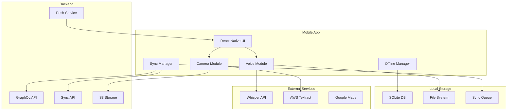
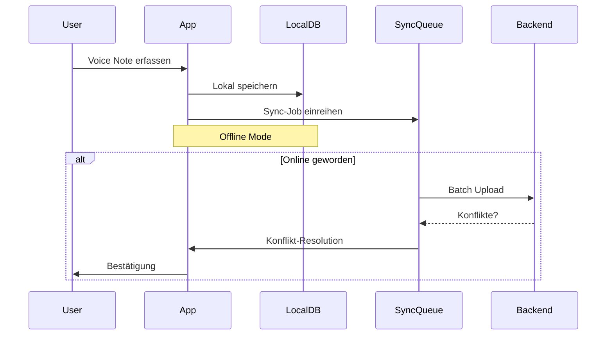

# FC-006: Technisches Konzept - Mobile Companion App (Speak & Snap)

**Feature Code:** FC-006  
**Datum:** 2025-07-20  
**Status:** ✅ Tech Concept Complete  
**Autor:** Claude  
**Reviewer:** Jörg  
**Geschätzte Dauer:** 15-20 Tage  
**Claude Tech:** [FC-006_CLAUDE_TECH.md](/docs/features/PLANNED/09_mobile_app/FC-006_CLAUDE_TECH.md)

## Navigation
- **Zurück:** [FC-005 Xentral Integration](/docs/features/PLANNED/08_xentral_integration/FC-005_TECH_CONCEPT.md)
- **Weiter:** [FC-007 Chef-Dashboard](/docs/features/PLANNED/10_chef_dashboard/FC-007_TECH_CONCEPT.md)
- **Übersicht:** [Master Plan V5](/docs/CRM_COMPLETE_MASTER_PLAN_V5.md)

## 📋 Inhaltsverzeichnis

1. [Zusammenfassung](#zusammenfassung)
2. [Ziel und Geschäftswert](#ziel-und-geschäftswert)
3. [Technische Architektur](#technische-architektur)
4. [Mobile App Implementierung](#mobile-app-implementierung)
5. [Backend API Erweiterungen](#backend-api-erweiterungen)
6. [Implementierungsstrategie](#implementierungsstrategie)
7. [Entscheidungs-Log](#entscheidungs-log)
8. [Risiken und Mitigationen](#risiken-und-mitigationen)
9. [Zeitschätzung](#zeitschätzung)

## Zusammenfassung

FC-006 implementiert eine mobile Companion App mit Fokus auf Spracheingabe und Foto-Erfassung für den Außendienst. Die App nutzt OpenAI Whisper für Speech-to-Text, intelligente Entity-Extraktion für strukturierte Datenerfassung und funktioniert vollständig offline mit automatischer Synchronisation. Kern-Features: "Speak & Snap" - vom gesprochenen Kundenfeedback zur strukturierten Opportunity in unter 3 Sekunden.

## Ziel und Geschäftswert

### Geschäftsziele
- **Zeitersparnis**: 15+ Minuten pro Verkäufer pro Tag durch Voice-Input
- **Datenqualität**: 100% Erfassung von Kundengesprächen vor Ort
- **Adoption**: >80% tägliche Nutzung im Außendienst
- **Offline-First**: Volle Funktionalität ohne Internetverbindung

### Technische Ziele
- **Performance**: <3s von Sprache zu strukturierten Daten
- **Accuracy**: 95%+ Entity-Erkennung (Kunde, Menge, Datum)
- **Offline**: 30%+ aller Aktionen offline durchgeführt
- **Sync**: <5s für Konfliktauflösung bei Synchronisation

## Technische Architektur

### System-Übersicht



### Offline-First Architecture



## Mobile App Implementierung

### 1. App Structure (React Native)

```typescript
// App.tsx - Root Component mit Offline Provider
import { OfflineProvider } from './providers/OfflineProvider';
import { SyncProvider } from './providers/SyncProvider';
import { AuthProvider } from './providers/AuthProvider';

export const App: React.FC = () => {
  return (
    <OfflineProvider>
      <SyncProvider>
        <AuthProvider>
          <NavigationContainer>
            <RootNavigator />
          </NavigationContainer>
        </AuthProvider>
      </SyncProvider>
    </OfflineProvider>
  );
};

// navigation/RootNavigator.tsx
const RootStack = createNativeStackNavigator();

export const RootNavigator: React.FC = () => {
  const { isAuthenticated } = useAuth();
  
  return (
    <RootStack.Navigator>
      {!isAuthenticated ? (
        <RootStack.Screen name="Auth" component={AuthNavigator} />
      ) : (
        <>
          <RootStack.Screen 
            name="Main" 
            component={MainTabNavigator}
            options={{ headerShown: false }}
          />
          <RootStack.Screen 
            name="VoiceCapture" 
            component={VoiceCaptureScreen}
            options={{ presentation: 'modal' }}
          />
          <RootStack.Screen 
            name="PhotoCapture" 
            component={PhotoCaptureScreen}
            options={{ presentation: 'modal' }}
          />
        </>
      )}
    </RootStack.Navigator>
  );
};
```

### 2. Voice Processing Module

```typescript
// modules/voice/VoiceProcessor.ts
import Voice from '@react-native-voice/voice';
import { WhisperAPI } from './api/WhisperAPI';
import { EntityExtractor } from './EntityExtractor';
import { OfflineQueue } from '../offline/OfflineQueue';

export class VoiceProcessor {
  private whisperAPI: WhisperAPI;
  private entityExtractor: EntityExtractor;
  private offlineQueue: OfflineQueue;
  
  constructor() {
    this.whisperAPI = new WhisperAPI();
    this.entityExtractor = new EntityExtractor();
    this.offlineQueue = OfflineQueue.getInstance();
  }
  
  async processVoiceNote(audioPath: string): Promise<ProcessedVoiceNote> {
    try {
      // 1. Check if online for Whisper API
      if (await this.isOnline()) {
        const transcript = await this.whisperAPI.transcribe(audioPath);
        const entities = await this.entityExtractor.extract(transcript);
        
        return {
          id: generateUUID(),
          audioPath,
          transcript,
          entities,
          processedAt: new Date(),
          syncStatus: 'pending'
        };
      } else {
        // Queue for later processing
        await this.offlineQueue.enqueue({
          type: 'voice_processing',
          data: { audioPath },
          priority: 'high'
        });
        
        return {
          id: generateUUID(),
          audioPath,
          transcript: null,
          entities: null,
          processedAt: null,
          syncStatus: 'queued'
        };
      }
    } catch (error) {
      console.error('Voice processing failed:', error);
      throw new VoiceProcessingError(error.message);
    }
  }
  
  async startRecording(): Promise<void> {
    try {
      await Voice.start('de-DE');
    } catch (error) {
      throw new RecordingError('Failed to start recording');
    }
  }
  
  async stopRecording(): Promise<string> {
    try {
      await Voice.stop();
      // Audio is saved to temporary file
      return this.getLastRecordingPath();
    } catch (error) {
      throw new RecordingError('Failed to stop recording');
    }
  }
}

// modules/voice/EntityExtractor.ts
export class EntityExtractor {
  async extract(transcript: string): Promise<ExtractedEntities> {
    // Local NLP for basic extraction
    const localEntities = this.extractLocal(transcript);
    
    // If online, enhance with AI
    if (await this.isOnline()) {
      return this.enhanceWithAI(transcript, localEntities);
    }
    
    return localEntities;
  }
  
  private extractLocal(transcript: string): ExtractedEntities {
    return {
      customers: this.findCustomerMentions(transcript),
      quantities: this.extractQuantities(transcript),
      dates: this.extractDates(transcript),
      products: this.findProductMentions(transcript),
      actions: this.extractActionItems(transcript),
      sentiment: this.analyzeSentiment(transcript)
    };
  }
  
  private findCustomerMentions(text: string): CustomerMention[] {
    // Match against cached customer database
    const customers = [];
    const cachedCustomers = CustomerCache.getAll();
    
    for (const customer of cachedCustomers) {
      const regex = new RegExp(`\\b${customer.name}\\b`, 'gi');
      if (regex.test(text)) {
        customers.push({
          customerId: customer.id,
          customerName: customer.name,
          confidence: 0.9
        });
      }
    }
    
    return customers;
  }
  
  private extractQuantities(text: string): QuantityMention[] {
    const quantities = [];
    const regex = /(\d+\.?\d*)\s*(stück|kg|liter|paletten?|kisten?)/gi;
    
    let match;
    while ((match = regex.exec(text)) !== null) {
      quantities.push({
        value: parseFloat(match[1]),
        unit: match[2].toLowerCase(),
        context: text.substring(match.index - 20, match.index + 30)
      });
    }
    
    return quantities;
  }
  
  private extractDates(text: string): DateMention[] {
    const dates = [];
    const patterns = [
      /\b(morgen|übermorgen|nächste woche|nächsten monat)\b/gi,
      /\b(\d{1,2})\.\s*(januar|februar|märz|april|mai|juni|juli|august|september|oktober|november|dezember)\b/gi,
      /\b(montag|dienstag|mittwoch|donnerstag|freitag|samstag|sonntag)\b/gi
    ];
    
    for (const pattern of patterns) {
      let match;
      while ((match = pattern.exec(text)) !== null) {
        dates.push({
          text: match[0],
          parsed: this.parseRelativeDate(match[0]),
          context: text.substring(match.index - 20, match.index + 30)
        });
      }
    }
    
    return dates;
  }
}
```

### 3. Offline Sync Manager

```typescript
// modules/offline/SyncManager.ts
import NetInfo from '@react-native-community/netinfo';
import { DatabaseManager } from './DatabaseManager';
import { ConflictResolver } from './ConflictResolver';

export class SyncManager {
  private db: DatabaseManager;
  private conflictResolver: ConflictResolver;
  private syncInProgress = false;
  private syncQueue: SyncQueue;
  
  constructor() {
    this.db = DatabaseManager.getInstance();
    this.conflictResolver = new ConflictResolver();
    this.syncQueue = new SyncQueue();
    
    // Listen for connectivity changes
    NetInfo.addEventListener(this.handleConnectivityChange);
  }
  
  private handleConnectivityChange = async (state: NetInfoState) => {
    if (state.isConnected && !this.syncInProgress) {
      await this.performSync();
    }
  };
  
  async performSync(): Promise<SyncResult> {
    if (this.syncInProgress) {
      return { status: 'already_running' };
    }
    
    this.syncInProgress = true;
    const result: SyncResult = {
      status: 'success',
      uploaded: 0,
      downloaded: 0,
      conflicts: 0,
      errors: []
    };
    
    try {
      // 1. Upload pending changes
      const pendingChanges = await this.db.getPendingChanges();
      for (const batch of this.batchChanges(pendingChanges, 50)) {
        const uploadResult = await this.uploadBatch(batch);
        result.uploaded += uploadResult.success.length;
        
        // Handle conflicts
        if (uploadResult.conflicts.length > 0) {
          const resolved = await this.resolveConflicts(uploadResult.conflicts);
          result.conflicts += resolved.length;
        }
      }
      
      // 2. Download latest data
      const lastSync = await this.db.getLastSyncTime();
      const updates = await this.downloadUpdates(lastSync);
      
      await this.applyUpdates(updates);
      result.downloaded = updates.length;
      
      // 3. Update sync timestamp
      await this.db.updateLastSyncTime();
      
      // 4. Process queued voice notes if any
      await this.processQueuedVoiceNotes();
      
    } catch (error) {
      result.status = 'error';
      result.errors.push(error.message);
    } finally {
      this.syncInProgress = false;
    }
    
    return result;
  }
  
  private async resolveConflicts(conflicts: Conflict[]): Promise<Resolution[]> {
    const resolutions = [];
    
    for (const conflict of conflicts) {
      const resolution = await this.conflictResolver.resolve(conflict);
      
      if (resolution.strategy === 'manual') {
        // Queue for user resolution
        await this.queueManualResolution(conflict);
      } else {
        // Apply automatic resolution
        await this.applyResolution(resolution);
        resolutions.push(resolution);
      }
    }
    
    return resolutions;
  }
  
  private batchChanges(changes: Change[], batchSize: number): Change[][] {
    const batches = [];
    for (let i = 0; i < changes.length; i += batchSize) {
      batches.push(changes.slice(i, i + batchSize));
    }
    return batches;
  }
}

// modules/offline/DatabaseManager.ts
import SQLite from 'react-native-sqlite-storage';

export class DatabaseManager {
  private static instance: DatabaseManager;
  private db: SQLite.SQLiteDatabase;
  
  static getInstance(): DatabaseManager {
    if (!DatabaseManager.instance) {
      DatabaseManager.instance = new DatabaseManager();
    }
    return DatabaseManager.instance;
  }
  
  async initialize(): Promise<void> {
    this.db = await SQLite.openDatabase({
      name: 'freshplan.db',
      location: 'default'
    });
    
    await this.createTables();
    await this.setupTriggers();
  }
  
  private async createTables(): Promise<void> {
    const tables = [
      `CREATE TABLE IF NOT EXISTS sync_queue (
        id TEXT PRIMARY KEY,
        entity_type TEXT NOT NULL,
        entity_id TEXT NOT NULL,
        operation TEXT NOT NULL,
        data TEXT NOT NULL,
        created_at INTEGER NOT NULL,
        sync_status TEXT DEFAULT 'pending',
        sync_attempts INTEGER DEFAULT 0,
        last_error TEXT
      )`,
      
      `CREATE TABLE IF NOT EXISTS customers (
        id TEXT PRIMARY KEY,
        name TEXT NOT NULL,
        company TEXT,
        email TEXT,
        phone TEXT,
        last_modified INTEGER NOT NULL,
        sync_version INTEGER DEFAULT 1,
        is_deleted INTEGER DEFAULT 0
      )`,
      
      `CREATE TABLE IF NOT EXISTS voice_notes (
        id TEXT PRIMARY KEY,
        audio_path TEXT NOT NULL,
        transcript TEXT,
        entities TEXT,
        customer_id TEXT,
        created_at INTEGER NOT NULL,
        processed_at INTEGER,
        sync_status TEXT DEFAULT 'pending'
      )`,
      
      `CREATE TABLE IF NOT EXISTS activities (
        id TEXT PRIMARY KEY,
        type TEXT NOT NULL,
        customer_id TEXT,
        description TEXT,
        created_at INTEGER NOT NULL,
        created_by TEXT NOT NULL,
        sync_status TEXT DEFAULT 'pending'
      )`
    ];
    
    for (const sql of tables) {
      await this.db.executeSql(sql);
    }
  }
  
  private async setupTriggers(): Promise<void> {
    // Trigger to track changes
    const trigger = `
      CREATE TRIGGER IF NOT EXISTS track_customer_changes
      AFTER UPDATE ON customers
      BEGIN
        INSERT INTO sync_queue (
          id, entity_type, entity_id, operation, data, created_at
        ) VALUES (
          lower(hex(randomblob(16))),
          'customer',
          NEW.id,
          'update',
          json_object(
            'id', NEW.id,
            'name', NEW.name,
            'company', NEW.company,
            'email', NEW.email,
            'phone', NEW.phone
          ),
          strftime('%s', 'now')
        );
      END;
    `;
    
    await this.db.executeSql(trigger);
  }
}
```

### 4. UI Components

```typescript
// screens/VoiceCaptureScreen.tsx
export const VoiceCaptureScreen: React.FC = () => {
  const [isRecording, setIsRecording] = useState(false);
  const [transcript, setTranscript] = useState<string>('');
  const [entities, setEntities] = useState<ExtractedEntities | null>(null);
  const voiceProcessor = useVoiceProcessor();
  const navigation = useNavigation();
  
  const startRecording = async () => {
    try {
      await voiceProcessor.startRecording();
      setIsRecording(true);
    } catch (error) {
      showError('Aufnahme konnte nicht gestartet werden');
    }
  };
  
  const stopRecording = async () => {
    try {
      setIsRecording(false);
      const audioPath = await voiceProcessor.stopRecording();
      
      // Process in background
      const result = await voiceProcessor.processVoiceNote(audioPath);
      
      if (result.transcript) {
        setTranscript(result.transcript);
        setEntities(result.entities);
      } else {
        showInfo('Wird verarbeitet sobald online');
      }
    } catch (error) {
      showError('Fehler bei der Verarbeitung');
    }
  };
  
  const saveNote = async () => {
    if (!transcript && !entities) {
      showError('Nichts zum Speichern');
      return;
    }
    
    await saveVoiceNote({
      transcript,
      entities,
      context: await getCurrentContext()
    });
    
    navigation.goBack();
    showSuccess('Notiz gespeichert');
  };
  
  return (
    <SafeAreaView style={styles.container}>
      <Header title="Sprachnotiz" onClose={() => navigation.goBack()} />
      
      <View style={styles.content}>
        {!transcript ? (
          <View style={styles.recordingContainer}>
            <TouchableOpacity
              style={[
                styles.recordButton,
                isRecording && styles.recordButtonActive
              ]}
              onPress={isRecording ? stopRecording : startRecording}
            >
              <Icon
                name={isRecording ? 'stop' : 'mic'}
                size={48}
                color="white"
              />
            </TouchableOpacity>
            
            {isRecording && (
              <Animated.View style={styles.pulseAnimation}>
                <Text style={styles.recordingText}>Aufnahme läuft...</Text>
              </Animated.View>
            )}
          </View>
        ) : (
          <ScrollView style={styles.resultContainer}>
            <Card style={styles.transcriptCard}>
              <Text style={styles.label}>Transkript:</Text>
              <TextInput
                style={styles.transcriptInput}
                multiline
                value={transcript}
                onChangeText={setTranscript}
              />
            </Card>
            
            {entities && (
              <Card style={styles.entitiesCard}>
                <Text style={styles.label}>Erkannte Informationen:</Text>
                
                {entities.customers.length > 0 && (
                  <View style={styles.entityGroup}>
                    <Icon name="person" size={20} />
                    <Text style={styles.entityLabel}>Kunden:</Text>
                    {entities.customers.map(c => (
                      <Chip key={c.customerId} label={c.customerName} />
                    ))}
                  </View>
                )}
                
                {entities.quantities.length > 0 && (
                  <View style={styles.entityGroup}>
                    <Icon name="inventory" size={20} />
                    <Text style={styles.entityLabel}>Mengen:</Text>
                    {entities.quantities.map((q, i) => (
                      <Chip key={i} label={`${q.value} ${q.unit}`} />
                    ))}
                  </View>
                )}
                
                {entities.dates.length > 0 && (
                  <View style={styles.entityGroup}>
                    <Icon name="event" size={20} />
                    <Text style={styles.entityLabel}>Termine:</Text>
                    {entities.dates.map((d, i) => (
                      <Chip key={i} label={d.text} />
                    ))}
                  </View>
                )}
              </Card>
            )}
          </ScrollView>
        )}
      </View>
      
      <View style={styles.actions}>
        <Button
          variant="outlined"
          onPress={() => navigation.goBack()}
        >
          Abbrechen
        </Button>
        <Button
          variant="contained"
          onPress={saveNote}
          disabled={!transcript}
        >
          Speichern
        </Button>
      </View>
    </SafeAreaView>
  );
};

// components/QuickActionFAB.tsx
export const QuickActionFAB: React.FC = () => {
  const [open, setOpen] = useState(false);
  const navigation = useNavigation();
  const context = useCurrentContext();
  
  const actions = [
    {
      icon: 'mic',
      label: 'Sprachnotiz',
      onPress: () => navigation.navigate('VoiceCapture')
    },
    {
      icon: 'camera',
      label: 'Foto',
      onPress: () => navigation.navigate('PhotoCapture')
    },
    {
      icon: 'add',
      label: 'Schnellerfassung',
      onPress: () => navigation.navigate('QuickCreate', { context })
    }
  ];
  
  return (
    <Portal>
      <FAB.Group
        open={open}
        icon={open ? 'close' : 'add'}
        actions={actions}
        onStateChange={({ open }) => setOpen(open)}
        fabStyle={styles.fab}
      />
    </Portal>
  );
};
```

### 5. Context Awareness

```typescript
// modules/context/ContextManager.ts
import Geolocation from '@react-native-community/geolocation';
import { CalendarModule } from '../calendar/CalendarModule';
import { CustomerCache } from '../cache/CustomerCache';

export class ContextManager {
  private static instance: ContextManager;
  
  static getInstance(): ContextManager {
    if (!ContextManager.instance) {
      ContextManager.instance = new ContextManager();
    }
    return ContextManager.instance;
  }
  
  async getCurrentContext(): Promise<AppContext> {
    const [location, calendar, recentActivity] = await Promise.all([
      this.getCurrentLocation(),
      this.getCurrentCalendarEvents(),
      this.getRecentActivity()
    ]);
    
    const nearbyCustomers = await this.findNearbyCustomers(location);
    const currentAppointment = this.getCurrentAppointment(calendar);
    const probableCustomer = this.determineProbableCustomer(
      nearbyCustomers,
      currentAppointment,
      recentActivity
    );
    
    return {
      location,
      nearbyCustomers,
      currentAppointment,
      probableCustomer,
      recentActivity,
      timestamp: new Date()
    };
  }
  
  private async getCurrentLocation(): Promise<Location> {
    return new Promise((resolve, reject) => {
      Geolocation.getCurrentPosition(
        position => {
          resolve({
            latitude: position.coords.latitude,
            longitude: position.coords.longitude,
            accuracy: position.coords.accuracy
          });
        },
        error => {
          console.warn('Location error:', error);
          resolve(null);
        },
        {
          enableHighAccuracy: true,
          timeout: 5000,
          maximumAge: 10000
        }
      );
    });
  }
  
  private async findNearbyCustomers(
    location: Location | null
  ): Promise<NearbyCustomer[]> {
    if (!location) return [];
    
    const customers = await CustomerCache.getAll();
    const nearbyCustomers = [];
    
    for (const customer of customers) {
      if (customer.latitude && customer.longitude) {
        const distance = this.calculateDistance(
          location,
          { latitude: customer.latitude, longitude: customer.longitude }
        );
        
        if (distance < 1000) { // Within 1km
          nearbyCustomers.push({
            customer,
            distance,
            lastVisit: await this.getLastVisit(customer.id)
          });
        }
      }
    }
    
    return nearbyCustomers.sort((a, b) => a.distance - b.distance);
  }
  
  private calculateDistance(loc1: Location, loc2: Location): number {
    const R = 6371e3; // Earth radius in meters
    const φ1 = (loc1.latitude * Math.PI) / 180;
    const φ2 = (loc2.latitude * Math.PI) / 180;
    const Δφ = ((loc2.latitude - loc1.latitude) * Math.PI) / 180;
    const Δλ = ((loc2.longitude - loc1.longitude) * Math.PI) / 180;
    
    const a = Math.sin(Δφ / 2) * Math.sin(Δφ / 2) +
              Math.cos(φ1) * Math.cos(φ2) *
              Math.sin(Δλ / 2) * Math.sin(Δλ / 2);
    const c = 2 * Math.atan2(Math.sqrt(a), Math.sqrt(1 - a));
    
    return R * c;
  }
}
```

## Backend API Erweiterungen

### 1. GraphQL Schema

```graphql
# schema.graphql
type Query {
  # Mobile-optimized queries
  mobileSync(lastSyncTime: DateTime!): MobileSyncData!
  nearbyCustomers(location: LocationInput!, radius: Float!): [Customer!]!
  voiceNoteStatus(id: ID!): VoiceNoteStatus!
}

type Mutation {
  # Voice note processing
  uploadVoiceNote(input: VoiceNoteInput!): VoiceNote!
  processVoiceNote(id: ID!): ProcessedVoiceNote!
  
  # Batch operations for offline sync
  batchCreateActivities(activities: [ActivityInput!]!): BatchResult!
  batchUpdateCustomers(customers: [CustomerUpdateInput!]!): BatchResult!
  
  # Conflict resolution
  resolveConflict(conflictId: ID!, resolution: ResolutionInput!): Boolean!
}

type Subscription {
  # Real-time sync updates
  syncUpdates(deviceId: ID!): SyncUpdate!
  voiceNoteProcessed(noteId: ID!): ProcessedVoiceNote!
}

# Mobile-specific types
type MobileSyncData {
  customers: [Customer!]!
  activities: [Activity!]!
  opportunities: [Opportunity!]!
  deletedIds: [DeletedEntity!]!
  serverTime: DateTime!
}

type VoiceNote {
  id: ID!
  audioUrl: String!
  duration: Int!
  transcript: String
  entities: ExtractedEntities
  status: ProcessingStatus!
  createdBy: User!
  createdAt: DateTime!
}

type ExtractedEntities {
  customers: [CustomerMention!]!
  quantities: [QuantityMention!]!
  dates: [DateMention!]!
  products: [ProductMention!]!
  actions: [ActionItem!]!
  sentiment: SentimentAnalysis!
}

enum ProcessingStatus {
  PENDING
  PROCESSING
  COMPLETED
  FAILED
}
```

### 2. Sync API Implementation

```java
// domain/mobile/service/MobileSyncService.java
@ApplicationScoped
@Transactional
public class MobileSyncService {
    
    @Inject
    CustomerRepository customerRepo;
    
    @Inject
    ActivityRepository activityRepo;
    
    @Inject
    ConflictResolutionService conflictService;
    
    @Inject
    Event<SyncEvent> syncEvents;
    
    public MobileSyncData getSyncData(LocalDateTime lastSyncTime, UUID deviceId) {
        // Get all changes since last sync
        var customers = customerRepo.findModifiedSince(lastSyncTime);
        var activities = activityRepo.findModifiedSince(lastSyncTime);
        var opportunities = opportunityRepo.findModifiedSince(lastSyncTime);
        var deletions = deletionLogRepo.findSince(lastSyncTime);
        
        // Track sync for this device
        trackDeviceSync(deviceId, LocalDateTime.now());
        
        return MobileSyncData.builder()
            .customers(customers)
            .activities(activities)
            .opportunities(opportunities)
            .deletedIds(deletions)
            .serverTime(LocalDateTime.now())
            .build();
    }
    
    public BatchResult batchCreateActivities(
        List<ActivityInput> activities,
        UUID deviceId
    ) {
        var results = new BatchResult();
        
        for (var input : activities) {
            try {
                // Check for duplicates (idempotency)
                var existing = activityRepo.findByClientId(input.getClientId());
                if (existing.isPresent()) {
                    results.addSkipped(input.getClientId(), "Already exists");
                    continue;
                }
                
                var activity = createActivity(input);
                results.addSuccess(activity.getId(), input.getClientId());
                
            } catch (Exception e) {
                results.addError(input.getClientId(), e.getMessage());
            }
        }
        
        // Fire sync event
        syncEvents.fire(new SyncEvent(
            deviceId,
            SyncType.BATCH_CREATE,
            results
        ));
        
        return results;
    }
    
    public ConflictResolution resolveConflict(
        UUID entityId,
        String entityType,
        JsonNode clientData,
        JsonNode serverData
    ) {
        return conflictService.resolve(
            entityId,
            entityType,
            clientData,
            serverData
        );
    }
}

// domain/mobile/service/VoiceProcessingService.java
@ApplicationScoped
public class VoiceProcessingService {
    
    @Inject
    WhisperClient whisperClient;
    
    @Inject
    EntityExtractionService entityService;
    
    @Inject
    S3Service s3Service;
    
    @Inject
    Event<VoiceNoteProcessedEvent> voiceEvents;
    
    @Async
    public CompletionStage<ProcessedVoiceNote> processVoiceNote(
        UUID voiceNoteId
    ) {
        return CompletableFuture.supplyAsync(() -> {
            var voiceNote = voiceNoteRepo.findById(voiceNoteId)
                .orElseThrow(() -> new EntityNotFoundException("Voice note not found"));
            
            try {
                // Update status
                voiceNote.setStatus(ProcessingStatus.PROCESSING);
                
                // Download audio from S3
                var audioData = s3Service.download(voiceNote.getAudioPath());
                
                // Transcribe with Whisper
                var transcript = whisperClient.transcribe(
                    audioData,
                    Language.GERMAN
                );
                
                // Extract entities
                var entities = entityService.extractFromTranscript(
                    transcript,
                    voiceNote.getContext()
                );
                
                // Update voice note
                voiceNote.setTranscript(transcript);
                voiceNote.setEntities(entities);
                voiceNote.setStatus(ProcessingStatus.COMPLETED);
                voiceNote.setProcessedAt(LocalDateTime.now());
                
                // Create activities from entities
                createActivitiesFromEntities(voiceNote, entities);
                
                // Fire event
                voiceEvents.fire(new VoiceNoteProcessedEvent(voiceNote));
                
                return mapToProcessedVoiceNote(voiceNote);
                
            } catch (Exception e) {
                voiceNote.setStatus(ProcessingStatus.FAILED);
                voiceNote.setErrorMessage(e.getMessage());
                throw new ProcessingException("Voice processing failed", e);
            }
        });
    }
    
    private void createActivitiesFromEntities(
        VoiceNote voiceNote,
        ExtractedEntities entities
    ) {
        // Create follow-up tasks
        for (var action : entities.getActions()) {
            var activity = Activity.builder()
                .type(ActivityType.TASK)
                .title(action.getDescription())
                .dueDate(action.getDueDate())
                .customerId(determineCustomer(entities))
                .createdBy(voiceNote.getCreatedBy())
                .source("voice_note")
                .sourceId(voiceNote.getId())
                .build();
            
            activityRepo.persist(activity);
        }
        
        // Create notes for important mentions
        if (!entities.getQuantities().isEmpty() || !entities.getDates().isEmpty()) {
            var noteContent = buildNoteContent(entities);
            var note = Activity.builder()
                .type(ActivityType.NOTE)
                .description(noteContent)
                .customerId(determineCustomer(entities))
                .createdBy(voiceNote.getCreatedBy())
                .build();
            
            activityRepo.persist(note);
        }
    }
}
```

### 3. Conflict Resolution

```java
// domain/mobile/service/ConflictResolutionService.java
@ApplicationScoped
public class ConflictResolutionService {
    
    @Inject
    AuditService auditService;
    
    public ConflictResolution resolve(
        UUID entityId,
        String entityType,
        JsonNode clientData,
        JsonNode serverData
    ) {
        var strategy = determineStrategy(entityType, clientData, serverData);
        
        switch (strategy) {
            case CLIENT_WINS:
                return applyClientWins(entityId, clientData);
                
            case SERVER_WINS:
                return applyServerWins(entityId, serverData);
                
            case MERGE:
                return applyMerge(entityId, clientData, serverData);
                
            case MANUAL:
                return queueForManualResolution(entityId, clientData, serverData);
                
            default:
                throw new IllegalStateException("Unknown strategy: " + strategy);
        }
    }
    
    private ConflictStrategy determineStrategy(
        String entityType,
        JsonNode clientData,
        JsonNode serverData
    ) {
        // Simple rules - can be made more sophisticated
        var clientTime = clientData.get("lastModified").asLong();
        var serverTime = serverData.get("lastModified").asLong();
        
        // If times are very close, likely a race condition
        if (Math.abs(clientTime - serverTime) < 5000) { // 5 seconds
            return ConflictStrategy.MERGE;
        }
        
        // For certain fields, always prefer latest
        if (entityType.equals("customer")) {
            // Contact info should be latest
            return clientTime > serverTime 
                ? ConflictStrategy.CLIENT_WINS 
                : ConflictStrategy.SERVER_WINS;
        }
        
        // For activities, merge might be better
        if (entityType.equals("activity")) {
            return ConflictStrategy.MERGE;
        }
        
        // Default to manual for complex cases
        return ConflictStrategy.MANUAL;
    }
    
    private ConflictResolution applyMerge(
        UUID entityId,
        JsonNode clientData,
        JsonNode serverData
    ) {
        var merged = serverData.deepCopy();
        
        // Merge non-conflicting fields
        var clientFields = clientData.fieldNames();
        while (clientFields.hasNext()) {
            var field = clientFields.next();
            var clientValue = clientData.get(field);
            var serverValue = serverData.get(field);
            
            // If server doesn't have this field, take client
            if (serverValue == null || serverValue.isNull()) {
                ((ObjectNode) merged).set(field, clientValue);
            }
            // If values differ, apply merge strategy
            else if (!clientValue.equals(serverValue)) {
                var mergedValue = mergeField(field, clientValue, serverValue);
                ((ObjectNode) merged).set(field, mergedValue);
            }
        }
        
        // Audit the merge
        auditService.logConflictResolution(
            entityId,
            "MERGE",
            clientData,
            serverData,
            merged
        );
        
        return new ConflictResolution(
            ConflictStrategy.MERGE,
            merged,
            "Automatically merged non-conflicting changes"
        );
    }
}
```

## Implementierungsstrategie

### Phase 1: Foundation & Auth (3-4 Tage)

#### Sprint 1.1: React Native Setup (1 Tag)
1. **Vormittag**:
   - React Native Projekt initialisieren
   - Navigation Setup (React Navigation)
   - Basic Folder Structure
   - TypeScript Configuration

2. **Nachmittag**:
   - Keycloak Integration für Mobile
   - Secure Token Storage
   - Auto-Refresh Logic
   - Auth Flow Implementation

#### Sprint 1.2: Offline Infrastructure (1-2 Tage)
1. **Tag 2 Vormittag**:
   - SQLite Setup & Migrations
   - Database Manager Implementation
   - Sync Queue Structure

2. **Tag 2 Nachmittag**:
   - Offline Detection Logic
   - Basic Sync Manager
   - Conflict Detection Framework

3. **Tag 3 Vormittag**:
   - Change Tracking Triggers
   - Queue Management
   - Error Handling

#### Sprint 1.3: Core UI Components (1 Tag)
1. **Tag 3/4 Vormittag**:
   - Main Navigation Structure
   - Quick Action FAB
   - Basic Screens Layout

2. **Tag 3/4 Nachmittag**:
   - Customer List with Offline Support
   - Activity Feed Component
   - Sync Status Indicator

### Phase 2: Voice & Photo Features (4-5 Tage)

#### Sprint 2.1: Voice Recording (2 Tage)
1. **Tag 5**:
   - Voice Recording UI
   - Audio File Management
   - Basic Playback Features
   - Permission Handling

2. **Tag 6**:
   - Whisper API Integration
   - Offline Queue for Processing
   - Transcript Display UI

#### Sprint 2.2: Entity Extraction (1-2 Tage)
1. **Tag 7**:
   - Local Entity Extraction
   - Customer Matching Logic
   - Date/Quantity Parsing

2. **Tag 8 Vormittag**:
   - AI-Enhanced Extraction
   - Context Integration
   - Action Item Detection

#### Sprint 2.3: Photo Capture (1 Tag)
1. **Tag 8/9**:
   - Camera Integration
   - Business Card OCR
   - Photo Annotation
   - S3 Upload with Retry

### Phase 3: Sync & Context (3-4 Tage)

#### Sprint 3.1: Sync Implementation (2 Tage)
1. **Tag 10**:
   - Batch Upload Logic
   - Conflict Detection
   - Auto-Resolution Rules

2. **Tag 11**:
   - Manual Conflict UI
   - Sync Progress Tracking
   - Error Recovery

#### Sprint 3.2: Context Awareness (1 Tag)
1. **Tag 12**:
   - Location Services
   - Calendar Integration
   - Smart Suggestions
   - Nearby Customer Detection

#### Sprint 3.3: Push Notifications (1 Tag)
1. **Tag 13**:
   - Firebase Setup
   - Notification Handlers
   - Deep Linking
   - Background Updates

### Phase 4: Backend & Integration (3-4 Tage)

#### Sprint 4.1: GraphQL API (1-2 Tage)
1. **Tag 14**:
   - Mobile-Optimized Queries
   - Batch Mutations
   - Subscription Setup

2. **Tag 15 Vormittag**:
   - Sync Endpoints
   - Conflict Resolution API
   - Performance Optimization

#### Sprint 4.2: Voice Processing Backend (1 Tag)
1. **Tag 15/16**:
   - Whisper Integration
   - Entity Service
   - Async Processing
   - Event Notifications

#### Sprint 4.3: Performance & Security (1 Tag)
1. **Tag 17**:
   - Query Optimization
   - Caching Strategy
   - Security Hardening
   - Rate Limiting

### Phase 5: Testing & Polish (2-3 Tage)

1. **Tag 18-19**:
   - End-to-End Testing
   - Offline Scenarios
   - Sync Edge Cases
   - Performance Testing

2. **Tag 20**:
   - UI Polish
   - Error Messages
   - Loading States
   - App Store Preparation

## Entscheidungs-Log

### 2025-07-20 - Framework: React Native
**Entscheidung**: React Native über Flutter oder Native  
**Begründung**: Team kennt React, Code-Sharing mit Web möglich, große Community  
**Impact**: Schnellere Entwicklung, eine Codebase für iOS/Android  
**Alternativen**: Flutter (Dart lernen), Native (2x Aufwand)  
**Entscheider**: Tech Lead  

### 2025-07-20 - Offline Storage: SQLite
**Entscheidung**: SQLite mit custom sync layer  
**Begründung**: Bewährt, SQL-Kenntnisse vorhanden, flexible Queries  
**Impact**: Eigene Sync-Logic nötig, volle Kontrolle  
**Alternativen**: Realm (automatischer Sync), WatermelonDB  
**Entscheider**: Tech Lead  

### 2025-07-20 - Speech API: OpenAI Whisper
**Entscheidung**: Whisper API für Transcription  
**Begründung**: Beste Accuracy für Deutsch, faire Preise  
**Impact**: Online-Abhängigkeit für Transcription  
**Alternativen**: Google Speech-to-Text, On-Device (schlechtere Qualität)  
**Entscheider**: Product Owner  

### 2025-07-20 - Sync Strategy: Event-Based
**Entscheidung**: Event-basierte Sync mit Conflict Resolution  
**Begründung**: Granulare Kontrolle, nachvollziehbar  
**Impact**: Komplexere Implementation, bessere Debugging  
**Alternativen**: Last-Write-Wins, Operational Transform  
**Entscheider**: Tech Lead  

## Risiken und Mitigationen

### Risiko 1: Schlechte Offline-Datenqualität
**Wahrscheinlichkeit**: Mittel  
**Impact**: Hoch  
**Beispiel**: Transcription ohne Internet = keine strukturierten Daten  
**Mitigation**:
- Robuste lokale Entity-Extraction
- Manuelle Eingabemöglichkeit
- Priorisierte Sync-Queue
- Offline-Feedback für User

### Risiko 2: Sync-Konflikte
**Wahrscheinlichkeit**: Hoch  
**Impact**: Mittel  
**Beispiel**: Zwei Verkäufer bearbeiten gleichen Kunden offline  
**Mitigation**:
- Intelligente Merge-Strategien
- Audit Trail aller Änderungen
- Manuelle Konfliktlösung UI
- Präventive Locks wo möglich

### Risiko 3: Battery Drain
**Wahrscheinlichkeit**: Mittel  
**Impact**: Hoch  
**Beispiel**: GPS + Sync + Audio = leerer Akku  
**Mitigation**:
- Intelligentes Polling
- Batch-Sync statt Realtime
- Power-Save Mode
- Background Limits beachten

### Risiko 4: App Store Ablehnung
**Wahrscheinlichkeit**: Niedrig  
**Impact**: Hoch  
**Beispiel**: Permissions, Privacy Policy  
**Mitigation**:
- Klare Permission Requests
- Ausführliche Privacy Policy
- Keine versteckten Features
- TestFlight Beta vorher

## Zeitschätzung

**Gesamt-Aufwand**: 15-20 Tage

- **Foundation & Auth**: 3-4 Tage
- **Voice & Photo Features**: 4-5 Tage
- **Sync & Context**: 3-4 Tage
- **Backend & Integration**: 3-4 Tage
- **Testing & Polish**: 2-3 Tage

**Puffer**: +3-5 Tage für App Store Submission und unerwartete Platform-Probleme

---

## 🧭 NAVIGATION & VERWEISE

### 📋 Zurück zum Überblick:
- **[📊 Master Plan V5](/docs/CRM_COMPLETE_MASTER_PLAN_V5.md)** - Vollständige Feature-Roadmap
- **[🗺️ Feature Overview](/docs/features/MASTER/FEATURE_OVERVIEW.md)** - Alle 40 Features im Überblick
- **[📱 FC-006 KOMPAKT](/docs/features/PLANNED/09_mobile_app/FC-006_KOMPAKT.md)** - Übersicht dieses Features

### 🔗 Dependencies (Required):
- **[🔒 FC-008 Security Foundation](/docs/features/ACTIVE/11_security_foundation/FC-008_KOMPAKT.md)** - Keycloak Mobile Auth
- **[👥 FC-009 Permission System](/docs/features/ACTIVE/12_permission_system/FC-009_KOMPAKT.md)** - Role-based Access
- **[🧭 M1 Navigation](/docs/features/ACTIVE/05_ui_foundation/M1_NAVIGATION_KOMPAKT.md)** - Navigation Patterns
- **[📊 M3 Sales Cockpit](/docs/features/ACTIVE/05_ui_foundation/M3_SALES_COCKPIT_KOMPAKT.md)** - Desktop Integration
- **[👥 M5 Customer Management](/docs/features/ACTIVE/01_customer_management/M5_KOMPAKT.md)** - Customer Data Model

### ⚡ Mobile-spezifische Features:
- **[📱 FC-022 Mobile Light](/docs/features/PLANNED/22_mobile_light/FC-022_KOMPAKT.md)** - Vereinfachte Version
- **[🎙️ FC-029 Voice-First Interface](/docs/features/PLANNED/29_voice_first/FC-029_KOMPAKT.md)** - Voice UI Erweiterung
- **[📱 FC-018 Mobile PWA](/docs/features/PLANNED/19_mobile_pwa/FC-018_KOMPAKT.md)** - Alternative PWA Ansatz
- **[🗺️ FC-030 Außendienst-Optimierung](/docs/features/PLANNED/30_aussendienst_optimierung/FC-030_KOMPAKT.md)** - Field Service Features
- **[📍 FC-031 Route Planning](/docs/features/PLANNED/31_route_planning/FC-031_KOMPAKT.md)** - Navigation Integration

### 🚀 Ermöglicht folgende Features:
- **[🛡️ FC-004 Verkäuferschutz](/docs/features/PLANNED/07_verkaeuferschutz/FC-004_KOMPAKT.md)** - Mobile Protection Status
- **[📧 FC-003 E-Mail Integration](/docs/features/PLANNED/06_email_integration/FC-003_KOMPAKT.md)** - Email-to-Voice Notes
- **[📈 FC-014 Activity Timeline](/docs/features/PLANNED/16_activity_timeline/FC-014_KOMPAKT.md)** - Mobile Activity Feed
- **[🎯 FC-027 Magic Moments](/docs/features/PLANNED/27_magic_moments/FC-027_KOMPAKT.md)** - Context-aware Suggestions
- **[📊 FC-007 Chef-Dashboard](/docs/features/PLANNED/10_chef_dashboard/FC-007_KOMPAKT.md)** - Live Team Monitoring

### 🎨 UI/UX Integration:
- **[➕ M2 Quick Create](/docs/features/ACTIVE/05_ui_foundation/M2_QUICK_CREATE_KOMPAKT.md)** - Mobile Quick Actions
- **[⚙️ M7 Settings](/docs/features/ACTIVE/05_ui_foundation/M7_SETTINGS_KOMPAKT.md)** - Sync Settings
- **[🔐 M2 Authentication](/docs/features/ACTIVE/05_ui_foundation/M2_AUTHENTICATION_KOMPAKT.md)** - Mobile Auth Flow
- **[⚡ FC-020 Quick Wins](/docs/features/PLANNED/20_quick_wins/FC-020_KOMPAKT.md)** - Mobile Shortcuts

### 📚 Backend Integration:
- **[🔄 FC-005 Xentral Integration](/docs/features/PLANNED/08_xentral_integration/FC-005_KOMPAKT.md)** - Payment Notifications
- **[🏗️ FC-023 Event Sourcing](/docs/features/PLANNED/23_event_sourcing/FC-023_KOMPAKT.md)** - Sync Event History
- **[📎 FC-024 File Management](/docs/features/PLANNED/24_file_management/FC-024_KOMPAKT.md)** - Photo/Audio Storage
- **[🔌 FC-021 Integration Hub](/docs/features/PLANNED/21_integration_hub/FC-021_KOMPAKT.md)** - External Sync
- **[📊 FC-026 Analytics Platform](/docs/features/PLANNED/26_analytics_platform/FC-026_KOMPAKT.md)** - Mobile Usage Analytics

### 🔧 Technische Dokumentation:
- **[🔒 Security Foundation Tech](/docs/features/ACTIVE/11_security_foundation/FC-008_TECH_CONCEPT.md)** - Auth Implementation
- **[📊 Activity Timeline Tech](/docs/features/PLANNED/16_activity_timeline/FC-014_TECH_CONCEPT.md)** - Activity Integration
- **[🏗️ Event Sourcing Tech](/docs/features/PLANNED/23_event_sourcing/FC-023_TECH_CONCEPT.md)** - Sync Architecture
- **[📎 File Management Tech](/docs/features/PLANNED/24_file_management/FC-024_TECH_CONCEPT.md)** - S3 Integration

### 🌐 Verwandte Features:
- **[🔍 FC-013 Duplicate Detection](/docs/features/PLANNED/15_duplicate_detection/FC-013_KOMPAKT.md)** - Mobile Duplicate Check
- **[📊 FC-015 Deal Loss Analysis](/docs/features/PLANNED/17_deal_loss_analysis/FC-015_KOMPAKT.md)** - Mobile Loss Reasons
- **[🔄 FC-016 Opportunity Cloning](/docs/features/PLANNED/02_opportunity_pipeline/FC-016_KOMPAKT.md)** - Quick Opportunity Creation

---

## Verwandte Features

### Kern-Abhängigkeiten:
- [FC-008 Security Foundation](/docs/features/ACTIVE/01_security_foundation/FC-008_TECH_CONCEPT.md) - Mobile Auth & Biometrics
- [M4 Opportunity Pipeline](/docs/features/ACTIVE/02_opportunity_pipeline/M4_TECH_CONCEPT.md) - Opportunity Sync
- [FC-009 Permissions System](/docs/features/ACTIVE/04_permissions_system/FC-009_TECH_CONCEPT.md) - Mobile Permissions

### Mobile Features:
- [FC-018 Mobile PWA](/docs/features/PLANNED/09_mobile_app/FC-018_TECH_CONCEPT.md) - Alternative PWA Approach
- [FC-022 Mobile Light](/docs/features/PLANNED/22_mobile_light/FC-022_TECH_CONCEPT.md) - Lightweight Version
- [FC-029 Voice First](/docs/features/PLANNED/29_voice_first/FC-029_TECH_CONCEPT.md) - Voice Integration
- [FC-032 Offline First](/docs/features/PLANNED/32_offline_first/FC-032_TECH_CONCEPT.md) - Offline Capabilities

### Backend Integration:
- [FC-014 Activity Timeline](/docs/features/PLANNED/16_activity_timeline/FC-014_TECH_CONCEPT.md) - Activity Sync
- [FC-023 Event Sourcing](/docs/features/PLANNED/23_event_sourcing/FC-023_TECH_CONCEPT.md) - Sync Architecture
- [FC-024 File Management](/docs/features/PLANNED/24_file_management/FC-024_TECH_CONCEPT.md) - Photo/Audio Storage

---

**Status-Updates**:
- 2025-07-20 18:10: Tech Concept vollständig erstellt ✅
- Claude-optimierte Struktur mit 15-Min Chunks
- React Native mit Offline-First Architecture
- Speak & Snap: Voice + Photo = Structured Data
- Intelligente Sync mit Conflict Resolution
- Context-Awareness durch GPS + Calendar
- Verwandte Features mit korrekten Links aktualisiert ✅