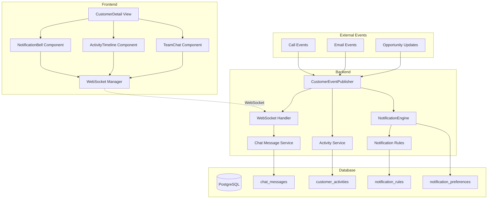

# FC-012: Technisches Konzept - Team Communication & Notifications

**Feature Code:** FC-012  
**Datum:** 2025-07-20  
**Status:** Draft  
**Autor:** Claude  
**Reviewer:** TBD  

## 📋 Inhaltsverzeichnis

1. [Zusammenfassung](#zusammenfassung)
2. [Ziel und Geschäftswert](#ziel-und-geschäftswert)
3. [Technische Architektur](#technische-architektur)
4. [Backend-Implementierung](#backend-implementierung)
5. [Frontend-Implementierung](#frontend-implementierung)
6. [Implementierungsstrategie](#implementierungsstrategie)
7. [Entscheidungs-Log](#entscheidungs-log)
8. [Risiken und Mitigationen](#risiken-und-mitigationen)
9. [Zeitschätzung](#zeitschätzung)

## Zusammenfassung

FC-012 implementiert ein kunden-zentriertes Team-Kommunikationssystem mit Real-time Chat, Aktivitäts-Stream und Smart Notifications. Das System eliminiert Info-Silos zwischen Verkäufern und sorgt für koordinierte Kundenbetreuung durch Event-driven Architecture und WebSocket-basierte Echtzeitübertragung.

## Ziel und Geschäftswert

### Geschäftsziele
- **Reaktionszeit reduzieren**: -50% durch Team-Awareness und koordinierte Kommunikation
- **Doppel-Kontakte eliminieren**: -80% weniger durch transparente Aktivitäten
- **Team-Effizienz steigern**: Bessere Zusammenarbeit durch kontextuelle Kommunikation
- **Customer Experience verbessern**: Koordinierte, professionelle Kundenbetreuung

### Technische Ziele
- **Real-time Performance**: <100ms Latenz für WebSocket-Nachrichten
- **Skalierbarkeit**: Event-driven Architecture für 100+ concurrent users
- **Verfügbarkeit**: Graceful degradation wenn WebSocket-Verbindung fehlschlägt
- **Integration**: Nahtlose Einbindung in alle bestehenden Module

## Technische Architektur

### System-Übersicht



### Komponenten-Interaktion

**Event Flow:**
1. **Event Source** (z.B. Opportunity Update) → CustomerEventPublisher
2. **Event Publisher** → Parallel zu NotificationEngine & Activity Service
3. **Notification Engine** → Prüft Rules → Sendet Notifications
4. **WebSocket Handler** → Broadcast an alle verbundenen Clients
5. **Frontend** → Update UI Components in Real-time

**Data Flow:**
- Chat Messages: Client → WebSocket → ChatMessageService → Database
- Activities: Event → ActivityService → Database → Timeline Component
- Notifications: Event → Rules Engine → NotificationService → Client

## Backend-Implementierung

### 1. API Endpoints

**WebSocket Endpoints:**
```java
@ServerEndpoint("/api/ws/customer/{customerId}")
public class CustomerWebSocketEndpoint {
    @OnOpen
    public void onOpen(Session session, @PathParam("customerId") UUID customerId);
    
    @OnMessage
    public void onMessage(String message, Session session);
    
    @OnClose
    public void onClose(Session session);
}
```

**REST Endpoints:**
```java
@Path("/api/customers/{customerId}/communication")
public class CustomerCommunicationResource {
    
    @GET @Path("/messages")
    public List<ChatMessageResponse> getMessages(@PathParam("customerId") UUID customerId);
    
    @POST @Path("/messages")
    public ChatMessageResponse sendMessage(SendMessageRequest request);
    
    @GET @Path("/activities")
    public List<ActivityResponse> getActivities(@PathParam("customerId") UUID customerId);
    
    @GET @Path("/notifications")
    public List<NotificationResponse> getNotifications();
}
```

### 2. Datenmodell

**Chat Messages:**
```java
@Entity
@Table(name = "chat_messages")
public class ChatMessage {
    @Id
    private UUID id;
    
    @Column(name = "customer_id", nullable = false)
    private UUID customerId;
    
    @Column(name = "user_id", nullable = false)
    private UUID userId;
    
    @Column(name = "message", nullable = false, length = 2000)
    private String message;
    
    @Column(name = "message_type")
    @Enumerated(EnumType.STRING)
    private MessageType type; // USER, SYSTEM, MENTION
    
    @Column(name = "mentioned_users")
    @Convert(converter = UUIDListConverter.class)
    private List<UUID> mentionedUsers;
    
    @CreationTimestamp
    private Instant createdAt;
    
    @Column(name = "edited_at")
    private Instant editedAt;
}
```

**Customer Activities:**
```java
@Entity
@Table(name = "customer_activities")
public class CustomerActivity {
    @Id
    private UUID id;
    
    @Column(name = "customer_id", nullable = false)
    private UUID customerId;
    
    @Column(name = "user_id", nullable = false)
    private UUID userId;
    
    @Column(name = "activity_type", nullable = false)
    @Enumerated(EnumType.STRING)
    private ActivityType type; // CALL, EMAIL, MEETING, NOTE, OPPORTUNITY
    
    @Column(name = "summary", nullable = false)
    private String summary;
    
    @Column(name = "details")
    @Type(type = "jsonb")
    private Map<String, Object> details;
    
    @CreationTimestamp
    private Instant timestamp;
    
    @Column(name = "is_important")
    private boolean important = false;
}
```

**Notification Rules:**
```java
@Entity
@Table(name = "notification_rules")
public class NotificationRule {
    @Id
    private UUID id;
    
    @Column(name = "rule_name", nullable = false)
    private String ruleName;
    
    @Column(name = "event_type", nullable = false)
    @Enumerated(EnumType.STRING)
    private ActivityType eventType;
    
    @Column(name = "conditions")
    @Type(type = "jsonb")
    private Map<String, Object> conditions;
    
    @Column(name = "target_roles")
    @Convert(converter = StringListConverter.class)
    private List<String> targetRoles;
    
    @Column(name = "notification_template")
    private String notificationTemplate;
    
    @Column(name = "is_active")
    private boolean active = true;
}
```

### 3. Business Logic

**Customer Event Publisher:**
```java
@ApplicationScoped
public class CustomerEventPublisher {
    
    @Inject
    Event<CustomerActivityEvent> activityEvents;
    
    @Inject
    Event<ChatMessageEvent> chatEvents;
    
    public void publishActivity(UUID customerId, UUID userId, 
                              ActivityType type, String summary, 
                              Map<String, Object> details) {
        var event = CustomerActivityEvent.builder()
            .customerId(customerId)
            .userId(userId)
            .type(type)
            .summary(summary)
            .details(details)
            .timestamp(Instant.now())
            .build();
        
        // Async für Performance
        activityEvents.fireAsync(event);
    }
    
    public void publishChatMessage(UUID customerId, UUID userId, 
                                 String message, List<UUID> mentions) {
        var event = ChatMessageEvent.builder()
            .customerId(customerId)
            .userId(userId)
            .message(message)
            .mentionedUsers(mentions)
            .timestamp(Instant.now())
            .build();
        
        chatEvents.fireAsync(event);
    }
}
```

**Notification Engine:**
```java
@ApplicationScoped
public class NotificationEngine {
    
    @Inject
    NotificationRuleRepository ruleRepository;
    
    @Inject
    NotificationService notificationService;
    
    @Inject
    UserService userService;
    
    public void onActivityEvent(@ObservesAsync CustomerActivityEvent event) {
        List<NotificationRule> rules = ruleRepository
            .findActiveRulesByEventType(event.getType());
        
        for (NotificationRule rule : rules) {
            if (evaluateRule(rule, event)) {
                List<User> targetUsers = determineTargetUsers(rule, event);
                sendNotifications(rule, event, targetUsers);
            }
        }
    }
    
    private boolean evaluateRule(NotificationRule rule, CustomerActivityEvent event) {
        Map<String, Object> conditions = rule.getConditions();
        
        // Beispiel-Regeln:
        // {"opportunity_value_min": 50000}
        // {"contact_frequency_threshold": 3}
        // {"inactive_days_threshold": 30}
        
        return RuleEvaluator.evaluate(conditions, event);
    }
    
    private void sendNotifications(NotificationRule rule, 
                                 CustomerActivityEvent event, 
                                 List<User> users) {
        String message = NotificationTemplateEngine
            .render(rule.getNotificationTemplate(), event);
        
        for (User user : users) {
            notificationService.sendNotification(
                user.getId(),
                message,
                NotificationChannel.IN_APP,
                event.getCustomerId()
            );
        }
    }
}
```

### 4. Datenbank-Änderungen

**Migration V1.0__create_communication_tables.sql:**
```sql
-- Chat Messages Table
CREATE TABLE chat_messages (
    id UUID PRIMARY KEY DEFAULT gen_random_uuid(),
    customer_id UUID NOT NULL REFERENCES customers(id),
    user_id UUID NOT NULL REFERENCES users(id),
    message TEXT NOT NULL CHECK (char_length(message) <= 2000),
    message_type VARCHAR(20) NOT NULL DEFAULT 'USER',
    mentioned_users JSONB,
    created_at TIMESTAMP WITH TIME ZONE DEFAULT NOW(),
    edited_at TIMESTAMP WITH TIME ZONE
);

-- Customer Activities Table
CREATE TABLE customer_activities (
    id UUID PRIMARY KEY DEFAULT gen_random_uuid(),
    customer_id UUID NOT NULL REFERENCES customers(id),
    user_id UUID NOT NULL REFERENCES users(id),
    activity_type VARCHAR(50) NOT NULL,
    summary TEXT NOT NULL,
    details JSONB,
    timestamp TIMESTAMP WITH TIME ZONE DEFAULT NOW(),
    is_important BOOLEAN DEFAULT FALSE
);

-- Notification Rules Table
CREATE TABLE notification_rules (
    id UUID PRIMARY KEY DEFAULT gen_random_uuid(),
    rule_name VARCHAR(255) NOT NULL,
    event_type VARCHAR(50) NOT NULL,
    conditions JSONB NOT NULL,
    target_roles TEXT[] NOT NULL,
    notification_template TEXT NOT NULL,
    is_active BOOLEAN DEFAULT TRUE,
    created_at TIMESTAMP WITH TIME ZONE DEFAULT NOW()
);

-- User Notification Preferences
CREATE TABLE notification_preferences (
    user_id UUID PRIMARY KEY REFERENCES users(id),
    mentions VARCHAR(20) DEFAULT 'instant',
    customer_updates VARCHAR(20) DEFAULT 'important',
    team_activity VARCHAR(20) DEFAULT 'summary',
    in_app_enabled BOOLEAN DEFAULT TRUE,
    email_enabled BOOLEAN DEFAULT TRUE,
    push_enabled BOOLEAN DEFAULT FALSE,
    updated_at TIMESTAMP WITH TIME ZONE DEFAULT NOW()
);

-- Indexes for Performance
CREATE INDEX idx_chat_messages_customer_created 
    ON chat_messages(customer_id, created_at DESC);

CREATE INDEX idx_customer_activities_customer_timestamp 
    ON customer_activities(customer_id, timestamp DESC);

CREATE INDEX idx_customer_activities_type_timestamp 
    ON customer_activities(activity_type, timestamp DESC);

CREATE INDEX idx_notification_rules_event_type_active 
    ON notification_rules(event_type, is_active) WHERE is_active = TRUE;
```

## Frontend-Implementierung

### 1. Komponenten-Struktur

**CustomerTeamChat Component:**
```typescript
interface CustomerTeamChatProps {
  customerId: string;
  className?: string;
}

export const CustomerTeamChat: React.FC<CustomerTeamChatProps> = ({
  customerId,
  className
}) => {
  const { messages, sendMessage, isLoading } = useChatMessages(customerId);
  const { users } = useTeamMembers();
  const [message, setMessage] = useState('');
  
  const handleSendMessage = async (text: string) => {
    const mentions = extractMentions(text);
    await sendMessage({ message: text, mentions });
    setMessage('');
  };
  
  return (
    <div className={cn('flex flex-col h-full', className)}>
      <ChatHeader customerId={customerId} />
      
      <ScrollArea className="flex-1 p-4">
        {messages.map(msg => (
          <ChatMessage 
            key={msg.id} 
            message={msg}
            currentUserId={currentUser.id}
          />
        ))}
      </ScrollArea>
      
      <div className="p-4 border-t">
        <MentionInput
          value={message}
          onChange={setMessage}
          onSubmit={handleSendMessage}
          suggestions={users}
          placeholder="Schreibe eine Nachricht... @kollege"
        />
      </div>
    </div>
  );
};
```

**ActivityTimeline Component:**
```typescript
interface ActivityTimelineProps {
  customerId: string;
  limit?: number;
  showFilters?: boolean;
}

export const ActivityTimeline: React.FC<ActivityTimelineProps> = ({
  customerId,
  limit = 20,
  showFilters = true
}) => {
  const { activities, isLoading, refetch } = useCustomerActivities(customerId);
  const [filter, setFilter] = useState<ActivityType[]>([]);
  
  const filteredActivities = useMemo(() => {
    if (filter.length === 0) return activities;
    return activities.filter(a => filter.includes(a.type));
  }, [activities, filter]);
  
  return (
    <div className="space-y-4">
      {showFilters && (
        <ActivityFilters 
          selected={filter}
          onChange={setFilter}
        />
      )}
      
      <div className="space-y-2">
        {filteredActivities.slice(0, limit).map(activity => (
          <TimelineItem 
            key={activity.id}
            activity={activity}
            onClick={() => handleActivityClick(activity)}
          />
        ))}
      </div>
      
      {activities.length > limit && (
        <Button variant="outline" onClick={() => /* Load more */}>
          Weitere Aktivitäten laden
        </Button>
      )}
    </div>
  );
};
```

### 2. State Management

**Real-time WebSocket Hook:**
```typescript
export const useCustomerRealtimeUpdates = (customerId: string) => {
  const [isConnected, setIsConnected] = useState(false);
  const wsRef = useRef<WebSocket | null>(null);
  
  const { addChatMessage, addActivity, showNotification } = useCustomerStore();
  
  useEffect(() => {
    if (!customerId) return;
    
    const ws = new WebSocket(`${WS_BASE_URL}/customer/${customerId}`);
    wsRef.current = ws;
    
    ws.onopen = () => {
      setIsConnected(true);
      console.log(`Connected to customer ${customerId} WebSocket`);
    };
    
    ws.onmessage = (event) => {
      const update = JSON.parse(event.data) as RealtimeUpdate;
      
      switch (update.type) {
        case 'chat_message':
          addChatMessage(update.payload as ChatMessage);
          if (update.payload.mentionedUsers?.includes(currentUser.id)) {
            showNotification({
              type: 'mention',
              message: `${update.payload.userName} hat dich erwähnt`,
              customerId
            });
          }
          break;
          
        case 'activity':
          addActivity(update.payload as CustomerActivity);
          break;
          
        case 'user_typing':
          setTypingUser(update.userId);
          setTimeout(() => setTypingUser(null), 3000);
          break;
          
        case 'notification':
          showNotification(update.payload as Notification);
          break;
      }
    };
    
    ws.onclose = () => {
      setIsConnected(false);
      console.log(`Disconnected from customer ${customerId} WebSocket`);
      
      // Reconnect after 3 seconds
      setTimeout(() => {
        if (wsRef.current?.readyState === WebSocket.CLOSED) {
          // Trigger reconnect
        }
      }, 3000);
    };
    
    return () => {
      ws.close();
    };
  }, [customerId]);
  
  const sendMessage = useCallback((message: string, mentions: string[] = []) => {
    if (wsRef.current?.readyState === WebSocket.OPEN) {
      wsRef.current.send(JSON.stringify({
        type: 'chat_message',
        payload: { message, mentions }
      }));
    }
  }, []);
  
  return { isConnected, sendMessage };
};
```

**Customer Store (Zustand):**
```typescript
interface CustomerState {
  chatMessages: Record<string, ChatMessage[]>;
  activities: Record<string, CustomerActivity[]>;
  notifications: Notification[];
  typingUsers: Record<string, string | null>;
  
  addChatMessage: (message: ChatMessage) => void;
  addActivity: (activity: CustomerActivity) => void;
  showNotification: (notification: Notification) => void;
  clearNotifications: () => void;
}

export const useCustomerStore = create<CustomerState>((set, get) => ({
  chatMessages: {},
  activities: {},
  notifications: [],
  typingUsers: {},
  
  addChatMessage: (message) => set((state) => ({
    chatMessages: {
      ...state.chatMessages,
      [message.customerId]: [
        ...(state.chatMessages[message.customerId] || []),
        message
      ].sort((a, b) => 
        new Date(a.createdAt).getTime() - new Date(b.createdAt).getTime()
      )
    }
  })),
  
  addActivity: (activity) => set((state) => ({
    activities: {
      ...state.activities,
      [activity.customerId]: [
        activity,
        ...(state.activities[activity.customerId] || [])
      ].sort((a, b) => 
        new Date(b.timestamp).getTime() - new Date(a.timestamp).getTime()
      )
    }
  })),
  
  showNotification: (notification) => set((state) => ({
    notifications: [notification, ...state.notifications.slice(0, 9)]
  })),
  
  clearNotifications: () => set({ notifications: [] })
}));
```

### 3. UI/UX Design

**Mention Input Component:**
```typescript
interface MentionInputProps {
  value: string;
  onChange: (value: string) => void;
  onSubmit: (value: string) => void;
  suggestions: User[];
  placeholder?: string;
}

export const MentionInput: React.FC<MentionInputProps> = ({
  value,
  onChange,
  onSubmit,
  suggestions,
  placeholder
}) => {
  const [showSuggestions, setShowSuggestions] = useState(false);
  const [mentionPosition, setMentionPosition] = useState<number | null>(null);
  const textareaRef = useRef<HTMLTextAreaElement>(null);
  
  const handleKeyDown = (e: KeyboardEvent<HTMLTextAreaElement>) => {
    if (e.key === 'Enter' && !e.shiftKey) {
      e.preventDefault();
      if (value.trim()) {
        onSubmit(value.trim());
      }
    }
  };
  
  const handleChange = (e: ChangeEvent<HTMLTextAreaElement>) => {
    const newValue = e.target.value;
    const cursorPos = e.target.selectionStart;
    
    // Check for @ mention
    const beforeCursor = newValue.slice(0, cursorPos);
    const mentionMatch = beforeCursor.match(/@(\w*)$/);
    
    if (mentionMatch) {
      setMentionPosition(cursorPos);
      setShowSuggestions(true);
    } else {
      setShowSuggestions(false);
      setMentionPosition(null);
    }
    
    onChange(newValue);
  };
  
  const insertMention = (user: User) => {
    if (mentionPosition === null) return;
    
    const beforeMention = value.slice(0, mentionPosition - 1);
    const afterCursor = value.slice(mentionPosition);
    const newValue = `${beforeMention}@${user.username} ${afterCursor}`;
    
    onChange(newValue);
    setShowSuggestions(false);
    setMentionPosition(null);
    
    // Focus back to textarea
    setTimeout(() => textareaRef.current?.focus(), 0);
  };
  
  return (
    <div className="relative">
      <Textarea
        ref={textareaRef}
        value={value}
        onChange={handleChange}
        onKeyDown={handleKeyDown}
        placeholder={placeholder}
        className="min-h-[80px] resize-none"
      />
      
      {showSuggestions && (
        <div className="absolute bottom-full left-0 w-full mb-2 bg-white border rounded-lg shadow-lg z-50">
          <div className="p-2 text-sm text-gray-500 border-b">
            Teammitglieder erwähnen:
          </div>
          {suggestions.map(user => (
            <button
              key={user.id}
              onClick={() => insertMention(user)}
              className="w-full text-left p-2 hover:bg-gray-50 flex items-center gap-2"
            >
              <Avatar className="w-6 h-6">
                <AvatarImage src={user.avatar} />
                <AvatarFallback>{user.firstName[0]}{user.lastName[0]}</AvatarFallback>
              </Avatar>
              <span>{user.firstName} {user.lastName}</span>
              <span className="text-gray-400">@{user.username}</span>
            </button>
          ))}
        </div>
      )}
    </div>
  );
};
```

### 4. Integration

**Integration in CustomerDetail View:**
```typescript
export const CustomerDetailView: React.FC<{ customerId: string }> = ({
  customerId
}) => {
  const { isConnected } = useCustomerRealtimeUpdates(customerId);
  
  return (
    <div className="grid grid-cols-3 gap-6 h-full">
      <div className="col-span-2">
        <CustomerInfo customerId={customerId} />
        <OpportunityPipeline customerId={customerId} />
      </div>
      
      <div className="space-y-6">
        <Card>
          <CardHeader className="flex flex-row items-center gap-2">
            <MessageCircle className="w-5 h-5" />
            <CardTitle>Team Communication</CardTitle>
            {isConnected && (
              <div className="w-2 h-2 bg-green-500 rounded-full" />
            )}
          </CardHeader>
          <CardContent className="p-0">
            <Tabs defaultValue="chat">
              <TabsList className="w-full">
                <TabsTrigger value="chat">Chat</TabsTrigger>
                <TabsTrigger value="timeline">Aktivitäten</TabsTrigger>
              </TabsList>
              
              <TabsContent value="chat" className="h-[400px]">
                <CustomerTeamChat customerId={customerId} />
              </TabsContent>
              
              <TabsContent value="timeline" className="h-[400px] p-4">
                <ActivityTimeline customerId={customerId} />
              </TabsContent>
            </Tabs>
          </CardContent>
        </Card>
        
        <NotificationPanel />
      </div>
    </div>
  );
};
```

## Implementierungsstrategie

### Phase 1: Event System & Activities (2 Tage)

#### Sprint 1.1: Backend Event Foundation (1 Tag)
1. **Tag 1 Vormittag**: 
   - Database Migration erstellen
   - CustomerActivity Entity & Repository
   - CustomerEventPublisher Service
2. **Tag 1 Nachmittag**:
   - Event Publisher in bestehende Services integrieren
   - Activity REST Endpoints
   - Unit Tests für Event System

#### Sprint 1.2: Frontend Activity Timeline (1 Tag)
1. **Tag 2 Vormittag**:
   - ActivityTimeline Component
   - useCustomerActivities Hook
   - TimelineItem Component mit Icons
2. **Tag 2 Nachmittag**:
   - Integration in CustomerDetail View
   - Activity Filter Component
   - E2E Tests für Timeline

### Phase 2: Real-time Chat System (2 Tage)

#### Sprint 2.1: WebSocket Backend (1 Tag)
1. **Tag 3 Vormittag**:
   - WebSocket Endpoint Setup
   - ChatMessage Entity & Repository
   - WebSocket Handler für Nachrichten
2. **Tag 3 Nachmittag**:
   - Chat REST Endpoints (Fallback)
   - Message Persistence
   - WebSocket Connection Management

#### Sprint 2.2: Chat Frontend (1 Tag)
1. **Tag 4 Vormittag**:
   - CustomerTeamChat Component
   - useCustomerRealtimeUpdates Hook
   - MentionInput Component
2. **Tag 4 Nachmittag**:
   - Customer Store für Real-time State
   - Chat Integration Tests
   - Typing Indicators

### Phase 3: Notification Engine (2 Tage)

#### Sprint 3.1: Notification Rules Backend (1 Tag)
1. **Tag 5 Vormittag**:
   - NotificationRule Entity & Repository
   - NotificationEngine Service
   - Rule Evaluation Logic
2. **Tag 5 Nachmittag**:
   - Notification Templates
   - User Preference Management
   - Background Rule Processing

#### Sprint 3.2: Notification Frontend (1 Tag)
1. **Tag 6 Vormittag**:
   - NotificationBell Component
   - NotificationPanel Component
   - Push Notification Setup
2. **Tag 6 Nachmittag**:
   - Notification Preferences UI
   - Toast/Alert Integration
   - Real-time Notification Display

### Phase 4: Integration & Polish (2 Tage)

#### Sprint 4.1: Module Integration (1 Tag)
1. **Tag 7 Vormittag**:
   - Integration in alle bestehenden Module
   - @Mentions in CustomerNote Components
   - Activity Events von Opportunity Pipeline
2. **Tag 7 Nachmittag**:
   - Email Integration Events
   - Call Integration Events
   - Performance Optimierung

#### Sprint 4.2: Testing & Documentation (1 Tag)
1. **Tag 8 Vormittag**:
   - Comprehensive E2E Tests
   - Performance Tests (Load Testing)
   - Security Tests für WebSocket
2. **Tag 8 Nachmittag**:
   - Documentation Updates
   - User Guide erstellen
   - Code Review & Cleanup

## Entscheidungs-Log

### 2025-07-20 - WebSocket vs. Server-Sent Events
**Entscheidung**: WebSocket für Real-time Communication  
**Begründung**: Bidirektionale Kommunikation für Chat erforderlich, SSE nur unidirektional  
**Impact**: Höhere Komplexität aber vollständige Real-time Experience  
**Alternativen**: Server-Sent Events + REST für Chat (weniger elegant)  
**Entscheider**: Claude basierend auf FC-012_KOMPAKT.md Requirements

### 2025-07-20 - Event Storage Strategy
**Entscheidung**: Separate customer_activities Table für Timeline  
**Begründung**: Performance und Flexibilität bei Queries, bessere Daten-Isolation  
**Impact**: Zusätzliche Tabelle aber optimierte Read-Performance  
**Alternativen**: Event Sourcing mit Event Store (zu komplex für MVP)  
**Entscheider**: Claude basierend auf Performance-Anforderungen

### 2025-07-20 - Notification Rules Engine
**Entscheidung**: JSON-basierte Rule Conditions mit Java Evaluator  
**Begründung**: Flexibilität ohne Code-Änderungen, einfache UI für Rule Management  
**Impact**: Runtime Rule Changes möglich, aber komplexere Validierung nötig  
**Alternativen**: Hard-coded Rules (weniger flexibel), Drools Rules Engine (Overkill)  
**Entscheider**: Claude basierend auf Flexibilitäts-Anforderungen

## Risiken und Mitigationen

### Risiko 1: WebSocket Connection Reliability
**Wahrscheinlichkeit**: Mittel  
**Impact**: Hoch  
**Mitigation**: 
- Automatic Reconnection Logic im Frontend
- REST API Fallback für alle kritischen Funktionen
- Connection Status Indicator für User
- Graceful Degradation wenn offline

### Risiko 2: Performance bei hoher Chat-Aktivität
**Wahrscheinlichkeit**: Mittel  
**Impact**: Mittel  
**Mitigation**:
- Message Pagination (nur letzte 50 Nachrichten initial)
- Database Indexes auf customer_id + created_at
- WebSocket Message Throttling (max 10 messages/sec)
- Async Event Processing im Backend

### Risiko 3: Spam durch @Mentions
**Wahrscheinlichkeit**: Niedrig  
**Impact**: Mittel  
**Mitigation**:
- Rate Limiting für Mentions (max 5/minute)
- User kann Mention-Notifications deaktivieren
- Admin-Interface für Spam-Monitoring
- Blacklist für problematische User

### Risiko 4: Notification Overload
**Wahrscheinlichkeit**: Hoch  
**Impact**: Mittel  
**Mitigation**:
- Intelligente Default-Rules (nur wichtige Events)
- Granulare User Preferences
- Notification Batching (nicht für jede Aktivität)
- Digest-Mode für weniger wichtige Updates

## Zeitschätzung

**Gesamt-Aufwand**: 6-8 Tage

- **Backend**: 4 Tage
  - Event System: 1 Tag
  - WebSocket + Chat: 1.5 Tage  
  - Notification Engine: 1.5 Tage
- **Frontend**: 3 Tage
  - Timeline Component: 0.5 Tage
  - Chat Components: 1.5 Tage
  - Notification UI: 1 Tag
- **Integration & Testing**: 1 Tag
  - Module Integration: 0.5 Tage
  - Testing & Documentation: 0.5 Tage

**Puffer**: +1 Tag für unvorhergesehene WebSocket-Probleme und Performance-Optimierung

---

**Status-Updates**:
- 2025-07-20: Technisches Konzept erstellt (Draft)
- TBD: Review durch Team Lead
- TBD: Implementierung Start