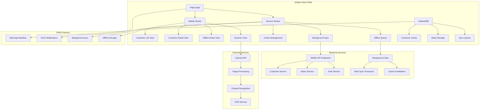

# FC-022: Technisches Konzept - Mobile Light PWA

**Feature Code:** FC-022  
**Datum:** 2025-07-20  
**Status:** Draft  
**Autor:** Claude  
**Reviewer:** TBD  

## 📋 Inhaltsverzeichnis

1. [Zusammenfassung](#zusammenfassung)
2. [Ziel und Geschäftswert](#ziel-und-geschäftswert)
3. [Technische Architektur](#technische-architektur)
4. [Backend-Implementierung](#backend-implementierung)
5. [Frontend-Implementierung](#frontend-implementierung)
6. [Implementierungsstrategie](#implementierungsstrategie)
7. [Entscheidungs-Log](#entscheidungs-log)
8. [Risiken und Mitigationen](#risiken-und-mitigationen)
9. [Zeitschätzung](#zeitschätzung)

## Zusammenfassung

FC-022 implementiert eine Progressive Web App (PWA) für mobile Außendienst-Nutzung mit Read-Only Zugriff auf Kunden & Opportunities, Offline-Notizen und Visitenkarten-Scanner. Das System bietet 80% der Mobile Use Cases bei nur 3 Tagen Entwicklungsaufwand und fungiert als Stepping Stone zur vollständigen Mobile App (FC-006).

## Ziel und Geschäftswert

### Geschäftsziele
- **Sofortige Mobile-Unterstützung**: Außendienst wartet nicht auf vollständige Mobile App
- **Produktivitätssteigerung unterwegs**: 50 mobile Zugriffe täglich (5 Außendienstler × 10 Besuche)
- **Offline-Capability**: Notizen und Kundendaten auch ohne Internet verfügbar
- **Niedrige Einstiegsschwelle**: PWA Installation ohne App Store

### Technische Ziele
- **Performance**: <3s First Load, <1s Navigation auf Mobile
- **Offline-Verfügbarkeit**: 7 Tage Offline-Funktionalität für gecachte Daten
- **Mobile-First UX**: Touch-optimiert für Außendienst-Workflows
- **Progressive Enhancement**: Funktioniert auf allen modernen Mobile Browsers

## Technische Architektur

### System-Übersicht



### Mobile-First Architecture

**Responsive Breakpoints:**
```css
/* Mobile-First CSS Architecture */
:root {
  --mobile-breakpoint: 320px;
  --tablet-breakpoint: 768px;
  --desktop-breakpoint: 1024px;
}

/* Default: Mobile First */
.customer-card {
  padding: 16px;
  touch-action: manipulation;
}

/* Progressive Enhancement */
@media (min-width: 768px) {
  .customer-card {
    padding: 24px;
  }
}
```

**Touch-Optimized Components:**
```typescript
interface TouchOptimizedProps {
  minTouchTarget: 44; // iOS/Android minimum
  swipeGestures: boolean;
  pullToRefresh: boolean;
  hapticFeedback: boolean;
}

const MobileComponentConfig: TouchOptimizedProps = {
  minTouchTarget: 44,
  swipeGestures: true,
  pullToRefresh: true,
  hapticFeedback: navigator.vibrate !== undefined
};
```

## Backend-Implementierung

### 1. API Endpoints

**Mobile-Optimized API:**
```java
@Path("/api/mobile")
@Produces(MediaType.APPLICATION_JSON)
@Consumes(MediaType.APPLICATION_JSON)
public class MobileApiResource {
    
    @Inject
    CustomerService customerService;
    
    @Inject
    MobileNotesService notesService;
    
    @GET
    @Path("/customers")
    public Response getMobileCustomers(
        @QueryParam("lastSync") String lastSyncTimestamp,
        @QueryParam("limit") @DefaultValue("50") int limit
    ) {
        try {
            Instant lastSync = parseTimestamp(lastSyncTimestamp);
            
            MobileCustomerResponse response = customerService
                .getMobileCustomerData(getCurrentUser(), lastSync, limit);
            
            // Add ETags for caching
            EntityTag etag = new EntityTag(response.getDataHash());
            
            return Response.ok(response)
                .tag(etag)
                .header("Cache-Control", "max-age=300") // 5 minutes
                .build();
                
        } catch (Exception e) {
            Log.error("Error fetching mobile customers", e);
            return Response.status(500)
                .entity(Map.of("error", "Failed to fetch customer data"))
                .build();
        }
    }
    
    @GET
    @Path("/customers/{customerId}")
    public Response getCustomerDetail(
        @PathParam("customerId") UUID customerId
    ) {
        try {
            CustomerDetailResponse customer = customerService
                .getCustomerDetailForMobile(customerId, getCurrentUser());
            
            if (customer == null) {
                return Response.status(404)
                    .entity(Map.of("error", "Customer not found"))
                    .build();
            }
            
            return Response.ok(customer)
                .header("Cache-Control", "max-age=600") // 10 minutes
                .build();
                
        } catch (SecurityException e) {
            return Response.status(403)
                .entity(Map.of("error", "Access denied"))
                .build();
        }
    }
    
    @POST
    @Path("/notes")
    public Response createOfflineNote(CreateOfflineNoteRequest request) {
        try {
            validateOfflineNote(request);
            
            OfflineNote note = notesService.createOfflineNote(
                request,
                getCurrentUser()
            );
            
            return Response.status(201)
                .entity(OfflineNoteResponse.from(note))
                .build();
                
        } catch (ValidationException e) {
            return Response.status(400)
                .entity(Map.of("error", e.getMessage()))
                .build();
        }
    }
    
    @POST
    @Path("/sync/notes")
    public Response syncOfflineNotes(SyncOfflineNotesRequest request) {
        try {
            SyncResult result = notesService.syncOfflineNotes(
                request.getNotes(),
                getCurrentUser()
            );
            
            return Response.ok(result).build();
            
        } catch (Exception e) {
            Log.error("Error syncing offline notes", e);
            return Response.status(500)
                .entity(Map.of("error", "Sync failed"))
                .build();
        }
    }
}
```

### 2. Datenmodell

**Mobile-Optimized DTOs:**
```java
// Lightweight Customer Response for Mobile
public class MobileCustomerResponse {
    private List<MobileCustomerSummary> customers;
    private String dataHash; // For ETags
    private Instant lastModified;
    private boolean hasMore;
    private String nextPageToken;
    
    // Pagination info
    private int totalCount;
    private int currentPage;
}

public class MobileCustomerSummary {
    private UUID id;
    private String name;
    private String contactPerson;
    private String city;
    private String phone;
    private String email;
    private CustomerType type; // A, B, C customer
    private BigDecimal totalRevenue;
    private String lastActivitySummary;
    private Instant lastActivityDate;
    private int openOpportunities;
    
    // Mobile-specific fields
    private String shortDisplayName; // "Müller GmbH"
    private String subtitle; // "Berlin • A-Kunde"
    private String primaryAction; // "call" | "email" | "visit"
}

public class CustomerDetailResponse {
    private UUID id;
    private String name;
    private ContactInfo contactInfo;
    private List<MobileOpportunity> opportunities;
    private List<MobileActivity> recentActivities;
    private List<OfflineNote> notes;
    
    // Computed fields for mobile
    private String displayAddress;
    private String formattedPhone;
    private boolean canCall;
    private boolean canEmail;
}

public class MobileOpportunity {
    private UUID id;
    private String title;
    private BigDecimal amount;
    private OpportunityStage stage;
    private LocalDate expectedCloseDate;
    private String statusIcon; // 🟢 🟡 🔴
    private String shortDescription;
}
```

**Offline Notes Storage:**
```java
@Entity
@Table(name = "offline_notes")
public class OfflineNote {
    @Id
    private UUID id;
    
    @Column(name = "user_id", nullable = false)
    private UUID userId;
    
    @Column(name = "customer_id")
    private UUID customerId;
    
    @Column(name = "opportunity_id")
    private UUID opportunityId;
    
    @Column(name = "note_content", nullable = false, length = 2000)
    private String noteContent;
    
    @Column(name = "note_type")
    @Enumerated(EnumType.STRING)
    private OfflineNoteType type; // VISIT, CALL, EMAIL, GENERAL
    
    @Column(name = "created_offline_at", nullable = false)
    private Instant createdOfflineAt;
    
    @Column(name = "synced_at")
    private Instant syncedAt;
    
    @Column(name = "device_id")
    private String deviceId; // For conflict resolution
    
    @Column(name = "geolocation")
    @Type(type = "jsonb")
    private GeolocationData geolocation;
    
    @Column(name = "attachments")
    @Type(type = "jsonb")
    private List<OfflineAttachment> attachments;
    
    @Column(name = "sync_status")
    @Enumerated(EnumType.STRING)
    private SyncStatus syncStatus; // PENDING, SYNCED, FAILED
}

public class GeolocationData {
    private double latitude;
    private double longitude;
    private double accuracy;
    private Instant timestamp;
}

public class OfflineAttachment {
    private String fileName;
    private String mimeType;
    private long size;
    private String base64Data; // For small images
    private String localPath; // For larger files
}
```

### 3. Business Logic

**Mobile Notes Service:**
```java
@ApplicationScoped
@Transactional
public class MobileNotesService {
    
    @Inject
    OfflineNoteRepository noteRepository;
    
    @Inject
    CustomerService customerService;
    
    @Inject
    Event<OfflineNoteSyncedEvent> syncEvents;
    
    public OfflineNote createOfflineNote(
        CreateOfflineNoteRequest request,
        User user
    ) {
        // Validate note content
        if (request.getNoteContent().length() > 2000) {
            throw new ValidationException("Note content too long");
        }
        
        OfflineNote note = OfflineNote.builder()
            .userId(user.getId())
            .customerId(request.getCustomerId())
            .opportunityId(request.getOpportunityId())
            .noteContent(request.getNoteContent())
            .type(request.getType())
            .createdOfflineAt(request.getCreatedAt())
            .deviceId(request.getDeviceId())
            .geolocation(request.getGeolocation())
            .attachments(request.getAttachments())
            .syncStatus(SyncStatus.PENDING)
            .build();
        
        noteRepository.persist(note);
        
        return note;
    }
    
    public SyncResult syncOfflineNotes(
        List<CreateOfflineNoteRequest> notesToSync,
        User user
    ) {
        List<UUID> successfulNotes = new ArrayList<>();
        List<SyncError> errors = new ArrayList<>();
        
        for (CreateOfflineNoteRequest noteRequest : notesToSync) {
            try {
                // Check for duplicates based on device ID + timestamp
                boolean isDuplicate = noteRepository.existsByDeviceIdAndTimestamp(
                    noteRequest.getDeviceId(),
                    noteRequest.getCreatedAt()
                );
                
                if (isDuplicate) {
                    Log.info("Skipping duplicate note from device: " + noteRequest.getDeviceId());
                    continue;
                }
                
                // Validate customer access
                if (noteRequest.getCustomerId() != null) {
                    boolean hasAccess = customerService.canAccessCustomer(
                        noteRequest.getCustomerId(), 
                        user
                    );
                    
                    if (!hasAccess) {
                        errors.add(SyncError.builder()
                            .clientNoteId(noteRequest.getClientId())
                            .errorCode("ACCESS_DENIED")
                            .errorMessage("No access to customer")
                            .build());
                        continue;
                    }
                }
                
                OfflineNote syncedNote = createOfflineNote(noteRequest, user);
                syncedNote.setSyncedAt(Instant.now());
                syncedNote.setSyncStatus(SyncStatus.SYNCED);
                
                noteRepository.persist(syncedNote);
                successfulNotes.add(syncedNote.getId());
                
                // Fire event for activity timeline
                syncEvents.fireAsync(OfflineNoteSyncedEvent.builder()
                    .noteId(syncedNote.getId())
                    .userId(user.getId())
                    .customerId(syncedNote.getCustomerId())
                    .build());
                
            } catch (Exception e) {
                Log.error("Error syncing offline note", e);
                errors.add(SyncError.builder()
                    .clientNoteId(noteRequest.getClientId())
                    .errorCode("SYNC_ERROR")
                    .errorMessage(e.getMessage())
                    .build());
            }
        }
        
        return SyncResult.builder()
            .successfulNotes(successfulNotes)
            .errors(errors)
            .syncTimestamp(Instant.now())
            .build();
    }
}
```

### 4. Datenbank-Änderungen

**Migration V1.0__create_mobile_tables.sql:**
```sql
-- Offline Notes Table
CREATE TABLE offline_notes (
    id UUID PRIMARY KEY DEFAULT gen_random_uuid(),
    user_id UUID NOT NULL REFERENCES users(id),
    customer_id UUID REFERENCES customers(id),
    opportunity_id UUID REFERENCES opportunities(id),
    note_content TEXT NOT NULL CHECK (char_length(note_content) <= 2000),
    note_type VARCHAR(20) NOT NULL DEFAULT 'GENERAL',
    created_offline_at TIMESTAMP WITH TIME ZONE NOT NULL,
    synced_at TIMESTAMP WITH TIME ZONE,
    device_id VARCHAR(100) NOT NULL,
    geolocation JSONB,
    attachments JSONB DEFAULT '[]',
    sync_status VARCHAR(20) NOT NULL DEFAULT 'PENDING',
    created_at TIMESTAMP WITH TIME ZONE DEFAULT NOW()
);

-- Mobile Sync State (per user)
CREATE TABLE mobile_sync_state (
    user_id UUID PRIMARY KEY REFERENCES users(id),
    last_customer_sync TIMESTAMP WITH TIME ZONE DEFAULT NOW(),
    last_notes_sync TIMESTAMP WITH TIME ZONE DEFAULT NOW(),
    device_tokens JSONB DEFAULT '[]', -- For push notifications
    sync_preferences JSONB DEFAULT '{}',
    updated_at TIMESTAMP WITH TIME ZONE DEFAULT NOW()
);

-- Mobile Session Log (for analytics)
CREATE TABLE mobile_sessions (
    id UUID PRIMARY KEY DEFAULT gen_random_uuid(),
    user_id UUID NOT NULL REFERENCES users(id),
    device_id VARCHAR(100) NOT NULL,
    session_start TIMESTAMP WITH TIME ZONE DEFAULT NOW(),
    session_end TIMESTAMP WITH TIME ZONE,
    pages_visited INTEGER DEFAULT 0,
    actions_performed INTEGER DEFAULT 0,
    offline_duration_ms BIGINT DEFAULT 0,
    user_agent TEXT,
    geolocation JSONB
);

-- Indexes for Performance
CREATE INDEX idx_offline_notes_user_date 
    ON offline_notes(user_id, created_offline_at DESC);

CREATE INDEX idx_offline_notes_customer 
    ON offline_notes(customer_id) WHERE customer_id IS NOT NULL;

CREATE INDEX idx_offline_notes_sync_status 
    ON offline_notes(sync_status, synced_at) WHERE sync_status = 'PENDING';

CREATE INDEX idx_offline_notes_device_timestamp 
    ON offline_notes(device_id, created_offline_at);

CREATE INDEX idx_mobile_sessions_user_date 
    ON mobile_sessions(user_id, session_start DESC);

-- Initial Mobile Sync State for existing users
INSERT INTO mobile_sync_state (user_id, last_customer_sync, last_notes_sync)
SELECT id, NOW() - INTERVAL '7 days', NOW() - INTERVAL '7 days' 
FROM users WHERE is_active = TRUE;
```

## Frontend-Implementierung

### 1. Komponenten-Struktur

**PWA Shell Component:**
```typescript
interface PWAShellProps {
  children: React.ReactNode;
}

export const PWAShell: React.FC<PWAShellProps> = ({ children }) => {
  const [isOnline, setIsOnline] = useState(navigator.onLine);
  const [deferredPrompt, setDeferredPrompt] = useState<BeforeInstallPromptEvent | null>(null);
  const { syncPendingNotes } = useOfflineNotes();
  
  // Online/Offline detection
  useEffect(() => {
    const handleOnline = () => {
      setIsOnline(true);
      syncPendingNotes(); // Auto-sync when back online
    };
    
    const handleOffline = () => setIsOnline(false);
    
    window.addEventListener('online', handleOnline);
    window.addEventListener('offline', handleOffline);
    
    return () => {
      window.removeEventListener('online', handleOnline);
      window.removeEventListener('offline', handleOffline);
    };
  }, [syncPendingNotes]);
  
  // PWA Install Prompt
  useEffect(() => {
    const handleBeforeInstallPrompt = (e: BeforeInstallPromptEvent) => {
      e.preventDefault();
      setDeferredPrompt(e);
    };
    
    window.addEventListener('beforeinstallprompt', handleBeforeInstallPrompt);
    
    return () => {
      window.removeEventListener('beforeinstallprompt', handleBeforeInstallPrompt);
    };
  }, []);
  
  const handleInstallPWA = async () => {
    if (!deferredPrompt) return;
    
    deferredPrompt.prompt();
    const { outcome } = await deferredPrompt.userChoice;
    
    if (outcome === 'accepted') {
      toast.success('FreshPlan wurde zu deinem Homescreen hinzugefügt!');
    }
    
    setDeferredPrompt(null);
  };
  
  return (
    <div className="pwa-shell min-h-screen bg-gray-50">
      {/* Status Bar */}
      <div className={cn(
        "status-bar p-2 text-center text-sm",
        isOnline ? "bg-green-100 text-green-800" : "bg-yellow-100 text-yellow-800"
      )}>
        {isOnline ? (
          <div className="flex items-center justify-center gap-2">
            <Wifi className="w-4 h-4" />
            Online
          </div>
        ) : (
          <div className="flex items-center justify-center gap-2">
            <WifiOff className="w-4 h-4" />
            Offline - Daten werden synchronisiert sobald Verbindung verfügbar
          </div>
        )}
      </div>
      
      {/* Install Prompt */}
      {deferredPrompt && (
        <div className="install-prompt bg-blue-50 border-b border-blue-200 p-4">
          <div className="flex items-center justify-between">
            <div className="flex items-center gap-3">
              <Smartphone className="w-5 h-5 text-blue-600" />
              <div>
                <div className="font-medium text-sm">FreshPlan installieren</div>
                <div className="text-xs text-gray-600">
                  Für schnelleren Zugriff zum Homescreen hinzufügen
                </div>
              </div>
            </div>
            <div className="flex gap-2">
              <Button
                variant="ghost"
                size="sm"
                onClick={() => setDeferredPrompt(null)}
              >
                Später
              </Button>
              <Button
                size="sm"
                onClick={handleInstallPWA}
              >
                Installieren
              </Button>
            </div>
          </div>
        </div>
      )}
      
      {/* Main Content */}
      <main className="pb-safe-bottom">
        {children}
      </main>
      
      {/* Background Sync Indicator */}
      <SyncIndicator />
    </div>
  );
};
```

**Mobile Customer List:**
```typescript
interface MobileCustomerListProps {
  searchQuery?: string;
  onCustomerSelect?: (customer: MobileCustomer) => void;
}

export const MobileCustomerList: React.FC<MobileCustomerListProps> = ({
  searchQuery,
  onCustomerSelect
}) => {
  const { customers, isLoading, hasNextPage, fetchNextPage } = useMobileCustomers();
  const [selectedCustomers, setSelectedCustomers] = useState<Set<string>>(new Set());
  const [pullToRefreshTriggered, setPullToRefreshTriggered] = useState(false);
  
  // Filter customers based on search
  const filteredCustomers = useMemo(() => {
    if (!searchQuery) return customers;
    
    return customers.filter(customer =>
      customer.name.toLowerCase().includes(searchQuery.toLowerCase()) ||
      customer.contactPerson?.toLowerCase().includes(searchQuery.toLowerCase()) ||
      customer.city?.toLowerCase().includes(searchQuery.toLowerCase())
    );
  }, [customers, searchQuery]);
  
  // Pull to refresh
  const { refresh } = usePullToRefresh({
    onRefresh: async () => {
      setPullToRefreshTriggered(true);
      await refetchCustomers();
      setPullToRefreshTriggered(false);
    }
  });
  
  // Virtual scrolling for performance
  const virtualizer = useVirtualizer({
    count: filteredCustomers.length,
    getScrollElement: () => document.querySelector('.customer-list-container'),
    estimateSize: () => 80, // Estimated item height
    overscan: 5
  });
  
  const handleCustomerAction = (customer: MobileCustomer, action: 'call' | 'email' | 'note') => {
    switch (action) {
      case 'call':
        window.location.href = `tel:${customer.phone}`;
        trackMobileAction('customer_call', { customerId: customer.id });
        break;
      case 'email':
        window.location.href = `mailto:${customer.email}`;
        trackMobileAction('customer_email', { customerId: customer.id });
        break;
      case 'note':
        onCustomerSelect?.(customer);
        break;
    }
  };
  
  if (isLoading && customers.length === 0) {
    return <MobileCustomerListSkeleton />;
  }
  
  return (
    <div className="customer-list-container h-full overflow-auto">
      {/* Pull to refresh indicator */}
      {pullToRefreshTriggered && (
        <div className="p-4 text-center">
          <Loader2 className="w-5 h-5 animate-spin mx-auto" />
          <div className="text-sm text-gray-600 mt-2">Aktualisiere...</div>
        </div>
      )}
      
      {/* Virtual scrolled list */}
      <div
        style={{
          height: virtualizer.getTotalSize(),
          width: '100%',
          position: 'relative'
        }}
      >
        {virtualizer.getVirtualItems().map(virtualItem => {
          const customer = filteredCustomers[virtualItem.index];
          
          return (
            <div
              key={virtualItem.key}
              style={{
                position: 'absolute',
                top: 0,
                left: 0,
                width: '100%',
                height: virtualItem.size,
                transform: `translateY(${virtualItem.start}px)`
              }}
            >
              <SwipeableListItem
                leftAction={{
                  icon: <Phone className="w-5 h-5" />,
                  label: 'Anrufen',
                  color: 'green',
                  onSwipe: () => handleCustomerAction(customer, 'call')
                }}
                rightAction={{
                  icon: <MessageSquare className="w-5 h-5" />,
                  label: 'Notiz',
                  color: 'blue',
                  onSwipe: () => handleCustomerAction(customer, 'note')
                }}
              >
                <MobileCustomerCard
                  customer={customer}
                  onTap={() => onCustomerSelect?.(customer)}
                  onActionTap={(action) => handleCustomerAction(customer, action)}
                />
              </SwipeableListItem>
            </div>
          );
        })}
      </div>
      
      {/* Load more button */}
      {hasNextPage && (
        <div className="p-4 text-center">
          <Button
            variant="outline"
            onClick={() => fetchNextPage()}
            disabled={isLoading}
          >
            {isLoading ? (
              <>
                <Loader2 className="w-4 h-4 animate-spin mr-2" />
                Lade mehr...
              </>
            ) : (
              'Weitere Kunden laden'
            )}
          </Button>
        </div>
      )}
      
      {/* Empty state */}
      {filteredCustomers.length === 0 && !isLoading && (
        <div className="p-8 text-center">
          <Building className="w-12 h-12 text-gray-400 mx-auto mb-4" />
          <div className="text-lg font-medium text-gray-900 mb-2">
            Keine Kunden gefunden
          </div>
          <div className="text-gray-600">
            {searchQuery ? 
              `Keine Ergebnisse für "${searchQuery}"` : 
              'Keine Kunden verfügbar'
            }
          </div>
        </div>
      )}
    </div>
  );
};
```

**Offline Notes Component:**
```typescript
interface OfflineNotesProps {
  customerId?: string;
  opportunityId?: string;
}

export const OfflineNotes: React.FC<OfflineNotesProps> = ({
  customerId,
  opportunityId
}) => {
  const [noteContent, setNoteContent] = useState('');
  const [noteType, setNoteType] = useState<OfflineNoteType>('GENERAL');
  const [isRecording, setIsRecording] = useState(false);
  const { createOfflineNote, notes, pendingCount } = useOfflineNotes();
  const { getCurrentLocation } = useGeolocation();
  
  const handleCreateNote = async () => {
    if (!noteContent.trim()) return;
    
    try {
      const location = await getCurrentLocation();
      
      await createOfflineNote({
        content: noteContent,
        type: noteType,
        customerId,
        opportunityId,
        geolocation: location,
        createdAt: new Date()
      });
      
      setNoteContent('');
      toast.success('Notiz gespeichert');
      
      // Haptic feedback if available
      if (navigator.vibrate) {
        navigator.vibrate(50);
      }
      
    } catch (error) {
      toast.error('Fehler beim Speichern der Notiz');
    }
  };
  
  const handleVoiceNote = async () => {
    if (!('webkitSpeechRecognition' in window)) {
      toast.error('Spracherkennung nicht verfügbar');
      return;
    }
    
    setIsRecording(true);
    
    const recognition = new webkitSpeechRecognition();
    recognition.lang = 'de-DE';
    recognition.continuous = false;
    recognition.interimResults = false;
    
    recognition.onresult = (event) => {
      const transcript = event.results[0][0].transcript;
      setNoteContent(prev => prev + ' ' + transcript);
    };
    
    recognition.onerror = () => {
      toast.error('Spracherkennung fehlgeschlagen');
      setIsRecording(false);
    };
    
    recognition.onend = () => {
      setIsRecording(false);
    };
    
    recognition.start();
  };
  
  const contextNotes = notes.filter(note => 
    (!customerId || note.customerId === customerId) &&
    (!opportunityId || note.opportunityId === opportunityId)
  );
  
  return (
    <div className="offline-notes h-full flex flex-col">
      {/* Header with sync status */}
      <div className="p-4 border-b bg-white">
        <div className="flex items-center justify-between">
          <h2 className="text-lg font-semibold">Notizen</h2>
          {pendingCount > 0 && (
            <Badge variant="secondary">
              {pendingCount} ausstehend
            </Badge>
          )}
        </div>
      </div>
      
      {/* Notes list */}
      <div className="flex-1 overflow-auto p-4 space-y-3">
        {contextNotes.map(note => (
          <div
            key={note.id}
            className="bg-white rounded-lg p-3 border shadow-sm"
          >
            <div className="flex items-start justify-between mb-2">
              <div className="flex items-center gap-2">
                <div className="text-sm font-medium">
                  {getNoteTypeLabel(note.type)}
                </div>
                <Badge variant={note.isSynced ? 'default' : 'secondary'}>
                  {note.isSynced ? 'Synchronisiert' : 'Offline'}
                </Badge>
              </div>
              <div className="text-xs text-gray-500">
                {formatRelativeTime(note.createdAt)}
              </div>
            </div>
            
            <div className="text-sm text-gray-900">
              {note.content}
            </div>
            
            {note.geolocation && (
              <div className="text-xs text-gray-500 mt-2 flex items-center gap-1">
                <MapPin className="w-3 h-3" />
                Standort erfasst
              </div>
            )}
          </div>
        ))}
        
        {contextNotes.length === 0 && (
          <div className="text-center py-8">
            <FileText className="w-12 h-12 text-gray-400 mx-auto mb-4" />
            <div className="text-gray-600">Noch keine Notizen vorhanden</div>
          </div>
        )}
      </div>
      
      {/* Note creation */}
      <div className="p-4 border-t bg-white">
        <div className="space-y-3">
          {/* Note type selector */}
          <div className="flex gap-2 overflow-x-auto">
            {(['GENERAL', 'VISIT', 'CALL', 'EMAIL'] as OfflineNoteType[]).map(type => (
              <Button
                key={type}
                variant={noteType === type ? 'default' : 'outline'}
                size="sm"
                onClick={() => setNoteType(type)}
                className="flex-shrink-0"
              >
                {getNoteTypeIcon(type)} {getNoteTypeLabel(type)}
              </Button>
            ))}
          </div>
          
          {/* Note input */}
          <div className="relative">
            <Textarea
              value={noteContent}
              onChange={(e) => setNoteContent(e.target.value)}
              placeholder="Notiz eingeben..."
              className="pr-12 min-h-[80px]"
              maxLength={2000}
            />
            
            {/* Voice input button */}
            <Button
              variant="ghost"
              size="sm"
              className="absolute top-2 right-2"
              onClick={handleVoiceNote}
              disabled={isRecording}
            >
              {isRecording ? (
                <MicOff className="w-4 h-4 text-red-500" />
              ) : (
                <Mic className="w-4 h-4" />
              )}
            </Button>
          </div>
          
          {/* Character count */}
          <div className="text-xs text-gray-500 text-right">
            {noteContent.length}/2000
          </div>
          
          {/* Action buttons */}
          <div className="flex gap-2">
            <Button
              onClick={handleCreateNote}
              disabled={!noteContent.trim()}
              className="flex-1"
            >
              <Plus className="w-4 h-4 mr-2" />
              Notiz speichern
            </Button>
          </div>
        </div>
      </div>
    </div>
  );
};
```

### 2. State Management

**Offline-First State Management:**
```typescript
// Offline Notes Hook
export const useOfflineNotes = () => {
  const [notes, setNotes] = useState<OfflineNote[]>([]);
  const [pendingCount, setPendingCount] = useState(0);
  const { isOnline } = useNetworkStatus();
  const { user } = useAuth();
  
  // Load notes from IndexedDB
  useEffect(() => {
    loadNotesFromDB().then(setNotes);
  }, []);
  
  // Auto-sync when online
  useEffect(() => {
    if (isOnline && pendingCount > 0) {
      syncPendingNotes();
    }
  }, [isOnline, pendingCount]);
  
  const createOfflineNote = useCallback(async (noteData: CreateNoteData) => {
    const note: OfflineNote = {
      id: generateUUID(),
      ...noteData,
      userId: user.id,
      deviceId: getDeviceId(),
      isSynced: false,
      syncAttempts: 0
    };
    
    // Save to IndexedDB immediately
    await saveNoteToIndexedDB(note);
    
    // Update local state
    setNotes(prev => [note, ...prev]);
    setPendingCount(prev => prev + 1);
    
    // Try immediate sync if online
    if (isOnline) {
      trySyncNote(note);
    }
    
    return note;
  }, [user, isOnline]);
  
  const syncPendingNotes = useCallback(async () => {
    const pendingNotes = notes.filter(note => !note.isSynced);
    
    if (pendingNotes.length === 0) return;
    
    try {
      const result = await api.mobile.syncNotes(pendingNotes);
      
      // Update sync status for successful notes
      const updatedNotes = notes.map(note => {
        const wasSuccessful = result.successfulNotes.includes(note.id);
        return wasSuccessful ? { ...note, isSynced: true } : note;
      });
      
      setNotes(updatedNotes);
      setPendingCount(pendingNotes.length - result.successfulNotes.length);
      
      // Update IndexedDB
      await updateNotesInIndexedDB(updatedNotes);
      
      if (result.successfulNotes.length > 0) {
        toast.success(`${result.successfulNotes.length} Notizen synchronisiert`);
      }
      
    } catch (error) {
      console.error('Sync failed:', error);
      // Will retry on next online event
    }
  }, [notes]);
  
  return {
    notes,
    pendingCount,
    createOfflineNote,
    syncPendingNotes
  };
};

// Mobile Customer Data Hook
export const useMobileCustomers = () => {
  const [lastSync, setLastSync] = useState<Date | null>(null);
  const { isOnline } = useNetworkStatus();
  
  return useInfiniteQuery({
    queryKey: ['mobile-customers'],
    queryFn: async ({ pageParam = 0 }) => {
      // Try cache first if offline
      if (!isOnline) {
        return getCachedCustomers(pageParam);
      }
      
      const response = await api.mobile.getCustomers({
        lastSync: lastSync?.toISOString(),
        offset: pageParam * 50,
        limit: 50
      });
      
      // Cache for offline use
      await cacheCustomers(response.customers, pageParam);
      setLastSync(new Date());
      
      return response;
    },
    getNextPageParam: (lastPage, pages) => {
      return lastPage.hasMore ? pages.length : undefined;
    },
    staleTime: 5 * 60 * 1000, // 5 minutes
    gcTime: 30 * 60 * 1000, // 30 minutes
    networkMode: isOnline ? 'online' : 'offlineFirst'
  });
};

// Service Worker Registration Hook
export const useServiceWorker = () => {
  const [swRegistration, setSwRegistration] = useState<ServiceWorkerRegistration | null>(null);
  const [updateAvailable, setUpdateAvailable] = useState(false);
  
  useEffect(() => {
    if ('serviceWorker' in navigator) {
      navigator.serviceWorker
        .register('/sw.js')
        .then(registration => {
          setSwRegistration(registration);
          
          // Check for updates
          registration.addEventListener('updatefound', () => {
            const newWorker = registration.installing;
            if (newWorker) {
              newWorker.addEventListener('statechange', () => {
                if (newWorker.state === 'installed' && navigator.serviceWorker.controller) {
                  setUpdateAvailable(true);
                }
              });
            }
          });
        })
        .catch(error => {
          console.error('SW registration failed:', error);
        });
    }
  }, []);
  
  const updateServiceWorker = useCallback(() => {
    if (swRegistration?.waiting) {
      swRegistration.waiting.postMessage({ type: 'SKIP_WAITING' });
      window.location.reload();
    }
  }, [swRegistration]);
  
  return {
    swRegistration,
    updateAvailable,
    updateServiceWorker
  };
};
```

### 3. UI/UX Design

**Mobile-First CSS Framework:**
```css
/* Mobile-First Utilities */
.safe-area-insets {
  padding-top: env(safe-area-inset-top);
  padding-bottom: env(safe-area-inset-bottom);
  padding-left: env(safe-area-inset-left);
  padding-right: env(safe-area-inset-right);
}

.touch-target {
  min-height: 44px;
  min-width: 44px;
  display: flex;
  align-items: center;
  justify-content: center;
}

.swipe-actions {
  position: relative;
  overflow: hidden;
}

.swipe-content {
  transition: transform 0.2s ease-out;
  will-change: transform;
}

/* Pull to refresh */
.pull-to-refresh {
  transform: translateY(var(--pull-distance, 0px));
  transition: transform 0.3s ease-out;
}

/* Virtual scrolling optimization */
.virtual-list-item {
  contain: layout style paint;
  will-change: transform;
}

/* Offline indicator */
.offline-indicator {
  position: sticky;
  top: 0;
  z-index: 50;
  background: var(--warning-bg);
  color: var(--warning-text);
  padding: 8px 16px;
  text-align: center;
  font-size: 14px;
}

/* Mobile keyboard adjustments */
@media (max-height: 500px) {
  .mobile-form {
    height: 100vh;
  }
  
  .mobile-form .footer {
    position: fixed;
    bottom: 0;
    left: 0;
    right: 0;
  }
}

/* iOS-specific adjustments */
@supports (-webkit-touch-callout: none) {
  .ios-safe-area {
    padding-bottom: calc(env(safe-area-inset-bottom) + 16px);
  }
}
```

**Touch Gestures Implementation:**
```typescript
export const useSwipeGestures = (
  elementRef: RefObject<HTMLElement>,
  onSwipeLeft?: () => void,
  onSwipeRight?: () => void
) => {
  const [touchStart, setTouchStart] = useState<{ x: number; y: number } | null>(null);
  const [touchEnd, setTouchEnd] = useState<{ x: number; y: number } | null>(null);
  
  useEffect(() => {
    const element = elementRef.current;
    if (!element) return;
    
    const handleTouchStart = (e: TouchEvent) => {
      const touch = e.touches[0];
      setTouchStart({ x: touch.clientX, y: touch.clientY });
      setTouchEnd(null);
    };
    
    const handleTouchMove = (e: TouchEvent) => {
      const touch = e.touches[0];
      setTouchEnd({ x: touch.clientX, y: touch.clientY });
    };
    
    const handleTouchEnd = () => {
      if (!touchStart || !touchEnd) return;
      
      const deltaX = touchStart.x - touchEnd.x;
      const deltaY = touchStart.y - touchEnd.y;
      const minSwipeDistance = 50;
      
      // Check if horizontal swipe (not vertical scroll)
      if (Math.abs(deltaX) > Math.abs(deltaY) && Math.abs(deltaX) > minSwipeDistance) {
        if (deltaX > 0 && onSwipeLeft) {
          onSwipeLeft();
        } else if (deltaX < 0 && onSwipeRight) {
          onSwipeRight();
        }
      }
      
      setTouchStart(null);
      setTouchEnd(null);
    };
    
    element.addEventListener('touchstart', handleTouchStart, { passive: true });
    element.addEventListener('touchmove', handleTouchMove, { passive: true });
    element.addEventListener('touchend', handleTouchEnd, { passive: true });
    
    return () => {
      element.removeEventListener('touchstart', handleTouchStart);
      element.removeEventListener('touchmove', handleTouchMove);
      element.removeEventListener('touchend', handleTouchEnd);
    };
  }, [touchStart, touchEnd, onSwipeLeft, onSwipeRight]);
};
```

### 4. Integration

**PWA Configuration:**
```json
// public/manifest.json
{
  "name": "FreshPlan Mobile",
  "short_name": "FreshPlan",
  "description": "Mobile CRM für Außendienst",
  "start_url": "/mobile",
  "display": "standalone",
  "orientation": "portrait-primary",
  "theme_color": "#94C456",
  "background_color": "#ffffff",
  "categories": ["business", "productivity"],
  "screenshots": [
    {
      "src": "/screenshots/mobile-home.png",
      "type": "image/png",
      "sizes": "390x844"
    }
  ],
  "icons": [
    {
      "src": "/icons/icon-72x72.png",
      "sizes": "72x72",
      "type": "image/png",
      "purpose": "any"
    },
    {
      "src": "/icons/icon-192x192.png",
      "sizes": "192x192",
      "type": "image/png",
      "purpose": "any"
    },
    {
      "src": "/icons/icon-512x512.png",
      "sizes": "512x512",
      "type": "image/png",
      "purpose": "any maskable"
    }
  ],
  "shortcuts": [
    {
      "name": "Kunden",
      "url": "/mobile/customers",
      "icons": [{"src": "/icons/customers-shortcut.png", "sizes": "96x96"}]
    },
    {
      "name": "Neue Notiz",
      "url": "/mobile/notes/new",
      "icons": [{"src": "/icons/note-shortcut.png", "sizes": "96x96"}]
    }
  ]
}
```

**Service Worker (sw.js):**
```javascript
// Service Worker for Offline-First Strategy
const CACHE_NAME = 'freshplan-mobile-v1';
const RUNTIME_CACHE = 'freshplan-runtime';

// Cache essential resources on install
self.addEventListener('install', event => {
  event.waitUntil(
    caches.open(CACHE_NAME).then(cache => {
      return cache.addAll([
        '/mobile',
        '/mobile/customers',
        '/mobile/notes',
        '/static/css/mobile.css',
        '/static/js/mobile.js',
        '/icons/icon-192x192.png',
        '/offline.html'
      ]);
    })
  );
});

// Serve from cache, fallback to network
self.addEventListener('fetch', event => {
  // API requests: Network first, cache fallback
  if (event.request.url.includes('/api/mobile')) {
    event.respondWith(
      fetch(event.request)
        .then(response => {
          const responseClone = response.clone();
          caches.open(RUNTIME_CACHE).then(cache => {
            cache.put(event.request, responseClone);
          });
          return response;
        })
        .catch(() => {
          return caches.match(event.request);
        })
    );
    return;
  }
  
  // Static resources: Cache first
  event.respondWith(
    caches.match(event.request).then(response => {
      return response || fetch(event.request);
    })
  );
});

// Background sync for offline notes
self.addEventListener('sync', event => {
  if (event.tag === 'sync-offline-notes') {
    event.waitUntil(syncOfflineNotes());
  }
});

async function syncOfflineNotes() {
  // Implementation for syncing pending notes
  try {
    const db = await openIndexedDB();
    const pendingNotes = await getPendingNotes(db);
    
    if (pendingNotes.length > 0) {
      const response = await fetch('/api/mobile/sync/notes', {
        method: 'POST',
        headers: { 'Content-Type': 'application/json' },
        body: JSON.stringify({ notes: pendingNotes })
      });
      
      if (response.ok) {
        await markNotesAsSynced(db, pendingNotes);
      }
    }
  } catch (error) {
    console.error('Background sync failed:', error);
  }
}
```

## Implementierungsstrategie

### Phase 1: PWA Foundation (1 Tag)

#### Sprint 1.1: PWA Setup (Vormittag)
1. **PWA Manifest** erstellen mit Icons und Shortcuts
2. **Service Worker** implementieren (Cache Strategy)
3. **Mobile Router** Setup (/mobile/* Routes)
4. **Install Prompt** Component

#### Sprint 1.2: Mobile Shell (Nachmittag)
1. **PWA Shell Component** mit Online/Offline Status
2. **Mobile Navigation** Touch-optimiert
3. **Safe Area Insets** für iOS/Android
4. **Basic Offline Storage** (IndexedDB Setup)

### Phase 2: Customer Views (1 Tag)

#### Sprint 2.1: Customer List (Vormittag)
1. **Virtual Scrolling** für Performance
2. **Pull-to-Refresh** Mechanism
3. **Swipe Gestures** für Actions
4. **Search & Filter** Touch-optimiert

#### Sprint 2.2: Customer Detail (Nachmittag)
1. **Customer Detail View** Mobile-optimiert
2. **Quick Actions** (Call, Email, Note)
3. **Opportunity Cards** Swipeable
4. **Cache Management** für Offline Access

### Phase 3: Offline Notes System (1 Tag)

#### Sprint 3.1: Notes Creation (Vormittag)
1. **Offline Notes** Component mit Types
2. **Voice Input** über Web Speech API
3. **Geolocation** Capture
4. **IndexedDB Storage** für Persistence

#### Sprint 3.2: Sync & Polish (Nachmittag)
1. **Background Sync** Implementation
2. **Conflict Resolution** für Duplicate Notes
3. **Performance Optimization** (Virtual Lists, Caching)
4. **Final Testing** auf verschiedenen Devices

## Entscheidungs-Log

### 2025-07-20 - PWA vs Native App Strategy
**Entscheidung**: PWA (Progressive Web App) als Mobile Light Lösung  
**Begründung**: Schnelle Implementation, keine App Store Dependencies, Cross-Platform kompatibel  
**Impact**: Eingeschränkte native Features aber sofortige Verfügbarkeit  
**Alternativen**: React Native (mehr Aufwand), Flutter (anderer Tech Stack)  
**Entscheider**: Claude basierend auf Time-to-Market Requirements

### 2025-07-20 - Offline Storage Strategy
**Entscheidung**: IndexedDB für Client-side Storage mit Service Worker Caching  
**Begründung**: Bessere Performance als localStorage, strukturierte Daten, große Storage Limits  
**Impact**: Komplexere Implementation aber robuste Offline-Funktionalität  
**Alternativen**: localStorage (Limits), WebSQL (deprecated), keine Offline-Storage  
**Entscheider**: Claude basierend auf Offline-Anforderungen

### 2025-07-20 - Read-Only vs Full Editing
**Entscheidung**: Read-Only Views mit Offline Notes als einzige Schreibfunktion  
**Begründung**: 80% Use Cases abgedeckt, weniger Sync-Komplexität, schnellere Implementation  
**Impact**: Limitierte Funktionalität aber stabiler MVP  
**Alternativen**: Full Editing (mehr Aufwand), komplett Read-Only (weniger Nutzen)  
**Entscheider**: Claude basierend auf 80/20 Prinzip

### 2025-07-20 - Virtual Scrolling für Performance
**Entscheidung**: Virtual Scrolling für Customer Lists mit react-window  
**Begründung**: Bessere Performance bei großen Listen (1000+ Kunden), weniger Memory Usage  
**Impact**: Komplexere Implementation aber scrolling Performance  
**Alternativen**: Pagination (mehr Taps), Standard Scrolling (Performance Issues)  
**Entscheider**: Claude basierend auf Mobile Performance Requirements

## Risiken und Mitigationen

### Risiko 1: Browser Compatibility für PWA Features
**Wahrscheinlichkeit**: Mittel  
**Impact**: Mittel  
**Mitigation**:
- Progressive Enhancement für alle Features
- Fallback für nicht unterstützte APIs
- Testing auf iOS Safari, Chrome Android, Samsung Internet
- Polyfills für Service Worker Features

### Risiko 2: Offline Sync Conflicts
**Wahrscheinlichkeit**: Niedrig  
**Impact**: Hoch  
**Mitigation**:
- Device ID + Timestamp für Duplicate Detection
- Last-Write-Wins Strategy für einfache Conflicts
- Manual Resolution UI für komplexe Conflicts
- Backup aller Offline-Daten vor Sync

### Risiko 3: Mobile Performance bei großen Datenmengen
**Wahrscheinlichkeit**: Mittel  
**Impact**: Hoch  
**Mitigation**:
- Virtual Scrolling für große Listen
- Image Lazy Loading und Compression
- Background Data Preloading
- Memory Usage Monitoring

### Risiko 4: iOS Safari PWA Limitations
**Wahrscheinlichkeit**: Hoch  
**Impact**: Mittel  
**Mitigation**:
- Test alle Features auf iOS Safari
- Alternative UI für nicht verfügbare APIs
- Clear Communication über Feature Availability
- Fallback zu Mobile Web statt PWA

## Zeitschätzung

**Gesamt-Aufwand**: 3 Tage

- **Frontend**: 2.5 Tage
  - PWA Foundation: 1 Tag
  - Customer Views: 1 Tag
  - Offline Notes: 0.5 Tage
- **Backend**: 0.5 Tage
  - Mobile API Endpoints: 0.25 Tage
  - Offline Notes Sync: 0.25 Tage
- **Testing & Polish**: Bereits in Phasen enthalten

**Puffer**: +0.5 Tage für iOS Safari Compatibility Issues und Touch Gesture Fine-tuning

**Strategic Value**: Mobile Light als Stepping Stone zu FC-006 Full Mobile App - validiert Mobile Workflows und User Patterns!

---

**Status-Updates**:
- 2025-07-20: Technisches Konzept erstellt (Draft)
- TBD: PWA Testing auf verschiedenen Mobile Devices
- TBD: Implementierung Start (nach FC-020 Quick Wins)
- TBD: Außendienst User Testing für Workflow Validation