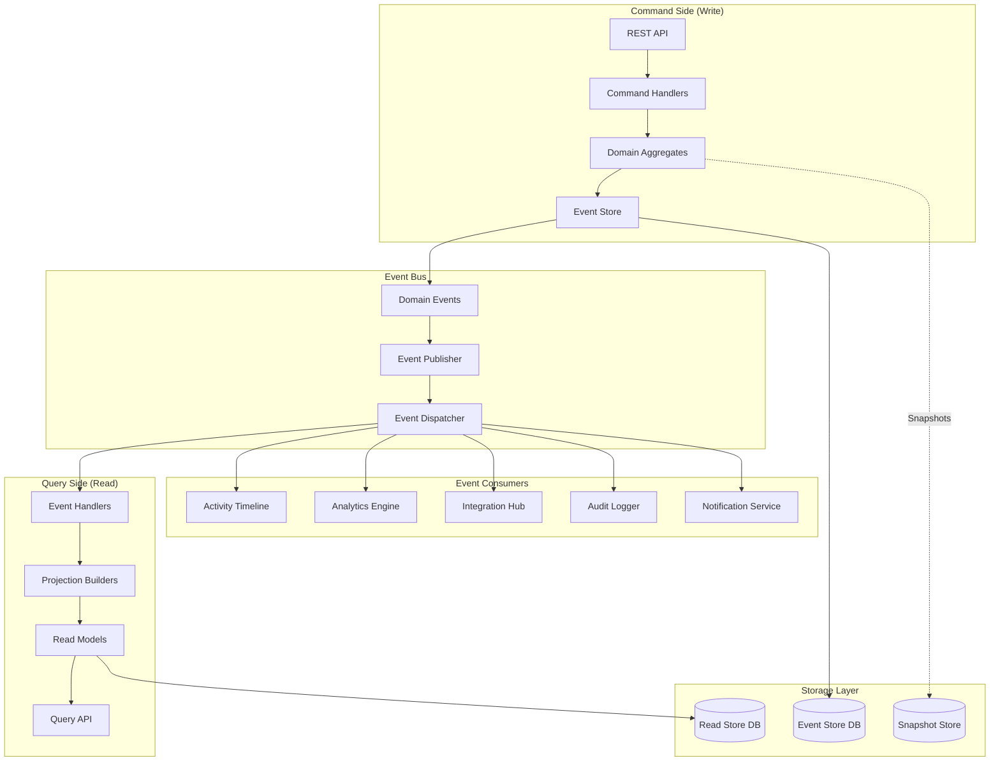

# FC-023: Technisches Konzept - Event Sourcing Infrastructure

**Feature Code:** FC-023  
**Datum:** 2025-07-20  
**Status:** Ready for Review ✅  
**Autor:** Claude  
**Reviewer:** Jörg  
**Geschätzte Dauer:** 3-4 Tage (1.5 Tage in M4 integriert + 2 Tage Erweiterung)  

## 📋 Inhaltsverzeichnis

1. [Zusammenfassung](#zusammenfassung)
2. [Ziel und Geschäftswert](#ziel-und-geschäftswert)
3. [Technische Architektur](#technische-architektur)
4. [Backend-Implementierung](#backend-implementierung)
5. [Frontend-Implementierung](#frontend-implementierung)
6. [Implementierungsstrategie](#implementierungsstrategie)
7. [Entscheidungs-Log](#entscheidungs-log)
8. [Risiken und Mitigationen](#risiken-und-mitigationen)
9. [Zeitschätzung](#zeitschätzung)

## Zusammenfassung

Die Event Sourcing Infrastructure bildet das Rückgrat für vollständige Audit-Trails, Activity Timelines und Event-basierte Integrationen. Statt nur den aktuellen Zustand zu speichern, werden alle Geschäftsereignisse als unveränderliche Events gespeichert. Dies ermöglicht perfekte Nachvollziehbarkeit, Time-Travel-Debugging und Event-getriebene Architekturen. Die Implementation startet bereits in M4 mit Opportunity Events und wird schrittweise auf alle Aggregate ausgeweitet.

## Ziel und Geschäftswert

### Geschäftsziele
- **Vollständige Audit-Trails**: Jede Änderung ist nachvollziehbar für Compliance (DSGVO, GoBD)
- **Activity Timeline**: Chronologische Darstellung aller Kundeninteraktionen
- **Time-Travel Debugging**: Systemzustand zu jedem Zeitpunkt rekonstruierbar
- **Event-Driven Insights**: Basis für Analytics und Magic Moments Detection

### Technische Ziele
- **Eventual Consistency**: Entkopplung durch asynchrone Event-Verarbeitung
- **Read/Write Separation**: Optimierte Read Models für Performance
- **Replay-Fähigkeit**: Events können neu verarbeitet werden
- **Integration Foundation**: Standardisiertes Event-Format für alle Services

## Technische Architektur

### System-Übersicht



### Event Flow

1. **Command Reception**: API receives command (e.g., CreateCustomer)
2. **Business Logic**: Aggregate validates and processes command
3. **Event Generation**: Aggregate produces domain events
4. **Event Storage**: Events persisted to event store
5. **Event Publishing**: Events published to event bus
6. **Projection Update**: Read models updated asynchronously
7. **Consumer Processing**: Various services react to events

### Event Architecture

```java
// Core Event Structure
public abstract class DomainEvent {
    private final UUID eventId = UUID.randomUUID();
    private final UUID aggregateId;
    private final String aggregateType;
    private final Long version;
    private final LocalDateTime occurredAt = LocalDateTime.now();
    private final UUID userId;
    private final Map<String, Object> metadata = new HashMap<>();
    
    // Event-specific data in subclasses
}

// Event Store Structure
public interface EventStore {
    // Write operations
    void append(List<DomainEvent> events);
    void appendWithExpectedVersion(List<DomainEvent> events, Long expectedVersion);
    
    // Read operations
    List<DomainEvent> getEvents(UUID aggregateId);
    List<DomainEvent> getEvents(UUID aggregateId, Long fromVersion);
    EventStream getEventStream(String streamName, Long fromPosition);
    
    // Snapshot operations
    void saveSnapshot(AggregateSnapshot snapshot);
    Optional<AggregateSnapshot> getLatestSnapshot(UUID aggregateId);
}
```

## Backend-Implementierung

### 1. API Endpoints

```java
@Path("/api/events")
@Authenticated
@Produces(MediaType.APPLICATION_JSON)
public class EventResource {
    
    @Inject EventStore eventStore;
    @Inject EventQueryService queryService;
    
    @GET
    @Path("/aggregate/{aggregateId}")
    @RolesAllowed({"admin", "manager"})
    public List<EventDTO> getAggregateEvents(
            @PathParam("aggregateId") UUID aggregateId,
            @QueryParam("from") @DefaultValue("0") Long fromVersion,
            @QueryParam("limit") @DefaultValue("100") int limit) {
        return eventStore.getEvents(aggregateId, fromVersion).stream()
                        .limit(limit)
                        .map(EventDTO::from)
                        .collect(Collectors.toList());
    }
    
    @GET
    @Path("/stream/{streamName}")
    @RolesAllowed({"admin"})
    public Response streamEvents(
            @PathParam("streamName") String streamName,
            @QueryParam("from") @DefaultValue("0") Long fromPosition) {
        // Server-Sent Events for real-time streaming
        return Response.ok()
                      .entity(new EventStreamOutput(eventStore, streamName, fromPosition))
                      .type(MediaType.SERVER_SENT_EVENTS)
                      .build();
    }
    
    @GET
    @Path("/timeline/{entityType}/{entityId}")
    @RolesAllowed({"admin", "manager", "sales"})
    public List<TimelineEventDTO> getTimeline(
            @PathParam("entityType") String entityType,
            @PathParam("entityId") UUID entityId,
            @QueryParam("days") @DefaultValue("30") int days) {
        LocalDateTime since = LocalDateTime.now().minusDays(days);
        return queryService.getTimelineEvents(entityType, entityId, since);
    }
    
    @POST
    @Path("/replay")
    @RolesAllowed("admin")
    public Response replayEvents(@Valid ReplayRequest request) {
        // Trigger event replay for projections
        eventStore.replayEvents(
            request.streamName,
            request.fromPosition,
            request.toPosition,
            request.projectionName
        );
        return Response.accepted().build();
    }
    
    @GET
    @Path("/statistics")
    @RolesAllowed("admin")
    public EventStatisticsDTO getStatistics() {
        return queryService.getEventStatistics();
    }
}
```

### 2. Datenmodell

```java
// Event Store Table
@Entity
@Table(name = "domain_events")
public class StoredEvent extends PanacheEntityBase {
    @Id
    @GeneratedValue
    public UUID eventId;
    
    @Column(nullable = false)
    public UUID aggregateId;
    
    @Column(nullable = false)
    public String aggregateType;
    
    @Column(nullable = false)
    public Long version;
    
    @Column(nullable = false)
    public String eventType;
    
    @Type(type = "jsonb")
    @Column(columnDefinition = "jsonb", nullable = false)
    public Map<String, Object> eventData;
    
    @Type(type = "jsonb")
    @Column(columnDefinition = "jsonb")
    public Map<String, Object> metadata;
    
    @Column(nullable = false)
    public LocalDateTime occurredAt;
    
    @ManyToOne
    public User user;
    
    @Column(nullable = false)
    public Long globalPosition; // For global ordering
    
    @Index
    public LocalDateTime createdAt = LocalDateTime.now();
}

// Aggregate Snapshots for Performance
@Entity
@Table(name = "aggregate_snapshots")
public class AggregateSnapshot extends PanacheEntityBase {
    @Id
    @GeneratedValue
    public UUID snapshotId;
    
    @Column(nullable = false)
    public UUID aggregateId;
    
    @Column(nullable = false)
    public String aggregateType;
    
    @Column(nullable = false)
    public Long version;
    
    @Type(type = "jsonb")
    @Column(columnDefinition = "jsonb", nullable = false)
    public Map<String, Object> data;
    
    public LocalDateTime createdAt = LocalDateTime.now();
}

// Event Subscriptions for Projections
@Entity
@Table(name = "event_subscriptions")
public class EventSubscription extends PanacheEntityBase {
    @Id
    @GeneratedValue
    public UUID subscriptionId;
    
    @Column(nullable = false, unique = true)
    public String subscriptionName;
    
    @Column(nullable = false)
    public String eventTypes; // Comma-separated list
    
    @Column(nullable = false)
    public Long lastProcessedPosition = 0L;
    
    @Enumerated(EnumType.STRING)
    public SubscriptionStatus status = SubscriptionStatus.ACTIVE;
    
    public LocalDateTime lastProcessedAt;
    
    @Type(type = "jsonb")
    @Column(columnDefinition = "jsonb")
    public Map<String, Object> checkpointData;
}

// Read Model Example: Customer Timeline View
@Entity
@Table(name = "customer_timeline_view")
public class CustomerTimelineEntry extends PanacheEntityBase {
    @Id
    @GeneratedValue
    public UUID entryId;
    
    @Column(nullable = false)
    public UUID customerId;
    
    @Column(nullable = false)
    public String eventType;
    
    @Column(nullable = false)
    public String eventCategory; // 'interaction', 'transaction', 'system'
    
    public String title;
    public String description;
    
    @Type(type = "jsonb")
    @Column(columnDefinition = "jsonb")
    public Map<String, Object> details;
    
    @ManyToOne
    public User performedBy;
    
    @Column(nullable = false)
    public LocalDateTime occurredAt;
    
    public String iconType; // For UI display
    public String colorScheme; // For UI display
}
```

### 3. Business Logic

```java
// Event Store Implementation
@ApplicationScoped
@Transactional
public class EventStoreImpl implements EventStore {
    
    @Inject EntityManager em;
    @Inject Event<DomainEvent> eventBus;
    @Inject MeterRegistry metrics;
    
    private final AtomicLong globalPosition = new AtomicLong();
    
    @PostConstruct
    void init() {
        // Initialize global position from database
        Long maxPosition = em.createQuery(
            "SELECT MAX(e.globalPosition) FROM StoredEvent e", Long.class)
            .getSingleResult();
        globalPosition.set(maxPosition != null ? maxPosition : 0);
    }
    
    @Override
    public void append(List<DomainEvent> events) {
        if (events.isEmpty()) return;
        
        // Group by aggregate for version checking
        Map<UUID, List<DomainEvent>> eventsByAggregate = events.stream()
            .collect(Collectors.groupingBy(DomainEvent::getAggregateId));
        
        for (Map.Entry<UUID, List<DomainEvent>> entry : eventsByAggregate.entrySet()) {
            UUID aggregateId = entry.getKey();
            List<DomainEvent> aggregateEvents = entry.getValue();
            
            // Check expected version
            Long currentVersion = getCurrentVersion(aggregateId);
            Long expectedVersion = aggregateEvents.get(0).getVersion() - 1;
            
            if (!currentVersion.equals(expectedVersion)) {
                throw new ConcurrencyException(
                    "Expected version " + expectedVersion + " but was " + currentVersion
                );
            }
            
            // Store events
            for (DomainEvent event : aggregateEvents) {
                StoredEvent stored = new StoredEvent();
                stored.eventId = event.getEventId();
                stored.aggregateId = event.getAggregateId();
                stored.aggregateType = event.getAggregateType();
                stored.version = event.getVersion();
                stored.eventType = event.getClass().getSimpleName();
                stored.eventData = serializeEvent(event);
                stored.metadata = event.getMetadata();
                stored.occurredAt = event.getOccurredAt();
                stored.user = User.findById(event.getUserId());
                stored.globalPosition = globalPosition.incrementAndGet();
                
                em.persist(stored);
                
                // Publish to event bus
                eventBus.fireAsync(event);
                
                // Metrics
                metrics.counter("events.stored",
                    "type", event.getClass().getSimpleName(),
                    "aggregate", event.getAggregateType()
                ).increment();
            }
        }
    }
    
    @Override
    public List<DomainEvent> getEvents(UUID aggregateId) {
        return getEvents(aggregateId, 0L);
    }
    
    @Override
    public List<DomainEvent> getEvents(UUID aggregateId, Long fromVersion) {
        List<StoredEvent> storedEvents = StoredEvent.find(
            "aggregateId = ?1 AND version > ?2 ORDER BY version",
            aggregateId, fromVersion
        ).list();
        
        return storedEvents.stream()
                          .map(this::deserializeEvent)
                          .collect(Collectors.toList());
    }
    
    @Override
    public EventStream getEventStream(String streamName, Long fromPosition) {
        // Create a reactive stream for real-time event consumption
        return new EventStream() {
            @Override
            public Publisher<DomainEvent> getPublisher() {
                return Multi.createFrom().ticks().every(Duration.ofSeconds(1))
                    .onItem().transformToMultiAndConcatenate(tick -> {
                        List<StoredEvent> newEvents = StoredEvent.find(
                            "globalPosition > ?1 ORDER BY globalPosition",
                            fromPosition
                        ).page(0, 100).list();
                        
                        return Multi.createFrom().items(
                            newEvents.stream()
                                    .map(EventStoreImpl.this::deserializeEvent)
                        );
                    });
            }
        };
    }
    
    private Long getCurrentVersion(UUID aggregateId) {
        Long version = em.createQuery(
            "SELECT MAX(e.version) FROM StoredEvent e WHERE e.aggregateId = :id",
            Long.class
        ).setParameter("id", aggregateId)
         .getSingleResult();
        return version != null ? version : 0L;
    }
    
    private Map<String, Object> serializeEvent(DomainEvent event) {
        // Use Jackson or similar to serialize event data
        ObjectMapper mapper = new ObjectMapper();
        mapper.registerModule(new JavaTimeModule());
        return mapper.convertValue(event, new TypeReference<Map<String, Object>>() {});
    }
    
    private DomainEvent deserializeEvent(StoredEvent stored) {
        try {
            Class<?> eventClass = Class.forName(
                "de.freshplan.events." + stored.eventType
            );
            ObjectMapper mapper = new ObjectMapper();
            mapper.registerModule(new JavaTimeModule());
            return (DomainEvent) mapper.convertValue(stored.eventData, eventClass);
        } catch (Exception e) {
            throw new EventDeserializationException(
                "Failed to deserialize event " + stored.eventId, e
            );
        }
    }
}

// Aggregate Base Class with Event Sourcing
public abstract class EventSourcedAggregate {
    
    private final List<DomainEvent> pendingEvents = new ArrayList<>();
    private Long version = 0L;
    protected UUID id;
    
    protected void raiseEvent(DomainEvent event) {
        pendingEvents.add(event);
        apply(event);
        version++;
    }
    
    public List<DomainEvent> getPendingEvents() {
        return new ArrayList<>(pendingEvents);
    }
    
    public void markEventsAsCommitted() {
        pendingEvents.clear();
    }
    
    public void loadFromHistory(List<DomainEvent> events) {
        events.forEach(event -> {
            apply(event);
            version = event.getVersion();
        });
    }
    
    protected abstract void apply(DomainEvent event);
    
    public Long getVersion() {
        return version;
    }
    
    public UUID getId() {
        return id;
    }
}

// Example: Customer Aggregate
public class Customer extends EventSourcedAggregate {
    
    private String name;
    private String email;
    private CustomerType type;
    private BigDecimal creditLimit;
    private boolean active;
    private Map<String, String> metadata = new HashMap<>();
    
    // Constructor for new customers
    public Customer(CreateCustomerCommand command) {
        CustomerCreatedEvent event = new CustomerCreatedEvent(
            command.customerId,
            command.name,
            command.email,
            command.type,
            command.creditLimit,
            command.userId
        );
        raiseEvent(event);
    }
    
    // Constructor for event sourcing
    public Customer(UUID customerId, List<DomainEvent> events) {
        this.id = customerId;
        loadFromHistory(events);
    }
    
    // Business methods
    public void updateCreditLimit(BigDecimal newLimit, String reason, UUID userId) {
        if (newLimit.compareTo(BigDecimal.ZERO) < 0) {
            throw new BusinessException("Credit limit cannot be negative");
        }
        
        CreditLimitChangedEvent event = new CreditLimitChangedEvent(
            id, creditLimit, newLimit, reason, userId
        );
        raiseEvent(event);
    }
    
    public void deactivate(String reason, UUID userId) {
        if (!active) {
            throw new BusinessException("Customer is already inactive");
        }
        
        CustomerDeactivatedEvent event = new CustomerDeactivatedEvent(
            id, reason, userId
        );
        raiseEvent(event);
    }
    
    @Override
    protected void apply(DomainEvent event) {
        switch (event) {
            case CustomerCreatedEvent e -> {
                this.id = e.getCustomerId();
                this.name = e.getName();
                this.email = e.getEmail();
                this.type = e.getType();
                this.creditLimit = e.getCreditLimit();
                this.active = true;
            }
            case CreditLimitChangedEvent e -> {
                this.creditLimit = e.getNewLimit();
            }
            case CustomerDeactivatedEvent e -> {
                this.active = false;
            }
            case CustomerUpdatedEvent e -> {
                if (e.getName() != null) this.name = e.getName();
                if (e.getEmail() != null) this.email = e.getEmail();
                if (e.getType() != null) this.type = e.getType();
                e.getMetadataChanges().forEach((k, v) -> {
                    if (v == null) {
                        this.metadata.remove(k);
                    } else {
                        this.metadata.put(k, v);
                    }
                });
            }
            default -> {
                Log.warn("Unknown event type: " + event.getClass().getSimpleName());
            }
        }
    }
}

// Event Handlers for Projections
@ApplicationScoped
public class CustomerProjectionHandler {
    
    @Inject EntityManager em;
    @Inject CustomerTimelineService timelineService;
    
    void onCustomerCreated(@ObservesAsync CustomerCreatedEvent event) {
        // Update read model
        CustomerReadModel model = new CustomerReadModel();
        model.customerId = event.getCustomerId();
        model.name = event.getName();
        model.email = event.getEmail();
        model.type = event.getType();
        model.creditLimit = event.getCreditLimit();
        model.active = true;
        model.createdAt = event.getOccurredAt();
        model.lastModifiedAt = event.getOccurredAt();
        em.persist(model);
        
        // Update timeline
        timelineService.addEntry(
            event.getCustomerId(),
            "customer_created",
            "Kunde angelegt",
            "Neuer Kunde " + event.getName() + " wurde angelegt",
            event.getUserId(),
            event.getOccurredAt()
        );
    }
    
    void onCreditLimitChanged(@ObservesAsync CreditLimitChangedEvent event) {
        CustomerReadModel model = em.find(CustomerReadModel.class, event.getCustomerId());
        if (model != null) {
            BigDecimal oldLimit = model.creditLimit;
            model.creditLimit = event.getNewLimit();
            model.lastModifiedAt = event.getOccurredAt();
            em.merge(model);
            
            // Timeline entry
            timelineService.addEntry(
                event.getCustomerId(),
                "credit_limit_changed",
                "Kreditlimit geändert",
                String.format("Kreditlimit von %s auf %s geändert. Grund: %s",
                    formatCurrency(oldLimit),
                    formatCurrency(event.getNewLimit()),
                    event.getReason()
                ),
                event.getUserId(),
                event.getOccurredAt()
            );
        }
    }
}

// Event Subscription Manager for Projections
@ApplicationScoped
@Startup
public class ProjectionManager {
    
    @Inject EventStore eventStore;
    @Inject Event<ProjectionRebuildRequest> rebuildBus;
    
    private final Map<String, ProjectionHandler> projections = new ConcurrentHashMap<>();
    private final Map<String, Long> checkpoints = new ConcurrentHashMap<>();
    
    @PostConstruct
    void init() {
        // Register projections
        registerProjection("customer_read_model", new CustomerReadModelProjection());
        registerProjection("customer_timeline", new CustomerTimelineProjection());
        registerProjection("activity_feed", new ActivityFeedProjection());
        
        // Start processing
        startEventProcessing();
    }
    
    public void registerProjection(String name, ProjectionHandler handler) {
        projections.put(name, handler);
        
        // Load checkpoint
        EventSubscription subscription = EventSubscription
            .find("subscriptionName", name)
            .firstResultOptional()
            .orElseGet(() -> {
                EventSubscription newSub = new EventSubscription();
                newSub.subscriptionName = name;
                newSub.eventTypes = String.join(",", handler.getHandledEventTypes());
                newSub.persist();
                return newSub;
            });
        
        checkpoints.put(name, subscription.lastProcessedPosition);
    }
    
    @Scheduled(every = "1s")
    void processEvents() {
        for (Map.Entry<String, ProjectionHandler> entry : projections.entrySet()) {
            String projectionName = entry.getKey();
            ProjectionHandler handler = entry.getValue();
            Long checkpoint = checkpoints.get(projectionName);
            
            // Get new events
            List<StoredEvent> newEvents = StoredEvent.find(
                "globalPosition > ?1 ORDER BY globalPosition",
                checkpoint
            ).page(0, 100).list();
            
            if (!newEvents.isEmpty()) {
                for (StoredEvent storedEvent : newEvents) {
                    try {
                        DomainEvent event = eventStore.deserializeEvent(storedEvent);
                        if (handler.canHandle(event)) {
                            handler.handle(event);
                        }
                        checkpoints.put(projectionName, storedEvent.globalPosition);
                    } catch (Exception e) {
                        Log.error("Error processing event " + storedEvent.eventId, e);
                        // Implement retry logic or dead letter queue
                    }
                }
                
                // Update checkpoint in database
                updateCheckpoint(projectionName, checkpoints.get(projectionName));
            }
        }
    }
    
    public void rebuildProjection(String projectionName, Long fromPosition) {
        ProjectionHandler handler = projections.get(projectionName);
        if (handler == null) {
            throw new IllegalArgumentException("Unknown projection: " + projectionName);
        }
        
        // Clear existing data
        handler.reset();
        
        // Reset checkpoint
        checkpoints.put(projectionName, fromPosition);
        updateCheckpoint(projectionName, fromPosition);
        
        // Processing will start automatically in next cycle
    }
}
```

### 4. Datenbank-Änderungen

```sql
-- V7.0__create_event_sourcing_tables.sql

-- Main Event Store
CREATE TABLE domain_events (
    event_id UUID PRIMARY KEY,
    aggregate_id UUID NOT NULL,
    aggregate_type VARCHAR(100) NOT NULL,
    version BIGINT NOT NULL,
    event_type VARCHAR(255) NOT NULL,
    event_data JSONB NOT NULL,
    metadata JSONB DEFAULT '{}',
    occurred_at TIMESTAMP NOT NULL,
    user_id UUID REFERENCES users(id),
    global_position BIGSERIAL UNIQUE,
    created_at TIMESTAMP NOT NULL DEFAULT CURRENT_TIMESTAMP,
    
    UNIQUE(aggregate_id, version)
);

-- Indexes for efficient querying
CREATE INDEX idx_domain_events_aggregate ON domain_events(aggregate_id, version);
CREATE INDEX idx_domain_events_type ON domain_events(event_type);
CREATE INDEX idx_domain_events_occurred ON domain_events(occurred_at);
CREATE INDEX idx_domain_events_global_position ON domain_events(global_position);
CREATE INDEX idx_domain_events_user ON domain_events(user_id) WHERE user_id IS NOT NULL;

-- Aggregate Snapshots
CREATE TABLE aggregate_snapshots (
    snapshot_id UUID PRIMARY KEY,
    aggregate_id UUID NOT NULL,
    aggregate_type VARCHAR(100) NOT NULL,
    version BIGINT NOT NULL,
    data JSONB NOT NULL,
    created_at TIMESTAMP NOT NULL DEFAULT CURRENT_TIMESTAMP,
    
    UNIQUE(aggregate_id, version)
);

CREATE INDEX idx_snapshots_aggregate ON aggregate_snapshots(aggregate_id, version DESC);

-- Event Subscriptions for Projections
CREATE TABLE event_subscriptions (
    subscription_id UUID PRIMARY KEY DEFAULT gen_random_uuid(),
    subscription_name VARCHAR(255) NOT NULL UNIQUE,
    event_types TEXT NOT NULL, -- Comma-separated
    last_processed_position BIGINT NOT NULL DEFAULT 0,
    status VARCHAR(20) NOT NULL DEFAULT 'ACTIVE',
    last_processed_at TIMESTAMP,
    checkpoint_data JSONB DEFAULT '{}',
    created_at TIMESTAMP NOT NULL DEFAULT CURRENT_TIMESTAMP,
    updated_at TIMESTAMP NOT NULL DEFAULT CURRENT_TIMESTAMP,
    
    CHECK (status IN ('ACTIVE', 'PAUSED', 'FAILED'))
);

-- Customer Timeline View (Projection)
CREATE TABLE customer_timeline_view (
    entry_id UUID PRIMARY KEY DEFAULT gen_random_uuid(),
    customer_id UUID NOT NULL,
    event_type VARCHAR(100) NOT NULL,
    event_category VARCHAR(50) NOT NULL,
    title VARCHAR(255) NOT NULL,
    description TEXT,
    details JSONB DEFAULT '{}',
    performed_by_id UUID REFERENCES users(id),
    occurred_at TIMESTAMP NOT NULL,
    icon_type VARCHAR(50),
    color_scheme VARCHAR(50),
    
    CHECK (event_category IN ('interaction', 'transaction', 'system', 'integration'))
);

CREATE INDEX idx_timeline_customer_date ON customer_timeline_view(customer_id, occurred_at DESC);
CREATE INDEX idx_timeline_category ON customer_timeline_view(event_category);

-- Activity Feed (Global Timeline)
CREATE TABLE activity_feed (
    activity_id UUID PRIMARY KEY DEFAULT gen_random_uuid(),
    entity_type VARCHAR(50) NOT NULL,
    entity_id UUID NOT NULL,
    activity_type VARCHAR(100) NOT NULL,
    title VARCHAR(255) NOT NULL,
    description TEXT,
    metadata JSONB DEFAULT '{}',
    user_id UUID REFERENCES users(id),
    team_id UUID,
    visibility VARCHAR(20) NOT NULL DEFAULT 'team',
    occurred_at TIMESTAMP NOT NULL,
    
    CHECK (entity_type IN ('customer', 'opportunity', 'user', 'system')),
    CHECK (visibility IN ('private', 'team', 'company'))
);

CREATE INDEX idx_activity_feed_entity ON activity_feed(entity_type, entity_id, occurred_at DESC);
CREATE INDEX idx_activity_feed_user ON activity_feed(user_id, occurred_at DESC);
CREATE INDEX idx_activity_feed_team ON activity_feed(team_id, occurred_at DESC);

-- Event Stats for Monitoring
CREATE TABLE event_statistics (
    stat_date DATE NOT NULL,
    event_type VARCHAR(255) NOT NULL,
    count BIGINT NOT NULL DEFAULT 0,
    avg_processing_time_ms INTEGER,
    error_count INTEGER DEFAULT 0,
    PRIMARY KEY (stat_date, event_type)
);

-- Functions for Event Processing
CREATE OR REPLACE FUNCTION get_aggregate_version(p_aggregate_id UUID)
RETURNS BIGINT AS $$
BEGIN
    RETURN COALESCE(
        (SELECT MAX(version) FROM domain_events WHERE aggregate_id = p_aggregate_id),
        0
    );
END;
$$ LANGUAGE plpgsql;

-- Trigger for updating subscription timestamps
CREATE OR REPLACE FUNCTION update_subscription_timestamp()
RETURNS TRIGGER AS $$
BEGIN
    NEW.updated_at = CURRENT_TIMESTAMP;
    RETURN NEW;
END;
$$ LANGUAGE plpgsql;

CREATE TRIGGER update_subscription_updated_at
    BEFORE UPDATE ON event_subscriptions
    FOR EACH ROW EXECUTE FUNCTION update_subscription_timestamp();
```

## Frontend-Implementierung

### 1. Komponenten-Struktur

```typescript
// features/event-sourcing/
├── components/
│   ├── ActivityTimeline.tsx         // Timeline visualization
│   ├── EventDetails.tsx             // Event detail view
│   ├── EventStreamMonitor.tsx       // Real-time event monitor
│   └── AuditTrail.tsx              // Audit log viewer
├── hooks/
│   ├── useEventStream.ts           // SSE subscription
│   ├── useTimeline.ts              // Timeline data
│   └── useAuditLog.ts              // Audit queries
├── services/
│   └── eventApi.ts                 // API client
└── types/
    └── events.types.ts             // Event type definitions
```

### 2. State Management

```typescript
// hooks/useEventStream.ts
import { useEffect, useRef, useState } from 'react';
import { EventSourcePolyfill } from 'event-source-polyfill';
import { DomainEvent } from '../types';

interface UseEventStreamOptions {
  streamName: string;
  fromPosition?: number;
  eventTypes?: string[];
  onEvent?: (event: DomainEvent) => void;
}

export const useEventStream = ({
  streamName,
  fromPosition = 0,
  eventTypes = [],
  onEvent,
}: UseEventStreamOptions) => {
  const [events, setEvents] = useState<DomainEvent[]>([]);
  const [isConnected, setIsConnected] = useState(false);
  const [error, setError] = useState<Error | null>(null);
  const eventSourceRef = useRef<EventSource | null>(null);

  useEffect(() => {
    const token = localStorage.getItem('auth_token');
    const url = `/api/events/stream/${streamName}?from=${fromPosition}`;
    
    const eventSource = new EventSourcePolyfill(url, {
      headers: {
        'Authorization': `Bearer ${token}`,
      },
    });

    eventSourceRef.current = eventSource;

    eventSource.onopen = () => {
      setIsConnected(true);
      setError(null);
    };

    eventSource.onmessage = (event) => {
      try {
        const domainEvent = JSON.parse(event.data) as DomainEvent;
        
        // Filter by event types if specified
        if (eventTypes.length === 0 || eventTypes.includes(domainEvent.eventType)) {
          setEvents(prev => [...prev, domainEvent]);
          onEvent?.(domainEvent);
        }
      } catch (err) {
        console.error('Failed to parse event:', err);
      }
    };

    eventSource.onerror = (err) => {
      setIsConnected(false);
      setError(new Error('Event stream connection failed'));
      
      // Reconnect after 5 seconds
      setTimeout(() => {
        if (eventSourceRef.current?.readyState === EventSource.CLOSED) {
          eventSource.close();
          // Recursively reconnect
        }
      }, 5000);
    };

    return () => {
      eventSource.close();
      eventSourceRef.current = null;
    };
  }, [streamName, fromPosition, eventTypes.join(',')]);

  return {
    events,
    isConnected,
    error,
    clearEvents: () => setEvents([]),
  };
};

// hooks/useTimeline.ts
import useSWR from 'swr';
import { apiClient } from '@/services/api';
import { TimelineEvent } from '../types';

interface UseTimelineOptions {
  entityType: string;
  entityId: string;
  days?: number;
}

export const useTimeline = ({ entityType, entityId, days = 30 }: UseTimelineOptions) => {
  const { data, error, mutate } = useSWR<TimelineEvent[]>(
    `/api/events/timeline/${entityType}/${entityId}?days=${days}`,
    apiClient.get,
    {
      refreshInterval: 10000, // Refresh every 10 seconds
    }
  );

  // Subscribe to real-time updates
  useEventStream({
    streamName: `${entityType}-${entityId}`,
    onEvent: (event) => {
      // Optimistically update timeline
      mutate(current => {
        if (!current) return [mapToTimelineEvent(event)];
        return [mapToTimelineEvent(event), ...current];
      }, false);
    },
  });

  return {
    timeline: data || [],
    isLoading: !error && !data,
    isError: error,
    refresh: mutate,
  };
};

function mapToTimelineEvent(event: DomainEvent): TimelineEvent {
  return {
    id: event.eventId,
    type: event.eventType,
    title: getEventTitle(event),
    description: getEventDescription(event),
    occurredAt: event.occurredAt,
    userId: event.userId,
    metadata: event.metadata,
  };
}
```

### 3. UI/UX Design

```typescript
// components/ActivityTimeline.tsx
import React, { useMemo } from 'react';
import {
  Timeline,
  TimelineItem,
  TimelineSeparator,
  TimelineConnector,
  TimelineContent,
  TimelineDot,
  TimelineOppositeContent,
} from '@mui/lab';
import {
  Card, CardContent, Typography, Chip, Box, Avatar,
  Skeleton, Alert, IconButton, Tooltip
} from '@mui/material';
import {
  PersonAdd, AttachMoney, Phone, Email, Note,
  TrendingUp, TrendingDown, CheckCircle, Cancel,
  Refresh as RefreshIcon
} from '@mui/icons-material';
import { formatDistanceToNow } from 'date-fns';
import { de } from 'date-fns/locale';
import { useTimeline } from '../hooks/useTimeline';
import { TimelineEvent } from '../types';

interface Props {
  entityType: 'customer' | 'opportunity';
  entityId: string;
}

export const ActivityTimeline: React.FC<Props> = ({ entityType, entityId }) => {
  const { timeline, isLoading, isError, refresh } = useTimeline({
    entityType,
    entityId,
    days: 90,
  });

  const groupedEvents = useMemo(() => {
    const groups = new Map<string, TimelineEvent[]>();
    
    timeline.forEach(event => {
      const date = new Date(event.occurredAt).toLocaleDateString('de-DE');
      if (!groups.has(date)) {
        groups.set(date, []);
      }
      groups.get(date)!.push(event);
    });
    
    return Array.from(groups.entries()).map(([date, events]) => ({
      date,
      events: events.sort((a, b) => 
        new Date(b.occurredAt).getTime() - new Date(a.occurredAt).getTime()
      ),
    }));
  }, [timeline]);

  if (isLoading) {
    return (
      <Box>
        {[1, 2, 3].map(i => (
          <Skeleton key={i} variant="rectangular" height={100} sx={{ mb: 2 }} />
        ))}
      </Box>
    );
  }

  if (isError) {
    return (
      <Alert severity="error">
        Fehler beim Laden der Timeline
      </Alert>
    );
  }

  return (
    <Box>
      <Box sx={{ display: 'flex', justifyContent: 'space-between', mb: 2 }}>
        <Typography variant="h6">Aktivitäten</Typography>
        <Tooltip title="Aktualisieren">
          <IconButton size="small" onClick={() => refresh()}>
            <RefreshIcon />
          </IconButton>
        </Tooltip>
      </Box>

      {groupedEvents.length === 0 ? (
        <Typography color="text.secondary">
          Noch keine Aktivitäten vorhanden
        </Typography>
      ) : (
        <Timeline position="right">
          {groupedEvents.map(({ date, events }) => (
            <React.Fragment key={date}>
              <TimelineItem>
                <TimelineOppositeContent sx={{ display: 'none' }} />
                <TimelineSeparator>
                  <TimelineDot variant="outlined" />
                  <TimelineConnector />
                </TimelineSeparator>
                <TimelineContent>
                  <Typography variant="subtitle2" color="text.secondary">
                    {date}
                  </Typography>
                </TimelineContent>
              </TimelineItem>
              
              {events.map((event, index) => (
                <TimelineItem key={event.id}>
                  <TimelineOppositeContent
                    sx={{ m: 'auto 0', flex: 0.2 }}
                    align="right"
                    variant="body2"
                    color="text.secondary"
                  >
                    {formatDistanceToNow(new Date(event.occurredAt), {
                      addSuffix: true,
                      locale: de,
                    })}
                  </TimelineOppositeContent>
                  
                  <TimelineSeparator>
                    <TimelineConnector />
                    <TimelineDot color={getEventColor(event.type)}>
                      {getEventIcon(event.type)}
                    </TimelineDot>
                    <TimelineConnector />
                  </TimelineSeparator>
                  
                  <TimelineContent sx={{ py: '12px', px: 2 }}>
                    <Card variant="outlined">
                      <CardContent>
                        <Box sx={{ display: 'flex', alignItems: 'center', mb: 1 }}>
                          <Typography variant="subtitle1" component="span">
                            {event.title}
                          </Typography>
                          {event.category && (
                            <Chip
                              label={event.category}
                              size="small"
                              sx={{ ml: 1 }}
                              color={getCategoryColor(event.category)}
                            />
                          )}
                        </Box>
                        
                        {event.description && (
                          <Typography variant="body2" color="text.secondary">
                            {event.description}
                          </Typography>
                        )}
                        
                        {event.user && (
                          <Box sx={{ display: 'flex', alignItems: 'center', mt: 1 }}>
                            <Avatar
                              sx={{ width: 24, height: 24, mr: 1 }}
                              src={event.user.avatar}
                            >
                              {event.user.name[0]}
                            </Avatar>
                            <Typography variant="caption" color="text.secondary">
                              {event.user.name}
                            </Typography>
                          </Box>
                        )}
                        
                        {event.metadata && Object.keys(event.metadata).length > 0 && (
                          <EventMetadata metadata={event.metadata} />
                        )}
                      </CardContent>
                    </Card>
                  </TimelineContent>
                </TimelineItem>
              ))}
            </React.Fragment>
          ))}
        </Timeline>
      )}
    </Box>
  );
};

const getEventIcon = (eventType: string) => {
  const iconMap: Record<string, React.ReactNode> = {
    customer_created: <PersonAdd />,
    opportunity_created: <AttachMoney />,
    opportunity_won: <CheckCircle />,
    opportunity_lost: <Cancel />,
    call_logged: <Phone />,
    email_sent: <Email />,
    note_added: <Note />,
    stage_advanced: <TrendingUp />,
    stage_regressed: <TrendingDown />,
  };
  
  return iconMap[eventType] || <Note />;
};

const getEventColor = (eventType: string): any => {
  if (eventType.includes('won')) return 'success';
  if (eventType.includes('lost')) return 'error';
  if (eventType.includes('created')) return 'primary';
  if (eventType.includes('updated')) return 'info';
  return 'grey';
};

const getCategoryColor = (category: string): any => {
  const colorMap: Record<string, any> = {
    interaction: 'primary',
    transaction: 'success',
    system: 'default',
    integration: 'info',
  };
  return colorMap[category] || 'default';
};

// components/EventStreamMonitor.tsx
import React, { useState } from 'react';
import {
  Box, Paper, Typography, FormControl, InputLabel,
  Select, MenuItem, Chip, Stack, IconButton, Badge,
  List, ListItem, ListItemText, ListItemIcon,
  Drawer, Fab, Switch, FormControlLabel
} from '@mui/material';
import {
  Stream as StreamIcon,
  Circle as CircleIcon,
  FilterList as FilterIcon,
  Clear as ClearIcon,
  Close as CloseIcon
} from '@mui/icons-material';
import { useEventStream } from '../hooks/useEventStream';

export const EventStreamMonitor: React.FC = () => {
  const [isOpen, setIsOpen] = useState(false);
  const [streamName, setStreamName] = useState('all');
  const [eventFilter, setEventFilter] = useState<string[]>([]);
  const [autoScroll, setAutoScroll] = useState(true);
  
  const { events, isConnected, clearEvents } = useEventStream({
    streamName,
    eventTypes: eventFilter,
  });

  const listRef = React.useRef<HTMLDivElement>(null);

  React.useEffect(() => {
    if (autoScroll && listRef.current) {
      listRef.current.scrollTop = listRef.current.scrollHeight;
    }
  }, [events, autoScroll]);

  return (
    <>
      <Fab
        color="primary"
        size="small"
        sx={{ position: 'fixed', bottom: 16, right: 16 }}
        onClick={() => setIsOpen(true)}
      >
        <Badge badgeContent={events.length} color="error">
          <StreamIcon />
        </Badge>
      </Fab>

      <Drawer
        anchor="right"
        open={isOpen}
        onClose={() => setIsOpen(false)}
        PaperProps={{ sx: { width: 400 } }}
      >
        <Box sx={{ p: 2 }}>
          <Box sx={{ display: 'flex', justifyContent: 'space-between', mb: 2 }}>
            <Typography variant="h6">Event Stream Monitor</Typography>
            <IconButton size="small" onClick={() => setIsOpen(false)}>
              <CloseIcon />
            </IconButton>
          </Box>

          <Stack spacing={2}>
            <Box sx={{ display: 'flex', alignItems: 'center', gap: 1 }}>
              <CircleIcon
                sx={{
                  fontSize: 12,
                  color: isConnected ? 'success.main' : 'error.main',
                }}
              />
              <Typography variant="body2">
                {isConnected ? 'Connected' : 'Disconnected'}
              </Typography>
            </Box>

            <FormControl size="small" fullWidth>
              <InputLabel>Stream</InputLabel>
              <Select
                value={streamName}
                onChange={(e) => setStreamName(e.target.value)}
                label="Stream"
              >
                <MenuItem value="all">All Events</MenuItem>
                <MenuItem value="customers">Customer Events</MenuItem>
                <MenuItem value="opportunities">Opportunity Events</MenuItem>
                <MenuItem value="system">System Events</MenuItem>
              </Select>
            </FormControl>

            <FormControlLabel
              control={
                <Switch
                  checked={autoScroll}
                  onChange={(e) => setAutoScroll(e.target.checked)}
                />
              }
              label="Auto-scroll"
            />

            <Box sx={{ display: 'flex', justifyContent: 'space-between' }}>
              <Typography variant="body2">
                {events.length} Events
              </Typography>
              <IconButton size="small" onClick={clearEvents}>
                <ClearIcon />
              </IconButton>
            </Box>
          </Stack>

          <List
            ref={listRef}
            sx={{
              mt: 2,
              maxHeight: 'calc(100vh - 300px)',
              overflow: 'auto',
              bgcolor: 'background.paper',
              border: 1,
              borderColor: 'divider',
              borderRadius: 1,
            }}
          >
            {events.map((event, index) => (
              <ListItem key={event.eventId} divider>
                <ListItemIcon>
                  {getEventIcon(event.eventType)}
                </ListItemIcon>
                <ListItemText
                  primary={event.eventType}
                  secondary={
                    <>
                      {new Date(event.occurredAt).toLocaleTimeString('de-DE')}
                      {' • '}
                      {event.aggregateType}
                    </>
                  }
                />
              </ListItem>
            ))}
          </List>
        </Box>
      </Drawer>
    </>
  );
};
```

### 4. Integration

```typescript
// types/events.types.ts
export interface DomainEvent {
  eventId: string;
  aggregateId: string;
  aggregateType: string;
  version: number;
  eventType: string;
  eventData: Record<string, any>;
  metadata: Record<string, any>;
  occurredAt: string;
  userId?: string;
}

export interface TimelineEvent {
  id: string;
  type: string;
  category: 'interaction' | 'transaction' | 'system' | 'integration';
  title: string;
  description?: string;
  occurredAt: string;
  user?: {
    id: string;
    name: string;
    avatar?: string;
  };
  metadata?: Record<string, any>;
}

export interface EventStatistics {
  totalEvents: number;
  eventsToday: number;
  eventsThisWeek: number;
  eventsByType: Record<string, number>;
  topUsers: Array<{
    userId: string;
    userName: string;
    eventCount: number;
  }>;
}

// Domain Event Types
export interface CustomerCreatedEvent extends DomainEvent {
  eventType: 'CustomerCreatedEvent';
  eventData: {
    customerId: string;
    name: string;
    email: string;
    type: 'B2B' | 'B2C' | 'B2G';
    creditLimit: number;
  };
}

export interface OpportunityStageChangedEvent extends DomainEvent {
  eventType: 'OpportunityStageChangedEvent';
  eventData: {
    opportunityId: string;
    customerId: string;
    fromStage: string;
    toStage: string;
    value: number;
    probability: number;
  };
}

// Event Handlers
export const eventHandlers: Record<string, (event: DomainEvent) => TimelineEvent> = {
  CustomerCreatedEvent: (event: CustomerCreatedEvent) => ({
    id: event.eventId,
    type: event.eventType,
    category: 'transaction',
    title: 'Neuer Kunde angelegt',
    description: `${event.eventData.name} wurde als ${event.eventData.type}-Kunde angelegt`,
    occurredAt: event.occurredAt,
    userId: event.userId,
    metadata: {
      email: event.eventData.email,
      creditLimit: event.eventData.creditLimit,
    },
  }),
  
  OpportunityStageChangedEvent: (event: OpportunityStageChangedEvent) => ({
    id: event.eventId,
    type: event.eventType,
    category: 'transaction',
    title: 'Opportunity Status geändert',
    description: `Von ${event.eventData.fromStage} zu ${event.eventData.toStage}`,
    occurredAt: event.occurredAt,
    userId: event.userId,
    metadata: {
      value: event.eventData.value,
      probability: event.eventData.probability,
    },
  }),
};

// services/eventApi.ts
import { apiClient } from '@/services/api';
import { DomainEvent, TimelineEvent, EventStatistics } from '../types';

export const eventApi = {
  // Get events for an aggregate
  getAggregateEvents: (aggregateId: string, fromVersion = 0) =>
    apiClient.get<DomainEvent[]>(
      `/api/events/aggregate/${aggregateId}?from=${fromVersion}`
    ),

  // Get timeline for an entity
  getTimeline: (entityType: string, entityId: string, days = 30) =>
    apiClient.get<TimelineEvent[]>(
      `/api/events/timeline/${entityType}/${entityId}?days=${days}`
    ),

  // Get event statistics
  getStatistics: () =>
    apiClient.get<EventStatistics>('/api/events/statistics'),

  // Replay events for a projection
  replayProjection: (projectionName: string, fromPosition = 0) =>
    apiClient.post('/api/events/replay', {
      projectionName,
      fromPosition,
    }),
};
```

## Implementierungsstrategie

### Phase 1: Core Infrastructure in M4 (1.5 Tage)

#### Sprint 1.1: Event Store Basics (0.5 Tage)
1. **Tag 1 Vormittag**:
   - Database Schema für Events
   - DomainEvent Base Classes
   - EventStore Service Interface

2. **Tag 1 Nachmittag**:
   - Opportunity Aggregate mit Events
   - Event Persistence
   - Basic Event Bus (CDI)

#### Sprint 1.2: First Projections (1 Tag)
1. **Tag 2**:
   - OpportunityReadModel Projection
   - Timeline Projection für Activities
   - Integration in M4 Pipeline UI

### Phase 2: Extended Features (2 Tage)

#### Sprint 2.1: Advanced Event Processing (1 Tag)
1. **Tag 3**:
   - Subscription Management
   - Projection Rebuild Capability
   - Event Stream API (SSE)

#### Sprint 2.2: UI Components (1 Tag)
1. **Tag 4**:
   - Activity Timeline Component
   - Event Stream Monitor
   - Audit Trail Viewer
   - Integration Tests

## Entscheidungs-Log

### 2025-07-20 - Event Store: Embedded vs. Dedicated
**Entscheidung**: Embedded in PostgreSQL mit JSONB  
**Begründung**: 
- Keine zusätzliche Infrastruktur nötig
- JSONB bietet flexible Schema-Evolution
- Transactional Consistency mit Business Data
- Ausreichend für MVP und mittlere Lasten
**Impact**: Einfachere Operations, mögliche Migration später  
**Alternativen**: EventStore DB (Overkill), Kafka (zu komplex für Start)  
**Entscheider**: Claude/Jörg

### 2025-07-20 - Event Serialization Format
**Entscheidung**: JSON mit Schema Registry Light  
**Begründung**: 
- Einfach zu debuggen und verstehen
- Gute Tool-Unterstützung
- Schema Evolution durch Versionierung
- Jackson für Java/TypeScript Kompatibilität
**Impact**: Etwas größerer Storage, aber bessere Developer Experience  
**Alternativen**: Protobuf (zu komplex), Avro (Overhead)  
**Entscheider**: TBD

### 2025-07-20 - Snapshot Strategy
**Entscheidung**: Automatisch alle 100 Events  
**Begründung**: 
- Balance zwischen Performance und Storage
- Schnelles Aggregate Loading
- Configurable per Aggregate Type
**Impact**: Zusätzlicher Storage, aber bessere Read Performance  
**Alternativen**: No Snapshots (langsam), Time-based (unvorhersehbar)  
**Entscheider**: TBD

## Risiken und Mitigationen

### Risiko 1: Event Schema Evolution
**Wahrscheinlichkeit**: Hoch  
**Impact**: Mittel  
**Mitigation**: 
- Versionierte Event Types
- Upcasting für alte Events
- Niemals Events ändern, nur neue Versionen
- Schema Registry für Validierung

### Risiko 2: Performance bei vielen Events
**Wahrscheinlichkeit**: Mittel  
**Impact**: Hoch  
**Mitigation**: 
- Snapshot Strategy implementiert
- Partitionierung nach Datum
- Archivierung alter Events
- Read Models für Queries

### Risiko 3: Eventual Consistency Confusion
**Wahrscheinlichkeit**: Mittel  
**Impact**: Mittel  
**Mitigation**: 
- Klare UI-Indikatoren für Processing
- Optimistic Updates im Frontend
- Sync-Points für kritische Operations
- Training für Entwickler

### Risiko 4: Event Ordering
**Wahrscheinlichkeit**: Niedrig  
**Impact**: Hoch  
**Mitigation**: 
- Global Position Counter
- Aggregate Version Check
- Idempotente Event Handler
- Conflict Resolution Strategy

## Zeitschätzung

**Gesamt-Aufwand**: 3-4 Tage

- **Backend (M4 Integration)**: 1.5 Tage
  - Event Store Core: 0.5 Tage
  - Opportunity Events: 0.5 Tage
  - First Projections: 0.5 Tage

- **Backend (Erweiterung)**: 1 Tag
  - Advanced Features: 0.5 Tage
  - Stream API: 0.3 Tage
  - Testing: 0.2 Tage

- **Frontend**: 1 Tag
  - Timeline Component: 0.4 Tage
  - Event Monitor: 0.3 Tage
  - Integration: 0.3 Tage

- **Dokumentation**: 0.5 Tage
  - Event Catalog
  - Integration Guide
  - Best Practices

**Puffer**: +0.5 Tage für unvorhergesehene Probleme

---

## 🚀 Next Steps

1. **Database Migration** für Event Tables ausführen
2. **Domain Event Classes** in M4 integrieren
3. **EventStore Service** implementieren
4. **Opportunity Aggregate** auf Event Sourcing umstellen
5. **Timeline Projection** aufbauen

## 🔗 Verwandte Dokumente

### 📚 Claude-Optimierte Navigation (Absolute Pfade)

#### Core Infrastructure:
- **[📊 Master Plan V5](/docs/CRM_COMPLETE_MASTER_PLAN_V5.md)** - Zentrale Roadmap mit allen Features
- **[🗺️ Feature Overview](/docs/features/MASTER/FEATURE_OVERVIEW.md)** - Übersicht aller 40 Features
- **[📋 FC-023 KOMPAKT](/docs/features/PLANNED/23_event_sourcing/FC-023_KOMPAKT.md)** - 15-Min Übersicht zu diesem Feature

#### Implementation Guides:
- **[FC-023 Implementation Guide](/docs/features/PLANNED/23_event_sourcing/FC-023_IMPLEMENTATION_GUIDE.md)** *(geplant)* - Copy-Paste Code Templates
- **[Event Catalog](/docs/features/PLANNED/23_event_sourcing/EVENT_CATALOG.md)** *(geplant)* - Alle Domain Events dokumentiert
- **[Event Sourcing Patterns](/docs/features/PLANNED/23_event_sourcing/EVENT_SOURCING_PATTERNS.md)** *(geplant)* - Best Practices

#### Direkte Integration (Phase 1):
- **[📊 M4 Opportunity Pipeline](/docs/features/ACTIVE/02_opportunity_pipeline/M4_KOMPAKT.md)** - Erste Event Implementation (1.5 Tage)
- **[📊 M4 Tech Concept](/docs/features/ACTIVE/02_opportunity_pipeline/M4_TECH_CONCEPT.md)** - Opportunity Events Details
- **[💳 FC-011 Bonitätsprüfung](/docs/features/ACTIVE/02_opportunity_pipeline/integrations/FC-011_KOMPAKT.md)** - Credit Check Events

#### Event Produzenten (Alle 40 Features):

**Security & Core (4 Features):**
- **[🔒 FC-008 Security Foundation](/docs/features/ACTIVE/01_security_foundation/FC-008_KOMPAKT.md)** - User Events
- **[🔐 FC-009 Permissions System](/docs/features/ACTIVE/04_permissions_system/FC-009_KOMPAKT.md)** - Permission Events
- **[⚙️ FC-010 Customer Import](/docs/features/PLANNED/11_customer_import/FC-010_KOMPAKT.md)** - Import Events
- **[🔒 FC-025 DSGVO Compliance](/docs/features/PLANNED/25_dsgvo_compliance/FC-025_KOMPAKT.md)** - Audit Events

**Customer & Communication (8 Features):**
- **[👥 M5 Customer Refactor](/docs/features/PLANNED/12_customer_refactor_m5/M5_KOMPAKT.md)** - Customer Domain Events
- **[📧 FC-003 E-Mail Integration](/docs/features/PLANNED/06_email_integration/FC-003_KOMPAKT.md)** - Email Events
- **[💬 FC-012 Team Communication](/docs/features/PLANNED/14_team_communication/FC-012_KOMPAKT.md)** - Chat Events
- **[📲 FC-028 WhatsApp Integration](/docs/features/PLANNED/28_whatsapp_integration/FC-028_KOMPAKT.md)** - Message Events
- **[🔍 FC-013 Duplicate Detection](/docs/features/PLANNED/15_duplicate_detection/FC-013_KOMPAKT.md)** - Merge Events
- **[📅 FC-014 Activity Timeline](/docs/features/PLANNED/16_activity_timeline/FC-014_KOMPAKT.md)** - Activity Events
- **[🎯 FC-027 Magic Moments](/docs/features/PLANNED/27_magic_moments/FC-027_KOMPAKT.md)** - Pattern Events
- **[🎙️ FC-029 Voice-First](/docs/features/PLANNED/29_voice_first/FC-029_KOMPAKT.md)** - Voice Command Events

**Sales & Pipeline (6 Features):**
- **[🔄 FC-016 Opportunity Cloning](/docs/features/PLANNED/18_opportunity_cloning/FC-016_KOMPAKT.md)** - Clone Events
- **[📊 FC-015 Deal Loss Analysis](/docs/features/PLANNED/17_deal_loss_analysis/FC-015_KOMPAKT.md)** - Loss Events
- **[📈 FC-019 Advanced Metrics](/docs/features/PLANNED/19_advanced_metrics/FC-019_KOMPAKT.md)** - Metric Events
- **[🎮 FC-017 Sales Gamification](/docs/features/PLANNED/99_sales_gamification/FC-017_KOMPAKT.md)** - Achievement Events
- **[🏪 FC-004 Verkäuferschutz](/docs/features/PLANNED/07_verkaeuferschutz/FC-004_KOMPAKT.md)** - Protection Events
- **[📊 M6 Analytics Module](/docs/features/PLANNED/13_analytics_m6/M6_KOMPAKT.md)** - Report Events

**Integration & External (5 Features):**
- **[🔌 FC-021 Integration Hub](/docs/features/PLANNED/21_integration_hub/FC-021_KOMPAKT.md)** - Sync Events
- **[💰 FC-005 Xentral Integration](/docs/features/PLANNED/08_xentral_integration/FC-005_KOMPAKT.md)** - Order Events
- **[📊 FC-026 Analytics Platform](/docs/features/PLANNED/26_analytics_platform/FC-026_KOMPAKT.md)** - Analytics Events
- **[📁 FC-024 File Management](/docs/features/PLANNED/24_file_management/FC-024_KOMPAKT.md)** - File Events
- **[💡 FC-031 Smart Templates](/docs/features/PLANNED/31_smart_templates/FC-031_KOMPAKT.md)** - Template Events

**Mobile & UI (8 Features):**
- **[📱 FC-006 Mobile App Native](/docs/features/PLANNED/09_mobile_app/FC-006_KOMPAKT.md)** - Mobile Events
- **[📱 FC-018 Mobile PWA](/docs/features/PLANNED/18_mobile_pwa/FC-018_KOMPAKT.md)** - PWA Events
- **[📱 FC-022 Mobile Light](/docs/features/PLANNED/22_mobile_light/FC-022_KOMPAKT.md)** - Light Events
- **[📴 FC-032 Offline-First](/docs/features/PLANNED/32_offline_first/FC-032_KOMPAKT.md)** - Sync Events
- **[⚡ FC-020 Quick Wins](/docs/features/PLANNED/20_quick_wins/FC-020_KOMPAKT.md)** - Command Events
- **[👆 FC-030 One-Tap Actions](/docs/features/PLANNED/30_one_tap_actions/FC-030_KOMPAKT.md)** - Action Events
- **[📊 FC-007 Chef-Dashboard](/docs/features/PLANNED/10_chef_dashboard/FC-007_KOMPAKT.md)** - Dashboard Events
- **[🎨 M1-M7 UI Foundation](/docs/features/ACTIVE/05_ui_foundation/M3_SALES_COCKPIT_KOMPAKT.md)** - UI Events

**Backend Services (9 Features):**
- **[🧮 M8 Calculator Modal](/docs/features/ACTIVE/03_calculator_modal/M8_KOMPAKT.md)** - Calculation Events
- **[📄 PDF Generator](/docs/features/LEGACY/pdf_generator/PDF_GENERATOR_KOMPAKT.md)** - Document Events
- **[🔄 Event Sourcing](/docs/features/PLANNED/23_event_sourcing/FC-023_KOMPAKT.md)** - Meta Events (Self)
- Weitere Backend Features...

#### Event Consumers (Primary):
- **[📈 FC-014 Activity Timeline](/docs/features/PLANNED/16_activity_timeline/FC-014_KOMPAKT.md)** - Hauptkonsument aller Events
- **[🔒 FC-025 DSGVO Compliance](/docs/features/PLANNED/25_dsgvo_compliance/FC-025_KOMPAKT.md)** - Audit Trail aus Events
- **[📊 FC-026 Analytics Platform](/docs/features/PLANNED/26_analytics_platform/FC-026_KOMPAKT.md)** - Event Analytics
- **[🎯 FC-027 Magic Moments](/docs/features/PLANNED/27_magic_moments/FC-027_KOMPAKT.md)** - Pattern Detection
- **[📊 M6 Analytics Module](/docs/features/PLANNED/13_analytics_m6/M6_KOMPAKT.md)** - Business Reports

#### Technical Foundation:
- **[Backend Architecture](/docs/technical/BACKEND_START_GUIDE.md)** - Quarkus Setup
- **[API Contract](/docs/technical/API_CONTRACT.md)** - REST Standards
- **[Development Setup](/docs/team/DEVELOPMENT_SETUP.md)** - Local Environment

---

## 📊 Implementation Progress Tracking

### Event Implementation Status:
| Module | Events Defined | Events Implemented | Status |
|--------|----------------|-------------------|---------|
| M4 Opportunity | ✅ 5 Events | ⏳ In Progress | 1.5 Tage |
| M5 Customer | ✅ 8 Events | ❌ Pending | Waiting |
| FC-003 Email | ✅ 4 Events | ❌ Pending | Waiting |
| FC-012 Team | ✅ 6 Events | ❌ Pending | Waiting |
| FC-021 Integration | ✅ 10 Events | ❌ Pending | Waiting |

### Projection Status:
| Projection | Purpose | Status | Priority |
|------------|---------|---------|----------|
| CustomerTimelineView | Activity Feed | ⏳ Phase 1 | HIGH |
| OpportunityReadModel | Kanban Board | ⏳ Phase 1 | HIGH |
| AuditLogView | Compliance | 📅 Phase 2 | MEDIUM |
| AnalyticsAggregates | Metrics | 📅 Phase 3 | LOW |

---

**Status-Updates**:
- 2025-07-20 16:45: Konzept erstellt und finalisiert - Claude
- 2025-07-20 16:50: Claude-optimierte Navigation mit allen 40 Features ergänzt - Claude
- Status: Ready for Review ✅