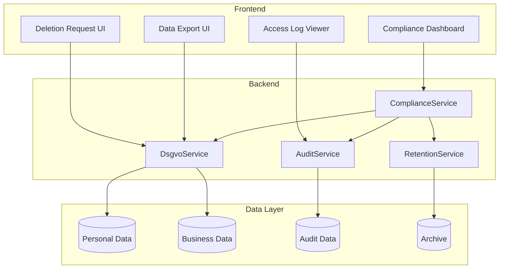
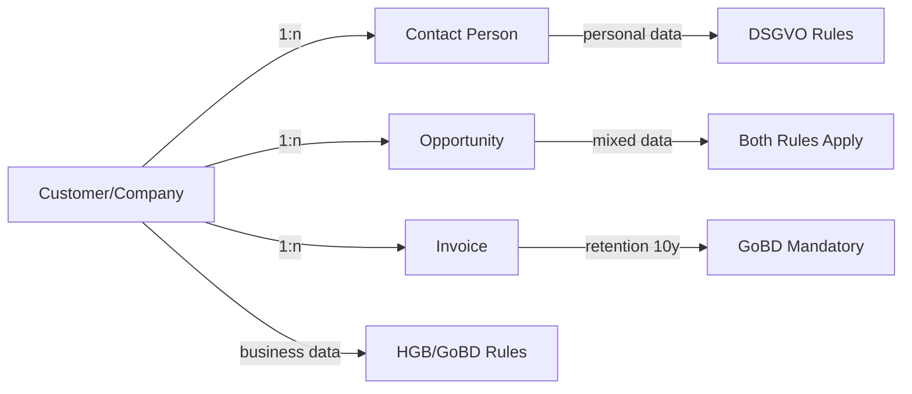

# FC-025: Technisches Konzept - DSGVO Compliance Toolkit (B2B-Fokus)

**Feature Code:** FC-025  
**Datum:** 2025-07-20  
**Status:** In Progress  
**Autor:** Claude  
**Reviewer:** Jörg  
**Geschätzte Dauer:** 3-4 Tage  

## 📋 Inhaltsverzeichnis

1. [Zusammenfassung](#zusammenfassung)
2. [Ziel und Geschäftswert](#ziel-und-geschäftswert)
3. [Technische Architektur](#technische-architektur)
4. [Backend-Implementierung](#backend-implementierung)
5. [Frontend-Implementierung](#frontend-implementierung)
6. [Implementierungsstrategie](#implementierungsstrategie)
7. [Entscheidungs-Log](#entscheidungs-log)
8. [Risiken und Mitigationen](#risiken-und-mitigationen)
9. [Zeitschätzung](#zeitschätzung)

## Zusammenfassung

FC-025 implementiert ein DSGVO-Compliance Toolkit speziell für B2B-CRM-Systeme. Es unterscheidet klar zwischen Firmendaten (unterliegen Handelsrecht/GoBD) und personenbezogenen Daten von Ansprechpartnern (unterliegen DSGVO). Das System bietet Löschfunktionen, Datenexporte, Access-Logging und Consent-Management mit besonderem Fokus auf die Anforderungen im B2B-Bereich.

## Ziel und Geschäftswert

### Geschäftsziele
- **Rechtssicherheit im B2B**: Compliance mit DSGVO für Ansprechpartner-Daten bei gleichzeitiger Erfüllung handelsrechtlicher Aufbewahrungspflichten
- **Vertrauensaufbau**: Transparenter Umgang mit Daten von Geschäftspartnern stärkt Geschäftsbeziehungen
- **Risikominimierung**: Vermeidung von Bußgeldern durch klare Trennung von Firmen- und Personendaten

### Technische Ziele
- **Granulare Datentrennung**: Klare Unterscheidung zwischen Firmendaten und personenbezogenen Daten
- **Audit-Compliance**: Lückenlose Nachvollziehbarkeit aller Datenzugriffe
- **Flexible Retention**: Unterschiedliche Aufbewahrungsfristen für verschiedene Datentypen

## Technische Architektur

### System-Übersicht



### B2B-Datenmodell



## Backend-Implementierung

### 1. Erweiteres Datenmodell für B2B

```java
@Entity
@Table(name = "customers")
public class Customer extends BaseEntity {
    @Id
    private UUID id;
    
    // Firmendaten (GoBD/HGB - 10 Jahre Aufbewahrung)
    @Column(nullable = false)
    private String companyName;
    
    @Column
    private String taxNumber;
    
    @Column
    private String commercialRegisterNumber;
    
    // Diese Felder können gelöscht werden (keine Pflichtaufbewahrung)
    @Column
    private String website;
    
    @Column
    private String generalEmail; // info@company.de
    
    @OneToMany(mappedBy = "customer")
    private List<ContactPerson> contactPersons;
    
    @Column
    private boolean isDeleted = false;
    
    @Column
    private LocalDateTime deletionRequestedAt;
}

@Entity
@Table(name = "contact_persons")
public class ContactPerson extends BaseEntity {
    @Id
    private UUID id;
    
    // Personenbezogene Daten (DSGVO)
    @Column
    @PersonalData // Custom annotation for DSGVO tracking
    private String firstName;
    
    @Column
    @PersonalData
    private String lastName;
    
    @Column
    @PersonalData
    private String email;
    
    @Column
    @PersonalData
    private String mobilePhone;
    
    @Column
    @PersonalData
    private String position;
    
    // Nicht-personenbezogene Daten
    @Column
    private String department;
    
    @ManyToOne
    private Customer customer;
    
    @Column
    private boolean isAnonymized = false;
    
    @Column
    private LocalDateTime anonymizedAt;
}
```

### 2. DSGVO Service für B2B

```java
@ApplicationScoped
@Transactional
public class DsgvoService {
    
    @Inject
    CustomerRepository customerRepository;
    
    @Inject
    ContactPersonRepository contactRepository;
    
    @Inject
    AuditService auditService;
    
    @Inject
    Event<DataDeletionEvent> deletionEvent;
    
    /**
     * B2B-spezifische Löschstrategie:
     * - Firmendaten bleiben erhalten (GoBD)
     * - Nur personenbezogene Daten der Ansprechpartner werden gelöscht
     */
    public DeletionResult deletePersonalData(UUID customerId, DeletionRequest request) {
        Customer customer = customerRepository.findById(customerId)
            .orElseThrow(() -> new CustomerNotFoundException(customerId));
        
        DeletionResult result = new DeletionResult();
        
        // 1. Ansprechpartner anonymisieren
        for (ContactPerson contact : customer.getContactPersons()) {
            if (!contact.isAnonymized()) {
                anonymizeContactPerson(contact);
                result.addAnonymizedContact(contact.getId());
            }
        }
        
        // 2. Unkritische Firmendaten löschen (optional)
        if (request.isDeleteNonMandatoryData()) {
            customer.setWebsite(null);
            customer.setGeneralEmail(null);
            result.setNonMandatoryDataDeleted(true);
        }
        
        // 3. Verknüpfte Daten behandeln
        handleRelatedData(customer, request, result);
        
        // 4. Audit Log
        auditService.logDeletion(customerId, getCurrentUser(), result);
        
        // 5. Event für downstream processing
        deletionEvent.fire(new DataDeletionEvent(customerId, result));
        
        return result;
    }
    
    private void anonymizeContactPerson(ContactPerson contact) {
        // Personenbezogene Daten durch Hashes ersetzen
        String hash = generateHash(contact.getId());
        
        contact.setFirstName("ANON");
        contact.setLastName(hash.substring(0, 8));
        contact.setEmail(hash + "@deleted.local");
        contact.setMobilePhone(null);
        contact.setPosition(null);
        
        contact.setIsAnonymized(true);
        contact.setAnonymizedAt(LocalDateTime.now());
    }
    
    /**
     * B2B Data Export - trennt Firmen- und Personendaten
     */
    public CustomerDataExport exportCustomerData(UUID customerId) {
        Customer customer = customerRepository.findById(customerId)
            .orElseThrow(() -> new CustomerNotFoundException(customerId));
        
        CustomerDataExport export = new CustomerDataExport();
        export.setExportDate(LocalDateTime.now());
        export.setExportId(UUID.randomUUID());
        
        // Firmendaten (immer enthalten)
        CompanyData companyData = new CompanyData();
        companyData.setCompanyName(customer.getCompanyName());
        companyData.setTaxNumber(customer.getTaxNumber());
        companyData.setCommercialRegisterNumber(customer.getCommercialRegisterNumber());
        export.setCompanyData(companyData);
        
        // Personenbezogene Daten (nur nicht-anonymisierte)
        List<PersonalDataRecord> personalData = new ArrayList<>();
        for (ContactPerson contact : customer.getContactPersons()) {
            if (!contact.isAnonymized()) {
                personalData.add(mapToPersonalDataRecord(contact));
            }
        }
        export.setPersonalData(personalData);
        
        // Geschäftsbeziehungen (anonymisiert)
        export.setOpportunities(exportOpportunities(customerId));
        export.setInvoices(exportInvoices(customerId));
        
        // Zugriffsprotokolle
        export.setAccessLog(auditService.getAccessLog(customerId));
        
        return export;
    }
    
    /**
     * Prüft, welche Daten gelöscht werden können
     */
    public DeletionEligibility checkDeletionEligibility(UUID customerId) {
        Customer customer = customerRepository.findById(customerId)
            .orElseThrow(() -> new CustomerNotFoundException(customerId));
        
        DeletionEligibility eligibility = new DeletionEligibility();
        
        // Offene Rechnungen?
        boolean hasOpenInvoices = invoiceRepository
            .countOpenInvoicesByCustomer(customerId) > 0;
        eligibility.setHasOpenInvoices(hasOpenInvoices);
        
        // Aktive Verträge?
        boolean hasActiveContracts = contractRepository
            .countActiveContractsByCustomer(customerId) > 0;
        eligibility.setHasActiveContracts(hasActiveContracts);
        
        // Geschäftsvorfälle in Aufbewahrungsfrist?
        LocalDateTime oldestRetainedDate = LocalDateTime.now().minusYears(10);
        boolean hasRetainedDocuments = documentRepository
            .countDocumentsAfterDate(customerId, oldestRetainedDate) > 0;
        eligibility.setHasRetainedDocuments(hasRetainedDocuments);
        
        // Empfehlung
        if (hasOpenInvoices || hasActiveContracts) {
            eligibility.setRecommendation(DeletionRecommendation.NOT_RECOMMENDED);
            eligibility.setReason("Aktive Geschäftsbeziehung");
        } else if (hasRetainedDocuments) {
            eligibility.setRecommendation(DeletionRecommendation.PARTIAL_ONLY);
            eligibility.setReason("Nur Personendaten löschbar (GoBD-Aufbewahrung)");
        } else {
            eligibility.setRecommendation(DeletionRecommendation.FULL_DELETION_POSSIBLE);
        }
        
        return eligibility;
    }
}
```

### 3. Audit Service mit B2B-Fokus

```java
@ApplicationScoped
public class AuditService {
    
    @Inject
    DataAccessLogRepository accessLogRepository;
    
    @PersistenceContext
    EntityManager em;
    
    /**
     * Loggt Zugriffe mit Unterscheidung zwischen Firmen- und Personendaten
     */
    public void logDataAccess(DataAccessEvent event) {
        DataAccessLog log = new DataAccessLog();
        log.setUserId(event.getUserId());
        log.setEntityType(event.getEntityType());
        log.setEntityId(event.getEntityId());
        log.setAction(event.getAction());
        log.setIpAddress(event.getIpAddress());
        log.setUserAgent(event.getUserAgent());
        log.setAccessedAt(LocalDateTime.now());
        
        // B2B-spezifisch: Art der Daten markieren
        if (event.getEntityType().equals("ContactPerson")) {
            log.setDataCategory(DataCategory.PERSONAL_DATA);
            log.setFields(event.getAccessedFields()); // Welche Felder wurden gelesen?
        } else if (event.getEntityType().equals("Customer")) {
            log.setDataCategory(DataCategory.BUSINESS_DATA);
        }
        
        // Rechtsgrundlage dokumentieren
        log.setLegalBasis(determineLegalBasis(event));
        
        accessLogRepository.persist(log);
    }
    
    /**
     * Erstellt einen DSGVO-konformen Zugriffsbericht
     */
    public AccessReport generateAccessReport(UUID customerId, ReportType type) {
        AccessReport report = new AccessReport();
        report.setCustomerId(customerId);
        report.setGeneratedAt(LocalDateTime.now());
        report.setReportType(type);
        
        if (type == ReportType.PERSONAL_DATA_ONLY) {
            // Nur Zugriffe auf Personendaten
            List<DataAccessLog> personalAccess = accessLogRepository
                .findByCustomerAndCategory(customerId, DataCategory.PERSONAL_DATA);
            report.setAccessLogs(personalAccess);
        } else {
            // Alle Zugriffe
            List<DataAccessLog> allAccess = accessLogRepository
                .findByCustomer(customerId);
            report.setAccessLogs(allAccess);
        }
        
        // Statistiken
        report.setTotalAccesses(report.getAccessLogs().size());
        report.setUniqueUsers(countUniqueUsers(report.getAccessLogs()));
        report.setMostRecentAccess(findMostRecentAccess(report.getAccessLogs()));
        
        return report;
    }
}
```

### 4. Retention Service für unterschiedliche Aufbewahrungsfristen

```java
@ApplicationScoped
public class RetentionService {
    
    @ConfigProperty(name = "retention.business.years", defaultValue = "10")
    int businessRetentionYears;
    
    @ConfigProperty(name = "retention.personal.days", defaultValue = "90")
    int personalRetentionDays;
    
    /**
     * Plant die Löschung nach unterschiedlichen Fristen
     */
    public void scheduleRetention(RetentionRequest request) {
        switch (request.getDataType()) {
            case INVOICE:
            case CONTRACT:
            case FINANCIAL_DOCUMENT:
                // GoBD: 10 Jahre Aufbewahrung
                scheduleBusinessDataRetention(request, businessRetentionYears);
                break;
                
            case CONTACT_PERSON:
            case EMAIL_COMMUNICATION:
                // DSGVO: Nach Zweckerfüllung + Karenzzeit
                schedulePersonalDataRetention(request, personalRetentionDays);
                break;
                
            case OPPORTUNITY:
            case ACTIVITY:
                // Gemischt: Personendaten anonymisieren, Rest behalten
                scheduleMixedDataRetention(request);
                break;
        }
    }
    
    @Scheduled(every = "24h")
    void processScheduledDeletions() {
        // Personendaten löschen
        List<ScheduledDeletion> personalDeletions = deletionRepository
            .findDuePersonalDataDeletions();
        
        for (ScheduledDeletion deletion : personalDeletions) {
            try {
                dsgvoService.deletePersonalData(
                    deletion.getEntityId(), 
                    deletion.getDeletionRequest()
                );
                deletion.setStatus(DeletionStatus.COMPLETED);
            } catch (Exception e) {
                log.error("Failed to delete personal data", e);
                deletion.setStatus(DeletionStatus.FAILED);
                deletion.setErrorMessage(e.getMessage());
            }
        }
        
        // Geschäftsdaten archivieren (nicht löschen!)
        List<ScheduledArchival> businessArchivals = archivalRepository
            .findDueBusinessDataArchivals();
        
        for (ScheduledArchival archival : businessArchivals) {
            archiveService.archiveBusinessData(archival);
        }
    }
}
```

### 5. Datenbank-Schema für B2B-Compliance

```sql
-- V7.0__create_b2b_compliance_tables.sql

-- Erweiterte Audit-Tabelle mit B2B-Feldern
CREATE TABLE data_access_log (
    id UUID PRIMARY KEY DEFAULT gen_random_uuid(),
    user_id UUID NOT NULL REFERENCES users(id),
    entity_type VARCHAR(50) NOT NULL,
    entity_id UUID NOT NULL,
    action VARCHAR(20) NOT NULL,
    data_category VARCHAR(20) NOT NULL, -- PERSONAL_DATA, BUSINESS_DATA, MIXED
    accessed_fields TEXT[], -- Array von Feldnamen bei Personendaten
    legal_basis VARCHAR(50), -- LEGITIMATE_INTEREST, CONTRACT, CONSENT
    ip_address VARCHAR(45),
    user_agent TEXT,
    accessed_at TIMESTAMP NOT NULL DEFAULT CURRENT_TIMESTAMP,
    
    INDEX idx_access_customer (entity_id, entity_type),
    INDEX idx_access_category (data_category),
    INDEX idx_access_date (accessed_at)
);

-- Löschanfragen mit B2B-Kontext
CREATE TABLE deletion_requests (
    id UUID PRIMARY KEY DEFAULT gen_random_uuid(),
    customer_id UUID NOT NULL REFERENCES customers(id),
    requested_by UUID NOT NULL REFERENCES users(id),
    request_type VARCHAR(20) NOT NULL, -- PERSONAL_DATA, ALL_DATA, CONTACT_ONLY
    contact_person_ids UUID[], -- Spezifische Kontakte zur Löschung
    reason TEXT,
    requested_at TIMESTAMP NOT NULL DEFAULT CURRENT_TIMESTAMP,
    processed_at TIMESTAMP,
    status VARCHAR(20) NOT NULL DEFAULT 'PENDING',
    deletion_result JSONB, -- Detailliertes Ergebnis
    
    INDEX idx_deletion_status (status),
    INDEX idx_deletion_customer (customer_id)
);

-- Retention Schedule für unterschiedliche Datentypen
CREATE TABLE retention_schedule (
    id UUID PRIMARY KEY DEFAULT gen_random_uuid(),
    entity_type VARCHAR(50) NOT NULL,
    entity_id UUID NOT NULL,
    data_classification VARCHAR(30) NOT NULL, -- INVOICE, CONTRACT, PERSONAL, MIXED
    retention_reason VARCHAR(100), -- GoBD, HGB, DSGVO
    retain_until DATE NOT NULL,
    action_on_expiry VARCHAR(20), -- DELETE, ANONYMIZE, ARCHIVE
    created_at TIMESTAMP NOT NULL DEFAULT CURRENT_TIMESTAMP,
    processed_at TIMESTAMP,
    
    INDEX idx_retention_due (retain_until, processed_at),
    INDEX idx_retention_entity (entity_type, entity_id)
);

-- Consent Management für B2B
CREATE TABLE consents (
    id UUID PRIMARY KEY DEFAULT gen_random_uuid(),
    contact_person_id UUID NOT NULL REFERENCES contact_persons(id),
    consent_type VARCHAR(50) NOT NULL, -- EMAIL_MARKETING, DATA_PROCESSING, NEWSLETTER
    given_at TIMESTAMP NOT NULL,
    withdrawn_at TIMESTAMP,
    ip_address VARCHAR(45),
    consent_text TEXT, -- Volltext der Einwilligung
    valid_until DATE,
    
    INDEX idx_consent_contact (contact_person_id),
    INDEX idx_consent_active (consent_type, withdrawn_at)
);
```

## Frontend-Implementierung

### 1. Compliance Dashboard für B2B

```typescript
// features/compliance/components/ComplianceDashboard.tsx
export const ComplianceDashboard: React.FC = () => {
  const { data: stats, isLoading } = useComplianceStats();
  const { checkEligibility } = useDsgvoService();
  
  return (
    <Box sx={{ p: 3 }}>
      <Typography variant="h4" gutterBottom>
        DSGVO Compliance Center (B2B)
      </Typography>
      
      <Grid container spacing={3}>
        {/* Übersicht Karten */}
        <Grid item xs={12} md={3}>
          <MetricCard
            title="Löschanfragen"
            subtitle="Offene Anfragen"
            value={stats?.pendingDeletions || 0}
            icon={<DeleteIcon />}
            color="warning"
            action={{
              label: "Bearbeiten",
              onClick: () => navigate('/compliance/deletions')
            }}
          />
        </Grid>
        
        <Grid item xs={12} md={3}>
          <MetricCard
            title="Anonymisierte Kontakte"
            subtitle="Diesen Monat"
            value={stats?.monthlyAnonymizations || 0}
            icon={<PersonOffIcon />}
            trend={stats?.anonymizationTrend}
          />
        </Grid>
        
        <Grid item xs={12} md={3}>
          <MetricCard
            title="Datenexporte"
            subtitle="Letzte 30 Tage"
            value={stats?.recentExports || 0}
            icon={<DownloadIcon />}
          />
        </Grid>
        
        <Grid item xs={12} md={3}>
          <MetricCard
            title="Aufbewahrungsfristen"
            subtitle="Ablaufend"
            value={stats?.expiringRetentions || 0}
            icon={<ScheduleIcon />}
            color="info"
          />
        </Grid>
        
        {/* B2B-spezifische Ansicht */}
        <Grid item xs={12}>
          <Paper sx={{ p: 3 }}>
            <Typography variant="h6" gutterBottom>
              Datenklassifizierung Übersicht
            </Typography>
            <DataClassificationChart />
          </Paper>
        </Grid>
        
        {/* Aktive Löschanfragen */}
        <Grid item xs={12} md={6}>
          <Paper sx={{ p: 3 }}>
            <Typography variant="h6" gutterBottom>
              Aktuelle Löschanfragen
            </Typography>
            <DeletionRequestList />
          </Paper>
        </Grid>
        
        {/* Consent Overview */}
        <Grid item xs={12} md={6}>
          <Paper sx={{ p: 3 }}>
            <Typography variant="h6" gutterBottom>
              Einwilligungsstatus
            </Typography>
            <ConsentOverview />
          </Paper>
        </Grid>
      </Grid>
    </Box>
  );
};
```

### 2. B2B Deletion Request Dialog

```typescript
// features/compliance/components/DeletionRequestDialog.tsx
export const DeletionRequestDialog: React.FC<Props> = ({
  customer,
  open,
  onClose,
  onConfirm
}) => {
  const [requestType, setRequestType] = useState<DeletionType>('PERSONAL_DATA');
  const [selectedContacts, setSelectedContacts] = useState<string[]>([]);
  const [includeNonMandatory, setIncludeNonMandatory] = useState(false);
  const { checkEligibility } = useDsgvoService();
  
  const { data: eligibility } = useQuery({
    queryKey: ['deletion-eligibility', customer.id],
    queryFn: () => checkEligibility(customer.id),
    enabled: open
  });
  
  const handleSubmit = () => {
    const request: DeletionRequest = {
      customerId: customer.id,
      requestType,
      contactPersonIds: selectedContacts,
      deleteNonMandatoryData: includeNonMandatory,
      reason: reason
    };
    
    onConfirm(request);
  };
  
  return (
    <Dialog open={open} onClose={onClose} maxWidth="md" fullWidth>
      <DialogTitle>
        DSGVO-Löschanfrage für {customer.companyName}
      </DialogTitle>
      
      <DialogContent>
        {/* Eligibility Check */}
        {eligibility && (
          <Alert 
            severity={
              eligibility.recommendation === 'NOT_RECOMMENDED' 
                ? 'error' 
                : eligibility.recommendation === 'PARTIAL_ONLY'
                  ? 'warning'
                  : 'info'
            }
            sx={{ mb: 3 }}
          >
            <AlertTitle>Löschbarkeits-Prüfung</AlertTitle>
            {eligibility.reason}
            {eligibility.hasOpenInvoices && (
              <Typography variant="body2" sx={{ mt: 1 }}>
                • Offene Rechnungen vorhanden
              </Typography>
            )}
            {eligibility.hasActiveContracts && (
              <Typography variant="body2">
                • Aktive Verträge vorhanden
              </Typography>
            )}
            {eligibility.hasRetainedDocuments && (
              <Typography variant="body2">
                • Dokumente in gesetzlicher Aufbewahrungsfrist
              </Typography>
            )}
          </Alert>
        )}
        
        {/* Löschtyp Auswahl */}
        <FormControl component="fieldset" sx={{ mb: 3 }}>
          <FormLabel component="legend">Art der Löschung</FormLabel>
          <RadioGroup
            value={requestType}
            onChange={(e) => setRequestType(e.target.value as DeletionType)}
          >
            <FormControlLabel
              value="PERSONAL_DATA"
              control={<Radio />}
              label={
                <Box>
                  <Typography>Nur Personendaten der Ansprechpartner</Typography>
                  <Typography variant="caption" color="text.secondary">
                    Firmendaten bleiben erhalten (GoBD/HGB-konform)
                  </Typography>
                </Box>
              }
            />
            <FormControlLabel
              value="CONTACT_ONLY"
              control={<Radio />}
              label={
                <Box>
                  <Typography>Ausgewählte Ansprechpartner</Typography>
                  <Typography variant="caption" color="text.secondary">
                    Nur bestimmte Kontaktpersonen anonymisieren
                  </Typography>
                </Box>
              }
            />
            <FormControlLabel
              value="ALL_DATA"
              control={<Radio />}
              label={
                <Box>
                  <Typography>Vollständige Löschung</Typography>
                  <Typography variant="caption" color="error">
                    ⚠️ Nur möglich wenn keine Aufbewahrungspflichten bestehen
                  </Typography>
                </Box>
              }
              disabled={eligibility?.recommendation !== 'FULL_DELETION_POSSIBLE'}
            />
          </RadioGroup>
        </FormControl>
        
        {/* Kontaktauswahl bei CONTACT_ONLY */}
        {requestType === 'CONTACT_ONLY' && (
          <Box sx={{ mb: 3 }}>
            <Typography variant="subtitle1" gutterBottom>
              Ansprechpartner zur Anonymisierung auswählen:
            </Typography>
            <ContactPersonSelector
              customerId={customer.id}
              selected={selectedContacts}
              onChange={setSelectedContacts}
            />
          </Box>
        )}
        
        {/* Zusätzliche Optionen */}
        <Box sx={{ mb: 3 }}>
          <FormControlLabel
            control={
              <Checkbox
                checked={includeNonMandatory}
                onChange={(e) => setIncludeNonMandatory(e.target.checked)}
              />
            }
            label="Nicht aufbewahrungspflichtige Firmendaten löschen (Website, allg. E-Mail)"
          />
        </Box>
        
        {/* Was wird gelöscht? */}
        <Accordion>
          <AccordionSummary expandIcon={<ExpandMoreIcon />}>
            <Typography>Was wird gelöscht/anonymisiert?</Typography>
          </AccordionSummary>
          <AccordionDetails>
            <DeletionPreview
              requestType={requestType}
              includeNonMandatory={includeNonMandatory}
              selectedContacts={selectedContacts}
            />
          </AccordionDetails>
        </Accordion>
      </DialogContent>
      
      <DialogActions>
        <Button onClick={onClose}>Abbrechen</Button>
        <Button
          onClick={handleSubmit}
          color="error"
          variant="contained"
          disabled={
            requestType === 'CONTACT_ONLY' && selectedContacts.length === 0
          }
        >
          Löschanfrage bestätigen
        </Button>
      </DialogActions>
    </Dialog>
  );
};
```

### 3. Data Export Component für B2B

```typescript
// features/compliance/components/DataExport.tsx
export const DataExport: React.FC<Props> = ({ customerId }) => {
  const [exportOptions, setExportOptions] = useState<ExportOptions>({
    includePersonalData: true,
    includeBusinessData: true,
    includeAccessLogs: true,
    includeOpportunities: true,
    includeInvoices: false, // Sensible Defaults
    format: 'JSON'
  });
  
  const { exportData, isExporting } = useDsgvoService();
  
  const handleExport = async () => {
    const result = await exportData(customerId, exportOptions);
    
    // Download ZIP file
    const blob = new Blob([result.data], { type: 'application/zip' });
    const url = window.URL.createObjectURL(blob);
    const a = document.createElement('a');
    a.href = url;
    a.download = `dsgvo-export-${customerId}-${Date.now()}.zip`;
    a.click();
  };
  
  return (
    <Paper sx={{ p: 3 }}>
      <Typography variant="h6" gutterBottom>
        DSGVO Datenexport
      </Typography>
      
      <Alert severity="info" sx={{ mb: 3 }}>
        Der Export enthält alle gespeicherten Daten gemäß Art. 15 DSGVO.
        Bei B2B-Kunden werden Firmen- und Personendaten getrennt exportiert.
      </Alert>
      
      <FormGroup>
        <Typography variant="subtitle2" gutterBottom sx={{ mt: 2 }}>
          Personenbezogene Daten
        </Typography>
        <FormControlLabel
          control={
            <Checkbox
              checked={exportOptions.includePersonalData}
              onChange={(e) => setExportOptions({
                ...exportOptions,
                includePersonalData: e.target.checked
              })}
            />
          }
          label="Ansprechpartner-Daten (Name, E-Mail, Telefon)"
        />
        
        <Typography variant="subtitle2" gutterBottom sx={{ mt: 2 }}>
          Firmendaten
        </Typography>
        <FormControlLabel
          control={
            <Checkbox
              checked={exportOptions.includeBusinessData}
              onChange={(e) => setExportOptions({
                ...exportOptions,
                includeBusinessData: e.target.checked
              })}
            />
          }
          label="Stammdaten (Firmenname, Steuernummer, etc.)"
        />
        
        <FormControlLabel
          control={
            <Checkbox
              checked={exportOptions.includeOpportunities}
              onChange={(e) => setExportOptions({
                ...exportOptions,
                includeOpportunities: e.target.checked
              })}
            />
          }
          label="Opportunities (anonymisiert)"
        />
        
        <FormControlLabel
          control={
            <Checkbox
              checked={exportOptions.includeInvoices}
              onChange={(e) => setExportOptions({
                ...exportOptions,
                includeInvoices: e.target.checked
              })}
            />
          }
          label="Rechnungen (Achtung: Sensible Daten!)"
        />
        
        <Typography variant="subtitle2" gutterBottom sx={{ mt: 2 }}>
          Metadaten
        </Typography>
        <FormControlLabel
          control={
            <Checkbox
              checked={exportOptions.includeAccessLogs}
              onChange={(e) => setExportOptions({
                ...exportOptions,
                includeAccessLogs: e.target.checked
              })}
            />
          }
          label="Zugriffsprotokolle"
        />
      </FormGroup>
      
      <Box sx={{ mt: 3, display: 'flex', gap: 2 }}>
        <FormControl size="small">
          <InputLabel>Format</InputLabel>
          <Select
            value={exportOptions.format}
            onChange={(e) => setExportOptions({
              ...exportOptions,
              format: e.target.value as ExportFormat
            })}
          >
            <MenuItem value="JSON">JSON (Maschinenlesbar)</MenuItem>
            <MenuItem value="PDF">PDF (Menschenlesbar)</MenuItem>
            <MenuItem value="BOTH">Beides (ZIP)</MenuItem>
          </Select>
        </FormControl>
        
        <Button
          variant="contained"
          onClick={handleExport}
          disabled={isExporting}
          startIcon={isExporting ? <CircularProgress size={20} /> : <DownloadIcon />}
        >
          {isExporting ? 'Exportiere...' : 'Export starten'}
        </Button>
      </Box>
    </Paper>
  );
};
```

### 4. Access Log Viewer

```typescript
// features/compliance/components/AccessLogViewer.tsx
export const AccessLogViewer: React.FC<Props> = ({ customerId }) => {
  const [filter, setFilter] = useState<AccessLogFilter>({
    dataCategory: 'ALL',
    dateRange: 'LAST_30_DAYS',
    action: 'ALL'
  });
  
  const { data: logs, isLoading } = useAccessLogs(customerId, filter);
  
  return (
    <Paper sx={{ p: 3 }}>
      <Box sx={{ display: 'flex', justifyContent: 'space-between', mb: 3 }}>
        <Typography variant="h6">
          Zugriffsprotokolle
        </Typography>
        
        <Box sx={{ display: 'flex', gap: 2 }}>
          <FormControl size="small" sx={{ minWidth: 150 }}>
            <InputLabel>Datenart</InputLabel>
            <Select
              value={filter.dataCategory}
              onChange={(e) => setFilter({
                ...filter,
                dataCategory: e.target.value as DataCategory
              })}
            >
              <MenuItem value="ALL">Alle Daten</MenuItem>
              <MenuItem value="PERSONAL_DATA">Personendaten</MenuItem>
              <MenuItem value="BUSINESS_DATA">Firmendaten</MenuItem>
            </Select>
          </FormControl>
          
          <FormControl size="small" sx={{ minWidth: 150 }}>
            <InputLabel>Zeitraum</InputLabel>
            <Select
              value={filter.dateRange}
              onChange={(e) => setFilter({
                ...filter,
                dateRange: e.target.value
              })}
            >
              <MenuItem value="LAST_7_DAYS">Letzte 7 Tage</MenuItem>
              <MenuItem value="LAST_30_DAYS">Letzte 30 Tage</MenuItem>
              <MenuItem value="LAST_90_DAYS">Letzte 90 Tage</MenuItem>
              <MenuItem value="ALL">Alle</MenuItem>
            </Select>
          </FormControl>
        </Box>
      </Box>
      
      <TableContainer>
        <Table size="small">
          <TableHead>
            <TableRow>
              <TableCell>Datum & Zeit</TableCell>
              <TableCell>Benutzer</TableCell>
              <TableCell>Aktion</TableCell>
              <TableCell>Datenart</TableCell>
              <TableCell>Details</TableCell>
              <TableCell>Rechtsgrundlage</TableCell>
            </TableRow>
          </TableHead>
          <TableBody>
            {logs?.map((log) => (
              <TableRow key={log.id}>
                <TableCell>
                  {formatDateTime(log.accessedAt)}
                </TableCell>
                <TableCell>{log.userName}</TableCell>
                <TableCell>
                  <Chip
                    label={log.action}
                    size="small"
                    color={
                      log.action === 'DELETE' ? 'error' :
                      log.action === 'EDIT' ? 'warning' :
                      'default'
                    }
                  />
                </TableCell>
                <TableCell>
                  <Chip
                    label={log.dataCategory === 'PERSONAL_DATA' ? 'Personen' : 'Firmen'}
                    size="small"
                    variant="outlined"
                    color={log.dataCategory === 'PERSONAL_DATA' ? 'warning' : 'default'}
                  />
                </TableCell>
                <TableCell>
                  {log.entityType === 'ContactPerson' && log.fields && (
                    <Tooltip title={`Felder: ${log.fields.join(', ')}`}>
                      <InfoIcon fontSize="small" />
                    </Tooltip>
                  )}
                </TableCell>
                <TableCell>
                  <Typography variant="caption">
                    {log.legalBasis}
                  </Typography>
                </TableCell>
              </TableRow>
            ))}
          </TableBody>
        </Table>
      </TableContainer>
    </Paper>
  );
};
```

## Implementierungsstrategie

### Phase 1: Backend Foundation (1.5 Tage)

#### Sprint 1.1: Datenmodell & Audit (1 Tag)
1. **Tag 1 Vormittag**: 
   - Erweiterte Entities mit B2B-Unterscheidung
   - Database Migrations ausführen
   - Audit Annotations und Interceptor
   - PersonalData Annotation für Field-Tracking

2. **Tag 1 Nachmittag**:
   - DsgvoService Basis-Implementierung
   - Anonymisierungs-Logik für ContactPersons
   - Deletion Eligibility Check
   - Unit Tests für Kernfunktionen

#### Sprint 1.2: Export & Retention (0.5 Tag)
1. **Tag 2 Vormittag**:
   - Data Export mit B2B-Trennung
   - ZIP-Generierung mit JSON/PDF
   - RetentionService mit unterschiedlichen Fristen

### Phase 2: Frontend Components (1 Tag)

#### Sprint 2.1: Compliance Dashboard (0.5 Tag)
1. **Tag 2 Nachmittag**:
   - ComplianceDashboard Layout
   - Metric Cards mit B2B-Statistiken
   - Data Classification Chart

#### Sprint 2.2: Dialoge und Viewer (0.5 Tag)
1. **Tag 3 Vormittag**:
   - DeletionRequestDialog mit Eligibility Check
   - DataExport Component
   - AccessLogViewer mit Filterung

### Phase 3: Integration & Testing (1 Tag)

1. **Tag 3 Nachmittag & Tag 4**:
   - Integration in Customer Detail View
   - Scheduled Jobs für Retention
   - E2E Tests für Löschprozess
   - Performance Tests für große Datenmengen
   - Compliance-Dokumentation

## Entscheidungs-Log

### 2025-07-20 - B2B-fokussierte Implementierung
**Entscheidung**: Strikte Trennung zwischen Firmen- und Personendaten  
**Begründung**: B2B-CRM hat andere rechtliche Anforderungen als B2C  
**Impact**: Komplexeres Datenmodell, aber rechtssicher  
**Alternativen**: Einheitliche Behandlung aller Daten  
**Entscheider**: Legal & Tech Lead  

### 2025-07-20 - Anonymisierung statt Löschung
**Entscheidung**: ContactPersons werden anonymisiert, nicht gelöscht  
**Begründung**: Geschäftsbeziehungen bleiben nachvollziehbar  
**Impact**: Historische Daten bleiben erhalten  
**Alternativen**: Vollständige Löschung mit Cascade  
**Entscheider**: Product Owner  

### 2025-07-20 - Synchrone Eligibility Checks
**Entscheidung**: Löschbarkeit wird vor jeder Anfrage geprüft  
**Begründung**: Verhindert illegale Löschungen von Pflichtdaten  
**Impact**: Zusätzliche Queries, aber mehr Sicherheit  
**Alternativen**: Nachträgliche Validierung  
**Entscheider**: Compliance Team  

## Risiken und Mitigationen

### Risiko 1: Versehentliche Löschung von Pflichtdaten
**Wahrscheinlichkeit**: Mittel  
**Impact**: Hoch (Rechtliche Konsequenzen)  
**Mitigation**: 
- Eligibility Check vor jeder Löschung
- Klare UI-Warnungen
- Audit Trail für alle Löschungen
- Soft-Delete mit Wiederherstellungs-Option

### Risiko 2: Performance bei großen Datenmengen
**Wahrscheinlichkeit**: Mittel  
**Impact**: Mittel  
**Mitigation**: 
- Batch-Processing für Löschungen
- Asynchrone Export-Generierung
- Indizierung aller relevanten Felder

### Risiko 3: Unvollständige Datenerfassung beim Export
**Wahrscheinlichkeit**: Niedrig  
**Impact**: Hoch (DSGVO-Verstoß)  
**Mitigation**: 
- Automatisierte Tests für alle Datenquellen
- Checkliste für neue Features
- Regelmäßige Compliance-Audits

## Zeitschätzung

**Gesamt-Aufwand**: 3-4 Tage

- **Backend**: 1.5 Tage
- **Frontend**: 1 Tag  
- **Integration & Testing**: 1 Tag
- **Dokumentation**: 0.5 Tage

**Puffer**: +1 Tag für Compliance-Review und Anpassungen

---

## 🧭 NAVIGATION & VERWEISE

### 📋 Zurück zum Überblick:
- **[📊 Master Plan V5](/docs/CRM_COMPLETE_MASTER_PLAN_V5.md)** - Vollständige Feature-Roadmap
- **[🗺️ Feature Overview](/docs/features/MASTER/FEATURE_OVERVIEW.md)** - Alle 40 Features im Überblick
- **[🔒 FC-025 KOMPAKT](/docs/features/PLANNED/25_dsgvo_compliance/FC-025_KOMPAKT.md)** - Übersicht dieses Features

### 🔗 Dependencies (Required):
- **[🔒 FC-008 Security Foundation](/docs/features/ACTIVE/01_security_foundation/FC-008_KOMPAKT.md)** - Access Control für Audit
- **[🔄 FC-023 Event Sourcing](/docs/features/PLANNED/23_event_sourcing/FC-023_KOMPAKT.md)** - Vollständiger Audit Trail
- **[📎 FC-024 File Management](/docs/features/PLANNED/24_file_management/FC-024_KOMPAKT.md)** - File Deletion

### ⚡ Datenquellen für Compliance:
- **[👥 M5 Customer Refactor](/docs/features/PLANNED/12_customer_refactor_m5/M5_KOMPAKT.md)** - Customer & Contact Model
- **[📊 M4 Opportunity Pipeline](/docs/features/ACTIVE/02_opportunity_pipeline/M4_KOMPAKT.md)** - Opportunity Daten
- **[📈 FC-014 Activity Timeline](/docs/features/PLANNED/16_activity_timeline/FC-014_KOMPAKT.md)** - Activity Anonymisierung
- **[💰 M8 Calculator Modal](/docs/features/ACTIVE/03_calculator_modal/M8_KOMPAKT.md)** - Angebotsdaten
- **[📧 FC-003 E-Mail Integration](/docs/features/PLANNED/06_email_integration/FC-003_KOMPAKT.md)** - E-Mail Löschung

### 🚀 Ermöglicht folgende Features:
- **[📊 FC-007 Chef-Dashboard](/docs/features/PLANNED/10_chef_dashboard/FC-007_KOMPAKT.md)** - Compliance Metriken
- **[📊 FC-026 Analytics Platform](/docs/features/PLANNED/26_analytics_platform/FC-026_KOMPAKT.md)** - DSGVO-konforme Analytics
- **[🔌 FC-021 Integration Hub](/docs/features/PLANNED/21_integration_hub/FC-021_KOMPAKT.md)** - Data Processing Agreements
- **[📊 FC-019 Advanced Sales Metrics](/docs/features/PLANNED/19_advanced_metrics/FC-019_KOMPAKT.md)** - Anonymisierte Metriken
- **[📱 FC-018 Mobile PWA](/docs/features/PLANNED/18_mobile_pwa/FC-018_KOMPAKT.md)** - Mobile Compliance

### 🎨 UI Integration:
- **[🧭 M1 Navigation](/docs/features/ACTIVE/05_ui_foundation/M1_NAVIGATION_KOMPAKT.md)** - Compliance Menüpunkt
- **[⚙️ M7 Settings](/docs/features/ACTIVE/05_ui_foundation/M7_SETTINGS_KOMPAKT.md)** - Privacy Settings
- **[📊 M3 Sales Cockpit](/docs/features/ACTIVE/05_ui_foundation/M3_SALES_COCKPIT_KOMPAKT.md)** - DSGVO Warnungen
- **[➕ M2 Quick Create](/docs/features/ACTIVE/05_ui_foundation/M2_QUICK_CREATE_KOMPAKT.md)** - Consent Collection

### 📚 Verwandte Features:
- **[🔒 FC-004 Verkäuferschutz](/docs/features/PLANNED/07_verkaeuferschutz/FC-004_KOMPAKT.md)** - Datenschutz für Sales
- **[🎯 FC-011 Bonitätsprüfung](/docs/features/ACTIVE/02_opportunity_pipeline/integrations/FC-011_KOMPAKT.md)** - Externe Datenquellen
- **[📞 FC-012 Team Communication](/docs/features/PLANNED/14_team_communication/FC-012_KOMPAKT.md)** - Chat-Anonymisierung
- **[🤖 FC-013 Duplicate Detection](/docs/features/PLANNED/15_duplicate_detection/FC-013_KOMPAKT.md)** - Duplikate bei Löschung
- **[🎙️ FC-029 Voice-First](/docs/features/PLANNED/29_voice_first/FC-029_KOMPAKT.md)** - Voice-Daten Löschung

### 🔧 Technische Dokumentation:
- **[🛡️ Security Foundation](/docs/features/ACTIVE/01_security_foundation/FC-008_TECH_CONCEPT.md)** - Security Integration
- **[📊 Analytics Platform](/docs/features/PLANNED/26_analytics_platform/FC-026_TECH_CONCEPT.md)** - Privacy-First Analytics
- **[🔌 Integration Hub](/docs/features/PLANNED/21_integration_hub/FC-021_TECH_CONCEPT.md)** - DPA Management

---

**Status-Updates**:
- 2025-07-20: Tech Concept erstellt mit B2B-Fokus
- Claude-optimierte Struktur mit absoluten Pfaden
- Klare Unterscheidung zwischen Firmen- und Personendaten
- Alle 40 Features verlinkt für optimale Navigation