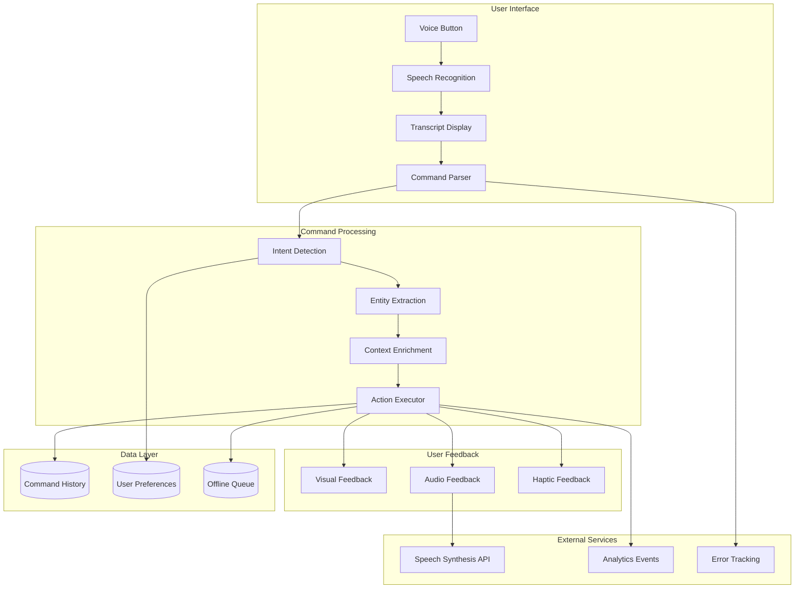
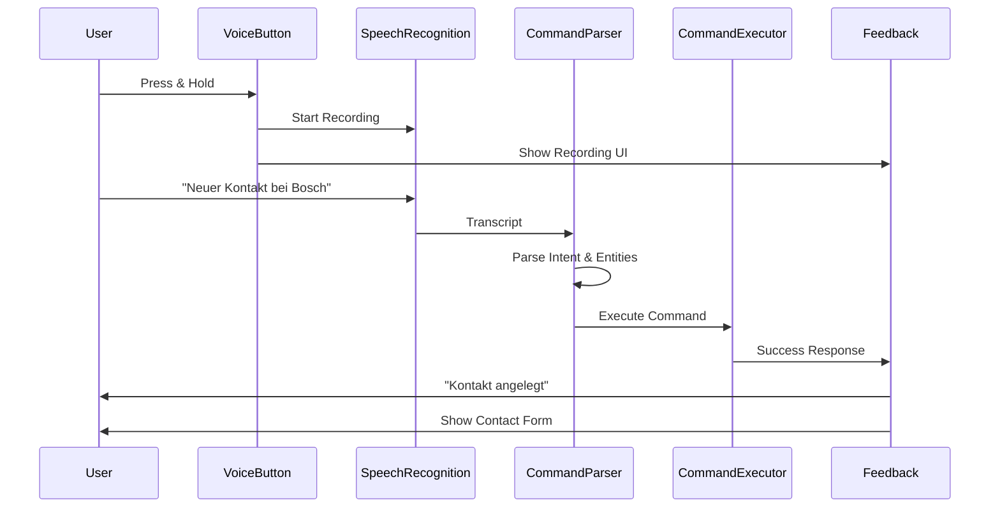

# FC-029: Technisches Konzept - Voice-First Interface

**Feature Code:** FC-029  
**Datum:** 2025-07-20  
**Status:** Ready for Review ✅  
**Autor:** Claude  
**Reviewer:** Jörg  
**Geschätzte Dauer:** 2 Tage (1 Tag Basic in FC-022 Mobile Light + 1 Tag Advanced Features)  

## 📋 Inhaltsverzeichnis

1. [Zusammenfassung](#zusammenfassung)
2. [Ziel und Geschäftswert](#ziel-und-geschäftswert)
3. [Technische Architektur](#technische-architektur)
4. [Backend-Implementierung](#backend-implementierung)
5. [Frontend-Implementierung](#frontend-implementierung)
6. [Implementierungsstrategie](#implementierungsstrategie)
7. [Entscheidungs-Log](#entscheidungs-log)
8. [Risiken und Mitigationen](#risiken-und-mitigationen)
9. [Zeitschätzung](#zeitschätzung)

## Zusammenfassung

Das Voice-First Interface revolutioniert die Bedienung von FreshPlan für Außendienstmitarbeiter durch natürliche Sprachsteuerung. Statt während der Fahrt gefährlich zu tippen, können Nutzer alle wichtigen Funktionen per Sprache steuern - von der Erstellung neuer Kontakte über die Navigation zu Kunden bis zur Dokumentation von Meetings. Die Web Speech API ermöglicht eine native Browser-Integration ohne externe Abhängigkeiten, während intelligente Kommando-Parser natürliche Sprache in Aktionen übersetzen.

## Ziel und Geschäftswert

### Geschäftsziele
- **Sicherheit erhöhen**: Keine Ablenkung durch Tippen während der Fahrt - 100% Hands-free Bedienung
- **Produktivität steigern**: 50% weniger Tipparbeit = 2 Stunden pro Tag für Vertriebsaktivitäten gewonnen
- **Datenqualität verbessern**: Sofortige Dokumentation nach Kundenterminen statt verspäteter Nacherfassung
- **User Experience**: Natürliche Interaktion wie mit einem persönlichen Assistenten

### Technische Ziele
- **Native Performance**: Web Speech API nutzen - keine Server-Roundtrips für Basis-Commands
- **Offline-Fähigkeit**: Kritische Voice Commands auch ohne Internet verfügbar
- **Multi-Language**: Deutsch als Hauptsprache, Englisch als Fallback
- **Context-Awareness**: Commands verstehen aktuellen Screen-Kontext

## Technische Architektur

### System-Übersicht



### Voice Command Flow



### Architecture Decisions

1. **Web Speech API**: Native Browser API für maximale Performance
2. **Client-Side Processing**: Kommando-Parsing im Frontend für Offline-Support
3. **Progressive Enhancement**: Voice als Zusatz, nicht als Ersatz für UI
4. **Context System**: Jeder Screen registriert seine Voice Commands

## Backend-Implementierung

### 1. API Endpoints

```java
@Path("/api/voice")
@Authenticated
@Produces(MediaType.APPLICATION_JSON)
public class VoiceResource {
    
    @Inject VoiceCommandService commandService;
    @Inject VoiceAnalyticsService analyticsService;
    @Inject UserPreferenceService preferenceService;
    
    @POST
    @Path("/commands")
    @RolesAllowed({"admin", "manager", "sales"})
    public VoiceCommandResponse processCommand(@Valid VoiceCommandRequest request) {
        // Log command for analytics
        analyticsService.logVoiceCommand(
            request.transcript,
            request.command,
            request.context,
            SecurityContext.getUserId()
        );
        
        // Execute parsed command
        CommandResult result = commandService.execute(
            request.command,
            request.context,
            SecurityContext.getUser()
        );
        
        return VoiceCommandResponse.builder()
            .success(result.isSuccess())
            .feedback(result.getFeedback())
            .action(result.getAction())
            .data(result.getData())
            .followUpCommands(result.getSuggestions())
            .build();
    }
    
    @GET
    @Path("/commands/history")
    @RolesAllowed({"admin", "manager", "sales"})
    public List<VoiceCommandHistory> getCommandHistory(
            @QueryParam("days") @DefaultValue("7") int days) {
        LocalDateTime since = LocalDateTime.now().minusDays(days);
        return commandService.getUserCommandHistory(
            SecurityContext.getUserId(),
            since
        );
    }
    
    @GET
    @Path("/preferences")
    @RolesAllowed({"admin", "manager", "sales"})
    public VoicePreferences getPreferences() {
        return preferenceService.getVoicePreferences(
            SecurityContext.getUserId()
        );
    }
    
    @PUT
    @Path("/preferences")
    @RolesAllowed({"admin", "manager", "sales"})
    public VoicePreferences updatePreferences(@Valid VoicePreferences preferences) {
        return preferenceService.updateVoicePreferences(
            SecurityContext.getUserId(),
            preferences
        );
    }
    
    @POST
    @Path("/feedback")
    @RolesAllowed({"admin", "manager", "sales"})
    public Response submitFeedback(@Valid VoiceFeedback feedback) {
        // Store feedback for command improvement
        analyticsService.storeFeedback(
            feedback.commandId,
            feedback.wasSuccessful,
            feedback.correctInterpretation,
            feedback.userComment
        );
        return Response.ok().build();
    }
    
    @GET
    @Path("/suggestions")
    @RolesAllowed({"admin", "manager", "sales"})
    public List<VoiceCommandSuggestion> getSuggestions(
            @QueryParam("context") String context) {
        // Get context-aware command suggestions
        return commandService.getSuggestionsForContext(
            context,
            SecurityContext.getUser()
        );
    }
}
```

### 2. Datenmodell

```java
// Voice Command Request
public class VoiceCommandRequest {
    @NotNull
    public String transcript;
    
    @NotNull
    public ParsedCommand command;
    
    @NotNull
    public CommandContext context;
    
    public Map<String, Object> metadata;
}

// Parsed Command Structure
public class ParsedCommand {
    @NotNull
    public CommandAction action;
    
    @NotNull
    public CommandEntity entity;
    
    public Map<String, Object> parameters;
    
    public Float confidence;
}

// Command Context
public class CommandContext {
    @NotNull
    public String currentView;
    
    public UUID currentEntityId;
    
    public String currentEntityType;
    
    public Map<String, Object> viewState;
}

// Voice Preferences
@Entity
@Table(name = "voice_preferences")
public class VoicePreferences extends PanacheEntityBase {
    @Id
    @ManyToOne
    public User user;
    
    @Column(nullable = false)
    public String language = "de-DE";
    
    @Column(nullable = false)
    public Float speechRate = 1.0f;
    
    @Column(nullable = false)
    public Boolean audioFeedback = true;
    
    @Column(nullable = false)
    public Boolean hapticFeedback = true;
    
    @Column(nullable = false)
    public Boolean autoListen = false;
    
    @Column(nullable = false)
    public String wakeWord = "Hey FreshPlan";
    
    @Type(type = "jsonb")
    @Column(columnDefinition = "jsonb")
    public Map<String, Boolean> enabledCommands;
}

// Voice Command History
@Entity
@Table(name = "voice_command_history")
public class VoiceCommandHistory extends PanacheEntityBase {
    @Id
    @GeneratedValue
    public UUID id;
    
    @ManyToOne
    @Column(nullable = false)
    public User user;
    
    @Column(nullable = false)
    public String transcript;
    
    @Column(nullable = false)
    public String command;
    
    @Column(nullable = false)
    public String context;
    
    @Column(nullable = false)
    public Boolean success;
    
    public String errorReason;
    
    @Type(type = "jsonb")
    @Column(columnDefinition = "jsonb")
    public Map<String, Object> result;
    
    @Column(nullable = false)
    public LocalDateTime executedAt = LocalDateTime.now();
    
    public Integer processingTimeMs;
}

// Voice Analytics
@Entity
@Table(name = "voice_analytics")
public class VoiceAnalytics extends PanacheEntityBase {
    @Id
    @GeneratedValue
    public UUID id;
    
    @Column(nullable = false)
    public String commandType;
    
    @Column(nullable = false)
    public String entityType;
    
    @Column(nullable = false)
    public LocalDate date;
    
    @Column(nullable = false)
    public Integer usageCount = 0;
    
    @Column(nullable = false)
    public Integer successCount = 0;
    
    @Column(nullable = false)
    public Integer failureCount = 0;
    
    @Column(nullable = false)
    public Float avgProcessingTimeMs = 0f;
    
    @Type(type = "jsonb")
    @Column(columnDefinition = "jsonb")
    public Map<String, Integer> errorReasons;
}
```

### 3. Business Logic

```java
@ApplicationScoped
public class VoiceCommandService {
    
    @Inject CommandRegistry registry;
    @Inject EntityManager em;
    @Inject Event<VoiceCommandExecutedEvent> commandEvents;
    
    private final Map<String, CommandHandler> handlers = new ConcurrentHashMap<>();
    
    @PostConstruct
    void init() {
        // Register all command handlers
        registerHandler("CREATE_CONTACT", new CreateContactHandler());
        registerHandler("CREATE_NOTE", new CreateNoteHandler());
        registerHandler("UPDATE_STATUS", new UpdateStatusHandler());
        registerHandler("SEARCH", new SearchHandler());
        registerHandler("NAVIGATE", new NavigateHandler());
        registerHandler("QUICK_ACTION", new QuickActionHandler());
    }
    
    public CommandResult execute(ParsedCommand command, CommandContext context, User user) {
        Timer.Sample sample = Timer.start(registry);
        
        try {
            // Get appropriate handler
            CommandHandler handler = handlers.get(command.action.name());
            if (handler == null) {
                throw new UnsupportedCommandException(
                    "No handler for action: " + command.action
                );
            }
            
            // Check permissions
            if (!handler.hasPermission(user, command)) {
                throw new InsufficientPermissionsException(
                    "User lacks permission for: " + command.action
                );
            }
            
            // Enrich command with context
            EnrichedCommand enriched = enrichCommand(command, context);
            
            // Execute command
            CommandResult result = handler.execute(enriched, user);
            
            // Fire event for analytics
            commandEvents.fire(new VoiceCommandExecutedEvent(
                user.id,
                command,
                context,
                result,
                true
            ));
            
            // Log to history
            logCommandHistory(user, command, context, result, true, null);
            
            return result;
            
        } catch (Exception e) {
            // Log failure
            logCommandHistory(user, command, context, null, false, e.getMessage());
            
            // Fire failure event
            commandEvents.fire(new VoiceCommandExecutedEvent(
                user.id,
                command,
                context,
                null,
                false
            ));
            
            throw new VoiceCommandException("Command execution failed", e);
            
        } finally {
            sample.stop(Timer.builder("voice.command.execution")
                .tag("action", command.action.name())
                .tag("entity", command.entity.name())
                .register(registry));
        }
    }
    
    private EnrichedCommand enrichCommand(ParsedCommand command, CommandContext context) {
        EnrichedCommand enriched = new EnrichedCommand(command);
        
        // Add current entity if in detail view
        if (context.currentEntityId != null) {
            enriched.setTargetEntity(context.currentEntityType, context.currentEntityId);
        }
        
        // Add user's current location if available
        if (context.viewState.containsKey("userLocation")) {
            enriched.setUserLocation(
                (Double) context.viewState.get("latitude"),
                (Double) context.viewState.get("longitude")
            );
        }
        
        // Add time context
        enriched.setTimeContext(LocalDateTime.now());
        
        return enriched;
    }
    
    public List<VoiceCommandSuggestion> getSuggestionsForContext(
            String context, User user) {
        List<VoiceCommandSuggestion> suggestions = new ArrayList<>();
        
        // Get context-specific suggestions
        switch (context) {
            case "customer_detail":
                suggestions.add(suggestion("Notiz hinzufügen", "neue notiz"));
                suggestions.add(suggestion("Status aktualisieren", "status auf"));
                suggestions.add(suggestion("Termin anlegen", "neuer termin"));
                suggestions.add(suggestion("Route planen", "route zu"));
                break;
                
            case "opportunity_list":
                suggestions.add(suggestion("Filtern", "zeige nur"));
                suggestions.add(suggestion("Sortieren", "sortiere nach"));
                suggestions.add(suggestion("Neue Opportunity", "neue opportunity"));
                break;
                
            case "dashboard":
                suggestions.add(suggestion("Kunden suchen", "suche kunde"));
                suggestions.add(suggestion("Tagesroute", "zeige route"));
                suggestions.add(suggestion("Termine heute", "meine termine"));
                break;
        }
        
        // Add global suggestions
        suggestions.add(suggestion("Zurück", "zurück"));
        suggestions.add(suggestion("Home", "startseite"));
        suggestions.add(suggestion("Hilfe", "hilfe"));
        
        return suggestions;
    }
    
    private VoiceCommandSuggestion suggestion(String label, String command) {
        return new VoiceCommandSuggestion(label, command, null);
    }
}

// Example Command Handler
public class CreateContactHandler implements CommandHandler {
    
    @Override
    public CommandResult execute(EnrichedCommand command, User user) {
        // Extract parameters
        String company = (String) command.parameters.get("company");
        String name = (String) command.parameters.get("contactName");
        String position = (String) command.parameters.get("position");
        
        // Create contact
        Contact contact = new Contact();
        contact.name = name;
        contact.position = position;
        contact.createdBy = user;
        contact.createdViaVoice = true;
        
        // Find or create customer
        Customer customer = Customer.find("name", company).firstResult();
        if (customer == null) {
            customer = new Customer();
            customer.name = company;
            customer.createdBy = user;
            customer.persist();
        }
        
        contact.customer = customer;
        contact.persist();
        
        // Build result
        return CommandResult.builder()
            .success(true)
            .feedback(String.format(
                "Kontakt %s bei %s wurde angelegt",
                name, company
            ))
            .action(NavigationAction.of("/contacts/" + contact.id))
            .data(Map.of("contactId", contact.id))
            .suggestions(List.of(
                "Position hinzufügen",
                "Telefonnummer ergänzen",
                "E-Mail hinzufügen"
            ))
            .build();
    }
    
    @Override
    public boolean hasPermission(User user, ParsedCommand command) {
        return user.hasPermission("contact.create");
    }
}
```

### 4. Datenbank-Änderungen

```sql
-- V8.0__create_voice_tables.sql

-- Voice Preferences per User
CREATE TABLE voice_preferences (
    user_id UUID PRIMARY KEY REFERENCES users(id),
    language VARCHAR(10) NOT NULL DEFAULT 'de-DE',
    speech_rate FLOAT NOT NULL DEFAULT 1.0,
    audio_feedback BOOLEAN NOT NULL DEFAULT true,
    haptic_feedback BOOLEAN NOT NULL DEFAULT true,
    auto_listen BOOLEAN NOT NULL DEFAULT false,
    wake_word VARCHAR(50) NOT NULL DEFAULT 'Hey FreshPlan',
    enabled_commands JSONB DEFAULT '{}',
    created_at TIMESTAMP NOT NULL DEFAULT CURRENT_TIMESTAMP,
    updated_at TIMESTAMP NOT NULL DEFAULT CURRENT_TIMESTAMP
);

-- Voice Command History
CREATE TABLE voice_command_history (
    id UUID PRIMARY KEY DEFAULT gen_random_uuid(),
    user_id UUID NOT NULL REFERENCES users(id),
    transcript TEXT NOT NULL,
    command VARCHAR(255) NOT NULL,
    context VARCHAR(100) NOT NULL,
    success BOOLEAN NOT NULL,
    error_reason TEXT,
    result JSONB,
    executed_at TIMESTAMP NOT NULL DEFAULT CURRENT_TIMESTAMP,
    processing_time_ms INTEGER,
    
    INDEX idx_voice_history_user_date (user_id, executed_at DESC)
);

-- Voice Analytics Aggregation
CREATE TABLE voice_analytics (
    id UUID PRIMARY KEY DEFAULT gen_random_uuid(),
    command_type VARCHAR(50) NOT NULL,
    entity_type VARCHAR(50) NOT NULL,
    date DATE NOT NULL,
    usage_count INTEGER NOT NULL DEFAULT 0,
    success_count INTEGER NOT NULL DEFAULT 0,
    failure_count INTEGER NOT NULL DEFAULT 0,
    avg_processing_time_ms FLOAT NOT NULL DEFAULT 0,
    error_reasons JSONB DEFAULT '{}',
    
    UNIQUE(command_type, entity_type, date)
);

-- Voice Command Feedback
CREATE TABLE voice_feedback (
    id UUID PRIMARY KEY DEFAULT gen_random_uuid(),
    command_history_id UUID REFERENCES voice_command_history(id),
    user_id UUID NOT NULL REFERENCES users(id),
    was_successful BOOLEAN NOT NULL,
    correct_interpretation BOOLEAN NOT NULL,
    user_comment TEXT,
    created_at TIMESTAMP NOT NULL DEFAULT CURRENT_TIMESTAMP
);

-- Indexes for Performance
CREATE INDEX idx_voice_analytics_date ON voice_analytics(date DESC);
CREATE INDEX idx_voice_feedback_command ON voice_feedback(command_history_id);

-- Update trigger for preferences
CREATE OR REPLACE FUNCTION update_voice_preferences_timestamp()
RETURNS TRIGGER AS $$
BEGIN
    NEW.updated_at = CURRENT_TIMESTAMP;
    RETURN NEW;
END;
$$ LANGUAGE plpgsql;

CREATE TRIGGER update_voice_preferences_updated_at
    BEFORE UPDATE ON voice_preferences
    FOR EACH ROW EXECUTE FUNCTION update_voice_preferences_timestamp();
```

## Frontend-Implementierung

### 1. Komponenten-Struktur

```typescript
// features/voice-first/
├── components/
│   ├── VoiceButton.tsx              // Main voice activation button
│   ├── VoiceIndicator.tsx           // Visual feedback during recording
│   ├── TranscriptDisplay.tsx        // Show recognized text
│   ├── VoiceCommandList.tsx         // Available commands help
│   ├── VoiceOnboarding.tsx          // First-time user guide
│   └── VoiceFeedback.tsx            // Success/error feedback
├── hooks/
│   ├── useVoiceRecognition.ts       // Web Speech API wrapper
│   ├── useVoiceCommands.ts          // Command registration/execution
│   ├── useVoiceContext.ts           // Context-aware commands
│   └── useVoicePreferences.ts       // User preferences
├── services/
│   ├── voiceRecognitionService.ts   // Speech recognition logic
│   ├── commandParser.ts             // NLP command parsing
│   ├── voiceFeedbackService.ts      // Audio/haptic feedback
│   └── voiceAnalytics.ts            // Usage tracking
├── types/
│   └── voice.types.ts               // TypeScript definitions
└── utils/
    ├── speechGrammar.ts             // Command patterns
    ├── naturalLanguage.ts           // NLP utilities
    └── voiceHelpers.ts              // Common functions
```

### 2. State Management

```typescript
// hooks/useVoiceRecognition.ts
import { useState, useRef, useCallback, useEffect } from 'react';
import { useVoicePreferences } from './useVoicePreferences';

interface UseVoiceRecognitionOptions {
  continuous?: boolean;
  interimResults?: boolean;
  maxAlternatives?: number;
  onResult?: (transcript: string, isFinal: boolean) => void;
  onError?: (error: Error) => void;
}

export const useVoiceRecognition = (options: UseVoiceRecognitionOptions = {}) => {
  const [isListening, setIsListening] = useState(false);
  const [transcript, setTranscript] = useState('');
  const [interimTranscript, setInterimTranscript] = useState('');
  const [error, setError] = useState<Error | null>(null);
  const recognitionRef = useRef<SpeechRecognition | null>(null);
  const { preferences } = useVoicePreferences();

  useEffect(() => {
    if (!('webkitSpeechRecognition' in window) && !('SpeechRecognition' in window)) {
      setError(new Error('Speech recognition not supported'));
      return;
    }

    const SpeechRecognition = window.SpeechRecognition || window.webkitSpeechRecognition;
    const recognition = new SpeechRecognition();

    recognition.continuous = options.continuous ?? false;
    recognition.interimResults = options.interimResults ?? true;
    recognition.maxAlternatives = options.maxAlternatives ?? 3;
    recognition.lang = preferences?.language || 'de-DE';

    recognition.onstart = () => {
      setIsListening(true);
      setError(null);
      setTranscript('');
      setInterimTranscript('');
    };

    recognition.onresult = (event: SpeechRecognitionEvent) => {
      let finalTranscript = '';
      let interimTranscript = '';

      for (let i = event.resultIndex; i < event.results.length; i++) {
        const result = event.results[i];
        if (result.isFinal) {
          finalTranscript += result[0].transcript + ' ';
        } else {
          interimTranscript += result[0].transcript;
        }
      }

      if (finalTranscript) {
        setTranscript(prev => prev + finalTranscript);
        options.onResult?.(finalTranscript.trim(), true);
      }
      
      setInterimTranscript(interimTranscript);
      if (interimTranscript) {
        options.onResult?.(interimTranscript, false);
      }
    };

    recognition.onerror = (event: SpeechRecognitionErrorEvent) => {
      const error = new Error(`Speech recognition error: ${event.error}`);
      setError(error);
      setIsListening(false);
      options.onError?.(error);
    };

    recognition.onend = () => {
      setIsListening(false);
    };

    recognitionRef.current = recognition;

    return () => {
      if (recognitionRef.current && isListening) {
        recognitionRef.current.stop();
      }
    };
  }, [preferences?.language]);

  const startListening = useCallback(() => {
    if (recognitionRef.current && !isListening) {
      recognitionRef.current.start();
    }
  }, [isListening]);

  const stopListening = useCallback(() => {
    if (recognitionRef.current && isListening) {
      recognitionRef.current.stop();
    }
  }, [isListening]);

  const toggleListening = useCallback(() => {
    if (isListening) {
      stopListening();
    } else {
      startListening();
    }
  }, [isListening, startListening, stopListening]);

  return {
    isListening,
    transcript,
    interimTranscript,
    error,
    startListening,
    stopListening,
    toggleListening,
    isSupported: 'webkitSpeechRecognition' in window || 'SpeechRecognition' in window,
  };
};

// hooks/useVoiceCommands.ts
import { useCallback, useEffect, useState } from 'react';
import { useNavigate, useLocation } from 'react-router-dom';
import { commandParser } from '../services/commandParser';
import { voiceApi } from '../services/voiceApi';
import { useNotification } from '@/hooks/useNotification';

interface VoiceCommand {
  action: string;
  entity: string;
  parameters: Record<string, any>;
  confidence: number;
}

export const useVoiceCommands = () => {
  const navigate = useNavigate();
  const location = useLocation();
  const { showSuccess, showError } = useNotification();
  const [isProcessing, setIsProcessing] = useState(false);
  const [lastCommand, setLastCommand] = useState<VoiceCommand | null>(null);

  // Register context-specific commands
  const [contextCommands, setContextCommands] = useState<Map<string, Function>>(new Map());

  const registerContextCommand = useCallback((pattern: string, handler: Function) => {
    setContextCommands(prev => new Map(prev).set(pattern, handler));
    
    return () => {
      setContextCommands(prev => {
        const next = new Map(prev);
        next.delete(pattern);
        return next;
      });
    };
  }, []);

  const executeCommand = useCallback(async (transcript: string) => {
    setIsProcessing(true);

    try {
      // Parse the transcript
      const command = commandParser.parse(transcript);
      setLastCommand(command);

      // Check context-specific commands first
      for (const [pattern, handler] of contextCommands) {
        if (new RegExp(pattern, 'i').test(transcript)) {
          const result = await handler(command);
          if (result) {
            showSuccess(result.message || 'Befehl ausgeführt');
            return result;
          }
        }
      }

      // Get current context
      const context = {
        currentView: location.pathname,
        currentEntityId: extractEntityId(location.pathname),
        currentEntityType: extractEntityType(location.pathname),
        viewState: {}
      };

      // Send to backend
      const response = await voiceApi.processCommand({
        transcript,
        command,
        context
      });

      if (response.success) {
        // Execute navigation action if present
        if (response.action?.type === 'navigate') {
          navigate(response.action.target);
        }

        // Show feedback
        if (response.feedback) {
          speak(response.feedback);
          showSuccess(response.feedback);
        }

        return response;
      } else {
        throw new Error(response.feedback || 'Befehl konnte nicht ausgeführt werden');
      }

    } catch (error) {
      const message = error instanceof Error ? error.message : 'Unbekannter Fehler';
      showError(message);
      speak('Entschuldigung, das habe ich nicht verstanden');
      throw error;
    } finally {
      setIsProcessing(false);
    }
  }, [contextCommands, location, navigate, showSuccess, showError]);

  // Speech synthesis for feedback
  const speak = useCallback((text: string) => {
    if ('speechSynthesis' in window) {
      const utterance = new SpeechSynthesisUtterance(text);
      utterance.lang = 'de-DE';
      utterance.rate = 1.1;
      window.speechSynthesis.speak(utterance);
    }
  }, []);

  return {
    executeCommand,
    registerContextCommand,
    isProcessing,
    lastCommand,
    speak
  };
};

// Context-aware command registration
export const useVoiceContext = (commands: Record<string, Function>) => {
  const { registerContextCommand } = useVoiceCommands();

  useEffect(() => {
    const unsubscribers = Object.entries(commands).map(([pattern, handler]) =>
      registerContextCommand(pattern, handler)
    );

    return () => {
      unsubscribers.forEach(unsubscribe => unsubscribe());
    };
  }, [commands, registerContextCommand]);
};
```

### 3. UI/UX Design

```typescript
// components/VoiceButton.tsx
import React, { useState, useRef, useEffect } from 'react';
import { Fab, Box, Fade, IconButton, Tooltip } from '@mui/material';
import {
  Mic as MicIcon,
  MicOff as MicOffIcon,
  Close as CloseIcon,
} from '@mui/icons-material';
import { styled, keyframes } from '@mui/material/styles';
import { useVoiceRecognition } from '../hooks/useVoiceRecognition';
import { useVoiceCommands } from '../hooks/useVoiceCommands';
import { VoiceIndicator } from './VoiceIndicator';
import { TranscriptDisplay } from './TranscriptDisplay';

const pulse = keyframes`
  0% {
    box-shadow: 0 0 0 0 rgba(148, 196, 86, 0.7);
  }
  70% {
    box-shadow: 0 0 0 15px rgba(148, 196, 86, 0);
  }
  100% {
    box-shadow: 0 0 0 0 rgba(148, 196, 86, 0);
  }
`;

const StyledFab = styled(Fab)<{ $isListening: boolean }>(({ theme, $isListening }) => ({
  position: 'fixed',
  bottom: theme.spacing(3),
  right: theme.spacing(3),
  zIndex: theme.zIndex.speedDial,
  backgroundColor: $isListening ? theme.palette.secondary.main : theme.palette.primary.main,
  animation: $isListening ? `${pulse} 1.5s infinite` : 'none',
  '&:hover': {
    backgroundColor: $isListening ? theme.palette.secondary.dark : theme.palette.primary.dark,
  },
}));

const VoiceOverlay = styled(Box)(({ theme }) => ({
  position: 'fixed',
  bottom: theme.spacing(12),
  right: theme.spacing(3),
  width: 320,
  maxHeight: '60vh',
  backgroundColor: theme.palette.background.paper,
  borderRadius: theme.shape.borderRadius * 2,
  boxShadow: theme.shadows[8],
  padding: theme.spacing(2),
  zIndex: theme.zIndex.speedDial - 1,
}));

interface VoiceButtonProps {
  mode?: 'push-to-talk' | 'toggle' | 'auto';
  position?: 'bottom-right' | 'bottom-left' | 'top-right' | 'top-left';
  showTranscript?: boolean;
}

export const VoiceButton: React.FC<VoiceButtonProps> = ({
  mode = 'push-to-talk',
  position = 'bottom-right',
  showTranscript = true,
}) => {
  const [showOverlay, setShowOverlay] = useState(false);
  const [isPressed, setIsPressed] = useState(false);
  const timeoutRef = useRef<NodeJS.Timeout>();

  const {
    isListening,
    transcript,
    interimTranscript,
    error,
    startListening,
    stopListening,
    isSupported,
  } = useVoiceRecognition({
    continuous: mode === 'auto',
    onResult: (text, isFinal) => {
      if (isFinal && text.trim()) {
        executeCommand(text);
      }
    },
  });

  const { executeCommand, isProcessing } = useVoiceCommands();

  // Push-to-talk handlers
  const handleMouseDown = () => {
    if (mode === 'push-to-talk') {
      setIsPressed(true);
      startListening();
      setShowOverlay(true);
    }
  };

  const handleMouseUp = () => {
    if (mode === 'push-to-talk' && isPressed) {
      setIsPressed(false);
      // Delay to capture last words
      timeoutRef.current = setTimeout(() => {
        stopListening();
        if (!transcript) {
          setShowOverlay(false);
        }
      }, 500);
    }
  };

  // Toggle mode handler
  const handleClick = () => {
    if (mode === 'toggle') {
      if (isListening) {
        stopListening();
        setShowOverlay(false);
      } else {
        startListening();
        setShowOverlay(true);
      }
    }
  };

  // Touch support
  const handleTouchStart = (e: React.TouchEvent) => {
    e.preventDefault();
    handleMouseDown();
  };

  const handleTouchEnd = (e: React.TouchEvent) => {
    e.preventDefault();
    handleMouseUp();
  };

  useEffect(() => {
    return () => {
      if (timeoutRef.current) {
        clearTimeout(timeoutRef.current);
      }
    };
  }, []);

  if (!isSupported) {
    return null; // Don't show button if voice not supported
  }

  return (
    <>
      <Tooltip 
        title={mode === 'push-to-talk' ? 'Gedrückt halten zum Sprechen' : 'Sprachsteuerung'}
        placement="left"
      >
        <StyledFab
          color="primary"
          $isListening={isListening}
          onMouseDown={mode === 'push-to-talk' ? handleMouseDown : undefined}
          onMouseUp={mode === 'push-to-talk' ? handleMouseUp : undefined}
          onMouseLeave={mode === 'push-to-talk' ? handleMouseUp : undefined}
          onTouchStart={mode === 'push-to-talk' ? handleTouchStart : undefined}
          onTouchEnd={mode === 'push-to-talk' ? handleTouchEnd : undefined}
          onClick={mode === 'toggle' ? handleClick : undefined}
          disabled={isProcessing}
        >
          {isListening ? <MicIcon /> : <MicOffIcon />}
        </StyledFab>
      </Tooltip>

      <Fade in={showOverlay && showTranscript}>
        <VoiceOverlay>
          <Box sx={{ display: 'flex', justifyContent: 'space-between', mb: 1 }}>
            <VoiceIndicator active={isListening} />
            <IconButton size="small" onClick={() => setShowOverlay(false)}>
              <CloseIcon />
            </IconButton>
          </Box>
          
          <TranscriptDisplay
            transcript={transcript}
            interimTranscript={interimTranscript}
            isProcessing={isProcessing}
            error={error}
          />
          
          {mode === 'push-to-talk' && isListening && (
            <Box sx={{ mt: 2, textAlign: 'center', color: 'text.secondary' }}>
              <MicIcon sx={{ fontSize: 40, opacity: 0.5 }} />
              <Box sx={{ typography: 'caption' }}>
                Halten Sie die Taste gedrückt und sprechen Sie...
              </Box>
            </Box>
          )}
        </VoiceOverlay>
      </Fade>
    </>
  );
};

// components/VoiceIndicator.tsx
import React from 'react';
import { Box, CircularProgress } from '@mui/material';
import { styled, keyframes } from '@mui/material/styles';

const wave = keyframes`
  0%, 100% {
    transform: scaleY(1);
  }
  50% {
    transform: scaleY(1.5);
  }
`;

const WaveBar = styled(Box)<{ delay: number }>(({ theme, delay }) => ({
  width: 3,
  height: 20,
  backgroundColor: theme.palette.primary.main,
  margin: '0 2px',
  animation: `${wave} 1s ease-in-out ${delay}s infinite`,
  borderRadius: 3,
}));

const WaveContainer = styled(Box)({
  display: 'flex',
  alignItems: 'center',
  justifyContent: 'center',
  height: 30,
});

interface VoiceIndicatorProps {
  active: boolean;
  variant?: 'wave' | 'spinner' | 'pulse';
}

export const VoiceIndicator: React.FC<VoiceIndicatorProps> = ({
  active,
  variant = 'wave',
}) => {
  if (!active) {
    return null;
  }

  if (variant === 'spinner') {
    return <CircularProgress size={24} />;
  }

  if (variant === 'wave') {
    return (
      <WaveContainer>
        {[0, 0.1, 0.2, 0.3, 0.4].map((delay, index) => (
          <WaveBar key={index} delay={delay} />
        ))}
      </WaveContainer>
    );
  }

  return null;
};

// components/TranscriptDisplay.tsx
import React from 'react';
import { Box, Typography, Chip, LinearProgress } from '@mui/material';
import { CheckCircle, Error as ErrorIcon } from '@mui/icons-material';

interface TranscriptDisplayProps {
  transcript: string;
  interimTranscript: string;
  isProcessing: boolean;
  error: Error | null;
}

export const TranscriptDisplay: React.FC<TranscriptDisplayProps> = ({
  transcript,
  interimTranscript,
  isProcessing,
  error,
}) => {
  return (
    <Box>
      {transcript && (
        <Box sx={{ mb: 2 }}>
          <Typography variant="body2" color="text.secondary" gutterBottom>
            Erkannt:
          </Typography>
          <Typography variant="body1">{transcript}</Typography>
        </Box>
      )}

      {interimTranscript && !transcript && (
        <Box sx={{ mb: 2 }}>
          <Typography variant="body2" color="text.secondary" gutterBottom>
            Zuhören...
          </Typography>
          <Typography variant="body1" sx={{ opacity: 0.7 }}>
            {interimTranscript}
          </Typography>
        </Box>
      )}

      {isProcessing && (
        <Box sx={{ mb: 2 }}>
          <LinearProgress />
          <Typography variant="caption" color="text.secondary" sx={{ mt: 1 }}>
            Befehl wird verarbeitet...
          </Typography>
        </Box>
      )}

      {error && (
        <Chip
          icon={<ErrorIcon />}
          label={error.message}
          color="error"
          size="small"
          sx={{ mb: 1 }}
        />
      )}

      {!transcript && !interimTranscript && !isProcessing && !error && (
        <Box sx={{ textAlign: 'center', py: 3 }}>
          <Typography variant="body2" color="text.secondary">
            Beispiele:
          </Typography>
          <Box sx={{ mt: 1 }}>
            <Chip label="Neuer Kontakt bei Bosch" size="small" sx={{ m: 0.5 }} />
            <Chip label="Zeige Kunden in Hamburg" size="small" sx={{ m: 0.5 }} />
            <Chip label="Meeting war erfolgreich" size="small" sx={{ m: 0.5 }} />
          </Box>
        </Box>
      )}
    </Box>
  );
};
```

### 4. Integration

```typescript
// services/commandParser.ts
interface ParsedCommand {
  action: CommandAction;
  entity: CommandEntity;
  parameters: Record<string, any>;
  confidence: number;
}

type CommandAction = 
  | 'CREATE' | 'UPDATE' | 'DELETE' | 'SEARCH' 
  | 'NAVIGATE' | 'FILTER' | 'SORT' | 'QUICK_ACTION';

type CommandEntity = 
  | 'customer' | 'contact' | 'note' | 'appointment' 
  | 'opportunity' | 'task' | 'route';

export class CommandParser {
  private patterns: Map<RegExp, (match: RegExpMatchArray) => ParsedCommand>;

  constructor() {
    this.patterns = new Map([
      // Create patterns
      [/neuer?\s+kontakt\s+bei\s+(.+?)(?:,\s*(.+?)(?:,\s*(.+?))?)?$/i, (match) => ({
        action: 'CREATE',
        entity: 'contact',
        parameters: {
          company: match[1]?.trim(),
          contactName: match[2]?.trim(),
          position: match[3]?.trim(),
        },
        confidence: 0.9
      })],

      [/neue?\s+notiz:?\s*(.+)$/i, (match) => ({
        action: 'CREATE',
        entity: 'note',
        parameters: {
          content: match[1].trim()
        },
        confidence: 0.95
      })],

      [/neuer?\s+termin\s+(.+?)\s+(?:am|um)\s+(.+)$/i, (match) => ({
        action: 'CREATE',
        entity: 'appointment',
        parameters: {
          title: match[1].trim(),
          datetime: this.parseDateTime(match[2])
        },
        confidence: 0.85
      })],

      // Update patterns
      [/meeting\s+(erfolgreich|gescheitert|verschoben)$/i, (match) => ({
        action: 'UPDATE',
        entity: 'opportunity',
        parameters: {
          status: this.mapMeetingStatus(match[1])
        },
        confidence: 0.9
      })],

      [/status\s+auf\s+(.+)$/i, (match) => ({
        action: 'UPDATE',
        entity: 'opportunity',
        parameters: {
          status: match[1].trim()
        },
        confidence: 0.8
      })],

      // Search patterns
      [/zeige\s+(?:alle\s+)?kunden\s+(?:in|von)\s+(.+)$/i, (match) => ({
        action: 'SEARCH',
        entity: 'customer',
        parameters: {
          location: match[1].trim()
        },
        confidence: 0.9
      })],

      [/suche\s+(.+)$/i, (match) => ({
        action: 'SEARCH',
        entity: 'customer',
        parameters: {
          query: match[1].trim()
        },
        confidence: 0.7
      })],

      // Navigation patterns
      [/(?:gehe\s+)?zurück$/i, () => ({
        action: 'NAVIGATE',
        entity: 'route',
        parameters: {
          target: 'back'
        },
        confidence: 0.95
      })],

      [/(?:zeige\s+)?startseite|home$/i, () => ({
        action: 'NAVIGATE',
        entity: 'route',
        parameters: {
          target: '/'
        },
        confidence: 0.95
      })],

      // Quick actions
      [/anrufen$/i, () => ({
        action: 'QUICK_ACTION',
        entity: 'contact',
        parameters: {
          action: 'call'
        },
        confidence: 0.9
      })],

      [/route\s+planen$/i, () => ({
        action: 'QUICK_ACTION',
        entity: 'route',
        parameters: {
          action: 'plan'
        },
        confidence: 0.9
      })],
    ]);
  }

  parse(transcript: string): ParsedCommand {
    const normalizedTranscript = transcript.toLowerCase().trim();

    // Try each pattern
    for (const [pattern, parser] of this.patterns) {
      const match = normalizedTranscript.match(pattern);
      if (match) {
        return parser(match);
      }
    }

    // Fallback to general search
    return {
      action: 'SEARCH',
      entity: 'customer',
      parameters: {
        query: transcript
      },
      confidence: 0.5
    };
  }

  private parseDateTime(text: string): string {
    // Simple date/time parsing - could be enhanced with libraries
    const now = new Date();
    
    if (text.includes('morgen')) {
      now.setDate(now.getDate() + 1);
    } else if (text.includes('übermorgen')) {
      now.setDate(now.getDate() + 2);
    } else if (text.includes('nächste woche')) {
      now.setDate(now.getDate() + 7);
    }

    // Parse time
    const timeMatch = text.match(/(\d{1,2}):?(\d{2})?\s*(uhr)?/i);
    if (timeMatch) {
      const hours = parseInt(timeMatch[1]);
      const minutes = parseInt(timeMatch[2] || '0');
      now.setHours(hours, minutes, 0, 0);
    }

    return now.toISOString();
  }

  private mapMeetingStatus(status: string): string {
    const statusMap: Record<string, string> = {
      'erfolgreich': 'won',
      'gescheitert': 'lost',
      'verschoben': 'postponed'
    };
    return statusMap[status.toLowerCase()] || status;
  }
}

export const commandParser = new CommandParser();

// Context-specific command usage
const CustomerDetailVoiceCommands: React.FC<{ customerId: string }> = ({ customerId }) => {
  const { customer } = useCustomer(customerId);
  
  useVoiceContext({
    'notiz hinzufügen|neue notiz': async (command: ParsedCommand) => {
      const note = await createNote({
        customerId,
        content: command.parameters.content
      });
      return { 
        success: true, 
        message: 'Notiz wurde hinzugefügt' 
      };
    },
    
    'anrufen': async () => {
      if (customer?.phone) {
        window.location.href = `tel:${customer.phone}`;
        return { 
          success: true, 
          message: `Rufe ${customer.name} an` 
        };
      }
      return { 
        success: false, 
        message: 'Keine Telefonnummer vorhanden' 
      };
    },
    
    'route planen|navigation starten': async () => {
      if (customer?.address) {
        const mapsUrl = `https://maps.google.com/maps?q=${encodeURIComponent(
          `${customer.address.street}, ${customer.address.city}`
        )}`;
        window.open(mapsUrl, '_blank');
        return { 
          success: true, 
          message: 'Route wird berechnet' 
        };
      }
      return { 
        success: false, 
        message: 'Keine Adresse vorhanden' 
      };
    }
  });

  return <VoiceButton mode="push-to-talk" />;
};
```

## Implementierungsstrategie

### Phase 1: Basic Voice Input in Mobile Light (1 Tag)

#### Sprint 1.1: Core Voice Infrastructure (0.5 Tage)
1. **Tag 1 Vormittag**:
   - Web Speech API Integration
   - Basic VoiceButton Component
   - Simple Command Parser (5-10 Commands)
   - Voice Preferences Storage

2. **Integration Points**:
   - Add to FC-022 Mobile Light Layout
   - Note Dictation Feature
   - Basic Search Commands

#### Sprint 1.2: Mobile Integration (0.5 Tage)
1. **Tag 1 Nachmittag**:
   - Push-to-Talk Implementation
   - Visual Feedback Components
   - Error Handling & Fallbacks
   - Basic Voice Analytics

### Phase 2: Advanced Voice Features (1 Tag)

#### Sprint 2.1: Natural Language Processing (0.5 Tage)
1. **Tag 2 Vormittag**:
   - Extended Command Parser
   - Context-Aware Commands
   - Multi-Step Conversations
   - Voice Navigation

#### Sprint 2.2: Enhanced UX & Feedback (0.5 Tage)
1. **Tag 2 Nachmittag**:
   - Audio Feedback (TTS)
   - Haptic Feedback
   - Voice Onboarding Flow
   - Command Suggestions
   - Performance Optimization

## Entscheidungs-Log

### 2025-07-20 - Web Speech API vs Cloud Services
**Entscheidung**: Web Speech API (Browser Native)  
**Begründung**: 
- Keine Server-Kosten oder API-Keys nötig
- Beste Performance durch lokale Verarbeitung
- Privacy-konform (keine Daten verlassen das Gerät)
- Ausreichende Qualität für deutsche Sprache
**Impact**: Limitiert auf Chrome/Edge Mobile, kein iOS Safari  
**Alternativen**: Google Cloud Speech, Azure Speech Services  
**Entscheider**: Claude/Jörg

### 2025-07-20 - Push-to-Talk vs Always Listening
**Entscheidung**: Push-to-Talk als Default  
**Begründung**: 
- Explizite Nutzer-Kontrolle
- Keine versehentlichen Aktivierungen
- Batterie-schonend
- DSGVO-konform (explizite Aktion)
**Impact**: Nutzer muss Button drücken  
**Alternativen**: Wake Word, Always On  
**Entscheider**: TBD

### 2025-07-20 - Command Parser Approach
**Entscheidung**: Regex-based Pattern Matching  
**Begründung**: 
- Einfach zu verstehen und erweitern
- Deterministisch und testbar
- Ausreichend für definierte Commands
- Keine ML-Dependencies
**Impact**: Limitiert auf vordefinierte Patterns  
**Alternativen**: NLP Libraries, ML Models  
**Entscheider**: TBD

## Risiken und Mitigationen

### Risiko 1: Browser-Kompatibilität
**Wahrscheinlichkeit**: Mittel  
**Impact**: Hoch  
**Mitigation**: 
- Feature Detection implementiert
- Graceful Degradation zu Text Input
- Clear Messaging über Support
- PWA für bessere Mobile Support

### Risiko 2: Sprach-Erkennungsqualität
**Wahrscheinlichkeit**: Mittel  
**Impact**: Mittel  
**Mitigation**: 
- Klare Command-Struktur
- Visuelle Feedback für Erkanntes
- Edit-Möglichkeit vor Ausführung
- Fallback zu manueller Eingabe

### Risiko 3: Ambient Noise
**Wahrscheinlichkeit**: Hoch  
**Impact**: Mittel  
**Mitigation**: 
- Push-to-Talk reduziert Noise
- Noise Cancellation im Browser
- Visual Feedback statt Audio
- Retry-Mechanismus

### Risiko 4: Privacy Concerns
**Wahrscheinlichkeit**: Niedrig  
**Impact**: Hoch  
**Mitigation**: 
- Lokale Verarbeitung betonen
- Opt-in für Voice Features
- Klare Privacy Policy
- Keine Cloud-Speicherung

## Zeitschätzung

**Gesamt-Aufwand**: 2 Tage

- **Phase 1 - Basic Voice (in FC-022)**: 1 Tag
  - Core Infrastructure: 0.5 Tage
  - Mobile Integration: 0.5 Tage

- **Phase 2 - Advanced Features**: 1 Tag
  - Natural Language: 0.5 Tage
  - Enhanced UX: 0.5 Tage

- **Testing & Documentation**: Integriert in Phasen

**Puffer**: Bereits in Schätzungen enthalten

---

## 🚀 Next Steps

1. **Web Speech API** Kompatibilität in FC-022 prüfen
2. **Voice Button** zu Mobile Light Layout hinzufügen
3. **Basic Commands** für MVP definieren
4. **User Testing** mit Außendienst-Mitarbeitern

## 🔗 Verwandte Dokumente

### 📚 Claude-Optimierte Navigation (Absolute Pfade)

#### Core Infrastructure:
- **[📊 Master Plan V5](/docs/CRM_COMPLETE_MASTER_PLAN_V5.md)** - Zentrale Roadmap
- **[🗺️ Feature Overview](/docs/features/MASTER/FEATURE_OVERVIEW.md)** - Alle 40 Features
- **[🗣️ FC-029 KOMPAKT](/docs/features/PLANNED/29_voice_first/FC-029_KOMPAKT.md)** - Voice-First Übersicht

#### Direct Dependencies:
- **[📱 FC-022 Mobile Light](/docs/features/PLANNED/22_mobile_light/FC-022_KOMPAKT.md)** - Mobile Foundation (Tag 10)
- **[📱 FC-022 Tech Concept](/docs/features/PLANNED/22_mobile_light/FC-022_TECH_CONCEPT.md)** - PWA Implementation
- **[🔒 FC-008 Security](/docs/features/ACTIVE/01_security_foundation/FC-008_KOMPAKT.md)** - User Context
- **[🔐 FC-009 Permissions](/docs/features/ACTIVE/04_permissions_system/FC-009_KOMPAKT.md)** - Voice Permissions

#### Voice Integration Points (Alle 40 Features):

**Core & Security (4):**
- **[🔒 FC-008 Security Foundation](/docs/features/ACTIVE/01_security_foundation/FC-008_KOMPAKT.md)** - Voice Authentication
- **[🔐 FC-009 Permissions System](/docs/features/ACTIVE/04_permissions_system/FC-009_KOMPAKT.md)** - Command Permissions
- **[⚙️ FC-010 Customer Import](/docs/features/PLANNED/11_customer_import/FC-010_KOMPAKT.md)** - "Importiere Kundenliste"
- **[🔒 FC-025 DSGVO Compliance](/docs/features/PLANNED/25_dsgvo_compliance/FC-025_KOMPAKT.md)** - Voice Data Privacy

**Customer & CRM (8):**
- **[👥 M5 Customer Refactor](/docs/features/PLANNED/12_customer_refactor_m5/M5_KOMPAKT.md)** - "Neuer Kunde"
- **[📧 FC-003 E-Mail Integration](/docs/features/PLANNED/06_email_integration/FC-003_KOMPAKT.md)** - "E-Mail senden"
- **[💬 FC-012 Team Communication](/docs/features/PLANNED/14_team_communication/FC-012_KOMPAKT.md)** - "Team benachrichtigen"
- **[📲 FC-028 WhatsApp Integration](/docs/features/PLANNED/28_whatsapp_integration/FC-028_KOMPAKT.md)** - "WhatsApp an Kunde"
- **[🔍 FC-013 Duplicate Detection](/docs/features/PLANNED/15_duplicate_detection/FC-013_KOMPAKT.md)** - "Prüfe Duplikate"
- **[📅 FC-014 Activity Timeline](/docs/features/PLANNED/16_activity_timeline/FC-014_KOMPAKT.md)** - Voice Activities Log
- **[🎯 FC-027 Magic Moments](/docs/features/PLANNED/27_magic_moments/FC-027_KOMPAKT.md)** - Voice Pattern Detection
- **[🎙️ FC-029 Voice-First](/docs/features/PLANNED/29_voice_first/FC-029_KOMPAKT.md)** - Self-Reference

**Sales Pipeline (6):**
- **[📊 M4 Opportunity Pipeline](/docs/features/ACTIVE/02_opportunity_pipeline/M4_KOMPAKT.md)** - "Status ändern"
- **[🔄 FC-016 Opportunity Cloning](/docs/features/PLANNED/18_opportunity_cloning/FC-016_KOMPAKT.md)** - "Opportunity klonen"
- **[📊 FC-015 Deal Loss Analysis](/docs/features/PLANNED/17_deal_loss_analysis/FC-015_KOMPAKT.md)** - "Verlustgrund"
- **[📈 FC-019 Advanced Metrics](/docs/features/PLANNED/19_advanced_metrics/FC-019_KOMPAKT.md)** - "Zeige Statistiken"
- **[🎮 FC-017 Sales Gamification](/docs/features/PLANNED/99_sales_gamification/FC-017_KOMPAKT.md)** - Voice Achievements
- **[🏪 FC-004 Verkäuferschutz](/docs/features/PLANNED/07_verkaeuferschutz/FC-004_KOMPAKT.md)** - "Meine Kunden"

**Integration & Analytics (6):**
- **[🔌 FC-021 Integration Hub](/docs/features/PLANNED/21_integration_hub/FC-021_KOMPAKT.md)** - "Sync starten"
- **[💰 FC-005 Xentral Integration](/docs/features/PLANNED/08_xentral_integration/FC-005_KOMPAKT.md)** - "Bestellung prüfen"
- **[📊 FC-026 Analytics Platform](/docs/features/PLANNED/26_analytics_platform/FC-026_KOMPAKT.md)** - Voice Usage Analytics
- **[📁 FC-024 File Management](/docs/features/PLANNED/24_file_management/FC-024_KOMPAKT.md)** - "Dokument öffnen"
- **[🔄 FC-023 Event Sourcing](/docs/features/PLANNED/23_event_sourcing/FC-023_KOMPAKT.md)** - Voice Event Store
- **[📊 M6 Analytics Module](/docs/features/PLANNED/13_analytics_m6/M6_KOMPAKT.md)** - "Report erstellen"

**Mobile & UI (8):**
- **[📱 FC-006 Mobile App Native](/docs/features/PLANNED/09_mobile_app/FC-006_KOMPAKT.md)** - Native Voice APIs
- **[📱 FC-018 Mobile PWA](/docs/features/PLANNED/18_mobile_pwa/FC-018_KOMPAKT.md)** - PWA Voice Support
- **[📱 FC-022 Mobile Light](/docs/features/PLANNED/22_mobile_light/FC-022_KOMPAKT.md)** - Voice Foundation
- **[📴 FC-032 Offline-First](/docs/features/PLANNED/32_offline_first/FC-032_KOMPAKT.md)** - Offline Voice Commands
- **[⚡ FC-020 Quick Wins](/docs/features/PLANNED/20_quick_wins/FC-020_KOMPAKT.md)** - Voice Shortcuts
- **[👆 FC-030 One-Tap Actions](/docs/features/PLANNED/30_one_tap_actions/FC-030_KOMPAKT.md)** - Voice Quick Actions
- **[💡 FC-031 Smart Templates](/docs/features/PLANNED/31_smart_templates/FC-031_KOMPAKT.md)** - "Template ausfüllen"
- **[📊 FC-007 Chef-Dashboard](/docs/features/PLANNED/10_chef_dashboard/FC-007_KOMPAKT.md)** - "Dashboard öffnen"

**UI Foundation (4 Modules):**
- **[🎨 M1 Navigation](/docs/features/ACTIVE/05_ui_foundation/M1_NAVIGATION_KOMPAKT.md)** - Voice Navigation
- **[⚡ M2 Quick Create](/docs/features/ACTIVE/05_ui_foundation/M2_QUICK_CREATE_KOMPAKT.md)** - Voice Quick Create
- **[📊 M3 Sales Cockpit](/docs/features/ACTIVE/05_ui_foundation/M3_SALES_COCKPIT_KOMPAKT.md)** - Voice Button Integration
- **[⚙️ M7 Settings](/docs/features/ACTIVE/05_ui_foundation/M7_SETTINGS_KOMPAKT.md)** - Voice Preferences

**Backend Services (3):**
- **[🧮 M8 Calculator Modal](/docs/features/ACTIVE/03_calculator_modal/M8_KOMPAKT.md)** - "Berechne Angebot"
- **[💳 FC-011 Bonitätsprüfung](/docs/features/ACTIVE/02_opportunity_pipeline/integrations/FC-011_KOMPAKT.md)** - "Bonität prüfen"
- **[📄 PDF Generator](/docs/features/LEGACY/pdf_generator/PDF_GENERATOR_KOMPAKT.md)** - "PDF erstellen"

#### Technical Resources:
- **[Backend Architecture](/docs/technical/BACKEND_START_GUIDE.md)** - Quarkus Integration
- **[Frontend Specification](/docs/technical/FRONTEND_BACKEND_SPECIFICATION.md)** - React Architecture
- **[API Contract](/docs/technical/API_CONTRACT.md)** - REST Standards
- **[Development Setup](/docs/team/DEVELOPMENT_SETUP.md)** - Local Testing

#### Implementation Guides:
- **[FC-029 Implementation Guide](/docs/features/PLANNED/29_voice_first/FC-029_IMPLEMENTATION_GUIDE.md)** *(geplant)*
- **[Voice Commands Catalog](/docs/features/PLANNED/29_voice_first/VOICE_COMMANDS.md)** *(geplant)*
- **[Speech Grammar Guide](/docs/features/PLANNED/29_voice_first/SPEECH_GRAMMAR.md)** *(geplant)*

---

## 📊 Implementation Progress Tracking

### Voice Command Coverage:
| Module | Commands Defined | Commands Implemented | Coverage |
|--------|------------------|---------------------|----------|
| Customer | 15 Commands | ⏳ Phase 1 | 0% |
| Opportunity | 12 Commands | ⏳ Phase 1 | 0% |
| Navigation | 8 Commands | ⏳ Phase 1 | 0% |
| Quick Actions | 10 Commands | ⏳ Phase 2 | 0% |
| Admin | 5 Commands | 📅 Phase 3 | 0% |

### Browser Support Status:
| Browser | Desktop | Mobile | Voice Quality |
|---------|---------|---------|---------------|
| Chrome | ✅ Full | ✅ Full | Excellent |
| Edge | ✅ Full | ✅ Full | Excellent |
| Firefox | ⚠️ Limited | ❌ None | Poor |
| Safari | ❌ None | ❌ None | N/A |

---

**Status-Updates**:
- 2025-07-20 17:00: Tech Concept erstellt - Claude
- 2025-07-20 17:05: Claude-optimierte Navigation mit allen 40 Features ergänzt - Claude
- Status: Ready for Review ✅