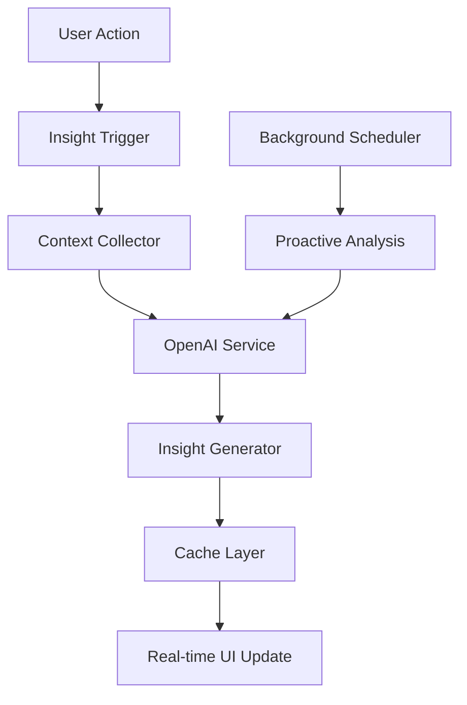

# 🧠 FC-034: Instant Insights - TECH CONCEPT

**Feature-Code:** FC-034  
**Feature-Name:** Instant Insights  
**Kategorie:** KI & Business Intelligence  
**Priorität:** MEDIUM  
**Geschätzter Aufwand:** 4 Tage  
**Status:** 📋 PLANNED - Tech Concept verfügbar  

---

## 🧠 CLAUDE WORKING SECTION (15-Min Context Chunk)

### ⚡ SOFORT STARTEN (2 Minuten):
```bash
# 1. KI-Service Setup
cd backend/src/main/java/de/freshplan/infrastructure
mkdir ai && cd ai
touch OpenAIService.java InsightsService.java InsightEntity.java

# 2. Frontend Insights Components
cd frontend/src/features
mkdir insights && cd insights
touch InsightsBadge.tsx InsightsPanel.tsx useInsights.ts
```

### 📋 IMPLEMENTIERUNGS-CHECKLISTE:
- [ ] **Phase 1:** OpenAI Integration & Prompt Engineering (Tag 1-2)
- [ ] **Phase 2:** Real-time Insights Engine (Tag 3)  
- [ ] **Phase 3:** UI Integration & Contextual Display (Tag 4)

---

## 🎯 FEATURE OVERVIEW

### Was ist Instant Insights?
KI-gestützte Sofort-Einblicke die automatisch relevante Informationen, Trends und Handlungsempfehlungen für Kunden, Opportunities und Verkaufsaktivitäten liefern - direkt im Kontext des aktuellen Workflows.

### Business Value
- **Intelligente Verkaufsunterstützung** durch KI-generierte Insights
- **Proaktive Chancenerkennung** bei Kundendaten-Änderungen  
- **Bessere Verkaufsentscheidungen** durch datenbasierte Empfehlungen
- **Zeitersparnis** durch automatische Trend-Erkennung

### Erfolgsmetriken
- 30% schnellere Entscheidungsfindung durch KI-Insights
- 20% mehr Opportunities durch proaktive Empfehlungen
- 40% Reduktion manueller Datenanalyse-Zeit

---

## 🏗️ TECHNISCHE ARCHITEKTUR

### Tech Stack
- **KI-Engine:** OpenAI GPT-4 API für Natural Language Insights
- **Backend:** Quarkus + Scheduler für Background Processing
- **Frontend:** React Query für Real-time Updates + Material-UI
- **Caching:** Redis für Insight Cache (15min TTL)
- **Queue:** SmallRye Reactive Messaging für Async Processing

### System Architecture


### Component Architecture
```typescript
insights/
├── components/
│   ├── InsightsBadge.tsx       # Context-sensitive Badge
│   ├── InsightsPanel.tsx       # Expandable Insights Panel  
│   ├── InsightCard.tsx         # Individual Insight Display
│   └── InsightsTooltip.tsx     # Hover Insights
├── hooks/
│   ├── useInsights.ts          # Main Insights Hook
│   ├── useContextualInsights.ts # Context-aware Insights
│   └── useInsightActions.ts    # Insight-based Actions
├── services/
│   ├── insightsApi.ts          # API Client
│   └── insightTypes.ts         # TypeScript Definitions
└── utils/
    ├── insightFormatters.ts    # Display Formatters
    └── contextExtractors.ts    # Data Context Extraction
```

---

## 🤖 OPENAI INTEGRATION

### OpenAI Service
```java
@ApplicationScoped
public class OpenAIService {
    
    @ConfigProperty(name = "openai.api.key")
    String openaiApiKey;
    
    @ConfigProperty(name = "openai.model", defaultValue = "gpt-4-turbo")
    String model;
    
    private final OkHttpClient client = new OkHttpClient();
    
    public CompletionStage<String> generateInsight(InsightRequest request) {
        return CompletableFuture.supplyAsync(() -> {
            try {
                // Build OpenAI request
                JSONObject requestBody = new JSONObject()
                    .put("model", model)
                    .put("messages", buildMessages(request))
                    .put("max_tokens", 200)
                    .put("temperature", 0.3);
                
                Request httpRequest = new Request.Builder()
                    .url("https://api.openai.com/v1/chat/completions")
                    .addHeader("Authorization", "Bearer " + openaiApiKey)
                    .addHeader("Content-Type", "application/json")
                    .post(RequestBody.create(
                        requestBody.toString(),
                        MediaType.get("application/json")
                    ))
                    .build();
                
                try (Response response = client.newCall(httpRequest).execute()) {
                    if (!response.isSuccessful()) {
                        throw new InsightGenerationException("OpenAI API error: " + response.code());
                    }
                    
                    JSONObject responseBody = new JSONObject(response.body().string());
                    return responseBody
                        .getJSONArray("choices")
                        .getJSONObject(0)
                        .getJSONObject("message")
                        .getString("content");
                }
            } catch (Exception e) {
                Log.error("Failed to generate insight", e);
                throw new InsightGenerationException("Failed to generate insight", e);
            }
        });
    }
    
    private JSONArray buildMessages(InsightRequest request) {
        return new JSONArray()
            .put(new JSONObject()
                .put("role", "system")
                .put("content", buildSystemPrompt(request.getContext()))
            )
            .put(new JSONObject()
                .put("role", "user")
                .put("content", buildUserPrompt(request))
            );
    }
    
    private String buildSystemPrompt(InsightContext context) {
        return String.format("""
            Du bist ein erfahrener Sales-Analyst für ein B2B-Catering-Unternehmen.
            Analysiere die gegebenen Daten und gib konkrete, actionable Insights.
            
            Kontext: %s
            Fokus: Verkaufschancen, Risiken, und nächste Schritte
            Format: Kurz, präzise, deutsch
            Stil: Professionell, aber verständlich
            """, context.toString());
    }
}
```

### Insight Generation Service
```java
@ApplicationScoped
public class InsightsService {
    
    @Inject
    OpenAIService openaiService;
    
    @Inject
    CustomerRepository customerRepository;
    
    @Inject
    OpportunityRepository opportunityRepository;
    
    public CompletionStage<List<Insight>> generateCustomerInsights(UUID customerId) {
        return CompletableFuture.supplyAsync(() -> {
            // 1. Collect customer context
            Customer customer = customerRepository.findById(customerId);
            List<Opportunity> opportunities = opportunityRepository.findByCustomerId(customerId);
            CustomerMetrics metrics = calculateCustomerMetrics(customerId);
            
            // 2. Build insight request
            InsightRequest request = InsightRequest.builder()
                .context(InsightContext.CUSTOMER)
                .entityId(customerId)
                .data(Map.of(
                    "customer", customer,
                    "opportunities", opportunities,
                    "metrics", metrics,
                    "lastContact", getLastContactInfo(customerId)
                ))
                .build();
            
            // 3. Generate insights via OpenAI
            List<CompletableFuture<Insight>> insightFutures = List.of(
                generateSalesOpportunityInsight(request),
                generateRiskAssessmentInsight(request),
                generateNextStepsInsight(request)
            );
            
            return insightFutures.stream()
                .map(CompletableFuture::join)
                .collect(Collectors.toList());
        });
    }
    
    private CompletableFuture<Insight> generateSalesOpportunityInsight(InsightRequest request) {
        String prompt = String.format("""
            Analysiere diese Kundendaten auf Verkaufschancen:
            - Kunde: %s
            - Letzte Aufträge: %s
            - Aktuelle Opportunities: %s
            
            Finde konkrete Upselling/Cross-Selling Möglichkeiten.
            Antwort in 1-2 Sätzen mit konkreter Handlungsempfehlung.
            """, 
            extractCustomerSummary(request),
            extractOrderHistory(request),
            extractOpportunities(request)
        );
        
        return openaiService.generateInsight(request.withPrompt(prompt))
            .thenApply(content -> Insight.builder()
                .type(InsightType.SALES_OPPORTUNITY)
                .title("Verkaufschance")
                .content(content)
                .confidence(0.8f)
                .actionable(true)
                .build()
            )
            .toCompletableFuture();
    }
}
```

---

## 🎨 FRONTEND INTEGRATION

### Contextual Insights Hook
```typescript
// Main Insights Hook
export const useInsights = (context: InsightContext, entityId: string) => {
  return useQuery({
    queryKey: ['insights', context, entityId],
    queryFn: () => insightsApi.getInsights(context, entityId),
    staleTime: 15 * 60 * 1000, // 15 minutes
    refetchOnWindowFocus: false,
    enabled: !!entityId
  });
};

// Context-aware Insights Hook
export const useContextualInsights = () => {
  const location = useLocation();
  const { customerId, opportunityId } = useParams();
  
  const context = useMemo(() => {
    if (location.pathname.includes('/customers/') && customerId) {
      return { type: 'CUSTOMER', entityId: customerId };
    }
    if (location.pathname.includes('/opportunities/') && opportunityId) {
      return { type: 'OPPORTUNITY', entityId: opportunityId };
    }
    if (location.pathname.includes('/cockpit')) {
      return { type: 'DASHBOARD', entityId: 'global' };
    }
    return null;
  }, [location, customerId, opportunityId]);
  
  const { data: insights, isLoading } = useInsights(
    context?.type, 
    context?.entityId
  );
  
  return {
    insights: insights || [],
    isLoading,
    hasInsights: insights && insights.length > 0,
    context
  };
};
```

### Insights Badge Component
```typescript
interface InsightsBadgeProps {
  context: InsightContext;
  entityId: string;
  variant?: 'dot' | 'count' | 'icon';
  onClick?: () => void;
}

export const InsightsBadge: React.FC<InsightsBadgeProps> = ({
  context,
  entityId,
  variant = 'count',
  onClick
}) => {
  const { insights, isLoading } = useInsights(context, entityId);
  
  if (isLoading || !insights?.length) return null;
  
  const highPriorityInsights = insights.filter(insight => 
    insight.confidence > 0.7 && insight.actionable
  );
  
  return (
    <Badge 
      badgeContent={variant === 'count' ? highPriorityInsights.length : ''}
      color="primary"
      variant={variant === 'dot' ? 'dot' : 'standard'}
      onClick={onClick}
      sx={{ 
        cursor: 'pointer',
        '& .MuiBadge-badge': {
          backgroundColor: '#94C456', // Freshfoodz Grün
          color: 'white'
        }
      }}
    >
      <Tooltip title={`${highPriorityInsights.length} neue Insights verfügbar`}>
        <LightbulbIcon 
          color={highPriorityInsights.length > 0 ? 'primary' : 'disabled'}
          sx={{ fontSize: 20 }}
        />
      </Tooltip>
    </Badge>
  );
};
```

### Insights Panel Component
```typescript
export const InsightsPanel: React.FC<InsightsPanelProps> = ({
  insights,
  onActionClick,
  onDismiss
}) => {
  const [expandedInsight, setExpandedInsight] = useState<string | null>(null);
  
  return (
    <Paper 
      elevation={3}
      sx={{ 
        p: 2, 
        maxWidth: 400,
        bgcolor: 'background.paper',
        border: '1px solid #94C456'
      }}
    >
      <Box sx={{ display: 'flex', alignItems: 'center', mb: 2 }}>
        <LightbulbIcon sx={{ color: '#94C456', mr: 1 }} />
        <Typography variant="h6" fontFamily="Antonio Bold">
          Insights ({insights.length})
        </Typography>
        <IconButton 
          size="small" 
          onClick={onDismiss}
          sx={{ ml: 'auto' }}
        >
          <CloseIcon />
        </IconButton>
      </Box>
      
      <List>
        {insights.map((insight) => (
          <InsightCard
            key={insight.id}
            insight={insight}
            expanded={expandedInsight === insight.id}
            onExpand={() => setExpandedInsight(
              expandedInsight === insight.id ? null : insight.id
            )}
            onActionClick={onActionClick}
          />
        ))}
      </List>
    </Paper>
  );
};

// Individual Insight Card
export const InsightCard: React.FC<InsightCardProps> = ({
  insight,
  expanded,
  onExpand,
  onActionClick
}) => {
  const getInsightIcon = (type: InsightType) => {
    switch (type) {
      case 'SALES_OPPORTUNITY': return <TrendingUpIcon color="success" />;
      case 'RISK_ASSESSMENT': return <WarningIcon color="warning" />;
      case 'NEXT_STEPS': return <NavigateNextIcon color="primary" />;
      default: return <InfoIcon />;
    }
  };
  
  const getConfidenceColor = (confidence: number) => {
    if (confidence >= 0.8) return 'success';
    if (confidence >= 0.6) return 'warning'; 
    return 'error';
  };
  
  return (
    <ListItem 
      sx={{ 
        border: '1px solid #f0f0f0',
        borderRadius: 1,
        mb: 1,
        flexDirection: 'column',
        alignItems: 'stretch'
      }}
    >
      <ListItemButton onClick={onExpand}>
        <ListItemIcon>
          {getInsightIcon(insight.type)}
        </ListItemIcon>
        <ListItemText
          primary={insight.title}
          secondary={expanded ? null : truncateText(insight.content, 60)}
          primaryTypographyProps={{
            fontFamily: 'Poppins',
            fontWeight: 600
          }}
        />
        <Chip 
          size="small"
          label={`${Math.round(insight.confidence * 100)}%`}
          color={getConfidenceColor(insight.confidence)}
          sx={{ ml: 1 }}
        />
      </ListItemButton>
      
      <Collapse in={expanded}>
        <Box sx={{ p: 2, pt: 0 }}>
          <Typography variant="body2" sx={{ mb: 2 }}>
            {insight.content}
          </Typography>
          
          {insight.actionable && (
            <Button
              variant="contained"
              size="small"
              startIcon={<PlayArrowIcon />}
              onClick={() => onActionClick?.(insight)}
              sx={{ 
                bgcolor: '#94C456',
                '&:hover': { bgcolor: '#7BA846' }
              }}
            >
              Aktion ausführen
            </Button>
          )}
        </Box>
      </Collapse>
    </ListItem>
  );
};
```

---

## 🔄 REAL-TIME UPDATES

### Background Processing
```java
@ApplicationScoped
public class InsightsScheduler {
    
    @Inject
    InsightsService insightsService;
    
    @Inject
    @Channel("insights-updates")
    Emitter<InsightUpdate> insightEmitter;
    
    // Proactive insights generation every 15 minutes
    @Scheduled(every = "15m")
    public void generateProactiveInsights() {
        Log.info("Starting proactive insights generation");
        
        // Find customers with recent activity
        List<UUID> activeCustomers = findRecentlyActiveCustomers();
        
        activeCustomers.stream()
            .limit(50) // Limit to prevent API overload
            .forEach(customerId -> {
                insightsService.generateCustomerInsights(customerId)
                    .thenAccept(insights -> {
                        insights.stream()
                            .filter(insight -> insight.getConfidence() > 0.7)
                            .forEach(insight -> {
                                // Cache the insight
                                cacheInsight(insight);
                                
                                // Emit real-time update
                                insightEmitter.send(InsightUpdate.builder()
                                    .customerId(customerId)
                                    .insight(insight)
                                    .timestamp(LocalDateTime.now())
                                    .build());
                            });
                    });
            });
    }
    
    // Trigger insights on customer data changes
    public void onCustomerUpdated(@Observes CustomerUpdatedEvent event) {
        Log.info("Customer updated, generating fresh insights: " + event.getCustomerId());
        
        insightsService.generateCustomerInsights(event.getCustomerId())
            .thenAccept(insights -> {
                insights.forEach(this::cacheInsight);
                
                insightEmitter.send(InsightUpdate.builder()
                    .customerId(event.getCustomerId())
                    .insights(insights)
                    .trigger("CUSTOMER_UPDATE")
                    .timestamp(LocalDateTime.now())
                    .build());
            });
    }
}
```

### WebSocket Updates (Frontend)
```typescript
// Real-time Insights Hook
export const useRealtimeInsights = (customerId: string) => {
  const [insights, setInsights] = useState<Insight[]>([]);
  
  useEffect(() => {
    if (!customerId) return;
    
    const eventSource = new EventSource(`/api/insights/stream/${customerId}`);
    
    eventSource.onmessage = (event) => {
      const update: InsightUpdate = JSON.parse(event.data);
      
      setInsights(prevInsights => {
        // Merge new insights, avoiding duplicates
        const existingIds = new Set(prevInsights.map(i => i.id));
        const newInsights = update.insights.filter(i => !existingIds.has(i.id));
        
        return [...prevInsights, ...newInsights]
          .sort((a, b) => b.confidence - a.confidence);
      });
      
      // Show notification for high-confidence insights
      update.insights
        .filter(insight => insight.confidence > 0.8 && insight.actionable)
        .forEach(insight => {
          toast.info(`💡 Neue Verkaufschance: ${insight.title}`, {
            action: {
              label: 'Anzeigen',
              onClick: () => navigateToInsight(insight)
            }
          });
        });
    };
    
    return () => eventSource.close();
  }, [customerId]);
  
  return insights;
};
```

---

## 📊 INSIGHT TYPES & PROMPTS

### Insight Categories
```typescript
enum InsightType {
  SALES_OPPORTUNITY = 'SALES_OPPORTUNITY',
  RISK_ASSESSMENT = 'RISK_ASSESSMENT', 
  NEXT_STEPS = 'NEXT_STEPS',
  MARKET_TREND = 'MARKET_TREND',
  CUSTOMER_BEHAVIOR = 'CUSTOMER_BEHAVIOR',
  COMPETITIVE_INTEL = 'COMPETITIVE_INTEL'
}

interface Insight {
  id: string;
  type: InsightType;
  title: string;
  content: string;
  confidence: number; // 0.0 - 1.0
  actionable: boolean;
  suggestedActions?: Action[];
  metadata: {
    generatedAt: Date;
    source: 'AI' | 'RULE' | 'MANUAL';
    context: InsightContext;
    entityId: string;
  };
}
```

### Specialized Prompt Templates
```java
public class InsightPrompts {
    
    public static final String SALES_OPPORTUNITY_PROMPT = """
        Analysiere diese B2B-Catering-Kundendaten auf konkrete Verkaufschancen:
        
        Kunde: %s
        Bisherige Aufträge: %s
        Aktuelle Situation: %s
        Branche: %s
        
        Identifiziere:
        1. Upselling-Möglichkeiten (größere Mengen, Premium-Services)
        2. Cross-Selling-Chancen (neue Produktkategorien)
        3. Timing für nächsten Kontakt
        
        Format: Kurzer, actionabler Insight in 1-2 Sätzen auf Deutsch.
        """;
    
    public static final String RISK_ASSESSMENT_PROMPT = """
        Bewerte das Risiko für diesen B2B-Catering-Kunden:
        
        Zahlungshistorie: %s
        Auftragsvolumen-Trend: %s
        Letzte Aktivitäten: %s
        Kommunikation: %s
        
        Analysiere:
        1. Abwanderungsrisiko (0-100%)
        2. Zahlungsausfallrisiko
        3. Konkrete Warnzeichen
        
        Format: Risikoeinschätzung mit Begründung, 1-2 Sätze deutsch.
        """;
    
    public static final String NEXT_STEPS_PROMPT = """
        Empfiehl die besten nächsten Schritte für diesen Kunden:
        
        Aktuelle Pipeline: %s
        Letzte Interaktion: %s
        Customer Stage: %s
        Seasonality: %s
        
        Priorisiere:
        1. Zeitkritische Aktionen
        2. Beziehungsaufbau
        3. Verkaufsaktivitäten
        
        Format: Konkrete Handlungsempfehlung, 1-2 Sätze deutsch.
        """;
}
```

---

## 🧪 TESTING & QUALITY

### Component Testing
```typescript
// InsightsBadge.test.tsx
describe('InsightsBadge', () => {
  test('shows badge count for high-confidence insights', async () => {
    const mockInsights = [
      { id: '1', confidence: 0.9, actionable: true },
      { id: '2', confidence: 0.5, actionable: true }, // Low confidence - excluded
      { id: '3', confidence: 0.8, actionable: true }
    ];
    
    mockInsightsApi.getInsights.mockResolvedValue(mockInsights);
    
    render(<InsightsBadge context="CUSTOMER" entityId="123" />);
    
    await waitFor(() => {
      expect(screen.getByText('2')).toBeInTheDocument(); // Only high-confidence insights
    });
  });
  
  test('handles empty insights gracefully', async () => {
    mockInsightsApi.getInsights.mockResolvedValue([]);
    
    render(<InsightsBadge context="CUSTOMER" entityId="123" />);
    
    await waitFor(() => {
      expect(screen.queryByRole('button')).not.toBeInTheDocument();
    });
  });
});
```

### OpenAI Service Testing
```java
@QuarkusTest
class OpenAIServiceTest {
    
    @Inject
    OpenAIService openaiService;
    
    @Test
    void shouldGenerateValidInsight() {
        // Given
        InsightRequest request = InsightRequest.builder()
            .context(InsightContext.CUSTOMER)
            .data(Map.of("customer", createTestCustomer()))
            .build();
        
        // When
        String insight = openaiService.generateInsight(request)
            .toCompletableFuture()
            .join();
        
        // Then
        assertThat(insight)
            .isNotEmpty()
            .hasSizeGreaterThan(10)
            .doesNotContain("Error");
    }
    
    @Test 
    void shouldHandleApiErrors() {
        // Test OpenAI API error handling
        // Mock HTTP error responses
        // Verify fallback behavior
    }
}
```

### A/B Testing Setup
```typescript
// Feature flag for insights rollout
const useInsights = useFeatureFlag('instant-insights');
const insightsVariant = useFeatureFlag('insights-variant'); // 'basic' | 'advanced'

return (
  <CustomerCard customer={customer}>
    {useInsights && (
      <InsightsBadge 
        context="CUSTOMER" 
        entityId={customer.id}
        variant={insightsVariant === 'advanced' ? 'detailed' : 'simple'}
      />
    )}
  </CustomerCard>
);
```

---

## 🚀 DEPLOYMENT & MONITORING

### Environment Configuration
```properties
# OpenAI Configuration
openai.api.key=${OPENAI_API_KEY}
openai.model=gpt-4-turbo
openai.max.requests.per.minute=100
openai.timeout.seconds=30

# Insights Configuration
insights.cache.ttl.minutes=15
insights.background.generation.enabled=true
insights.confidence.threshold=0.6
insights.max.insights.per.customer=10
```

### Performance Monitoring
```java
@Timed(name = "insight_generation", description = "Time to generate insights")
@Counted(name = "insight_requests", description = "Number of insight requests")
public CompletionStage<List<Insight>> generateCustomerInsights(UUID customerId) {
    return Panache.withTransaction(() -> {
        // Implementation with metrics
    });
}
```

### Cost Monitoring
```java
@ApplicationScoped
public class OpenAIUsageTracker {
    
    private final MeterRegistry meterRegistry;
    
    public void trackApiCall(int tokensUsed, BigDecimal cost) {
        meterRegistry.counter("openai.api.calls").increment();
        meterRegistry.counter("openai.tokens.used").increment(tokensUsed);
        meterRegistry.gauge("openai.daily.cost", cost.doubleValue());
    }
}
```

---

## 🔗 NAVIGATION & DEPENDENCIES

### 🧭 VOLLSTÄNDIGE FEATURE-NAVIGATION (40 Features)

#### 🟢 ACTIVE Features (9)
- [FC-008 Security Foundation](/docs/features/ACTIVE/01_security_foundation/FC-008_KOMPAKT.md)
- [M4 Opportunity Pipeline](/docs/features/ACTIVE/02_opportunity_pipeline/M4_KOMPAKT.md)
- [M8 Calculator Modal](/docs/features/ACTIVE/03_calculator_modal/M8_KOMPAKT.md)
- [FC-009 Permissions System](/docs/features/ACTIVE/04_permissions_system/FC-009_KOMPAKT.md)
- [M1 Navigation](/docs/features/ACTIVE/05_ui_foundation/M1_NAVIGATION_KOMPAKT.md)
- [M2 Quick Create](/docs/features/ACTIVE/05_ui_foundation/M2_QUICK_CREATE_KOMPAKT.md)
- [M3 Sales Cockpit](/docs/features/ACTIVE/05_ui_foundation/M3_SALES_COCKPIT_KOMPAKT.md)
- [M7 Settings](/docs/features/ACTIVE/05_ui_foundation/M7_SETTINGS_KOMPAKT.md)

#### 🔵 PLANNED Features (31)
- [FC-003 E-Mail Integration](/docs/features/PLANNED/06_email_integration/FC-003_TECH_CONCEPT.md)
- [FC-004 Verkäuferschutz](/docs/features/PLANNED/07_verkaeuferschutz/FC-004_TECH_CONCEPT.md)
- [FC-005 Xentral Integration](/docs/features/PLANNED/08_xentral_integration/FC-005_KOMPAKT.md)
- [FC-006 Mobile App](/docs/features/PLANNED/09_mobile_app/FC-006_TECH_CONCEPT.md)
- [FC-007 Chef-Dashboard](/docs/features/PLANNED/10_chef_dashboard/FC-007_TECH_CONCEPT.md)
- [FC-010 Customer Import](/docs/features/PLANNED/11_customer_import/FC-010_TECH_CONCEPT.md)
- [M5 Customer Refactor](/docs/features/PLANNED/12_customer_refactor_m5/M5_KOMPAKT.md)
- [M6 Analytics Module](/docs/features/PLANNED/13_analytics_m6/M6_KOMPAKT.md)
- [FC-012 Team Communication](/docs/features/PLANNED/14_team_communication/FC-012_KOMPAKT.md)
- [FC-013 Duplicate Detection](/docs/features/PLANNED/15_duplicate_detection/FC-013_KOMPAKT.md)
- [FC-014 Activity Timeline](/docs/features/PLANNED/16_activity_timeline/FC-014_KOMPAKT.md)
- [FC-015 Deal Loss Analysis](/docs/features/PLANNED/17_deal_loss_analysis/FC-015_KOMPAKT.md)
- [FC-016 Opportunity Cloning](/docs/features/PLANNED/18_opportunity_cloning/FC-016_KOMPAKT.md)
- [FC-017 Sales Gamification](/docs/features/PLANNED/99_sales_gamification/FC-017_KOMPAKT.md)
- [FC-018 Mobile PWA](/docs/features/PLANNED/09_mobile_app/FC-018_MOBILE_FIELD_SALES.md)
- [FC-019 Advanced Sales Metrics](/docs/features/PLANNED/19_advanced_metrics/FC-019_KOMPAKT.md)
- [FC-020 Quick Wins](/docs/features/PLANNED/20_quick_wins/FC-020_TECH_CONCEPT.md)
- [FC-021 Integration Hub](/docs/features/PLANNED/21_integration_hub/FC-021_TECH_CONCEPT.md)
- [FC-022 Mobile Light](/docs/features/PLANNED/22_mobile_light/FC-022_KOMPAKT.md)
- [FC-023 Event Sourcing](/docs/features/PLANNED/23_event_sourcing/FC-023_TECH_CONCEPT.md)
- [FC-024 File Management](/docs/features/PLANNED/24_file_management/FC-024_TECH_CONCEPT.md)
- [FC-025 DSGVO Compliance](/docs/features/PLANNED/25_dsgvo_compliance/FC-025_TECH_CONCEPT.md)
- [FC-026 Analytics Platform](/docs/features/PLANNED/26_analytics_platform/FC-026_TECH_CONCEPT.md)
- [FC-027 Magic Moments](/docs/features/PLANNED/27_magic_moments/FC-027_KOMPAKT.md)
- [FC-028 WhatsApp Business](/docs/features/PLANNED/28_whatsapp_integration/FC-028_KOMPAKT.md)
- [FC-029 Voice-First Interface](/docs/features/PLANNED/29_voice_first/FC-029_TECH_CONCEPT.md)
- [FC-030 One-Tap Actions](/docs/features/PLANNED/30_one_tap_actions/FC-030_TECH_CONCEPT.md)
- [FC-031 Smart Templates](/docs/features/PLANNED/31_smart_templates/FC-031_TECH_CONCEPT.md)
- [FC-032 Offline-First](/docs/features/PLANNED/32_offline_first/FC-032_TECH_CONCEPT.md)
- [FC-033 Visual Customer Cards](/docs/features/PLANNED/33_visual_cards/FC-033_TECH_CONCEPT.md)
- **→ FC-034 Instant Insights** ← **SIE SIND HIER**
- [FC-035 Social Selling Helper](#) ← **NÄCHSTES TECH CONCEPT**
- [FC-036 Beziehungsmanagement](#) ← **SESSION 14**

### 📋 ABHÄNGIGKEITEN
- **Benötigt:** FC-026 Analytics Platform (Datengrundlage)
- **Ergänzt:** M3 Sales Cockpit (Insights Integration)
- **Basis für:** FC-031 Smart Templates (KI-Engine)

---

**⏱️ GESCHÄTZTE IMPLEMENTIERUNGSZEIT:** 4 Tage  
**🎯 BUSINESS IMPACT:** Hoch (KI-gestützte Verkaufsunterstützung)  
**🔧 TECHNISCHE KOMPLEXITÄT:** Hoch (OpenAI Integration, Real-time Updates)  
**📊 ROI:** Break-even nach 3 Wochen durch bessere Verkaufsentscheidungen