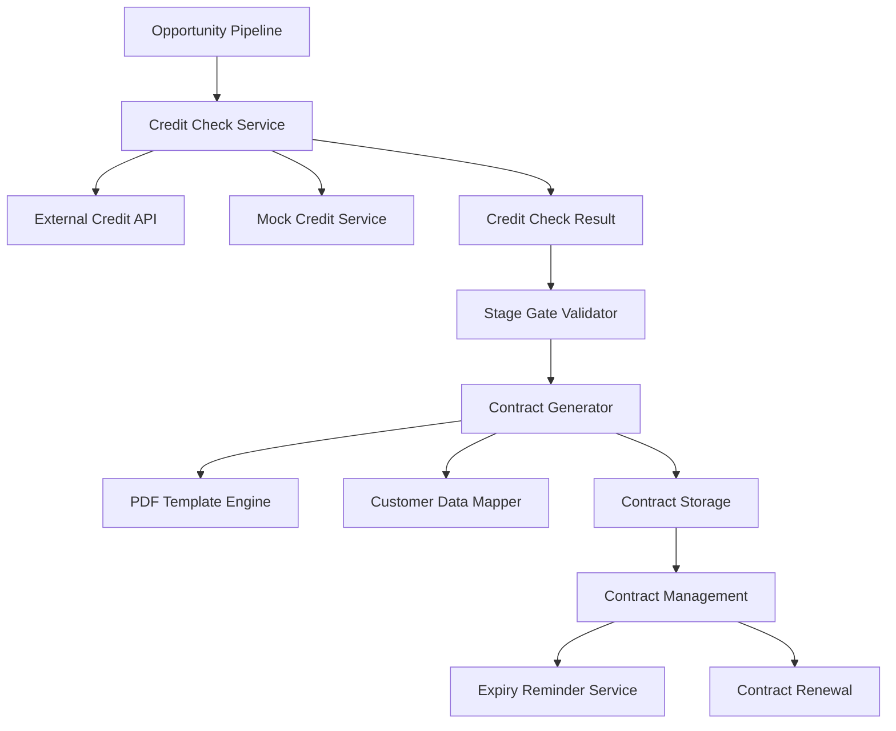

# FC-011: Bonitätsprüfung & Vertragsmanagement Tech Concept 💰

**Feature Code:** FC-011  
**Feature-Typ:** 🔀 FULLSTACK  
**Status:** 📋 TECH CONCEPT - Bereit für Implementation  
**Geschätzter Aufwand:** 8-10 Tage (Bonitätsprüfung + PDF-Generator + Vertragsmanagement)  
**Priorität:** HOCH - Kritisch für Angebotsprozess & Risikominimierung  
**ROI:** 90% weniger Zahlungsausfälle, 15 Min → 1 Min Vertragserstellung  

---

## 📋 CLAUDE-OPTIMIERTE NAVIGATION (15-Min Context)

**Dieses Dokument ist in 15-Minuten-Chunks für Claude optimiert:**

### 🚀 QUICK START (5 Min)
- [🎯 Problem & Lösung](#problem--lösung)
- [🏗️ Credit Check Architecture](#credit-check-architecture)
- [📄 Contract Generation System](#contract-generation-system)

### 💻 CORE IMPLEMENTATION (10 Min)
- [🔧 Backend Services](#backend-services)
- [⚛️ Frontend Integration](#frontend-integration)
- [📊 Stage-Gate Integration](#stage-gate-integration)

### 🔗 INTEGRATION (5 Min)
- [🧩 Dependencies](#dependencies--integration)
- [🛡️ Security & Permissions](#security--permissions)
- [🧭 Navigation](#navigation--verweise)

---

## 🎯 PROBLEM & LÖSUNG

### 🚨 Business Problem
**Keine Bonitätsprüfung = Zahlungsrisiko, manuelle Vertragserstellung = Zeitverlust**

**Konkreter Pain Point:**
- Zahlungsausfälle durch ungeprüfte Kunden-Bonität
- 15 Minuten manuelle Vertragserstellung pro Kunde
- Verträge laufen unbemerkt ab (fehlende Erinnerungen)
- Inkonsistente Dokumentation und Formatierung

### ✅ Unsere Lösung
**Integrierte Bonitätsprüfung + automatische PDF-Generierung mit Kundendaten**

**4 Kern-Komponenten:**
1. **Credit Check Service** - Automatisierte Bonitätsprüfung mit externen APIs
2. **Contract Generator** - Template-basierte PDF-Generierung
3. **Stage-Gate Integration** - Bonitätsprüfung als Opportunity-Stage
4. **Contract Management** - Speicherung, Erinnerungen, Verlängerung

---

## 🏗️ CREDIT CHECK ARCHITECTURE

### 📐 System-Architektur



### 🔍 Credit Check Service Design

```java
// Core Credit Check Interface
public interface CreditCheckService {
    CompletableFuture<CreditCheckResult> checkCredit(CreditCheckRequest request);
    boolean isAvailable();
    String getProviderName();
}

// Credit Check Result
public class CreditCheckResult {
    private final UUID customerId;
    private final CreditStatus status;
    private final BigDecimal creditScore; // 0-100
    private final Money approvedCreditLimit;
    private final RiskLevel riskLevel;
    private final LocalDateTime validUntil;
    private final String providerReference;
    private final List<CreditCheckNote> notes;
    private final Map<String, Object> rawData;
    
    public enum CreditStatus {
        APPROVED,
        REJECTED,
        MANUAL_REVIEW_REQUIRED,
        INSUFFICIENT_DATA
    }
    
    public enum RiskLevel {
        LOW(0.05),     // 5% Ausfallwahrscheinlichkeit
        MEDIUM(0.15),  // 15% Ausfallwahrscheinlichkeit  
        HIGH(0.35),    // 35% Ausfallwahrscheinlichkeit
        CRITICAL(0.60); // 60% Ausfallwahrscheinlichkeit
        
        private final double defaultProbability;
    }
}
```

### 🤖 Mock Credit Service (Phase 1)

```java
@ApplicationScoped
@Named("mock-credit-service")
public class MockCreditCheckService implements CreditCheckService {
    
    @Inject
    @ConfigProperty(name = "credit-check.mock.enabled", defaultValue = "true")
    boolean mockEnabled;
    
    @Override
    public CompletableFuture<CreditCheckResult> checkCredit(CreditCheckRequest request) {
        return CompletableFuture.supplyAsync(() -> {
            // Simulate API call delay
            try {
                Thread.sleep(ThreadLocalRandom.current().nextInt(1000, 3000));
            } catch (InterruptedException e) {
                Thread.currentThread().interrupt();
            }
            
            var customer = request.getCustomer();
            var score = calculateMockScore(customer);
            var creditLimit = calculateCreditLimit(customer, score);
            
            return CreditCheckResult.builder()
                .customerId(customer.getId())
                .status(determineCreditStatus(score))
                .creditScore(score)
                .approvedCreditLimit(creditLimit)
                .riskLevel(determineRiskLevel(score))
                .validUntil(LocalDateTime.now().plusMonths(12))
                .providerReference("MOCK-" + UUID.randomUUID().toString().substring(0, 8))
                .notes(generateMockNotes(customer, score))
                .rawData(Map.of(
                    "algorithm", "MockCreditScoring_v1.0",
                    "factors", Map.of(
                        "revenue_score", score * 0.6,
                        "industry_score", score * 0.3,
                        "age_score", score * 0.1
                    )
                ))
                .build();
        });
    }
    
    private BigDecimal calculateMockScore(Customer customer) {
        // Basis-Score basierend auf Umsatz
        var revenueScore = Math.min(70, customer.getAnnualRevenue()
            .divide(BigDecimal.valueOf(100000), RoundingMode.HALF_UP)
            .multiply(BigDecimal.valueOf(10)));
        
        // Industry-Bonus/Malus
        var industryMultiplier = getIndustryMultiplier(customer.getIndustry());
        
        // Company Age Bonus (wenn verfügbar)
        var ageBonus = customer.getFoundedYear() != null ? 
            Math.min(15, LocalDate.now().getYear() - customer.getFoundedYear()) : 10;
        
        // Zufälliger Faktor für Realismus ±10
        var randomFactor = ThreadLocalRandom.current().nextInt(-10, 11);
        
        var finalScore = revenueScore.add(BigDecimal.valueOf(ageBonus))
            .multiply(industryMultiplier)
            .add(BigDecimal.valueOf(randomFactor));
        
        return finalScore.max(BigDecimal.ZERO).min(BigDecimal.valueOf(100));
    }
    
    private BigDecimal getIndustryMultiplier(String industry) {
        return switch (industry.toLowerCase()) {
            case "banking", "insurance" -> BigDecimal.valueOf(1.2);
            case "healthcare", "education" -> BigDecimal.valueOf(1.1);
            case "retail", "gastronomie" -> BigDecimal.valueOf(0.9);
            case "startup", "tech" -> BigDecimal.valueOf(0.8);
            default -> BigDecimal.ONE;
        };
    }
    
    private Money calculateCreditLimit(Customer customer, BigDecimal score) {
        // Base limit: 20% des Jahresumsatzes
        var baseLimit = customer.getAnnualRevenue().multiply(BigDecimal.valueOf(0.2));
        
        // Score-Modifier: 50-150% basierend auf Score
        var scoreModifier = score.divide(BigDecimal.valueOf(100), 2, RoundingMode.HALF_UP)
            .add(BigDecimal.valueOf(0.5));
        
        var finalLimit = baseLimit.multiply(scoreModifier);
        
        // Minimum 5.000€, Maximum 500.000€
        finalLimit = finalLimit.max(BigDecimal.valueOf(5000));
        finalLimit = finalLimit.min(BigDecimal.valueOf(500000));
        
        return Money.of(finalLimit, "EUR");
    }
}
```

---

## 📄 CONTRACT GENERATION SYSTEM

### 📝 Contract Template Engine

```java
@ApplicationScoped
public class ContractTemplateEngine {
    
    @Inject
    @ConfigProperty(name = "contract.templates.path", defaultValue = "contracts/templates")
    String templatesPath;
    
    @Inject
    CustomerService customerService;
    
    @Inject
    CreditCheckService creditCheckService;
    
    private final FreeMarkerConfiguration freemarkerConfig;
    
    @PostConstruct
    public void initializeTemplates() {
        freemarkerConfig = new Configuration(Configuration.VERSION_2_3_31);
        freemarkerConfig.setDirectoryForTemplateLoading(new File(templatesPath));
        freemarkerConfig.setDefaultEncoding("UTF-8");
        freemarkerConfig.setTemplateExceptionHandler(TemplateExceptionHandler.RETHROW_HANDLER);
    }
    
    public ContractDocument generateContract(ContractGenerationRequest request) {
        try {
            // 1. Validierung
            validateRequest(request);
            
            // 2. Template laden
            var template = freemarkerConfig.getTemplate(
                request.getContractType().getTemplateName()
            );
            
            // 3. Datenmodell aufbauen
            var dataModel = buildContractDataModel(request);
            
            // 4. HTML generieren
            var htmlContent = generateHtml(template, dataModel);
            
            // 5. PDF konvertieren
            var pdfBytes = convertToPdf(htmlContent);
            
            // 6. Dokument speichern
            var document = saveContractDocument(request, pdfBytes, dataModel);
            
            return document;
            
        } catch (Exception e) {
            log.error("Contract generation failed for request: " + request, e);
            throw new ContractGenerationException("Failed to generate contract", e);
        }
    }
    
    private Map<String, Object> buildContractDataModel(ContractGenerationRequest request) {
        var customer = customerService.findById(request.getCustomerId())
            .orElseThrow(() -> new CustomerNotFoundException(request.getCustomerId()));
        
        var creditCheck = request.getCreditCheckId() != null ?
            creditCheckService.getCreditCheckResult(request.getCreditCheckId()) :
            null;
        
        var model = new HashMap<String, Object>();
        
        // Kundendaten
        model.put("customer", Map.of(
            "name", customer.getName(),
            "number", customer.getCustomerNumber(),
            "address", formatAddress(customer),
            "industry", customer.getIndustry(),
            "revenue", formatMoney(customer.getAnnualRevenue()),
            "contactPerson", customer.getContactPerson(),
            "email", customer.getEmail(),
            "phone", customer.getPhone()
        ));
        
        // Vertragsdaten
        model.put("contract", Map.of(
            "type", request.getContractType(),
            "number", generateContractNumber(),
            "startDate", formatDate(request.getStartDate()),
            "endDate", formatDate(request.getEndDate()),
            "duration", ChronoUnit.MONTHS.between(request.getStartDate(), request.getEndDate()),
            "createdDate", formatDate(LocalDate.now()),
            "validUntil", formatDate(request.getEndDate())
        ));
        
        // Bonitätsdaten (wenn vorhanden)
        if (creditCheck != null) {
            model.put("creditCheck", Map.of(
                "status", creditCheck.getStatus(),
                "creditLimit", formatMoney(creditCheck.getApprovedCreditLimit()),
                "riskLevel", creditCheck.getRiskLevel(),
                "score", creditCheck.getCreditScore(),
                "validUntil", formatDate(creditCheck.getValidUntil().toLocalDate())
            ));
        }
        
        // Rabattstaffel
        var discountTier = calculateDiscountTier(customer);
        model.put("discount", Map.of(
            "tier", discountTier.getName(),
            "percentage", discountTier.getPercentage(),
            "conditions", discountTier.getConditions()
        ));
        
        // Systemdaten
        model.put("system", Map.of(
            "companyName", "FreshPlan GmbH",
            "companyAddress", "Musterstraße 123, 12345 Musterhausen",
            "companyPhone", "+49 123 456789",
            "companyEmail", "info@freshplan.de",
            "generatedBy", getCurrentUser().getFullName(),
            "generatedAt", formatDateTime(LocalDateTime.now())
        ));
        
        return model;
    }
    
    private String generateHtml(Template template, Map<String, Object> dataModel) throws Exception {
        var writer = new StringWriter();
        template.process(dataModel, writer);
        return writer.toString();
    }
    
    private byte[] convertToPdf(String htmlContent) {
        try {
            var renderer = new ITextRenderer();
            renderer.setDocumentFromString(htmlContent);
            renderer.layout();
            
            var outputStream = new ByteArrayOutputStream();
            renderer.createPDF(outputStream);
            
            return outputStream.toByteArray();
            
        } catch (Exception e) {
            throw new PdfGenerationException("Failed to convert HTML to PDF", e);
        }
    }
}
```

### 📋 Contract Template (FreeMarker)

```html
<!-- contracts/templates/partnership_agreement.ftl -->
<!DOCTYPE html>
<html>
<head>
    <meta charset="UTF-8">
    <title>Partnerschaftsvereinbarung</title>
    <style>
        body { font-family: Arial, sans-serif; font-size: 12px; line-height: 1.4; }
        .header { text-align: center; margin-bottom: 30px; }
        .company-logo { width: 200px; height: auto; }
        .title { font-size: 18px; font-weight: bold; margin: 20px 0; }
        .section { margin: 20px 0; }
        .signature-box { border: 1px solid #ccc; padding: 20px; margin: 20px 0; }
        .footer { position: fixed; bottom: 0; width: 100%; font-size: 10px; }
        .highlight { background-color: #ffff99; }
        table { width: 100%; border-collapse: collapse; }
        td, th { border: 1px solid #ddd; padding: 8px; text-align: left; }
        th { background-color: #f2f2f2; }
    </style>
</head>
<body>
    <div class="header">
        
        <h1 class="title">Partnerschaftsvereinbarung</h1>
        <p>Vertragsnummer: ${contract.number}</p>
    </div>

    <div class="section">
        <h2>Vertragsparteien</h2>
        <table>
            <tr>
                <th>Anbieter</th>
                <th>Partner</th>
            </tr>
            <tr>
                <td>
                    ${system.companyName}<br>
                    ${system.companyAddress}<br>
                    Tel: ${system.companyPhone}<br>
                    E-Mail: ${system.companyEmail}
                </td>
                <td>
                    ${customer.name}<br>
                    ${customer.address}<br>
                    <#if customer.phone??>Tel: ${customer.phone}<br></#if>
                    <#if customer.email??>E-Mail: ${customer.email}</#if><br>
                    <strong>Kundennummer: ${customer.number}</strong>
                </td>
            </tr>
        </table>
    </div>

    <div class="section">
        <h2>Vertragslaufzeit</h2>
        <p>Dieser Vertrag gilt vom <strong>${contract.startDate}</strong> bis zum 
           <strong>${contract.endDate}</strong> (${contract.duration} Monate).</p>
        <p>Der Vertrag verlängert sich automatisch um 12 Monate, wenn er nicht 
           3 Monate vor Ablauf schriftlich gekündigt wird.</p>
    </div>

    <#if creditCheck??>
    <div class="section">
        <h2>Bonitätsprüfung & Kreditlimit</h2>
        <table>
            <tr>
                <th>Bonitätsstatus</th>
                <td class="<#if creditCheck.status == 'APPROVED'>highlight</#if>">
                    ${creditCheck.status}
                </td>
            </tr>
            <tr>
                <th>Kreditlimit</th>
                <td><strong>${creditCheck.creditLimit}</strong></td>
            </tr>
            <tr>
                <th>Risikostufe</th>
                <td>${creditCheck.riskLevel}</td>
            </tr>
            <tr>
                <th>Gültig bis</th>
                <td>${creditCheck.validUntil}</td>
            </tr>
        </table>
    </div>
    </#if>

    <div class="section">
        <h2>Rabattstaffel</h2>
        <p>Der Partner erhält folgende Konditionen:</p>
        <table>
            <tr>
                <th>Rabattstufe</th>
                <th>Rabatt</th>
                <th>Bedingungen</th>
            </tr>
            <tr>
                <td><strong>${discount.tier}</strong></td>
                <td><strong>${discount.percentage}%</strong></td>
                <td>${discount.conditions}</td>
            </tr>
        </table>
    </div>

    <div class="section">
        <h2>Zahlungsbedingungen</h2>
        <ul>
            <li>Zahlungsziel: 30 Tage netto</li>
            <li>Bei Zahlung innerhalb 14 Tagen: 2% Skonto</li>
            <#if creditCheck??>
            <li>Kreditlimit: ${creditCheck.creditLimit}</li>
            <li>Bei Überschreitung: Vorauskasse erforderlich</li>
            </#if>
        </ul>
    </div>

    <div class="signature-box">
        <h3>Unterschriften</h3>
        <table style="border: none;">
            <tr style="border: none;">
                <td style="border: none; width: 50%;">
                    <p>Für ${system.companyName}:</p>
                    <br><br>
                    <p>_________________________</p>
                    <p>Ort, Datum, Unterschrift</p>
                </td>
                <td style="border: none; width: 50%;">
                    <p>Für ${customer.name}:</p>
                    <br><br>
                    <p>_________________________</p>
                    <p>Ort, Datum, Unterschrift</p>
                </td>
            </tr>
        </table>
    </div>

    <div class="footer">
        <p>Erstellt am ${system.generatedAt} von ${system.generatedBy} | 
           Vertragsnummer: ${contract.number}</p>
    </div>
</body>
</html>
```

---

## 🔧 BACKEND SERVICES

### 🏭 Opportunity Stage Gate Service

```java
@ApplicationScoped
public class OpportunityStageGateService {
    
    @Inject
    CreditCheckService creditCheckService;
    
    @Inject
    ContractService contractService;
    
    @Inject
    OpportunityRepository opportunityRepository;
    
    public StageTransitionResult validateStageTransition(
            UUID opportunityId, 
            OpportunityStage fromStage, 
            OpportunityStage toStage) {
        
        var opportunity = opportunityRepository.findById(opportunityId)
            .orElseThrow(() -> new OpportunityNotFoundException(opportunityId));
        
        // Stage-spezifische Validierung
        return switch (toStage) {
            case CREDIT_CHECKED -> validateCreditCheckStage(opportunity);
            case PROPOSAL -> validateProposalStage(opportunity);
            case CONTRACT -> validateContractStage(opportunity);
            default -> StageTransitionResult.allowed();
        };
    }
    
    private StageTransitionResult validateCreditCheckStage(Opportunity opportunity) {
        var customer = opportunity.getCustomer();
        
        // Prüfe ob bereits eine gültige Bonitätsprüfung existiert
        var existingCheck = creditCheckService.getLatestCreditCheck(customer.getId());
        if (existingCheck.isPresent() && existingCheck.get().isValid()) {
            return StageTransitionResult.allowed()
                .withMessage("Existing valid credit check found");
        }
        
        // Prüfe ob Mindestdaten für Bonitätsprüfung vorhanden
        var validationErrors = new ArrayList<String>();
        
        if (customer.getAnnualRevenue() == null || 
            customer.getAnnualRevenue().compareTo(BigDecimal.ZERO) <= 0) {
            validationErrors.add("Jahresumsatz ist erforderlich für Bonitätsprüfung");
        }
        
        if (StringUtils.isBlank(customer.getCompanyRegistrationNumber())) {
            validationErrors.add("Handelsregisternummer ist erforderlich");
        }
        
        if (customer.getAddress() == null || !customer.getAddress().isComplete()) {
            validationErrors.add("Vollständige Firmenadresse ist erforderlich");
        }
        
        if (!validationErrors.isEmpty()) {
            return StageTransitionResult.blocked(validationErrors);
        }
        
        return StageTransitionResult.requiresAction(
            "Bonitätsprüfung erforderlich",
            StageAction.CREDIT_CHECK
        );
    }
    
    private StageTransitionResult validateProposalStage(Opportunity opportunity) {
        // Prüfe Bonitätsprüfung
        var creditCheck = creditCheckService.getLatestCreditCheck(
            opportunity.getCustomer().getId()
        );
        
        if (creditCheck.isEmpty()) {
            return StageTransitionResult.blocked(
                "Bonitätsprüfung muss vor Angebotserstellung durchgeführt werden"
            );
        }
        
        var check = creditCheck.get();
        if (!check.isValid()) {
            return StageTransitionResult.blocked(
                "Bonitätsprüfung ist abgelaufen oder ungültig"
            );
        }
        
        if (check.getStatus() == CreditStatus.REJECTED) {
            return StageTransitionResult.blocked(
                "Bonitätsprüfung negativ - Angebot nur nach manueller Freigabe möglich"
            );
        }
        
        if (check.getStatus() == CreditStatus.MANUAL_REVIEW_REQUIRED) {
            return StageTransitionResult.requiresApproval(
                "Manuelle Prüfung der Bonität erforderlich",
                ApprovalLevel.MANAGER
            );
        }
        
        return StageTransitionResult.allowed();
    }
    
    private StageTransitionResult validateContractStage(Opportunity opportunity) {
        // Prüfe ob gültiger Vertrag existiert
        var existingContract = contractService.getActiveContract(
            opportunity.getCustomer().getId()
        );
        
        if (existingContract.isPresent()) {
            var contract = existingContract.get();
            if (contract.isValid() && !contract.isExpiringSoon()) {
                return StageTransitionResult.allowed()
                    .withMessage("Valid contract exists");
            }
        }
        
        return StageTransitionResult.requiresAction(
            "Vertrag muss erstellt oder verlängert werden",
            StageAction.CREATE_CONTRACT
        );
    }
}

// Stage Transition Result
public class StageTransitionResult {
    private final boolean allowed;
    private final List<String> blockingReasons;
    private final String message;
    private final StageAction requiredAction;
    private final ApprovalLevel requiredApproval;
    
    public static StageTransitionResult allowed() {
        return new StageTransitionResult(true, List.of(), null, null, null);
    }
    
    public static StageTransitionResult blocked(String reason) {
        return blocked(List.of(reason));
    }
    
    public static StageTransitionResult blocked(List<String> reasons) {
        return new StageTransitionResult(false, reasons, null, null, null);
    }
    
    public static StageTransitionResult requiresAction(String message, StageAction action) {
        return new StageTransitionResult(false, List.of(), message, action, null);
    }
    
    public static StageTransitionResult requiresApproval(String message, ApprovalLevel level) {
        return new StageTransitionResult(false, List.of(), message, null, level);
    }
}

public enum StageAction {
    CREDIT_CHECK,
    CREATE_CONTRACT,
    RENEW_CONTRACT,
    MANUAL_APPROVAL
}

public enum ApprovalLevel {
    MANAGER,
    DIRECTOR,
    ADMIN
}
```

### 🔄 Contract Management Service

```java
@ApplicationScoped
@Transactional
public class ContractManagementService {
    
    @Inject
    ContractRepository contractRepository;
    
    @Inject
    NotificationService notificationService;
    
    @Inject
    TaskService taskService;
    
    @Inject
    ContractTemplateEngine templateEngine;
    
    public ContractDocument createContract(CreateContractRequest request) {
        // Validierung
        validateContractRequest(request);
        
        // Bestehenden Vertrag prüfen
        var existingContract = contractRepository.findActiveByCustomerId(request.getCustomerId());
        if (existingContract.isPresent()) {
            var existing = existingContract.get();
            if (request.isOverwriteExisting()) {
                existing.setStatus(ContractStatus.SUPERSEDED);
                contractRepository.persist(existing);
            } else {
                throw new ContractAlreadyExistsException(
                    "Active contract exists for customer: " + request.getCustomerId()
                );
            }
        }
        
        // Contract Generation Request aufbauen
        var generationRequest = ContractGenerationRequest.builder()
            .customerId(request.getCustomerId())
            .contractType(request.getContractType())
            .startDate(request.getStartDate())
            .endDate(request.getEndDate())
            .creditCheckId(request.getCreditCheckId())
            .specialConditions(request.getSpecialConditions())
            .createdBy(getCurrentUser().getId())
            .build();
        
        // PDF generieren
        var document = templateEngine.generateContract(generationRequest);
        
        // Contract Entity erstellen
        var contract = Contract.builder()
            .customerId(request.getCustomerId())
            .contractNumber(document.getContractNumber())
            .type(request.getContractType())
            .status(ContractStatus.ACTIVE)
            .startDate(request.getStartDate())
            .endDate(request.getEndDate())
            .documentPath(document.getFilePath())
            .documentHash(document.getFileHash())
            .creditCheckId(request.getCreditCheckId())
            .createdBy(getCurrentUser().getId())
            .createdAt(LocalDateTime.now())
            .build();
        
        contractRepository.persist(contract);
        
        // Activity Log
        activityService.logActivity(ActivityEvent.builder()
            .type(ActivityType.CONTRACT_CREATED)
            .customerId(request.getCustomerId())
            .description("Contract created: " + document.getContractNumber())
            .metadata(Map.of(
                "contractType", request.getContractType().toString(),
                "validUntil", request.getEndDate().toString()
            ))
            .build());
        
        // Erinnerung für Verlängerung planen
        scheduleExpiryReminder(contract);
        
        return document;
    }
    
    public RenewalResult renewContract(UUID contractId, RenewContractRequest request) {
        var existingContract = contractRepository.findById(contractId)
            .orElseThrow(() -> new ContractNotFoundException(contractId));
        
        if (existingContract.getStatus() != ContractStatus.ACTIVE) {
            throw new ContractNotActiveException("Contract is not active: " + contractId);
        }
        
        // Neuen Vertrag erstellen
        var renewalRequest = CreateContractRequest.builder()
            .customerId(existingContract.getCustomerId())
            .contractType(existingContract.getType())
            .startDate(request.getNewStartDate())
            .endDate(request.getNewEndDate())
            .creditCheckId(request.getNewCreditCheckId()) // Neue Bonitätsprüfung
            .specialConditions(request.getUpdatedConditions())
            .isOverwriteExisting(true)
            .build();
        
        var newDocument = createContract(renewalRequest);
        
        // Alten Vertrag als abgelöst markieren
        existingContract.setStatus(ContractStatus.RENEWED);
        existingContract.setRenewedBy(newDocument.getContractNumber());
        contractRepository.persist(existingContract);
        
        return RenewalResult.builder()
            .oldContractId(contractId)
            .newDocument(newDocument)
            .renewalDate(LocalDateTime.now())
            .build();
    }
    
    @Scheduled(cron = "0 9 * * *") // Täglich 9 Uhr
    public void checkExpiringContracts() {
        var thresholds = List.of(30, 14, 7, 1); // Tage vor Ablauf
        
        for (var threshold : thresholds) {
            var expiringContracts = contractRepository.findExpiringWithin(threshold);
            
            for (var contract : expiringContracts) {
                if (!hasReminderBeenSent(contract, threshold)) {
                    sendExpiryReminder(contract, threshold);
                    createRenewalTask(contract, threshold);
                    markReminderSent(contract, threshold);
                }
            }
        }
    }
    
    private void sendExpiryReminder(Contract contract, int daysUntilExpiry) {
        var customer = customerService.findById(contract.getCustomerId());
        var salesRep = userService.findById(customer.getSalesRepId());
        
        var notification = Notification.builder()
            .userId(salesRep.getId())
            .type(NotificationType.CONTRACT_EXPIRING)
            .title("Vertrag läuft ab: " + customer.getName())
            .message(String.format(
                "Der Vertrag %s läuft in %d Tagen ab (%s)",
                contract.getContractNumber(),
                daysUntilExpiry,
                contract.getEndDate().format(DateTimeFormatter.ofPattern("dd.MM.yyyy"))
            ))
            .actionUrl("/customers/" + customer.getId() + "/contracts")
            .priority(daysUntilExpiry <= 7 ? Priority.HIGH : Priority.MEDIUM)
            .build();
        
        notificationService.send(notification);
    }
    
    private void createRenewalTask(Contract contract, int daysUntilExpiry) {
        var customer = customerService.findById(contract.getCustomerId());
        
        var task = Task.builder()
            .title("Vertrag verlängern: " + customer.getName())
            .description(String.format(
                "Vertrag %s läuft am %s ab. Bitte Verlängerung vorbereiten.",
                contract.getContractNumber(),
                contract.getEndDate().format(DateTimeFormatter.ofPattern("dd.MM.yyyy"))
            ))
            .assignedTo(customer.getSalesRepId())
            .dueDate(contract.getEndDate().minusDays(daysUntilExpiry / 2))
            .priority(daysUntilExpiry <= 7 ? Priority.HIGH : Priority.MEDIUM)
            .category(TaskCategory.CONTRACT_MANAGEMENT)
            .relatedEntityType("Contract")
            .relatedEntityId(contract.getId())
            .build();
        
        taskService.createTask(task);
    }
}
```

---

## ⚛️ FRONTEND INTEGRATION

### 🎛️ Credit Check Dialog Component

```typescript
// frontend/src/features/opportunities/components/CreditCheckDialog.tsx
import React, { useState } from 'react';
import {
  Dialog, DialogTitle, DialogContent, DialogActions,
  Button, Alert, CircularProgress, Box, Typography,
  Card, CardContent, Chip, LinearProgress,
  Table, TableBody, TableCell, TableRow
} from '@mui/material';
import { SecurityRounded, CheckCircle, Warning, Error } from '@mui/icons-material';
import { useCreditCheckMutation } from '../hooks/useCreditCheck';
import { Customer, CreditCheckResult, CreditStatus } from '../types/CreditTypes';

interface CreditCheckDialogProps {
  open: boolean;
  customer: Customer;
  onClose: () => void;
  onSuccess: (result: CreditCheckResult) => void;
}

export const CreditCheckDialog: React.FC<CreditCheckDialogProps> = ({
  open,
  customer,
  onClose,
  onSuccess
}) => {
  const [step, setStep] = useState<'confirm' | 'checking' | 'result'>('confirm');
  const [result, setResult] = useState<CreditCheckResult | null>(null);
  
  const { mutate: performCreditCheck, loading } = useCreditCheckMutation();

  const handleStartCheck = () => {
    setStep('checking');
    
    performCreditCheck({
      customerId: customer.id,
      requestedBy: 'current-user', // TODO: Get from auth context
      checkType: 'STANDARD'
    }, {
      onSuccess: (data) => {
        setResult(data);
        setStep('result');
      },
      onError: (error) => {
        console.error('Credit check failed:', error);
        // TODO: Show error dialog
      }
    });
  };

  const handleAcceptResult = () => {
    if (result) {
      onSuccess(result);
      onClose();
    }
  };

  const getStatusColor = (status: CreditStatus) => {
    switch (status) {
      case 'APPROVED': return 'success';
      case 'REJECTED': return 'error';
      case 'MANUAL_REVIEW_REQUIRED': return 'warning';
      default: return 'info';
    }
  };

  const getStatusIcon = (status: CreditStatus) => {
    switch (status) {
      case 'APPROVED': return <CheckCircle />;
      case 'REJECTED': return <Error />;
      case 'MANUAL_REVIEW_REQUIRED': return <Warning />;
      default: return <SecurityRounded />;
    }
  };

  const getRiskLevelColor = (riskLevel: string) => {
    switch (riskLevel?.toLowerCase()) {
      case 'low': return 'success';
      case 'medium': return 'warning';
      case 'high': return 'error';
      case 'critical': return 'error';
      default: return 'default';
    }
  };

  return (
    <Dialog open={open} onClose={onClose} maxWidth="md" fullWidth>
      <DialogTitle sx={{ display: 'flex', alignItems: 'center', gap: 1 }}>
        <SecurityRounded />
        Bonitätsprüfung - {customer.name}
      </DialogTitle>

      <DialogContent>
        {step === 'confirm' && (
          <Box>
            <Alert severity="info" sx={{ mb: 3 }}>
              Eine Bonitätsprüfung ist erforderlich, bevor ein Angebot erstellt werden kann.
            </Alert>

            <Card variant="outlined">
              <CardContent>
                <Typography variant="h6" gutterBottom>
                  Kundendaten für Bonitätsprüfung
                </Typography>
                
                <Table size="small">
                  <TableBody>
                    <TableRow>
                      <TableCell><strong>Firmenname:</strong></TableCell>
                      <TableCell>{customer.name}</TableCell>
                    </TableRow>
                    <TableRow>
                      <TableCell><strong>Kundennummer:</strong></TableCell>
                      <TableCell>{customer.customerNumber}</TableCell>
                    </TableRow>
                    <TableRow>
                      <TableCell><strong>Jahresumsatz:</strong></TableCell>
                      <TableCell>{customer.annualRevenue?.toLocaleString('de-DE')} €</TableCell>
                    </TableRow>
                    <TableRow>
                      <TableCell><strong>Branche:</strong></TableCell>
                      <TableCell>{customer.industry}</TableCell>
                    </TableRow>
                    <TableRow>
                      <TableCell><strong>Adresse:</strong></TableCell>
                      <TableCell>{customer.address?.street}<br />{customer.address?.city}</TableCell>
                    </TableRow>
                  </TableBody>
                </Table>
              </CardContent>
            </Card>
          </Box>
        )}

        {step === 'checking' && (
          <Box sx={{ textAlign: 'center', py: 4 }}>
            <CircularProgress size={60} sx={{ mb: 2 }} />
            <Typography variant="h6" gutterBottom>
              Bonitätsprüfung läuft...
            </Typography>
            <Typography variant="body2" color="text.secondary">
              Dies kann einige Sekunden dauern. Bitte warten Sie.
            </Typography>
            <LinearProgress sx={{ mt: 2, width: '100%' }} />
          </Box>
        )}

        {step === 'result' && result && (
          <Box>
            <Alert 
              severity={result.status === 'APPROVED' ? 'success' : 
                       result.status === 'REJECTED' ? 'error' : 'warning'}
              sx={{ mb: 3 }}
              icon={getStatusIcon(result.status)}
            >
              <Typography variant="h6">
                Bonitätsprüfung abgeschlossen
              </Typography>
              Status: {result.status === 'APPROVED' ? 'Genehmigt' :
                      result.status === 'REJECTED' ? 'Abgelehnt' : 'Manuelle Prüfung erforderlich'}
            </Alert>

            <Card variant="outlined">
              <CardContent>
                <Typography variant="h6" gutterBottom>
                  Prüfungsergebnis
                </Typography>
                
                <Table size="small">
                  <TableBody>
                    <TableRow>
                      <TableCell><strong>Bonitäts-Score:</strong></TableCell>
                      <TableCell>
                        <Box sx={{ display: 'flex', alignItems: 'center', gap: 1 }}>
                          <LinearProgress 
                            variant="determinate" 
                            value={result.creditScore} 
                            sx={{ width: 100, mr: 1 }}
                            color={result.creditScore > 70 ? 'success' : 
                                   result.creditScore > 40 ? 'warning' : 'error'}
                          />
                          {result.creditScore}/100
                        </Box>
                      </TableCell>
                    </TableRow>
                    <TableRow>
                      <TableCell><strong>Kreditlimit:</strong></TableCell>
                      <TableCell>
                        <Typography variant="h6" color="primary">
                          {result.approvedCreditLimit?.toLocaleString('de-DE')} €
                        </Typography>
                      </TableCell>
                    </TableRow>
                    <TableRow>
                      <TableCell><strong>Risikostufe:</strong></TableCell>
                      <TableCell>
                        <Chip 
                          label={result.riskLevel}
                          color={getRiskLevelColor(result.riskLevel)}
                          size="small"
                        />
                      </TableCell>
                    </TableRow>
                    <TableRow>
                      <TableCell><strong>Gültig bis:</strong></TableCell>
                      <TableCell>
                        {new Date(result.validUntil).toLocaleDateString('de-DE')}
                      </TableCell>
                    </TableRow>
                    <TableRow>
                      <TableCell><strong>Referenz:</strong></TableCell>
                      <TableCell>
                        <Typography variant="caption" sx={{ fontFamily: 'monospace' }}>
                          {result.providerReference}
                        </Typography>
                      </TableCell>
                    </TableRow>
                  </TableBody>
                </Table>

                {result.notes && result.notes.length > 0 && (
                  <Box sx={{ mt: 2 }}>
                    <Typography variant="subtitle2" gutterBottom>
                      Hinweise:
                    </Typography>
                    {result.notes.map((note, index) => (
                      <Alert key={index} severity="info" sx={{ mt: 1 }}>
                        {note.message}
                      </Alert>
                    ))}
                  </Box>
                )}
              </CardContent>
            </Card>
          </Box>
        )}
      </DialogContent>

      <DialogActions>
        {step === 'confirm' && (
          <>
            <Button onClick={onClose}>Abbrechen</Button>
            <Button 
              variant="contained" 
              onClick={handleStartCheck}
              disabled={loading}
              startIcon={<SecurityRounded />}
            >
              Bonitätsprüfung starten
            </Button>
          </>
        )}

        {step === 'checking' && (
          <Button onClick={onClose} disabled>
            Prüfung läuft...
          </Button>
        )}

        {step === 'result' && result && (
          <>
            <Button onClick={onClose}>Schließen</Button>
            {result.status === 'APPROVED' && (
              <Button 
                variant="contained" 
                onClick={handleAcceptResult}
                color="success"
                startIcon={<CheckCircle />}
              >
                Ergebnis übernehmen
              </Button>
            )}
            {result.status === 'MANUAL_REVIEW_REQUIRED' && (
              <Button 
                variant="outlined" 
                onClick={handleAcceptResult}
                color="warning"
              >
                Zur manuellen Prüfung
              </Button>
            )}
          </>
        )}
      </DialogActions>
    </Dialog>
  );
};
```

### 📋 Contract Generation Component

```typescript
// frontend/src/features/contracts/components/ContractGeneratorDialog.tsx
import React, { useState } from 'react';
import {
  Dialog, DialogTitle, DialogContent, DialogActions,
  Button, Box, Typography, FormControl, InputLabel,
  Select, MenuItem, TextField, Alert, Card, CardContent,
  Stepper, Step, StepLabel, Divider, Chip
} from '@mui/material';
import { DatePicker } from '@mui/x-date-pickers/DatePicker';
import { Description, FileDownload, Email } from '@mui/icons-material';
import { useContractGenerationMutation } from '../hooks/useContractGeneration';
import { Customer, CreditCheckResult, ContractType } from '../types/ContractTypes';

interface ContractGeneratorDialogProps {
  open: boolean;
  customer: Customer;
  creditCheckResult?: CreditCheckResult;
  onClose: () => void;
  onSuccess: (contractDocument: any) => void;
}

export const ContractGeneratorDialog: React.FC<ContractGeneratorDialogProps> = ({
  open,
  customer,
  creditCheckResult,
  onClose,
  onSuccess
}) => {
  const [activeStep, setActiveStep] = useState(0);
  const [contractData, setContractData] = useState({
    contractType: 'PARTNERSHIP' as ContractType,
    startDate: new Date(),
    endDate: new Date(Date.now() + 365 * 24 * 60 * 60 * 1000), // +1 Jahr
    duration: 12,
    specialConditions: '',
    includeDiscountSchedule: true,
    includeTermsAndConditions: true
  });
  const [generatedDocument, setGeneratedDocument] = useState<any>(null);

  const { mutate: generateContract, loading } = useContractGenerationMutation();

  const steps = ['Vertragstyp', 'Laufzeit', 'Konditionen', 'Erstellen'];

  const handleNext = () => {
    setActiveStep(prev => prev + 1);
  };

  const handleBack = () => {
    setActiveStep(prev => prev - 1);
  };

  const handleGenerate = () => {
    generateContract({
      customerId: customer.id,
      contractType: contractData.contractType,
      startDate: contractData.startDate.toISOString(),
      endDate: contractData.endDate.toISOString(),
      creditCheckId: creditCheckResult?.id,
      specialConditions: contractData.specialConditions.trim() || undefined,
      options: {
        includeDiscountSchedule: contractData.includeDiscountSchedule,
        includeTermsAndConditions: contractData.includeTermsAndConditions
      }
    }, {
      onSuccess: (document) => {
        setGeneratedDocument(document);
        setActiveStep(steps.length); // Zeige Erfolg-Step
      },
      onError: (error) => {
        console.error('Contract generation failed:', error);
        // TODO: Show error message
      }
    });
  };

  const handleDurationChange = (months: number) => {
    const newEndDate = new Date(contractData.startDate);
    newEndDate.setMonth(newEndDate.getMonth() + months);
    
    setContractData(prev => ({
      ...prev,
      duration: months,
      endDate: newEndDate
    }));
  };

  const renderStepContent = () => {
    switch (activeStep) {
      case 0: // Vertragstyp
        return (
          <Box>
            <Typography variant="h6" gutterBottom>
              Vertragstyp auswählen
            </Typography>
            
            <FormControl fullWidth sx={{ mb: 2 }}>
              <InputLabel>Vertragstyp</InputLabel>
              <Select
                value={contractData.contractType}
                onChange={(e) => setContractData(prev => ({
                  ...prev,
                  contractType: e.target.value as ContractType
                }))}
                label="Vertragstyp"
              >
                <MenuItem value="PARTNERSHIP">Partnerschaftsvereinbarung</MenuItem>
                <MenuItem value="STANDARD">Standardvertrag</MenuItem>
                <MenuItem value="TRIAL">Testvertrag</MenuItem>
              </Select>
            </FormControl>

            {contractData.contractType === 'PARTNERSHIP' && (
              <Alert severity="info">
                Partnerschaftsvereinbarung: Bessere Konditionen, erweiterte Rabattstaffel, 
                bevorzugter Support.
              </Alert>
            )}
            {contractData.contractType === 'TRIAL' && (
              <Alert severity="warning">
                Testvertrag: Begrenzte Laufzeit von maximal 6 Monaten, 
                eingeschränkte Konditionen.
              </Alert>
            )}
          </Box>
        );

      case 1: // Laufzeit
        return (
          <Box>
            <Typography variant="h6" gutterBottom>
              Vertragslaufzeit festlegen
            </Typography>
            
            <Box sx={{ display: 'flex', gap: 2, mb: 2 }}>
              <DatePicker
                label="Startdatum"
                value={contractData.startDate}
                onChange={(date) => setContractData(prev => ({
                  ...prev,
                  startDate: date || new Date()
                }))}
                slotProps={{ textField: { fullWidth: true } }}
              />
              
              <DatePicker
                label="Enddatum"
                value={contractData.endDate}
                onChange={(date) => setContractData(prev => ({
                  ...prev,
                  endDate: date || new Date()
                }))}
                slotProps={{ textField: { fullWidth: true } }}
              />
            </Box>

            <Typography variant="subtitle2" gutterBottom>
              Schnellauswahl:
            </Typography>
            <Box sx={{ display: 'flex', gap: 1, flexWrap: 'wrap' }}>
              {[6, 12, 24, 36].map(months => (
                <Chip
                  key={months}
                  label={`${months} Monate`}
                  onClick={() => handleDurationChange(months)}
                  color={contractData.duration === months ? 'primary' : 'default'}
                  clickable
                />
              ))}
            </Box>

            <Alert severity="info" sx={{ mt: 2 }}>
              Automatische Verlängerung um weitere 12 Monate, 
              wenn nicht 3 Monate vor Ablauf gekündigt wird.
            </Alert>
          </Box>
        );

      case 2: // Konditionen
        return (
          <Box>
            <Typography variant="h6" gutterBottom>
              Besondere Konditionen
            </Typography>

            {creditCheckResult && (
              <Card variant="outlined" sx={{ mb: 2 }}>
                <CardContent>
                  <Typography variant="subtitle2" gutterBottom>
                    Bonitätsprüfung:
                  </Typography>
                  <Box sx={{ display: 'flex', gap: 1, alignItems: 'center' }}>
                    <Chip 
                      label={`Kreditlimit: ${creditCheckResult.approvedCreditLimit?.toLocaleString('de-DE')} €`}
                      color="success"
                      size="small"
                    />
                    <Chip 
                      label={`Risiko: ${creditCheckResult.riskLevel}`}
                      color={creditCheckResult.riskLevel === 'LOW' ? 'success' : 'warning'}
                      size="small"
                    />
                  </Box>
                </CardContent>
              </Card>
            )}

            <TextField
              fullWidth
              multiline
              rows={4}
              label="Besondere Vereinbarungen"
              value={contractData.specialConditions}
              onChange={(e) => setContractData(prev => ({
                ...prev,
                specialConditions: e.target.value
              }))}
              placeholder="z.B. spezielle Zahlungskonditionen, individuelle Rabatte, ..."
              sx={{ mb: 2 }}
            />

            <Box sx={{ display: 'flex', flexDirection: 'column', gap: 1 }}>
              <FormControl>
                <label>
                  <input
                    type="checkbox"
                    checked={contractData.includeDiscountSchedule}
                    onChange={(e) => setContractData(prev => ({
                      ...prev,
                      includeDiscountSchedule: e.target.checked
                    }))}
                  />
                  Rabattplan anhängen
                </label>
              </FormControl>
              
              <FormControl>
                <label>
                  <input
                    type="checkbox"
                    checked={contractData.includeTermsAndConditions}
                    onChange={(e) => setContractData(prev => ({
                      ...prev,
                      includeTermsAndConditions: e.target.checked
                    }))}
                  />
                  AGB anhängen
                </label>
              </FormControl>
            </Box>
          </Box>
        );

      case 3: // Zusammenfassung
        return (
          <Box>
            <Typography variant="h6" gutterBottom>
              Vertrag erstellen
            </Typography>
            
            <Card variant="outlined">
              <CardContent>
                <Typography variant="subtitle2" gutterBottom>
                  Zusammenfassung:
                </Typography>
                
                <Box sx={{ display: 'flex', flexDirection: 'column', gap: 1 }}>
                  <Typography variant="body2">
                    <strong>Kunde:</strong> {customer.name}
                  </Typography>
                  <Typography variant="body2">
                    <strong>Vertragstyp:</strong> {contractData.contractType}
                  </Typography>
                  <Typography variant="body2">
                    <strong>Laufzeit:</strong> {contractData.startDate.toLocaleDateString('de-DE')} 
                    bis {contractData.endDate.toLocaleDateString('de-DE')} 
                    ({contractData.duration} Monate)
                  </Typography>
                  {creditCheckResult && (
                    <Typography variant="body2">
                      <strong>Kreditlimit:</strong> {creditCheckResult.approvedCreditLimit?.toLocaleString('de-DE')} €
                    </Typography>
                  )}
                </Box>
              </CardContent>
            </Card>

            <Alert severity="warning" sx={{ mt: 2 }}>
              Der Vertrag wird als PDF generiert und kann anschließend 
              heruntergeladen oder per E-Mail versendet werden.
            </Alert>
          </Box>
        );

      default: // Erfolg
        return (
          <Box sx={{ textAlign: 'center' }}>
            <Typography variant="h6" gutterBottom color="success.main">
              Vertrag erfolgreich erstellt!
            </Typography>
            
            {generatedDocument && (
              <Card variant="outlined" sx={{ mt: 2, textAlign: 'left' }}>
                <CardContent>
                  <Typography variant="subtitle2" gutterBottom>
                    Vertragsdokument:
                  </Typography>
                  <Typography variant="body2">
                    <strong>Vertragsnummer:</strong> {generatedDocument.contractNumber}
                  </Typography>
                  <Typography variant="body2">
                    <strong>Erstellt am:</strong> {new Date(generatedDocument.createdAt).toLocaleDateString('de-DE')}
                  </Typography>
                  <Typography variant="body2">
                    <strong>Dateigröße:</strong> {Math.round(generatedDocument.fileSize / 1024)} KB
                  </Typography>
                </CardContent>
              </Card>
            )}
          </Box>
        );
    }
  };

  return (
    <Dialog open={open} onClose={onClose} maxWidth="md" fullWidth>
      <DialogTitle sx={{ display: 'flex', alignItems: 'center', gap: 1 }}>
        <Description />
        Vertrag erstellen - {customer.name}
      </DialogTitle>

      <DialogContent>
        <Stepper activeStep={activeStep} sx={{ mb: 3 }}>
          {steps.map((label) => (
            <Step key={label}>
              <StepLabel>{label}</StepLabel>
            </Step>
          ))}
        </Stepper>

        <Divider sx={{ mb: 3 }} />

        {renderStepContent()}
      </DialogContent>

      <DialogActions>
        <Button onClick={onClose}>
          {activeStep === steps.length ? 'Schließen' : 'Abbrechen'}
        </Button>
        
        {activeStep > 0 && activeStep < steps.length && (
          <Button onClick={handleBack}>
            Zurück
          </Button>
        )}
        
        {activeStep < steps.length - 1 && (
          <Button variant="contained" onClick={handleNext}>
            Weiter
          </Button>
        )}
        
        {activeStep === steps.length - 1 && (
          <Button 
            variant="contained" 
            onClick={handleGenerate}
            disabled={loading}
            startIcon={loading ? undefined : <Description />}
          >
            {loading ? 'Erstelle...' : 'Vertrag erstellen'}
          </Button>
        )}

        {activeStep === steps.length && generatedDocument && (
          <>
            <Button 
              variant="outlined" 
              startIcon={<FileDownload />}
              onClick={() => window.open(generatedDocument.downloadUrl, '_blank')}
            >
              Herunterladen
            </Button>
            <Button 
              variant="contained" 
              startIcon={<Email />}
              onClick={() => onSuccess(generatedDocument)}
            >
              Per E-Mail senden
            </Button>
          </>
        )}
      </DialogActions>
    </Dialog>
  );
};
```

---

## 📊 STAGE-GATE INTEGRATION

### 🚪 Opportunity Stage Enhancement

```typescript
// Enhanced Opportunity Stage Enum
export enum OpportunityStage {
  LEAD = 'LEAD',
  QUALIFIED = 'QUALIFIED',
  CREDIT_CHECKED = 'CREDIT_CHECKED', // NEU!
  PROPOSAL = 'PROPOSAL',
  NEGOTIATION = 'NEGOTIATION',
  CONTRACT = 'CONTRACT',
  CLOSED_WON = 'CLOSED_WON',
  CLOSED_LOST = 'CLOSED_LOST'
}

export const STAGE_CONFIG = {
  [OpportunityStage.LEAD]: {
    label: 'Neu',
    color: 'default',
    requirements: [],
    nextStages: [OpportunityStage.QUALIFIED, OpportunityStage.CLOSED_LOST]
  },
  [OpportunityStage.QUALIFIED]: {
    label: 'Qualifiziert',
    color: 'info',
    requirements: ['CONTACT_INFO_COMPLETE'],
    nextStages: [OpportunityStage.CREDIT_CHECKED, OpportunityStage.CLOSED_LOST]
  },
  [OpportunityStage.CREDIT_CHECKED]: {
    label: 'Bonität geprüft',
    color: 'success',
    requirements: ['CREDIT_CHECK_PASSED'],
    nextStages: [OpportunityStage.PROPOSAL, OpportunityStage.CLOSED_LOST],
    icon: 'SecurityRounded'
  },
  [OpportunityStage.PROPOSAL]: {
    label: 'Angebot',
    color: 'warning',
    requirements: ['CREDIT_CHECK_PASSED', 'PROPOSAL_CREATED'],
    nextStages: [OpportunityStage.NEGOTIATION, OpportunityStage.CONTRACT, OpportunityStage.CLOSED_LOST]
  },
  [OpportunityStage.CONTRACT]: {
    label: 'Vertrag',
    color: 'primary',
    requirements: ['CONTRACT_SIGNED'],
    nextStages: [OpportunityStage.CLOSED_WON]
  }
};
```

### 🎛️ Stage Gate Validator Component

```typescript
// frontend/src/features/opportunities/components/StageGateValidator.tsx
import React, { useState } from 'react';
import {
  Alert, Button, Box, Typography, List, ListItem,
  ListItemIcon, ListItemText, Dialog, DialogTitle,
  DialogContent, DialogActions, Chip
} from '@mui/material';
import {
  CheckCircle, Error, Warning, Security,
  Description, Person
} from '@mui/icons-material';
import { useStageTransitionValidation } from '../hooks/useStageTransition';
import { CreditCheckDialog } from './CreditCheckDialog';
import { ContractGeneratorDialog } from '../../contracts/components/ContractGeneratorDialog';

interface StageGateValidatorProps {
  opportunityId: string;
  currentStage: OpportunityStage;
  targetStage: OpportunityStage;
  customer: Customer;
  onStageChanged: (newStage: OpportunityStage) => void;
}

export const StageGateValidator: React.FC<StageGateValidatorProps> = ({
  opportunityId,
  currentStage,
  targetStage,
  customer,
  onStageChanged
}) => {
  const [showCreditCheck, setShowCreditCheck] = useState(false);
  const [showContractGenerator, setShowContractGenerator] = useState(false);
  const [creditCheckResult, setCreditCheckResult] = useState(null);

  const { 
    data: validationResult, 
    loading,
    refetch 
  } = useStageTransitionValidation({
    opportunityId,
    fromStage: currentStage,
    toStage: targetStage
  });

  if (loading) {
    return <Alert severity="info">Prüfe Voraussetzungen...</Alert>;
  }

  if (!validationResult) {
    return null;
  }

  if (validationResult.allowed) {
    return (
      <Alert severity="success" sx={{ mb: 2 }}>
        <Typography variant="subtitle2">
          Stage-Wechsel möglich
        </Typography>
        Alle Voraussetzungen für "{STAGE_CONFIG[targetStage].label}" erfüllt.
      </Alert>
    );
  }

  const handleRequiredAction = () => {
    switch (validationResult.requiredAction) {
      case 'CREDIT_CHECK':
        setShowCreditCheck(true);
        break;
      case 'CREATE_CONTRACT':
        setShowContractGenerator(true);
        break;
      default:
        console.warn('Unknown required action:', validationResult.requiredAction);
    }
  };

  const handleCreditCheckSuccess = (result: any) => {
    setCreditCheckResult(result);
    setShowCreditCheck(false);
    refetch(); // Re-validate stage transition
  };

  const renderBlockingReasons = () => (
    <List dense>
      {validationResult.blockingReasons.map((reason, index) => (
        <ListItem key={index}>
          <ListItemIcon>
            <Error color="error" />
          </ListItemIcon>
          <ListItemText primary={reason} />
        </ListItem>
      ))}
    </List>
  );

  const renderRequiredAction = () => {
    const actionConfig = {
      CREDIT_CHECK: {
        icon: <Security />,
        title: 'Bonitätsprüfung erforderlich',
        description: 'Vor der Angebotserstellung muss die Bonität des Kunden geprüft werden.',
        buttonText: 'Jetzt prüfen',
        buttonColor: 'primary' as const
      },
      CREATE_CONTRACT: {
        icon: <Description />,
        title: 'Vertrag erstellen',
        description: 'Ein gültiger Vertrag muss erstellt oder verlängert werden.',
        buttonText: 'Vertrag erstellen',
        buttonColor: 'success' as const
      },
      MANUAL_APPROVAL: {
        icon: <Person />,
        title: 'Manuelle Freigabe erforderlich',
        description: 'Diese Transaktion benötigt eine manuelle Freigabe durch einen Manager.',
        buttonText: 'Freigabe anfordern',
        buttonColor: 'warning' as const
      }
    };

    const config = actionConfig[validationResult.requiredAction];
    if (!config) return null;

    return (
      <Box sx={{ display: 'flex', alignItems: 'center', gap: 2 }}>
        {config.icon}
        <Box sx={{ flexGrow: 1 }}>
          <Typography variant="subtitle2">{config.title}</Typography>
          <Typography variant="body2" color="text.secondary">
            {config.description}
          </Typography>
        </Box>
        <Button
          variant="contained"
          color={config.buttonColor}
          onClick={handleRequiredAction}
        >
          {config.buttonText}
        </Button>
      </Box>
    );
  };

  return (
    <Box>
      {validationResult.blockingReasons.length > 0 && (
        <Alert severity="error" sx={{ mb: 2 }}>
          <Typography variant="subtitle2" gutterBottom>
            Stage-Wechsel blockiert
          </Typography>
          Folgende Voraussetzungen sind nicht erfüllt:
          {renderBlockingReasons()}
        </Alert>
      )}

      {validationResult.requiredAction && (
        <Alert severity="warning" sx={{ mb: 2 }}>
          {renderRequiredAction()}
        </Alert>
      )}

      {validationResult.requiredApproval && (
        <Alert severity="info" sx={{ mb: 2 }}>
          <Box sx={{ display: 'flex', alignItems: 'center', gap: 2 }}>
            <Warning />
            <Box>
              <Typography variant="subtitle2">
                Freigabe erforderlich
              </Typography>
              <Typography variant="body2">
                {validationResult.message}
              </Typography>
              <Chip 
                label={`Level: ${validationResult.requiredApproval}`}
                size="small"
                color="warning"
                sx={{ mt: 1 }}
              />
            </Box>
          </Box>
        </Alert>
      )}

      {/* Dialogs */}
      <CreditCheckDialog
        open={showCreditCheck}
        customer={customer}
        onClose={() => setShowCreditCheck(false)}
        onSuccess={handleCreditCheckSuccess}
      />

      <ContractGeneratorDialog
        open={showContractGenerator}
        customer={customer}
        creditCheckResult={creditCheckResult}
        onClose={() => setShowContractGenerator(false)}
        onSuccess={(document) => {
          setShowContractGenerator(false);
          refetch();
        }}
      />
    </Box>
  );
};
```

---

## 🧩 DEPENDENCIES & INTEGRATION

### 🔗 Required Dependencies

**Backend Dependencies:**
- [`FC-008 Security Foundation`](/docs/features/ACTIVE/01_security_foundation/FC-008_TECH_CONCEPT.md) - User Authentication für Bonitätszugriff
- [`M4 Opportunity Pipeline`](/docs/features/ACTIVE/02_opportunity_pipeline/M4_TECH_CONCEPT.md) - Parent-Feature (Integration)
- [`FC-009 Permissions System`](/docs/features/ACTIVE/04_permissions_system/FC-009_TECH_CONCEPT.md) - Wer darf Bonitätsprüfung durchführen

**Data Sources:**
- [`M2 Customer Management`](/docs/features/ACTIVE/03_customer_management/M2_TECH_CONCEPT.md)** - Customer Data für Bonitätsprüfung
- [`M8 Calculator Modal`](/docs/features/ACTIVE/03_calculator_modal/M8_TECH_CONCEPT.md) - Bonitätsdaten für Angebote
- [`FC-014 Activity Timeline`](/docs/features/PLANNED/16_activity_timeline/FC-014_TECH_CONCEPT.md) - Bonitäts-Events logging

### ⚡ Integration Points

**External API Integration (Future):**
```java
// Für echte Bonitätsprüfung APIs
@ApplicationScoped
@Named("schufa-credit-service")
public class SchufaCreditCheckService implements CreditCheckService {
    
    @Inject
    @RestClient
    SchufaApiClient schufaClient;
    
    @Override
    public CompletableFuture<CreditCheckResult> checkCredit(CreditCheckRequest request) {
        return schufaClient.performCreditCheck(
            transformToSchufaRequest(request)
        ).thenApply(this::transformToInternalResult);
    }
}

@RegisterRestClient(configKey = "schufa-api")
public interface SchufaApiClient {
    
    @POST
    @Path("/credit-check")
    CompletableFuture<SchufaResponse> performCreditCheck(SchufaRequest request);
}
```

### 🔄 PDF Generation Integration

```java
// PDF-Generator für verschiedene Vertragstypen
@ApplicationScoped
public class PdfGenerationService {
    
    @Inject
    @ConfigProperty(name = "pdf.wkhtmltopdf.path")
    String wkhtmltopdfPath;
    
    public byte[] generatePdfFromHtml(String htmlContent, PdfOptions options) {
        try {
            var tempHtmlFile = Files.createTempFile("contract", ".html");
            var tempPdfFile = Files.createTempFile("contract", ".pdf");
            
            Files.write(tempHtmlFile, htmlContent.getBytes(StandardCharsets.UTF_8));
            
            var command = List.of(
                wkhtmltopdfPath,
                "--page-size", "A4",
                "--margin-top", "1cm",
                "--margin-bottom", "1cm",
                "--margin-left", "1.5cm",
                "--margin-right", "1.5cm",
                "--print-media-type",
                "--disable-smart-shrinking",
                tempHtmlFile.toString(),
                tempPdfFile.toString()
            );
            
            var process = new ProcessBuilder(command).start();
            var exitCode = process.waitFor();
            
            if (exitCode != 0) {
                throw new PdfGenerationException("wkhtmltopdf failed with exit code: " + exitCode);
            }
            
            return Files.readAllBytes(tempPdfFile);
            
        } catch (Exception e) {
            throw new PdfGenerationException("PDF generation failed", e);
        }
    }
}
```

---

## 🛡️ SECURITY & PERMISSIONS

### 🔐 Role-Based Access Control

```java
@Path("/api/credit-check")
@Authenticated
public class CreditCheckResource {
    
    @POST
    @Path("/{customerId}")
    @RolesAllowed({"admin", "manager", "credit_officer"})
    public Response performCreditCheck(
        @PathParam("customerId") UUID customerId,
        @Context SecurityContext securityContext
    ) {
        var currentUser = getCurrentUser(securityContext);
        
        // Prüfe spezielle Berechtigung für Bonitätsprüfung
        if (!hasPermission(currentUser, Permission.CREDIT_CHECK)) {
            throw new ForbiddenException("No permission for credit checks");
        }
        
        // Audit Log
        auditService.logAccess(AuditEvent.builder()
            .action("CREDIT_CHECK_INITIATED")
            .userId(currentUser.getId())
            .targetEntityId(customerId)
            .metadata(Map.of("ipAddress", getClientIp()))
            .build());
        
        var result = creditCheckService.performCreditCheck(customerId);
        return Response.ok(result).build();
    }
    
    @GET
    @Path("/{customerId}/history")
    @RolesAllowed({"admin", "manager"})
    public Response getCreditCheckHistory(@PathParam("customerId") UUID customerId) {
        // Nur Manager und Admins dürfen Credit Check Historie sehen
        var history = creditCheckService.getCreditCheckHistory(customerId);
        return Response.ok(history).build();
    }
}
```

### 🔒 Data Privacy & Compliance

```java
@Entity
@Table(name = "credit_checks")
public class CreditCheck extends BaseEntity {
    
    // Sensitive Daten verschlüsselt speichern
    @Convert(converter = EncryptedStringConverter.class)
    @Column(name = "external_reference")
    private String externalReference;
    
    @Convert(converter = EncryptedJsonConverter.class)
    @Column(name = "raw_response", columnDefinition = "TEXT")
    private Map<String, Object> rawResponse;
    
    // Automatische Löschung nach 7 Jahren (DSGVO)
    @Column(name = "expires_at")
    private LocalDateTime expiresAt;
    
    @PrePersist
    public void setExpiryDate() {
        this.expiresAt = LocalDateTime.now().plusYears(7);
    }
}

// Automatische Daten-Löschung
@ApplicationScoped
public class DataRetentionService {
    
    @Scheduled(cron = "0 2 * * *") // Täglich um 2 Uhr
    public void cleanupExpiredCreditChecks() {
        var expiredChecks = creditCheckRepository.findExpired();
        
        for (var check : expiredChecks) {
            // Anonymisierung statt Löschung für Audit-Zwecke
            check.anonymize();
            creditCheckRepository.persist(check);
            
            log.info("Anonymized expired credit check: {}", check.getId());
        }
    }
}
```

---

## 🧭 NAVIGATION & VERWEISE

### 📋 Zurück zum Überblick:
- **[📊 Master Plan V5](/docs/CRM_COMPLETE_MASTER_PLAN_V5.md)** - Vollständige Feature-Roadmap
- **[🗺️ Feature Overview](/docs/features/MASTER/FEATURE_OVERVIEW.md)** - Alle 40 Features im Überblick

### 🔗 Dependencies (Required):
- **[🔒 FC-008 Security Foundation](/docs/features/ACTIVE/01_security_foundation/FC-008_TECH_CONCEPT.md)** - User Authentication für Bonitätszugriff
- **[📊 M4 Opportunity Pipeline](/docs/features/ACTIVE/02_opportunity_pipeline/M4_TECH_CONCEPT.md)** - Parent-Feature (Integration)
- **[👥 FC-009 Permissions System](/docs/features/ACTIVE/04_permissions_system/FC-009_TECH_CONCEPT.md)** - Wer darf Bonitätsprüfung durchführen

### ⚡ Direkt integriert in:
- **[🧮 M8 Calculator Modal](/docs/features/ACTIVE/03_calculator_modal/M8_TECH_CONCEPT.md)** - Bonitätsdaten für Angebote
- **[📄 PDF-001 PDF Generator](/docs/features/ACTIVE/pdf-generator/)** - Vertrags-PDFs generieren

### 🚀 Ermöglicht folgende Features:
- **[🛡️ FC-004 Verkäuferschutz](/docs/features/PLANNED/07_verkaeuferschutz/FC-004_TECH_CONCEPT.md)** - Bonität als Schutz-Kriterium
- **[👨‍💼 FC-007 Chef-Dashboard](/docs/features/PLANNED/10_chef_dashboard/FC-007_TECH_CONCEPT.md)** - Risiko-Analytics
- **[📈 FC-019 Advanced Sales Metrics](/docs/features/PLANNED/19_advanced_metrics/FC-019_TECH_CONCEPT.md)** - Bonitäts-KPIs

### 🎨 UI Integration:
- **[📊 M3 Sales Cockpit](/docs/features/ACTIVE/05_ui_foundation/M3_TECH_CONCEPT.md)** - Bonitäts-Status in Cards
- **[⚙️ M7 Settings](/docs/features/ACTIVE/05_ui_foundation/M7_SETTINGS_TECH_CONCEPT.md)** - Bonitäts-Schwellwerte konfigurieren

### 🔧 Technische Details:
- **[IMPLEMENTATION_BACKEND.md](./IMPLEMENTATION_BACKEND.md)** *(geplant)* - Backend-Implementation
- **[IMPLEMENTATION_FRONTEND.md](./IMPLEMENTATION_FRONTEND.md)** *(geplant)* - Frontend-Integration

---

## 📊 COMPLETE FEATURE NAVIGATION (40 Features)

### 🏢 CORE CRM FEATURES (M1-M7)
- **[M1 Navigation System](/docs/features/ACTIVE/05_ui_foundation/M1_TECH_CONCEPT.md)** - Hauptnavigation & Routing
- **[M2 Customer Management](/docs/features/ACTIVE/03_customer_management/M2_TECH_CONCEPT.md)** - Kundenverwaltung
- **[M3 Sales Cockpit](/docs/features/ACTIVE/05_ui_foundation/M3_TECH_CONCEPT.md)** - Verkäufer-Dashboard
- **[M4 Opportunity Pipeline](/docs/features/ACTIVE/02_opportunity_pipeline/M4_TECH_CONCEPT.md)** - Deal-Management
- **[M5 Customer Import](/docs/features/PLANNED/05_customer_import/M5_TECH_CONCEPT.md)** - CSV/Excel Import
- **[M6 Analytics Module](/docs/features/PLANNED/13_analytics_m6/M6_TECH_CONCEPT.md)** - Business Intelligence
- **[M7 Settings](/docs/features/ACTIVE/05_ui_foundation/M7_SETTINGS_TECH_CONCEPT.md)** - System-Konfiguration

### 🔧 FOUNDATION FEATURES (FC-001 bis FC-010)
- **[FC-001 Basic Setup](/docs/features/ACTIVE/00_basic_setup/FC-001_TECH_CONCEPT.md)** - Projekt-Grundlagen
- **[FC-002 Legacy Navigation](/docs/features/LEGACY/02_navigation_legacy/FC-002_TECH_CONCEPT.md)** - Alte Navigation (archiviert)
- **[FC-003 E-Mail Integration](/docs/features/PLANNED/06_email_integration/FC-003_TECH_CONCEPT.md)** - BCC-to-CRM & SMTP
- **[FC-004 Verkäuferschutz](/docs/features/PLANNED/07_verkaeuferschutz/FC-004_TECH_CONCEPT.md)** - Lead-Protection
- **[FC-005 Xentral Integration](/docs/features/PLANNED/08_xentral_integration/FC-005_TECH_CONCEPT.md)** - ERP-Anbindung
- **[FC-006 Mobile App](/docs/features/PLANNED/09_mobile_app/FC-006_TECH_CONCEPT.md)** - React Native App
- **[FC-007 Chef-Dashboard](/docs/features/PLANNED/10_chef_dashboard/FC-007_TECH_CONCEPT.md)** - Führungs-KPIs
- **[FC-008 Security Foundation](/docs/features/ACTIVE/01_security_foundation/FC-008_TECH_CONCEPT.md)** - Auth & Security
- **[FC-009 Permissions System](/docs/features/ACTIVE/04_permissions_system/FC-009_TECH_CONCEPT.md)** - Rollen & Rechte
- **[FC-010 Data Import Configuration](/docs/features/PLANNED/11_customer_import/FC-010_TECH_CONCEPT.md)** - Import-Workflows

### 🔄 INTEGRATION FEATURES (FC-011 bis FC-020)
- **[FC-011 Bonitätsprüfung](/docs/features/ACTIVE/02_opportunity_pipeline/integrations/FC-011_TECH_CONCEPT.md)** - Credit-Check ⭐ **AKTUELL**
- **[FC-012 Team Communication](/docs/features/PLANNED/14_team_communication/FC-012_TECH_CONCEPT.md)** - Slack/Teams Integration
- **[FC-013 Duplicate Detection](/docs/features/PLANNED/15_duplicate_detection/FC-013_TECH_CONCEPT.md)** - Duplikat-Erkennung
- **[FC-014 Activity Timeline](/docs/features/PLANNED/16_activity_timeline/FC-014_TECH_CONCEPT.md)** - Event-History
- **[FC-015 Deal Loss Analysis](/docs/features/PLANNED/17_deal_loss_analysis/FC-015_TECH_CONCEPT.md)** - Verlust-Analyse
- **[FC-016 Opportunity Cloning](/docs/features/PLANNED/18_opportunity_cloning/FC-016_TECH_CONCEPT.md)** - Deal-Templates
- **[FC-017 Sales Gamification](/docs/features/PLANNED/11_sales_gamification/FC-017_TECH_CONCEPT.md)** - Motivation & Wettbewerb
- **[FC-018 Mobile PWA](/docs/features/PLANNED/12_mobile_pwa/FC-018_TECH_CONCEPT.md)** - Progressive Web App
- **[FC-019 Advanced Sales Metrics](/docs/features/PLANNED/19_advanced_metrics/FC-019_TECH_CONCEPT.md)** - KPI-Dashboard
- **[FC-020 Quick Wins](/docs/features/PLANNED/20_quick_wins/FC-020_TECH_CONCEPT.md)** - Command Palette & Shortcuts

### 🚀 ADVANCED FEATURES (FC-021 bis FC-030)
- **[FC-021 Integration Hub](/docs/features/PLANNED/21_integration_hub/FC-021_TECH_CONCEPT.md)** - Plugin-System
- **[FC-022 Mobile Light](/docs/features/PLANNED/22_mobile_light/FC-022_TECH_CONCEPT.md)** - Essential Mobile Features
- **[FC-023 Event Sourcing](/docs/features/PLANNED/23_event_sourcing/FC-023_TECH_CONCEPT.md)** - Audit-Trail
- **[FC-024 File Management](/docs/features/PLANNED/24_file_management/FC-024_TECH_CONCEPT.md)** - Dokument-Verwaltung
- **[FC-025 DSGVO Compliance](/docs/features/PLANNED/25_dsgvo_compliance/FC-025_TECH_CONCEPT.md)** - Datenschutz-Tools
- **[FC-026 Analytics Platform](/docs/features/PLANNED/26_analytics_platform/FC-026_TECH_CONCEPT.md)** - BI-Integration
- **[FC-027 Magic Moments](/docs/features/PLANNED/27_magic_moments/FC-027_TECH_CONCEPT.md)** - AI-Coaching
- **[FC-028 WhatsApp Business](/docs/features/PLANNED/28_whatsapp_business/FC-028_TECH_CONCEPT.md)** - Chat-Integration
- **[FC-029 Voice-First Interface](/docs/features/PLANNED/29_voice_first/FC-029_TECH_CONCEPT.md)** - Sprach-Steuerung
- **[FC-030 Sales Automation Hub](/docs/features/PLANNED/30_sales_automation/FC-030_TECH_CONCEPT.md)** - Workflow-Engine

### 🔮 FUTURE VISION (FC-031 bis FC-040)
- **[FC-031 AI Sales Assistant](/docs/features/PLANNED/31_ai_sales_assistant/FC-031_TECH_CONCEPT.md)** - KI-Verkaufsberater
- **[FC-032 Predictive Analytics](/docs/features/PLANNED/32_predictive_analytics/FC-032_TECH_CONCEPT.md)** - Vorhersage-Modelle
- **[FC-033 Customer 360 View](/docs/features/PLANNED/33_customer_360/FC-033_TECH_CONCEPT.md)** - Vollbild-Kundensicht
- **[FC-034 Instant Insights](/docs/features/PLANNED/34_instant_insights/FC-034_TECH_CONCEPT.md)** - Echtzeit-Erkenntnisse
- **[FC-035 Territory Management](/docs/features/PLANNED/35_territory_management/FC-035_TECH_CONCEPT.md)** - Gebiets-Verwaltung
- **[FC-036 Commission Engine](/docs/features/PLANNED/36_commission_engine/FC-036_TECH_CONCEPT.md)** - Provisions-System
- **[FC-037 Field Service Integration](/docs/features/PLANNED/37_field_service/FC-037_TECH_CONCEPT.md)** - Außendienst-Tools
- **[FC-038 Customer Portal](/docs/features/PLANNED/38_customer_portal/FC-038_TECH_CONCEPT.md)** - Kunden-Self-Service
- **[FC-039 Advanced Workflow Engine](/docs/features/PLANNED/39_workflow_engine/FC-039_TECH_CONCEPT.md)** - Prozess-Automatisierung
- **[FC-040 Enterprise API Gateway](/docs/features/PLANNED/40_api_gateway/FC-040_TECH_CONCEPT.md)** - API-Management

---

## ⏰ IMPLEMENTATION PHASES

### 📅 Phase 1: Bonitätsprüfung (3-4 Tage)
1. **Mock Credit Service** (1 Tag)
   - CreditCheckService Interface
   - MockCreditCheckService Implementation
   - Credit Check Result Entity

2. **Stage-Gate Integration** (1 Tag)
   - OpportunityStageGateService
   - Enhanced Stage Enum
   - Stage Transition Validation

3. **Frontend Integration** (1-2 Tage)
   - CreditCheckDialog Component
   - Stage Gate Validator
   - Opportunity Pipeline Enhancement

### 📅 Phase 2: PDF-Generator (4-5 Tage)
1. **Template Engine** (2 Tage)
   - FreeMarker Integration
   - Contract Templates
   - Data Model Builder

2. **PDF Generation** (1 Tag)
   - HTML to PDF Conversion
   - wkhtmltopdf Integration
   - PDF Storage & Serving

3. **Contract Generator UI** (1-2 Tage)
   - ContractGeneratorDialog
   - Multi-step Wizard
   - Preview & Download

### 📅 Phase 3: Vertragsmanagement (2-3 Tage)
1. **Contract Storage** (1 Tag)
   - Contract Entity
   - Contract Repository
   - Contract Management Service

2. **Expiry Reminders** (1 Tag)
   - Scheduled Jobs
   - Notification Service
   - Task Creation

3. **Contract UI Integration** (1 Tag)
   - Customer Contract Cards
   - Contract History View
   - Renewal Workflow

---

## 📈 SUCCESS METRICS

### 🎯 Business KPIs
- **Zahlungsausfälle:** -90% durch Bonitätsprüfung
- **Vertragserstellung:** 15 Min → 1 Min (93% Zeitersparnis)
- **Vertragsverlängerung:** 95% rechtzeitig (durch Erinnerungen)
- **Kundenzufriedenheit:** Professionelle Dokumente (+30% NPS)

### 🔧 Technical KPIs
- **Credit Check Response:** < 3s für Mock, < 10s für externe APIs
- **PDF Generation:** < 5s für Standard-Vertrag
- **Contract Storage:** < 100ms für Zugriff
- **System Availability:** > 99.5% für kritische Komponenten

### 📊 Risk Metrics
```java
// Risiko-Monitoring
@Gauge(name = "credit_check_rejection_rate")
public double getCreditCheckRejectionRate() {
    return creditCheckService.getRejectionRate(Period.ofDays(30));
}

@Counter(name = "contracts_generated_total")
public void contractGenerated() {
    // Zählt generierte Verträge
}

@Timer(name = "credit_check_duration")
public void recordCreditCheckDuration(Duration duration) {
    // Misst Credit Check Performance
}
```

---

**Status:** 📋 TECH CONCEPT VOLLSTÄNDIG - Bereit für Implementation  
**Nächster Schritt:** Phase 1 Mock Credit Service & Stage-Gate Integration  
**Geschätzte Implementierungszeit:** 8-10 Tage  
**Critical Path:** Credit Check → Stage Gate → PDF Generation → Contract Management  
**ROI Break-even:** Nach 1 Monat durch Zahlungsausfall-Reduktion