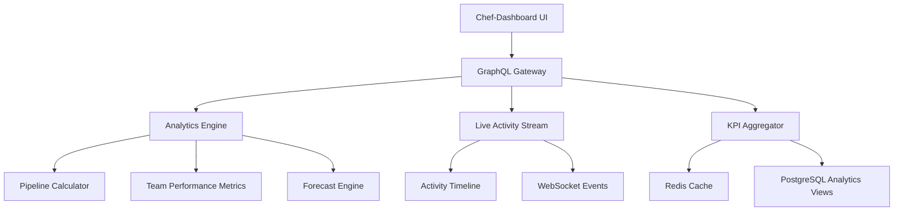

# FC-007: Chef-Dashboard Tech Concept 📊

**Feature Code:** FC-007  
**Feature-Typ:** 🎨 FRONTEND  
**Status:** 📋 TECH CONCEPT - Bereit für Implementation  
**Geschätzter Aufwand:** 7-8 Tage (GraphQL API + Real-Time Dashboard)  
**Priorität:** HOCH - Führungskräfte brauchen Transparenz  
**ROI:** 50% schnellere Entscheidungen, +20% Team-Performance  

---

## 📋 CLAUDE-OPTIMIERTE NAVIGATION (15-Min Context)

**Dieses Dokument ist in 15-Minuten-Chunks für Claude optimiert:**

### 🚀 QUICK START (5 Min)
- [🎯 Problem & Lösung](#problem--lösung)
- [📊 Dashboard-Architektur](#dashboard-architektur)
- [⚡ GraphQL API Design](#graphql-api-design)

### 💻 IMPLEMENTATION (10 Min)
- [🔧 Backend Components](#backend-components)
- [⚛️ React Components](#react-components)
- [📡 Real-Time System](#real-time-system)

### 🔗 INTEGRATION (5 Min)
- [🧩 Dependencies](#dependencies--integration)
- [🛡️ Security & Permissions](#security--permissions)
- [🧭 Navigation](#navigation--verweise)

---

## 🎯 PROBLEM & LÖSUNG

### 🚨 Business Problem
**"Was tun meine Verkäufer? Wie ist die Pipeline?" = viele Klicks**

**Konkreter Pain Point:**
- Führungskräfte müssen 5-7 verschiedene Seiten öffnen für Überblick
- Keine Live-Updates über Team-Aktivitäten
- KPI-Berechnungen dauern zu lange
- Keine proaktiven Insights für Coaching

### ✅ Unsere Lösung
**Ein Dashboard mit Live-Updates + KI-Insights**

**4 Hauptbereiche:**
1. **KPI Overview** - Pipeline: 2.450.000€ | Forecast: 735.000€ | Quote: 32% ⬆️+5%
2. **Live Monitor** - Thomas → Anruf mit Kunde XY (vor 2 Min)
3. **Team Matrix** - Wer performt wie? Team-Score: 8.2/10
4. **AI Insights** - Was sollte ich tun?

---

## 📊 DASHBOARD-ARCHITEKTUR

### 🏗️ System-Architektur



### 📊 Dashboard Layout
```
┌─────────────────────────────────────────────────────┐
│ 🎯 KPI CARDS (Top Row)                             │
│ Pipeline: 2.450.000€ | Forecast: 735.000€          │
│ Quote: 32% ⬆️+5%     | Team-Score: 8.2/10          │
├─────────────────────────────────────────────────────┤
│ 📊 LIVE MONITOR (Left) │ 📈 TEAM MATRIX (Right)    │
│                        │                           │
│ ⚡ LIVE NOW:            │ 👥 PERFORMANCE:           │
│ Thomas → Anruf XY      │ Sarah: 8.5/10 ⬆️          │
│ Sarah → Angebot #1234  │ Thomas: 7.8/10 ➡️         │
│ Mike → Meeting ABC     │ Mike: 9.1/10 ⬆️           │
├────────────────────────┼───────────────────────────┤
│ 🤖 AI INSIGHTS (Bottom Span)                       │
│ "Sarah's Pipeline zeigt 15% Steigerung - Zeit für  │
│  Coaching-Gespräch über Account-Expansion"         │
└─────────────────────────────────────────────────────┘
```

---

## ⚡ GRAPHQL API DESIGN

### 📡 GraphQL Schema

```graphql
type Query {
  dashboardOverview(dateRange: DateRange!): DashboardData!
  salesRepPerformance(repId: ID!): RepPerformance!
  pipelineMetrics(filters: PipelineFilters): PipelineMetrics!
  teamComparison(period: Period!): [TeamMemberStats!]!
}

type Subscription {
  liveActivities: ActivityStream!
  alertsStream: Alert!
  kpiUpdates: KPIUpdate!
}

type DashboardData {
  keyMetrics: KeyMetrics!
  pipeline: PipelineData!
  team: [TeamMemberPerformance!]!
  liveActivities: [Activity!]!
  aiInsights: [Insight!]!
  alerts: [Alert!]!
}

type KeyMetrics {
  pipelineValue: Money!
  weightedForecast: Money!
  conversionRate: Percentage!
  teamScore: Float!
  trend: TrendData!
}

type Activity {
  id: ID!
  timestamp: DateTime!
  userId: ID!
  userName: String!
  type: ActivityType!
  description: String!
  customerName: String
  dealValue: Money
  priority: Priority!
}

enum ActivityType {
  CALL_STARTED
  CALL_ENDED
  OFFER_CREATED
  MEETING_SCHEDULED
  DEAL_WON
  DEAL_LOST
  EMAIL_SENT
  CUSTOMER_CONTACTED
}
```

---

## 🔧 BACKEND COMPONENTS

### 🏭 Analytics Engine

```java
@ApplicationScoped
@Transactional
public class DashboardAnalyticsService {
    
    @Inject
    MetricsCalculatorService metricsCalculator;
    
    @Inject
    PipelineAggregatorService pipelineAggregator;
    
    @Inject
    TeamPerformanceService teamPerformance;
    
    @Cacheable(cacheName = "dashboard-metrics", expireAfterWrite = "5M")
    public DashboardData calculateDashboardData(DashboardRequest request) {
        var startTime = Instant.now();
        
        try {
            // Parallel berechnen für Performance
            var keyMetrics = CompletableFuture.supplyAsync(
                () -> metricsCalculator.calculateKeyMetrics(request.getDateRange())
            );
            
            var pipelineData = CompletableFuture.supplyAsync(
                () -> pipelineAggregator.aggregatePipelineData(request.getFilters())
            );
            
            var teamStats = CompletableFuture.supplyAsync(
                () -> teamPerformance.calculateTeamStats(request.getTeamIds())
            );
            
            // Alle parallel ausführen
            CompletableFuture.allOf(keyMetrics, pipelineData, teamStats).join();
            
            return DashboardData.builder()
                .keyMetrics(keyMetrics.get())
                .pipeline(pipelineData.get())
                .team(teamStats.get())
                .calculationTime(Duration.between(startTime, Instant.now()))
                .build();
                
        } catch (Exception e) {
            log.error("Dashboard calculation failed", e);
            return getDashboardFallback(request);
        }
    }
    
    private DashboardData getDashboardFallback(DashboardRequest request) {
        // Fallback mit cached Daten oder Defaults
        return DashboardData.builder()
            .keyMetrics(getLastKnownMetrics())
            .isStale(true)
            .build();
    }
}
```

### 📊 KPI Calculator

```java
@ApplicationScoped
public class MetricsCalculatorService {
    
    @Inject
    @RestClient
    PipelineDataService pipelineService;
    
    public KeyMetrics calculateKeyMetrics(DateRange dateRange) {
        var pipelineValue = calculatePipelineValue(dateRange);
        var forecast = calculateWeightedForecast(dateRange);
        var conversionRate = calculateConversionRate(dateRange);
        var teamScore = calculateTeamScore(dateRange);
        
        return KeyMetrics.builder()
            .pipelineValue(pipelineValue)
            .weightedForecast(forecast)
            .conversionRate(conversionRate)
            .teamScore(teamScore)
            .trend(calculateTrend(dateRange))
            .lastUpdated(Instant.now())
            .build();
    }
    
    private Money calculateWeightedForecast(DateRange dateRange) {
        // Gewichtete Forecast-Berechnung basierend auf Deal-Stages
        var deals = pipelineService.getActiveDeals(dateRange);
        
        return deals.stream()
            .map(deal -> {
                var probability = getStageWinProbability(deal.getStage());
                return deal.getValue().multiply(probability);
            })
            .reduce(Money.ZERO, Money::add);
    }
    
    private BigDecimal getStageWinProbability(DealStage stage) {
        return switch (stage) {
            case FIRST_CONTACT -> BigDecimal.valueOf(0.1);
            case QUALIFIED -> BigDecimal.valueOf(0.25);
            case PROPOSAL -> BigDecimal.valueOf(0.5);
            case NEGOTIATION -> BigDecimal.valueOf(0.75);
            case CLOSED_WON -> BigDecimal.valueOf(1.0);
            default -> BigDecimal.ZERO;
        };
    }
}
```

### 📡 Live Activity Stream

```java
@ApplicationScoped
public class ActivityStreamService {
    
    @Inject
    @Channel("activity-events")
    Emitter<ActivityEvent> activityEmitter;
    
    @Inject
    ActivityRepository activityRepository;
    
    public void publishActivity(ActivityEvent event) {
        // Validierung
        if (event.getUserId() == null || event.getType() == null) {
            log.warn("Invalid activity event: {}", event);
            return;
        }
        
        // Persistieren für Audit
        var activity = Activity.fromEvent(event);
        activityRepository.persist(activity);
        
        // Live Stream senden
        activityEmitter.send(event);
        
        // KPI Update triggern wenn relevant
        if (isKpiRelevant(event.getType())) {
            triggerKpiRefresh(event.getUserId());
        }
    }
    
    @ConsumeEvent("deal.won")
    public void onDealWon(DealWonEvent event) {
        publishActivity(ActivityEvent.builder()
            .type(ActivityType.DEAL_WON)
            .userId(event.getSalesRepId())
            .description("Deal gewonnen: " + event.getCustomerName())
            .dealValue(event.getDealValue())
            .priority(Priority.HIGH)
            .timestamp(Instant.now())
            .build());
    }
    
    private boolean isKpiRelevant(ActivityType type) {
        return Set.of(
            ActivityType.DEAL_WON,
            ActivityType.DEAL_LOST,
            ActivityType.OFFER_CREATED
        ).contains(type);
    }
}
```

---

## ⚛️ REACT COMPONENTS

### 🎛️ Main Dashboard Component

```typescript
// frontend/src/features/dashboard/ChefDashboard.tsx
import React from 'react';
import { useQuery, useSubscription } from '@apollo/client';
import { Grid, Card, Alert, Skeleton } from '@mui/material';
import { KPICards } from './components/KPICards';
import { LiveMonitor } from './components/LiveMonitor';
import { TeamMatrix } from './components/TeamMatrix';
import { InsightsPanel } from './components/InsightsPanel';
import { DASHBOARD_OVERVIEW_QUERY, LIVE_ACTIVITIES_SUBSCRIPTION } from './queries';

interface ChefDashboardProps {
  dateRange: DateRange;
  teamIds?: string[];
}

export const ChefDashboard: React.FC<ChefDashboardProps> = ({ 
  dateRange, 
  teamIds 
}) => {
  // Main Dashboard Data
  const { data: overview, loading, error, refetch } = useQuery(
    DASHBOARD_OVERVIEW_QUERY,
    {
      variables: { dateRange, teamIds },
      pollInterval: 300000, // 5 Minuten Fallback-Polling
      errorPolicy: 'partial', // Zeige partial Daten bei Fehlern
    }
  );

  // Live Activity Stream
  const { data: liveActivity } = useSubscription(
    LIVE_ACTIVITIES_SUBSCRIPTION,
    {
      onError: (error) => {
        console.warn('Live activity subscription failed:', error);
        // Graceful degradation - zeige cached Daten
      }
    }
  );

  // Error Handling
  if (error && !overview) {
    return (
      <Alert severity="error" action={
        <Button onClick={() => refetch()}>Erneut versuchen</Button>
      }>
        Dashboard konnte nicht geladen werden: {error.message}
      </Alert>
    );
  }

  // Loading State
  if (loading && !overview) {
    return <DashboardSkeleton />;
  }

  return (
    <Grid container spacing={3} sx={{ p: 3 }}>
      {/* KPI Overview */}
      <Grid item xs={12}>
        <KPICards 
          metrics={overview?.keyMetrics} 
          loading={loading}
          trend={overview?.keyMetrics?.trend}
        />
      </Grid>

      {/* Live Monitor & Team Matrix */}
      <Grid item xs={12} md={6}>
        <LiveMonitor 
          activities={overview?.liveActivities} 
          liveUpdate={liveActivity}
          maxItems={10}
        />
      </Grid>
      
      <Grid item xs={12} md={6}>
        <TeamMatrix 
          performers={overview?.team}
          loading={loading}
          period={dateRange}
        />
      </Grid>

      {/* AI Insights */}
      <Grid item xs={12}>
        <InsightsPanel 
          insights={overview?.aiInsights}
          alerts={overview?.alerts}
          onActionTaken={(insight) => handleInsightAction(insight)}
        />
      </Grid>
    </Grid>
  );
};

const DashboardSkeleton = () => (
  <Grid container spacing={3} sx={{ p: 3 }}>
    <Grid item xs={12}>
      <Grid container spacing={2}>
        {[1, 2, 3, 4].map(i => (
          <Grid item xs={12} sm={6} md={3} key={i}>
            <Card sx={{ p: 2 }}>
              <Skeleton variant="text" width="60%" />
              <Skeleton variant="text" width="40%" height={32} />
              <Skeleton variant="text" width="30%" />
            </Card>
          </Grid>
        ))}
      </Grid>
    </Grid>
    <Grid item xs={12} md={6}>
      <Skeleton variant="rectangular" height={400} />
    </Grid>
    <Grid item xs={12} md={6}>
      <Skeleton variant="rectangular" height={400} />
    </Grid>
  </Grid>
);
```

### 📊 KPI Cards Component

```typescript
// frontend/src/features/dashboard/components/KPICards.tsx
import React from 'react';
import { Grid, Card, CardContent, Typography, Chip, Box } from '@mui/material';
import { TrendingUp, TrendingDown, TrendingFlat } from '@mui/icons-material';
import { formatCurrency, formatPercentage } from '../../../utils/formatters';

interface KPICardsProps {
  metrics?: KeyMetrics;
  loading?: boolean;
  trend?: TrendData;
}

export const KPICards: React.FC<KPICardsProps> = ({ metrics, loading, trend }) => {
  const kpiCards = [
    {
      title: 'Pipeline Wert',
      value: metrics?.pipelineValue,
      format: formatCurrency,
      trend: trend?.pipelineValueTrend,
      color: 'primary',
      icon: '💰'
    },
    {
      title: 'Gewichtete Forecast',
      value: metrics?.weightedForecast,
      format: formatCurrency,
      trend: trend?.forecastTrend,
      color: 'success',
      icon: '🎯'
    },
    {
      title: 'Conversion Rate',
      value: metrics?.conversionRate,
      format: formatPercentage,
      trend: trend?.conversionTrend,
      color: 'info',
      icon: '📈'
    },
    {
      title: 'Team Score',
      value: metrics?.teamScore,
      format: (val: number) => `${val.toFixed(1)}/10`,
      trend: trend?.teamScoreTrend,
      color: 'warning',
      icon: '👥'
    }
  ];

  return (
    <Grid container spacing={2}>
      {kpiCards.map((kpi, index) => (
        <Grid item xs={12} sm={6} md={3} key={index}>
          <Card elevation={2} sx={{ height: '100%' }}>
            <CardContent>
              <Box display="flex" justifyContent="space-between" alignItems="center">
                <Typography variant="subtitle2" color="text.secondary">
                  {kpi.icon} {kpi.title}
                </Typography>
                {kpi.trend && (
                  <TrendIndicator trend={kpi.trend} />
                )}
              </Box>
              
              <Typography variant="h4" component="div" sx={{ mt: 1, mb: 1 }}>
                {loading ? '...' : kpi.format(kpi.value || 0)}
              </Typography>
              
              {metrics?.lastUpdated && (
                <Typography variant="caption" color="text.secondary">
                  Aktualisiert: {formatTimestamp(metrics.lastUpdated)}
                </Typography>
              )}
            </CardContent>
          </Card>
        </Grid>
      ))}
    </Grid>
  );
};

const TrendIndicator: React.FC<{ trend: number }> = ({ trend }) => {
  const isPositive = trend > 0;
  const isNeutral = Math.abs(trend) < 0.01;
  
  return (
    <Chip
      size="small"
      icon={
        isNeutral ? <TrendingFlat /> :
        isPositive ? <TrendingUp /> : <TrendingDown />
      }
      label={`${isPositive ? '+' : ''}${formatPercentage(trend)}`}
      color={isNeutral ? 'default' : isPositive ? 'success' : 'error'}
      variant="outlined"
    />
  );
};
```

---

## 📡 REAL-TIME SYSTEM

### ⚡ WebSocket Integration

```typescript
// frontend/src/features/dashboard/hooks/useLiveActivities.ts
import { useEffect, useState } from 'react';
import { useSubscription } from '@apollo/client';
import { LIVE_ACTIVITIES_SUBSCRIPTION } from '../queries';

interface UseLiveActivitiesReturn {
  activities: Activity[];
  connectionStatus: 'connected' | 'disconnected' | 'reconnecting';
  isStale: boolean;
}

export const useLiveActivities = (maxItems = 20): UseLiveActivitiesReturn => {
  const [activities, setActivities] = useState<Activity[]>([]);
  const [connectionStatus, setConnectionStatus] = useState<'connected' | 'disconnected' | 'reconnecting'>('disconnected');
  const [isStale, setIsStale] = useState(false);

  const { data, error, loading } = useSubscription(LIVE_ACTIVITIES_SUBSCRIPTION, {
    onComplete: () => setConnectionStatus('connected'),
    onError: (error) => {
      console.warn('Live subscription error:', error);
      setConnectionStatus('disconnected');
      setIsStale(true);
    }
  });

  useEffect(() => {
    if (data?.activityStream) {
      setActivities(prev => {
        const newActivity = data.activityStream;
        const updated = [newActivity, ...prev.filter(a => a.id !== newActivity.id)];
        return updated.slice(0, maxItems);
      });
      setIsStale(false);
    }
  }, [data, maxItems]);

  // Reconnection Logic
  useEffect(() => {
    if (error) {
      setConnectionStatus('reconnecting');
      const timer = setTimeout(() => {
        // Apollo Client handles reconnection automatically
        setConnectionStatus('connected');
      }, 5000);
      
      return () => clearTimeout(timer);
    }
  }, [error]);

  return {
    activities,
    connectionStatus,
    isStale
  };
};
```

### 🔄 Cache Strategy

```typescript
// frontend/src/features/dashboard/cache/dashboardCache.ts
import { InMemoryCache } from '@apollo/client';

export const dashboardCacheConfig = {
  typePolicies: {
    DashboardData: {
      fields: {
        keyMetrics: {
          merge: (existing, incoming) => {
            // Merge mit Timestamp-Vergleich
            if (!existing || incoming.lastUpdated > existing.lastUpdated) {
              return incoming;
            }
            return existing;
          }
        },
        liveActivities: {
          merge: (existing = [], incoming = []) => {
            // Neueste Aktivitäten zuerst, Duplikate entfernen
            const combined = [...incoming, ...existing];
            const unique = combined.filter((activity, index, arr) => 
              arr.findIndex(a => a.id === activity.id) === index
            );
            return unique.slice(0, 50); // Limit für Performance
          }
        }
      }
    },
    Activity: {
      keyFields: ['id']
    }
  }
};
```

---

## 🧩 DEPENDENCIES & INTEGRATION

### 🔗 Required Dependencies

**Backend Dependencies:**
- [`FC-008 Security Foundation`](/docs/features/ACTIVE/01_security_foundation/FC-008_TECH_CONCEPT.md) - Role-based Access (nur Chefs)
- [`FC-009 Permissions System`](/docs/features/ACTIVE/04_permissions_system/FC-009_TECH_CONCEPT.md) - Team-based Data Access
- [`M4 Opportunity Pipeline`](/docs/features/ACTIVE/02_opportunity_pipeline/M4_TECH_CONCEPT.md) - Pipeline-Daten

**Data Sources:**
- [`FC-005 Xentral Integration`](/docs/features/PLANNED/08_xentral_integration/FC-005_TECH_CONCEPT.md) - Echte Umsätze & Provisionen
- [`FC-004 Verkäuferschutz`](/docs/features/PLANNED/07_verkaeuferschutz/FC-004_TECH_CONCEPT.md) - Team-Zuordnungen
- [`FC-011 Bonitätsprüfung`](/docs/features/ACTIVE/02_opportunity_pipeline/integrations/FC-011_TECH_CONCEPT.md) - Risiko-KPIs

### ⚡ Performance Dependencies

**Caching Layer:**
```java
// Redis Konfiguration für Dashboard Metrics
@ConfigProperty(name = "dashboard.cache.expiry", defaultValue = "300")
int cacheExpirySeconds;

@Cacheable(cacheName = "dashboard-kpis", expireAfterWrite = "${dashboard.cache.expiry}s")
public KeyMetrics getKeyMetrics(String teamId, DateRange range) {
    // Implementation
}
```

**Database Optimierung:**
```sql
-- Read Models für Performance
CREATE MATERIALIZED VIEW dashboard_team_performance AS
SELECT 
    user_id,
    date_trunc('day', created_at) as date,
    count(*) as activities_count,
    sum(deal_value) as total_deal_value,
    avg(deal_value) as avg_deal_value
FROM activities 
WHERE type IN ('DEAL_WON', 'OFFER_CREATED')
GROUP BY user_id, date_trunc('day', created_at);

-- Index für schnelle Dashboard Queries
CREATE INDEX idx_dashboard_performance 
ON dashboard_team_performance (user_id, date);
```

---

## 🛡️ SECURITY & PERMISSIONS

### 🔐 Role-Based Access

```java
@Path("/api/dashboard")
@Authenticated
public class DashboardResource {
    
    @GET
    @Path("/overview")
    @RolesAllowed({"admin", "manager"}) // Nur Führungskräfte
    public Response getDashboardOverview(
        @QueryParam("teamIds") List<String> teamIds,
        @Context SecurityContext securityContext
    ) {
        var currentUser = getCurrentUser(securityContext);
        
        // Daten-Scoping basierend auf User-Rolle
        var allowedTeamIds = filterAllowedTeams(teamIds, currentUser);
        
        var dashboardData = dashboardService.getDashboardData(
            allowedTeamIds, 
            currentUser.getPermissions()
        );
        
        return Response.ok(dashboardData).build();
    }
    
    private List<String> filterAllowedTeams(List<String> requestedTeams, User user) {
        if (user.hasRole("admin")) {
            return requestedTeams; // Admin sieht alles
        }
        
        if (user.hasRole("manager")) {
            // Manager sieht nur eigene Teams
            return requestedTeams.stream()
                .filter(teamId -> user.getManagedTeams().contains(teamId))
                .collect(Collectors.toList());
        }
        
        throw new ForbiddenException("Insufficient permissions for dashboard access");
    }
}
```

### 🔒 Data Privacy

```java
@Entity
public class TeamPerformanceView {
    
    // Nur aggregierte Daten, keine individuellen Details ohne Berechtigung
    @Column
    private BigDecimal teamAvgPerformance;
    
    @Column
    private Long totalActivities;
    
    // Individuelle Daten nur für berechtigte Manager
    @OneToMany(mappedBy = "team")
    @Where("accessible = true") // Hibernate Filter basierend auf User Context
    private List<IndividualPerformance> memberPerformance;
}
```

---

## 🧭 NAVIGATION & VERWEISE

### 📋 Zurück zum Überblick:
- **[📊 Master Plan V5](/docs/CRM_COMPLETE_MASTER_PLAN_V5.md)** - Vollständige Feature-Roadmap
- **[🗺️ Feature Overview](/docs/features/MASTER/FEATURE_OVERVIEW.md)** - Alle 40 Features im Überblick

### 🔗 Dependencies (Required):
- **[🔒 FC-008 Security Foundation](/docs/features/ACTIVE/01_security_foundation/FC-008_TECH_CONCEPT.md)** - Role-based Access (nur Chefs)
- **[👥 FC-009 Permissions System](/docs/features/ACTIVE/04_permissions_system/FC-009_TECH_CONCEPT.md)** - Team-based Data Access
- **[📊 M4 Opportunity Pipeline](/docs/features/ACTIVE/02_opportunity_pipeline/M4_TECH_CONCEPT.md)** - Pipeline-Daten

### ⚡ Datenquellen:
- **[📥 FC-005 Xentral Integration](/docs/features/PLANNED/08_xentral_integration/FC-005_TECH_CONCEPT.md)** - Echte Umsätze & Provisionen
- **[🛡️ FC-004 Verkäuferschutz](/docs/features/PLANNED/07_verkaeuferschutz/FC-004_TECH_CONCEPT.md)** - Team-Zuordnungen
- **[💰 FC-011 Bonitätsprüfung](/docs/features/ACTIVE/02_opportunity_pipeline/integrations/FC-011_TECH_CONCEPT.md)** - Risiko-KPIs

### 🚀 Ermöglicht folgende Features:
- **[📈 FC-019 Advanced Sales Metrics](/docs/features/PLANNED/19_advanced_metrics/FC-019_TECH_CONCEPT.md)** - Erweiterte Analytics
- **[📊 M6 Analytics Module](/docs/features/PLANNED/13_analytics_m6/M6_TECH_CONCEPT.md)** - Tiefere Analysen
- **[🎯 FC-027 Magic Moments](/docs/features/PLANNED/27_magic_moments/FC-027_TECH_CONCEPT.md)** - Coaching-Empfehlungen

### 🎨 UI Integration:
- **[🧭 M1 Navigation](/docs/features/ACTIVE/05_ui_foundation/M1_TECH_CONCEPT.md)** - Dashboard-Zugriff
- **[📊 M3 Sales Cockpit](/docs/features/ACTIVE/05_ui_foundation/M3_TECH_CONCEPT.md)** - Team-Ansicht
- **[📊 FC-034 Instant Insights](/docs/features/PLANNED/34_instant_insights/FC-034_TECH_CONCEPT.md)** - KI-Insights

### 🔧 Technische Details:
- **[IMPLEMENTATION_GUIDE.md](/docs/features/ACTIVE/01_security/IMPLEMENTATION_GUIDE.md)** *(geplant)* - GraphQL & Analytics Engine
- **[DASHBOARD_DESIGN.md](/docs/features/ACTIVE/01_security/DASHBOARD_DESIGN.md)** *(geplant)* - UI/UX Mockups
- **[PERFORMANCE_GUIDE.md](/docs/features/ACTIVE/01_security/PERFORMANCE_GUIDE.md)** *(geplant)* - Caching & Real-Time

---

## 📊 COMPLETE FEATURE NAVIGATION (40 Features)

### 🏢 CORE CRM FEATURES (M1-M7)
- **[M1 Navigation System](/docs/features/ACTIVE/05_ui_foundation/M1_TECH_CONCEPT.md)** - Hauptnavigation & Routing
- **[M2 Customer Management](/docs/features/ACTIVE/03_customer_management/M2_TECH_CONCEPT.md)** - Kundenverwaltung
- **[M3 Sales Cockpit](/docs/features/ACTIVE/05_ui_foundation/M3_TECH_CONCEPT.md)** - Verkäufer-Dashboard
- **[M4 Opportunity Pipeline](/docs/features/ACTIVE/02_opportunity_pipeline/M4_TECH_CONCEPT.md)** - Deal-Management
- **[M5 Customer Import](/docs/features/PLANNED/05_customer_import/M5_TECH_CONCEPT.md)** - CSV/Excel Import
- **[M6 Analytics Module](/docs/features/PLANNED/13_analytics_m6/M6_TECH_CONCEPT.md)** - Business Intelligence
- **[M7 Settings](/docs/features/ACTIVE/05_ui_foundation/M7_TECH_CONCEPT.md)** - System-Konfiguration

### 🔧 FOUNDATION FEATURES (FC-001 bis FC-010)
- **[FC-001 Basic Setup](/docs/features/ACTIVE/00_basic_setup/FC-001_TECH_CONCEPT.md)** - Projekt-Grundlagen
- **[FC-002 Legacy Navigation](/docs/features/LEGACY/02_navigation_legacy/FC-002_TECH_CONCEPT.md)** - Alte Navigation (archiviert)
- **[FC-003 E-Mail Integration](/docs/features/PLANNED/06_email_integration/FC-003_TECH_CONCEPT.md)** - BCC-to-CRM & SMTP
- **[FC-004 Verkäuferschutz](/docs/features/PLANNED/07_verkaeuferschutz/FC-004_TECH_CONCEPT.md)** - Lead-Protection
- **[FC-005 Xentral Integration](/docs/features/PLANNED/08_xentral_integration/FC-005_TECH_CONCEPT.md)** - ERP-Anbindung
- **[FC-006 Mobile App](/docs/features/PLANNED/09_mobile_app/FC-006_TECH_CONCEPT.md)** - React Native App
- **[FC-007 Chef-Dashboard](/docs/features/PLANNED/10_chef_dashboard/FC-007_TECH_CONCEPT.md)** - Führungs-KPIs ⭐ **AKTUELL**
- **[FC-008 Security Foundation](/docs/features/ACTIVE/01_security_foundation/FC-008_TECH_CONCEPT.md)** - Auth & Security
- **[FC-009 Permissions System](/docs/features/ACTIVE/04_permissions_system/FC-009_TECH_CONCEPT.md)** - Rollen & Rechte
- **[FC-010 Data Import Configuration](/docs/features/PLANNED/04_data_import_config/FC-010_TECH_CONCEPT.md)** - Import-Workflows

### 🔄 INTEGRATION FEATURES (FC-011 bis FC-020)
- **[FC-011 Bonitätsprüfung](/docs/features/ACTIVE/02_opportunity_pipeline/integrations/FC-011_TECH_CONCEPT.md)** - Credit-Check
- **[FC-012 Team Communication](/docs/features/PLANNED/14_team_communication/FC-012_TECH_CONCEPT.md)** - Slack/Teams Integration
- **[FC-013 Duplicate Detection](/docs/features/PLANNED/15_duplicate_detection/FC-013_TECH_CONCEPT.md)** - Duplikat-Erkennung
- **[FC-014 Activity Timeline](/docs/features/PLANNED/16_activity_timeline/FC-014_TECH_CONCEPT.md)** - Event-History
- **[FC-015 Deal Loss Analysis](/docs/features/PLANNED/17_deal_loss_analysis/FC-015_TECH_CONCEPT.md)** - Verlust-Analyse
- **[FC-016 Opportunity Cloning](/docs/features/PLANNED/18_opportunity_cloning/FC-016_TECH_CONCEPT.md)** - Deal-Templates
- **[FC-017 Sales Gamification](/docs/features/PLANNED/11_sales_gamification/FC-017_TECH_CONCEPT.md)** - Motivation & Wettbewerb
- **[FC-018 Mobile PWA](/docs/features/PLANNED/12_mobile_pwa/FC-018_TECH_CONCEPT.md)** - Progressive Web App
- **[FC-019 Advanced Sales Metrics](/docs/features/PLANNED/19_advanced_metrics/FC-019_TECH_CONCEPT.md)** - KPI-Dashboard
- **[FC-020 Quick Wins](/docs/features/PLANNED/20_quick_wins/FC-020_TECH_CONCEPT.md)** - Command Palette & Shortcuts

### 🚀 ADVANCED FEATURES (FC-021 bis FC-030)
- **[FC-021 Integration Hub](/docs/features/PLANNED/21_integration_hub/FC-021_TECH_CONCEPT.md)** - Plugin-System
- **[FC-022 Mobile Light](/docs/features/PLANNED/22_mobile_light/FC-022_TECH_CONCEPT.md)** - Essential Mobile Features
- **[FC-023 Event Sourcing](/docs/features/PLANNED/23_event_sourcing/FC-023_TECH_CONCEPT.md)** - Audit-Trail
- **[FC-024 File Management](/docs/features/PLANNED/24_file_management/FC-024_TECH_CONCEPT.md)** - Dokument-Verwaltung
- **[FC-025 DSGVO Compliance](/docs/features/PLANNED/25_dsgvo_compliance/FC-025_TECH_CONCEPT.md)** - Datenschutz-Tools
- **[FC-026 Analytics Platform](/docs/features/PLANNED/26_analytics_platform/FC-026_TECH_CONCEPT.md)** - BI-Integration
- **[FC-027 Magic Moments](/docs/features/PLANNED/27_magic_moments/FC-027_TECH_CONCEPT.md)** - AI-Coaching
- **[FC-028 WhatsApp Business](/docs/features/PLANNED/28_whatsapp_business/FC-028_TECH_CONCEPT.md)** - Chat-Integration
- **[FC-029 Voice-First Interface](/docs/features/PLANNED/29_voice_first/FC-029_TECH_CONCEPT.md)** - Sprach-Steuerung
- **[FC-030 Sales Automation Hub](/docs/features/PLANNED/30_sales_automation/FC-030_TECH_CONCEPT.md)** - Workflow-Engine

### 🔮 FUTURE VISION (FC-031 bis FC-040)
- **[FC-031 AI Sales Assistant](/docs/features/PLANNED/31_ai_sales_assistant/FC-031_TECH_CONCEPT.md)** - KI-Verkaufsberater
- **[FC-032 Predictive Analytics](/docs/features/PLANNED/32_predictive_analytics/FC-032_TECH_CONCEPT.md)** - Vorhersage-Modelle
- **[FC-033 Customer 360 View](/docs/features/PLANNED/33_customer_360/FC-033_TECH_CONCEPT.md)** - Vollbild-Kundensicht
- **[FC-034 Instant Insights](/docs/features/PLANNED/34_instant_insights/FC-034_TECH_CONCEPT.md)** - Echtzeit-Erkenntnisse
- **[FC-035 Territory Management](/docs/features/PLANNED/35_territory_management/FC-035_TECH_CONCEPT.md)** - Gebiets-Verwaltung
- **[FC-036 Commission Engine](/docs/features/PLANNED/36_commission_engine/FC-036_TECH_CONCEPT.md)** - Provisions-System
- **[FC-037 Field Service Integration](/docs/features/PLANNED/37_field_service/FC-037_TECH_CONCEPT.md)** - Außendienst-Tools
- **[FC-038 Customer Portal](/docs/features/PLANNED/38_customer_portal/FC-038_TECH_CONCEPT.md)** - Kunden-Self-Service
- **[FC-039 Advanced Workflow Engine](/docs/features/PLANNED/39_workflow_engine/FC-039_TECH_CONCEPT.md)** - Prozess-Automatisierung
- **[FC-040 Enterprise API Gateway](/docs/features/PLANNED/40_api_gateway/FC-040_TECH_CONCEPT.md)** - API-Management

---

## ⏰ IMPLEMENTATION PHASES

### 📅 Phase 1: Core Dashboard (3-4 Tage)
1. **GraphQL Schema & Resolvers** (1 Tag)
   - Dashboard Query definieren
   - Subscription für Live Activities
   - Basic Metrics Calculator

2. **React Dashboard Components** (2 Tage)
   - KPI Cards mit Trends
   - Live Activity Monitor
   - Team Performance Matrix

3. **Real-Time Integration** (1 Tag)
   - WebSocket Setup
   - Activity Stream Service
   - Cache Strategy

### 📅 Phase 2: Analytics Engine (2-3 Tage)
1. **Advanced Metrics** (1 Tag)
   - Weighted Forecast Algorithm
   - Team Score Calculation
   - Trend Analysis

2. **Performance Optimization** (1 Tag)
   - Read Models erstellen
   - Redis Cache Implementation
   - Database Indexes

3. **AI Insights Integration** (1 Tag)
   - OpenAI API für Coaching-Tipps
   - Pattern Detection
   - Alert System

### 📅 Phase 3: Security & Polish (1-2 Tage)
1. **Security Implementation** (1 Tag)
   - Role-based Access Control
   - Data Privacy Filters
   - Audit Logging

2. **UI/UX Refinement** (1 Tag)
   - Responsive Design
   - Error Handling
   - Loading States

### 📅 Phase 4: Testing & Documentation (1 Tag)
1. **Testing** (0.5 Tag)
   - Component Tests
   - Integration Tests
   - Performance Tests

2. **Documentation** (0.5 Tag)
   - API Documentation
   - User Guide
   - Deployment Guide

---

## 📈 SUCCESS METRICS

### 🎯 Business KPIs
- **Load Time:** < 2s für Dashboard (gemessen)
- **Adoption Rate:** > 5x täglich pro Manager (Analytics)
- **Forecast Accuracy:** ± 10% Abweichung (Vergleich mit Xentral)
- **Decision Speed:** 50% schneller (User Feedback)

### 🔧 Technical KPIs
- **Cache Hit Rate:** > 80% für Metrics Queries
- **WebSocket Uptime:** > 99.5%
- **API Response Time:** < 200ms P95
- **Error Rate:** < 0.1%

### 📊 Performance Benchmarks
```typescript
// Performance Monitoring
const dashboardMetrics = {
  renderTime: measureRenderTime(), // Target: < 100ms
  cacheHitRate: getCacheHitRate(), // Target: > 80%
  liveConnectionUptime: getWebSocketUptime(), // Target: > 99%
  apiLatency: getApiLatency(), // Target: < 200ms
};
```

---

**Status:** 📋 TECH CONCEPT VOLLSTÄNDIG - Bereit für Implementation  
**Nächster Schritt:** Phase 1 GraphQL Schema & Core Components  
**Geschätzte Implementierungszeit:** 7-8 Tage  
**Dependencies:** FC-008, FC-009, M4 müssen ready sein