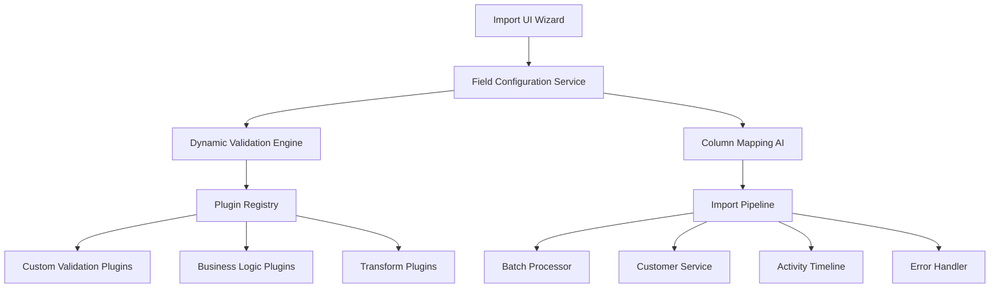

# FC-010: Data Import Configuration Tech Concept 📥

**Feature Code:** FC-010  
**Feature-Typ:** 🔀 FULLSTACK  
**Status:** 📋 TECH CONCEPT - Bereit für Implementation  
**Geschätzter Aufwand:** 10-16 Tage (Plugin-Architektur + Dynamic UI)  
**Priorität:** HOCH - Kritisch für 5000+ Bestandskunden Migration  
**ROI:** Break-even nach 2. Custom Field, 3. Branche, 5. Import-Workflow  

---

## 📋 CLAUDE-OPTIMIERTE NAVIGATION (15-Min Context)

**Dieses Dokument ist in 15-Minuten-Chunks für Claude optimiert:**

### 🚀 QUICK START (5 Min)
- [🎯 Problem & Lösung](#problem--lösung)
- [🏗️ Configuration-Driven Architecture](#configuration-driven-architecture)
- [⚡ Plugin System Design](#plugin-system-design)

### 💻 CORE IMPLEMENTATION (10 Min)
- [🗄️ Database Schema](#database-schema)
- [🔧 Backend Services](#backend-services)
- [⚛️ Dynamic UI Components](#dynamic-ui-components)

### 🔗 INTEGRATION (5 Min)
- [🧩 Dependencies](#dependencies--integration)
- [🛡️ Security & Validation](#security--validation)
- [🧭 Navigation](#navigation--verweise)

---

## 🎯 PROBLEM & LÖSUNG

### 🚨 Business Problem
**5000+ Bestandskunden in Excel-Listen + starre Import-Logik**

**Konkreter Pain Point:**
- Jede neue Kundenfeld-Anfrage kostet 2-3 Entwicklertage
- UI muss manuell angepasst werden für neue Spalten
- Branchen-spezifische Validierung hardcoded
- Import-Workflows nicht konfigurierbar

### ✅ Unsere Lösung
**Configuration-Driven Import mit Plugin-Architektur**

**4 Kern-Prinzipien:**
1. **Dynamic Field Configuration** - Neue Felder ohne Code-Änderung
2. **Plugin-Based Validation** - Branchen-Logic erweiterbar
3. **Smart Column Mapping** - KI-basierte Spalten-Erkennung
4. **Wizard-Driven UX** - Geführte Freiheit für alle User-Level

---

## 🏗️ CONFIGURATION-DRIVEN ARCHITECTURE

### 📐 System-Architektur



### 🧩 Configuration Schema
```sql
-- Field Configuration
CREATE TABLE import_field_configs (
    id UUID PRIMARY KEY,
    field_name VARCHAR(50) NOT NULL,
    display_label VARCHAR(100) NOT NULL,
    field_type VARCHAR(20) NOT NULL, -- text, number, email, date, enum
    is_required BOOLEAN DEFAULT FALSE,
    default_value TEXT,
    validation_rules JSONB,
    mapping_patterns TEXT[], -- ["firma", "company", "name"]
    ui_order INTEGER,
    is_active BOOLEAN DEFAULT TRUE,
    created_at TIMESTAMP DEFAULT NOW(),
    updated_at TIMESTAMP DEFAULT NOW()
);

-- Import Workflows  
CREATE TABLE import_workflows (
    id UUID PRIMARY KEY,
    name VARCHAR(100) NOT NULL,
    description TEXT,
    field_config_ids UUID[],
    validation_plugins TEXT[],
    transform_plugins TEXT[],
    batch_size INTEGER DEFAULT 100,
    error_threshold DECIMAL(3,2) DEFAULT 0.1,
    is_default BOOLEAN DEFAULT FALSE,
    created_by UUID REFERENCES users(id),
    created_at TIMESTAMP DEFAULT NOW()
);

-- Import Sessions (Audit)
CREATE TABLE import_sessions (
    id UUID PRIMARY KEY,
    workflow_id UUID REFERENCES import_workflows(id),
    filename VARCHAR(255),
    total_rows INTEGER,
    processed_rows INTEGER,
    success_rows INTEGER,
    error_rows INTEGER,
    status VARCHAR(20), -- pending, processing, completed, failed
    error_log JSONB,
    started_at TIMESTAMP DEFAULT NOW(),
    completed_at TIMESTAMP,
    created_by UUID REFERENCES users(id)
);
```

---

## ⚡ PLUGIN SYSTEM DESIGN

### 🔌 Plugin Interface

```java
// Core Plugin Interface
public interface ImportPlugin {
    String getName();
    String getVersion();
    boolean isApplicable(ImportContext context);
    PluginResult execute(ImportData data, ImportContext context);
}

// Validation Plugin
public interface CustomValidationPlugin extends ImportPlugin {
    ValidationResult validate(ImportData data, ValidationContext context);
}

// Transform Plugin
public interface DataTransformPlugin extends ImportPlugin {
    TransformResult transform(ImportData input, TransformContext context);
}

// Business Logic Plugin
public interface BusinessLogicPlugin extends ImportPlugin {
    BusinessResult applyBusinessRules(ImportData data, BusinessContext context);
}
```

### 🏭 Plugin Registry

```java
@ApplicationScoped
public class ImportPluginRegistry {
    
    private final Map<String, ImportPlugin> plugins = new ConcurrentHashMap<>();
    
    @PostConstruct
    public void initializePlugins() {
        // Discover plugins via CDI
        Instance<ImportPlugin> discoveredPlugins = CDI.current()
            .select(ImportPlugin.class);
            
        discoveredPlugins.forEach(plugin -> {
            log.info("Registering import plugin: {}", plugin.getName());
            plugins.put(plugin.getName(), plugin);
        });
    }
    
    public List<ImportPlugin> getApplicablePlugins(ImportContext context) {
        return plugins.values().stream()
            .filter(plugin -> plugin.isApplicable(context))
            .sorted(Comparator.comparing(ImportPlugin::getName))
            .collect(Collectors.toList());
    }
    
    public Optional<ImportPlugin> getPlugin(String name) {
        return Optional.ofNullable(plugins.get(name));
    }
}
```

### 🎯 Example: Gastronomie Validation Plugin

```java
@ApplicationScoped
@Named("gastronomie-validation")
public class GastronomieValidationPlugin implements CustomValidationPlugin {
    
    @Override
    public String getName() {
        return "gastronomie-validation";
    }
    
    @Override
    public boolean isApplicable(ImportContext context) {
        return context.hasField("industry") && 
               "Gastronomie".equalsIgnoreCase(context.getFieldValue("industry"));
    }
    
    @Override
    public ValidationResult validate(ImportData data, ValidationContext context) {
        var result = new ValidationResult();
        
        // Sitzplätze required für Gastronomie
        if (data.getField("seating_capacity") == null) {
            result.addError("seating_capacity", 
                "Sitzplätze sind für Gastronomie-Betriebe Pflicht");
        }
        
        // Umsatzschätzung basierend auf Sitzplätzen
        Integer seatingCapacity = data.getInteger("seating_capacity");
        if (seatingCapacity != null && seatingCapacity > 0) {
            BigDecimal estimatedRevenue = calculateGastronomieRevenue(seatingCapacity);
            data.setField("estimated_annual_revenue", estimatedRevenue);
            result.addInfo("estimated_annual_revenue", 
                "Geschätzt basierend auf Sitzplätzen: " + estimatedRevenue);
        }
        
        // Öffnungszeiten validieren
        validateOpeningHours(data, result);
        
        return result;
    }
    
    private BigDecimal calculateGastronomieRevenue(Integer seatingCapacity) {
        // Faustformel: 50€ pro Sitzplatz pro Tag * 300 Tage
        return BigDecimal.valueOf(seatingCapacity)
            .multiply(BigDecimal.valueOf(50))
            .multiply(BigDecimal.valueOf(300));
    }
}
```

---

## 🗄️ DATABASE SCHEMA

### 📊 Complete Database Design

```sql
-- Field Configuration mit erweiterten Features
CREATE TABLE import_field_configs (
    id UUID PRIMARY KEY DEFAULT gen_random_uuid(),
    field_name VARCHAR(50) NOT NULL UNIQUE,
    display_label VARCHAR(100) NOT NULL,
    field_type VARCHAR(20) NOT NULL CHECK (
        field_type IN ('text', 'number', 'decimal', 'email', 'phone', 
                      'date', 'datetime', 'boolean', 'enum', 'json')
    ),
    is_required BOOLEAN DEFAULT FALSE,
    default_value TEXT,
    validation_rules JSONB DEFAULT '{}',
    mapping_patterns TEXT[] DEFAULT '{}',
    ui_order INTEGER NOT NULL,
    ui_group VARCHAR(50) DEFAULT 'general',
    help_text TEXT,
    placeholder TEXT,
    enum_values TEXT[], -- For enum types
    max_length INTEGER,
    min_value DECIMAL,
    max_value DECIMAL,
    regex_pattern VARCHAR(255),
    is_active BOOLEAN DEFAULT TRUE,
    created_at TIMESTAMP DEFAULT NOW(),
    updated_at TIMESTAMP DEFAULT NOW(),
    created_by UUID REFERENCES users(id)
);

-- Validation Rules als separate Entität für Wiederverwendung
CREATE TABLE validation_rules (
    id UUID PRIMARY KEY DEFAULT gen_random_uuid(),
    name VARCHAR(100) NOT NULL,
    description TEXT,
    rule_type VARCHAR(50) NOT NULL, -- regex, range, custom, plugin
    rule_config JSONB NOT NULL,
    error_message_template VARCHAR(255),
    is_active BOOLEAN DEFAULT TRUE,
    created_at TIMESTAMP DEFAULT NOW()
);

-- Many-to-Many für Field-Rules
CREATE TABLE field_validation_rules (
    field_config_id UUID REFERENCES import_field_configs(id) ON DELETE CASCADE,
    validation_rule_id UUID REFERENCES validation_rules(id) ON DELETE CASCADE,
    is_active BOOLEAN DEFAULT TRUE,
    order_index INTEGER DEFAULT 0,
    PRIMARY KEY (field_config_id, validation_rule_id)
);

-- Import Templates für wiederkehrende Imports
CREATE TABLE import_templates (
    id UUID PRIMARY KEY DEFAULT gen_random_uuid(),
    name VARCHAR(100) NOT NULL,
    description TEXT,
    industry VARCHAR(50),
    field_mapping JSONB NOT NULL, -- Column -> Field Mapping
    validation_config JSONB DEFAULT '{}',
    transform_config JSONB DEFAULT '{}',
    is_public BOOLEAN DEFAULT FALSE,
    usage_count INTEGER DEFAULT 0,
    created_by UUID REFERENCES users(id),
    created_at TIMESTAMP DEFAULT NOW(),
    updated_at TIMESTAMP DEFAULT NOW()
);

-- Performance Indexes
CREATE INDEX idx_field_configs_active ON import_field_configs(is_active, ui_order);
CREATE INDEX idx_field_configs_type ON import_field_configs(field_type);
CREATE INDEX idx_import_sessions_status ON import_sessions(status, created_at);
CREATE INDEX idx_import_sessions_user ON import_sessions(created_by, created_at);
CREATE INDEX idx_templates_industry ON import_templates(industry, is_public);
```

---

## 🔧 BACKEND SERVICES

### 📋 Field Configuration Service

```java
@ApplicationScoped
@Transactional
public class FieldConfigurationService {
    
    @Inject
    FieldConfigRepository fieldConfigRepository;
    
    @Inject
    ValidationRuleRepository validationRuleRepository;
    
    @Cacheable(cacheName = "field-configs")
    public List<FieldConfigurationDTO> getActiveFieldConfigurations() {
        return fieldConfigRepository.findActiveConfigs()
            .stream()
            .map(this::toDTO)
            .sorted(Comparator.comparing(FieldConfigurationDTO::getUiOrder))
            .collect(Collectors.toList());
    }
    
    public FieldConfigurationDTO createFieldConfiguration(CreateFieldConfigRequest request) {
        // Validierung
        validateFieldConfigRequest(request);
        
        // Entity erstellen
        var fieldConfig = FieldConfiguration.builder()
            .fieldName(request.getFieldName())
            .displayLabel(request.getDisplayLabel())
            .fieldType(FieldType.valueOf(request.getFieldType()))
            .isRequired(request.isRequired())
            .defaultValue(request.getDefaultValue())
            .validationRules(request.getValidationRules())
            .mappingPatterns(request.getMappingPatterns())
            .uiOrder(getNextUiOrder())
            .uiGroup(request.getUiGroup())
            .helpText(request.getHelpText())
            .build();
        
        fieldConfigRepository.persist(fieldConfig);
        
        // Cache invalidieren
        invalidateFieldConfigCache();
        
        return toDTO(fieldConfig);
    }
    
    public List<FieldConfigurationDTO> suggestFieldMappings(List<String> columnNames) {
        var activeConfigs = getActiveFieldConfigurations();
        
        return columnNames.stream()
            .map(columnName -> findBestMatch(columnName, activeConfigs))
            .filter(Objects::nonNull)
            .collect(Collectors.toList());
    }
    
    private FieldConfigurationDTO findBestMatch(String columnName, 
                                               List<FieldConfigurationDTO> configs) {
        // Fuzzy matching algorithm
        return configs.stream()
            .filter(config -> config.getMappingPatterns().stream()
                .anyMatch(pattern -> matchesPattern(columnName, pattern)))
            .max(Comparator.comparing(config -> 
                calculateMatchScore(columnName, config.getMappingPatterns())))
            .orElse(null);
    }
    
    private double calculateMatchScore(String columnName, List<String> patterns) {
        return patterns.stream()
            .mapToDouble(pattern -> LevenshteinDistance.getDefaultInstance()
                .apply(columnName.toLowerCase(), pattern.toLowerCase()))
            .min()
            .orElse(Double.MAX_VALUE);
    }
}
```

### 📥 Import Pipeline Service

```java
@ApplicationScoped
public class ImportPipelineService {
    
    @Inject
    ImportPluginRegistry pluginRegistry;
    
    @Inject
    FieldConfigurationService fieldConfigService;
    
    @Inject
    ImportSessionRepository sessionRepository;
    
    @Inject
    @Channel("import-events")
    Emitter<ImportEvent> eventEmitter;
    
    public CompletableFuture<ImportResult> processImport(ImportRequest request) {
        return CompletableFuture.supplyAsync(() -> {
            var session = createImportSession(request);
            
            try {
                // Phase 1: Validation
                var validationResult = validateImportData(request, session);
                if (!validationResult.isValid()) {
                    return ImportResult.failed(validationResult.getErrors());
                }
                
                // Phase 2: Transform
                var transformedData = transformImportData(request, session);
                
                // Phase 3: Process
                var processResult = processInBatches(transformedData, session);
                
                // Phase 4: Finalize
                finalizeImportSession(session, processResult);
                
                return processResult;
                
            } catch (Exception e) {
                log.error("Import failed for session: " + session.getId(), e);
                markSessionFailed(session, e);
                return ImportResult.failed("Import failed: " + e.getMessage());
            }
        });
    }
    
    private ValidationResult validateImportData(ImportRequest request, ImportSession session) {
        var result = new ValidationResult();
        var fieldConfigs = fieldConfigService.getActiveFieldConfigurations();
        var applicablePlugins = pluginRegistry.getApplicablePlugins(
            ImportContext.fromRequest(request)
        );
        
        for (var row : request.getData()) {
            // Standard field validation
            validateFieldsAgainstConfig(row, fieldConfigs, result);
            
            // Plugin-based validation
            for (var plugin : applicablePlugins) {
                if (plugin instanceof CustomValidationPlugin validationPlugin) {
                    var pluginResult = validationPlugin.validate(row, 
                        ValidationContext.fromSession(session));
                    result.merge(pluginResult);
                }
            }
        }
        
        return result;
    }
    
    private List<ImportData> transformImportData(ImportRequest request, ImportSession session) {
        var context = TransformContext.fromSession(session);
        var transformPlugins = pluginRegistry.getApplicablePlugins(context)
            .stream()
            .filter(plugin -> plugin instanceof DataTransformPlugin)
            .map(plugin -> (DataTransformPlugin) plugin)
            .collect(Collectors.toList());
        
        return request.getData().stream()
            .map(row -> applyTransforms(row, transformPlugins, context))
            .collect(Collectors.toList());
    }
    
    private ImportResult processInBatches(List<ImportData> data, ImportSession session) {
        var batchSize = session.getWorkflow().getBatchSize();
        var batches = Lists.partition(data, batchSize);
        var successCount = 0;
        var errorCount = 0;
        var errors = new ArrayList<ImportError>();
        
        for (var batch : batches) {
            try {
                var batchResult = processBatch(batch, session);
                successCount += batchResult.getSuccessCount();
                errorCount += batchResult.getErrorCount();
                errors.addAll(batchResult.getErrors());
                
                // Progress Event
                eventEmitter.send(ImportEvent.progress(
                    session.getId(), 
                    successCount + errorCount, 
                    data.size()
                ));
                
            } catch (Exception e) {
                log.error("Batch processing failed", e);
                errorCount += batch.size();
                errors.add(ImportError.batchFailed(batch, e.getMessage()));
            }
        }
        
        return ImportResult.builder()
            .totalRows(data.size())
            .successRows(successCount)
            .errorRows(errorCount)
            .errors(errors)
            .build();
    }
}
```

### 🔍 Smart Column Mapping

```java
@ApplicationScoped
public class ColumnMappingService {
    
    @Inject
    @RestClient
    OpenAIService openAIService;
    
    @Inject
    FieldConfigurationService fieldConfigService;
    
    public ColumnMappingResult suggestColumnMapping(List<String> columnNames, 
                                                    String context) {
        // 1. Rule-based matching
        var ruleBasedMappings = performRuleBasedMapping(columnNames);
        
        // 2. AI-enhanced mapping für unmatched columns
        var unmappedColumns = getUnmappedColumns(columnNames, ruleBasedMappings);
        var aiMappings = performAIMapping(unmappedColumns, context);
        
        // 3. Confidence scoring
        var allMappings = mergeMappings(ruleBasedMappings, aiMappings);
        var scoredMappings = calculateConfidenceScores(allMappings);
        
        return ColumnMappingResult.builder()
            .mappings(scoredMappings)
            .unmappedColumns(getStillUnmapped(columnNames, scoredMappings))
            .confidence(calculateOverallConfidence(scoredMappings))
            .build();
    }
    
    private List<ColumnMapping> performAIMapping(List<String> columnNames, String context) {
        if (columnNames.isEmpty()) {
            return List.of();
        }
        
        var prompt = buildMappingPrompt(columnNames, context);
        
        try {
            var response = openAIService.createCompletion(OpenAIRequest.builder()
                .model("gpt-4")
                .messages(List.of(
                    ChatMessage.systemMessage("You are a data mapping expert."),
                    ChatMessage.userMessage(prompt)
                ))
                .temperature(0.1) // Low temperature for consistent results
                .build());
            
            return parseMappingResponse(response.getChoices().get(0).getMessage().getContent());
            
        } catch (Exception e) {
            log.warn("AI mapping failed, falling back to rule-based only", e);
            return List.of();
        }
    }
    
    private String buildMappingPrompt(List<String> columnNames, String context) {
        var availableFields = fieldConfigService.getActiveFieldConfigurations()
            .stream()
            .map(config -> config.getFieldName() + " (" + config.getDisplayLabel() + ")")
            .collect(Collectors.joining(", "));
        
        return String.format("""
            Map these Excel column names to our CRM fields.
            
            Context: %s
            
            Column names: %s
            
            Available CRM fields: %s
            
            Return JSON format:
            [{"column": "column_name", "field": "crm_field", "confidence": 0.95}]
            
            Only map if confidence > 0.7
            """, 
            context, 
            String.join(", ", columnNames), 
            availableFields
        );
    }
}
```

---

## ⚛️ DYNAMIC UI COMPONENTS

### 🧙 Dynamic Import Wizard

```typescript
// frontend/src/features/import/ImportWizard.tsx
import React, { useState, useEffect } from 'react';
import { 
  Stepper, Step, StepLabel, Button, Box, Alert,
  LinearProgress, Dialog, DialogTitle, DialogContent
} from '@mui/material';
import { useFieldConfigurations } from './hooks/useFieldConfigurations';
import { useImportMutation } from './hooks/useImportMutation';
import { FileUploadStep } from './steps/FileUploadStep';
import { ColumnMappingStep } from './steps/ColumnMappingStep';
import { ValidationStep } from './steps/ValidationStep';
import { ProcessingStep } from './steps/ProcessingStep';

interface ImportWizardProps {
  workflowId?: string;
  onComplete?: (result: ImportResult) => void;
  onCancel?: () => void;
}

export const ImportWizard: React.FC<ImportWizardProps> = ({ 
  workflowId, 
  onComplete, 
  onCancel 
}) => {
  const [activeStep, setActiveStep] = useState(0);
  const [importData, setImportData] = useState<ImportWizardData>({});
  const [errors, setErrors] = useState<ImportError[]>([]);
  
  const { data: fieldConfigs, loading: configsLoading } = useFieldConfigurations();
  const { mutate: executeImport, loading: importing } = useImportMutation();

  const steps = [
    { label: 'Datei hochladen', component: FileUploadStep },
    { label: 'Spalten zuordnen', component: ColumnMappingStep },
    { label: 'Validierung', component: ValidationStep },
    { label: 'Import ausführen', component: ProcessingStep }
  ];

  const handleNext = () => {
    setActiveStep(prev => Math.min(prev + 1, steps.length - 1));
  };

  const handleBack = () => {
    setActiveStep(prev => Math.max(prev - 1, 0));
  };

  const handleStepComplete = (stepData: any) => {
    setImportData(prev => ({ ...prev, ...stepData }));
    
    if (activeStep === steps.length - 1) {
      // Final step - execute import
      executeImport({
        ...importData,
        ...stepData,
        workflowId
      }, {
        onSuccess: (result) => {
          onComplete?.(result);
        },
        onError: (error) => {
          setErrors([{ message: error.message, type: 'critical' }]);
        }
      });
    } else {
      handleNext();
    }
  };

  const CurrentStepComponent = steps[activeStep].component;

  if (configsLoading) {
    return (
      <Box sx={{ p: 3 }}>
        <LinearProgress />
        <Box sx={{ mt: 2 }}>Lade Konfiguration...</Box>
      </Box>
    );
  }

  return (
    <Dialog 
      open 
      maxWidth="lg" 
      fullWidth
      onClose={onCancel}
      PaperProps={{ sx: { minHeight: '80vh' } }}
    >
      <DialogTitle>
        Daten Import
        {importing && <LinearProgress sx={{ mt: 1 }} />}
      </DialogTitle>
      
      <DialogContent>
        <Stepper activeStep={activeStep} sx={{ mb: 4 }}>
          {steps.map((step) => (
            <Step key={step.label}>
              <StepLabel>{step.label}</StepLabel>
            </Step>
          ))}
        </Stepper>

        {errors.length > 0 && (
          <Alert severity="error" sx={{ mb: 2 }}>
            {errors.map((error, index) => (
              <div key={index}>{error.message}</div>
            ))}
          </Alert>
        )}

        <CurrentStepComponent
          data={importData}
          fieldConfigurations={fieldConfigs}
          onComplete={handleStepComplete}
          onError={setErrors}
          disabled={importing}
        />

        <Box sx={{ display: 'flex', justifyContent: 'space-between', mt: 3 }}>
          <Button 
            onClick={activeStep === 0 ? onCancel : handleBack}
            disabled={importing}
          >
            {activeStep === 0 ? 'Abbrechen' : 'Zurück'}
          </Button>
          
          {activeStep < steps.length - 1 && (
            <Button 
              variant="contained" 
              onClick={handleNext}
              disabled={importing}
            >
              Weiter
            </Button>
          )}
        </Box>
      </DialogContent>
    </Dialog>
  );
};
```

### 🗂️ Dynamic Field Renderer

```typescript
// frontend/src/features/import/components/DynamicField.tsx
import React from 'react';
import {
  TextField, Select, MenuItem, FormControl, InputLabel,
  Checkbox, FormControlLabel, DatePicker, Switch,
  Autocomplete, Chip, Typography, Box, Tooltip
} from '@mui/material';
import { FieldConfiguration } from '../types/ImportTypes';
import { InfoOutlined } from '@mui/icons-material';

interface DynamicFieldProps {
  config: FieldConfiguration;
  value: any;
  onChange: (value: any) => void;
  error?: string;
  disabled?: boolean;
}

export const DynamicField: React.FC<DynamicFieldProps> = ({
  config,
  value,
  onChange,
  error,
  disabled = false
}) => {
  const renderField = () => {
    switch (config.fieldType) {
      case 'text':
      case 'email':
      case 'phone':
        return (
          <TextField
            fullWidth
            label={config.displayLabel}
            value={value || ''}
            onChange={(e) => onChange(e.target.value)}
            error={!!error}
            helperText={error || config.helpText}
            placeholder={config.placeholder}
            required={config.isRequired}
            disabled={disabled}
            type={config.fieldType === 'email' ? 'email' : 'text'}
            inputProps={{
              maxLength: config.maxLength,
              pattern: config.regexPattern
            }}
          />
        );

      case 'number':
      case 'decimal':
        return (
          <TextField
            fullWidth
            label={config.displayLabel}
            value={value || ''}
            onChange={(e) => onChange(parseFloat(e.target.value) || null)}
            error={!!error}
            helperText={error || config.helpText}
            placeholder={config.placeholder}
            required={config.isRequired}
            disabled={disabled}
            type="number"
            inputProps={{
              min: config.minValue,
              max: config.maxValue,
              step: config.fieldType === 'decimal' ? 0.01 : 1
            }}
          />
        );

      case 'enum':
        return (
          <FormControl fullWidth error={!!error} disabled={disabled}>
            <InputLabel required={config.isRequired}>
              {config.displayLabel}
            </InputLabel>
            <Select
              value={value || ''}
              onChange={(e) => onChange(e.target.value)}
              label={config.displayLabel}
            >
              {config.enumValues?.map((option) => (
                <MenuItem key={option} value={option}>
                  {option}
                </MenuItem>
              ))}
            </Select>
            {(error || config.helpText) && (
              <Typography variant="caption" color={error ? 'error' : 'text.secondary'}>
                {error || config.helpText}
              </Typography>
            )}
          </FormControl>
        );

      case 'boolean':
        return (
          <FormControlLabel
            control={
              <Switch
                checked={value || false}
                onChange={(e) => onChange(e.target.checked)}
                disabled={disabled}
              />
            }
            label={config.displayLabel}
          />
        );

      case 'date':
        return (
          <DatePicker
            label={config.displayLabel}
            value={value ? new Date(value) : null}
            onChange={(newValue) => onChange(newValue?.toISOString())}
            disabled={disabled}
            slotProps={{
              textField: {
                fullWidth: true,
                error: !!error,
                helperText: error || config.helpText,
                required: config.isRequired
              }
            }}
          />
        );

      default:
        return (
          <TextField
            fullWidth
            label={config.displayLabel}
            value={value || ''}
            onChange={(e) => onChange(e.target.value)}
            error={!!error}
            helperText={error || config.helpText}
            disabled={disabled}
          />
        );
    }
  };

  return (
    <Box sx={{ mb: 2 }}>
      <Box sx={{ display: 'flex', alignItems: 'center', mb: 1 }}>
        {renderField()}
        {config.helpText && (
          <Tooltip title={config.helpText} arrow>
            <InfoOutlined sx={{ ml: 1, color: 'text.secondary', fontSize: 20 }} />
          </Tooltip>
        )}
      </Box>
    </Box>
  );
};
```

### 📊 Column Mapping Step

```typescript
// frontend/src/features/import/steps/ColumnMappingStep.tsx
import React, { useState, useEffect } from 'react';
import {
  Grid, Card, CardContent, Typography, Button, Box,
  Alert, Chip, Autocomplete, TextField, LinearProgress
} from '@mui/material';
import { AutoFixHigh, CheckCircle, Warning } from '@mui/icons-material';
import { useColumnMappingSuggestions } from '../hooks/useColumnMappingSuggestions';
import { FieldConfiguration, ColumnMapping } from '../types/ImportTypes';

interface ColumnMappingStepProps {
  data: {
    fileName?: string;
    columns?: string[];
    sampleData?: any[];
  };
  fieldConfigurations: FieldConfiguration[];
  onComplete: (mappingData: { columnMappings: ColumnMapping[] }) => void;
  onError: (errors: any[]) => void;
  disabled?: boolean;
}

export const ColumnMappingStep: React.FC<ColumnMappingStepProps> = ({
  data,
  fieldConfigurations,
  onComplete,
  onError,
  disabled = false
}) => {
  const [mappings, setMappings] = useState<Record<string, string>>({});
  const [autoMappingApplied, setAutoMappingApplied] = useState(false);
  
  const { 
    mutate: getSuggestions, 
    data: suggestions, 
    loading: suggestionsLoading 
  } = useColumnMappingSuggestions();

  useEffect(() => {
    if (data.columns && !autoMappingApplied) {
      // Auto-suggest mappings on first load
      getSuggestions({
        columnNames: data.columns,
        context: `File: ${data.fileName}, Sample: ${JSON.stringify(data.sampleData?.[0] || {})}`
      });
    }
  }, [data.columns, getSuggestions, autoMappingApplied]);

  useEffect(() => {
    if (suggestions && !autoMappingApplied) {
      // Apply high-confidence suggestions automatically
      const autoMappings = suggestions
        .filter(suggestion => suggestion.confidence > 0.8)
        .reduce((acc, suggestion) => {
          acc[suggestion.column] = suggestion.field;
          return acc;
        }, {} as Record<string, string>);
      
      setMappings(autoMappings);
      setAutoMappingApplied(true);
    }
  }, [suggestions, autoMappingApplied]);

  const handleMappingChange = (column: string, field: string | null) => {
    setMappings(prev => ({
      ...prev,
      [column]: field || ''
    }));
  };

  const getConfidence = (column: string): number => {
    const suggestion = suggestions?.find(s => s.column === column);
    return suggestion?.confidence || 0;
  };

  const getMappedFieldsCount = () => {
    return Object.values(mappings).filter(field => field).length;
  };

  const getRequiredFieldsCount = () => {
    return fieldConfigurations.filter(config => config.isRequired).length;
  };

  const validateMappings = () => {
    const errors = [];
    const requiredFields = fieldConfigurations
      .filter(config => config.isRequired)
      .map(config => config.fieldName);
    
    const mappedFields = Object.values(mappings).filter(field => field);
    const missingRequired = requiredFields.filter(field => !mappedFields.includes(field));
    
    if (missingRequired.length > 0) {
      errors.push({
        type: 'validation',
        message: `Pflichtfelder fehlen: ${missingRequired.join(', ')}`
      });
    }
    
    return errors;
  };

  const handleComplete = () => {
    const errors = validateMappings();
    if (errors.length > 0) {
      onError(errors);
      return;
    }

    const columnMappings: ColumnMapping[] = Object.entries(mappings)
      .filter(([_, field]) => field)
      .map(([column, field]) => ({
        column,
        field,
        confidence: getConfidence(column)
      }));

    onComplete({ columnMappings });
  };

  if (!data.columns) {
    return (
      <Alert severity="error">
        Keine Spalten gefunden. Bitte gehen Sie zum vorherigen Schritt zurück.
      </Alert>
    );
  }

  return (
    <Box>
      <Typography variant="h6" gutterBottom>
        Spalten zuordnen
      </Typography>
      
      <Alert severity="info" sx={{ mb: 3 }}>
        Ordnen Sie die Excel-Spalten den entsprechenden CRM-Feldern zu. 
        Pflichtfelder sind mit einem * markiert.
      </Alert>

      {suggestionsLoading && (
        <Box sx={{ mb: 2 }}>
          <LinearProgress />
          <Typography variant="caption" color="text.secondary">
            KI-basierte Vorschläge werden geladen...
          </Typography>
        </Box>
      )}

      <Grid container spacing={2}>
        {data.columns.map((column) => {
          const mappedField = mappings[column];
          const confidence = getConfidence(column);
          const fieldConfig = fieldConfigurations.find(config => 
            config.fieldName === mappedField
          );

          return (
            <Grid item xs={12} md={6} key={column}>
              <Card variant="outlined">
                <CardContent>
                  <Box sx={{ display: 'flex', alignItems: 'center', mb: 2 }}>
                    <Typography variant="subtitle1" sx={{ flexGrow: 1 }}>
                      {column}
                    </Typography>
                    {confidence > 0.7 && (
                      <Chip
                        size="small"
                        icon={confidence > 0.9 ? <CheckCircle /> : <AutoFixHigh />}
                        label={`${Math.round(confidence * 100)}%`}
                        color={confidence > 0.9 ? 'success' : 'primary'}
                        variant="outlined"
                      />
                    )}
                  </Box>

                  <Autocomplete
                    value={fieldConfig || null}
                    onChange={(_, newValue) => 
                      handleMappingChange(column, newValue?.fieldName || null)
                    }
                    options={fieldConfigurations}
                    getOptionLabel={(option) => 
                      `${option.displayLabel}${option.isRequired ? ' *' : ''}`
                    }
                    renderOption={(props, option) => (
                      <Box component="li" {...props}>
                        <Box>
                          <Typography variant="body2">
                            {option.displayLabel}
                            {option.isRequired && (
                              <Chip size="small" label="Pflicht" color="error" sx={{ ml: 1 }} />
                            )}
                          </Typography>
                          {option.helpText && (
                            <Typography variant="caption" color="text.secondary">
                              {option.helpText}
                            </Typography>
                          )}
                        </Box>
                      </Box>
                    )}
                    renderInput={(params) => (
                      <TextField
                        {...params}
                        label="CRM-Feld auswählen"
                        placeholder="Kein Feld zugeordnet"
                        disabled={disabled}
                      />
                    )}
                    disabled={disabled}
                  />

                  {data.sampleData?.[0]?.[column] && (
                    <Typography variant="caption" color="text.secondary" sx={{ mt: 1, display: 'block' }}>
                      Beispiel: {String(data.sampleData[0][column]).substring(0, 50)}
                      {String(data.sampleData[0][column]).length > 50 && '...'}
                    </Typography>
                  )}
                </CardContent>
              </Card>
            </Grid>
          );
        })}
      </Grid>

      <Box sx={{ mt: 3, p: 2, bgcolor: 'background.paper', borderRadius: 1 }}>
        <Typography variant="subtitle2" gutterBottom>
          Zuordnungs-Zusammenfassung
        </Typography>
        <Box sx={{ display: 'flex', gap: 2, flexWrap: 'wrap' }}>
          <Chip
            label={`${getMappedFieldsCount()} von ${data.columns.length} Spalten zugeordnet`}
            color="primary"
            variant="outlined"
          />
          <Chip
            label={`${getRequiredFieldsCount()} Pflichtfelder`}
            color="error"
            variant="outlined"
          />
        </Box>
      </Box>

      <Box sx={{ display: 'flex', justifyContent: 'flex-end', mt: 3 }}>
        <Button
          variant="contained"
          onClick={handleComplete}
          disabled={disabled || getMappedFieldsCount() === 0}
        >
          Weiter zur Validierung
        </Button>
      </Box>
    </Box>
  );
};
```

---

## 🧩 DEPENDENCIES & INTEGRATION

### 🔗 Required Dependencies

**Backend Dependencies:**
- [`FC-008 Security Foundation`](/docs/features/ACTIVE/01_security_foundation/FC-008_TECH_CONCEPT.md) - Import-Berechtigungen & Audit
- [`FC-009 Permissions System`](/docs/features/ACTIVE/04_permissions_system/FC-009_TECH_CONCEPT.md) - Wer darf was importieren
- [`M5 Customer Refactor`](/docs/features/PLANNED/12_customer_refactor_m5/M5_TECH_CONCEPT.md) - Customer Entity Structure

**Data Sources:**
- [`M2 Customer Management`](/docs/features/ACTIVE/03_customer_management/M2_TECH_CONCEPT.md) - Customer Service Integration
- [`FC-014 Activity Timeline`](/docs/features/PLANNED/16_activity_timeline/FC-014_TECH_CONCEPT.md) - Import Events logging
- [`FC-023 Event Sourcing`](/docs/features/PLANNED/23_event_sourcing/FC-023_TECH_CONCEPT.md) - Audit Trail für Imports

### ⚡ Plugin Integration Points

**Business Logic Plugins:**
```java
// Gastronomie-spezifische Validation
@ApplicationScoped
@Named("gastronomie-plugin")
public class GastronomiePlugin implements BusinessLogicPlugin {
    
    @Override
    public boolean isApplicable(ImportContext context) {
        return context.hasIndustry("Gastronomie");
    }
    
    @Override
    public BusinessResult applyBusinessRules(ImportData data, BusinessContext context) {
        // Umsatzschätzung basierend auf Sitzplätzen
        estimateRevenue(data);
        
        // Spezielle Felder validieren
        validateGastronomieFields(data);
        
        return BusinessResult.success();
    }
}

// Hotel-spezifische Validation
@ApplicationScoped  
@Named("hotel-plugin")
public class HotelPlugin implements BusinessLogicPlugin {
    
    @Override
    public boolean isApplicable(ImportContext context) {
        return context.hasIndustry("Hotel");
    }
    
    @Override
    public BusinessResult applyBusinessRules(ImportData data, BusinessContext context) {
        // Sterne-Rating validieren
        validateStarRating(data);
        
        // Zimmeranzahl vs. Umsatz plausibilisieren
        validateRoomRevenueRatio(data);
        
        return BusinessResult.success();
    }
}
```

### 🔄 Integration Architecture

```java
// Integration Service für bestehende Services
@ApplicationScoped
public class ImportIntegrationService {
    
    @Inject
    CustomerService customerService;
    
    @Inject
    ActivityTimelineService activityService;
    
    @Inject
    DuplicateDetectionService duplicateService;
    
    @Transactional
    public ImportResult integrateImportedData(List<ImportData> data, ImportSession session) {
        var result = new ImportResult();
        
        for (var row : data) {
            try {
                // 1. Duplicate Check
                var duplicates = duplicateService.findPotentialDuplicates(row);
                if (!duplicates.isEmpty()) {
                    result.addWarning(row, "Potential duplicates found", duplicates);
                    // User-Decision required - skip for now
                    continue;
                }
                
                // 2. Transform to Customer Entity
                var customer = transformToCustomer(row, session);
                
                // 3. Persist Customer
                customerService.createCustomer(customer);
                
                // 4. Log Import Activity
                activityService.logActivity(ActivityEvent.builder()
                    .type(ActivityType.CUSTOMER_IMPORTED)
                    .customerId(customer.getId())
                    .description("Customer imported from " + session.getFilename())
                    .metadata(Map.of(
                        "importSessionId", session.getId().toString(),
                        "sourceRow", row.toJson()
                    ))
                    .build());
                
                result.addSuccess(row);
                
            } catch (Exception e) {
                log.error("Failed to import row: " + row, e);
                result.addError(row, e.getMessage());
            }
        }
        
        return result;
    }
}
```

---

## 🛡️ SECURITY & VALIDATION

### 🔐 Permission-Based Access

```java
@Path("/api/import")
@Authenticated
public class ImportResource {
    
    @POST
    @Path("/execute")
    @RolesAllowed({"admin", "manager", "import_user"})
    public Response executeImport(
        ImportRequest request,
        @Context SecurityContext securityContext
    ) {
        var currentUser = getCurrentUser(securityContext);
        
        // Prüfe Import-Berechtigung für diese Datenart
        if (!hasImportPermission(currentUser, request.getDataType())) {
            throw new ForbiddenException("No permission to import " + request.getDataType());
        }
        
        // Limitiere Batch-Size basierend auf User-Rolle
        var maxBatchSize = getMaxBatchSizeForUser(currentUser);
        if (request.getBatchSize() > maxBatchSize) {
            request.setBatchSize(maxBatchSize);
        }
        
        var result = importService.executeImport(request, currentUser);
        return Response.ok(result).build();
    }
    
    @GET
    @Path("/templates")
    @RolesAllowed({"admin", "manager", "import_user"})
    public Response getImportTemplates(@Context SecurityContext securityContext) {
        var currentUser = getCurrentUser(securityContext);
        
        // Nur Templates anzeigen für die der User Berechtigung hat
        var templates = templateService.getTemplatesForUser(currentUser);
        
        return Response.ok(templates).build();
    }
}
```

### 🔒 Data Validation Engine

```java
@ApplicationScoped
public class ValidationEngine {
    
    @Inject
    ValidationRuleRepository ruleRepository;
    
    public ValidationResult validateImportData(ImportData data, 
                                              List<FieldConfiguration> fieldConfigs) {
        var result = new ValidationResult();
        
        for (var fieldConfig : fieldConfigs) {
            var fieldValue = data.getField(fieldConfig.getFieldName());
            
            // Required Check
            if (fieldConfig.isRequired() && isEmpty(fieldValue)) {
                result.addError(fieldConfig.getFieldName(), 
                    "Feld '" + fieldConfig.getDisplayLabel() + "' ist Pflicht");
                continue;
            }
            
            if (fieldValue != null) {
                // Type Validation
                validateFieldType(fieldValue, fieldConfig, result);
                
                // Custom Validation Rules
                validateCustomRules(fieldValue, fieldConfig, result);
                
                // Business Rules
                validateBusinessRules(fieldValue, fieldConfig, data, result);
            }
        }
        
        return result;
    }
    
    private void validateFieldType(Object value, FieldConfiguration config, 
                                  ValidationResult result) {
        switch (config.getFieldType()) {
            case EMAIL:
                if (!isValidEmail(String.valueOf(value))) {
                    result.addError(config.getFieldName(), "Ungültige E-Mail-Adresse");
                }
                break;
                
            case PHONE:
                if (!isValidPhoneNumber(String.valueOf(value))) {
                    result.addError(config.getFieldName(), "Ungültige Telefonnummer");
                }
                break;
                
            case NUMBER:
                try {
                    var numValue = Double.parseDouble(String.valueOf(value));
                    if (config.getMinValue() != null && numValue < config.getMinValue().doubleValue()) {
                        result.addError(config.getFieldName(), 
                            "Wert muss mindestens " + config.getMinValue() + " sein");
                    }
                    if (config.getMaxValue() != null && numValue > config.getMaxValue().doubleValue()) {
                        result.addError(config.getFieldName(), 
                            "Wert darf höchstens " + config.getMaxValue() + " sein");
                    }
                } catch (NumberFormatException e) {
                    result.addError(config.getFieldName(), "Ungültiger Zahlenwert");
                }
                break;
                
            case DATE:
                try {
                    LocalDate.parse(String.valueOf(value));
                } catch (DateTimeParseException e) {
                    result.addError(config.getFieldName(), "Ungültiges Datumsformat");
                }
                break;
        }
    }
}
```

---

## 🧭 NAVIGATION & VERWEISE

### 📋 Zurück zum Überblick:
- **[📊 Master Plan V5](/docs/CRM_COMPLETE_MASTER_PLAN_V5.md)** - Vollständige Feature-Roadmap
- **[🗺️ Feature Overview](/docs/features/MASTER/FEATURE_OVERVIEW.md)** - Alle 40 Features im Überblick

### 🔗 Dependencies (Required):
- **[🔒 FC-008 Security Foundation](/docs/features/ACTIVE/01_security_foundation/FC-008_TECH_CONCEPT.md)** - Import-Berechtigungen & Audit
- **[👥 FC-009 Permissions System](/docs/features/ACTIVE/04_permissions_system/FC-009_TECH_CONCEPT.md)** - Wer darf was importieren
- **[👥 M5 Customer Refactor](/docs/features/PLANNED/12_customer_refactor_m5/M5_TECH_CONCEPT.md)** - Customer Entity Structure

### ⚡ Plugin Integration:
- **[🧮 M8 Calculator Modal](/docs/features/ACTIVE/03_calculator_modal/M8_TECH_CONCEPT.md)** - Rabattstaffeln importieren
- **[🛡️ FC-004 Verkäuferschutz](/docs/features/PLANNED/07_verkaeuferschutz/FC-004_TECH_CONCEPT.md)** - Zuordnungen importieren
- **[📥 FC-005 Xentral Integration](/docs/features/PLANNED/08_xentral_integration/FC-005_TECH_CONCEPT.md)** - Xentral-IDs mappen

### 🚀 Ermöglicht folgende Features:
- **[📊 M3 Sales Cockpit](/docs/features/ACTIVE/05_ui_foundation/M3_TECH_CONCEPT.md)** - Echte Kundendaten
- **[🔍 FC-013 Duplicate Detection](/docs/features/PLANNED/15_duplicate_detection/FC-013_TECH_CONCEPT.md)** - Dubletten beim Import
- **[📈 FC-014 Activity Timeline](/docs/features/PLANNED/16_activity_timeline/FC-014_TECH_CONCEPT.md)** - Import-Events

### 🎨 UI Integration:
- **[⚙️ M7 Settings](/docs/features/ACTIVE/05_ui_foundation/M7_TECH_CONCEPT.md)** - Import-Konfiguration
- **[🧭 M1 Navigation](/docs/features/ACTIVE/05_ui_foundation/M1_TECH_CONCEPT.md)** - Import-Menüpunkt
- **[📊 FC-034 Instant Insights](/docs/features/PLANNED/34_instant_insights/FC-034_TECH_CONCEPT.md)** - Import-Statistiken

### 🔧 Technische Details:
- **[FC-010_IMPLEMENTATION_GUIDE.md](/docs/features/ACTIVE/01_security/FC-010_IMPLEMENTATION_GUIDE.md)** *(geplant)* - Plugin Architecture
- **[FC-010_DECISION_LOG.md](/docs/features/ACTIVE/01_security/FC-010_DECISION_LOG.md)** *(geplant)* - Architektur-Entscheidungen

---

## 📊 COMPLETE FEATURE NAVIGATION (40 Features)

### 🏢 CORE CRM FEATURES (M1-M7)
- **[M1 Navigation System](/docs/features/ACTIVE/05_ui_foundation/M1_TECH_CONCEPT.md)** - Hauptnavigation & Routing
- **[M2 Customer Management](/docs/features/ACTIVE/03_customer_management/M2_TECH_CONCEPT.md)** - Kundenverwaltung
- **[M3 Sales Cockpit](/docs/features/ACTIVE/05_ui_foundation/M3_TECH_CONCEPT.md)** - Verkäufer-Dashboard
- **[M4 Opportunity Pipeline](/docs/features/ACTIVE/02_opportunity_pipeline/M4_TECH_CONCEPT.md)** - Deal-Management
- **[M5 Customer Import](/docs/features/PLANNED/05_customer_import/M5_TECH_CONCEPT.md)** - CSV/Excel Import
- **[M6 Analytics Module](/docs/features/PLANNED/13_analytics_m6/M6_TECH_CONCEPT.md)** - Business Intelligence
- **[M7 Settings](/docs/features/ACTIVE/05_ui_foundation/M7_TECH_CONCEPT.md)** - System-Konfiguration

### 🔧 FOUNDATION FEATURES (FC-001 bis FC-010)
- **[FC-001 Basic Setup](/docs/features/ACTIVE/00_basic_setup/FC-001_TECH_CONCEPT.md)** - Projekt-Grundlagen
- **[FC-002 Legacy Navigation](/docs/features/LEGACY/02_navigation_legacy/FC-002_TECH_CONCEPT.md)** - Alte Navigation (archiviert)
- **[FC-003 E-Mail Integration](/docs/features/PLANNED/06_email_integration/FC-003_TECH_CONCEPT.md)** - BCC-to-CRM & SMTP
- **[FC-004 Verkäuferschutz](/docs/features/PLANNED/07_verkaeuferschutz/FC-004_TECH_CONCEPT.md)** - Lead-Protection
- **[FC-005 Xentral Integration](/docs/features/PLANNED/08_xentral_integration/FC-005_TECH_CONCEPT.md)** - ERP-Anbindung
- **[FC-006 Mobile App](/docs/features/PLANNED/09_mobile_app/FC-006_TECH_CONCEPT.md)** - React Native App
- **[FC-007 Chef-Dashboard](/docs/features/PLANNED/10_chef_dashboard/FC-007_TECH_CONCEPT.md)** - Führungs-KPIs
- **[FC-008 Security Foundation](/docs/features/ACTIVE/01_security_foundation/FC-008_TECH_CONCEPT.md)** - Auth & Security
- **[FC-009 Permissions System](/docs/features/ACTIVE/04_permissions_system/FC-009_TECH_CONCEPT.md)** - Rollen & Rechte
- **[FC-010 Data Import Configuration](/docs/features/PLANNED/11_customer_import/FC-010_TECH_CONCEPT.md)** - Import-Workflows ⭐ **AKTUELL**

### 🔄 INTEGRATION FEATURES (FC-011 bis FC-020)
- **[FC-011 Bonitätsprüfung](/docs/features/ACTIVE/02_opportunity_pipeline/integrations/FC-011_TECH_CONCEPT.md)** - Credit-Check
- **[FC-012 Team Communication](/docs/features/PLANNED/14_team_communication/FC-012_TECH_CONCEPT.md)** - Slack/Teams Integration
- **[FC-013 Duplicate Detection](/docs/features/PLANNED/15_duplicate_detection/FC-013_TECH_CONCEPT.md)** - Duplikat-Erkennung
- **[FC-014 Activity Timeline](/docs/features/PLANNED/16_activity_timeline/FC-014_TECH_CONCEPT.md)** - Event-History
- **[FC-015 Deal Loss Analysis](/docs/features/PLANNED/17_deal_loss_analysis/FC-015_TECH_CONCEPT.md)** - Verlust-Analyse
- **[FC-016 Opportunity Cloning](/docs/features/PLANNED/18_opportunity_cloning/FC-016_TECH_CONCEPT.md)** - Deal-Templates
- **[FC-017 Sales Gamification](/docs/features/PLANNED/11_sales_gamification/FC-017_TECH_CONCEPT.md)** - Motivation & Wettbewerb
- **[FC-018 Mobile PWA](/docs/features/PLANNED/12_mobile_pwa/FC-018_TECH_CONCEPT.md)** - Progressive Web App
- **[FC-019 Advanced Sales Metrics](/docs/features/PLANNED/19_advanced_metrics/FC-019_TECH_CONCEPT.md)** - KPI-Dashboard
- **[FC-020 Quick Wins](/docs/features/PLANNED/20_quick_wins/FC-020_TECH_CONCEPT.md)** - Command Palette & Shortcuts

### 🚀 ADVANCED FEATURES (FC-021 bis FC-030)
- **[FC-021 Integration Hub](/docs/features/PLANNED/21_integration_hub/FC-021_TECH_CONCEPT.md)** - Plugin-System
- **[FC-022 Mobile Light](/docs/features/PLANNED/22_mobile_light/FC-022_TECH_CONCEPT.md)** - Essential Mobile Features
- **[FC-023 Event Sourcing](/docs/features/PLANNED/23_event_sourcing/FC-023_TECH_CONCEPT.md)** - Audit-Trail
- **[FC-024 File Management](/docs/features/PLANNED/24_file_management/FC-024_TECH_CONCEPT.md)** - Dokument-Verwaltung
- **[FC-025 DSGVO Compliance](/docs/features/PLANNED/25_dsgvo_compliance/FC-025_TECH_CONCEPT.md)** - Datenschutz-Tools
- **[FC-026 Analytics Platform](/docs/features/PLANNED/26_analytics_platform/FC-026_TECH_CONCEPT.md)** - BI-Integration
- **[FC-027 Magic Moments](/docs/features/PLANNED/27_magic_moments/FC-027_TECH_CONCEPT.md)** - AI-Coaching
- **[FC-028 WhatsApp Business](/docs/features/PLANNED/28_whatsapp_business/FC-028_TECH_CONCEPT.md)** - Chat-Integration
- **[FC-029 Voice-First Interface](/docs/features/PLANNED/29_voice_first/FC-029_TECH_CONCEPT.md)** - Sprach-Steuerung
- **[FC-030 Sales Automation Hub](/docs/features/PLANNED/30_sales_automation/FC-030_TECH_CONCEPT.md)** - Workflow-Engine

### 🔮 FUTURE VISION (FC-031 bis FC-040)
- **[FC-031 AI Sales Assistant](/docs/features/PLANNED/31_ai_sales_assistant/FC-031_TECH_CONCEPT.md)** - KI-Verkaufsberater
- **[FC-032 Predictive Analytics](/docs/features/PLANNED/32_predictive_analytics/FC-032_TECH_CONCEPT.md)** - Vorhersage-Modelle
- **[FC-033 Customer 360 View](/docs/features/PLANNED/33_customer_360/FC-033_TECH_CONCEPT.md)** - Vollbild-Kundensicht
- **[FC-034 Instant Insights](/docs/features/PLANNED/34_instant_insights/FC-034_TECH_CONCEPT.md)** - Echtzeit-Erkenntnisse
- **[FC-035 Territory Management](/docs/features/PLANNED/35_territory_management/FC-035_TECH_CONCEPT.md)** - Gebiets-Verwaltung
- **[FC-036 Commission Engine](/docs/features/PLANNED/36_commission_engine/FC-036_TECH_CONCEPT.md)** - Provisions-System
- **[FC-037 Field Service Integration](/docs/features/PLANNED/37_field_service/FC-037_TECH_CONCEPT.md)** - Außendienst-Tools
- **[FC-038 Customer Portal](/docs/features/PLANNED/38_customer_portal/FC-038_TECH_CONCEPT.md)** - Kunden-Self-Service
- **[FC-039 Advanced Workflow Engine](/docs/features/PLANNED/39_workflow_engine/FC-039_TECH_CONCEPT.md)** - Prozess-Automatisierung
- **[FC-040 Enterprise API Gateway](/docs/features/PLANNED/40_api_gateway/FC-040_TECH_CONCEPT.md)** - API-Management

---

## ⏰ IMPLEMENTATION PHASES

### 📅 Phase 1: Core Configuration (3-4 Tage)
1. **Database Schema & Entities** (1 Tag)
   - Field Configuration Tables
   - Validation Rules
   - Import Workflows

2. **Basic Services** (1 Tag)
   - FieldConfigurationService
   - ValidationEngine
   - Plugin Registry

3. **Simple Dynamic UI** (1-2 Tage)
   - DynamicField Component
   - Basic Import Wizard
   - Field Configuration CRUD

### 📅 Phase 2: Plugin System (2-3 Tage)
1. **Plugin Architecture** (1 Tag)
   - Plugin Interfaces
   - Plugin Discovery
   - Plugin Registry

2. **Validation Plugins** (1 Tag)
   - Custom Validation Framework
   - Example Plugins (Gastronomie, Hotel)
   - Plugin Configuration UI

3. **Business Rule Engine** (1 Tag)
   - Rule Definition Framework
   - Rule Execution Engine
   - Rule Management UI

### 📅 Phase 3: Advanced Features (3-4 Tage)
1. **Smart Column Mapping** (2 Tage)
   - AI-based Suggestions
   - Fuzzy Matching Algorithm
   - Confidence Scoring

2. **Import Pipeline** (1-2 Tage)
   - Batch Processing
   - Error Handling & Recovery
   - Progress Tracking

### 📅 Phase 4: Integration & Polish (2-3 Tage)
1. **Service Integration** (1 Tag)
   - CustomerService Adapter
   - Activity Timeline Integration
   - Duplicate Detection

2. **UI Polish & Testing** (1 Tag)
   - Error States
   - Loading States
   - Responsive Design

3. **Performance & Security** (1 Tag)
   - Security Implementation
   - Performance Optimization
   - Load Testing

---

## 📈 SUCCESS METRICS

### 🎯 Business KPIs
- **Time to Import:** 5 Min statt 2-3 Stunden (90% Reduktion)
- **New Field Time:** 5 Min statt 2-3 Tage (99% Reduktion)
- **Error Rate:** < 5% bei automatischer Validierung
- **User Adoption:** > 80% der Imports über neues System

### 🔧 Technical KPIs
- **Plugin Load Time:** < 100ms für alle Plugins
- **Validation Speed:** < 10ms pro Datensatz
- **Import Throughput:** > 1000 Datensätze/Minute
- **System Availability:** > 99.9% Uptime

### 📊 Flexibility Metrics
```java
// Metrics für Flexibilität
public class FlexibilityMetrics {
    @Gauge(name = "active_field_configurations")
    public int getActiveFieldConfigurations() {
        return fieldConfigService.getActiveConfigurations().size();
    }
    
    @Gauge(name = "registered_plugins")
    public int getRegisteredPlugins() {
        return pluginRegistry.getAllPlugins().size();
    }
    
    @Counter(name = "custom_validations_executed")
    public void customValidationExecuted() {
        // Zählt Ausführungen von Custom Validations
    }
}
```

---

**Status:** 📋 TECH CONCEPT VOLLSTÄNDIG - Bereit für Implementation  
**Nächster Schritt:** Phase 1 Database Schema & Field Configuration Service  
**Geschätzte Implementierungszeit:** 10-16 Tage  
**Critical Path:** Field Configuration Service → Plugin System → Dynamic UI  
**Break-even:** Nach 2. Custom Field, 3. Branche, 5. Import-Workflow