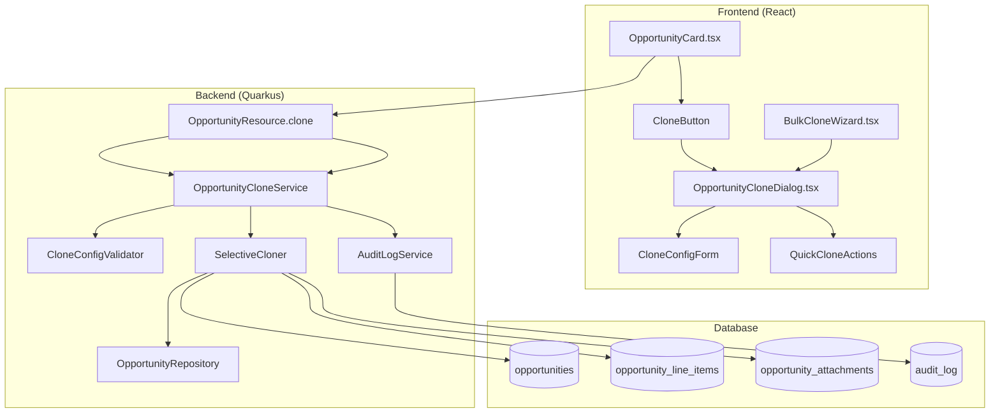

# FC-016: Technisches Konzept - Opportunity Cloning

**Feature Code:** FC-016  
**Datum:** 20.07.2025  
**Status:** Draft  
**Autor:** Claude  
**Reviewer:** Jörg Streeck  
**Geschätzter Aufwand:** 2-3 Tage  
**ROI:** 80% Zeitersparnis bei Folgegeschäften (10 Min → 30 Sek)  

## 📋 Inhaltsverzeichnis

1. [Zusammenfassung](#zusammenfassung)
2. [Ziel und Geschäftswert](#ziel-und-geschäftswert)
3. [Technische Architektur](#technische-architektur)
4. [Backend-Implementierung](#backend-implementierung)
5. [Frontend-Implementierung](#frontend-implementierung)
6. [Implementierungsstrategie](#implementierungsstrategie)
7. [Entscheidungs-Log](#entscheidungs-log)
8. [Risiken und Mitigationen](#risiken-und-mitigationen)
9. [Zeitschätzung](#zeitschätzung)

## Zusammenfassung

Ein-Klick Opportunity Cloning System für effiziente Erstellung von Folgegeschäften (Verlängerungen, Zusatzaufträge, Alternative Angebote). Intelligenter Clone-Dialog mit konfigurierbaren Übernahme-Optionen für Produkte, Rabatte, Team-Mitglieder und Dokumente. Auto-Anpassungen für Titel, Stage Reset und Datum plus Quick Clone Templates für Standard-Szenarien eliminieren manuelle Neueingabe bei Jahresverträgen durch strukturiertes Kopieren mit Smart Defaults.

## Ziel und Geschäftswert

### Geschäftsziele
- **Zeitersparnis maximieren**: 80% Zeitreduktion bei Folgegeschäften (10 Min → 30 Sek pro Clone), besonders bei Jahresverträgen und wiederkehrenden Services
- **Fehlerreduktion**: 90% weniger vergessene Produkte, Rabatte oder Konditionen durch automatische Übernahme bewährter Konfigurationen
- **Proaktive Verlängerungen**: 40% mehr rechtzeitige Renewal-Starts durch einfache Clone-Erstellung vor Vertragsende
- **Konsistenz steigern**: 100% identische Konditionen zwischen Original und Folgeauftrag, keine manuellen Abweichungen mehr

### Technische Ziele
- **Performance**: Clone-Operation <500ms auch bei 50+ Line Items, Memory-effizient durch selective Copy
- **Usability**: Intuitive Clone-UI mit max 3 Klicks vom Opportunity zur neuen Clone, Smart Defaults reduzieren User Input
- **Flexibilität**: Konfigurable Clone-Templates für verschiedene Szenarien (Renewal, Addon, Alternative), erweiterbar für neue Use Cases
- **Integration**: Nahtlose Einbindung in M4 Kanban Board, M8 Calculator und bestehende Opportunity-Workflows
- **Security & Compliance**: Clone-Berechtigungen über FC-008, Audit-Log für alle Clone-Operationen, DSGVO-konforme Datenübernahme

## Technische Architektur

### System-Übersicht



### Komponenten-Interaktion

**Clone-Flow:**
1. User klickt Clone Button in OpportunityCard
2. OpportunityCloneDialog öffnet sich mit Smart Defaults
3. User konfiguriert Übernahme-Optionen (optional)
4. Frontend sendet CloneConfiguration an Backend
5. OpportunityCloneService validiert und erstellt Clone
6. Neue Opportunity wird in Kanban Board angezeigt

**Quick Clone Templates:**
- Renewal: Vollständige Übernahme + Titel-Pattern + +1 Jahr
- Addon: Basis-Info + neue Produkte + gleicher Zeitraum
- Alternative: Alles + gleiche Stage + Titel-Prefix

## Backend-Implementierung

### 1. API Endpoints

```java
@Path("/api/opportunities/{id}/clone")
public class OpportunityCloneResource {
    
    @POST
    @RolesAllowed({"sales", "admin", "manager"})
    public CloneResult cloneOpportunity(@PathParam("id") UUID opportunityId,
                                      CloneConfiguration config) {
        
        Opportunity original = opportunityService.findById(opportunityId);
        
        // Security Check - User kann Original lesen
        if (!securityService.canAccess(original)) {
            throw new ForbiddenException("Keine Berechtigung für Opportunity Clone");
        }
        
        Opportunity cloned = opportunityCloneService.clone(original, config);
        
        return CloneResult.builder()
            .originalId(original.getId())
            .clonedId(cloned.getId())
            .clonedFields(config.getIncludedFields())
            .url("/opportunities/" + cloned.getId())
            .build();
    }
    
    @GET
    @Path("/templates")
    public List<CloneTemplate> getCloneTemplates() {
        return Arrays.asList(
            CloneTemplate.RENEWAL,
            CloneTemplate.ADDON,
            CloneTemplate.ALTERNATIVE
        );
    }
}
```

### 2. Clone Service Implementation

```java
@ApplicationScoped
@Transactional
public class OpportunityCloneService {
    
    @Inject OpportunityRepository opportunityRepository;
    @Inject LineItemRepository lineItemRepository;
    @Inject AttachmentService attachmentService;
    @Inject AuditLogService auditService;
    
    public Opportunity clone(Opportunity original, CloneConfiguration config) {
        
        // Basis-Opportunity klonen
        Opportunity cloned = createBaseClone(original, config);
        
        // Selektive Übernahme basierend auf Konfiguration
        if (config.isIncludeProducts()) {
            cloneLineItems(original, cloned);
        }
        
        if (config.isIncludeTeamMembers()) {
            cloneTeamMembers(original, cloned);
        }
        
        if (config.isIncludeAttachments()) {
            cloneAttachments(original, cloned);
        }
        
        if (config.isIncludeNotes()) {
            cloneNotes(original, cloned);
        }
        
        // Opportunity speichern
        Opportunity saved = opportunityRepository.save(cloned);
        
        // Audit Log
        auditService.log(AuditAction.OPPORTUNITY_CLONED, 
            Map.of(
                "originalId", original.getId(),
                "clonedId", saved.getId(),
                "clonedFields", config.getIncludedFields()
            ));
        
        return saved;
    }
    
    private Opportunity createBaseClone(Opportunity original, CloneConfiguration config) {
        return Opportunity.builder()
            .title(config.getNewTitle())
            .customerId(original.getCustomerId()) // Immer übernommen
            .stage(config.getTargetStage()) // Default: LEAD
            .expectedCloseDate(config.getExpectedCloseDate())
            .probability(config.getInitialProbability()) // Default: 10%
            .value(original.getValue()) // Erstmal übernommen, editierbar
            .assignedUserId(getCurrentUserId()) // Clone Creator wird Owner
            .createdBy(getCurrentUserId())
            .build();
    }
    
    private void cloneLineItems(Opportunity original, Opportunity cloned) {
        List<LineItem> originalItems = lineItemRepository.findByOpportunityId(original.getId());
        
        List<LineItem> clonedItems = originalItems.stream()
            .map(item -> LineItem.builder()
                .opportunityId(cloned.getId())
                .productId(item.getProductId())
                .quantity(item.getQuantity())
                .unitPrice(item.getUnitPrice())
                .discount(item.getDiscount())
                .description(item.getDescription())
                .build())
            .collect(Collectors.toList());
            
        lineItemRepository.saveAll(clonedItems);
        
        // Gesamtwert neu berechnen
        BigDecimal totalValue = clonedItems.stream()
            .map(LineItem::getTotalPrice)
            .reduce(BigDecimal.ZERO, BigDecimal::add);
            
        cloned.setValue(totalValue);
    }
}
```

### 3. Clone Configuration Model

```java
public class CloneConfiguration {
    
    // Basis-Eigenschaften
    private String newTitle;
    private OpportunityStage targetStage = OpportunityStage.LEAD;
    private LocalDate expectedCloseDate;
    private Integer initialProbability = 10;
    
    // Übernahme-Optionen
    private boolean includeProducts = true;
    private boolean includeDiscounts = true;
    private boolean includeTeamMembers = true;
    private boolean includeNotes = false;
    private boolean includeAttachments = false;
    
    // Template-basierte Konfiguration
    public static CloneConfiguration fromTemplate(CloneTemplate template, Opportunity original) {
        return switch (template) {
            case RENEWAL -> CloneConfiguration.builder()
                .newTitle(generateRenewalTitle(original.getTitle()))
                .expectedCloseDate(original.getExpectedCloseDate().plusYears(1))
                .includeProducts(true)
                .includeDiscounts(true)
                .includeTeamMembers(true)
                .includeNotes(false)
                .build();
                
            case ADDON -> CloneConfiguration.builder()
                .newTitle("Zusatz zu " + original.getTitle())
                .expectedCloseDate(LocalDate.now().plusDays(30))
                .includeProducts(false) // Neue Produkte hinzufügen
                .includeDiscounts(true)
                .includeTeamMembers(true)
                .build();
                
            case ALTERNATIVE -> CloneConfiguration.builder()
                .newTitle("Alternative: " + original.getTitle())
                .expectedCloseDate(original.getExpectedCloseDate())
                .targetStage(original.getStage()) // Gleiche Stage
                .includeProducts(true)
                .includeDiscounts(true)
                .includeTeamMembers(true)
                .build();
        };
    }
}

enum CloneTemplate {
    RENEWAL("Verlängerung"),
    ADDON("Zusatzauftrag"),
    ALTERNATIVE("Alternative");
    
    private final String displayName;
}
```

## Frontend-Implementierung

### 1. Clone Button Integration in OpportunityCard

```typescript
// In OpportunityCard.tsx
const OpportunityCard: React.FC<OpportunityCardProps> = ({ opportunity, index }) => {
  const { openCloneDialog } = useOpportunityClone();
  
  return (
    <Draggable draggableId={opportunity.id} index={index}>
      {(provided, snapshot) => (
        <CardContainer ref={provided.innerRef} {...provided.draggableProps} {...provided.dragHandleProps}>
          <CardHeader>
            <Title>{opportunity.title}</Title>
            <CardActions>
              <IconButton 
                size="small" 
                onClick={() => openCloneDialog(opportunity)}
                title="Opportunity klonen"
              >
                <ContentCopy fontSize="small" />
              </IconButton>
              <IconButton size="small">
                <MoreVert fontSize="small" />
              </IconButton>
            </CardActions>
          </CardHeader>
          
          <CustomerInfo customer={opportunity.customer} />
          <Value>{formatCurrency(opportunity.value)}</Value>
          <ProbabilitySlider value={opportunity.probability} />
        </CardContainer>
      )}
    </Draggable>
  );
};
```

### 2. OpportunityCloneDialog Hauptkomponente

```typescript
export const OpportunityCloneDialog: React.FC<CloneDialogProps> = ({ 
  opportunity, 
  open, 
  onClose 
}) => {
  const { cloneOpportunity } = useOpportunityMutations();
  const [config, setConfig] = useState<CloneConfiguration>(getDefaultConfig(opportunity));
  const [newTitle, setNewTitle] = useState(`Copy of ${opportunity.title}`);
  const [isLoading, setIsLoading] = useState(false);

  const handleClone = async () => {
    setIsLoading(true);
    try {
      const cloneConfig = { ...config, newTitle };
      const result = await cloneOpportunity.mutateAsync({ 
        opportunityId: opportunity.id, 
        config: cloneConfig 
      });
      
      toast.success(`Opportunity "${newTitle}" wurde erfolgreich erstellt`);
      onClose();
      
      // Navigation zur neuen Opportunity
      navigate(`/opportunities/${result.clonedId}`);
      
    } catch (error) {
      toast.error('Fehler beim Klonen der Opportunity');
    } finally {
      setIsLoading(false);
    }
  };

  return (
    <Dialog open={open} onClose={onClose} maxWidth="sm" fullWidth>
      <DialogTitle>
        <Box display="flex" alignItems="center">
          <ContentCopy sx={{ mr: 1, color: '#94C456' }} />
          Opportunity klonen
        </Box>
      </DialogTitle>
      
      <DialogContent>
        {/* Neuer Titel */}
        <TextField
          fullWidth
          label="Titel der neuen Opportunity"
          value={newTitle}
          onChange={(e) => setNewTitle(e.target.value)}
          sx={{ mb: 3 }}
          autoFocus
          helperText="Tipp: Fügen Sie das Jahr oder Quartal hinzu"
        />

        {/* Quick Templates */}
        <Box mb={3}>
          <Typography variant="subtitle2" gutterBottom>
            Schnelle Vorlagen:
          </Typography>
          <ButtonGroup variant="outlined" size="small">
            <Button 
              startIcon={<Refresh />}
              onClick={() => applyTemplate('RENEWAL')}
            >
              Verlängerung
            </Button>
            <Button 
              startIcon={<Add />}
              onClick={() => applyTemplate('ADDON')}
            >
              Zusatz
            </Button>
            <Button 
              startIcon={<SwapHoriz />}
              onClick={() => applyTemplate('ALTERNATIVE')}
            >
              Alternative
            </Button>
          </ButtonGroup>
        </Box>

        {/* Clone-Optionen */}
        <CloneConfigurationForm 
          config={config} 
          onChange={setConfig}
          opportunity={opportunity}
        />

        {/* Smart Suggestions */}
        <SmartSuggestions opportunity={opportunity} onSuggestionApply={setNewTitle} />
        
      </DialogContent>
      
      <DialogActions>
        <Button onClick={onClose} disabled={isLoading}>
          Abbrechen
        </Button>
        <Button 
          variant="contained" 
          startIcon={<ContentCopy />}
          onClick={handleClone}
          disabled={isLoading || !newTitle.trim()}
          sx={{ bgcolor: '#94C456', '&:hover': { bgcolor: '#7FA93F' } }}
        >
          {isLoading ? 'Wird geklont...' : 'Opportunity klonen'}
        </Button>
      </DialogActions>
    </Dialog>
  );
};
```

### 3. CloneConfigurationForm Komponente

```typescript
const CloneConfigurationForm: React.FC<CloneConfigFormProps> = ({ 
  config, 
  onChange, 
  opportunity 
}) => {
  const updateConfig = (updates: Partial<CloneConfiguration>) => {
    onChange({ ...config, ...updates });
  };

  return (
    <Box>
      <FormGroup>
        <FormLabel component="legend" sx={{ mb: 2 }}>
          Was soll übernommen werden?
        </FormLabel>
        
        {/* Immer übernommen */}
        <FormControlLabel
          control={<Checkbox checked disabled />}
          label={
            <Box>
              <Typography>Kunde & Kontakte</Typography>
              <Typography variant="caption" color="text.secondary">
                {opportunity.customerName} ({opportunity.contacts?.length || 0} Kontakte)
              </Typography>
            </Box>
          }
        />

        {/* Produkte & Konditionen */}
        <FormControlLabel
          control={
            <Checkbox
              checked={config.includeProducts}
              onChange={(e) => updateConfig({ 
                includeProducts: e.target.checked,
                includeDiscounts: e.target.checked // Discounts nur mit Produkten
              })}
            />
          }
          label={
            <Box>
              <Typography>Produkte & Mengen</Typography>
              <Typography variant="caption" color="text.secondary">
                {opportunity.lineItems?.length || 0} Positionen, 
                Wert: {formatCurrency(opportunity.value)}
              </Typography>
            </Box>
          }
        />

        {config.includeProducts && (
          <FormControlLabel
            control={
              <Checkbox
                checked={config.includeDiscounts}
                onChange={(e) => updateConfig({ includeDiscounts: e.target.checked })}
              />
            }
            label="Rabatte & Sonderkonditionen"
            sx={{ ml: 3 }}
          />
        )}

        {/* Team */}
        <FormControlLabel
          control={
            <Checkbox
              checked={config.includeTeamMembers}
              onChange={(e) => updateConfig({ includeTeamMembers: e.target.checked })}
            />
          }
          label={
            <Box>
              <Typography>Team-Mitglieder</Typography>
              <Typography variant="caption" color="text.secondary">
                {opportunity.teamMembers?.map(m => m.name).join(', ') || 'Nur Sie'}
              </Typography>
            </Box>
          }
        />

        {/* Notizen & Dokumente */}
        <FormControlLabel
          control={
            <Checkbox
              checked={config.includeNotes}
              onChange={(e) => updateConfig({ includeNotes: e.target.checked })}
            />
          }
          label="Notizen & Kommentare"
        />

        <FormControlLabel
          control={
            <Checkbox
              checked={config.includeAttachments}
              onChange={(e) => updateConfig({ includeAttachments: e.target.checked })}
            />
          }
          label={
            <Box>
              <Typography>Dokumente & Anhänge</Typography>
              <Typography variant="caption" color="text.secondary">
                {opportunity.attachments?.length || 0} Dateien
              </Typography>
            </Box>
          }
        />
      </FormGroup>

      {/* Erwartetes Abschlussdatum */}
      <TextField
        fullWidth
        type="date"
        label="Erwarteter Abschluss"
        value={config.expectedCloseDate?.toISOString().split('T')[0] || ''}
        onChange={(e) => updateConfig({ 
          expectedCloseDate: new Date(e.target.value) 
        })}
        sx={{ mt: 3 }}
        InputLabelProps={{ shrink: true }}
      />
    </Box>
  );
};
```

### 4. Hooks für Clone-Funktionalität

```typescript
// useOpportunityClone Hook
export const useOpportunityClone = () => {
  const [dialogState, setDialogState] = useState<{
    isOpen: boolean;
    opportunity: Opportunity | null;
  }>({ isOpen: false, opportunity: null });

  const openCloneDialog = (opportunity: Opportunity) => {
    setDialogState({ isOpen: true, opportunity });
  };

  const closeCloneDialog = () => {
    setDialogState({ isOpen: false, opportunity: null });
  };

  return {
    ...dialogState,
    openCloneDialog,
    closeCloneDialog
  };
};

// useOpportunityMutations Extension
export const useOpportunityMutations = () => {
  const queryClient = useQueryClient();
  
  const cloneOpportunity = useMutation({
    mutationFn: async ({ opportunityId, config }: CloneParams) => {
      const response = await apiClient.post(
        `/api/opportunities/${opportunityId}/clone`,
        config
      );
      return response.data as CloneResult;
    },
    onSuccess: (result) => {
      // Invalidate opportunity queries to show new clone
      queryClient.invalidateQueries(['opportunities']);
      
      // Optimistically add to cache if we have the opportunity list
      const opportunitiesQuery = queryClient.getQueryData(['opportunities']);
      if (opportunitiesQuery) {
        // Add cloned opportunity to the list
        queryClient.setQueryData(['opportunities'], (old: any) => ({
          ...old,
          data: [...old.data, result.clonedOpportunity]
        }));
      }
    },
    onError: (error: ApiError) => {
      console.error('Clone failed:', error);
      toast.error(`Klonen fehlgeschlagen: ${error.message}`);
    }
  });

  return { cloneOpportunity };
};
```

## Implementierungsstrategie

**Ansatz:** Frontend-fokussierte Implementierung mit minimaler Backend-Erweiterung, da M4 Opportunity Pipeline bereits vollständig vorhanden ist.

### Phase 1: Core Clone Funktionalität (1 Tag)

**Tag 1: Backend Clone Service + Frontend Dialog**
- OpportunityCloneResource REST Endpoint erstellen
- OpportunityCloneService mit selektiver Copy-Logik
- CloneConfiguration Model für flexible Übernahme-Optionen
- OpportunityCloneDialog React Komponente mit MUI
- Basic Clone Button in OpportunityCard integrieren

### Phase 2: Smart Templates & UX Polish (1 Tag)

**Tag 2: Quick Clone Templates + Smart Defaults**
- CloneTemplate Enum (RENEWAL, ADDON, ALTERNATIVE)
- Smart Title Generation (Jahr-Pattern, Präfixe)
- CloneConfigurationForm mit granularen Optionen
- Smart Suggestions basierend auf Opportunity-Typ
- Error Handling + Toast Notifications

### Phase 3: Testing & Integration (0.5-1 Tag)

**Tag 3: Testing & Kanban Integration**
- Unit Tests für OpportunityCloneService (Copy-Logik)
- Frontend Tests für CloneDialog Workflow
- Integration Tests für Clone API Endpoint
- Optimistic Updates im Kanban Board
- Performance Tests für große Line Item Listen

**Optional: Bulk Clone Wizard (falls Zeit vorhanden)**
- BulkCloneWizard für Serien-Cloning
- Stepper-basierte UX für Massenoperationen

## Entscheidungs-Log

### 20.07.2025 - Deep vs. Shallow Clone Strategy
**Entscheidung**: Selective Clone mit konfigurierbaren Optionen statt Deep Clone für alles  
**Begründung**: Mehr Flexibilität für User, bessere Performance, verhindert ungewollte Übernahme von Notizen/Attachments  
**Impact**: Komplexere UI, aber bessere User Experience und Performance  
**Alternativen**: Full Deep Clone (einfacher aber weniger flexibel), Always Shallow Clone (weniger nützlich)  
**Entscheider**: Development Team + Sales Team Input

### 20.07.2025 - Clone Templates vs. Free Configuration  
**Entscheidung**: Hybrid-Ansatz mit Quick Templates PLUS freie Konfiguration  
**Begründung**: Templates für 80% der Use Cases (Renewal, Addon, Alternative), freie Config für Power-User  
**Impact**: Mehr Development Effort, aber deutlich bessere UX für alle User-Level  
**Alternativen**: Nur Templates (zu einschränkend), nur freie Config (zu komplex für Standard-Use-Cases)  
**Entscheider**: UX Team + Sales Team

### 20.07.2025 - Clone Button Platzierung
**Entscheidung**: Clone Button in OpportunityCard Actions + Context Menu  
**Begründung**: Sofort sichtbar aber nicht zu prominent, keine UI-Überladung  
**Impact**: Einfache Integration, konsistent mit bestehender Card-Struktur  
**Alternativen**: Separate Clone Tab (zu versteckt), Bulk Actions nur (zu eingeschränkt)  
**Entscheider**: UX Team

## Risiken und Mitigationen

### Risiko 1: Performance bei großen Line Item Listen
**Wahrscheinlichkeit**: Mittel  
**Impact**: Mittel  
**Mitigation**: 
- Streaming Clone für >50 Line Items
- Progress Indicator für lange Clone-Operationen
- Memory-effiziente Copy-Algorithmen mit Chunking
- Client-side Validation vor Clone-Start

### Risiko 2: Dateninkonsistenz bei gleichzeitigen Änderungen
**Wahrscheinlichkeit**: Niedrig  
**Impact**: Hoch  
**Mitigation**: 
- Snapshot-based Clone (Point-in-Time Copy)
- Optimistic Locking mit Conflict Detection
- Retry-Mechanismus bei Conflicts
- Clear Error Messages für User

### Risiko 3: User Confusion bei Clone-Optionen
**Wahrscheinlichkeit**: Mittel  
**Impact**: Niedrig  
**Mitigation**: 
- Smart Defaults für 90% der Use Cases
- Progressive Disclosure (Advanced Options ausklappbar)
- Inline Help Text und Tooltips
- Quick Templates für Standard-Szenarien

### Risiko 4: Integration Complexity mit M8 Calculator
**Wahrscheinlichkeit**: Niedrig  
**Impact**: Mittel  
**Mitigation**: 
- Interface-first Design mit Calculator Service
- Mock Calculator für Development
- Graceful Degradation wenn Calculator nicht verfügbar
- Separate Clone-Phase für Calculator-Integration

## Zeitschätzung

**Gesamt-Aufwand**: 2-3 Tage

### Detaillierte Aufwands-Verteilung:
- **Backend**: 0.5 Tage
  - Clone Service & API Endpoint (4h)
- **Frontend**: 1.5 Tage  
  - Clone Dialog & Configuration Form (8h)
  - Templates & Smart Defaults (4h)
- **Integration & Testing**: 0.5 Tage
  - Unit/Integration Tests (3h)
  - Kanban Board Integration (1h)
- **Dokumentation**: 0.5 Tage
  - User Guide & API Docs (4h)

**Puffer**: +0.5 Tage für unvorhergesehene Probleme

### Realistische Einschätzung:
- **Optimistisch**: 2 Tage (alles läuft perfekt)
- **Wahrscheinlich**: 2.5 Tage (normale Entwicklung)  
- **Pessimistisch**: 3 Tage (mit UI/UX Iterationen)

### Kritische Abhängigkeiten:
- **M4 Opportunity Pipeline**: ✅ Fertig (Basis für Clone)
- **FC-008 Security**: ✅ Fertig (Clone-Berechtigungen)
- **M8 Calculator**: Optional (für Product-Clone Enhancement)

---

## 🧭 Navigation & Verweise

### 📋 Zurück zum Überblick:
- **[📊 Master Plan V5](/docs/CRM_COMPLETE_MASTER_PLAN_V5.md)** - Vollständige Feature-Roadmap
- **[🗺️ Feature Overview](/docs/features/MASTER/FEATURE_OVERVIEW.md)** - Alle 40 Features im Überblick
- **[🔄 FC-016 KOMPAKT](/docs/features/PLANNED/18_opportunity_cloning/FC-016_TECH_CONCEPT.md)** - 15-Min Übersicht

### 🔗 Dependencies (Required):
- **[📊 M4 Opportunity Pipeline](/docs/features/ACTIVE/02_opportunity_pipeline/M4_TECH_CONCEPT.md)** - Opportunity Entity zum Klonen ✅
- **[🔒 FC-008 Security Foundation](/docs/features/ACTIVE/01_security_foundation/FC-008_TECH_CONCEPT.md)** - Clone-Berechtigungen ✅
- **[👥 FC-009 Permissions System](/docs/features/ACTIVE/04_permissions_system/FC-009_TECH_CONCEPT.md)** - Role-based Clone Access ✅

### ⚡ Integrationen:
- **[🧮 M8 Calculator Modal](/docs/features/ACTIVE/03_calculator_modal/M8_TECH_CONCEPT.md)** - Produkte & Rabatte klonen
- **[👥 M5 Customer Refactor](/docs/features/PLANNED/12_customer_refactor_m5/M5_TECH_CONCEPT.md)** - Customer-Daten übernehmen
- **[📈 FC-014 Activity Timeline](/docs/features/PLANNED/16_activity_timeline/FC-014_TECH_CONCEPT.md)** - Clone-Events tracken

### 🚀 Ermöglicht folgende Features:
- **[📊 M3 Sales Cockpit](/docs/features/ACTIVE/05_ui_foundation/M3_TECH_CONCEPT.md)** - Bulk Clone Actions
- **[➕ M2 Quick Create](/docs/features/ACTIVE/05_ui_foundation/M2_TECH_CONCEPT.md)** - Clone als Quick Action
- **[📊 M6 Analytics Module](/docs/features/PLANNED/13_analytics_m6/M6_TECH_CONCEPT.md)** - Clone Usage Analytics

### 🎨 UI Integration:
- **[🧭 M1 Navigation](/docs/features/ACTIVE/05_ui_foundation/M1_TECH_CONCEPT.md)** - Clone im Actions-Menü
- **[⚙️ M7 Settings](/docs/features/ACTIVE/05_ui_foundation/M7_TECH_CONCEPT.md)** - Clone Templates Config

### 📋 Planungsstruktur:
- **[🗺️ Meta-Planning](/docs/claude-work/daily-work/2025-07-20/2025-07-20_META_PLANNING_technical_concepts.md)** - Claude-optimierte Planungsstruktur für technische Konzepte

---

**Status-Updates**:
- **20.07.2025**: Technisches Konzept erstellt (Draft) - Claude
- **Status**: ✅ BEREIT FÜR IMPLEMENTIERUNG - Quick Win Feature mit klarer 2-3 Tage Roadmap