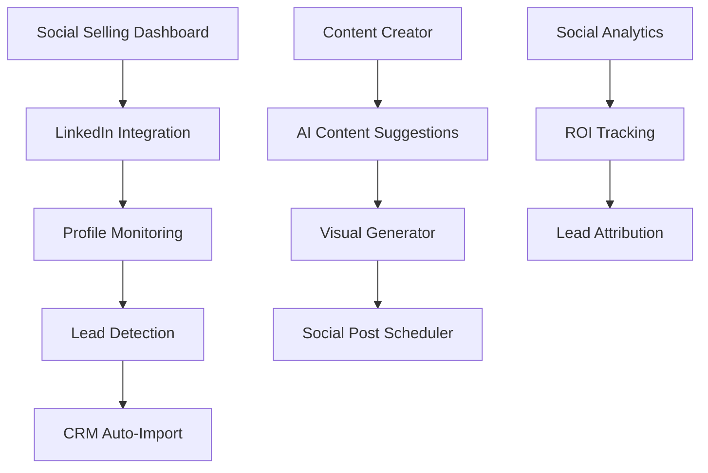

# 📱 FC-035: Social Selling Helper - TECH CONCEPT

**Feature-Code:** FC-035  
**Feature-Name:** Social Selling Helper  
**Kategorie:** Social Media & Sales Automation  
**Priorität:** MEDIUM  
**Geschätzter Aufwand:** 3 Tage  
**Status:** 📋 PLANNED - Tech Concept verfügbar  

---

## 🧠 CLAUDE WORKING SECTION (15-Min Context Chunk)

### ⚡ SOFORT STARTEN (2 Minuten):
```bash
# 1. Social Media Integration Setup
cd backend/src/main/java/de/freshplan/integration
mkdir social && cd social
touch LinkedInService.java SocialPostService.java SocialProfileEntity.java

# 2. Frontend Social Components
cd frontend/src/features
mkdir social-selling && cd social-selling
touch SocialFeed.tsx SocialPostComposer.tsx SocialInsights.tsx
```

### 📋 IMPLEMENTIERUNGS-CHECKLISTE:
- [ ] **Phase 1:** LinkedIn API Integration & Profile Sync (Tag 1)
- [ ] **Phase 2:** Social Content Creation & Posting Tools (Tag 2)  
- [ ] **Phase 3:** Social Insights & Lead Tracking (Tag 3)

---

## 🎯 FEATURE OVERVIEW

### Was ist Social Selling Helper?
Integrierte Social Media Verkaufsunterstützung die LinkedIn-Profile überwacht, relevante Inhalte für B2B-Catering vorschlägt, automatisierte Outreach-Kampagnen erstellt und Social Media Leads ins CRM integriert.

### Business Value
- **Automatisierte Lead-Generierung** über LinkedIn
- **Professionelle Content-Erstellung** für B2B-Catering  
- **Systematisches Relationship Building** mit Entscheidern
- **Messbare Social ROI** durch integrierte Analytics

### Erfolgsmetriken
- 50% mehr qualifizierte Leads über Social Media
- 30% Erhöhung der LinkedIn-Engagement-Rate
- 25% Reduktion der Time-to-Lead durch Social Intelligence

---

## 🏗️ TECHNISCHE ARCHITEKTUR

### Tech Stack
- **LinkedIn API:** Official LinkedIn Marketing API v2
- **Content Generation:** OpenAI GPT-4 für Content-Vorschläge
- **Frontend:** React + Material-UI + Social Media Embeds
- **Backend:** Quarkus + Scheduled Jobs für Social Monitoring
- **Image Processing:** Canvas API für Social Media Graphics

### System Architecture


### Component Architecture
```typescript
social-selling/
├── components/
│   ├── SocialDashboard.tsx        # Main Social Hub
│   ├── LinkedInFeed.tsx           # LinkedIn Activity Feed
│   ├── ContentComposer.tsx        # AI-powered Content Creation
│   ├── SocialPostScheduler.tsx    # Post Planning & Scheduling
│   ├── SocialLeadsPanel.tsx       # Lead Management
│   └── SocialAnalytics.tsx        # ROI & Performance Metrics
├── hooks/
│   ├── useLinkedInProfile.ts      # LinkedIn Profile Data
│   ├── useSocialContent.ts        # Content Management
│   ├── useSocialLeads.ts          # Lead Tracking
│   └── useSocialAnalytics.ts      # Analytics Data
├── services/
│   ├── linkedInApi.ts             # LinkedIn API Client
│   ├── socialContentApi.ts        # Content Management API
│   └── socialAnalyticsApi.ts      # Analytics API
└── utils/
    ├── contentTemplates.ts        # B2B Catering Templates
    ├── socialFormatters.ts        # Post Formatters
    └── leadScoring.ts             # Social Lead Scoring
```

---

## 🔗 LINKEDIN INTEGRATION

### LinkedIn API Service
```java
@ApplicationScoped
public class LinkedInService {
    
    @ConfigProperty(name = "linkedin.client.id")
    String clientId;
    
    @ConfigProperty(name = "linkedin.client.secret") 
    String clientSecret;
    
    @ConfigProperty(name = "linkedin.api.base.url")
    String baseUrl;
    
    private final OkHttpClient httpClient = new OkHttpClient();
    
    public CompletionStage<LinkedInProfile> getProfile(String accessToken) {
        return CompletableFuture.supplyAsync(() -> {
            try {
                Request request = new Request.Builder()
                    .url(baseUrl + "/v2/people/~:(id,firstName,lastName,headline,industry,positions)")
                    .addHeader("Authorization", "Bearer " + accessToken)
                    .addHeader("X-Restli-Protocol-Version", "2.0.0")
                    .build();
                
                try (Response response = httpClient.newCall(request).execute()) {
                    if (!response.isSuccessful()) {
                        throw new LinkedInApiException("Failed to fetch profile: " + response.code());
                    }
                    
                    String responseBody = response.body().string();
                    return parseLinkedInProfile(responseBody);
                }
            } catch (Exception e) {
                Log.error("LinkedIn API error", e);
                throw new LinkedInApiException("Failed to fetch LinkedIn profile", e);
            }
        });
    }
    
    public CompletionStage<List<LinkedInConnection>> getConnections(String accessToken) {
        return CompletableFuture.supplyAsync(() -> {
            // Fetch user's LinkedIn connections
            // Filter for potential B2B catering prospects
            // Extract company information and decision-maker roles
        });
    }
    
    public CompletionStage<SocialPostResponse> publishPost(
        String accessToken, 
        SocialPostRequest postRequest
    ) {
        return CompletableFuture.supplyAsync(() -> {
            try {
                // Build LinkedIn post payload
                JSONObject postData = new JSONObject()
                    .put("author", "urn:li:person:" + postRequest.getAuthorId())
                    .put("lifecycleState", "PUBLISHED")
                    .put("specificContent", new JSONObject()
                        .put("com.linkedin.ugc.ShareContent", new JSONObject()
                            .put("shareCommentary", new JSONObject()
                                .put("text", postRequest.getContent())
                            )
                            .put("shareMediaCategory", "NONE")
                        )
                    )
                    .put("visibility", new JSONObject()
                        .put("com.linkedin.ugc.MemberNetworkVisibility", "PUBLIC")
                    );
                
                Request request = new Request.Builder()
                    .url(baseUrl + "/v2/ugcPosts")
                    .addHeader("Authorization", "Bearer " + accessToken)
                    .addHeader("Content-Type", "application/json")
                    .addHeader("X-Restli-Protocol-Version", "2.0.0")
                    .post(RequestBody.create(
                        postData.toString(),
                        MediaType.get("application/json")
                    ))
                    .build();
                
                try (Response response = httpClient.newCall(request).execute()) {
                    if (!response.isSuccessful()) {
                        throw new LinkedInApiException("Failed to publish post: " + response.code());
                    }
                    
                    return SocialPostResponse.builder()
                        .postId(extractPostId(response.body().string()))
                        .publishedAt(LocalDateTime.now())
                        .status("PUBLISHED")
                        .build();
                }
            } catch (Exception e) {
                Log.error("Failed to publish LinkedIn post", e);
                throw new LinkedInApiException("Failed to publish post", e);
            }
        });
    }
}
```

### Social Profile Entity
```java
@Entity
@Table(name = "social_profiles")
public class SocialProfile extends BaseEntity {
    
    @Column(name = "user_id", nullable = false)
    private UUID userId;
    
    @Enumerated(EnumType.STRING)
    @Column(name = "platform", nullable = false)
    private SocialPlatform platform; // LINKEDIN, XING, TWITTER
    
    @Column(name = "profile_id")
    private String profileId;
    
    @Column(name = "profile_url")
    private String profileUrl;
    
    @Column(name = "display_name")
    private String displayName;
    
    @Column(name = "headline")
    private String headline;
    
    @Column(name = "industry")
    private String industry;
    
    @Column(name = "connection_count")
    private Integer connectionCount;
    
    @Column(name = "access_token")
    private String accessToken; // Encrypted
    
    @Column(name = "token_expires_at")
    private LocalDateTime tokenExpiresAt;
    
    @Column(name = "last_sync_at")
    private LocalDateTime lastSyncAt;
    
    @Column(name = "is_active")
    private Boolean isActive = true;
    
    // Getters/Setters
}
```

---

## 🎨 CONTENT CREATION ENGINE

### AI-Powered Content Generator
```java
@ApplicationScoped
public class SocialContentService {
    
    @Inject
    OpenAIService openaiService;
    
    @Inject
    SocialContentRepository contentRepository;
    
    public CompletionStage<List<SocialContentSuggestion>> generateCateringContent(
        ContentGenerationRequest request
    ) {
        return CompletableFuture.supplyAsync(() -> {
            // Generate multiple content variations
            List<CompletableFuture<SocialContentSuggestion>> contentFutures = List.of(
                generateThoughtLeadershipPost(request),
                generateIndustryInsightPost(request),
                generateCustomerSuccessStory(request),
                generateTrendingTopicPost(request)
            );
            
            return contentFutures.stream()
                .map(CompletableFuture::join)
                .collect(Collectors.toList());
        });
    }
    
    private CompletableFuture<SocialContentSuggestion> generateThoughtLeadershipPost(
        ContentGenerationRequest request
    ) {
        String prompt = String.format("""
            Erstelle einen professionellen LinkedIn-Post für ein B2B-Catering-Unternehmen:
            
            Kontext: %s
            Zielgruppe: Entscheider in Unternehmen, HR-Manager, Office-Manager
            Stil: Thought Leadership, professionell aber nahbar
            Länge: 150-200 Wörter
            
            Themen-Fokus:
            - Mitarbeiterzufriedenheit durch gutes Essen
            - Produktivitätssteigerung im Office
            - Nachhaltigkeit in der Unternehmensverpflegung
            
            Format:
            - Hook in ersten 2 Zeilen
            - Persönliche Erfahrung oder Insights
            - Call-to-Action
            - 3-5 relevante Hashtags
            
            Schreibe auf Deutsch, professionell aber nicht steif.
            """, request.getContext());
        
        return openaiService.generateContent(prompt)
            .thenApply(content -> SocialContentSuggestion.builder()
                .type(SocialContentType.THOUGHT_LEADERSHIP)
                .content(content)
                .platform(SocialPlatform.LINKEDIN)
                .estimatedReach(calculateEstimatedReach(request))
                .hashtags(extractHashtags(content))
                .build()
            )
            .toCompletableFuture();
    }
    
    private CompletableFuture<SocialContentSuggestion> generateCustomerSuccessStory(
        ContentGenerationRequest request
    ) {
        String prompt = String.format("""
            Erstelle eine anonymisierte Kunden-Erfolgsgeschichte für LinkedIn:
            
            Branche: %s
            Herausforderung: %s
            Lösung: Professionelles B2B-Catering
            
            Struktur:
            - Ausgangssituation (anonymisiert)
            - Herausforderung
            - Unsere Lösung
            - Messbares Ergebnis
            - Learnings für andere Unternehmen
            
            Stil: Case Study, authentisch, datengetrieben
            Länge: 180-220 Wörter
            """, request.getIndustry(), request.getChallenge());
        
        return openaiService.generateContent(prompt)
            .thenApply(content -> SocialContentSuggestion.builder()
                .type(SocialContentType.CUSTOMER_SUCCESS)
                .content(content)
                .platform(SocialPlatform.LINKEDIN)
                .credibilityScore(0.9f) // High credibility for case studies
                .build()
            )
            .toCompletableFuture();
    }
}
```

### Frontend Content Composer
```typescript
export const ContentComposer: React.FC<ContentComposerProps> = ({
  onPublish,
  onSaveDraft
}) => {
  const [content, setContent] = useState('');
  const [selectedTemplate, setSelectedTemplate] = useState<ContentTemplate | null>(null);
  const [aiSuggestions, setAiSuggestions] = useState<SocialContentSuggestion[]>([]);
  const [isGenerating, setIsGenerating] = useState(false);
  
  const generateAiContent = async (prompt: string) => {
    setIsGenerating(true);
    try {
      const suggestions = await socialContentApi.generateContent({
        prompt,
        platform: 'LINKEDIN',
        targetAudience: 'B2B_DECISION_MAKERS',
        industry: 'CATERING'
      });
      setAiSuggestions(suggestions);
    } finally {
      setIsGenerating(false);
    }
  };
  
  const applyAiSuggestion = (suggestion: SocialContentSuggestion) => {
    setContent(suggestion.content);
    // Trigger character count, hashtag analysis, etc.
  };
  
  return (
    <Paper sx={{ p: 3, maxWidth: 600 }}>
      <Box sx={{ mb: 2 }}>
        <Typography variant="h6" fontFamily="Antonio Bold">
          Social Media Post erstellen
        </Typography>
      </Box>
      
      {/* AI Content Generator */}
      <Box sx={{ mb: 3 }}>
        <Typography variant="subtitle2" gutterBottom>
          KI-Inhalte generieren
        </Typography>
        <Grid container spacing={1}>
          <Grid item>
            <Button
              variant="outlined"
              startIcon={<LightbulbIcon />}
              onClick={() => generateAiContent('thought-leadership')}
              disabled={isGenerating}
            >
              Thought Leadership
            </Button>
          </Grid>
          <Grid item>
            <Button
              variant="outlined"
              startIcon={<TrendingUpIcon />}
              onClick={() => generateAiContent('industry-trends')}
              disabled={isGenerating}
            >
              Branchentrends
            </Button>
          </Grid>
          <Grid item>
            <Button
              variant="outlined"
              startIcon={<StarIcon />}
              onClick={() => generateAiContent('customer-success')}
              disabled={isGenerating}
            >
              Kundenerfolg
            </Button>
          </Grid>
        </Grid>
      </Box>
      
      {/* AI Suggestions */}
      {aiSuggestions.length > 0 && (
        <Box sx={{ mb: 3 }}>
          <Typography variant="subtitle2" gutterBottom>
            KI-Vorschläge
          </Typography>
          {aiSuggestions.map((suggestion, index) => (
            <Card key={index} sx={{ mb: 1, p: 2, cursor: 'pointer' }}
                  onClick={() => applyAiSuggestion(suggestion)}>
              <Typography variant="body2" sx={{ mb: 1 }}>
                {truncateText(suggestion.content, 100)}
              </Typography>
              <Box sx={{ display: 'flex', gap: 1 }}>
                <Chip 
                  size="small" 
                  label={suggestion.type} 
                  color="primary" 
                />
                <Chip 
                  size="small" 
                  label={`${suggestion.estimatedReach} Reichweite`} 
                  variant="outlined" 
                />
              </Box>
            </Card>
          ))}
        </Box>
      )}
      
      {/* Content Editor */}
      <Box sx={{ mb: 2 }}>
        <TextField
          multiline
          rows={8}
          fullWidth
          value={content}
          onChange={(e) => setContent(e.target.value)}
          placeholder="Was möchten Sie teilen?"
          variant="outlined"
          helperText={`${content.length}/3000 Zeichen`}
        />
      </Box>
      
      {/* Content Analysis */}
      <ContentAnalysisPanel content={content} />
      
      {/* Publishing Options */}
      <Box sx={{ display: 'flex', gap: 2, mt: 3 }}>
        <Button
          variant="contained"
          startIcon={<PublishIcon />}
          onClick={() => onPublish(content)}
          disabled={!content.trim()}
          sx={{ bgcolor: '#94C456' }}
        >
          Sofort veröffentlichen
        </Button>
        <Button
          variant="outlined"
          startIcon={<ScheduleIcon />}
          onClick={() => openScheduleModal(content)}
        >
          Planen
        </Button>
        <Button
          variant="text"
          onClick={() => onSaveDraft(content)}
        >
          Als Entwurf speichern
        </Button>
      </Box>
    </Paper>
  );
};

// Content Analysis Component
const ContentAnalysisPanel: React.FC<{ content: string }> = ({ content }) => {
  const analysis = useMemo(() => analyzeContent(content), [content]);
  
  return (
    <Box sx={{ p: 2, bgcolor: 'grey.50', borderRadius: 1 }}>
      <Typography variant="subtitle2" gutterBottom>
        Content-Analyse
      </Typography>
      <Grid container spacing={2}>
        <Grid item xs={3}>
          <Chip 
            label={`${analysis.wordCount} Wörter`}
            color={analysis.wordCount >= 20 && analysis.wordCount <= 100 ? 'success' : 'warning'}
            size="small"
          />
        </Grid>
        <Grid item xs={3}>
          <Chip 
            label={`${analysis.hashtags.length} Hashtags`}
            color={analysis.hashtags.length >= 3 && analysis.hashtags.length <= 5 ? 'success' : 'warning'}
            size="small"
          />
        </Grid>
        <Grid item xs={3}>
          <Chip 
            label={`${analysis.readabilityScore}% Lesbarkeit`}
            color={analysis.readabilityScore > 70 ? 'success' : 'warning'}
            size="small"
          />
        </Grid>
        <Grid item xs={3}>
          <Chip 
            label={analysis.sentiment}
            color={analysis.sentiment === 'positive' ? 'success' : 'default'}
            size="small"
          />
        </Grid>
      </Grid>
    </Box>
  );
};
```

---

## 🎯 LEAD DETECTION & TRACKING

### Social Lead Scoring
```java
@ApplicationScoped
public class SocialLeadService {
    
    @Inject
    LinkedInService linkedInService;
    
    @Inject
    CustomerRepository customerRepository;
    
    public CompletionStage<List<SocialLead>> detectPotentialLeads(String accessToken) {
        return linkedInService.getConnections(accessToken)
            .thenApply(connections -> 
                connections.stream()
                    .map(this::scorePotentialLead)
                    .filter(lead -> lead.getScore() > 0.6f) // Only high-potential leads
                    .sorted((a, b) -> Float.compare(b.getScore(), a.getScore()))
                    .collect(Collectors.toList())
            );
    }
    
    private SocialLead scorePotentialLead(LinkedInConnection connection) {
        float score = 0.0f;
        
        // Industry relevance (40% weight)
        if (isCateringRelevantIndustry(connection.getIndustry())) {
            score += 0.4f;
        }
        
        // Job title/seniority (30% weight)
        if (isDecisionMakerRole(connection.getJobTitle())) {
            score += 0.3f;
        }
        
        // Company size (20% weight)
        if (isTargetCompanySize(connection.getCompanySize())) {
            score += 0.2f;
        }
        
        // Recent activity/engagement (10% weight)
        if (hasRecentEngagement(connection.getProfileId())) {
            score += 0.1f;
        }
        
        return SocialLead.builder()
            .connectionId(connection.getId())
            .profileUrl(connection.getProfileUrl())
            .name(connection.getName())
            .jobTitle(connection.getJobTitle())
            .company(connection.getCompany())
            .industry(connection.getIndustry())
            .score(score)
            .detectedAt(LocalDateTime.now())
            .status(SocialLeadStatus.NEW)
            .build();
    }
    
    private boolean isCateringRelevantIndustry(String industry) {
        Set<String> relevantIndustries = Set.of(
            "Information Technology",
            "Financial Services", 
            "Healthcare",
            "Manufacturing",
            "Consulting",
            "Real Estate",
            "Legal Services"
        );
        return relevantIndustries.contains(industry);
    }
    
    private boolean isDecisionMakerRole(String jobTitle) {
        String lowerTitle = jobTitle.toLowerCase();
        return lowerTitle.contains("hr") ||
               lowerTitle.contains("office manager") ||
               lowerTitle.contains("facility") ||
               lowerTitle.contains("ceo") ||
               lowerTitle.contains("coo") ||
               lowerTitle.contains("admin");
    }
}
```

### Lead Integration Pipeline
```java
@ApplicationScoped
public class SocialLeadIntegrationService {
    
    @Inject
    CustomerService customerService;
    
    @Inject
    OpportunityService opportunityService;
    
    @Inject
    EmailService emailService;
    
    public CompletionStage<CustomerCreationResult> convertSocialLeadToCustomer(
        SocialLead socialLead,
        ConversionRequest request
    ) {
        return CompletableFuture.supplyAsync(() -> {
            try {
                // 1. Check for existing customer
                Optional<Customer> existingCustomer = customerRepository
                    .findByCompanyName(socialLead.getCompany());
                
                if (existingCustomer.isPresent()) {
                    // Update existing customer with social info
                    Customer customer = existingCustomer.get();
                    customer.addSocialProfile(socialLead.getProfileUrl());
                    customer.addNote(String.format(
                        "LinkedIn-Kontakt hinzugefügt: %s (%s)",
                        socialLead.getName(),
                        socialLead.getJobTitle()
                    ));
                    customerRepository.persist(customer);
                    
                    return CustomerCreationResult.updated(customer);
                }
                
                // 2. Create new customer from social lead
                Customer newCustomer = Customer.builder()
                    .companyName(socialLead.getCompany())
                    .contactPerson(socialLead.getName())
                    .industry(socialLead.getIndustry())
                    .leadSource("SOCIAL_MEDIA_LINKEDIN")
                    .status(CustomerStatus.PROSPECT)
                    .socialProfiles(Map.of("linkedin", socialLead.getProfileUrl()))
                    .leadScore(Math.round(socialLead.getScore() * 100))
                    .notes(List.of(String.format(
                        "Automatisch erstellt aus LinkedIn-Kontakt (Score: %.1f)",
                        socialLead.getScore()
                    )))
                    .build();
                
                customerRepository.persist(newCustomer);
                
                // 3. Create initial opportunity if high score
                if (socialLead.getScore() > 0.8f) {
                    Opportunity opportunity = Opportunity.builder()
                        .customerId(newCustomer.getId())
                        .title("Social Media Lead - " + socialLead.getCompany())
                        .stage(OpportunityStage.QUALIFICATION)
                        .source("SOCIAL_MEDIA")
                        .notes("Hochqualifizierter LinkedIn-Lead")
                        .build();
                    
                    opportunityService.createOpportunity(opportunity);
                }
                
                // 4. Schedule follow-up task
                scheduleFollowUpTask(newCustomer, socialLead);
                
                return CustomerCreationResult.created(newCustomer);
                
            } catch (Exception e) {
                Log.error("Failed to convert social lead to customer", e);
                throw new SocialLeadConversionException("Conversion failed", e);
            }
        });
    }
    
    private void scheduleFollowUpTask(Customer customer, SocialLead socialLead) {
        Task followUpTask = Task.builder()
            .title("LinkedIn-Kontakt kontaktieren")
            .description(String.format(
                "Kontakt zu %s (%s) bei %s aufnehmen. " +
                "Gefunden über LinkedIn mit Score %.1f.",
                socialLead.getName(),
                socialLead.getJobTitle(), 
                socialLead.getCompany(),
                socialLead.getScore()
            ))
            .customerId(customer.getId())
            .dueDate(LocalDateTime.now().plusDays(2))
            .priority(TaskPriority.HIGH)
            .type(TaskType.SOCIAL_FOLLOW_UP)
            .build();
        
        taskService.createTask(followUpTask);
    }
}
```

---

## 📊 SOCIAL ANALYTICS & ROI

### Social Analytics Service
```java
@ApplicationScoped
public class SocialAnalyticsService {
    
    @Inject
    SocialPostRepository postRepository;
    
    @Inject
    SocialLeadRepository leadRepository;
    
    @Inject
    CustomerRepository customerRepository;
    
    public SocialROIReport generateROIReport(UUID userId, LocalDate fromDate, LocalDate toDate) {
        // 1. Collect social media metrics
        List<SocialPost> posts = postRepository.findByUserAndDateRange(userId, fromDate, toDate);
        List<SocialLead> leads = leadRepository.findByUserAndDateRange(userId, fromDate, toDate);
        
        // 2. Calculate engagement metrics
        SocialEngagementMetrics engagement = calculateEngagementMetrics(posts);
        
        // 3. Calculate lead metrics
        SocialLeadMetrics leadMetrics = calculateLeadMetrics(leads);
        
        // 4. Calculate revenue attribution
        BigDecimal attributedRevenue = calculateAttributedRevenue(leads, fromDate, toDate);
        
        // 5. Calculate ROI
        BigDecimal investedTime = calculateInvestedTime(posts);
        BigDecimal roi = attributedRevenue.divide(investedTime, 2, RoundingMode.HALF_UP);
        
        return SocialROIReport.builder()
            .period(DateRange.of(fromDate, toDate))
            .postsPublished(posts.size())
            .totalReach(engagement.getTotalReach())
            .totalEngagements(engagement.getTotalEngagements())
            .engagementRate(engagement.getEngagementRate())
            .leadsGenerated(leads.size())
            .leadConversionRate(leadMetrics.getConversionRate())
            .attributedRevenue(attributedRevenue)
            .timeInvested(investedTime)
            .roi(roi)
            .topPerformingContent(findTopPerformingContent(posts))
            .build();
    }
    
    private SocialEngagementMetrics calculateEngagementMetrics(List<SocialPost> posts) {
        int totalReach = posts.stream()
            .mapToInt(SocialPost::getReach)
            .sum();
        
        int totalEngagements = posts.stream()
            .mapToInt(post -> post.getLikes() + post.getComments() + post.getShares())
            .sum();
        
        double engagementRate = totalReach > 0 ? 
            (double) totalEngagements / totalReach * 100 : 0.0;
        
        return SocialEngagementMetrics.builder()
            .totalReach(totalReach)
            .totalEngagements(totalEngagements)
            .engagementRate(engagementRate)
            .averageReachPerPost(totalReach / Math.max(posts.size(), 1))
            .build();
    }
    
    private BigDecimal calculateAttributedRevenue(
        List<SocialLead> leads, 
        LocalDate fromDate, 
        LocalDate toDate
    ) {
        return leads.stream()
            .map(SocialLead::getCustomerId)
            .filter(Objects::nonNull)
            .map(customerRepository::findById)
            .map(customer -> calculateCustomerRevenue(customer, fromDate, toDate))
            .reduce(BigDecimal.ZERO, BigDecimal::add);
    }
}
```

### Frontend Analytics Dashboard
```typescript
export const SocialAnalytics: React.FC = () => {
  const [dateRange, setDateRange] = useState<DateRange>({
    from: startOfMonth(new Date()),
    to: endOfMonth(new Date())
  });
  
  const { data: roiReport, isLoading } = useQuery({
    queryKey: ['social-roi', dateRange],
    queryFn: () => socialAnalyticsApi.getROIReport(dateRange),
    staleTime: 10 * 60 * 1000 // 10 minutes
  });
  
  if (isLoading) return <AnalyticsSkeleton />;
  
  return (
    <Container maxWidth="lg">
      <Box sx={{ mb: 3 }}>
        <Typography variant="h4" fontFamily="Antonio Bold" gutterBottom>
          Social Selling Analytics
        </Typography>
        <DateRangePicker 
          value={dateRange}
          onChange={setDateRange}
        />
      </Box>
      
      {/* Key Metrics Grid */}
      <Grid container spacing={3} sx={{ mb: 4 }}>
        <Grid item xs={12} sm={6} md={3}>
          <MetricCard
            title="Posts veröffentlicht"
            value={roiReport.postsPublished}
            icon={<PostAddIcon />}
            color="primary"
          />
        </Grid>
        <Grid item xs={12} sm={6} md={3}>
          <MetricCard
            title="Gesamtreichweite"
            value={formatNumber(roiReport.totalReach)}
            icon={<VisibilityIcon />}
            color="secondary"
          />
        </Grid>
        <Grid item xs={12} sm={6} md={3}>
          <MetricCard
            title="Leads generiert"
            value={roiReport.leadsGenerated}
            icon={<PersonAddIcon />}
            color="success"
          />
        </Grid>
        <Grid item xs={12} sm={6} md={3}>
          <MetricCard
            title="Attributierter Umsatz"
            value={formatCurrency(roiReport.attributedRevenue)}
            icon={<EuroIcon />}
            color="warning"
          />
        </Grid>
      </Grid>
      
      {/* ROI Breakdown */}
      <Grid container spacing={3} sx={{ mb: 4 }}>
        <Grid item xs={12} md={6}>
          <Paper sx={{ p: 3 }}>
            <Typography variant="h6" gutterBottom>
              ROI-Aufschlüsselung
            </Typography>
            <Box sx={{ display: 'flex', alignItems: 'center', mb: 2 }}>
              <Typography variant="h3" color="success.main" fontFamily="Antonio Bold">
                {roiReport.roi.toFixed(1)}x
              </Typography>
              <Typography variant="subtitle1" sx={{ ml: 1 }}>
                Return on Investment
              </Typography>
            </Box>
            <Typography variant="body2" color="text.secondary">
              Für jede investierte Stunde wurden {formatCurrency(roiReport.roi * 50)} Umsatz generiert.
            </Typography>
          </Paper>
        </Grid>
        
        <Grid item xs={12} md={6}>
          <Paper sx={{ p: 3 }}>
            <Typography variant="h6" gutterBottom>
              Engagement-Rate
            </Typography>
            <Box sx={{ display: 'flex', alignItems: 'center' }}>
              <CircularProgress 
                variant="determinate"
                value={roiReport.engagementRate}
                size={80}
                thickness={6}
                sx={{ color: '#94C456' }}
              />
              <Box sx={{ ml: 2 }}>
                <Typography variant="h4" fontFamily="Antonio Bold">
                  {roiReport.engagementRate.toFixed(1)}%
                </Typography>
                <Typography variant="body2" color="text.secondary">
                  Engagement-Rate
                </Typography>
              </Box>
            </Box>
          </Paper>
        </Grid>
      </Grid>
      
      {/* Top Content Performance */}
      <Paper sx={{ p: 3 }}>
        <Typography variant="h6" gutterBottom>
          Top-performende Inhalte
        </Typography>
        <List>
          {roiReport.topPerformingContent.map((post, index) => (
            <ListItem key={post.id} divider>
              <ListItemIcon>
                <Chip 
                  label={`#${index + 1}`} 
                  color="primary" 
                  size="small" 
                />
              </ListItemIcon>
              <ListItemText
                primary={truncateText(post.content, 80)}
                secondary={`${post.reach.toLocaleString()} Reichweite • ${post.engagements} Interaktionen`}
              />
              <Box sx={{ textAlign: 'right' }}>
                <Typography variant="body2" color="success.main">
                  {post.leadGenerated} Leads
                </Typography>
                <Typography variant="caption" color="text.secondary">
                  {format(post.publishedAt, 'dd.MM.yyyy')}
                </Typography>
              </Box>
            </ListItem>
          ))}
        </List>
      </Paper>
    </Container>
  );
};
```

---

## 🧪 TESTING & COMPLIANCE

### LinkedIn API Testing
```java
@QuarkusTest
class LinkedInServiceTest {
    
    @Inject
    LinkedInService linkedInService;
    
    @MockBean
    OkHttpClient httpClient;
    
    @Test
    void shouldFetchProfileSuccessfully() {
        // Given
        String accessToken = "test-token";
        String mockResponse = """
            {
                "id": "123456",
                "firstName": {"localized": {"de_DE": "Max"}},
                "lastName": {"localized": {"de_DE": "Mustermann"}},
                "headline": {"localized": {"de_DE": "HR Manager"}},
                "industry": "Information Technology"
            }
            """;
        
        when(httpClient.newCall(any())).thenReturn(createMockCall(mockResponse, 200));
        
        // When
        LinkedInProfile profile = linkedInService.getProfile(accessToken)
            .toCompletableFuture()
            .join();
        
        // Then
        assertThat(profile.getId()).isEqualTo("123456");
        assertThat(profile.getFullName()).isEqualTo("Max Mustermann");
        assertThat(profile.getHeadline()).isEqualTo("HR Manager");
    }
    
    @Test
    void shouldHandleRateLimiting() {
        // Test rate limiting scenarios
        // Verify exponential backoff
        // Test queue management
    }
}
```

### GDPR Compliance
```java
@ApplicationScoped
public class SocialDataPrivacyService {
    
    public void anonymizeSocialData(UUID userId) {
        // 1. Remove personal LinkedIn data
        socialProfileRepository.deleteByUserId(userId);
        
        // 2. Anonymize social posts
        List<SocialPost> userPosts = socialPostRepository.findByUserId(userId);
        userPosts.forEach(post -> {
            post.setAuthorName("Anonymisiert");
            post.setAuthorProfile(null);
            post.setContent("[Inhalt entfernt]");
        });
        
        // 3. Anonymize social leads
        List<SocialLead> leads = socialLeadRepository.findByUserId(userId);
        leads.forEach(lead -> {
            lead.setName("Anonymisiert");
            lead.setProfileUrl(null);
            lead.setContactDetails(null);
        });
    }
    
    public SocialDataExport exportUserSocialData(UUID userId) {
        // Export all social data for GDPR compliance
        return SocialDataExport.builder()
            .profiles(socialProfileRepository.findByUserId(userId))
            .posts(socialPostRepository.findByUserId(userId))
            .leads(socialLeadRepository.findByUserId(userId))
            .analytics(socialAnalyticsRepository.findByUserId(userId))
            .exportedAt(LocalDateTime.now())
            .build();
    }
}
```

---

## 🔗 NAVIGATION & DEPENDENCIES

### 🧭 VOLLSTÄNDIGE FEATURE-NAVIGATION (40 Features)

#### 🟢 ACTIVE Features (9)
- [FC-008 Security Foundation](/docs/features/ACTIVE/01_security_foundation/FC-008_TECH_CONCEPT.md)
- [M4 Opportunity Pipeline](/docs/features/ACTIVE/02_opportunity_pipeline/M4_TECH_CONCEPT.md)
- [M8 Calculator Modal](/docs/features/ACTIVE/03_calculator_modal/M8_TECH_CONCEPT.md)
- [FC-009 Permissions System](/docs/features/ACTIVE/04_permissions_system/FC-009_TECH_CONCEPT.md)
- [M1 Navigation](/docs/features/ACTIVE/05_ui_foundation/M1_TECH_CONCEPT.md)
- [M2 Quick Create](/docs/features/ACTIVE/05_ui_foundation/M2_TECH_CONCEPT.md)
- [M3 Sales Cockpit](/docs/features/ACTIVE/05_ui_foundation/M3_TECH_CONCEPT.md)
- [M7 Settings](/docs/features/ACTIVE/05_ui_foundation/M7_TECH_CONCEPT.md)

#### 🔵 PLANNED Features (31)
- [FC-003 E-Mail Integration](/docs/features/PLANNED/06_email_integration/FC-003_TECH_CONCEPT.md)
- [FC-004 Verkäuferschutz](/docs/features/PLANNED/07_verkaeuferschutz/FC-004_TECH_CONCEPT.md)
- [FC-005 Xentral Integration](/docs/features/PLANNED/08_xentral_integration/FC-005_TECH_CONCEPT.md)
- [FC-006 Mobile App](/docs/features/PLANNED/09_mobile_app/FC-006_TECH_CONCEPT.md)
- [FC-007 Chef-Dashboard](/docs/features/PLANNED/10_chef_dashboard/FC-007_TECH_CONCEPT.md)
- [FC-010 Customer Import](/docs/features/PLANNED/11_customer_import/FC-010_TECH_CONCEPT.md)
- [M5 Customer Refactor](/docs/features/PLANNED/12_customer_refactor_m5/M5_TECH_CONCEPT.md)
- [M6 Analytics Module](/docs/features/PLANNED/13_analytics_m6/M6_TECH_CONCEPT.md)
- [FC-012 Team Communication](/docs/features/PLANNED/14_team_communication/FC-012_TECH_CONCEPT.md)
- [FC-013 Duplicate Detection](/docs/features/PLANNED/15_duplicate_detection/FC-013_TECH_CONCEPT.md)
- [FC-014 Activity Timeline](/docs/features/PLANNED/16_activity_timeline/FC-014_TECH_CONCEPT.md)
- [FC-015 Deal Loss Analysis](/docs/features/PLANNED/17_deal_loss_analysis/FC-015_TECH_CONCEPT.md)
- [FC-016 Opportunity Cloning](/docs/features/PLANNED/18_opportunity_cloning/FC-016_TECH_CONCEPT.md)
- [FC-017 Sales Gamification](/docs/features/PLANNED/99_sales_gamification/FC-017_TECH_CONCEPT.md)
- [FC-018 Mobile PWA](/docs/features/PLANNED/09_mobile_app/FC-018_MOBILE_FIELD_SALES.md)
- [FC-019 Advanced Sales Metrics](/docs/features/PLANNED/19_advanced_metrics/FC-019_TECH_CONCEPT.md)
- [FC-020 Quick Wins](/docs/features/PLANNED/20_quick_wins/FC-020_TECH_CONCEPT.md)
- [FC-021 Integration Hub](/docs/features/PLANNED/21_integration_hub/FC-021_TECH_CONCEPT.md)
- [FC-022 Mobile Light](/docs/features/PLANNED/22_mobile_light/FC-022_TECH_CONCEPT.md)
- [FC-023 Event Sourcing](/docs/features/PLANNED/23_event_sourcing/FC-023_TECH_CONCEPT.md)
- [FC-024 File Management](/docs/features/PLANNED/24_file_management/FC-024_TECH_CONCEPT.md)
- [FC-025 DSGVO Compliance](/docs/features/PLANNED/25_dsgvo_compliance/FC-025_TECH_CONCEPT.md)
- [FC-026 Analytics Platform](/docs/features/PLANNED/26_analytics_platform/FC-026_TECH_CONCEPT.md)
- [FC-027 Magic Moments](/docs/features/PLANNED/27_magic_moments/FC-027_TECH_CONCEPT.md)
- [FC-028 WhatsApp Business](/docs/features/PLANNED/28_whatsapp_integration/FC-028_TECH_CONCEPT.md)
- [FC-029 Voice-First Interface](/docs/features/PLANNED/29_voice_first/FC-029_TECH_CONCEPT.md)
- [FC-030 One-Tap Actions](/docs/features/PLANNED/30_one_tap_actions/FC-030_TECH_CONCEPT.md)
- [FC-031 Smart Templates](/docs/features/PLANNED/31_smart_templates/FC-031_TECH_CONCEPT.md)
- [FC-032 Offline-First](/docs/features/PLANNED/32_offline_first/FC-032_TECH_CONCEPT.md)
- [FC-033 Visual Customer Cards](/docs/features/PLANNED/33_visual_cards/FC-033_TECH_CONCEPT.md)
- [FC-034 Instant Insights](/docs/features/PLANNED/34_instant_insights/FC-034_TECH_CONCEPT.md)
- **→ FC-035 Social Selling Helper** ← **SIE SIND HIER**
- [FC-036 Beziehungsmanagement](#) ← **LETZTES SESSION 14 TECH CONCEPT**

### 📋 ABHÄNGIGKEITEN
- **Benötigt:** FC-034 Instant Insights (KI-Engine für Content)
- **Ergänzt:** FC-003 E-Mail Integration (Multi-Channel Approach)
- **Basis für:** FC-036 Beziehungsmanagement (Social Intelligence)

---

**⏱️ GESCHÄTZTE IMPLEMENTIERUNGSZEIT:** 3 Tage  
**🎯 BUSINESS IMPACT:** Hoch (automatisierte Lead-Generierung)  
**🔧 TECHNISCHE KOMPLEXITÄT:** Mittel (LinkedIn API, Content-KI)  
**📊 ROI:** Break-even nach 4 Wochen durch Social Media Leads