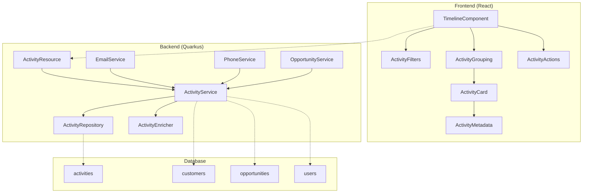
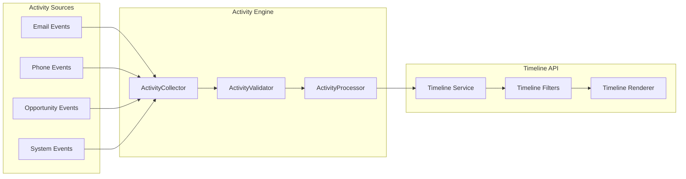

# FC-014: Technisches Konzept - Activity Timeline

**Feature Code:** FC-014  
**Datum:** 2025-07-20  
**Status:** Draft  
**Autor:** Claude  
**Reviewer:** Jörg Streeck  

## 📋 Inhaltsverzeichnis

1. [Zusammenfassung](#zusammenfassung)
2. [Ziel und Geschäftswert](#ziel-und-geschäftswert)
3. [Technische Architektur](#technische-architektur)
4. [Backend-Implementierung](#backend-implementierung)
5. [Frontend-Implementierung](#frontend-implementierung)
6. [Implementierungsstrategie](#implementierungsstrategie)
7. [Entscheidungs-Log](#entscheidungs-log)
8. [Risiken und Mitigationen](#risiken-und-mitigationen)
9. [Zeitschätzung](#zeitschätzung)

## Zusammenfassung

FC-014 Activity Timeline implementiert eine chronologische Übersicht aller Kunden-Interaktionen in einem einheitlichen Dashboard. Sales-Teams erhalten dadurch eine 360°-Sicht auf die Kundenhistorie mit automatischem Activity-Tracking und kontextuellen Follow-up-Aktionen.

**ROI**: Reduktion der Kontext-Switch Zeit von 5 Minuten auf 10 Sekunden bei Kundenkontakt und 80% weniger verpasste Follow-ups.

## Ziel und Geschäftswert

### Geschäftsziele
- **Kontext-Effizienz**: Reduktion der Vorbereitungszeit bei Kundenkontakt um 90% durch sofortige Sichtbarkeit aller Interaktionen
- **Follow-up-Optimierung**: Automatische Erinnerungen und kontextuelle Aktionen führen zu 80% weniger verpassten Opportunities
- **Team-Transparenz**: Vollständige Interaktionshistorie ermöglicht nahtlosen Kundenwechsel zwischen Sales-Mitarbeitern

### Technische Ziele
- **Performance**: Timeline-Laden < 500ms für die letzten 100 Activities
- **Real-time Updates**: Polling-basierte Synchronisation alle 30 Sekunden (gemäß D2-Entscheidung)
- **Skalierbarkeit**: Unterstützung für 10.000+ Activities pro Kunde mit Pagination
- **Integration**: Event-driven Activity-Capture aus allen System-Quellen

## Technische Architektur

### System-Übersicht



### Event-Driven Activity Collection



## Backend-Implementierung

### 1. API Endpoints

```java
@Path("/api/activities")
@ApplicationScoped
public class ActivityResource {
    
    @GET
    @Path("/customer/{customerId}")
    public Response getCustomerTimeline(
        @PathParam("customerId") UUID customerId,
        @QueryParam("page") @DefaultValue("0") int page,
        @QueryParam("size") @DefaultValue("20") int size,
        @QueryParam("types") String activityTypes,
        @QueryParam("since") String since
    ) {
        TimelineFilter filter = TimelineFilter.builder()
            .customerId(customerId)
            .types(parseActivityTypes(activityTypes))
            .since(parseDate(since))
            .build();
            
        Page<ActivityDTO> timeline = activityService
            .getCustomerTimeline(filter, page, size);
            
        return Response.ok(timeline).build();
    }
    
    @POST
    @Path("/manual")
    @RolesAllowed({"admin", "manager", "sales"})
    public Response createManualActivity(CreateActivityRequest request) {
        ActivityDTO activity = activityService.createManualActivity(
            request, securityContext.getUserPrincipal().getName()
        );
        return Response.status(201).entity(activity).build();
    }
    
    @GET
    @Path("/recent")
    public Response getRecentActivities(
        @QueryParam("limit") @DefaultValue("10") int limit
    ) {
        List<ActivityDTO> recent = activityService.getRecentActivities(limit);
        return Response.ok(recent).build();
    }
}
```

### 2. Datenmodell

```java
@Entity
@Table(name = "activities")
@NamedQueries({
    @NamedQuery(
        name = "Activity.findByCustomerId",
        query = "SELECT a FROM Activity a WHERE a.customerId = :customerId " +
                "ORDER BY a.timestamp DESC"
    ),
    @NamedQuery(
        name = "Activity.findRecentByTypes",
        query = "SELECT a FROM Activity a WHERE a.type IN :types " +
                "AND a.timestamp >= :since ORDER BY a.timestamp DESC"
    )
})
public class Activity {
    
    @Id
    @GeneratedValue(generator = "UUID")
    private UUID id;
    
    @Enumerated(EnumType.STRING)
    @Column(name = "activity_type", nullable = false)
    private ActivityType type;
    
    @Column(name = "timestamp", nullable = false)
    private LocalDateTime timestamp;
    
    @Column(name = "title", nullable = false, length = 200)
    private String title;
    
    @Column(name = "description", length = 1000)
    private String description;
    
    @Column(name = "customer_id", nullable = false)
    private UUID customerId;
    
    @Column(name = "opportunity_id")
    private UUID opportunityId;
    
    @Column(name = "contact_id")
    private UUID contactId;
    
    @Column(name = "created_by", nullable = false)
    private String createdBy;
    
    @Type(JsonType.class)
    @Column(name = "metadata", columnDefinition = "jsonb")
    private Map<String, Object> metadata = new HashMap<>();
    
    @Type(JsonType.class)
    @Column(name = "participants", columnDefinition = "jsonb")
    private List<UUID> participants = new ArrayList<>();
    
    @CreationTimestamp
    @Column(name = "created_at")
    private LocalDateTime createdAt;
    
    // Getters, setters, constructors
}

public enum ActivityType {
    EMAIL_SENT("📤", "Email versendet"),
    EMAIL_RECEIVED("📧", "Email erhalten"),
    PHONE_INBOUND("📞", "Eingehender Anruf"),
    PHONE_OUTBOUND("☎️", "Ausgehender Anruf"),
    MEETING("🤝", "Meeting"),
    NOTE("📝", "Notiz"),
    OPPORTUNITY("🎯", "Opportunity"),
    CONTRACT("📄", "Vertrag"),
    TASK("✅", "Aufgabe"),
    SYSTEM("🤖", "System");
    
    private final String icon;
    private final String label;
    
    ActivityType(String icon, String label) {
        this.icon = icon;
        this.label = label;
    }
}
```

### 3. Business Logic

```java
@ApplicationScoped
@Transactional
public class ActivityService {
    
    @Inject
    ActivityRepository repository;
    
    @Inject
    ActivityMapper mapper;
    
    @Inject
    ActivityEnricher enricher;
    
    @Inject
    Event<ActivityCreatedEvent> activityEvents;
    
    public Page<ActivityDTO> getCustomerTimeline(TimelineFilter filter, 
                                               int page, int size) {
        List<Activity> activities = repository
            .findByCustomerIdWithFilter(filter, page * size, size);
            
        List<ActivityDTO> enrichedActivities = activities.stream()
            .map(this::enrichActivity)
            .collect(Collectors.toList());
            
        long total = repository.countByCustomerIdWithFilter(filter);
        
        return new Page<>(enrichedActivities, page, size, total);
    }
    
    private ActivityDTO enrichActivity(Activity activity) {
        ActivityDTO dto = mapper.toDTO(activity);
        
        // Metadata enrichment basierend auf Activity Type
        switch (activity.getType()) {
            case EMAIL_SENT:
            case EMAIL_RECEIVED:
                enricher.enrichEmail(dto, activity.getMetadata());
                break;
            case PHONE_INBOUND:
            case PHONE_OUTBOUND:
                enricher.enrichPhone(dto, activity.getMetadata());
                break;
            case MEETING:
                enricher.enrichMeeting(dto, activity.getMetadata());
                break;
            case OPPORTUNITY:
                enricher.enrichOpportunity(dto, activity.getMetadata());
                break;
        }
        
        return dto;
    }
    
    public ActivityDTO createManualActivity(CreateActivityRequest request, 
                                          String createdBy) {
        Activity activity = Activity.builder()
            .type(request.getType())
            .timestamp(request.getTimestamp())
            .title(request.getTitle())
            .description(request.getDescription())
            .customerId(request.getCustomerId())
            .opportunityId(request.getOpportunityId())
            .createdBy(createdBy)
            .metadata(request.getMetadata())
            .participants(request.getParticipants())
            .build();
            
        repository.persist(activity);
        
        // Event für Real-time Updates
        activityEvents.fire(new ActivityCreatedEvent(activity));
        
        return mapper.toDTO(activity);
    }
    
    @Asynchronous
    public void captureSystemActivity(ActivityType type, UUID customerId, 
                                    String title, Map<String, Object> metadata) {
        Activity activity = Activity.builder()
            .type(type)
            .timestamp(LocalDateTime.now())
            .title(title)
            .customerId(customerId)
            .createdBy("SYSTEM")
            .metadata(metadata)
            .build();
            
        repository.persist(activity);
        activityEvents.fire(new ActivityCreatedEvent(activity));
    }
}
```

### 4. Datenbank-Änderungen

```sql
-- V6.0__create_activity_tables.sql
CREATE TABLE activities (
    id UUID PRIMARY KEY DEFAULT gen_random_uuid(),
    activity_type VARCHAR(50) NOT NULL,
    timestamp TIMESTAMP NOT NULL,
    title VARCHAR(200) NOT NULL,
    description TEXT,
    customer_id UUID NOT NULL REFERENCES customers(id),
    opportunity_id UUID REFERENCES opportunities(id),
    contact_id UUID REFERENCES contacts(id),
    created_by VARCHAR(100) NOT NULL,
    metadata JSONB,
    participants JSONB,
    created_at TIMESTAMP DEFAULT CURRENT_TIMESTAMP,
    updated_at TIMESTAMP DEFAULT CURRENT_TIMESTAMP
);

-- Performance-Indizes
CREATE INDEX idx_activities_customer_timestamp 
    ON activities(customer_id, timestamp DESC);
    
CREATE INDEX idx_activities_type_timestamp 
    ON activities(activity_type, timestamp DESC);
    
CREATE INDEX idx_activities_created_by 
    ON activities(created_by);
    
-- JSONB-Index für Metadata-Suche
CREATE INDEX idx_activities_metadata 
    ON activities USING GIN (metadata);

-- Automatische Updated-At Timestamps
CREATE OR REPLACE FUNCTION update_updated_at_column()
RETURNS TRIGGER AS $$
BEGIN
    NEW.updated_at = CURRENT_TIMESTAMP;
    RETURN NEW;
END;
$$ language 'plpgsql';

CREATE TRIGGER update_activities_updated_at 
    BEFORE UPDATE ON activities 
    FOR EACH ROW EXECUTE FUNCTION update_updated_at_column();
```

## Frontend-Implementierung

### 1. Komponenten-Struktur

```typescript
// /frontend/src/features/activities/components/ActivityTimeline.tsx
export const ActivityTimeline: React.FC<{customerId: string}> = ({ customerId }) => {
  const [filters, setFilters] = useState<TimelineFilters>({
    types: [],
    dateRange: 'all'
  });
  
  const { 
    data: timeline, 
    isLoading, 
    refetch 
  } = useActivityTimeline(customerId, filters);
  
  const groupedActivities = useMemo(() => 
    groupActivitiesByTime(timeline?.content || []), 
    [timeline]
  );
  
  // Polling für Real-time Updates (gemäß D2)
  useInterval(refetch, 30000);
  
  return (
    <Box sx={{ height: '100%', display: 'flex', flexDirection: 'column' }}>
      <ActivityFilters 
        filters={filters} 
        onFiltersChange={setFilters}
        activityCounts={timeline?.activityCounts}
      />
      
      <Box sx={{ flex: 1, overflow: 'auto' }}>
        {isLoading ? (
          <ActivityTimelineSkeleton />
        ) : (
          <ActivityGroups 
            groups={groupedActivities}
            onActivityAction={handleActivityAction}
          />
        )}
      </Box>
      
      {timeline?.hasMore && (
        <Button 
          onClick={() => loadMore()}
          variant="outlined"
          fullWidth
          sx={{ mt: 2 }}
        >
          Weitere Activities laden...
        </Button>
      )}
    </Box>
  );
};

// /frontend/src/features/activities/components/ActivityCard.tsx
export const ActivityCard: React.FC<{activity: Activity}> = ({ activity }) => {
  const { showNotification } = useNotifications();
  
  const contextualActions = useMemo(() => 
    getContextualActions(activity.type), 
    [activity.type]
  );
  
  return (
    <Card 
      sx={{ 
        mb: 2, 
        border: '1px solid',
        borderColor: 'divider',
        '&:hover': { borderColor: 'primary.main' }
      }}
    >
      <CardContent>
        <Box display="flex" justifyContent="space-between" alignItems="start">
          <Box display="flex" alignItems="center" gap={1}>
            <Typography variant="h6" component="span">
              {activity.type.icon}
            </Typography>
            <Typography variant="subtitle1" fontWeight="medium">
              {activity.title}
            </Typography>
          </Box>
          
          <Box textAlign="right">
            <Typography variant="caption" color="text.secondary">
              {formatRelativeTime(activity.timestamp)}
            </Typography>
            {activity.participants.length > 0 && (
              <AvatarGroup max={3} sx={{ mt: 0.5 }}>
                {activity.participants.map(participant => (
                  <Avatar 
                    key={participant.id} 
                    src={participant.avatar}
                    sx={{ width: 20, height: 20 }}
                  />
                ))}
              </AvatarGroup>
            )}
          </Box>
        </Box>
        
        {activity.description && (
          <Typography 
            variant="body2" 
            color="text.secondary" 
            sx={{ mt: 1, mb: 2 }}
          >
            {activity.description}
          </Typography>
        )}
        
        {activity.metadata && (
          <ActivityMetadata 
            type={activity.type} 
            metadata={activity.metadata} 
          />
        )}
        
        <Box mt={2}>
          <Stack direction="row" spacing={1}>
            {contextualActions.map(action => (
              <Button
                key={action.type}
                size="small"
                startIcon={action.icon}
                onClick={() => handleAction(action, activity)}
                variant="outlined"
              >
                {action.label}
              </Button>
            ))}
          </Stack>
        </Box>
      </CardContent>
    </Card>
  );
};
```

### 2. State Management

```typescript
// /frontend/src/features/activities/hooks/useActivityTimeline.ts
export const useActivityTimeline = (
  customerId: string, 
  filters: TimelineFilters
) => {
  return useInfiniteQuery(
    ['activities', 'timeline', customerId, filters],
    ({ pageParam = 0 }) => fetchActivityTimeline(customerId, {
      ...filters,
      page: pageParam,
      size: 20
    }),
    {
      getNextPageParam: (lastPage) => lastPage.hasMore ? lastPage.page + 1 : undefined,
      refetchInterval: 30000, // 30s Polling
      refetchIntervalInBackground: false,
      staleTime: 25000, // 25s - etwas weniger als Polling-Intervall
    }
  );
};

// /frontend/src/features/activities/store/activityStore.ts
interface ActivityStore {
  selectedFilters: TimelineFilters;
  recentActivities: Activity[];
  activityCounts: Record<ActivityType, number>;
  setFilters: (filters: TimelineFilters) => void;
  addActivity: (activity: Activity) => void;
  updateActivityCounts: (counts: Record<ActivityType, number>) => void;
}

export const useActivityStore = create<ActivityStore>((set, get) => ({
  selectedFilters: {
    types: [],
    dateRange: 'all'
  },
  recentActivities: [],
  activityCounts: {} as Record<ActivityType, number>,
  
  setFilters: (filters) => set({ selectedFilters: filters }),
  
  addActivity: (activity) => set(state => ({
    recentActivities: [activity, ...state.recentActivities].slice(0, 50)
  })),
  
  updateActivityCounts: (counts) => set({ activityCounts: counts })
}));
```

### 3. UI/UX Design

```typescript
// Smart Grouping nach Zeit
export const groupActivitiesByTime = (activities: Activity[]) => {
  const now = new Date();
  const groups: ActivityGroup[] = [];
  
  const timeRanges = [
    { label: 'Heute', check: (date: Date) => isToday(date) },
    { label: 'Gestern', check: (date: Date) => isYesterday(date) },
    { label: 'Diese Woche', check: (date: Date) => isThisWeek(date) },
    { label: 'Letzte Woche', check: (date: Date) => isLastWeek(date) },
    { label: 'Dieser Monat', check: (date: Date) => isThisMonth(date) },
    { label: 'Älter', check: () => true }
  ];
  
  timeRanges.forEach(range => {
    const groupActivities = activities.filter(activity => 
      range.check(new Date(activity.timestamp)) &&
      !groups.some(g => g.activities.includes(activity))
    );
    
    if (groupActivities.length > 0) {
      groups.push({
        label: range.label,
        activities: groupActivities,
        count: groupActivities.length
      });
    }
  });
  
  return groups;
};

// Kontextuelle Aktionen pro Activity Type
export const getContextualActions = (type: ActivityType): ActivityAction[] => {
  const baseActions = [
    { type: 'edit', label: 'Bearbeiten', icon: <EditIcon /> },
    { type: 'delete', label: 'Löschen', icon: <DeleteIcon /> }
  ];
  
  switch (type) {
    case ActivityType.EMAIL_RECEIVED:
      return [
        { type: 'reply', label: 'Antworten', icon: <ReplyIcon /> },
        { type: 'forward', label: 'Weiterleiten', icon: <ForwardIcon /> },
        { type: 'task', label: 'Als Task', icon: <TaskIcon /> },
        ...baseActions
      ];
      
    case ActivityType.PHONE_INBOUND:
      return [
        { type: 'callback', label: 'Zurückrufen', icon: <PhoneIcon /> },
        { type: 'note', label: 'Notiz hinzufügen', icon: <NoteIcon /> },
        ...baseActions
      ];
      
    case ActivityType.MEETING:
      return [
        { type: 'protocol', label: 'Protokoll', icon: <DescriptionIcon /> },
        { type: 'followup', label: 'Follow-up', icon: <ScheduleIcon /> },
        ...baseActions
      ];
      
    case ActivityType.OPPORTUNITY:
      return [
        { type: 'view', label: 'Öffnen', icon: <OpenIcon /> },
        { type: 'edit', label: 'Bearbeiten', icon: <EditIcon /> },
        { type: 'timeline', label: 'Timeline', icon: <TimelineIcon /> }
      ];
      
    default:
      return baseActions;
  }
};
```

### 4. Integration

```typescript
// Automatisches Activity Capture
export class ActivityCapture {
  
  // Email Integration
  static captureEmailSent(email: Email) {
    const activity = {
      type: ActivityType.EMAIL_SENT,
      title: email.subject,
      description: email.preview,
      customerId: email.customerId,
      metadata: {
        emailId: email.id,
        recipients: email.to,
        attachments: email.attachments?.length || 0
      }
    };
    
    return activityService.createActivity(activity);
  }
  
  // Phone Integration  
  static capturePhoneCall(call: PhoneCall) {
    const activity = {
      type: call.direction === 'IN' ? 
        ActivityType.PHONE_INBOUND : ActivityType.PHONE_OUTBOUND,
      title: `${call.direction === 'IN' ? 'Anruf von' : 'Anruf an'} ${call.number}`,
      customerId: call.customerId,
      metadata: {
        duration: call.duration,
        number: call.number,
        recordingUrl: call.recordingUrl
      }
    };
    
    return activityService.createActivity(activity);
  }
  
  // Opportunity Events
  static captureOpportunityEvent(event: OpportunityEvent) {
    const activity = {
      type: ActivityType.OPPORTUNITY,
      title: `Opportunity ${event.action}: ${event.opportunity.title}`,
      customerId: event.opportunity.customerId,
      opportunityId: event.opportunity.id,
      metadata: {
        action: event.action,
        value: event.opportunity.value,
        stage: event.opportunity.stage
      }
    };
    
    return activityService.createActivity(activity);
  }
}
```

## Implementierungsstrategie

### Phase 1: Core Timeline (3 Tage)

#### Sprint 1.1: Backend Foundation (1 Tag)
1. **Tag 1**: 
   - Activity Entity + Repository erstellen
   - Flyway Migration V6.0 für activities Table
   - Basis ActivityService implementieren
   - Timeline API Endpoints (GET /api/activities/customer/{id})

#### Sprint 1.2: Frontend Timeline (2 Tage)
1. **Tag 2**: 
   - ActivityTimeline Komponente mit Gruppierung
   - ActivityCard mit kontextuellen Aktionen
   - useActivityTimeline Hook mit Polling
   - Timeline Filters UI

2. **Tag 3**: 
   - ActivityMetadata Rendering für verschiedene Types
   - Infinite Scroll für große Timeline
   - Integration in Customer Detail View
   - Manual Activity Creation Modal

### Phase 2: Activity Capture (2 Tage)

#### Sprint 2.1: System Integration (2 Tage)
1. **Tag 4**: 
   - Email Integration (BCC-to-CRM)
   - Opportunity Event Capture
   - System Activity Service
   - Activity Enrichment Service

2. **Tag 5**: 
   - Phone Integration (Call Logging)
   - Meeting Calendar Integration  
   - Activity Actions Implementation
   - Performance-Optimierung

## Entscheidungs-Log

### 2025-07-20 - Polling vs. WebSocket für Real-time Updates
**Entscheidung**: Polling alle 30 Sekunden implementieren  
**Begründung**: Folgt D2-Entscheidung aus UI Foundation - weniger Komplexität, einfachere Fehlerbehandlung, ausreichend für Activity Timeline Use Case  
**Impact**: Leichte Verzögerung bei neuen Activities (max. 30s), aber stabile Implementierung  
**Alternativen**: WebSocket (zu komplex für MVP), Server-Sent Events (Browser-Kompatibilität)  
**Entscheider**: Team Decision aus M3 Enhancement Plan

### 2025-07-20 - Activity Storage: Separate Table vs. Event Sourcing
**Entscheidung**: Separate activities Table mit JSONB metadata  
**Entscheidung**: Event Sourcing für Phase 4, MVP mit relationaler Struktur  
**Impact**: Schnellere Implementierung, einfachere Queries, spätere Migration zu Event Sourcing möglich  
**Alternativen**: Sofortiges Event Sourcing (zu komplex), Embedding in Customer Table (nicht skalierbar)  
**Entscheider**: Claude/Architecture Team

### 2025-07-20 - Activity Types: Enum vs. Flexible String
**Entscheidung**: Java Enum mit Icon und Label, erweiterbar durch Code-Changes  
**Begründung**: Type Safety, Performance, klare Semantik, kontrollierte Erweiterung  
**Impact**: Neue Activity Types erfordern Code-Deployment, aber bessere Datenqualität  
**Alternativen**: Flexible Strings (Data Quality Probleme), Separate Type Table (Overkill)  
**Entscheider**: Claude basierend auf bestehenden Patterns

### 2025-07-20 - Timeline Gruppierung: Zeit vs. Type
**Entscheidung**: Primär nach Zeit gruppieren (Heute, Gestern, etc.), sekundär Filter nach Type  
**Begründung**: Chronologische Reihenfolge ist wichtigster Use Case für Sales Context  
**Impact**: Intuitive UX, einfache Navigation, passt zu Mental Model der Nutzer  
**Alternativen**: Type-first Gruppierung (weniger intuitiv), Flat List (unübersichtlich)  
**Entscheider**: UX-optimierte Entscheidung basierend auf FC-014_TECH_CONCEPT.md

## Risiken und Mitigationen

### Risiko 1: Performance bei großen Activity-Mengen
**Wahrscheinlichkeit**: Mittel  
**Impact**: Hoch  
**Mitigation**: 
- Pagination mit 20 Activities pro Page
- Database-Indizes auf customer_id + timestamp
- Lazy Loading mit Infinite Scroll
- JSONB-Index für Metadata-Queries

### Risiko 2: Datenqualität bei automatischem Activity Capture
**Wahrscheinlichkeit**: Hoch  
**Impact**: Mittel  
**Mitigation**: 
- Strenge Validation im ActivityService
- Fallback für unbekannte Activity Sources
- Manual Edit/Delete Funktionen
- Activity Deduplication Logic

### Risiko 3: Real-time Synchronisation zwischen Team-Mitgliedern
**Wahrscheinlichkeit**: Mittel  
**Impact**: Mittel  
**Mitigation**: 
- 30s Polling ist akzeptabel für Activity Timeline Use Case
- Background-Refresh wenn Tab wieder aktiv wird
- Optimistic Updates für eigene Actions
- Clear Loading States

### Risiko 4: Integration Komplexität mit externen Systems (Email, Phone)
**Wahrscheinlichkeit**: Mittel  
**Impact**: Mittel  
**Mitigation**: 
- Phase 1: Manual Activities erstmal ohne Integration
- Schrittweise Integration in Phase 2
- Webhook-Pattern für flexible Integration
- Graceful Degradation wenn Integration fehlt

### Risiko 5: DSGVO Compliance bei Activity Storage
**Wahrscheinlichkeit**: Niedrig  
**Impact**: Hoch  
**Mitigation**: 
- Soft Delete für Activities
- Data Retention Policies implementieren
- Customer Data Export für Activities
- Anonymization für gelöschte Kunden

## Zeitschätzung

**Gesamt-Aufwand**: 5-6 Tage

- **Backend**: 2.5 Tage
  - Activity Entity + Migration: 0.5 Tage
  - ActivityService + Repository: 1 Tag  
  - Timeline API + Enrichment: 1 Tag
- **Frontend**: 2.5 Tage
  - Timeline Komponenten: 1.5 Tage
  - Activity Actions + Integration: 1 Tag
- **Integration & Testing**: 1 Tag
  - Email/Phone Integration: 0.5 Tage
  - Performance Testing: 0.5 Tage

**Puffer**: +1 Tag für unvorhergesehene Probleme (especially Integration challenges)

---

## 🧭 NAVIGATION

### Dependencies:
- [FC-012 Team Communication](/docs/features/PLANNED/14_team_communication/FC-012_TECH_CONCEPT.md) - Team Activity Visibility
- [M4 Opportunity Pipeline](/docs/features/ACTIVE/02_opportunity_pipeline/M4_TECH_CONCEPT.md) - Opportunity Events als Activity Source
- [FC-008 Security Foundation](/docs/features/ACTIVE/01_security_foundation/FC-008_TECH_CONCEPT.md) - Activity Permissions

### Enables:
- [FC-019 Advanced Metrics](/docs/features/PLANNED/19_advanced_metrics/FC-019_TECH_CONCEPT.md) - Activity-basierte Analytics
- [FC-027 Magic Moments](/docs/features/PLANNED/27_magic_moments/FC-027_TECH_CONCEPT.md) - Activity Pattern Recognition
- [M3 Sales Cockpit](/docs/features/ACTIVE/05_ui_foundation/M3_TECH_CONCEPT.md) - Recent Activities Widget

### Master Plan:
- [CRM Master Plan V5](/docs/CRM_COMPLETE_MASTER_PLAN_V5.md)

**Status-Updates**:
- 2025-07-20: Tech Concept erstellt (Draft)
- 2025-07-20: Dependencies analysiert (FC-012, M4, FC-008)
- 2025-07-20: 5-6 Tage Implementierung geschätzt