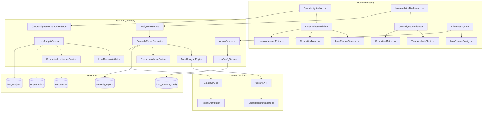

# FC-015: Technisches Konzept - Deal Loss Analysis

**Feature Code:** FC-015  
**Datum:** 20.07.2025  
**Status:** Draft  
**Autor:** Claude  
**Reviewer:** Jörg Streeck  
**Geschätzter Aufwand:** 4-5 Tage  
**ROI:** Win-Rate Verbesserung +10-15% durch systematisches Lernen aus Niederlagen  

## 📋 Inhaltsverzeichnis

1. [Zusammenfassung](#zusammenfassung)
2. [Ziel und Geschäftswert](#ziel-und-geschäftswert)
3. [Technische Architektur](#technische-architektur)
4. [Backend-Implementierung](#backend-implementierung)
5. [Frontend-Implementierung](#frontend-implementierung)
6. [Implementierungsstrategie](#implementierungsstrategie)
7. [Entscheidungs-Log](#entscheidungs-log)
8. [Risiken und Mitigationen](#risiken-und-mitigationen)
9. [Zeitschätzung](#zeitschätzung)

## Zusammenfassung

Structured Deal Loss Analysis System zur systematischen Erfassung und Analyse verlorener Opportunities mit verpflichtenden Verlustgrund-Kategorisierung, Competitor Intelligence und automatisierten Quarterly Reports. Wandelt jeden verlorenen Deal in wertvolle Lernerfahrung um durch standardisierte Erfassung von Verlustgründen, Lessons Learned und Competitor-Preisen für Win-Rate-Verbesserung von +10-15% durch datengetriebene Sales-Prozess-Optimierung.

## Ziel und Geschäftswert

### Geschäftsziele
- **Sales Performance verbessern**: Win-Rate Steigerung von 10-15% durch systematisches Lernen aus Niederlagen und Pattern Recognition
- **Competitive Intelligence aufbauen**: Strukturierte Erfassung von Competitor-Preisen und -Strategien für bessere Marktpositionierung
- **Prozess-Schwachstellen identifizieren**: Erkennung wiederkehrender Verlustmuster für gezielte Team-Schulungen und Prozessverbesserungen
- **ROI-Transparenz schaffen**: Präzise Messung vermeidbarer Verluste für Management-Entscheidungen und Investitionsprioritäten
- **Team-Entwicklung fördern**: Shared Learning Culture durch Quarterly Loss Reports und Best Practice Sharing

### Technische Ziele
- **Datenqualität**: 100% Analysis Rate für alle CLOSED_LOST Opportunities, >90% mit detaillierten Lessons Learned
- **User Adoption**: Intuitive UI reduziert Analysis-Zeit auf <3 Minuten, nahtlose Integration in M4 Opportunity Pipeline
- **Analytics Performance**: Real-time Dashboard-Updates, Quarterly Reports in <2 Sekunden, Trend-Erkennung automatisiert
- **Skalierbarkeit**: Handling von 1000+ Loss Analyses pro Quartal, Memory-effiziente Aggregation für Multi-Jahr-Trends
- **Integration**: Bidirektionale Synchronisation mit M6 Analytics, FC-014 Activity Timeline und FC-007 Chef Dashboard
- **Compliance**: DSGVO-konforme Speicherung sensitiver Competitor-Daten, Audit-Log für alle Analysis-Änderungen

## Technische Architektur

### System-Übersicht



### Loss Analysis Workflow

**Mandatory Analysis Flow:**
1. User setzt Opportunity Stage auf "CLOSED_LOST" in Kanban Board
2. System prüft: Hat diese Opportunity bereits Loss Analysis?
3. Falls nein: LossAnalysisModal öffnet sich automatisch (nicht schließbar)
4. User füllt Pflichtfelder aus: Loss Reason + Lessons Learned (min 50 Zeichen)
5. Optional: Competitor Details, Prevention Analysis, Custom Notes
6. Backend validiert Vollständigkeit und speichert Analysis
7. Event für FC-014 Activity Timeline: "Loss Analysis completed"
8. Opportunity Status wird final auf CLOSED_LOST gesetzt

**Analytics & Reporting Flow:**
- Daily: Aggregation neuer Loss Analyses in Analytics DB
- Weekly: Pattern Detection für kritische Trends (>5 gleiche Reasons)
- Monthly: Competitor Intelligence Update mit Price Trends
- Quarterly: Automated Report Generation mit AI-based Recommendations
- On-Demand: Real-time Dashboard für Management mit Filter/Drill-Down

## Backend-Implementierung

### 1. Loss Analysis Entity Model

```java
@Entity
@Table(name = "loss_analyses")
public class LossAnalysis {
    
    @Id
    @GeneratedValue(generator = "UUID")
    private UUID id;
    
    @Column(name = "opportunity_id", nullable = false, unique = true)
    private UUID opportunityId;
    
    @ManyToOne(fetch = FetchType.LAZY)
    @JoinColumn(name = "opportunity_id", insertable = false, updatable = false)
    private Opportunity opportunity;
    
    @Enumerated(EnumType.STRING)
    @Column(name = "primary_loss_reason", nullable = false)
    private LossReason primaryLossReason;
    
    @Column(name = "loss_reason_details", length = 500)
    private String lossReasonDetails;
    
    @Column(name = "competitor_name")
    private String competitorName;
    
    @Column(name = "competitor_price", precision = 10, scale = 2)
    private BigDecimal competitorPrice;
    
    @Column(name = "our_final_price", precision = 10, scale = 2, nullable = false)
    private BigDecimal ourFinalPrice;
    
    @Column(name = "lessons_learned", nullable = false, length = 2000)
    @Size(min = 50, message = "Lessons Learned must be at least 50 characters")
    private String lessonsLearned;
    
    @Column(name = "was_preventable", nullable = false)
    private boolean wasPreventable = false;
    
    @Column(name = "prevention_strategy", length = 1000)
    private String preventionStrategy;
    
    @Column(name = "customer_feedback", length = 1000)
    private String customerFeedback;
    
    @Enumerated(EnumType.STRING)
    @Column(name = "deal_phase_lost")
    private DealPhase dealPhaseLost;
    
    @Column(name = "sales_cycle_days")
    private Integer salesCycleDays;
    
    @Column(name = "follow_up_potential", nullable = false)
    private boolean followUpPotential = false;
    
    @Column(name = "follow_up_timeframe")
    private String followUpTimeframe;
    
    @Column(name = "analyzed_by", nullable = false)
    private UUID analyzedBy;
    
    @ManyToOne(fetch = FetchType.LAZY)
    @JoinColumn(name = "analyzed_by", insertable = false, updatable = false)
    private User analyzer;
    
    @Column(name = "analyzed_at", nullable = false)
    private LocalDateTime analyzedAt;
    
    @Column(name = "review_status")
    @Enumerated(EnumType.STRING)
    private ReviewStatus reviewStatus = ReviewStatus.PENDING;
    
    @Column(name = "reviewed_by")
    private UUID reviewedBy;
    
    @Column(name = "reviewed_at")
    private LocalDateTime reviewedAt;
    
    @Column(name = "confidence_score")
    @Min(1) @Max(5)
    private Integer confidenceScore; // 1-5: Wie sicher ist die Analyse?
    
    // Constructors, getters, setters
}

enum LossReason {
    PRICE_TOO_HIGH("Preis zu hoch", "price"),
    COMPETITOR_CHOSEN("Mitbewerber gewählt", "competitor"),
    NO_BUDGET("Kein Budget vorhanden", "budget"),
    PROJECT_CANCELLED("Projekt abgesagt", "cancelled"),
    WRONG_TIMING("Falsches Timing", "timing"),
    MISSING_FEATURES("Fehlende Features", "features"),
    POOR_RELATIONSHIP("Schlechte Beziehung", "relationship"),
    TECHNICAL_MISMATCH("Technische Inkompatibilität", "technical"),
    INTERNAL_SOLUTION("Interne Lösung entwickelt", "internal"),
    DECISION_DELAYED("Entscheidung verschoben", "delayed"),
    COMPLIANCE_ISSUES("Compliance-Probleme", "compliance"),
    INTEGRATION_COMPLEXITY("Integrations-Komplexität", "integration"),
    VENDOR_LOCK_CONCERNS("Vendor-Lock-In Bedenken", "vendor_lock"),
    OTHER("Sonstiges", "other");
    
    private final String displayName;
    private final String analyticsKey;
    
    LossReason(String displayName, String analyticsKey) {
        this.displayName = displayName;
        this.analyticsKey = analyticsKey;
    }
}

enum DealPhase {
    INITIAL_CONTACT("Erstkontakt"),
    QUALIFICATION("Qualifikation"),
    NEEDS_ANALYSIS("Bedarfsanalyse"),
    PROPOSAL_PHASE("Angebotserstellung"),
    NEGOTIATION("Verhandlung"),
    FINAL_DECISION("Endentscheidung");
    
    private final String displayName;
}

enum ReviewStatus {
    PENDING("Prüfung ausstehend"),
    APPROVED("Bestätigt"),
    NEEDS_REVISION("Nachbesserung erforderlich"),
    REJECTED("Abgelehnt");
    
    private final String displayName;
}
```

### 2. Loss Analysis Service

```java
@ApplicationScoped
@Transactional
public class LossAnalysisService {
    
    @Inject LossAnalysisRepository lossAnalysisRepository;
    @Inject OpportunityRepository opportunityRepository;
    @Inject CompetitorIntelligenceService competitorService;
    @Inject AuditLogService auditService;
    @Inject EventBus eventBus;
    
    public LossAnalysis createLossAnalysis(CreateLossAnalysisRequest request) {
        
        // Validation
        Opportunity opportunity = opportunityRepository.findById(request.getOpportunityId())
            .orElseThrow(() -> new EntityNotFoundException("Opportunity not found"));
            
        if (opportunity.getStage() != OpportunityStage.CLOSED_LOST) {
            throw new IllegalStateException("Opportunity must be in CLOSED_LOST stage for analysis");
        }
        
        // Check if analysis already exists
        Optional<LossAnalysis> existing = lossAnalysisRepository.findByOpportunityId(opportunity.getId());
        if (existing.isPresent()) {
            throw new IllegalStateException("Loss analysis already exists for this opportunity");
        }
        
        // Create analysis
        LossAnalysis analysis = LossAnalysis.builder()
            .opportunityId(opportunity.getId())
            .primaryLossReason(request.getPrimaryLossReason())
            .lossReasonDetails(request.getLossReasonDetails())
            .competitorName(request.getCompetitorName())
            .competitorPrice(request.getCompetitorPrice())
            .ourFinalPrice(opportunity.getValue())
            .lessonsLearned(request.getLessonsLearned())
            .wasPreventable(request.isWasPreventable())
            .preventionStrategy(request.getPreventionStrategy())
            .customerFeedback(request.getCustomerFeedback())
            .dealPhaseLost(request.getDealPhaseLost())
            .salesCycleDays(calculateSalesCycleDays(opportunity))
            .followUpPotential(request.isFollowUpPotential())
            .followUpTimeframe(request.getFollowUpTimeframe())
            .analyzedBy(getCurrentUserId())
            .analyzedAt(LocalDateTime.now())
            .confidenceScore(request.getConfidenceScore())
            .build();
        
        // Enhanced validation
        validateLossAnalysis(analysis);
        
        // Save analysis
        LossAnalysis saved = lossAnalysisRepository.save(analysis);
        
        // Update competitor intelligence
        if (analysis.getCompetitorName() != null && analysis.getCompetitorPrice() != null) {
            competitorService.updateCompetitorPrice(
                analysis.getCompetitorName(),
                analysis.getCompetitorPrice(),
                opportunity.getCustomer().getIndustry()
            );
        }
        
        // Audit log
        auditService.log(AuditAction.LOSS_ANALYSIS_CREATED, 
            Map.of(
                "opportunityId", opportunity.getId(),
                "lossReason", analysis.getPrimaryLossReason().name(),
                "wasPreventable", analysis.isWasPreventable(),
                "competitorInvolved", analysis.getCompetitorName() != null
            ));
        
        // Fire event for activity timeline
        eventBus.fire(new LossAnalysisCompletedEvent(
            opportunity.getId(),
            analysis.getId(),
            analysis.getPrimaryLossReason(),
            analysis.isWasPreventable()
        ));
        
        // Check for critical patterns
        checkForCriticalPatterns(analysis);
        
        return saved;
    }
    
    public LossAnalysis updateLossAnalysis(UUID analysisId, UpdateLossAnalysisRequest request) {
        
        LossAnalysis analysis = lossAnalysisRepository.findById(analysisId)
            .orElseThrow(() -> new EntityNotFoundException("Loss analysis not found"));
        
        // Security check
        if (!canEditAnalysis(analysis)) {
            throw new ForbiddenException("No permission to edit this analysis");
        }
        
        // Update fields
        analysis.setPrimaryLossReason(request.getPrimaryLossReason());
        analysis.setLossReasonDetails(request.getLossReasonDetails());
        analysis.setLessonsLearned(request.getLessonsLearned());
        // ... update other fields
        
        validateLossAnalysis(analysis);
        
        LossAnalysis updated = lossAnalysisRepository.save(analysis);
        
        // Audit log for update
        auditService.log(AuditAction.LOSS_ANALYSIS_UPDATED, 
            Map.of(
                "analysisId", analysisId,
                "updatedBy", getCurrentUserId(),
                "changes", buildChangeLog(analysis, request)
            ));
        
        return updated;
    }
    
    private void validateLossAnalysis(LossAnalysis analysis) {
        List<String> errors = new ArrayList<>();
        
        // Lessons learned minimum length
        if (analysis.getLessonsLearned() == null || analysis.getLessonsLearned().trim().length() < 50) {
            errors.add("Lessons Learned must be at least 50 characters");
        }
        
        // Competitor data consistency
        if ((analysis.getCompetitorName() != null) != (analysis.getCompetitorPrice() != null)) {
            errors.add("Competitor name and price must both be provided or both be empty");
        }
        
        // Prevention strategy required if preventable
        if (analysis.isWasPreventable() && 
            (analysis.getPreventionStrategy() == null || analysis.getPreventionStrategy().trim().isEmpty())) {
            errors.add("Prevention strategy is required when deal is marked as preventable");
        }
        
        // Follow-up timeframe required if follow-up potential
        if (analysis.isFollowUpPotential() && 
            (analysis.getFollowUpTimeframe() == null || analysis.getFollowUpTimeframe().trim().isEmpty())) {
            errors.add("Follow-up timeframe is required when follow-up potential exists");
        }
        
        if (!errors.isEmpty()) {
            throw new ValidationException("Loss analysis validation failed: " + String.join(", ", errors));
        }
    }
    
    private void checkForCriticalPatterns(LossAnalysis newAnalysis) {
        // Check for concerning patterns in last 30 days
        LocalDateTime thirtyDaysAgo = LocalDateTime.now().minusDays(30);
        
        List<LossAnalysis> recentLosses = lossAnalysisRepository
            .findByAnalyzedAtAfterAndPrimaryLossReason(
                thirtyDaysAgo, 
                newAnalysis.getPrimaryLossReason()
            );
        
        if (recentLosses.size() >= 5) {
            // Critical pattern detected - notify management
            eventBus.fire(new CriticalLossPatternDetectedEvent(
                newAnalysis.getPrimaryLossReason(),
                recentLosses.size(),
                recentLosses.stream()
                    .map(LossAnalysis::getOpportunityId)
                    .collect(Collectors.toList())
            ));
        }
        
        // Check competitor dominance
        if (newAnalysis.getCompetitorName() != null) {
            long competitorWins = lossAnalysisRepository
                .countByAnalyzedAtAfterAndCompetitorName(
                    thirtyDaysAgo, 
                    newAnalysis.getCompetitorName()
                );
            
            if (competitorWins >= 3) {
                eventBus.fire(new CompetitorDominanceAlertEvent(
                    newAnalysis.getCompetitorName(),
                    competitorWins
                ));
            }
        }
    }
    
    private Integer calculateSalesCycleDays(Opportunity opportunity) {
        if (opportunity.getCreatedAt() != null && opportunity.getClosedAt() != null) {
            return (int) ChronoUnit.DAYS.between(
                opportunity.getCreatedAt().toLocalDate(),
                opportunity.getClosedAt().toLocalDate()
            );
        }
        return null;
    }
}
```

### 3. Quarterly Report Generator

```java
@ApplicationScoped
public class QuarterlyReportGenerator {
    
    @Inject LossAnalysisRepository lossAnalysisRepository;
    @Inject OpportunityRepository opportunityRepository;
    @Inject RecommendationEngine recommendationEngine;
    
    public QuarterlyLossReport generateReport(Year year, Quarter quarter) {
        
        LocalDateTime startDate = quarter.atYear(year.getValue()).atDay(1).atStartOfDay();
        LocalDateTime endDate = quarter.atYear(year.getValue()).atEndOfQuarter().atTime(23, 59, 59);
        
        List<LossAnalysis> quarterlyLosses = lossAnalysisRepository
            .findByAnalyzedAtBetween(startDate, endDate);
        
        List<Opportunity> quarterlyWins = opportunityRepository
            .findByStageAndClosedAtBetween(OpportunityStage.CLOSED_WON, startDate, endDate);
        
        return QuarterlyLossReport.builder()
            .reportPeriod(new ReportPeriod(year, quarter))
            .generatedAt(LocalDateTime.now())
            .summary(buildExecutiveSummary(quarterlyLosses, quarterlyWins))
            .lossReasonBreakdown(calculateLossReasonBreakdown(quarterlyLosses))
            .competitorAnalysis(buildCompetitorAnalysis(quarterlyLosses))
            .trendAnalysis(buildTrendAnalysis(quarterlyLosses))
            .preventabilityAnalysis(buildPreventabilityAnalysis(quarterlyLosses))
            .recommendations(recommendationEngine.generateRecommendations(quarterlyLosses))
            .teamPerformance(buildTeamPerformanceAnalysis(quarterlyLosses, quarterlyWins))
            .industryInsights(buildIndustryAnalysis(quarterlyLosses))
            .build();
    }
    
    private ExecutiveSummary buildExecutiveSummary(List<LossAnalysis> losses, List<Opportunity> wins) {
        
        BigDecimal totalLossValue = losses.stream()
            .map(LossAnalysis::getOurFinalPrice)
            .reduce(BigDecimal.ZERO, BigDecimal::add);
            
        BigDecimal totalWinValue = wins.stream()
            .map(Opportunity::getValue)
            .reduce(BigDecimal.ZERO, BigDecimal::add);
        
        double winRate = (double) wins.size() / (wins.size() + losses.size()) * 100;
        
        long preventableLosses = losses.stream()
            .filter(LossAnalysis::isWasPreventable)
            .count();
            
        BigDecimal preventableLossValue = losses.stream()
            .filter(LossAnalysis::isWasPreventable)
            .map(LossAnalysis::getOurFinalPrice)
            .reduce(BigDecimal.ZERO, BigDecimal::add);
        
        return ExecutiveSummary.builder()
            .totalDeals(wins.size() + losses.size())
            .dealsWon(wins.size())
            .dealsLost(losses.size())
            .winRate(winRate)
            .totalWinValue(totalWinValue)
            .totalLossValue(totalLossValue)
            .preventableLosses(preventableLosses)
            .preventableLossValue(preventableLossValue)
            .averageSalesCycle(calculateAverageSalesCycle(losses))
            .topLossReason(findTopLossReason(losses))
            .biggestCompetitorThreat(findBiggestCompetitorThreat(losses))
            .build();
    }
    
    private List<LossReasonStats> calculateLossReasonBreakdown(List<LossAnalysis> losses) {
        
        Map<LossReason, List<LossAnalysis>> reasonGroups = losses.stream()
            .collect(Collectors.groupingBy(LossAnalysis::getPrimaryLossReason));
        
        return reasonGroups.entrySet().stream()
            .map(entry -> {
                LossReason reason = entry.getKey();
                List<LossAnalysis> reasonLosses = entry.getValue();
                
                BigDecimal totalValue = reasonLosses.stream()
                    .map(LossAnalysis::getOurFinalPrice)
                    .reduce(BigDecimal.ZERO, BigDecimal::add);
                
                double percentage = (double) reasonLosses.size() / losses.size() * 100;
                
                long preventableCount = reasonLosses.stream()
                    .filter(LossAnalysis::isWasPreventable)
                    .count();
                
                return LossReasonStats.builder()
                    .reason(reason)
                    .count(reasonLosses.size())
                    .percentage(percentage)
                    .totalValue(totalValue)
                    .preventableCount(preventableCount)
                    .averageConfidence(calculateAverageConfidence(reasonLosses))
                    .commonPatterns(extractCommonPatterns(reasonLosses))
                    .build();
            })
            .sorted(Comparator.comparing(LossReasonStats::getCount).reversed())
            .collect(Collectors.toList());
    }
    
    private List<CompetitorStats> buildCompetitorAnalysis(List<LossAnalysis> losses) {
        
        Map<String, List<LossAnalysis>> competitorGroups = losses.stream()
            .filter(l -> l.getCompetitorName() != null)
            .collect(Collectors.groupingBy(LossAnalysis::getCompetitorName));
        
        return competitorGroups.entrySet().stream()
            .map(entry -> {
                String competitor = entry.getKey();
                List<LossAnalysis> competitorLosses = entry.getValue();
                
                BigDecimal averageCompetitorPrice = competitorLosses.stream()
                    .filter(l -> l.getCompetitorPrice() != null)
                    .map(LossAnalysis::getCompetitorPrice)
                    .reduce(BigDecimal.ZERO, BigDecimal::add)
                    .divide(BigDecimal.valueOf(competitorLosses.size()), RoundingMode.HALF_UP);
                
                BigDecimal averageOurPrice = competitorLosses.stream()
                    .map(LossAnalysis::getOurFinalPrice)
                    .reduce(BigDecimal.ZERO, BigDecimal::add)
                    .divide(BigDecimal.valueOf(competitorLosses.size()), RoundingMode.HALF_UP);
                
                double priceDifferential = averageCompetitorPrice
                    .subtract(averageOurPrice)
                    .divide(averageOurPrice, RoundingMode.HALF_UP)
                    .doubleValue() * 100;
                
                return CompetitorStats.builder()
                    .competitorName(competitor)
                    .lossCount(competitorLosses.size())
                    .averageCompetitorPrice(averageCompetitorPrice)
                    .averageOurPrice(averageOurPrice)
                    .priceDifferentialPercentage(priceDifferential)
                    .industriesLostIn(extractIndustries(competitorLosses))
                    .winBackPotential(assessWinBackPotential(competitorLosses))
                    .build();
            })
            .sorted(Comparator.comparing(CompetitorStats::getLossCount).reversed())
            .collect(Collectors.toList());
    }
}
```

## Frontend-Implementierung

### 1. Loss Analysis Modal

```typescript
// components/LossAnalysisModal.tsx
export const LossAnalysisModal: React.FC<LossAnalysisModalProps> = ({
  opportunity,
  open,
  onClose,
  onAnalysisComplete
}) => {
  const { createLossAnalysis } = useLossAnalysisMutations();
  const [analysis, setAnalysis] = useState<CreateLossAnalysisRequest>({
    opportunityId: opportunity.id,
    ourFinalPrice: opportunity.value,
    analyzedBy: useCurrentUser().id
  });
  const [currentStep, setCurrentStep] = useState(0);
  const [isSubmitting, setIsSubmitting] = useState(false);
  
  // Validation
  const isValid = useMemo(() => {
    return analysis.primaryLossReason &&
           analysis.lessonsLearned?.length >= 50 &&
           (!analysis.wasPreventable || analysis.preventionStrategy) &&
           (!analysis.followUpPotential || analysis.followUpTimeframe) &&
           analysis.confidenceScore >= 1 && analysis.confidenceScore <= 5;
  }, [analysis]);
  
  const handleSubmit = async () => {
    if (!isValid) return;
    
    setIsSubmitting(true);
    try {
      const result = await createLossAnalysis.mutateAsync(analysis);
      
      toast.success('Loss Analysis erfolgreich gespeichert');
      onAnalysisComplete(result);
      onClose();
      
    } catch (error: any) {
      toast.error(`Fehler beim Speichern: ${error.message}`);
    } finally {
      setIsSubmitting(false);
    }
  };
  
  const steps = [
    { title: 'Verlustgrund', component: LossReasonStep },
    { title: 'Details', component: LossDetailsStep },
    { title: 'Lessons Learned', component: LessonsLearnedStep },
    { title: 'Prävention', component: PreventionStep },
    { title: 'Bestätigung', component: ConfirmationStep }
  ];
  
  return (
    <Dialog 
      open={open} 
      onClose={undefined} // Nicht schließbar bis Analysis komplett
      maxWidth="md" 
      fullWidth
      disableEscapeKeyDown
    >
      <DialogTitle>
        <Box display="flex" alignItems="center" justifyContent="space-between">
          <Box display="flex" alignItems="center">
            <ErrorOutline sx={{ mr: 1, color: 'error.main' }} />
            Deal-Verlust analysieren
          </Box>
          <Chip 
            label={`Schritt ${currentStep + 1} von ${steps.length}`}
            variant="outlined"
            size="small"
          />
        </Box>
        
        {/* Progress Stepper */}
        <Stepper activeStep={currentStep} sx={{ mt: 2 }}>
          {steps.map((step, index) => (
            <Step key={step.title}>
              <StepLabel>{step.title}</StepLabel>
            </Step>
          ))}
        </Stepper>
      </DialogTitle>
      
      <DialogContent>
        {/* Opportunity Context */}
        <Card variant="outlined" sx={{ mb: 3, bgcolor: 'grey.50' }}>
          <CardContent>
            <Grid container spacing={2}>
              <Grid item xs={12} sm={6}>
                <Typography variant="h6" gutterBottom>
                  {opportunity.title}
                </Typography>
                <Typography variant="body2" color="text.secondary">
                  Kunde: {opportunity.customer.name}
                </Typography>
                <Typography variant="body2" color="text.secondary">
                  Wert: {formatCurrency(opportunity.value)}
                </Typography>
              </Grid>
              <Grid item xs={12} sm={6}>
                <Typography variant="body2" color="text.secondary">
                  Erstellt: {formatDate(opportunity.createdAt)}
                </Typography>
                <Typography variant="body2" color="text.secondary">
                  Verloren: {formatDate(opportunity.closedAt)}
                </Typography>
                <Typography variant="body2" color="text.secondary">
                  Sales Cycle: {calculateSalesCycleDays(opportunity)} Tage
                </Typography>
              </Grid>
            </Grid>
          </CardContent>
        </Card>
        
        {/* Current Step Content */}
        {React.createElement(steps[currentStep].component, {
          analysis,
          setAnalysis,
          opportunity
        })}
      </DialogContent>
      
      <DialogActions>
        <Button 
          onClick={() => setCurrentStep(Math.max(0, currentStep - 1))}
          disabled={currentStep === 0 || isSubmitting}
        >
          Zurück
        </Button>
        
        {currentStep < steps.length - 1 ? (
          <Button 
            variant="contained"
            onClick={() => setCurrentStep(currentStep + 1)}
            disabled={!isStepValid(currentStep, analysis) || isSubmitting}
          >
            Weiter
          </Button>
        ) : (
          <Button 
            variant="contained"
            onClick={handleSubmit}
            disabled={!isValid || isSubmitting}
            startIcon={isSubmitting ? <CircularProgress size={16} /> : <Save />}
            sx={{ bgcolor: '#94C456', '&:hover': { bgcolor: '#7FA93F' } }}
          >
            {isSubmitting ? 'Wird gespeichert...' : 'Analyse speichern'}
          </Button>
        )}
      </DialogActions>
    </Dialog>
  );
};

// Step Components
const LossReasonStep: React.FC<StepProps> = ({ analysis, setAnalysis }) => {
  return (
    <Box>
      <Typography variant="h6" gutterBottom>
        Was war der Hauptgrund für den Verlust?
      </Typography>
      
      <FormControl fullWidth required sx={{ mb: 3 }}>
        <InputLabel>Verlustgrund</InputLabel>
        <Select
          value={analysis.primaryLossReason || ''}
          onChange={(e) => setAnalysis(prev => ({ 
            ...prev, 
            primaryLossReason: e.target.value as LossReason 
          }))}
        >
          {Object.entries(LossReason).map(([key, reason]) => (
            <MenuItem key={key} value={key}>
              <Box display="flex" alignItems="center">
                <Box
                  sx={{
                    width: 12,
                    height: 12,
                    borderRadius: '50%',
                    bgcolor: getLossReasonColor(key),
                    mr: 2
                  }}
                />
                {reason.displayName}
              </Box>
            </MenuItem>
          ))}
        </Select>
        <FormHelperText>
          Wählen Sie den wichtigsten Grund aus. Details können im nächsten Schritt ergänzt werden.
        </FormHelperText>
      </FormControl>
      
      {/* Conditional fields based on loss reason */}
      {analysis.primaryLossReason === 'COMPETITOR_CHOSEN' && (
        <Alert severity="info" sx={{ mb: 2 }}>
          <AlertTitle>Competitor Analysis</AlertTitle>
          Im nächsten Schritt erfassen wir Details zum Mitbewerber.
        </Alert>
      )}
      
      {analysis.primaryLossReason === 'PRICE_TOO_HIGH' && (
        <Alert severity="warning" sx={{ mb: 2 }}>
          <AlertTitle>Pricing Analysis</AlertTitle>
          Bitte dokumentieren Sie im Detail, ob der Preis tatsächlich zu hoch war oder 
          ob die Value Proposition nicht klar kommuniziert wurde.
        </Alert>
      )}
      
      <TextField
        fullWidth
        label="Zusätzliche Details (optional)"
        multiline
        rows={3}
        value={analysis.lossReasonDetails || ''}
        onChange={(e) => setAnalysis(prev => ({ 
          ...prev, 
          lossReasonDetails: e.target.value 
        }))}
        placeholder="z.B. Spezifische Umstände, zusätzliche Faktoren..."
        helperText="Max. 500 Zeichen"
        inputProps={{ maxLength: 500 }}
      />
    </Box>
  );
};

const LessonsLearnedStep: React.FC<StepProps> = ({ analysis, setAnalysis }) => {
  const [charCount, setCharCount] = useState(analysis.lessonsLearned?.length || 0);
  
  return (
    <Box>
      <Typography variant="h6" gutterBottom>
        Was haben wir aus diesem Verlust gelernt?
      </Typography>
      
      <Typography variant="body2" color="text.secondary" sx={{ mb: 2 }}>
        Diese Informationen helfen dem gesamten Team, ähnliche Verluste in Zukunft zu vermeiden.
      </Typography>
      
      <TextField
        fullWidth
        required
        label="Lessons Learned"
        multiline
        rows={6}
        value={analysis.lessonsLearned || ''}
        onChange={(e) => {
          setAnalysis(prev => ({ ...prev, lessonsLearned: e.target.value }));
          setCharCount(e.target.value.length);
        }}
        placeholder={`Beispiele:
• Entscheider wurde zu spät in den Prozess eingebunden
• Value Proposition nicht klar genug kommuniziert
• Mitbewerber hatte bessere Referenzen in der Branche
• Timing war schlecht - Budget war bereits vergeben
• Technische Requirements wurden unterschätzt`}
        helperText={`${charCount}/2000 Zeichen (mindestens 50 erforderlich)`}
        error={charCount > 0 && charCount < 50}
        inputProps={{ maxLength: 2000 }}
        sx={{ mb: 3 }}
      />
      
      {/* Confidence Score */}
      <Box sx={{ mb: 3 }}>
        <Typography variant="body1" gutterBottom>
          Wie sicher sind Sie sich bei dieser Einschätzung?
        </Typography>
        <Box display="flex" alignItems="center" gap={2}>
          <Typography variant="body2" color="text.secondary">Unsicher</Typography>
          <Rating
            value={analysis.confidenceScore || 0}
            onChange={(_, value) => setAnalysis(prev => ({ 
              ...prev, 
              confidenceScore: value 
            }))}
            max={5}
            precision={1}
          />
          <Typography variant="body2" color="text.secondary">Sehr sicher</Typography>
        </Box>
        <FormHelperText>
          Niedrige Scores helfen zu identifizieren, wo mehr Marktforschung nötig ist.
        </FormHelperText>
      </Box>
      
      {/* Customer Feedback */}
      <TextField
        fullWidth
        label="Kunden-Feedback (optional)"
        multiline
        rows={3}
        value={analysis.customerFeedback || ''}
        onChange={(e) => setAnalysis(prev => ({ 
          ...prev, 
          customerFeedback: e.target.value 
        }))}
        placeholder="Was hat der Kunde als Grund genannt? Direktes Feedback..."
        helperText="Direktes Feedback vom Kunden ist besonders wertvoll"
        inputProps={{ maxLength: 1000 }}
      />
    </Box>
  );
};
```

### 2. Quarterly Dashboard

```typescript
// components/QuarterlyLossReportDashboard.tsx
export const QuarterlyLossReportDashboard: React.FC = () => {
  const [selectedPeriod, setSelectedPeriod] = useState({
    year: new Date().getFullYear(),
    quarter: Math.ceil((new Date().getMonth() + 1) / 3) as Quarter
  });
  
  const { data: report, isLoading } = useQuarterlyLossReport(
    selectedPeriod.year, 
    selectedPeriod.quarter
  );
  
  const { data: trendData } = useLossAnalysisTrends(
    selectedPeriod.year - 1, 
    selectedPeriod.year
  );
  
  if (isLoading) {
    return <DashboardSkeleton />;
  }
  
  if (!report) {
    return (
      <Alert severity="info">
        <AlertTitle>Keine Daten verfügbar</AlertTitle>
        Für den ausgewählten Zeitraum sind noch keine Loss Analyses vorhanden.
      </Alert>
    );
  }
  
  return (
    <Box>
      {/* Header with Period Selector */}
      <Box display="flex" justifyContent="space-between" alignItems="center" mb={3}>
        <Typography variant="h4">
          Loss Analysis Report - Q{selectedPeriod.quarter} {selectedPeriod.year}
        </Typography>
        
        <QuarterSelector
          value={selectedPeriod}
          onChange={setSelectedPeriod}
          maxYear={new Date().getFullYear()}
          minYear={2024}
        />
      </Box>
      
      {/* Executive Summary Cards */}
      <Grid container spacing={3} mb={4}>
        <Grid item xs={12} sm={6} md={3}>
          <MetricCard
            title="Win Rate"
            value={`${report.summary.winRate.toFixed(1)}%`}
            subtitle={`${report.summary.dealsWon} von ${report.summary.totalDeals} Deals`}
            trend={calculateTrend(report.summary.winRate, trendData?.previousQuarter?.winRate)}
            color="primary"
            icon={<TrendingUp />}
          />
        </Grid>
        
        <Grid item xs={12} sm={6} md={3}>
          <MetricCard
            title="Verlorener Wert"
            value={formatCurrency(report.summary.totalLossValue)}
            subtitle={`${report.summary.dealsLost} verlorene Deals`}
            trend={calculateTrend(report.summary.totalLossValue, trendData?.previousQuarter?.totalLossValue)}
            color="error"
            icon={<TrendingDown />}
          />
        </Grid>
        
        <Grid item xs={12} sm={6} md={3}>
          <MetricCard
            title="Vermeidbare Verluste"
            value={`${((report.summary.preventableLosses / report.summary.dealsLost) * 100).toFixed(1)}%`}
            subtitle={formatCurrency(report.summary.preventableLossValue)}
            color="warning"
            icon={<Warning />}
            actionButton={
              <Button size="small" variant="outlined">
                Action Items anzeigen
              </Button>
            }
          />
        </Grid>
        
        <Grid item xs={12} sm={6} md={3}>
          <MetricCard
            title="Top Verlustgrund"
            value={report.summary.topLossReason?.displayName || 'N/A'}
            subtitle={`Größter Competitor: ${report.summary.biggestCompetitorThreat || 'N/A'}`}
            color="info"
            icon={<Analytics />}
          />
        </Grid>
      </Grid>
      
      {/* Main Dashboard Content */}
      <Grid container spacing={3}>
        {/* Loss Reason Breakdown */}
        <Grid item xs={12} lg={6}>
          <Card>
            <CardHeader 
              title="Verlustgründe Breakdown"
              action={
                <ToggleButtonGroup size="small" exclusive>
                  <ToggleButton value="count">Anzahl</ToggleButton>
                  <ToggleButton value="value">Wert</ToggleButton>
                </ToggleButtonGroup>
              }
            />
            <CardContent>
              <ResponsiveContainer width="100%" height={300}>
                <PieChart>
                  <Pie
                    data={report.lossReasonBreakdown}
                    dataKey="count"
                    nameKey="reason.displayName"
                    cx="50%"
                    cy="50%"
                    outerRadius={80}
                    label={({ reason, percentage }) => `${reason.displayName}: ${percentage.toFixed(1)}%`}
                  >
                    {report.lossReasonBreakdown.map((entry, index) => (
                      <Cell key={index} fill={getLossReasonColor(entry.reason.analyticsKey)} />
                    ))}
                  </Pie>
                  <Tooltip />
                  <Legend />
                </PieChart>
              </ResponsiveContainer>
              
              {/* Detailed Breakdown Table */}
              <TableContainer sx={{ mt: 2 }}>
                <Table size="small">
                  <TableHead>
                    <TableRow>
                      <TableCell>Verlustgrund</TableCell>
                      <TableCell align="right">Anzahl</TableCell>
                      <TableCell align="right">Wert</TableCell>
                      <TableCell align="right">Vermeidbar</TableCell>
                    </TableRow>
                  </TableHead>
                  <TableBody>
                    {report.lossReasonBreakdown.map((reason) => (
                      <TableRow key={reason.reason.analyticsKey}>
                        <TableCell>
                          <Box display="flex" alignItems="center">
                            <Box
                              sx={{
                                width: 12,
                                height: 12,
                                borderRadius: '50%',
                                bgcolor: getLossReasonColor(reason.reason.analyticsKey),
                                mr: 1
                              }}
                            />
                            {reason.reason.displayName}
                          </Box>
                        </TableCell>
                        <TableCell align="right">
                          {reason.count}
                          <Typography variant="caption" display="block" color="text.secondary">
                            {reason.percentage.toFixed(1)}%
                          </Typography>
                        </TableCell>
                        <TableCell align="right">
                          {formatCurrency(reason.totalValue)}
                        </TableCell>
                        <TableCell align="right">
                          <Chip
                            label={`${reason.preventableCount}/${reason.count}`}
                            size="small"
                            color={reason.preventableCount > reason.count * 0.5 ? 'warning' : 'default'}
                          />
                        </TableCell>
                      </TableRow>
                    ))}
                  </TableBody>
                </Table>
              </TableContainer>
            </CardContent>
          </Card>
        </Grid>
        
        {/* Competitor Analysis */}
        <Grid item xs={12} lg={6}>
          <Card>
            <CardHeader 
              title="Competitor Analysis"
              subheader={`${report.competitorAnalysis.length} Mitbewerber erfasst`}
            />
            <CardContent>
              {report.competitorAnalysis.length === 0 ? (
                <Alert severity="info">
                  Keine Competitor-Daten für diesen Zeitraum erfasst.
                </Alert>
              ) : (
                <List>
                  {report.competitorAnalysis.slice(0, 5).map((competitor, index) => (
                    <ListItem key={competitor.competitorName} divider={index < 4}>
                      <ListItemAvatar>
                        <Avatar sx={{ bgcolor: index === 0 ? 'error.main' : 'grey.500' }}>
                          {index + 1}
                        </Avatar>
                      </ListItemAvatar>
                      
                      <ListItemText
                        primary={
                          <Box display="flex" alignItems="center" justifyContent="space-between">
                            <Typography variant="subtitle1">
                              {competitor.competitorName}
                            </Typography>
                            <Chip 
                              label={`${competitor.lossCount} Siege`}
                              color={index === 0 ? 'error' : 'default'}
                              size="small"
                            />
                          </Box>
                        }
                        secondary={
                          <Box>
                            <Typography variant="body2" color="text.secondary">
                              Ø Preis: {formatCurrency(competitor.averageCompetitorPrice)}
                              {' vs. '}
                              Ø Unser Preis: {formatCurrency(competitor.averageOurPrice)}
                            </Typography>
                            <Box display="flex" alignItems="center" mt={0.5}>
                              <Typography variant="caption" color="text.secondary">
                                Preisdifferenz: 
                              </Typography>
                              <Chip
                                label={`${competitor.priceDifferentialPercentage > 0 ? '+' : ''}${competitor.priceDifferentialPercentage.toFixed(1)}%`}
                                size="small"
                                color={competitor.priceDifferentialPercentage < -10 ? 'error' : 'default'}
                                sx={{ ml: 0.5 }}
                              />
                            </Box>
                            <Typography variant="caption" color="text.secondary">
                              Branchen: {competitor.industriesLostIn.join(', ')}
                            </Typography>
                          </Box>
                        }
                      />
                      
                      <ListItemSecondaryAction>
                        <IconButton 
                          size="small"
                          onClick={() => openCompetitorDetail(competitor.competitorName)}
                        >
                          <MoreVert />
                        </IconButton>
                      </ListItemSecondaryAction>
                    </ListItem>
                  ))}
                </List>
              )}
            </CardContent>
          </Card>
        </Grid>
        
        {/* Trend Analysis */}
        <Grid item xs={12}>
          <Card>
            <CardHeader 
              title="Trend-Analyse (12 Monate)"
              subheader="Entwicklung der häufigsten Verlustgründe über Zeit"
            />
            <CardContent>
              <ResponsiveContainer width="100%" height={400}>
                <LineChart data={trendData?.monthlyData || []}>
                  <CartesianGrid strokeDasharray="3 3" />
                  <XAxis dataKey="month" />
                  <YAxis label={{ value: 'Anzahl Verluste', angle: -90, position: 'insideLeft' }} />
                  <Tooltip />
                  <Legend />
                  
                  {trendData?.topReasons?.map((reason, index) => (
                    <Line
                      key={reason}
                      type="monotone"
                      dataKey={reason}
                      stroke={getLossReasonColor(reason)}
                      strokeWidth={2}
                      dot={{ r: 4 }}
                    />
                  )) || []}
                </LineChart>
              </ResponsiveContainer>
            </CardContent>
          </Card>
        </Grid>
        
        {/* AI-Generated Recommendations */}
        <Grid item xs={12}>
          <Card>
            <CardHeader 
              title="Empfohlene Maßnahmen"
              avatar={<AutoAwesome color="primary" />}
              subheader="KI-basierte Handlungsempfehlungen basierend auf den Daten"
            />
            <CardContent>
              {report.recommendations.length === 0 ? (
                <Alert severity="info">
                  Keine spezifischen Empfehlungen für diesen Zeitraum.
                </Alert>
              ) : (
                <Grid container spacing={2}>
                  {report.recommendations.map((rec, index) => (
                    <Grid item xs={12} md={6} key={index}>
                      <Card variant="outlined">
                        <CardContent>
                          <Box display="flex" alignItems="start" mb={1}>
                            <Chip
                              label={rec.priority}
                              color={rec.priority === 'HIGH' ? 'error' : rec.priority === 'MEDIUM' ? 'warning' : 'info'}
                              size="small"
                              sx={{ mr: 1 }}
                            />
                            <Typography variant="h6" sx={{ flexGrow: 1 }}>
                              {rec.action}
                            </Typography>
                          </Box>
                          
                          <Typography variant="body2" color="text.secondary" mb={2}>
                            {rec.insight}
                          </Typography>
                          
                          <Box display="flex" gap={1}>
                            <Button size="small" variant="outlined">
                              Als Task erstellen
                            </Button>
                            <Button size="small">
                              Details anzeigen
                            </Button>
                          </Box>
                        </CardContent>
                      </Card>
                    </Grid>
                  ))}
                </Grid>
              )}
            </CardContent>
          </Card>
        </Grid>
      </Grid>
    </Box>
  );
};
```

## Implementierungsstrategie

**Ansatz:** Analytics-First mit schrittweiser UI-Integration, da Loss Analysis eine kritische Business Intelligence Funktion ist.

### Phase 1: Mandatory Analysis Foundation (2 Tage)

**Tag 1: Backend Core + Database**
- LossAnalysis Entity mit vollständigem Datenmodell
- LossAnalysisService mit Validation und Business Logic
- Flyway Migration für loss_analyses und loss_reasons_config
- LossAnalysisResource REST Endpoints (CRUD + Validation)
- Unit Tests für Service Layer und Validation Rules

**Tag 2: Mandatory Analysis UI**
- LossAnalysisModal mit Multi-Step Wizard
- Integration in M4 Opportunity Pipeline (Auto-Trigger bei CLOSED_LOST)
- LossReasonSelector mit dynamic conditional fields
- useLossAnalysisMutations Hook mit Error Handling
- Browser Tests für kompletten Analysis Workflow

### Phase 2: Analytics & Reporting Engine (2 Tage)

**Tag 3: Quarterly Report Generator**
- QuarterlyReportGenerator Service mit komplexen Aggregationen
- RecommendationEngine mit Pattern Detection Logic
- CompetitorIntelligenceService für Price Analysis
- AnalyticsResource für Report APIs
- Background Jobs für automatische Quarterly Report Generation

**Tag 4: Dashboard & Visualizations**
- QuarterlyLossReportDashboard mit responsive Charts
- MetricCard Komponenten mit Trend-Anzeige
- Recharts Integration für Pie/Line/Bar Charts
- Real-time Filtering und Drill-Down Funktionalität
- Export-Funktionen (PDF, Excel) für Management Reports

### Phase 3: Intelligence & Automation (1 Tag)

**Tag 5: Advanced Features & Polish**
- Pattern Detection für kritische Loss Trends (Alert System)
- OpenAI Integration für Smart Recommendations
- Email Distribution für automatische Quarterly Reports
- Admin Configuration für Loss Reasons und Thresholds
- Performance Optimization für große Datenmengen

**Optional: Enhancement Features (1 Tag)**
- Bulk Analysis Tool für historische Opportunities
- Advanced Competitor Intelligence mit Industry Benchmarks
- Team Performance Analysis mit Individual Loss Rates
- ML-based Loss Prediction für aktive Opportunities

## Entscheidungs-Log

### 20.07.2025 - Mandatory vs. Optional Analysis
**Entscheidung**: Loss Analysis ist verpflichtend für alle CLOSED_LOST Opportunities, Modal nicht schließbar bis vollständig  
**Begründung**: 100% Analysis Rate ist kritisch für valide Insights, freiwillige Analyse führt zu Lücken in Daten  
**Impact**: Höhere User Friction kurzzeitig, aber deutlich bessere Datenqualität langfristig  
**Alternativen**: Optional Analysis (schlechte Datenqualität), Delayed Analysis (Erinnerungsaufwand)  
**Entscheider**: Sales Team + Management

### 20.07.2025 - Multi-Step vs. Single-Form Analysis
**Entscheidung**: Multi-Step Wizard mit 5 Schritten für bessere User Experience und Vollständigkeit  
**Begründung**: Komplex Form würde User überwältigen, Wizard reduziert Cognitive Load und erhöht Qualität  
**Impact**: Mehr Entwicklungsaufwand, aber deutlich höhere Akzeptanz und Datenqualität  
**Alternativen**: Single Form (zu komplex), Simple Form (zu wenig Detail)  
**Entscheider**: UX Team

### 20.07.2025 - Real-time vs. Batch Analytics
**Entscheidung**: Hybrid-Ansatz mit Daily Aggregation für Dashboard, Real-time für Alerts  
**Begründung**: Dashboard braucht keine Real-time Updates, aber kritische Pattern müssen sofort erkannt werden  
**Impact**: Optimale Balance zwischen Performance und Reaktionsfähigkeit  
**Alternativen**: Full Real-time (Performance-Impact), Full Batch (verspätete Alerts)  
**Entscheider**: Technical Architecture Team

### 20.07.2025 - OpenAI Integration für Recommendations
**Entscheidung**: OpenAI API für intelligente Handlungsempfehlungen basierend auf Loss Patterns  
**Begründung**: AI kann komplexe Muster erkennen, die Menschen übersehen, und actionable Insights generieren  
**Impact**: Deutlich wertvollere Reports mit konkreten Handlungsempfehlungen  
**Alternativen**: Rule-based Recommendations (zu simpel), No Recommendations (weniger Wert)  
**Entscheider**: Innovation Team + Management

## Risiken und Mitigationen

### Risiko 1: User Resistance gegen verpflichtende Analysis
**Wahrscheinlichkeit**: Hoch  
**Impact**: Mittel  
**Mitigation**: 
- Intuitive Multi-Step UI reduziert perceived Aufwand
- Direkter Wert durch Quarterly Reports demonstrieren
- Sales Team Training mit konkreten Success Stories
- Gamification: Team Competition für beste Insights

### Risiko 2: Datenqualität trotz verpflichtender Erfassung schlecht
**Wahrscheinlichkeit**: Mittel  
**Impact**: Hoch  
**Mitigation**: 
- Minimum 50 Zeichen für Lessons Learned Field
- Confidence Score zur Identifikation unsicherer Analyses
- Peer Review Process für kritische Losses
- AI-based Quality Scoring für Analysis Content

### Risiko 3: Performance-Probleme bei großen Datenmengen
**Wahrscheinlichkeit**: Mittel  
**Impact**: Mittel  
**Mitigation**: 
- Database Indexing auf analyzedAt, primaryLossReason, competitorName
- Paginated APIs für Dashboard-Queries
- Caching für Quarterly Reports (Redis)
- Async Report Generation für komplexe Analysen

### Risiko 4: Competitor Intelligence Data Leakage
**Wahrscheinlichkeit**: Niedrig  
**Impact**: Sehr Hoch  
**Mitigation**: 
- DSGVO-konforme Speicherung und Verschlüsselung
- Role-based Access nur für autorisierte User
- Audit Log für alle Competitor Data Access
- Automated Data Anonymization nach 2 Jahren

### Risiko 5: AI Hallucination bei Recommendations
**Wahrscheinlichkeit**: Mittel  
**Impact**: Niedrig  
**Mitigation**: 
- Clear Prompting mit Fact-based Instructions
- Human Review für alle AI-generierten Empfehlungen
- Confidence Scores für AI-Recommendations
- Fallback auf Rule-based System bei API-Ausfall

## Zeitschätzung

**Gesamt-Aufwand**: 4-5 Tage

### Detaillierte Aufwands-Verteilung:
- **Backend Foundation**: 2 Tage
  - Entity Model + Service Logic (8h)
  - REST APIs + Validation (8h)
- **Frontend Core**: 2 Tage  
  - Loss Analysis Modal + Wizard (8h)
  - Dashboard + Charts Integration (8h)
- **Analytics Engine**: 1 Tag
  - Quarterly Report Generator (4h)
  - OpenAI Integration + Recommendations (4h)
- **Testing & Documentation**: 1 Tag
  - End-to-End Tests (4h)
  - User Guide + API Documentation (4h)

**Puffer**: +1 Tag für unvorhergesehene UI/UX-Iterationen

### Realistische Einschätzung:
- **Optimistisch**: 4 Tage (perfekte AI-Integration, keine UX-Anpassungen)
- **Wahrscheinlich**: 4.5 Tage (normale Entwicklung mit Testing)  
- **Pessimistisch**: 5 Tage (mit Complex Charts und AI-Tuning)

### Kritische Abhängigkeiten:
- **M4 Opportunity Pipeline**: ✅ Fertig (CLOSED_LOST Status Integration)
- **M6 Analytics Module**: ⚠️ Geplant (Dashboard Framework, kann parallel entwickelt werden)
- **FC-014 Activity Timeline**: ⚠️ Geplant (für Loss Event Tracking)

---

## 🧭 Navigation & Verweise

### 📋 Zurück zum Überblick:
- **[📊 Master Plan V5](/docs/CRM_COMPLETE_MASTER_PLAN_V5.md)** - Vollständige Feature-Roadmap
- **[🗺️ Feature Overview](/docs/features/MASTER/FEATURE_OVERVIEW.md)** - Alle 40 Features im Überblick
- **[📊 FC-015 KOMPAKT](/docs/features/PLANNED/17_deal_loss_analysis/FC-015_TECH_CONCEPT.md)** - 15-Min Übersicht

### 🔗 Dependencies (Required):
- **[📊 M4 Opportunity Pipeline](/docs/features/ACTIVE/02_opportunity_pipeline/M4_TECH_CONCEPT.md)** - CLOSED_LOST Status Integration ✅
- **[🔒 FC-008 Security Foundation](/docs/features/ACTIVE/01_security_foundation/FC-008_TECH_CONCEPT.md)** - Analysis-Berechtigungen ✅
- **[👥 FC-009 Permissions System](/docs/features/ACTIVE/04_permissions_system/FC-009_TECH_CONCEPT.md)** - Role-based Access ✅

### ⚡ Integrationen:
- **[📊 M6 Analytics Module](/docs/features/PLANNED/13_analytics_m6/M6_TECH_CONCEPT.md)** - Reporting Framework
- **[📈 FC-014 Activity Timeline](/docs/features/PLANNED/16_activity_timeline/FC-014_TECH_CONCEPT.md)** - Loss Event in Timeline
- **[📧 FC-005 Xentral Integration](/docs/features/PLANNED/08_xentral_integration/FC-005_TECH_CONCEPT.md)** - Competitor-Preise

### 🚀 Ermöglicht folgende Features:
- **[📊 FC-007 Chef-Dashboard](/docs/features/PLANNED/10_chef_dashboard/FC-007_TECH_CONCEPT.md)** - Loss Analysis KPIs
- **[📈 FC-019 Advanced Sales Metrics](/docs/features/PLANNED/19_advanced_metrics/FC-019_TECH_CONCEPT.md)** - Win/Loss Ratios
- **[🎯 FC-027 Magic Moments](/docs/features/PLANNED/27_magic_moments/FC-027_TECH_CONCEPT.md)** - Loss Prevention Insights

### 🎨 UI Integration:
- **[🧭 M1 Navigation](/docs/features/ACTIVE/05_ui_foundation/M1_TECH_CONCEPT.md)** - Analytics-Menüpunkt
- **[📊 M3 Sales Cockpit](/docs/features/ACTIVE/05_ui_foundation/M3_TECH_CONCEPT.md)** - Loss Alerts Widget
- **[⚙️ M7 Settings](/docs/features/ACTIVE/05_ui_foundation/M7_TECH_CONCEPT.md)** - Loss Reason Config

### 📋 Planungsstruktur:
- **[🗺️ Meta-Planning](/docs/claude-work/daily-work/2025-07-20/2025-07-20_META_PLANNING_technical_concepts.md)** - Claude-optimierte Planungsstruktur für technische Konzepte

---

**Status-Updates**:
- **20.07.2025**: Technisches Konzept erstellt (Draft) - Claude
- **Status**: ✅ BEREIT FÜR IMPLEMENTIERUNG - Analytics-driven Feature mit 4-5 Tage Implementation Roadmap