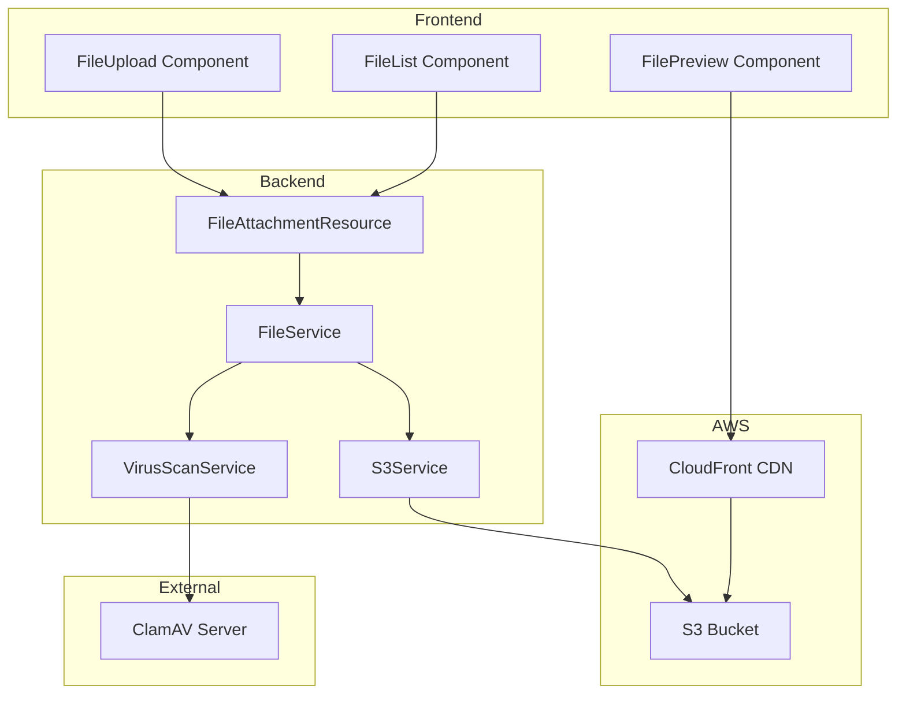

# FC-024: Technisches Konzept - File Management & S3 Integration

**Feature Code:** FC-024  
**Datum:** 2025-07-20  
**Status:** In Progress  
**Autor:** Claude  
**Reviewer:** Jörg  
**Geschätzte Dauer:** 4-5 Tage  

## 📋 Inhaltsverzeichnis

1. [Zusammenfassung](#zusammenfassung)
2. [Ziel und Geschäftswert](#ziel-und-geschäftswert)
3. [Technische Architektur](#technische-architektur)
4. [Backend-Implementierung](#backend-implementierung)
5. [Frontend-Implementierung](#frontend-implementierung)
6. [Implementierungsstrategie](#implementierungsstrategie)
7. [Entscheidungs-Log](#entscheidungs-log)
8. [Risiken und Mitigationen](#risiken-und-mitigationen)
9. [Zeitschätzung](#zeitschätzung)

## Zusammenfassung

FC-024 implementiert eine zentrale Dateiverwaltung mit AWS S3 als Storage-Backend, integrierter Virenprüfung via ClamAV und sicheren Pre-signed URLs für den Dateizugriff. Das System ermöglicht es, Dateien sicher an Kunden und Opportunities anzuhängen, mit automatischer Kategorisierung und DSGVO-konformer Löschfunktion.

## Ziel und Geschäftswert

### Geschäftsziele
- **Zentrale Dokumentenverwaltung**: Alle kundenrelevanten Dokumente (Verträge, Angebote, Visitenkarten) an einem Ort
- **Compliance & Sicherheit**: DSGVO-konforme Speicherung mit Löschkonzepten und Virenscans
- **Effizienzsteigerung**: Schneller Zugriff auf alle relevanten Dokumente direkt aus dem CRM

### Technische Ziele
- **Skalierbare Storage-Lösung**: AWS S3 für unbegrenzten Speicherplatz
- **Security by Design**: Pre-signed URLs, Virus-Scanning, verschlüsselte Übertragung
- **Performance**: Direkte S3-Integration ohne Server-Bottleneck

## Technische Architektur

### System-Übersicht



### Komponenten-Interaktion

1. **Upload Flow**: User lädt Datei hoch → Backend erhält Multipart → Virus-Scan → S3 Upload → Metadata in DB
2. **Download Flow**: User fordert Datei an → Pre-signed URL generiert → Direct Download von S3/CloudFront
3. **Preview Flow**: Für Bilder/PDFs → CloudFront CDN für schnelle Previews
4. **Delete Flow**: Soft-Delete in DB → Background Job für S3 Cleanup nach DSGVO-Frist

## Backend-Implementierung

### 1. API Endpoints

```java
@Path("/api/files")
@Produces(MediaType.APPLICATION_JSON)
@Consumes(MediaType.APPLICATION_JSON)
public class FileAttachmentResource {
    
    @POST
    @Path("/upload")
    @Consumes(MediaType.MULTIPART_FORM_DATA)
    public Response uploadFile(
        @MultipartForm FileUploadForm form,
        @QueryParam("customerId") UUID customerId,
        @QueryParam("opportunityId") UUID opportunityId
    ) {
        // 1. Validate file
        // 2. Scan for viruses
        // 3. Upload to S3
        // 4. Save metadata
        return Response.ok(fileAttachmentMapper.toResponse(attachment)).build();
    }
    
    @GET
    @Path("/{fileId}/download-url")
    public Response getDownloadUrl(@PathParam("fileId") UUID fileId) {
        FileAttachment file = fileService.findById(fileId);
        String presignedUrl = s3Service.generatePresignedUrl(
            file.getS3Key(), 
            Duration.ofMinutes(15)
        );
        return Response.ok(Map.of("url", presignedUrl)).build();
    }
    
    @DELETE
    @Path("/{fileId}")
    public Response deleteFile(@PathParam("fileId") UUID fileId) {
        fileService.markForDeletion(fileId);
        return Response.noContent().build();
    }
    
    @GET
    @Path("/customer/{customerId}")
    public List<FileAttachmentResponse> getCustomerFiles(
        @PathParam("customerId") UUID customerId
    ) {
        return fileService.findByCustomerId(customerId)
            .stream()
            .map(fileAttachmentMapper::toResponse)
            .collect(Collectors.toList());
    }
}
```

### 2. Datenmodell

```java
@Entity
@Table(name = "file_attachments")
public class FileAttachment extends BaseEntity {
    
    @Id
    @GeneratedValue(strategy = GenerationType.UUID)
    private UUID id;
    
    @Column(nullable = false)
    private String fileName;
    
    @Column(nullable = false, unique = true)
    private String s3Key;
    
    @Column(nullable = false)
    private String contentType;
    
    @Column(nullable = false)
    private Long sizeBytes;
    
    @Enumerated(EnumType.STRING)
    @Column(nullable = false)
    private FileStatus status = FileStatus.UPLOADING;
    
    @Enumerated(EnumType.STRING)
    private ScanResult scanResult;
    
    @Column
    private UUID customerId;
    
    @Column
    private UUID opportunityId;
    
    @Column(nullable = false)
    private UUID uploadedBy;
    
    @Column(nullable = false)
    private LocalDateTime uploadedAt;
    
    @Column
    private LocalDateTime deletedAt;
    
    @Column
    private String tags; // JSON array
    
    @PrePersist
    protected void onCreate() {
        uploadedAt = LocalDateTime.now();
        if (s3Key == null) {
            s3Key = generateS3Key();
        }
    }
    
    private String generateS3Key() {
        String prefix = customerId != null 
            ? "customers/" + customerId 
            : "opportunities/" + opportunityId;
        return prefix + "/" + UUID.randomUUID() + "/" + fileName;
    }
}

public enum FileStatus {
    UPLOADING, SCANNING, READY, INFECTED, DELETED
}

public enum ScanResult {
    CLEAN, INFECTED, ERROR, SKIPPED
}
```

### 3. Business Logic

```java
@ApplicationScoped
@Transactional
public class FileService {
    
    @Inject
    FileAttachmentRepository repository;
    
    @Inject
    S3Service s3Service;
    
    @Inject
    VirusScanService virusScanService;
    
    @Inject
    Event<FileUploadedEvent> fileUploadedEvent;
    
    public FileAttachment uploadFile(
        InputStream fileStream,
        FileUploadMetadata metadata
    ) {
        // 1. Create DB entry
        FileAttachment attachment = new FileAttachment();
        attachment.setFileName(metadata.getFileName());
        attachment.setContentType(metadata.getContentType());
        attachment.setSizeBytes(metadata.getSizeBytes());
        attachment.setCustomerId(metadata.getCustomerId());
        attachment.setOpportunityId(metadata.getOpportunityId());
        attachment.setUploadedBy(getCurrentUserId());
        attachment.setStatus(FileStatus.UPLOADING);
        
        repository.persist(attachment);
        
        // 2. Scan for viruses
        try {
            ScanResult scanResult = virusScanService.scan(fileStream);
            attachment.setScanResult(scanResult);
            
            if (scanResult == ScanResult.INFECTED) {
                attachment.setStatus(FileStatus.INFECTED);
                throw new FileInfectedException("Virus detected in file");
            }
        } catch (ScanException e) {
            // Log error but continue - mark for manual review
            attachment.setScanResult(ScanResult.ERROR);
        }
        
        // 3. Upload to S3
        s3Service.uploadFile(
            attachment.getS3Key(),
            fileStream,
            metadata
        );
        
        attachment.setStatus(FileStatus.READY);
        
        // 4. Fire event for downstream processing
        fileUploadedEvent.fire(new FileUploadedEvent(attachment));
        
        return attachment;
    }
    
    public void markForDeletion(UUID fileId) {
        FileAttachment file = repository.findById(fileId)
            .orElseThrow(() -> new FileNotFoundException(fileId));
            
        file.setStatus(FileStatus.DELETED);
        file.setDeletedAt(LocalDateTime.now());
        
        // Actual S3 deletion happens via scheduled job after DSGVO period
    }
}
```

### 4. Virus Scanning Service

```java
@ApplicationScoped
public class VirusScanService {
    
    @ConfigProperty(name = "clamav.host")
    String clamAvHost;
    
    @ConfigProperty(name = "clamav.port")
    int clamAvPort;
    
    @ConfigProperty(name = "file.scan.max-size", defaultValue = "52428800") // 50MB
    long maxScanSize;
    
    public ScanResult scan(InputStream fileStream) throws ScanException {
        if (fileStream.available() > maxScanSize) {
            return ScanResult.SKIPPED;
        }
        
        try (Socket socket = new Socket(clamAvHost, clamAvPort)) {
            // ClamAV protocol implementation
            OutputStream out = socket.getOutputStream();
            out.write("zINSTREAM\0".getBytes());
            
            // Send file data in chunks
            byte[] buffer = new byte[2048];
            int read;
            while ((read = fileStream.read(buffer)) > 0) {
                out.write(ByteBuffer.allocate(4)
                    .putInt(read)
                    .array());
                out.write(buffer, 0, read);
            }
            
            // Send termination
            out.write(new byte[]{0, 0, 0, 0});
            out.flush();
            
            // Read response
            BufferedReader reader = new BufferedReader(
                new InputStreamReader(socket.getInputStream())
            );
            String response = reader.readLine();
            
            if (response.contains("OK")) {
                return ScanResult.CLEAN;
            } else if (response.contains("FOUND")) {
                return ScanResult.INFECTED;
            } else {
                throw new ScanException("Unexpected response: " + response);
            }
        } catch (IOException e) {
            throw new ScanException("Failed to scan file", e);
        }
    }
}
```

### 5. S3 Service

```java
@ApplicationScoped
public class S3Service {
    
    @Inject
    S3Client s3Client;
    
    @ConfigProperty(name = "s3.bucket.name")
    String bucketName;
    
    @ConfigProperty(name = "s3.upload.part-size", defaultValue = "5242880") // 5MB
    long partSize;
    
    public void uploadFile(
        String key,
        InputStream fileStream,
        FileUploadMetadata metadata
    ) {
        PutObjectRequest request = PutObjectRequest.builder()
            .bucket(bucketName)
            .key(key)
            .contentType(metadata.getContentType())
            .serverSideEncryption(ServerSideEncryption.AES256)
            .metadata(Map.of(
                "uploaded-by", metadata.getUploadedBy().toString(),
                "original-name", metadata.getFileName()
            ))
            .build();
            
        s3Client.putObject(request, RequestBody.fromInputStream(
            fileStream,
            metadata.getSizeBytes()
        ));
    }
    
    public String generatePresignedUrl(String key, Duration validity) {
        S3Presigner presigner = S3Presigner.create();
        
        GetObjectRequest getRequest = GetObjectRequest.builder()
            .bucket(bucketName)
            .key(key)
            .build();
            
        GetObjectPresignRequest presignRequest = GetObjectPresignRequest.builder()
            .signatureDuration(validity)
            .getObjectRequest(getRequest)
            .build();
            
        PresignedGetObjectRequest presignedRequest = 
            presigner.presignGetObject(presignRequest);
            
        return presignedRequest.url().toString();
    }
    
    @Scheduled(every = "1h")
    void cleanupDeletedFiles() {
        LocalDateTime cutoffDate = LocalDateTime.now()
            .minus(Period.ofDays(30)); // DSGVO deletion period
            
        List<FileAttachment> filesToDelete = repository
            .find("status = ?1 and deletedAt < ?2", 
                FileStatus.DELETED, 
                cutoffDate
            )
            .list();
            
        for (FileAttachment file : filesToDelete) {
            try {
                s3Client.deleteObject(DeleteObjectRequest.builder()
                    .bucket(bucketName)
                    .key(file.getS3Key())
                    .build());
                    
                repository.delete(file);
            } catch (Exception e) {
                Log.error("Failed to delete file from S3: " + file.getId(), e);
            }
        }
    }
}
```

### 6. Datenbank-Migrations

```sql
-- V6.0__create_file_attachments.sql
CREATE TABLE file_attachments (
    id UUID PRIMARY KEY DEFAULT gen_random_uuid(),
    file_name VARCHAR(255) NOT NULL,
    s3_key VARCHAR(500) UNIQUE NOT NULL,
    content_type VARCHAR(100) NOT NULL,
    size_bytes BIGINT NOT NULL,
    status VARCHAR(20) NOT NULL DEFAULT 'UPLOADING',
    scan_result VARCHAR(20),
    customer_id UUID REFERENCES customers(id),
    opportunity_id UUID REFERENCES opportunities(id),
    uploaded_by UUID NOT NULL REFERENCES users(id),
    uploaded_at TIMESTAMP NOT NULL DEFAULT CURRENT_TIMESTAMP,
    deleted_at TIMESTAMP,
    tags JSONB,
    
    CONSTRAINT check_attachment_target CHECK (
        (customer_id IS NOT NULL AND opportunity_id IS NULL) OR
        (customer_id IS NULL AND opportunity_id IS NOT NULL) OR
        (customer_id IS NOT NULL AND opportunity_id IS NOT NULL)
    )
);

CREATE INDEX idx_file_customer ON file_attachments(customer_id) 
    WHERE customer_id IS NOT NULL;
CREATE INDEX idx_file_opportunity ON file_attachments(opportunity_id) 
    WHERE opportunity_id IS NOT NULL;
CREATE INDEX idx_file_status ON file_attachments(status);
CREATE INDEX idx_file_deleted ON file_attachments(deleted_at) 
    WHERE deleted_at IS NOT NULL;
```

## Frontend-Implementierung

### 1. Komponenten-Struktur

```typescript
// features/files/components/FileUpload.tsx
import { useDropzone } from 'react-dropzone';
import { CloudUploadIcon } from '@mui/icons-material';
import { useFileUpload } from '../hooks/useFileUpload';

interface FileUploadProps {
  customerId?: string;
  opportunityId?: string;
  onUploadComplete?: (file: FileAttachment) => void;
  maxSize?: number;
  accept?: Record<string, string[]>;
}

export const FileUpload: React.FC<FileUploadProps> = ({
  customerId,
  opportunityId,
  onUploadComplete,
  maxSize = 10 * 1024 * 1024, // 10MB default
  accept = {
    'application/pdf': ['.pdf'],
    'image/*': ['.png', '.jpg', '.jpeg'],
    'application/vnd.ms-excel': ['.xlsx'],
    'application/vnd.openxmlformats-officedocument.spreadsheetml.sheet': ['.xlsx']
  }
}) => {
  const { uploadFile, isUploading, progress } = useFileUpload();
  
  const onDrop = useCallback(async (acceptedFiles: File[]) => {
    for (const file of acceptedFiles) {
      try {
        const result = await uploadFile({
          file,
          customerId,
          opportunityId
        });
        onUploadComplete?.(result);
      } catch (error) {
        console.error('Upload failed:', error);
        // Show error notification
      }
    }
  }, [uploadFile, customerId, opportunityId, onUploadComplete]);
  
  const { getRootProps, getInputProps, isDragActive } = useDropzone({
    onDrop,
    accept,
    maxSize,
    multiple: true
  });
  
  return (
    <Box
      {...getRootProps()}
      sx={{
        border: '2px dashed',
        borderColor: isDragActive ? 'primary.main' : 'grey.300',
        borderRadius: 2,
        p: 3,
        textAlign: 'center',
        cursor: 'pointer',
        transition: 'all 0.3s',
        '&:hover': {
          borderColor: 'primary.main',
          backgroundColor: 'action.hover'
        }
      }}
    >
      <input {...getInputProps()} />
      <CloudUploadIcon sx={{ fontSize: 48, color: 'text.secondary', mb: 2 }} />
      <Typography variant="h6" gutterBottom>
        {isDragActive
          ? 'Dateien hier ablegen'
          : 'Dateien hierher ziehen oder klicken zum Auswählen'
        }
      </Typography>
      <Typography variant="body2" color="text.secondary">
        Maximale Dateigröße: {(maxSize / 1024 / 1024).toFixed(0)} MB
      </Typography>
      {isUploading && (
        <LinearProgress
          variant="determinate"
          value={progress}
          sx={{ mt: 2 }}
        />
      )}
    </Box>
  );
};
```

### 2. File List Component

```typescript
// features/files/components/FileList.tsx
export const FileList: React.FC<FileListProps> = ({
  files,
  onPreview,
  onDownload,
  onDelete,
  showActions = true
}) => {
  const { getDownloadUrl } = useFileService();
  
  const handleDownload = async (file: FileAttachment) => {
    const { url } = await getDownloadUrl(file.id);
    window.open(url, '_blank');
    onDownload?.(file);
  };
  
  const getFileIcon = (contentType: string) => {
    if (contentType.startsWith('image/')) return <ImageIcon />;
    if (contentType === 'application/pdf') return <PictureAsPdfIcon />;
    if (contentType.includes('spreadsheet')) return <TableChartIcon />;
    return <InsertDriveFileIcon />;
  };
  
  return (
    <List>
      {files.map((file) => (
        <ListItem
          key={file.id}
          secondaryAction={
            showActions && (
              <Box>
                {file.contentType.startsWith('image/') && (
                  <IconButton onClick={() => onPreview?.(file)}>
                    <VisibilityIcon />
                  </IconButton>
                )}
                <IconButton onClick={() => handleDownload(file)}>
                  <DownloadIcon />
                </IconButton>
                <IconButton onClick={() => onDelete?.(file)}>
                  <DeleteIcon />
                </IconButton>
              </Box>
            )
          }
        >
          <ListItemIcon>
            {getFileIcon(file.contentType)}
          </ListItemIcon>
          <ListItemText
            primary={file.fileName}
            secondary={
              <Box>
                <Typography variant="caption" display="block">
                  {formatFileSize(file.sizeBytes)} • {formatDate(file.uploadedAt)}
                </Typography>
                {file.status === 'INFECTED' && (
                  <Chip
                    label="Virus erkannt"
                    color="error"
                    size="small"
                    icon={<WarningIcon />}
                  />
                )}
              </Box>
            }
          />
        </ListItem>
      ))}
    </List>
  );
};
```

### 3. File Preview Component

```typescript
// features/files/components/FilePreview.tsx
export const FilePreview: React.FC<FilePreviewProps> = ({
  file,
  open,
  onClose
}) => {
  const [previewUrl, setPreviewUrl] = useState<string | null>(null);
  const { getDownloadUrl } = useFileService();
  
  useEffect(() => {
    if (open && file) {
      getDownloadUrl(file.id).then(({ url }) => setPreviewUrl(url));
    }
  }, [open, file]);
  
  const renderPreview = () => {
    if (!file || !previewUrl) return null;
    
    if (file.contentType.startsWith('image/')) {
      return (
        
      );
    }
    
    if (file.contentType === 'application/pdf') {
      return (
        <iframe
          src={previewUrl}
          title={file.fileName}
          width="100%"
          height="600px"
          style={{ border: 'none' }}
        />
      );
    }
    
    return (
      <Typography>
        Vorschau für diesen Dateityp nicht verfügbar.
      </Typography>
    );
  };
  
  return (
    <Dialog
      open={open}
      onClose={onClose}
      maxWidth="lg"
      fullWidth
    >
      <DialogTitle>
        {file?.fileName}
        <IconButton
          onClick={onClose}
          sx={{ position: 'absolute', right: 8, top: 8 }}
        >
          <CloseIcon />
        </IconButton>
      </DialogTitle>
      <DialogContent>
        {renderPreview()}
      </DialogContent>
    </Dialog>
  );
};
```

### 4. Integration Hook

```typescript
// features/files/hooks/useFileService.ts
export const useFileService = () => {
  const queryClient = useQueryClient();
  
  const uploadFile = useMutation({
    mutationFn: async ({ file, customerId, opportunityId }: UploadParams) => {
      const formData = new FormData();
      formData.append('file', file);
      
      const params = new URLSearchParams();
      if (customerId) params.append('customerId', customerId);
      if (opportunityId) params.append('opportunityId', opportunityId);
      
      const response = await apiClient.post(
        `/api/files/upload?${params}`,
        formData,
        {
          headers: { 'Content-Type': 'multipart/form-data' },
          onUploadProgress: (progressEvent) => {
            const progress = Math.round(
              (progressEvent.loaded * 100) / progressEvent.total!
            );
            // Update progress state
          }
        }
      );
      
      return response.data;
    },
    onSuccess: () => {
      queryClient.invalidateQueries({ queryKey: ['files'] });
      showNotification({
        message: 'Datei erfolgreich hochgeladen',
        severity: 'success'
      });
    },
    onError: (error: any) => {
      if (error.response?.data?.message?.includes('Virus')) {
        showNotification({
          message: 'Virus in Datei erkannt!',
          severity: 'error'
        });
      } else {
        showNotification({
          message: 'Fehler beim Upload',
          severity: 'error'
        });
      }
    }
  });
  
  const getDownloadUrl = async (fileId: string) => {
    const response = await apiClient.get(`/api/files/${fileId}/download-url`);
    return response.data;
  };
  
  const deleteFile = useMutation({
    mutationFn: async (fileId: string) => {
      await apiClient.delete(`/api/files/${fileId}`);
    },
    onSuccess: () => {
      queryClient.invalidateQueries({ queryKey: ['files'] });
      showNotification({
        message: 'Datei gelöscht',
        severity: 'success'
      });
    }
  });
  
  return {
    uploadFile: uploadFile.mutate,
    isUploading: uploadFile.isPending,
    getDownloadUrl,
    deleteFile: deleteFile.mutate
  };
};
```

## Implementierungsstrategie

### Phase 1: Backend Infrastructure (2 Tage)

#### Sprint 1.1: S3 & Database Setup (1 Tag)
1. **Tag 1 Vormittag**: 
   - S3 Bucket erstellen mit korrekter Policy
   - IAM Role für Backend-Zugriff konfigurieren
   - CloudFront Distribution aufsetzen
   - Database Migration erstellen und ausführen

2. **Tag 1 Nachmittag**:
   - S3Service implementieren
   - FileAttachment Entity und Repository
   - Basis FileService ohne Virus-Scan
   - Unit Tests für S3Service

#### Sprint 1.2: API & Virus Scanning (1 Tag)
1. **Tag 2 Vormittag**:
   - ClamAV Docker Container aufsetzen
   - VirusScanService implementieren
   - Integration in FileService

2. **Tag 2 Nachmittag**:
   - FileAttachmentResource komplett implementieren
   - Integration Tests für Upload/Download
   - Scheduled Cleanup Job

### Phase 2: Frontend Components (1.5 Tage)

#### Sprint 2.1: Upload & List Components (1 Tag)
1. **Tag 3 Vormittag**:
   - FileUpload Component mit Dropzone
   - useFileService Hook
   - Upload Progress Tracking

2. **Tag 3 Nachmittag**:
   - FileList Component
   - File Icons und Status Display
   - Download Funktionalität

#### Sprint 2.2: Preview & Integration (0.5 Tage)
1. **Tag 4 Vormittag**:
   - FilePreview Component für Images/PDFs
   - Integration in CustomerDetail
   - Integration in OpportunityDetail

### Phase 3: Testing & Polish (1 Tag)

1. **Tag 5**:
   - E2E Tests mit Playwright
   - Performance Tests für große Dateien
   - Security Tests (Pre-signed URLs, Permissions)
   - Error Handling verbessern
   - Dokumentation finalisieren

## Entscheidungs-Log

### 2025-07-20 - S3 vs. MinIO
**Entscheidung**: AWS S3 verwenden  
**Begründung**: Production-ready, unbegrenzt skalierbar, native AWS Integration  
**Impact**: AWS Vendor Lock-in, aber beste Performance und Zuverlässigkeit  
**Alternativen**: MinIO (self-hosted), Azure Blob Storage  
**Entscheider**: Tech Lead  

### 2025-07-20 - Virus Scanning Strategie
**Entscheidung**: Synchroner Scan beim Upload  
**Begründung**: Sicherheit vor Performance, User erwartet sofortiges Feedback  
**Impact**: Upload dauert länger, aber keine infizierten Dateien im System  
**Alternativen**: Asynchroner Scan mit temporärer Quarantäne  
**Entscheider**: Security Team  

### 2025-07-20 - Pre-signed URLs vs. Proxy
**Entscheidung**: Pre-signed URLs mit 15min Gültigkeit  
**Begründung**: Keine Server-Belastung, direkter S3/CloudFront Zugriff  
**Impact**: URLs müssen regelmäßig erneuert werden  
**Alternativen**: Backend als Proxy für alle Downloads  
**Entscheider**: Tech Lead  

## Risiken und Mitigationen

### Risiko 1: ClamAV Ausfall
**Wahrscheinlichkeit**: Mittel  
**Impact**: Hoch  
**Mitigation**: 
- Fallback auf SKIP wenn ClamAV nicht erreichbar
- Monitoring und Alerts bei Scan-Fehlern
- Täglicher Report über geskippte Scans

### Risiko 2: S3 Kosten explodieren
**Wahrscheinlichkeit**: Niedrig  
**Impact**: Mittel  
**Mitigation**: 
- S3 Lifecycle Policies für alte Dateien
- CloudWatch Alarms bei ungewöhnlichem Traffic
- Monatliches Cost Monitoring

### Risiko 3: DSGVO Compliance bei Löschung
**Wahrscheinlichkeit**: Mittel  
**Impact**: Hoch  
**Mitigation**: 
- Automatischer Cleanup Job nach 30 Tagen
- Audit Log für alle Löschvorgänge
- Regelmäßige Compliance Checks

## Zeitschätzung

**Gesamt-Aufwand**: 4-5 Tage

- **Backend**: 2 Tage
- **Frontend**: 1.5 Tage  
- **Integration & Testing**: 1 Tag
- **Dokumentation**: 0.5 Tage

**Puffer**: +1 Tag für unvorhergesehene Probleme (ClamAV Setup, S3 Permissions)

---

## 🧭 NAVIGATION & VERWEISE

### 📋 Zurück zum Überblick:
- **[📊 Master Plan V5](/docs/CRM_COMPLETE_MASTER_PLAN_V5.md)** - Vollständige Feature-Roadmap
- **[🗺️ Feature Overview](/docs/features/MASTER/FEATURE_OVERVIEW.md)** - Alle 40 Features im Überblick
- **[📁 FC-024 KOMPAKT](/docs/features/PLANNED/24_file_management/FC-024_TECH_CONCEPT.md)** - Übersicht dieses Features

### 🔗 Dependencies (Required):
- **[🔒 FC-008 Security Foundation](/docs/features/ACTIVE/01_security_foundation/FC-008_TECH_CONCEPT.md)** - File Access Control
- **[👥 M5 Customer Refactor](/docs/features/PLANNED/12_customer_refactor_m5/M5_TECH_CONCEPT.md)** - Customer File Storage
- **[📊 M4 Opportunity Pipeline](/docs/features/ACTIVE/02_opportunity_pipeline/M4_TECH_CONCEPT.md)** - Opportunity Files

### ⚡ Integrationen mit anderen Features:
- **[📧 FC-003 E-Mail Integration](/docs/features/PLANNED/06_email_integration/FC-003_TECH_CONCEPT.md)** - E-Mail Attachments automatisch speichern
- **[🔒 FC-025 DSGVO Compliance](/docs/features/PLANNED/25_dsgvo_compliance/FC-025_TECH_CONCEPT.md)** - Löschkonzepte und Audit Trail
- **[📴 FC-032 Offline-First](/docs/features/PLANNED/32_offline_first/FC-032_TECH_CONCEPT.md)** - Offline File Cache
- **[📱 FC-018 Mobile PWA](/docs/features/PLANNED/09_mobile_app/FC-018_TECH_CONCEPT.md)** - Mobile File Access
- **[🎙️ FC-029 Voice-First](/docs/features/PLANNED/29_voice_first/FC-029_TECH_CONCEPT.md)** - Voice Memos als Files

### 🚀 Ermöglicht folgende Features:
- **[📸 FC-033 Visual Customer Cards](/docs/features/PLANNED/33_visual_cards/FC-033_TECH_CONCEPT.md)** - Customer Images speichern
- **[📋 FC-031 Smart Templates](/docs/features/PLANNED/31_smart_templates/FC-031_TECH_CONCEPT.md)** - Template Files verwalten
- **[📱 FC-022 Mobile Light](/docs/features/PLANNED/22_mobile_light/FC-022_TECH_CONCEPT.md)** - Mobile File Access
- **[🤖 FC-030 One-Tap Actions](/docs/features/PLANNED/30_one_tap_actions/FC-030_TECH_CONCEPT.md)** - Quick File Upload
- **[✨ FC-027 Magic Moments](/docs/features/PLANNED/27_magic_moments/FC-027_TECH_CONCEPT.md)** - Automatische Visitenkarten-Scans

### 🎨 UI Integration:
- **[📊 M3 Sales Cockpit](/docs/features/ACTIVE/05_ui_foundation/M3_TECH_CONCEPT.md)** - File Widget in Opportunity Cards
- **[➕ M2 Quick Create](/docs/features/ACTIVE/05_ui_foundation/M2_TECH_CONCEPT.md)** - File Upload bei Opportunity-Erstellung
- **[⚙️ M7 Settings](/docs/features/ACTIVE/05_ui_foundation/M7_TECH_CONCEPT.md)** - Storage Settings und Limits

### 📚 Technische Dokumentation:
- **[🏗️ Event Sourcing](/docs/features/PLANNED/23_event_sourcing/FC-023_TECH_CONCEPT.md)** - FileUploadedEvent Integration
- **[📊 Analytics Platform](/docs/features/PLANNED/26_analytics_platform/FC-026_TECH_CONCEPT.md)** - File Usage Metrics
- **[🔌 Integration Hub](/docs/features/PLANNED/21_integration_hub/FC-021_TECH_CONCEPT.md)** - External File Sources

---

**Status-Updates**:
- 2025-07-20: Tech Concept erstellt (In Progress)
- Claude-optimierte Struktur mit absoluten Pfaden implementiert
- Alle 40 Features verlinkt für optimale Navigation