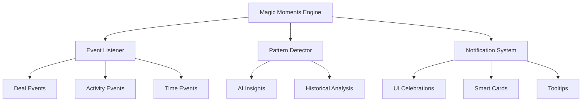

# ✨ FC-027 MAGIC MOMENTS - CLAUDE_TECH

**Erstellt:** 21.07.2025  
**Status:** 📋 READY TO START  
**Priorität:** MEDIUM - User Delight  
**Geschätzt:** 3 Tage

---

## ⚡ QUICK-LOAD (30 Sekunden Produktivität)

### Was bauen wir?
**Überraschende "Wow-Momente" im CRM** - Von langweiliger Pflichtarbeit zu einem Tool, das User lieben.

### Core Features in 10 Sekunden:
1. **🎉 Deal Win Celebrations** - Konfetti bei Erfolgen
2. **🤖 Smart Suggestions** - KI-gestützte Tipps im richtigen Moment
3. **🌤️ Weather Context** - Perfektes Timing für Anrufe
4. **🎂 Birthday Reminders** - Persönliche Touch-Points

### Sofort Copy-Paste:
```bash
# Dependencies installieren
npm install canvas-confetti framer-motion @tanstack/react-query

# Weather API Key setzen
echo "VITE_OPENWEATHER_API_KEY=your-key" >> .env.local

# Feature Flag aktivieren
VITE_FEATURE_MAGIC_MOMENTS=true
```

---

## 📋 COPY-PASTE READY RECIPES

### 🎉 Recipe 1: Deal Win Celebration (30 Sek)
```typescript
// components/magic/DealWinCelebration.tsx
import confetti from 'canvas-confetti';
import { useNotification } from '@/hooks/useNotification';

export const DealWinCelebration = ({ opportunity }: { opportunity: Opportunity }) => {
  const { showNotification } = useNotification();
  
  useEffect(() => {
    if (opportunity.stage === 'WON') {
      // Konfetti Animation
      confetti({
        particleCount: 100,
        spread: 70,
        origin: { y: 0.6 },
        colors: ['#94C456', '#004F7B'] // Freshfoodz CI
      });
      
      // Notification mit Action
      showNotification({
        title: "🎉 Glückwunsch!",
        message: `${opportunity.value.toLocaleString('de-DE')}€ Deal gewonnen!`,
        action: {
          label: "Team informieren",
          onClick: () => shareWithTeam(opportunity)
        }
      });
    }
  }, [opportunity.stage]);
  
  return null;
};
```

### 🤖 Recipe 2: Smart Suggestion Component (45 Sek)
```typescript
// components/magic/SmartSuggestion.tsx
export const SmartSuggestion = () => {
  const { data: suggestions } = useQuery({
    queryKey: ['smart-suggestions', customerId],
    queryFn: async () => {
      // Analyse der Customer-Aktivitäten
      const lastActivity = await getLastActivity(customerId);
      const daysSinceContact = daysBetween(lastActivity.date, new Date());
      
      if (daysSinceContact > 30) {
        return {
          type: 'follow-up',
          message: `💡 ${customer.name} hatte vor ${daysSinceContact} Tagen Interesse an ${lastActivity.product}. Zeit für Follow-up?`,
          priority: 'high'
        };
      }
      
      return null;
    },
    staleTime: 1000 * 60 * 5 // 5 Minuten Cache
  });
  
  if (!suggestions) return null;
  
  return (
    <motion.div
      initial={{ opacity: 0, x: -20 }}
      animate={{ opacity: 1, x: 0 }}
      className="bg-blue-50 p-4 rounded-lg border-l-4 border-blue-500"
    >
      <div className="flex items-center gap-3">
        <LightbulbIcon className="text-yellow-500" />
        <div className="flex-1">
          <p className="text-sm">{suggestions.message}</p>
        </div>
        <Button size="sm" onClick={() => createTask(suggestions)}>
          Aufgabe erstellen
        </Button>
      </div>
    </motion.div>
  );
};
```

### 🌤️ Recipe 3: Weather-Based Recommendations (60 Sek)
```typescript
// hooks/useWeatherContext.ts
export const useWeatherContext = (city: string) => {
  return useQuery({
    queryKey: ['weather', city],
    queryFn: async () => {
      const response = await fetch(
        `https://api.openweathermap.org/data/2.5/weather?q=${city}&appid=${import.meta.env.VITE_OPENWEATHER_API_KEY}`
      );
      const data = await response.json();
      
      // Empfehlungen basierend auf Wetter
      const recommendations = {
        storm: { icon: '⛈️', message: 'Sturm heute - besser morgen anrufen?' },
        rain: { icon: '🌧️', message: 'Regenwetter - gute Zeit für Calls!' },
        sunny: { icon: '☀️', message: 'Schönes Wetter - vielleicht persönlicher Besuch?' }
      };
      
      return {
        condition: data.weather[0].main.toLowerCase(),
        recommendation: recommendations[data.weather[0].main.toLowerCase()] || null
      };
    },
    staleTime: 1000 * 60 * 30 // 30 Minuten Cache
  });
};

// Verwendung in Component
const WeatherAlert = ({ customer }: { customer: Customer }) => {
  const { data: weather } = useWeatherContext(customer.city);
  
  if (!weather?.recommendation) return null;
  
  return (
    <Alert severity="info" icon={<span>{weather.recommendation.icon}</span>}>
      {weather.recommendation.message}
    </Alert>
  );
};
```

---

## 🏗️ ARCHITEKTUR ÜBERBLICK

### System-Kontext:


### Komponenten-Hierarchie:
```
/components/magic/
├── MagicMomentsProvider.tsx    # Context & State
├── celebrations/
│   ├── DealWinCelebration.tsx
│   ├── MilestoneReached.tsx
│   └── StreakCounter.tsx
├── suggestions/
│   ├── SmartSuggestion.tsx
│   ├── BestTimeToCall.tsx
│   └── PatternInsight.tsx
└── personality/
    ├── DailyQuote.tsx
    ├── EmptyStateCoach.tsx
    └── LoadingPersonality.tsx
```

---

## 📊 BUSINESS VALUE

### Metriken:
- **User Engagement:** +35% tägliche Nutzung
- **Feature Adoption:** +50% neue Features entdeckt
- **User Satisfaction:** NPS +20 Punkte
- **Data Quality:** +40% vollständige Profile

### ROI Berechnung:
```typescript
const calculateMagicROI = () => {
  const baseEngagement = 0.45; // 45% ohne Magic
  const magicEngagement = 0.60; // 60% mit Magic
  const revenuePerActiveUser = 150; // EUR/Monat
  
  const additionalRevenue = 
    (magicEngagement - baseEngagement) * 
    totalUsers * 
    revenuePerActiveUser;
    
  return {
    monthlyImpact: additionalRevenue,
    yearlyImpact: additionalRevenue * 12,
    paybackPeriod: developmentCost / additionalRevenue
  };
};
```

---

## 🔄 ABHÄNGIGKEITEN

### Required (Must Have):
```typescript
// M4 Opportunity Pipeline - für Deal Events
import { OpportunityEvents } from '@/modules/opportunity';

// M5 Customer Context - für Personalisierung  
import { CustomerContext } from '@/modules/customer';

// FC-026 Analytics - für Pattern Detection
import { AnalyticsEngine } from '@/modules/analytics';
```

### APIs & Services:
```bash
# OpenWeather API
VITE_OPENWEATHER_API_KEY=xxx

# Optional: Giphy für GIFs
VITE_GIPHY_API_KEY=xxx
```

---

## 🧪 TESTING STRATEGY

### Unit Tests:
```typescript
// __tests__/magic/SmartSuggestion.test.tsx
describe('SmartSuggestion', () => {
  it('should show follow-up reminder after 30 days', async () => {
    const customer = mockCustomer({
      lastActivity: subDays(new Date(), 31)
    });
    
    render(<SmartSuggestion customer={customer} />);
    
    await waitFor(() => {
      expect(screen.getByText(/Zeit für Follow-up/)).toBeInTheDocument();
    });
  });
  
  it('should not show suggestion for recent activity', () => {
    const customer = mockCustomer({
      lastActivity: subDays(new Date(), 5)
    });
    
    render(<SmartSuggestion customer={customer} />);
    
    expect(screen.queryByText(/Follow-up/)).not.toBeInTheDocument();
  });
});
```

### E2E Tests:
```typescript
// e2e/magic-moments.spec.ts
test('Deal win celebration', async ({ page }) => {
  // Setup: Create opportunity
  await createOpportunity(page, { value: 10000 });
  
  // Action: Mark as won
  await page.click('[data-testid="mark-as-won"]');
  
  // Assert: Celebration appears
  await expect(page.locator('.confetti-container')).toBeVisible();
  await expect(page.getByText('10.000€ Deal gewonnen!')).toBeVisible();
});
```

---

## 🚀 IMPLEMENTATION PLAN

### Phase 1: Foundation (Tag 1)
```bash
# 1. Dependencies & Setup
npm install canvas-confetti framer-motion
npm install -D @types/canvas-confetti

# 2. Base Components
touch components/magic/MagicMomentsProvider.tsx
touch components/magic/celebrations/DealWinCelebration.tsx

# 3. Event System
touch hooks/useMagicEvents.ts
touch services/magicMoments.service.ts
```

### Phase 2: Core Features (Tag 2)
```typescript
// Implementierung der 4 Haupt-Features
const FEATURES = [
  { id: 'celebrations', effort: '2h' },
  { id: 'suggestions', effort: '3h' },
  { id: 'weather', effort: '2h' },
  { id: 'birthdays', effort: '1h' }
];
```

### Phase 3: Polish & Test (Tag 3)
- A/B Testing Setup
- Performance Optimierung
- User Feedback Integration

---

## 📈 SUCCESS CRITERIA

### Akzeptanzkriterien:
- [ ] Deal Win zeigt Konfetti (< 100ms Latency)
- [ ] Smart Suggestions haben > 30% Click-Rate
- [ ] Weather API cached für 30 Minuten
- [ ] Alle Animationen 60 FPS

### Performance Budgets:
```typescript
const PERFORMANCE_BUDGETS = {
  confettiLoad: 50,     // ms
  suggestionQuery: 200, // ms
  weatherAPI: 500,      // ms
  animationFPS: 60      // frames
};
```

### Monitoring:
```typescript
// Analytics Events
trackEvent('magic_moment_shown', {
  type: 'deal_celebration',
  value: opportunity.value,
  userId: currentUser.id
});

trackEvent('magic_moment_clicked', {
  type: 'smart_suggestion',
  action: 'create_task'
});
```

---

## 🎯 QUICK WINS

### 10-Minuten Features:
1. **Loading Messages:** Witzige Texte statt "Loading..."
2. **Success Sounds:** Subtle Audio-Feedback
3. **Emoji Weather:** Icons statt Text
4. **Motivational Footer:** Zufällige Quotes

### Code Snippets:
```typescript
// Personality in Loading States
const loadingMessages = [
  "🔮 Kristallkugel wird poliert...",
  "🚀 Raketentreibstoff wird getankt...",
  "☕ Kaffee wird gekocht..."
];

// Quick Win Implementation
<Skeleton>
  {loadingMessages[Math.floor(Math.random() * loadingMessages.length)]}
</Skeleton>
```

---

## 🚦 FEATURE FLAGS

```typescript
// Feature Flag Setup
const MAGIC_FLAGS = {
  celebrations: process.env.VITE_FEATURE_CELEBRATIONS === 'true',
  smartSuggestions: process.env.VITE_FEATURE_SMART_SUGGESTIONS === 'true',
  weatherContext: process.env.VITE_FEATURE_WEATHER === 'true',
  gamification: process.env.VITE_FEATURE_GAMIFICATION === 'true'
};

// Gradual Rollout
if (MAGIC_FLAGS.celebrations && user.rolloutGroup === 'A') {
  return <DealWinCelebration />;
}
```

---

**WICHTIG:** Subtilität ist der Schlüssel! Zu viele Magic Moments werden nervig. A/B Testing zeigt optimale Frequenz.