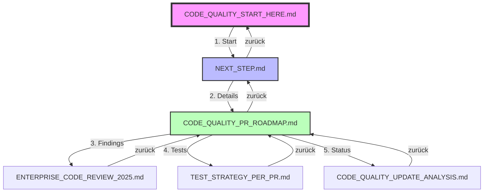

# 🗺️ Code Quality Initiative - Navigationsübersicht

**Zweck:** Zeigt alle Dokumente und ihre Verbindungen auf einen Blick

## 📊 Dokumenten-Flussdiagramm



## 📁 Alle Dokumente mit absoluten Pfaden

### 🎯 Hauptdokumente (in dieser Reihenfolge lesen):

1. **Start-Dokument** ⭐
   - Pfad: `/docs/CODE_QUALITY_START_HERE.md`
   - Zweck: Einstiegspunkt mit Checkliste
   - Links zu: NEXT_STEP.md
   - Zurück zu: CLAUDE.md

2. **Nächster Schritt**
   - Pfad: `/docs/NEXT_STEP.md`
   - Zweck: Zeigt aktuellen Stand und nächste Aktion
   - Links zu: CODE_QUALITY_PR_ROADMAP.md
   - Zurück zu: CODE_QUALITY_START_HERE.md

3. **PR Roadmap** 📋
   - Pfad: `/docs/features/CODE_QUALITY_PR_ROADMAP.md`
   - Zweck: Detaillierter Sprint-Plan mit allen PRs
   - Links zu: ENTERPRISE_CODE_REVIEW_2025.md, TEST_STRATEGY_PER_PR.md
   - Zurück zu: NEXT_STEP.md

### 📚 Detail-Dokumente (bei Bedarf konsultieren):

4. **Enterprise Review**
   - Pfad: `/docs/features/ENTERPRISE_CODE_REVIEW_2025.md`
   - Zweck: Alle Findings und Metriken
   - Links zu: TEST_STRATEGY_PER_PR.md
   - Zurück zu: CODE_QUALITY_PR_ROADMAP.md

5. **Test-Strategien**
   - Pfad: `/docs/features/TEST_STRATEGY_PER_PR.md`
   - Zweck: Test-Pläne für jede PR
   - Links zu: CODE_QUALITY_UPDATE_ANALYSIS.md
   - Zurück zu: CODE_QUALITY_PR_ROADMAP.md

6. **Update-Analyse**
   - Pfad: `/docs/features/CODE_QUALITY_UPDATE_ANALYSIS.md`
   - Zweck: Status-Check was erledigt ist
   - Links zu: CODE_QUALITY_START_HERE.md
   - Zurück zu: CODE_QUALITY_PR_ROADMAP.md

## 🚦 Für neuen Claude - Schritt-für-Schritt

### Phase 1: Orientierung (5 Min)
```bash
# 1. Start-Dokument öffnen
cat /docs/CODE_QUALITY_START_HERE.md

# 2. System-Status prüfen
git branch --show-current
git status

# 3. NEXT_STEP lesen
cat /docs/NEXT_STEP.md
```

### Phase 2: Kontext verstehen (10 Min)
```bash
# 4. Roadmap studieren
cat /docs/features/CODE_QUALITY_PR_ROADMAP.md

# 5. Aktuelle PR-Status prüfen
gh pr list --state open
```

### Phase 3: Aktion (abhängig von Stand)
```bash
# 6. Je nach NEXT_STEP.md:
# - Entweder PR #83 Status prüfen
# - Oder neue PR starten (Security #1)
# - Oder bestehende PR fortsetzen
```

## ⚠️ Kritische Regeln für Code Quality

### NIEMALS ohne diese Dokumente arbeiten:
1. **CODE_QUALITY_PR_ROADMAP.md** - Definiert was zu tun ist
2. **TEST_STRATEGY_PER_PR.md** - Definiert wie zu testen ist
3. **ENTERPRISE_CODE_REVIEW_2025.md** - Erklärt warum es wichtig ist

### IMMER in dieser Reihenfolge:
1. Roadmap lesen → 2. Tests verstehen → 3. Code ändern → 4. Tests ausführen → 5. Commit

## 🔄 Typische Arbeitsflows

### Workflow A: Neue PR starten
```
START_HERE → NEXT_STEP → PR_ROADMAP → Neue Branch → Code → TEST_STRATEGY → Commit → PR
```

### Workflow B: PR Review-Feedback einarbeiten
```
NEXT_STEP → PR_ROADMAP → Git Pull → Fix Issues → TEST_STRATEGY → Push
```

### Workflow C: Status-Check
```
START_HERE → UPDATE_ANALYSIS → ENTERPRISE_REVIEW → Metriken messen
```

## 📍 Quick Links für Copy&Paste

```bash
# Alle Dokumente auf einmal öffnen (in VS Code)
code /docs/CODE_QUALITY_START_HERE.md \
     /docs/NEXT_STEP.md \
     /docs/features/CODE_QUALITY_PR_ROADMAP.md \
     /docs/features/ENTERPRISE_CODE_REVIEW_2025.md \
     /docs/features/TEST_STRATEGY_PER_PR.md \
     /docs/features/CODE_QUALITY_UPDATE_ANALYSIS.md

# Oder in Terminal durchblättern
less /docs/CODE_QUALITY_START_HERE.md
```

## 🎯 Merke:

**Bei Unsicherheit IMMER:**
1. Zurück zu CODE_QUALITY_START_HERE.md
2. Checkliste durchgehen
3. Bei Unklarheit: STOPPEN und in Dokumenten nachschlagen

---

**Diese Navigationsübersicht hilft dir, niemals den Überblick zu verlieren!**