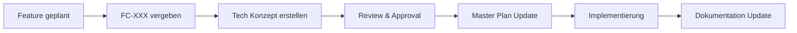
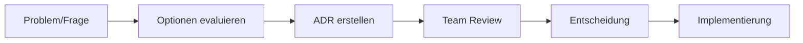

# 📚 FreshPlan Documentation Structure

**Letzte Aktualisierung:** 07.07.2025  
**Status:** Verbindlich für alle Team-Mitglieder

## Übersicht

Dieses Dokument beschreibt die Struktur und Organisation unserer Projekt-Dokumentation. Eine klare Dokumentationsstruktur ist essentiell für effiziente Zusammenarbeit und Wissenstransfer.

## 🗂️ Dokumentations-Hierarchie

```
freshplan-sales-tool/
├── README.md                      # Projekt-Übersicht und Quick-Start
├── CLAUDE.md                      # Arbeitsrichtlinien für AI-Assistenten
├── WAY_OF_WORKING.md              # Team-Arbeitsweise und Standards
├── VISION_AND_ROADMAP.md          # Produkt-Vision und Roadmap
│
└── docs/
    ├── CRM_COMPLETE_MASTER_PLAN_V5.md   # Master-Plan mit Phasen-Übersicht
    ├── DOCUMENTATION_STRUCTURE.md     # Dieses Dokument
    ├── KNOWN_ISSUES.md                # Bekannte Probleme und Workarounds
    │
    ├── features/                      # 🆕 Technische Feature-Konzepte (FC-XXX)
    │   ├── 2025-07-07_TECH_CONCEPT_dynamic-focus-list.md
    │   └── ...
    │
    ├── adr/                           # Architecture Decision Records
    │   ├── ADR_TEMPLATE.md
    │   ├── ADR-001_backend_mock_endpoint_for_dev.md
    │   └── ...
    │
    ├── api/                           # API Dokumentation
    │   ├── API_CONTRACT.md
    │   └── endpoints/
    │
    ├── technical/                     # Technische Dokumentation
    │   ├── BACKEND_START_GUIDE.md
    │   ├── FRONTEND_BACKEND_SPECIFICATION.md
    │   └── ...
    │
    ├── guides/                        # How-to Guides
    │   ├── KEYCLOAK_SETUP.md
    │   ├── CODE_REVIEW_STANDARD.md
    │   └── ...
    │
    ├── team/                          # Team-Prozesse
    │   ├── TEAM_SETUP.md
    │   ├── DEVELOPMENT_SETUP.md
    │   └── ONBOARDING.md
    │
    ├── templates/                     # Wiederverwendbare Templates
    │   ├── TECH_CONCEPT_TEMPLATE.md   # 🆕 Feature-Konzept Template
    │   ├── CHANGE_LOG_TEMPLATE.md
    │   ├── PROBLEM_ANALYSIS_TEMPLATE.md
    │   └── ...
    │
    └── claude-work/                   # AI-Arbeits-Dokumentation
        ├── daily-work/YYYY-MM-DD/
        ├── implementations/
        ├── reviews/
        └── learning/
```

## 📋 Dokumentations-Kategorien

### 1. Feature-Konzepte (FC-XXX) - NEU ab 07.07.2025

**Zweck:** Detaillierte technische Spezifikationen für größere Features

**Namenskonvention:** `YYYY-MM-DD_TECH_CONCEPT_feature-name.md`

**Inhalt:**
- Zusammenfassung und Geschäftswert
- Technische Architektur
- Implementierungsstrategie
- Entscheidungs-Log
- Risiko-Analyse
- Zeitschätzung

**Prozess:**
1. Feature Code vergeben (FC-001, FC-002, ...)
2. Template nutzen: `/docs/templates/TECH_CONCEPT_TEMPLATE.md`
3. Im Master Plan nur verweisen, keine Details

### 2. Architecture Decision Records (ADRs)

**Zweck:** Dokumentation wichtiger Architektur-Entscheidungen

**Format:** Siehe `/docs/adr/ADR_TEMPLATE.md`

**Wann erstellen:**
- Bei grundlegenden Technologie-Entscheidungen
- Bei Änderungen der System-Architektur
- Bei Auswahl zwischen mehreren Lösungsansätzen

### 3. Change Logs

**Zweck:** Dokumentation signifikanter Änderungen

**Wann erstellen:**
- Neue Features
- Breaking Changes
- Datenbank-Migrationen
- API-Änderungen
- Performance-Optimierungen

### 4. Claude-Work Dokumentation

**Zweck:** Arbeits-Dokumentation für AI-Assistenten

**Struktur:**
- `daily-work/`: Tägliche Arbeiten und Übergaben
- `implementations/`: Umgesetzte Features
- `reviews/`: Code-Review Berichte
- `learning/`: Erkenntnisse und Best Practices

## 🔄 Dokumentations-Workflow

### Für neue Features:



### Für Entscheidungen:



## 📝 Best Practices

### 1. Versionierung
- Immer Datum in Dokumenten angeben
- Status-Updates am Ende dokumentieren
- Breaking Changes klar markieren

### 2. Verlinkung
- Relative Links verwenden
- Master Plan als zentraler Einstiegspunkt
- Cross-References zwischen verwandten Docs

### 3. Wartung
- Regelmäßige Reviews (quartalsweise)
- Veraltete Docs archivieren, nicht löschen
- TODOs in Docs vermeiden

### 4. Sprache
- Deutsch für alle Team-Dokumente
- Englisch nur für externe APIs/Libraries
- Konsistente Terminologie verwenden

## 🚨 Kritische Dokumente

Diese Dokumente dürfen NIEMALS gelöscht werden:

1. `/docs/CLAUDE.md`
2. `/docs/STANDARDUBERGABE_NEU.md`
3. `/docs/CRM_COMPLETE_MASTER_PLAN_V5.md`
4. `/docs/TRIGGER_TEXTS.md`
5. Alle Feature-Konzepte (FC-XXX)
6. Alle ADRs

**Backup:** Regelmäßig mit `./scripts/backup-critical-docs.sh`

## 🔍 Dokumentation finden

### Nach Thema:
- **Architektur**: → ADRs, Technical Docs
- **Features**: → Feature-Konzepte (FC-XXX)
- **Prozesse**: → Team, Guides
- **APIs**: → API Contract, Endpoints
- **Setup**: → Guides, Team

### Nach Zielgruppe:
- **Neue Team-Mitglieder**: → README, ONBOARDING, DEVELOPMENT_SETUP
- **Entwickler**: → Technical, API, Feature-Konzepte
- **AI-Assistenten**: → CLAUDE.md, STANDARDUBERGABE_NEU
- **DevOps**: → Infrastructure, Deployment Guides

## 📊 Metriken

### Dokumentations-Qualität:
- Alle Features haben FC-Dokument
- Alle wichtigen Entscheidungen haben ADR
- Keine Docs älter als 6 Monate ohne Review
- Alle kritischen Docs im Git

### Review-Zyklus:
- **Wöchentlich**: Daily-Work Cleanup
- **Monatlich**: Feature-Konzepte Review
- **Quartalsweise**: Gesamt-Dokumentation Review

---

**Nächste Review:** 01.10.2025  
**Verantwortlich:** Tech Lead