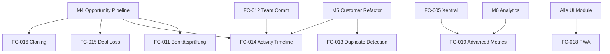

# 🗺️ META-PLANNING: Technische Konzepte in Hybrid-Struktur

**Erstellt:** 20.07.2025 13:30  
**Zweck:** Claude-optimierte Planung für technische Konzepte  
**Scope:** M4 + 7 High Priority Features + Phase 2 Priorisierung  
**Struktur:** Hybrid-Modell mit absoluten Pfaden

---

## 🏗️ UNSERE BEWÄHRTE HYBRID-STRUKTUR

```
/docs/features/ACTIVE/XX_feature_name/
├── FC-XXX_KOMPAKT.md         # 15-Min Übersicht (max 200 Zeilen)
├── FC-XXX_TECH_CONCEPT.md    # Technisches Konzept (NEU!)
├── IMPLEMENTATION_GUIDE.md    # Copy-paste Code-Beispiele
├── DECISION_LOG.md           # Architektur-Entscheidungen
└── NAVIGATION.md             # Bidirektionale Links
```

**Claude-Optimierung:** Jedes Dokument ist in sich geschlossen und verlinkt absolut!

---

## 🎯 ZIELE DER PLANUNGSPHASE

1. **Konsistente Qualität** - Alle Konzepte folgen demselben Template
2. **Abhängigkeiten klären** - Welches Feature braucht welches andere?
3. **Realistische Aufwände** - Basierend auf bisherigen Erfahrungen
4. **Klare Priorisierung** - Was bringt den meisten Wert?

---

## 📋 CLAUDE-OPTIMIERTER WORKFLOW

### 1. Kontext-Sammlung (15 Min)
```bash
# Schritt 1: Feature-Dokument lesen
cat /Users/joergstreeck/freshplan-sales-tool/docs/features/ACTIVE/02_opportunity_pipeline/M4_KOMPAKT.md

# Schritt 2: Dependencies prüfen
grep -n "Dependencies" /Users/joergstreeck/freshplan-sales-tool/docs/features/ACTIVE/02_opportunity_pipeline/M4_KOMPAKT.md

# Schritt 3: Bestehenden Code analysieren
find /Users/joergstreeck/freshplan-sales-tool/frontend/src -name "*opportunity*" -o -name "*pipeline*" | head -10
```

### 2. Tech Concept erstellen (45 Min)
```bash
# Template kopieren
cp /Users/joergstreeck/freshplan-sales-tool/docs/templates/TECH_CONCEPT_TEMPLATE.md \
   /Users/joergstreeck/freshplan-sales-tool/docs/features/ACTIVE/02_opportunity_pipeline/M4_TECH_CONCEPT.md

# Konzept ausfüllen mit:
# - Architektur-Diagramm (Mermaid)
# - API-Endpoints (REST/GraphQL)
# - Datenmodell (Entities)
# - UI-Komponenten (React)
```

### 3. Integration & Verlinkung (30 Min)
- **Absolute Pfade** in allen Verlinkungen
- **Bidirektionale Navigation** aktualisieren
- **Master Plan V5** Reference hinzufügen
- **TODO-System** aktualisieren

**Zeit pro Konzept:** ~1.5 Stunden  
**Batch-Größe:** Max 3 Features pro Session (Claude-Kontext)

---

## 🏗️ FEATURE-ANALYSE MIT ABSOLUTEN PFADEN

| Feature | Dokument-Pfad | Dependencies | Reihenfolge | Status |
|---------|---------------|--------------|-------------|--------|
| **M4 Opportunity Pipeline** | `/docs/features/ACTIVE/02_opportunity_pipeline/M4_KOMPAKT.md` | FC-011, M5 | 1️⃣ Basis | 📝 Start |
| **FC-016 Opportunity Cloning** | `/docs/features/PLANNED/18_opportunity_cloning/FC-016_KOMPAKT.md` | M4 | 2️⃣ Quick Win | 📝 Bereit |
| **FC-013 Duplicate Detection** | `/docs/features/PLANNED/15_duplicate_detection/FC-013_KOMPAKT.md` | M5, FC-009 | 3️⃣ Data Quality | 📝 Bereit |
| **FC-014 Activity Timeline** | `/docs/features/PLANNED/16_activity_timeline/FC-014_KOMPAKT.md` | FC-012, M4 | 4️⃣ Nach FC-012 | 📝 Bereit |
| **FC-015 Deal Loss Analysis** | `/docs/features/PLANNED/17_deal_loss_analysis/FC-015_KOMPAKT.md` | M4, M6 | 5️⃣ Analytics | 📝 Bereit |
| **FC-019 Advanced Metrics** | `/docs/features/PLANNED/19_advanced_metrics/FC-019_KOMPAKT.md` | M6, FC-005 | 6️⃣ Complex | 📝 Bereit |
| **FC-018 Mobile PWA** | `/docs/features/PLANNED/18_mobile_pwa/FC-018_KOMPAKT.md` | Alle UI | 7️⃣ Große Architektur | 📝 Bereit |

---

## 📊 ABHÄNGIGKEITS-GRAPH



---

## 🚀 LOGISCHE REIHENFOLGE (DEPENDENCY-BASIERT)

### Session 1: Pipeline Foundation (3h)
```bash
# 1. M4 Opportunity Pipeline (1.5h)
cat /docs/features/ACTIVE/02_opportunity_pipeline/M4_KOMPAKT.md
# → Erstelle: M4_TECH_CONCEPT.md
# → Dependencies: FC-011 (Bonitätsprüfung), M5 (Customer)

# 2. FC-016 Opportunity Cloning (1.5h) 
cat /docs/features/PLANNED/18_opportunity_cloning/FC-016_KOMPAKT.md
# → Erstelle: FC-016_TECH_CONCEPT.md
# → Braucht: M4 (muss zuerst fertig sein!)
```

### Session 2: Data Quality (3h)
```bash
# 3. FC-013 Duplicate Detection (1.5h)
cat /docs/features/PLANNED/15_duplicate_detection/FC-013_KOMPAKT.md
# → Erstelle: FC-013_TECH_CONCEPT.md
# → Braucht: M5 Customer, FC-009 Permissions

# 4. FC-015 Deal Loss Analysis (1.5h)
cat /docs/features/PLANNED/17_deal_loss_analysis/FC-015_KOMPAKT.md
# → Erstelle: FC-015_TECH_CONCEPT.md
# → Braucht: M4 Pipeline, M6 Analytics
```

### Session 3: Team Features (3h)
```bash
# 5. FC-014 Activity Timeline (1.5h)
cat /docs/features/PLANNED/16_activity_timeline/FC-014_KOMPAKT.md
# → Erstelle: FC-014_TECH_CONCEPT.md
# → Braucht: FC-012 Team Comm, M4 Pipeline

# 6. FC-019 Advanced Metrics (1.5h)
cat /docs/features/PLANNED/19_advanced_metrics/FC-019_KOMPAKT.md
# → Erstelle: FC-019_TECH_CONCEPT.md
# → Braucht: M6 Analytics, FC-005 Xentral
```

### Session 4: Mobile Strategy (1.5h)
```bash
# 7. FC-018 Mobile PWA
cat /docs/features/PLANNED/18_mobile_pwa/FC-018_KOMPAKT.md
# → Erstelle: FC-018_TECH_CONCEPT.md
# → Große Architektur-Entscheidung!
```

---

## 📝 TECH CONCEPT STRUKTUR (CLAUDE-OPTIMIERT)

### Sektion 1: Executive Summary (Max 20 Zeilen)
```markdown
**Feature Code:** M4  
**Feature-Typ:** 🔀 FULLSTACK  
**Geschätzter Aufwand:** X-Y Tage  
**ROI:** Messbare Verbesserung

## 🎯 Problem & Lösung
- **Problem:** In 1 Satz
- **Lösung:** In 2-3 Sätzen
- **Impact:** Konkrete Zahlen
```

### Sektion 2: Architektur-Übersicht (Max 40 Zeilen)
```markdown
## 🏗️ Architektur

### Komponenten-Diagramm
\```mermaid
graph TD
    A[React Frontend] --> B[REST API]
    B --> C[PostgreSQL]
\```

### API Endpoints
- `GET /api/opportunities` - Liste aller Opportunities
- `POST /api/opportunities` - Neue Opportunity
- `PUT /api/opportunities/:id/stage` - Stage ändern
```

### Sektion 3: Implementierungs-Details (Max 60 Zeilen)
```markdown
## 💻 Implementierung

### Backend (Quarkus)
- Entity: `Opportunity.java`
- Service: `OpportunityService.java`
- Resource: `OpportunityResource.java`

### Frontend (React)
- Component: `OpportunityKanban.tsx`
- Hook: `useOpportunities.ts`
- Store: `opportunityStore.ts`

### Datenbank
- Migration: `V5.0__create_opportunities.sql`
```

### Sektion 4: Navigation & Links (PFLICHT!)
```markdown
## 🧭 NAVIGATION

### Dependencies:
- [FC-011 Bonitätsprüfung](/docs/features/ACTIVE/02_opportunity_pipeline/integrations/FC-011_KOMPAKT.md)
- [M5 Customer](/docs/features/PLANNED/12_customer_refactor_m5/M5_KOMPAKT.md)

### Enables:
- [FC-016 Cloning](/docs/features/PLANNED/18_opportunity_cloning/FC-016_KOMPAKT.md)
- [FC-014 Timeline](/docs/features/PLANNED/16_activity_timeline/FC-014_KOMPAKT.md)

### Master Plan:
- [CRM V5](/docs/CRM_COMPLETE_MASTER_PLAN_V5.md)
```

---

## 💡 ENTSCHEIDUNGS-FRAMEWORK

Für jedes Feature-Konzept folgende Fragen klären:

### Architektur-Entscheidungen:
1. **Frontend, Backend oder Fullstack?**
2. **Neue Services oder bestehende erweitern?**
3. **Sync oder Async Processing?**
4. **Caching-Strategie?**

### Technologie-Entscheidungen:
1. **Neue Libraries/Frameworks nötig?**
2. **Database Schema Änderungen?**
3. **API Versioning nötig?**
4. **Performance-kritisch?**

### UX-Entscheidungen:
1. **Desktop-First oder Mobile-First?**
2. **Real-time Updates nötig?**
3. **Offline-Fähigkeit?**
4. **Accessibility Requirements?**

---

## 📅 ZEITPLAN

### Session 1 (3h): M4 + Quick Wins
- 09:00-10:30: M4 Opportunity Pipeline
- 10:30-11:15: FC-016 Opportunity Cloning
- 11:15-12:00: Review & Integration

### Session 2 (3h): Data Quality
- 14:00-15:30: FC-013 Duplicate Detection
- 15:30-16:30: FC-015 Deal Loss Analysis
- 16:30-17:00: Review & Priorisierung Phase 2

### Session 3 (3h): Advanced Features
- Tag 2, 09:00-10:00: FC-014 Activity Timeline
- 10:00-11:30: FC-019 Advanced Metrics
- 11:30-12:30: FC-018 Mobile PWA

---

## 🎯 PHASE 2 PRIORISIERUNG (NACH M4)

### Entscheidungs-Matrix für nächste Features:

| Feature | Business Value | Tech Ready | User Demand | Effort | Score | Rang |
|---------|---------------|------------|-------------|--------|-------|------|
| **FC-012 Team Comm** | 9/10 (Collaboration) | 8/10 (UI fertig) | 10/10 | 6 Tage | 8.7 | 1️⃣ |
| **FC-013 Duplicate** | 8/10 (Datenqualität) | 9/10 (M5 fertig) | 7/10 | 4 Tage | 8.1 | 2️⃣ |
| **FC-005 Xentral** | 10/10 (Provisions) | 6/10 (API Keys) | 9/10 | 8 Tage | 8.0 | 3️⃣ |
| **FC-014 Timeline** | 7/10 (Transparenz) | 7/10 (needs FC-012) | 8/10 | 5 Tage | 7.3 | 4️⃣ |

### Empfohlene Reihenfolge Phase 2:
```
1. FC-012 Team Communication (blockiert FC-014)
2. FC-013 Duplicate Detection (Quick Win)
3. FC-005 Xentral Integration (High ROI)
4. FC-014 Activity Timeline (nach FC-012)
```

---

## ✅ SOFORT-START ANLEITUNG

### Schritt 1: M4 Kontext laden
```bash
# M4 Dokument lesen
cat /Users/joergstreeck/freshplan-sales-tool/docs/features/ACTIVE/02_opportunity_pipeline/M4_KOMPAKT.md

# Dependencies prüfen
ls -la /Users/joergstreeck/freshplan-sales-tool/docs/features/ACTIVE/02_opportunity_pipeline/integrations/

# Bestehenden Code finden
find /Users/joergstreeck/freshplan-sales-tool -name "*opportunity*" -type f | grep -E "\.(ts|tsx|java)$"
```

### Schritt 2: Tech Concept erstellen
```bash
# Template kopieren
cp /Users/joergstreeck/freshplan-sales-tool/docs/templates/TECH_CONCEPT_TEMPLATE.md \
   /Users/joergstreeck/freshplan-sales-tool/docs/features/ACTIVE/02_opportunity_pipeline/M4_TECH_CONCEPT.md
```

### Schritt 3: Navigation aktualisieren
- M4_KOMPAKT.md → Link zu M4_TECH_CONCEPT.md
- Master Plan V5 → Status Update
- TODO-System → M4-CONCEPT als "in_progress"

**Ready?** Los geht's mit M4 Opportunity Pipeline! 🚀