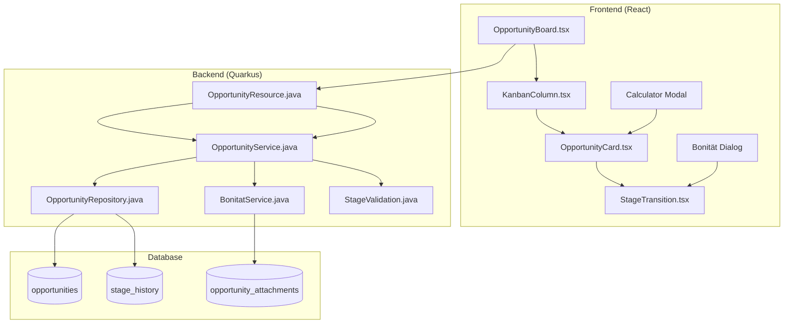

# M4: Technisches Konzept - Opportunity Pipeline

**Feature Code:** M4  
**Feature-Typ:** 🔀 FULLSTACK  
**Datum:** 20.07.2025  
**Status:** Draft  
**Geschätzter Aufwand:** 8-10 Tage  
**ROI:** 50% weniger Deal-Verluste, 3x schnellere Pipeline-Updates  

## 📋 Inhaltsverzeichnis

1. [Zusammenfassung](#zusammenfassung)
2. [Ziel und Geschäftswert](#ziel-und-geschäftswert)
3. [Technische Architektur](#technische-architektur)
4. [Backend-Implementierung](#backend-implementierung)
5. [Frontend-Implementierung](#frontend-implementierung)
6. [Implementierungsstrategie](#implementierungsstrategie)
7. [Entscheidungs-Log](#entscheidungs-log)
8. [Risiken und Mitigationen](#risiken-und-mitigationen)
9. [Zeitschätzung](#zeitschätzung)

## Zusammenfassung

Interaktives Kanban Board zur visuellen Verwaltung der Sales Pipeline mit 5 Stages (Lead → Qualified → Proposal → Negotiation → Closed). Features: Drag & Drop zwischen Stages, automatische Bonitätsprüfung bei Stage-Übergängen, integrierte Calculator-Modals für Angebotserstellung, Team-Sharing und Echtzeit-Updates. Ersetzt Excel-basierte Deal-Tracking mit strukturierter "Geführter Freiheit" - System führt Prozess, lässt aber Power-User-Flexibilität.

## Ziel und Geschäftswert

### Geschäftsziele
- **Deal-Verluste reduzieren**: 50% weniger Lost Deals durch strukturierte Prozessführung und Reminder-System
- **Pipeline-Transparenz**: Echtzeit-Überblick über alle 50+ Deals für Management und Vertrieb-Teams
- **Verkaufseffizienz**: 3x schnellere Deal-Updates durch Drag & Drop statt Excel-Listen pflegen
- **Automatisierung**: Bonitätsprüfung und Angebotserstellung direkt in Pipeline integriert = 80% Zeitersparnis

### Technische Ziele
- **Performance**: <2s Ladezeit für 100+ Opportunities, Drag & Drop <200ms Response
- **Real-time**: 30s Update-Intervall für Team-Awareness, WebSocket-Ready für V2
- **Skalierbarkeit**: Bis 500 concurrent Users, unbegrenzte Opportunities
- **Integration-Ready**: Plugin-Architecture für zukünftige CRM-Module

## Technische Architektur

### System-Übersicht



### Komponenten-Interaktion

**Drag & Drop Flow:**
1. User zieht Opportunity zwischen Spalten
2. Frontend validiert erlaubte Transition
3. Bei Qualified→Proposal: Bonitätsprüfung-Dialog
4. Backend führt Stage-Change durch + History-Log
5. Real-time Update an alle anderen Browser

**Integrationen:**
- **Calculator Modal (M8)**: Öffnet sich automatisch in Proposal Stage
- **Bonitätsprüfung (FC-011)**: Gate zwischen Qualified → Proposal
- **Team Sharing**: Opportunity kann zwischen Sales Reps übertragen werden

## Backend-Implementierung

### 1. API Endpoints

```java
@Path("/api/opportunities")
public class OpportunityResource {
    
    // CRUD Operations
    @GET
    public List<OpportunityResponse> getOpportunities(@QueryParam("stage") Stage stage,
                                                    @QueryParam("assignee") UUID assigneeId);
    
    @POST
    public OpportunityResponse createOpportunity(CreateOpportunityRequest request);
    
    @PUT @Path("/{id}")
    public OpportunityResponse updateOpportunity(@PathParam("id") UUID id, 
                                               UpdateOpportunityRequest request);
    
    // Stage Management
    @POST @Path("/{id}/move")
    public OpportunityResponse moveToStage(@PathParam("id") UUID id, 
                                         MoveStageRequest request);
    
    @GET @Path("/{id}/history")
    public List<StageHistoryResponse> getStageHistory(@PathParam("id") UUID id);
    
    // Team Features
    @POST @Path("/{id}/assign")
    public OpportunityResponse assignToUser(@PathParam("id") UUID id, 
                                          AssignRequest request);
}
```

### 2. Datenmodell

```java
@Entity
@Table(name = "opportunities")
public class Opportunity {
    @Id private UUID id;
    @Column(nullable = false) private String title;
    @Column(nullable = false) private BigDecimal value;
    
    @Enumerated(EnumType.STRING)
    @Column(nullable = false) private Stage stage;
    
    @ManyToOne(fetch = FetchType.LAZY)
    @JoinColumn(name = "customer_id") private Customer customer;
    
    @ManyToOne(fetch = FetchType.LAZY)
    @JoinColumn(name = "assigned_user_id") private User assignedUser;
    
    @Column private LocalDate expectedCloseDate;
    @Column private Integer probability; // 0-100%
    
    @CreationTimestamp private LocalDateTime createdAt;
    @UpdateTimestamp private LocalDateTime updatedAt;
    
    // Audit Fields
    @ManyToOne(fetch = FetchType.LAZY)
    @JoinColumn(name = "created_by_id") private User createdBy;
    
    @ManyToOne(fetch = FetchType.LAZY)  
    @JoinColumn(name = "updated_by_id") private User updatedBy;
}

@Entity
@Table(name = "stage_history")
public class StageHistory {
    @Id private UUID id;
    
    @ManyToOne(fetch = FetchType.LAZY)
    @JoinColumn(name = "opportunity_id") private Opportunity opportunity;
    
    @Enumerated(EnumType.STRING) private Stage fromStage;
    @Enumerated(EnumType.STRING) private Stage toStage;
    
    @ManyToOne(fetch = FetchType.LAZY)
    @JoinColumn(name = "user_id") private User changedBy;
    
    @CreationTimestamp private LocalDateTime changedAt;
    @Column private String reason; // Optional: Grund für Stage-Change
}
```

### 3. Business Logic

```java
@ApplicationScoped
@Transactional
public class OpportunityService {
    
    @Inject OpportunityRepository repository;
    @Inject BonitatService bonitatService;
    @Inject EventBus eventBus;
    
    public OpportunityResponse moveToStage(UUID opportunityId, Stage newStage, String reason) {
        Opportunity opp = repository.findByIdAndUser(opportunityId, getCurrentUser());
        
        // Validierung von Stage-Übergängen
        validateStageTransition(opp.getStage(), newStage);
        
        // Spezielle Logik für Qualified → Proposal
        if (opp.getStage() == QUALIFIED && newStage == PROPOSAL) {
            BonitatResult bonitat = bonitatService.checkCredit(opp.getCustomer());
            if (!bonitat.isApproved()) {
                throw new BusinessException("Bonitätsprüfung nicht bestanden");
            }
        }
        
        // Stage History protokollieren
        StageHistory history = new StageHistory(opp, opp.getStage(), newStage, getCurrentUser(), reason);
        
        // Update durchführen
        opp.setStage(newStage);
        opp.setUpdatedBy(getCurrentUser());
        
        // Event für Real-time Updates
        eventBus.publish(new OpportunityStageChangedEvent(opportunityId, newStage));
        
        return mapper.toResponse(repository.save(opp));
    }
    
    private void validateStageTransition(Stage from, Stage to) {
        // Business Rules für erlaubte Übergänge
        Map<Stage, Set<Stage>> allowedTransitions = Map.of(
            LEAD, Set.of(QUALIFIED, CLOSED),
            QUALIFIED, Set.of(PROPOSAL, CLOSED),
            PROPOSAL, Set.of(NEGOTIATION, CLOSED),
            NEGOTIATION, Set.of(CLOSED),
            CLOSED, Set.of() // Final state
        );
        
        if (!allowedTransitions.get(from).contains(to)) {
            throw new InvalidStageTransitionException(from, to);
        }
    }
}
```

### 4. Datenbank-Änderungen

```sql
-- Migration V5.0__create_opportunity_tables.sql
CREATE TABLE opportunities (
    id UUID PRIMARY KEY DEFAULT gen_random_uuid(),
    title VARCHAR(255) NOT NULL,
    value DECIMAL(15,2) NOT NULL,
    stage VARCHAR(20) NOT NULL CHECK (stage IN ('LEAD','QUALIFIED','PROPOSAL','NEGOTIATION','CLOSED')),
    customer_id UUID NOT NULL REFERENCES customers(id),
    assigned_user_id UUID NOT NULL REFERENCES users(id),
    expected_close_date DATE,
    probability INTEGER CHECK (probability >= 0 AND probability <= 100),
    created_at TIMESTAMP WITH TIME ZONE DEFAULT NOW(),
    updated_at TIMESTAMP WITH TIME ZONE DEFAULT NOW(),
    created_by_id UUID NOT NULL REFERENCES users(id),
    updated_by_id UUID NOT NULL REFERENCES users(id)
);

CREATE TABLE stage_history (
    id UUID PRIMARY KEY DEFAULT gen_random_uuid(),
    opportunity_id UUID NOT NULL REFERENCES opportunities(id) ON DELETE CASCADE,
    from_stage VARCHAR(20),
    to_stage VARCHAR(20) NOT NULL,
    user_id UUID NOT NULL REFERENCES users(id),
    changed_at TIMESTAMP WITH TIME ZONE DEFAULT NOW(),
    reason TEXT
);

-- Performance Indizes
CREATE INDEX idx_opportunities_stage ON opportunities(stage);
CREATE INDEX idx_opportunities_assigned_user ON opportunities(assigned_user_id);
CREATE INDEX idx_opportunities_customer ON opportunities(customer_id);
CREATE INDEX idx_stage_history_opportunity ON stage_history(opportunity_id);
CREATE INDEX idx_stage_history_changed_at ON stage_history(changed_at);
```

## Frontend-Implementierung

### 1. Komponenten-Struktur

```typescript
// Hauptkomponente: OpportunityBoard.tsx
export const OpportunityBoard: React.FC = () => {
  const { opportunities, isLoading } = useOpportunities();
  const { moveOpportunity } = useOpportunityMutations();
  
  return (
    <DragDropContext onDragEnd={handleDragEnd}>
      <BoardContainer>
        {STAGES.map(stage => (
          <KanbanColumn 
            key={stage}
            stage={stage}
            opportunities={getOpportunitiesByStage(stage)}
          />
        ))}
      </BoardContainer>
    </DragDropContext>
  );
};

// Spalten-Komponente: KanbanColumn.tsx
export const KanbanColumn: React.FC<KanbanColumnProps> = ({ stage, opportunities }) => {
  return (
    <Droppable droppableId={stage}>
      {(provided, snapshot) => (
        <ColumnContainer ref={provided.innerRef} {...provided.droppableProps}>
          <ColumnHeader>
            <StageBadge stage={stage} />
            <OpportunityCount count={opportunities.length} />
          </ColumnHeader>
          
          {opportunities.map((opp, index) => (
            <OpportunityCard key={opp.id} opportunity={opp} index={index} />
          ))}
          
          {provided.placeholder}
          <AddOpportunityButton stage={stage} />
        </ColumnContainer>
      )}
    </Droppable>
  );
};

// Card-Komponente: OpportunityCard.tsx
export const OpportunityCard: React.FC<OpportunityCardProps> = ({ opportunity, index }) => {
  const { openCalculator } = useCalculatorModal();
  const { openBonitatCheck } = useBonitatDialog();
  
  return (
    <Draggable draggableId={opportunity.id} index={index}>
      {(provided, snapshot) => (
        <CardContainer ref={provided.innerRef} {...provided.draggableProps} {...provided.dragHandleProps}>
          <CardHeader>
            <Title>{opportunity.title}</Title>
            <Value>{formatCurrency(opportunity.value)}</Value>
          </CardHeader>
          
          <CustomerInfo customer={opportunity.customer} />
          <AssigneeInfo user={opportunity.assignedUser} />
          
          <CardActions>
            {opportunity.stage === 'PROPOSAL' && (
              <ActionButton onClick={() => openCalculator(opportunity.id)}>
                Angebot erstellen
              </ActionButton>
            )}
            <ProbabilitySlider value={opportunity.probability} />
          </CardActions>
        </CardContainer>
      )}
    </Draggable>
  );
};
```

### 2. State Management

```typescript
// Zustand mit React Query + Zustand Store
interface OpportunityStore {
  // UI State
  selectedOpportunity: Opportunity | null;
  isCalculatorOpen: boolean;
  isBonitatDialogOpen: boolean;
  
  // Actions
  setSelectedOpportunity: (opp: Opportunity | null) => void;
  openCalculator: (opportunityId: string) => void;
  closeCalculator: () => void;
}

// React Query Hooks
export const useOpportunities = (filters?: OpportunityFilters) => {
  return useQuery({
    queryKey: ['opportunities', filters],
    queryFn: () => opportunityApi.getOpportunities(filters),
    staleTime: 30000, // 30s für Polling-Strategie
    refetchInterval: 30000
  });
};

export const useOpportunityMutations = () => {
  const queryClient = useQueryClient();
  
  const moveOpportunity = useMutation({
    mutationFn: ({ id, stage, reason }: MoveStageParams) =>
      opportunityApi.moveToStage(id, stage, reason),
    onSuccess: () => {
      queryClient.invalidateQueries(['opportunities']);
      toast.success('Opportunity verschoben');
    },
    onError: (error: ApiError) => {
      if (error.code === 'BONITAT_FAILED') {
        // Öffne Bonitätsprüfung-Dialog
        openBonitatDialog();
      }
      toast.error(error.message);
    }
  });
  
  return { moveOpportunity };
};
```

### 3. UI/UX Design

```typescript
// Freshfoodz CI Integration
const StageColors = {
  LEAD: '#94C456',          // Freshfoodz Grün
  QUALIFIED: '#004F7B',     // Freshfoodz Blau
  PROPOSAL: '#FFA726',      // Orange für Aktivität
  NEGOTIATION: '#FF7043',   // Rot-Orange für Dringlichkeit  
  CLOSED: '#66BB6A'         // Grün für Erfolg
} as const;

// Responsive Design
const BoardContainer = styled.div`
  display: grid;
  grid-template-columns: repeat(auto-fit, minmax(300px, 1fr));
  gap: 1rem;
  padding: 1rem;
  height: calc(100vh - 120px);
  overflow-x: auto;
  
  @media (max-width: 768px) {
    grid-template-columns: 1fr;
    height: auto;
  }
`;

// Drag & Drop Visual Feedback
const CardContainer = styled.div<{ isDragging: boolean }>`
  background: white;
  border-radius: 8px;
  padding: 1rem;
  margin-bottom: 0.5rem;
  box-shadow: ${props => props.isDragging 
    ? '0 8px 16px rgba(0,0,0,0.15)' 
    : '0 2px 4px rgba(0,0,0,0.1)'};
  transform: ${props => props.isDragging ? 'rotate(5deg)' : 'none'};
  transition: all 0.2s ease;
  
  &:hover {
    box-shadow: 0 4px 8px rgba(0,0,0,0.12);
  }
`;

// Animation für Stage-Änderungen
const StageTransitionAnimation = keyframes`
  0% { 
    transform: scale(1);
    background: white;
  }
  50% { 
    transform: scale(1.05);
    background: #94C456;
  }
  100% { 
    transform: scale(1);
    background: white;
  }
`;
```

### 4. Integration

```typescript
// API Service mit Error Handling
class OpportunityApiService {
  async moveToStage(id: string, stage: Stage, reason?: string): Promise<OpportunityResponse> {
    try {
      const response = await apiClient.post(`/api/opportunities/${id}/move`, {
        stage,
        reason
      });
      
      return response.data;
    } catch (error) {
      if (error.response?.status === 400 && error.response?.data?.code === 'BONITAT_REQUIRED') {
        throw new BonitatRequiredException(error.response.data.message);
      }
      
      if (error.response?.status === 403) {
        throw new InsufficientPermissionsException('Keine Berechtigung für Stage-Änderung');
      }
      
      throw new ApiException('Fehler beim Verschieben der Opportunity');
    }
  }
}

// Drag & Drop Integration
const handleDragEnd = (result: DropResult) => {
  const { source, destination, draggableId } = result;
  
  if (!destination || destination.droppableId === source.droppableId) {
    return; // Abbruch oder keine Änderung
  }
  
  const opportunity = opportunities.find(opp => opp.id === draggableId);
  const newStage = destination.droppableId as Stage;
  
  // Optimistic Update
  const optimisticUpdate = updateOpportunityStage(opportunity, newStage);
  
  // Backend Call
  moveOpportunity.mutate(
    { id: draggableId, stage: newStage },
    {
      onError: () => {
        // Rollback bei Fehler
        revertOptimisticUpdate(optimisticUpdate);
      }
    }
  );
};

// Real-time Updates (Polling-basiert für MVP)
export const useRealTimeOpportunities = () => {
  const { data } = useOpportunities();
  const [lastUpdate, setLastUpdate] = useState<Date>();
  
  useEffect(() => {
    const interval = setInterval(() => {
      // Prüfe auf Updates seit letztem Fetch
      queryClient.invalidateQueries(['opportunities']);
      setLastUpdate(new Date());
    }, 30000); // 30s Polling
    
    return () => clearInterval(interval);
  }, []);
  
  return { opportunities: data, lastUpdate };
};
```

## Implementierungsstrategie

**Ansatz:** Iterative Implementierung mit sofortiger Integration ins bestehende System. Jede Phase liefert funktionsfähige Teile.

### Phase 1: Backend Foundation (3 Tage)

#### Sprint 1.1: Datenmodell & API Basis (2 Tage)
**Tag 1: Database & Entities**
- Flyway Migration `V5.0__create_opportunity_tables.sql` erstellen
- Opportunity & StageHistory JPA Entities implementieren  
- Repository-Layer mit Panache
- Unit Tests für Entity-Mapping

**Tag 2: Service Layer & API**
- OpportunityService mit Stage-Validierung implementieren
- OpportunityResource REST Endpoints (CRUD)
- BonitatService Mock für FC-011 Integration
- Integration Tests für alle API Endpoints

#### Sprint 1.2: Stage Management (1 Tag)
**Tag 3: Business Logic**
- Stage-Transition-Validierung implementieren
- StageHistory automatisches Logging
- Exception Handling für Stage-Änderungen
- Performance Tests für Pipeline-Queries

### Phase 2: Frontend Kanban Implementation (3 Tage)

#### Sprint 2.1: Core Kanban Board (2 Tage)
**Tag 4: Board Structure**
- OpportunityBoard.tsx Hauptkomponente
- KanbanColumn.tsx mit Droppable Areas
- OpportunityCard.tsx mit Draggable Items
- CSS Styling mit Freshfoodz CI Colors

**Tag 5: Drag & Drop Logic**
- react-beautiful-dnd Integration
- handleDragEnd mit Optimistic Updates
- Error Handling bei fehlgeschlagenen Moves
- Visual Feedback für Drag States

#### Sprint 2.2: State Management & Integration (1 Tag)
**Tag 6: React Query & API**
- useOpportunities Hook mit Polling (30s)
- useOpportunityMutations für Stage Changes
- Error Boundaries für Kanban-Komponenten
- Loading States & Skeleton UI

### Phase 3: Integration & Polish (2-4 Tage)

#### Sprint 3.1: Erweiterte Features (2 Tage)
**Tag 7: Team Features**
- Opportunity Assignment zwischen Sales Reps
- Probability Slider für Deal-Wahrscheinlichkeit
- Bulk Actions (Multi-Select, Batch Updates)
- Real-time Notifications bei Team-Änderungen

**Tag 8: Integration Features**
- Calculator Modal Integration (M8)
- Bonitätsprüfung Dialog (FC-011)
- Customer Information Cards
- Expected Close Date Picker

#### Sprint 3.2: Testing & Documentation (1-2 Tage)
**Tag 9: E2E Testing**
- Playwright Tests für complete Kanban Workflow
- API Contract Tests mit RestAssured
- Performance Tests für 100+ Opportunities
- Cross-Browser Testing (Chrome, Firefox, Safari)

**Tag 10 (Optional): Documentation & Deployment**
- API Documentation mit Swagger
- User Guide für Sales Team
- Deployment Scripts für Stage/Prod
- Monitoring & Alerting Setup

## Entscheidungs-Log

### 20.07.2025 - Soft Delete für Opportunities
**Entscheidung**: Opportunities werden per Soft Delete archiviert (deleted_at Timestamp), nicht hard deleted  
**Begründung**: Compliance (DSGVO Art. 17), Sales-Analytics auf historische Daten, Versehentliches Löschen rückgängig machbar  
**Impact**: Zusätzliches `deleted_at` Feld, WHERE clauses in allen Queries, Admin-Interface für "Papierkorb"  
**Alternativen**: Hard Delete (einfacher, aber Datenverlust), Separates Archive (komplexer)  
**Entscheider**: Development Team

### 20.07.2025 - Stage Transition Rules
**Entscheidung**: Nur sequenzielle Stage-Übergänge erlaubt (Lead→Qualified→Proposal→Negotiation→Closed), Rücksprünge zu Closed jederzeit möglich  
**Begründung**: Strukturierter Sales-Prozess, verhindert "Abkürzungen" die zu schlechteren Deals führen, einfache Validierung  
**Impact**: Klare UX (nur erlaubte Drops funktionieren), bessere Sales-Discipline, weniger Flexibilität für Power-User  
**Alternativen**: Komplett freie Übergänge (chaos-anfällig), Role-based Rules (zu komplex für MVP)  
**Entscheider**: Sales Team + Development Team

### 20.07.2025 - Real-time Strategy für MVP
**Entscheidung**: Polling mit 30s Intervall für MVP, WebSocket-Ready Architecture für V2  
**Begründung**: Polling ist einfacher zu implementieren und zu debuggen, 30s ist ausreichend für Deal-Updates, weniger komplexe Infrastruktur  
**Impact**: Leichte Verzögerung bei Team-Updates, höhere Server-Load bei vielen Usern, einfachere Deployment  
**Alternativen**: WebSocket (komplexer), Server-Sent Events (Browser-Support), Push Notifications (Overkill)  
**Entscheider**: Architecture Team

### 20.07.2025 - Drag & Drop Library
**Entscheidung**: react-beautiful-dnd für Kanban Drag & Drop  
**Begründung**: Ausgereift, gute Performance, umfangreiche Features (Animations, Accessibility), große Community  
**Impact**: Bundle Size +45KB gzipped, hervorragende UX, gute Mobile-Support  
**Alternativen**: dnd-kit (neuere, kleinere Library), Custom DnD (zu aufwendig), HTML5 DragDrop (schlechte UX)  
**Entscheider**: Frontend Team

## Risiken und Mitigationen

### Risiko 1: Performance bei großen Opportunity-Mengen
**Wahrscheinlichkeit**: Hoch  
**Impact**: Mittel  
**Mitigation**: 
- Lazy Loading für Kanban Columns (virtuell scrollen bei >50 items)
- Database Indexing auf stage, assigned_user_id, created_at
- Server-side Pagination für API Endpoints
- Client-side Caching mit React Query (5min staleTime)

### Risiko 2: Drag & Drop UX auf Mobile Devices
**Wahrscheinlichkeit**: Hoch  
**Impact**: Hoch  
**Mitigation**: 
- react-beautiful-dnd hat nativen Touch-Support
- Fallback: Long-press → Context Menu mit Move-Options
- Responsive Design mit größeren Touch-Targets (min 44px)
- Mobile-first Testing auf echten Geräten

### Risiko 3: FC-011 Bonitätsprüfung Integration Delays
**Wahrscheinlichkeit**: Mittel  
**Impact**: Mittel  
**Mitigation**: 
- Mock BonitatService für M4 Development
- Interface-first Design (BonitatService Interface definieren)
- Feature Flag für Bonitätsprüfung (kann deaktiviert werden)
- Graceful Degradation wenn Service nicht verfügbar

### Risiko 4: Concurrent Stage Changes (Race Conditions)
**Wahrscheinlichkeit**: Niedrig  
**Impact**: Hoch  
**Mitigation**: 
- Optimistic Locking mit @Version in Opportunity Entity
- Frontend: Conflict Resolution Dialog bei 409 Conflicts
- Clear Error Messages: "Opportunity wurde von [User] geändert"
- Automatic Refresh nach Conflict Resolution

### Risiko 5: Team Adoption & Change Management
**Wahrscheinlichkeit**: Mittel  
**Impact**: Hoch  
**Mitigation**: 
- Excel-Import für bestehende Opportunities
- Parallel-Betrieb mit Excel für 2-4 Wochen
- Sales Team Training Sessions vor Go-Live
- Dashboard mit Adoption Metrics für Management

## Zeitschätzung

**Gesamt-Aufwand**: 8-10 Tage

### Detaillierte Aufwands-Verteilung:
- **Backend**: 3 Tage
  - Database Schema & Entities (1 Tag)
  - Service Layer & API Endpoints (1 Tag)  
  - Stage Logic & Business Rules (1 Tag)
- **Frontend**: 3 Tage
  - Kanban Board & Drag/Drop (2 Tage)
  - State Management & API Integration (1 Tag)
- **Integration & Testing**: 2 Tage
  - Team Features & Third-party Integration (1 Tag)
  - E2E Testing & Cross-browser (1 Tag)
- **Dokumentation**: 1 Tag
  - API Docs, User Guide, Deployment (1 Tag)

**Puffer**: +2 Tage für unvorhergesehene Probleme

### Realistische Einschätzung:
- **Optimistisch**: 8 Tage (alles läuft perfekt)
- **Wahrscheinlich**: 10 Tage (normale Entwicklung)
- **Pessimistisch**: 12 Tage (mit Komplikationen)

### Kritische Abhängigkeiten:
- **FC-011 Bonitätsprüfung**: Kann parallel entwickelt werden (Mock Service)
- **M5 Customer Refactor**: Nicht blockierend (bestehende Customer API nutzen)
- **Keycloak Auth**: Muss funktionieren (User Assignment Features)

---

## 🧭 Navigation & Verweise

### 📋 Zurück zum Überblick:
- **[📊 Master Plan V5](/docs/CRM_COMPLETE_MASTER_PLAN_V5.md)** - Vollständige Feature-Roadmap
- **[🗺️ Feature Overview](/docs/features/MASTER/FEATURE_OVERVIEW.md)** - Alle 40 Features im Überblick
- **[📊 M4 KOMPAKT](/docs/features/ACTIVE/02_opportunity_pipeline/M4_KOMPAKT.md)** - 15-Min Übersicht

### 🔗 Dependencies (Required):
- **[🔒 FC-008 Security Foundation](/docs/features/ACTIVE/01_security_foundation/FC-008_KOMPAKT.md)** - User Authentication & Authorization ✅
- **[👥 FC-009 Permissions System](/docs/features/ACTIVE/04_permissions_system/FC-009_KOMPAKT.md)** - Role-based Access Control ✅

### ⚡ Integrierte Sub-Features:
- **[💰 FC-011 Bonitätsprüfung](/docs/features/ACTIVE/02_opportunity_pipeline/integrations/FC-011_KOMPAKT.md)** - Automatische Kreditprüfung bei Qualified → Proposal
- **[🧮 M8 Calculator Modal](/docs/features/ACTIVE/03_calculator_modal/M8_KOMPAKT.md)** - Angebotserstellung in Proposal Stage

### 🚀 Nachgelagerte Features (Enabled by M4):
- **[📋 FC-016 Opportunity Cloning](/docs/features/PLANNED/18_opportunity_cloning/FC-016_KOMPAKT.md)** - Efficient Deal-Duplikation
- **[📈 FC-014 Activity Timeline](/docs/features/PLANNED/16_activity_timeline/FC-014_KOMPAKT.md)** - Opportunity-History & Customer Journey
- **[📊 FC-015 Deal Loss Analysis](/docs/features/PLANNED/17_deal_loss_analysis/FC-015_KOMPAKT.md)** - Analyse verlorener Deals
- **[📈 FC-019 Advanced Sales Metrics](/docs/features/PLANNED/19_advanced_metrics/FC-019_KOMPAKT.md)** - Sales Performance Analytics

### 🎨 UI Integration:
- **[🧭 M1 Navigation](/docs/features/ACTIVE/05_ui_foundation/M1_NAVIGATION_KOMPAKT.md)** - Hauptnavigation zu Pipeline
- **[📊 M3 Sales Cockpit](/docs/features/ACTIVE/05_ui_foundation/M3_SALES_COCKPIT_KOMPAKT.md)** - Integration in 3-Spalten-Layout

### 📋 Planungsstruktur:
- **[🗺️ Meta-Planning](/docs/claude-work/daily-work/2025-07-20/2025-07-20_META_PLANNING_technical_concepts.md)** - Claude-optimierte Planungsstruktur für technische Konzepte

---

**Status-Updates**:
- **20.07.2025**: Technisches Konzept erstellt (Draft) - Claude
- **20.07.2025**: Implementierungsstrategie, Entscheidungen und Risiken dokumentiert - Claude
- **Status**: ✅ BEREIT FÜR IMPLEMENTIERUNG - Vollständiges Tech Concept fertig