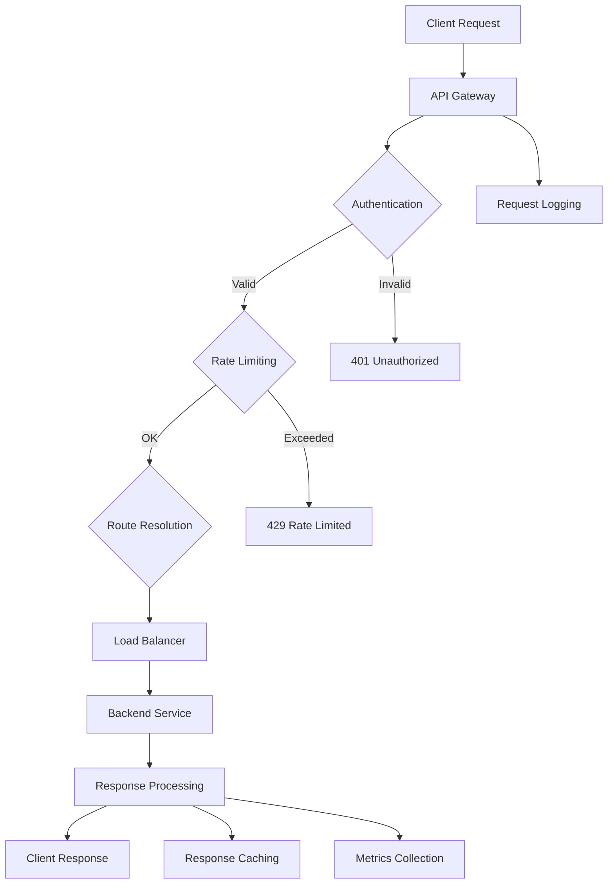

# 🌐 FC-039: API Gateway - TECH CONCEPT

**Feature-Code:** FC-039  
**Feature-Name:** API Gateway  
**Kategorie:** Infrastructure & API Management  
**Priorität:** HIGH  
**Geschätzter Aufwand:** 8 Tage  
**Status:** 📋 PLANNED - Tech Concept verfügbar  

---

## 🧠 CLAUDE WORKING SECTION (15-Min Context Chunk)

### ⚡ SOFORT STARTEN (2 Minuten):
```bash
# 1. API Gateway Backend Setup
cd backend/src/main/java/de/freshplan/infrastructure
mkdir gateway && cd gateway
touch APIGatewayFilter.java RequestRouter.java RateLimiter.java

# 2. Gateway Configuration
cd ../../../resources
touch gateway-routes.yml rate-limits.yml api-documentation.yml
```

### 📋 IMPLEMENTIERUNGS-CHECKLISTE:
- [ ] **Phase 1:** Request Routing & Load Balancing (Tag 1-2)
- [ ] **Phase 2:** Rate Limiting & Security Layer (Tag 3-4)  
- [ ] **Phase 3:** API Documentation & Versioning (Tag 5-6)
- [ ] **Phase 4:** Monitoring & Analytics (Tag 7-8)

---

## 🎯 FEATURE OVERVIEW

### Was ist API Gateway?
Zentraler Einstiegspunkt für alle API-Anfragen mit intelligenter Request-Routing, Rate Limiting, Authentifizierung, API-Versionierung und umfassendem Monitoring. Optimiert für Microservices-Architektur und Multi-Tenant-Umgebungen.

### Business Value
- **Unified API Interface** mit einheitlicher Dokumentation und Authentifizierung
- **Performance Optimization** durch Caching, Load Balancing und Request Aggregation
- **Security Enhancement** mit Rate Limiting, WAF und Request Validation
- **Developer Experience** durch Auto-Generated Documentation und SDK Support

### Erfolgsmetriken
- 99.9% API Verfügbarkeit mit < 10ms Gateway Latenz
- 50% reduzierte API Response Times durch intelligentes Caching
- 100% API Coverage mit automatischer Dokumentation
- 90% weniger Security-Incidents durch Gateway-Filter

---

## 🏗️ GATEWAY ARCHITECTURE

### Request Flow Design


### Gateway Core Service
```java
@ApplicationScoped
public class APIGatewayService {
    
    @Inject
    RouteResolver routeResolver;
    
    @Inject
    RateLimitService rateLimitService;
    
    @Inject
    LoadBalancerService loadBalancer;
    
    @Inject
    CacheService cacheService;
    
    @Inject
    MetricsCollector metricsCollector;
    
    public CompletionStage<APIResponse> processRequest(APIGatewayRequest request) {
        Timer.Sample sample = Timer.start();
        
        return CompletableFuture
            .supplyAsync(() -> validateAndAuthenticate(request))
            .thenCompose(authRequest -> checkRateLimit(authRequest))
            .thenCompose(rateLimitedRequest -> resolveRoute(rateLimitedRequest))
            .thenCompose(routedRequest -> checkCache(routedRequest))
            .thenCompose(cachedRequest -> forwardRequest(cachedRequest))
            .thenApply(response -> processResponse(response, request))
            .thenApply(response -> {
                // Record metrics
                sample.stop(Timer.builder("api.gateway.request.duration")
                    .tag("route", request.getRoute())
                    .tag("method", request.getMethod())
                    .tag("status", String.valueOf(response.getStatusCode()))
                    .register(metricsCollector.getMeterRegistry()));
                    
                return response;
            })
            .exceptionally(throwable -> handleError(throwable, request));
    }
    
    private APIGatewayRequest validateAndAuthenticate(APIGatewayRequest request) {
        // 1. Basic request validation
        validateRequestFormat(request);
        
        // 2. Extract and validate authentication
        AuthenticationContext authContext = extractAuthContext(request);
        validateAuthentication(authContext);
        
        // 3. Resolve tenant context
        TenantContext tenantContext = resolveTenantContext(request, authContext);
        
        return request.withAuthContext(authContext)
                     .withTenantContext(tenantContext);
    }
    
    private CompletionStage<APIGatewayRequest> checkRateLimit(APIGatewayRequest request) {
        String rateLimitKey = buildRateLimitKey(request);
        
        return rateLimitService.isAllowed(rateLimitKey, request.getTenantContext())
            .thenApply(allowed -> {
                if (!allowed) {
                    throw new RateLimitExceededException(
                        "Rate limit exceeded for: " + rateLimitKey
                    );
                }
                return request;
            });
    }
    
    private CompletionStage<APIGatewayRequest> resolveRoute(APIGatewayRequest request) {
        return CompletableFuture.supplyAsync(() -> {
            RouteConfig route = routeResolver.resolveRoute(
                request.getPath(), 
                request.getMethod(),
                request.getTenantContext()
            );
            
            if (route == null) {
                throw new RouteNotFoundException("No route found for: " + request.getPath());
            }
            
            return request.withRouteConfig(route);
        });
    }
    
    private CompletionStage<APIResponse> forwardRequest(APIGatewayRequest request) {
        RouteConfig route = request.getRouteConfig();
        
        // Select backend instance based on load balancing strategy
        ServiceInstance instance = loadBalancer.selectInstance(
            route.getServiceName(),
            request.getTenantContext()
        );
        
        // Transform request for backend
        BackendRequest backendRequest = transformRequest(request, instance);
        
        // Forward to backend service
        return httpClient.sendAsync(backendRequest)
            .thenApply(response -> transformResponse(response, request));
    }
    
    private BackendRequest transformRequest(APIGatewayRequest request, ServiceInstance instance) {
        return BackendRequest.builder()
            .url(buildBackendUrl(instance, request.getPath()))
            .method(request.getMethod())
            .headers(enhanceHeaders(request.getHeaders(), request.getTenantContext()))
            .body(request.getBody())
            .timeout(request.getRouteConfig().getTimeout())
            .build();
    }
    
    private Map<String, String> enhanceHeaders(Map<String, String> originalHeaders, TenantContext tenant) {
        Map<String, String> enhancedHeaders = new HashMap<>(originalHeaders);
        
        // Add tenant context
        enhancedHeaders.put("X-Tenant-ID", tenant.getTenantId().toString());
        enhancedHeaders.put("X-Tenant-Schema", tenant.getDatabaseSchema());
        
        // Add tracing headers
        enhancedHeaders.put("X-Request-ID", UUID.randomUUID().toString());
        enhancedHeaders.put("X-Gateway-Timestamp", Instant.now().toString());
        
        // Add service mesh headers
        enhancedHeaders.put("X-Forwarded-By", "freshplan-api-gateway");
        
        return enhancedHeaders;
    }
}
```

### Route Configuration System
```java
@ApplicationScoped
public class RouteResolver {
    
    @Inject
    @ConfigProperty(name = "gateway.routes.config.path", defaultValue = "gateway-routes.yml")
    String routeConfigPath;
    
    private volatile Map<String, RouteConfig> routes = new ConcurrentHashMap<>();
    private volatile long lastConfigReload = 0;
    
    @PostConstruct
    void loadRoutes() {
        reloadRoutesIfNeeded();
    }
    
    public RouteConfig resolveRoute(String path, String method, TenantContext tenant) {
        reloadRoutesIfNeeded();
        
        // 1. Exact path match
        String routeKey = method + ":" + path;
        RouteConfig exactMatch = routes.get(routeKey);
        if (exactMatch != null && isRouteAllowedForTenant(exactMatch, tenant)) {
            return exactMatch;
        }
        
        // 2. Pattern matching with path parameters
        return routes.values().stream()
            .filter(route -> matchesPattern(route, path, method))
            .filter(route -> isRouteAllowedForTenant(route, tenant))
            .findFirst()
            .orElse(null);
    }
    
    private boolean matchesPattern(RouteConfig route, String path, String method) {
        if (!route.getMethod().equals(method) && !route.getMethod().equals("*")) {
            return false;
        }
        
        // Support path patterns like /api/customers/{id}, /api/reports/*
        String pattern = route.getPath();
        
        // Convert route pattern to regex
        String regex = pattern
            .replaceAll("\\{[^}]+\\}", "[^/]+")  // {id} -> [^/]+
            .replaceAll("\\*\\*", ".*")          // ** -> .*
            .replaceAll("\\*", "[^/]*");         // * -> [^/]*
        
        return path.matches("^" + regex + "$");
    }
    
    private boolean isRouteAllowedForTenant(RouteConfig route, TenantContext tenant) {
        // Check subscription tier restrictions
        if (route.getRequiredSubscriptionTier() != null) {
            SubscriptionTier tenantTier = tenant.getSubscriptionTier();
            SubscriptionTier requiredTier = route.getRequiredSubscriptionTier();
            
            if (tenantTier.getPriority() < requiredTier.getPriority()) {
                return false;
            }
        }
        
        // Check feature flags
        if (route.getRequiredFeatureFlag() != null) {
            return tenant.getFeatureFlags().contains(route.getRequiredFeatureFlag());
        }
        
        return true;
    }
    
    @Scheduled(every = "30s")
    void reloadRoutesIfNeeded() {
        try {
            Path configFile = Paths.get(routeConfigPath);
            if (!Files.exists(configFile)) {
                Log.warn("Route config file not found: " + routeConfigPath);
                return;
            }
            
            long lastModified = Files.getLastModifiedTime(configFile).toMillis();
            if (lastModified > lastConfigReload) {
                loadRouteConfiguration(configFile);
                lastConfigReload = lastModified;
                Log.info("Reloaded route configuration");
            }
        } catch (Exception e) {
            Log.error("Failed to reload route configuration", e);
        }
    }
    
    private void loadRouteConfiguration(Path configFile) throws IOException {
        ObjectMapper mapper = new ObjectMapper(new YAMLFactory());
        RouteConfiguration config = mapper.readValue(configFile.toFile(), RouteConfiguration.class);
        
        Map<String, RouteConfig> newRoutes = new ConcurrentHashMap<>();
        
        for (RouteConfig route : config.getRoutes()) {
            String key = route.getMethod() + ":" + route.getPath();
            newRoutes.put(key, route);
            
            Log.debug("Loaded route: {} -> {}", key, route.getServiceName());
        }
        
        this.routes = newRoutes;
    }
}
```

### Route Configuration YAML
```yaml
# gateway-routes.yml
routes:
  # Customer API Routes
  - path: "/api/customers"
    method: "GET"
    serviceName: "customer-service"
    loadBalancingStrategy: "ROUND_ROBIN"
    timeout: 5000
    cache:
      enabled: true
      ttl: 300 # 5 minutes
    rateLimiting:
      requestsPerMinute: 1000
      burstSize: 100
    
  - path: "/api/customers/{id}"
    method: "GET"
    serviceName: "customer-service"
    loadBalancingStrategy: "ROUND_ROBIN"
    timeout: 3000
    cache:
      enabled: true
      ttl: 600
      varyBy: ["tenant", "userId"]
    
  - path: "/api/customers"
    method: "POST"
    serviceName: "customer-service"
    timeout: 10000
    rateLimiting:
      requestsPerMinute: 100
    validation:
      requestBodySchema: "customer-create-schema.json"
    
  # Advanced Features (Premium Only)
  - path: "/api/reports/advanced"
    method: "GET"
    serviceName: "reporting-service"
    requiredSubscriptionTier: "PREMIUM"
    requiredFeatureFlag: "ADVANCED_REPORTING"
    timeout: 30000
    rateLimiting:
      requestsPerMinute: 50
    
  # Analytics API (Enterprise Only)
  - path: "/api/analytics/**"
    method: "*"
    serviceName: "analytics-service"
    requiredSubscriptionTier: "ENTERPRISE"
    timeout: 15000
    rateLimiting:
      requestsPerMinute: 200
    
  # File Upload Handling
  - path: "/api/files/upload"
    method: "POST"
    serviceName: "file-service"
    timeout: 60000
    maxRequestSize: "50MB"
    rateLimiting:
      requestsPerMinute: 20
    
  # WebSocket Routes
  - path: "/ws/notifications"
    method: "UPGRADE"
    serviceName: "notification-service"
    protocol: "websocket"
    timeout: 300000 # 5 minutes for WebSocket
    
serviceInstances:
  customer-service:
    - url: "http://customer-service-1:8080"
      weight: 1
      healthCheck: "/health"
    - url: "http://customer-service-2:8080"
      weight: 1
      healthCheck: "/health"
      
  reporting-service:
    - url: "http://reporting-service-1:8080"
      weight: 2
      healthCheck: "/health"
    - url: "http://reporting-service-2:8080"
      weight: 1
      healthCheck: "/health"
      
  analytics-service:
    - url: "http://analytics-service:8080"
      weight: 1
      healthCheck: "/health"
      
  file-service:
    - url: "http://file-service:8080"
      weight: 1
      healthCheck: "/health"
      
  notification-service:
    - url: "http://notification-service:8080"
      weight: 1
      healthCheck: "/health"

globalSettings:
  defaultTimeout: 5000
  maxRequestSize: "10MB"
  enableCors: true
  corsAllowedOrigins: ["https://*.freshplan.app", "http://localhost:5173"]
  corsAllowedMethods: ["GET", "POST", "PUT", "DELETE", "OPTIONS"]
  corsAllowedHeaders: ["Content-Type", "Authorization", "X-Tenant-ID"]
```

---

## 🔒 RATE LIMITING & SECURITY

### Advanced Rate Limiting
```java
@ApplicationScoped
public class RateLimitService {
    
    @Inject
    RedisTemplate<String, String> redisTemplate;
    
    @Inject
    MeterRegistry meterRegistry;
    
    private final Counter rateLimitCounter = Counter.builder("api.gateway.rate.limit.exceeded")
        .register(meterRegistry);
    
    public CompletionStage<Boolean> isAllowed(String key, TenantContext tenant) {
        return CompletableFuture.supplyAsync(() -> {
            try {
                RateLimitConfig config = getRateLimitConfig(key, tenant);
                return checkRateLimit(key, config);
            } catch (Exception e) {
                Log.error("Rate limit check failed for key: " + key, e);
                // Fail open - allow request when rate limiting fails
                return true;
            }
        });
    }
    
    private RateLimitConfig getRateLimitConfig(String key, TenantContext tenant) {
        // Tenant-specific rate limits based on subscription tier
        switch (tenant.getSubscriptionTier()) {
            case ENTERPRISE:
                return RateLimitConfig.builder()
                    .requestsPerMinute(5000)
                    .burstSize(1000)
                    .windowSizeMs(60000)
                    .build();
                    
            case PREMIUM:
                return RateLimitConfig.builder()
                    .requestsPerMinute(2000)
                    .burstSize(500)
                    .windowSizeMs(60000)
                    .build();
                    
            case BASIC:
            default:
                return RateLimitConfig.builder()
                    .requestsPerMinute(1000)
                    .burstSize(200)
                    .windowSizeMs(60000)
                    .build();
        }
    }
    
    private boolean checkRateLimit(String key, RateLimitConfig config) {
        String redisKey = "rate_limit:" + key;
        long currentTime = System.currentTimeMillis();
        long windowStart = currentTime - config.getWindowSizeMs();
        
        // Sliding window log implementation
        return redisTemplate.execute(connection -> {
            // Remove expired entries
            connection.zRemRangeByScore(redisKey.getBytes(), 0, windowStart);
            
            // Count current requests in window
            Long currentCount = connection.zCard(redisKey.getBytes());
            
            if (currentCount != null && currentCount >= config.getRequestsPerMinute()) {
                rateLimitCounter.increment(Tags.of("key", key));
                return false;
            }
            
            // Add current request
            connection.zAdd(redisKey.getBytes(), currentTime, UUID.randomUUID().toString().getBytes());
            
            // Set expiration
            connection.expire(redisKey.getBytes(), (int) (config.getWindowSizeMs() / 1000) + 60);
            
            return true;
        });
    }
    
    public RateLimitStatus getRateLimitStatus(String key, TenantContext tenant) {
        RateLimitConfig config = getRateLimitConfig(key, tenant);
        String redisKey = "rate_limit:" + key;
        long currentTime = System.currentTimeMillis();
        long windowStart = currentTime - config.getWindowSizeMs();
        
        Long currentCount = redisTemplate.opsForZSet().count(redisKey, windowStart, currentTime);
        long remaining = Math.max(0, config.getRequestsPerMinute() - (currentCount != null ? currentCount : 0));
        
        return RateLimitStatus.builder()
            .limit(config.getRequestsPerMinute())
            .remaining(remaining)
            .resetTime(currentTime + config.getWindowSizeMs())
            .build();
    }
}
```

### Request Validation & Security Filters
```java
@ApplicationScoped
public class SecurityFilterChain {
    
    @Inject
    WAFService wafService;
    
    @Inject
    RequestValidationService validationService;
    
    public CompletionStage<APIGatewayRequest> applySecurityFilters(APIGatewayRequest request) {
        return CompletableFuture
            .supplyAsync(() -> applyWAFFilters(request))
            .thenApply(this::validateRequestStructure)
            .thenApply(this::sanitizeInput)
            .thenApply(this::validateContentType)
            .thenApply(this::checkRequestSize);
    }
    
    private APIGatewayRequest applyWAFFilters(APIGatewayRequest request) {
        // Web Application Firewall checks
        
        // 1. SQL Injection detection
        if (containsSQLInjection(request.getBody()) || containsSQLInjection(request.getQueryParams())) {
            throw new SecurityException("Potential SQL injection detected");
        }
        
        // 2. XSS detection
        if (containsXSS(request.getBody()) || containsXSS(request.getQueryParams())) {
            throw new SecurityException("Potential XSS attack detected");
        }
        
        // 3. Path traversal detection
        if (containsPathTraversal(request.getPath())) {
            throw new SecurityException("Path traversal attempt detected");
        }
        
        // 4. Rate limiting anomaly detection
        if (wafService.detectAnomalousTraffic(request)) {
            throw new SecurityException("Anomalous traffic pattern detected");
        }
        
        return request;
    }
    
    private APIGatewayRequest validateRequestStructure(APIGatewayRequest request) {
        RouteConfig route = request.getRouteConfig();
        
        if (route.getValidation() != null) {
            ValidationConfig validation = route.getValidation();
            
            // Validate request body against JSON schema
            if (validation.getRequestBodySchema() != null && request.getBody() != null) {
                validationService.validateJSON(request.getBody(), validation.getRequestBodySchema());
            }
            
            // Validate query parameters
            if (validation.getQueryParameterRules() != null) {
                validationService.validateQueryParams(
                    request.getQueryParams(), 
                    validation.getQueryParameterRules()
                );
            }
            
            // Validate headers
            if (validation.getRequiredHeaders() != null) {
                validationService.validateHeaders(
                    request.getHeaders(), 
                    validation.getRequiredHeaders()
                );
            }
        }
        
        return request;
    }
    
    private APIGatewayRequest sanitizeInput(APIGatewayRequest request) {
        // Sanitize query parameters
        Map<String, String> sanitizedParams = request.getQueryParams().entrySet().stream()
            .collect(Collectors.toMap(
                entry -> sanitizeString(entry.getKey()),
                entry -> sanitizeString(entry.getValue())
            ));
        
        // Sanitize headers (selective sanitization)
        Map<String, String> sanitizedHeaders = request.getHeaders().entrySet().stream()
            .filter(entry -> isAllowedHeader(entry.getKey()))
            .collect(Collectors.toMap(
                Map.Entry::getKey,
                entry -> sanitizeHeaderValue(entry.getValue())
            ));
        
        return request.withQueryParams(sanitizedParams)
                     .withHeaders(sanitizedHeaders);
    }
    
    private String sanitizeString(String input) {
        if (input == null) return null;
        
        return input
            .replaceAll("<script[^>]*>.*?</script>", "") // Remove script tags
            .replaceAll("<[^>]+>", "")                    // Remove HTML tags
            .replaceAll("[\r\n\t]", " ")                  // Replace control chars
            .trim();
    }
    
    private boolean containsSQLInjection(String input) {
        if (input == null) return false;
        
        String lowerInput = input.toLowerCase();
        List<String> sqlKeywords = List.of(
            "union select", "drop table", "delete from", "insert into",
            "update set", "exec(", "execute(", "sp_", "xp_",
            "' or '1'='1", "\" or \"1\"=\"1", "'; drop", "\"; drop"
        );
        
        return sqlKeywords.stream().anyMatch(lowerInput::contains);
    }
    
    private boolean containsXSS(String input) {
        if (input == null) return false;
        
        String lowerInput = input.toLowerCase();
        List<String> xssPatterns = List.of(
            "<script", "javascript:", "onload=", "onerror=", 
            "onclick=", "onmouseover=", "onfocus=", "onblur=",
            "eval(", "expression(", "vbscript:", "data:text/html"
        );
        
        return xssPatterns.stream().anyMatch(lowerInput::contains);
    }
}
```

---

## 📊 API DOCUMENTATION & VERSIONING

### Auto-Generated API Documentation
```java
@ApplicationScoped
public class APIDocumentationGenerator {
    
    @Inject
    RouteResolver routeResolver;
    
    @Inject
    SchemaRegistry schemaRegistry;
    
    public OpenAPISpec generateOpenAPISpec(TenantContext tenant) {
        OpenAPISpec.Builder specBuilder = OpenAPISpec.builder()
            .info(APIInfo.builder()
                .title("FreshPlan Sales Tool API")
                .version("2.0.0")
                .description("Comprehensive Sales Management API")
                .termsOfService("https://freshplan.app/terms")
                .contact(Contact.builder()
                    .name("FreshPlan Support")
                    .email("support@freshplan.app")
                    .url("https://freshplan.app/support")
                    .build())
                .license(License.builder()
                    .name("Commercial License")
                    .url("https://freshplan.app/license")
                    .build())
                .build())
            .servers(List.of(
                Server.builder()
                    .url("https://" + tenant.getSubdomain() + ".freshplan.app")
                    .description("Production API")
                    .build(),
                Server.builder()
                    .url("https://staging-" + tenant.getSubdomain() + ".freshplan.app")
                    .description("Staging API")
                    .build()
            ));
        
        // Generate paths from route configuration
        Map<String, PathItem> paths = generatePaths(tenant);
        specBuilder.paths(paths);
        
        // Generate components (schemas, security schemes)
        Components components = generateComponents(tenant);
        specBuilder.components(components);
        
        return specBuilder.build();
    }
    
    private Map<String, PathItem> generatePaths(TenantContext tenant) {
        Map<String, PathItem> paths = new HashMap<>();
        
        List<RouteConfig> allowedRoutes = routeResolver.getAllowedRoutes(tenant);
        
        for (RouteConfig route : allowedRoutes) {
            String path = convertPathToOpenAPI(route.getPath());
            PathItem pathItem = paths.computeIfAbsent(path, k -> new PathItem());
            
            Operation operation = generateOperation(route, tenant);
            
            switch (route.getMethod().toUpperCase()) {
                case "GET":
                    pathItem.setGet(operation);
                    break;
                case "POST":
                    pathItem.setPost(operation);
                    break;
                case "PUT":
                    pathItem.setPut(operation);
                    break;
                case "DELETE":
                    pathItem.setDelete(operation);
                    break;
                case "PATCH":
                    pathItem.setPatch(operation);
                    break;
            }
            
            paths.put(path, pathItem);
        }
        
        return paths;
    }
    
    private Operation generateOperation(RouteConfig route, TenantContext tenant) {
        Operation.Builder operationBuilder = Operation.builder()
            .operationId(generateOperationId(route))
            .summary(generateSummary(route))
            .description(generateDescription(route))
            .tags(List.of(extractServiceTag(route.getServiceName())));
        
        // Add parameters
        List<Parameter> parameters = generateParameters(route);
        if (!parameters.isEmpty()) {
            operationBuilder.parameters(parameters);
        }
        
        // Add request body
        if (hasRequestBody(route)) {
            RequestBody requestBody = generateRequestBody(route);
            operationBuilder.requestBody(requestBody);
        }
        
        // Add responses
        Map<String, Response> responses = generateResponses(route);
        operationBuilder.responses(responses);
        
        // Add security requirements
        List<SecurityRequirement> security = generateSecurityRequirements(route, tenant);
        operationBuilder.security(security);
        
        return operationBuilder.build();
    }
    
    private String convertPathToOpenAPI(String routePath) {
        // Convert /api/customers/{id} to OpenAPI format
        return routePath.replaceAll("\\{([^}]+)\\}", "{$1}");
    }
    
    private List<Parameter> generateParameters(RouteConfig route) {
        List<Parameter> parameters = new ArrayList<>();
        
        // Extract path parameters
        Pattern pathParamPattern = Pattern.compile("\\{([^}]+)\\}");
        Matcher matcher = pathParamPattern.matcher(route.getPath());
        
        while (matcher.find()) {
            String paramName = matcher.group(1);
            parameters.add(Parameter.builder()
                .name(paramName)
                .in("path")
                .required(true)
                .schema(Schema.builder().type("string").build())
                .description("Resource identifier")
                .build());
        }
        
        // Add common query parameters
        if (route.getMethod().equals("GET") && route.getPath().endsWith("s")) {
            // Collection endpoints get pagination parameters
            parameters.addAll(List.of(
                Parameter.builder()
                    .name("page")
                    .in("query")
                    .required(false)
                    .schema(Schema.builder().type("integer").minimum(0).defaultValue(0).build())
                    .description("Page number for pagination")
                    .build(),
                Parameter.builder()
                    .name("size")
                    .in("query")
                    .required(false)
                    .schema(Schema.builder().type("integer").minimum(1).maximum(1000).defaultValue(20).build())
                    .description("Number of items per page")
                    .build(),
                Parameter.builder()
                    .name("sort")
                    .in("query")
                    .required(false)
                    .schema(Schema.builder().type("string").build())
                    .description("Sort criteria (e.g., 'name,asc' or 'createdAt,desc')")
                    .build()
            ));
        }
        
        return parameters;
    }
}
```

### API Versioning Strategy
```java
@ApplicationScoped
public class APIVersioningService {
    
    @Inject
    RouteResolver routeResolver;
    
    public RouteConfig resolveVersionedRoute(APIGatewayRequest request) {
        APIVersion requestedVersion = extractAPIVersion(request);
        
        // Try exact version match first
        RouteConfig exactMatch = routeResolver.resolveRoute(
            buildVersionedPath(request.getPath(), requestedVersion),
            request.getMethod(),
            request.getTenantContext()
        );
        
        if (exactMatch != null) {
            return exactMatch;
        }
        
        // Fall back to compatible version
        APIVersion compatibleVersion = findCompatibleVersion(
            requestedVersion, 
            request.getPath(), 
            request.getMethod()
        );
        
        if (compatibleVersion != null) {
            return routeResolver.resolveRoute(
                buildVersionedPath(request.getPath(), compatibleVersion),
                request.getMethod(),
                request.getTenantContext()
            );
        }
        
        throw new UnsupportedAPIVersionException(
            "No compatible API version found for: " + requestedVersion
        );
    }
    
    private APIVersion extractAPIVersion(APIGatewayRequest request) {
        // 1. Header-based versioning (preferred)
        String versionHeader = request.getHeaders().get("API-Version");
        if (versionHeader != null) {
            return APIVersion.parse(versionHeader);
        }
        
        // 2. Accept header versioning
        String acceptHeader = request.getHeaders().get("Accept");
        if (acceptHeader != null) {
            Pattern versionPattern = Pattern.compile("application/vnd\\.freshplan\\.v(\\d+)\\+json");
            Matcher matcher = versionPattern.matcher(acceptHeader);
            if (matcher.find()) {
                return APIVersion.fromMajor(Integer.parseInt(matcher.group(1)));
            }
        }
        
        // 3. URL path versioning
        if (request.getPath().startsWith("/api/v")) {
            Pattern pathPattern = Pattern.compile("/api/v(\\d+)/");
            Matcher matcher = pathPattern.matcher(request.getPath());
            if (matcher.find()) {
                return APIVersion.fromMajor(Integer.parseInt(matcher.group(1)));
            }
        }
        
        // 4. Default to latest version
        return APIVersion.LATEST;
    }
    
    private APIVersion findCompatibleVersion(APIVersion requested, String path, String method) {
        List<APIVersion> availableVersions = getAvailableVersions(path, method);
        
        // Find the highest version that's compatible with the requested version
        return availableVersions.stream()
            .filter(version -> isCompatible(requested, version))
            .max(APIVersion::compareTo)
            .orElse(null);
    }
    
    private boolean isCompatible(APIVersion requested, APIVersion available) {
        // Semantic versioning compatibility rules
        if (requested.getMajor() != available.getMajor()) {
            return false; // Major version changes are breaking
        }
        
        // Minor version should be backward compatible
        return available.getMinor() >= requested.getMinor();
    }
}
```

---

## 📈 MONITORING & ANALYTICS

### Gateway Metrics Collection
```java
@ApplicationScoped
public class GatewayMetricsCollector {
    
    @Inject
    MeterRegistry meterRegistry;
    
    private final Timer requestDuration;
    private final Counter requestCount;
    private final Counter errorCount;
    private final Gauge activeConnections;
    private final DistributionSummary requestSize;
    private final DistributionSummary responseSize;
    
    public GatewayMetricsCollector() {
        this.requestDuration = Timer.builder("gateway.request.duration")
            .description("Request processing time")
            .register(meterRegistry);
            
        this.requestCount = Counter.builder("gateway.requests.total")
            .description("Total number of requests")
            .register(meterRegistry);
            
        this.errorCount = Counter.builder("gateway.errors.total")
            .description("Total number of errors")
            .register(meterRegistry);
            
        this.activeConnections = Gauge.builder("gateway.connections.active")
            .description("Number of active connections")
            .register(meterRegistry, this, GatewayMetricsCollector::getActiveConnectionCount);
            
        this.requestSize = DistributionSummary.builder("gateway.request.size.bytes")
            .description("Request size in bytes")
            .register(meterRegistry);
            
        this.responseSize = DistributionSummary.builder("gateway.response.size.bytes")
            .description("Response size in bytes")
            .register(meterRegistry);
    }
    
    public Timer.Sample startRequestTimer(String route, String method, String tenant) {
        Tags tags = Tags.of(
            "route", route,
            "method", method,
            "tenant", tenant
        );
        
        requestCount.increment(tags);
        return Timer.start(meterRegistry);
    }
    
    public void recordRequestCompletion(
        Timer.Sample sample, 
        String route, 
        String method, 
        String tenant,
        int statusCode,
        long requestSizeBytes,
        long responseSizeBytes
    ) {
        Tags tags = Tags.of(
            "route", route,
            "method", method,
            "tenant", tenant,
            "status", String.valueOf(statusCode),
            "status_class", getStatusClass(statusCode)
        );
        
        sample.stop(requestDuration.tag("route", route)
                                  .tag("method", method)
                                  .tag("tenant", tenant)
                                  .tag("status", String.valueOf(statusCode)));
        
        requestSize.record(requestSizeBytes);
        responseSize.record(responseSizeBytes);
        
        if (statusCode >= 400) {
            errorCount.increment(tags.and("error_type", getErrorType(statusCode)));
        }
    }
    
    public void recordCacheMetrics(String route, boolean hit, long executionTimeMs) {
        Tags tags = Tags.of(
            "route", route,
            "result", hit ? "hit" : "miss"
        );
        
        Counter.builder("gateway.cache.requests")
            .tags(tags)
            .register(meterRegistry)
            .increment();
            
        Timer.builder("gateway.cache.execution.time")
            .tags(tags)
            .register(meterRegistry)
            .record(executionTimeMs, TimeUnit.MILLISECONDS);
    }
    
    @Scheduled(every = "30s")
    public void recordPeriodicMetrics() {
        // Record tenant-specific metrics
        Map<String, TenantMetrics> tenantMetrics = calculateTenantMetrics();
        
        for (Map.Entry<String, TenantMetrics> entry : tenantMetrics.entrySet()) {
            String tenant = entry.getKey();
            TenantMetrics metrics = entry.getValue();
            
            Gauge.builder("gateway.tenant.requests.rate")
                .tag("tenant", tenant)
                .register(meterRegistry, metrics, TenantMetrics::getRequestRate);
                
            Gauge.builder("gateway.tenant.avg.response.time")
                .tag("tenant", tenant)
                .register(meterRegistry, metrics, TenantMetrics::getAverageResponseTime);
                
            Gauge.builder("gateway.tenant.error.rate")
                .tag("tenant", tenant)
                .register(meterRegistry, metrics, TenantMetrics::getErrorRate);
        }
    }
    
    private String getStatusClass(int statusCode) {
        if (statusCode < 200) return "1xx";
        if (statusCode < 300) return "2xx";
        if (statusCode < 400) return "3xx";
        if (statusCode < 500) return "4xx";
        return "5xx";
    }
    
    private String getErrorType(int statusCode) {
        switch (statusCode) {
            case 400: return "bad_request";
            case 401: return "unauthorized";
            case 403: return "forbidden";
            case 404: return "not_found";
            case 429: return "rate_limited";
            case 500: return "internal_error";
            case 502: return "bad_gateway";
            case 503: return "service_unavailable";
            case 504: return "gateway_timeout";
            default: return "unknown";
        }
    }
}
```

### Real-time Dashboard Integration
```typescript
export const GatewayDashboard: React.FC = () => {
  const [metrics, setMetrics] = useState<GatewayMetrics | null>(null);
  const [isLoading, setIsLoading] = useState(true);
  
  useEffect(() => {
    const interval = setInterval(fetchMetrics, 5000); // Update every 5 seconds
    fetchMetrics(); // Initial fetch
    
    return () => clearInterval(interval);
  }, []);
  
  const fetchMetrics = async () => {
    try {
      const data = await gatewayApi.getMetrics();
      setMetrics(data);
    } catch (error) {
      console.error('Failed to fetch gateway metrics', error);
    } finally {
      setIsLoading(false);
    }
  };
  
  if (isLoading) {
    return <GatewayDashboardSkeleton />;
  }
  
  return (
    <Container maxWidth="xl" sx={{ py: 3 }}>
      <Typography 
        variant="h4" 
        fontFamily="Antonio Bold" 
        gutterBottom
        sx={{ color: '#004F7B' }}
      >
        API Gateway Dashboard
      </Typography>
      
      <Grid container spacing={3}>
        {/* Overview Metrics */}
        <Grid item xs={12} md={3}>
          <MetricCard
            title="Requests/Min"
            value={metrics?.requestsPerMinute || 0}
            trend={metrics?.requestsTrend}
            icon={<SpeedIcon />}
            color="#94C456"
          />
        </Grid>
        
        <Grid item xs={12} md={3}>
          <MetricCard
            title="Avg Response Time"
            value={`${metrics?.averageResponseTime || 0}ms`}
            trend={metrics?.responseTimeTrend}
            icon={<TimerIcon />}
            color="#004F7B"
          />
        </Grid>
        
        <Grid item xs={12} md={3}>
          <MetricCard
            title="Error Rate"
            value={`${metrics?.errorRate || 0}%`}
            trend={metrics?.errorRateTrend}
            icon={<ErrorIcon />}
            color={metrics?.errorRate > 5 ? "#FF5722" : "#94C456"}
          />
        </Grid>
        
        <Grid item xs={12} md={3}>
          <MetricCard
            title="Active Connections"
            value={metrics?.activeConnections || 0}
            icon={<NetworkCheckIcon />}
            color="#FFA726"
          />
        </Grid>
        
        {/* Request Distribution Chart */}
        <Grid item xs={12} md={8}>
          <Card>
            <CardHeader title="Request Distribution by Route" />
            <CardContent>
              <ResponsiveContainer width="100%" height={300}>
                <BarChart data={metrics?.routeDistribution || []}>
                  <CartesianGrid strokeDasharray="3 3" />
                  <XAxis dataKey="route" />
                  <YAxis />
                  <Tooltip />
                  <Bar dataKey="requests" fill="#94C456" />
                </BarChart>
              </ResponsiveContainer>
            </CardContent>
          </Card>
        </Grid>
        
        {/* Response Time Trend */}
        <Grid item xs={12} md={4}>
          <Card>
            <CardHeader title="Response Time Trend" />
            <CardContent>
              <ResponsiveContainer width="100%" height={300}>
                <LineChart data={metrics?.responseTimeTrend || []}>
                  <CartesianGrid strokeDasharray="3 3" />
                  <XAxis dataKey="timestamp" />
                  <YAxis />
                  <Tooltip />
                  <Line 
                    type="monotone" 
                    dataKey="responseTime" 
                    stroke="#004F7B" 
                    strokeWidth={2}
                  />
                </LineChart>
              </ResponsiveContainer>
            </CardContent>
          </Card>
        </Grid>
        
        {/* Top Tenants by Traffic */}
        <Grid item xs={12} md={6}>
          <Card>
            <CardHeader title="Top Tenants by Traffic" />
            <CardContent>
              <List>
                {(metrics?.topTenants || []).map((tenant, index) => (
                  <ListItem key={tenant.id}>
                    <ListItemIcon>
                      <Chip 
                        label={index + 1} 
                        size="small" 
                        sx={{ 
                          bgcolor: index < 3 ? '#94C456' : '#e0e0e0',
                          color: index < 3 ? 'white' : 'inherit'
                        }}
                      />
                    </ListItemIcon>
                    <ListItemText
                      primary={tenant.name}
                      secondary={`${tenant.requestsPerMinute} req/min • ${tenant.errorRate}% errors`}
                    />
                    <ListItemSecondaryAction>
                      <Chip
                        label={tenant.subscriptionTier}
                        size="small"
                        color={tenant.subscriptionTier === 'ENTERPRISE' ? 'primary' : 'default'}
                      />
                    </ListItemSecondaryAction>
                  </ListItem>
                ))}
              </List>
            </CardContent>
          </Card>
        </Grid>
        
        {/* Rate Limit Status */}
        <Grid item xs={12} md={6}>
          <Card>
            <CardHeader title="Rate Limit Status" />
            <CardContent>
              <List>
                {(metrics?.rateLimitStatus || []).map((status) => (
                  <ListItem key={status.endpoint}>
                    <ListItemText
                      primary={status.endpoint}
                      secondary={
                        <Box sx={{ display: 'flex', alignItems: 'center', mt: 1 }}>
                          <LinearProgress
                            variant="determinate"
                            value={(status.used / status.limit) * 100}
                            sx={{ 
                              flexGrow: 1, 
                              mr: 1,
                              bgcolor: 'grey.200',
                              '& .MuiLinearProgress-bar': {
                                bgcolor: status.used / status.limit > 0.8 ? '#FF5722' : '#94C456'
                              }
                            }}
                          />
                          <Typography variant="body2" color="text.secondary">
                            {status.used}/{status.limit}
                          </Typography>
                        </Box>
                      }
                    />
                  </ListItem>
                ))}
              </List>
            </CardContent>
          </Card>
        </Grid>
      </Grid>
    </Container>
  );
};
```

---

## 🔗 NAVIGATION & DEPENDENCIES

### 🧭 VOLLSTÄNDIGE FEATURE-NAVIGATION (40 Features)

#### 🟢 ACTIVE Features (9)
- [FC-008 Security Foundation](/docs/features/ACTIVE/01_security_foundation/FC-008_KOMPAKT.md)
- [M4 Opportunity Pipeline](/docs/features/ACTIVE/02_opportunity_pipeline/M4_KOMPAKT.md)
- [M8 Calculator Modal](/docs/features/ACTIVE/03_calculator_modal/M8_KOMPAKT.md)
- [FC-009 Permissions System](/docs/features/ACTIVE/04_permissions_system/FC-009_KOMPAKT.md)
- [M1 Navigation](/docs/features/ACTIVE/05_ui_foundation/M1_NAVIGATION_KOMPAKT.md)
- [M2 Quick Create](/docs/features/ACTIVE/05_ui_foundation/M2_QUICK_CREATE_KOMPAKT.md)
- [M3 Sales Cockpit](/docs/features/ACTIVE/05_ui_foundation/M3_SALES_COCKPIT_KOMPAKT.md)
- [M7 Settings](/docs/features/ACTIVE/05_ui_foundation/M7_SETTINGS_KOMPAKT.md)

#### 🔵 PLANNED Features (31)
- [FC-003 E-Mail Integration](/docs/features/PLANNED/06_email_integration/FC-003_TECH_CONCEPT.md)
- [FC-004 Verkäuferschutz](/docs/features/PLANNED/07_verkaeuferschutz/FC-004_TECH_CONCEPT.md)
- [FC-005 Xentral Integration](/docs/features/PLANNED/08_xentral_integration/FC-005_KOMPAKT.md)
- [FC-006 Mobile App](/docs/features/PLANNED/09_mobile_app/FC-006_TECH_CONCEPT.md)
- [FC-007 Chef-Dashboard](/docs/features/PLANNED/10_chef_dashboard/FC-007_TECH_CONCEPT.md)
- [FC-010 Customer Import](/docs/features/PLANNED/11_customer_import/FC-010_TECH_CONCEPT.md)
- [M5 Customer Refactor](/docs/features/PLANNED/12_customer_refactor_m5/M5_KOMPAKT.md)
- [M6 Analytics Module](/docs/features/PLANNED/13_analytics_m6/M6_KOMPAKT.md)
- [FC-012 Team Communication](/docs/features/PLANNED/14_team_communication/FC-012_KOMPAKT.md)
- [FC-013 Duplicate Detection](/docs/features/PLANNED/15_duplicate_detection/FC-013_KOMPAKT.md)
- [FC-014 Activity Timeline](/docs/features/PLANNED/16_activity_timeline/FC-014_KOMPAKT.md)
- [FC-015 Deal Loss Analysis](/docs/features/PLANNED/17_deal_loss_analysis/FC-015_KOMPAKT.md)
- [FC-016 Opportunity Cloning](/docs/features/PLANNED/18_opportunity_cloning/FC-016_KOMPAKT.md)
- [FC-017 Sales Gamification](/docs/features/PLANNED/99_sales_gamification/FC-017_KOMPAKT.md)
- [FC-018 Mobile PWA](/docs/features/PLANNED/09_mobile_app/FC-018_MOBILE_FIELD_SALES.md)
- [FC-019 Advanced Sales Metrics](/docs/features/PLANNED/19_advanced_metrics/FC-019_KOMPAKT.md)
- [FC-020 Quick Wins](/docs/features/PLANNED/20_quick_wins/FC-020_TECH_CONCEPT.md)
- [FC-021 Integration Hub](/docs/features/PLANNED/21_integration_hub/FC-021_TECH_CONCEPT.md)
- [FC-022 Mobile Light](/docs/features/PLANNED/22_mobile_light/FC-022_KOMPAKT.md)
- [FC-023 Event Sourcing](/docs/features/PLANNED/23_event_sourcing/FC-023_TECH_CONCEPT.md)
- [FC-024 File Management](/docs/features/PLANNED/24_file_management/FC-024_TECH_CONCEPT.md)
- [FC-025 DSGVO Compliance](/docs/features/PLANNED/25_dsgvo_compliance/FC-025_TECH_CONCEPT.md)
- [FC-026 Analytics Platform](/docs/features/PLANNED/26_analytics_platform/FC-026_TECH_CONCEPT.md)
- [FC-027 Magic Moments](/docs/features/PLANNED/27_magic_moments/FC-027_KOMPAKT.md)
- [FC-028 WhatsApp Business](/docs/features/PLANNED/28_whatsapp_integration/FC-028_KOMPAKT.md)
- [FC-029 Voice-First Interface](/docs/features/PLANNED/29_voice_first/FC-029_TECH_CONCEPT.md)
- [FC-030 One-Tap Actions](/docs/features/PLANNED/30_one_tap_actions/FC-030_TECH_CONCEPT.md)
- [FC-031 Smart Templates](/docs/features/PLANNED/31_smart_templates/FC-031_TECH_CONCEPT.md)
- [FC-032 Offline-First](/docs/features/PLANNED/32_offline_first/FC-032_TECH_CONCEPT.md)
- [FC-033 Visual Customer Cards](/docs/features/PLANNED/33_visual_cards/FC-033_TECH_CONCEPT.md)
- [FC-034 Instant Insights](/docs/features/PLANNED/34_instant_insights/FC-034_TECH_CONCEPT.md)
- [FC-035 Social Selling Helper](/docs/features/PLANNED/35_social_selling/FC-035_TECH_CONCEPT.md)
- [FC-036 Beziehungsmanagement](/docs/features/PLANNED/36_relationship_mgmt/FC-036_TECH_CONCEPT.md)
- [FC-037 Advanced Reporting Engine](/docs/features/PLANNED/37_advanced_reporting/FC-037_TECH_CONCEPT.md)
- [FC-038 Multi-Tenant Architecture](/docs/features/PLANNED/38_multitenant/FC-038_TECH_CONCEPT.md)
- **→ FC-039 API Gateway** ← **SIE SIND HIER**
- [FC-040 Performance Monitoring](#) ← **LETZTES TECH CONCEPT SESSION 15**

### 📋 ABHÄNGIGKEITEN
- **Benötigt:** FC-008 Security Foundation (Authentication Layer)
- **Ergänzt:** FC-038 Multi-Tenant Architecture (Tenant-aware Routing)
- **Ermöglicht:** Skalierbare Microservices-Architektur mit zentralem Management

### 🔒 SECURITY & AUTHORIZATION
- **WAF Integration:** Web Application Firewall mit SQL Injection & XSS Schutz
- **Rate Limiting:** Tenant-basierte Rate Limits mit Redis Sliding Window
- **Request Validation:** JSON Schema Validation und Input Sanitization
- **API Versioning:** Semantic Versioning mit Backward Compatibility

### 🚀 DEPLOYMENT STRATEGY
```yaml
# Phase 1 (Tag 1-2): Core Gateway
- Request Routing Service
- Basic Load Balancing
- Authentication Integration

# Phase 2 (Tag 3-4): Security Layer
- Rate Limiting Implementation
- WAF Filters
- Request Validation

# Phase 3 (Tag 5-6): Documentation
- OpenAPI Spec Generation
- API Versioning Support
- Developer Portal

# Phase 4 (Tag 7-8): Monitoring
- Metrics Collection
- Real-time Dashboard
- Alerting Integration
```

### 🎯 SUCCESS CRITERIA
- ✅ 99.9% API Verfügbarkeit mit < 10ms Gateway Latenz
- ✅ Request Routing für alle Microservices funktionsfähig
- ✅ Rate Limiting mit Tenant-spezifischen Limits
- ✅ Auto-Generated OpenAPI Documentation
- ✅ WAF Protection gegen OWASP Top 10
- ✅ Real-time Monitoring Dashboard
- ✅ API Versioning mit Backward Compatibility

---

**⏱️ GESCHÄTZTE IMPLEMENTIERUNGSZEIT:** 8 Tage  
**🎯 BUSINESS IMPACT:** Sehr Hoch (API Standardisierung)  
**🔧 TECHNISCHE KOMPLEXITÄT:** Hoch (Request Routing, Security Integration)  
**📊 ROI:** Break-even nach 3 Monaten durch reduzierte API Management Kosten