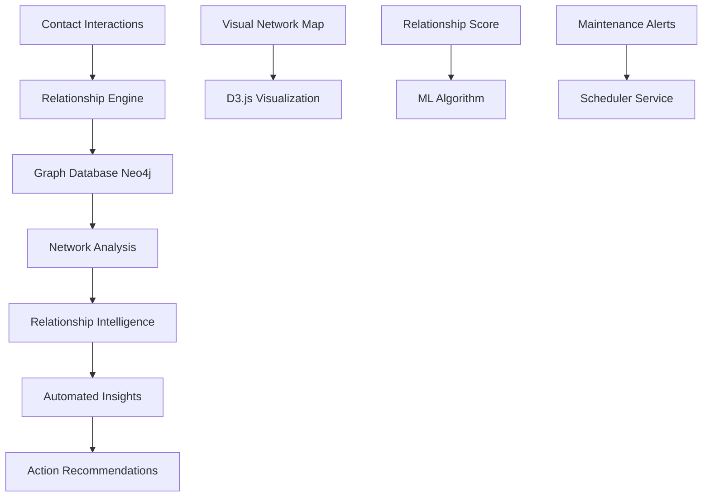

# 🤝 FC-036: Beziehungsmanagement - TECH CONCEPT

**Feature-Code:** FC-036  
**Feature-Name:** Beziehungsmanagement  
**Kategorie:** Customer Relationship & Intelligence  
**Priorität:** MEDIUM  
**Geschätzter Aufwand:** 5 Tage  
**Status:** 📋 PLANNED - Tech Concept verfügbar  

---

## 🧠 CLAUDE WORKING SECTION (15-Min Context Chunk)

### ⚡ SOFORT STARTEN (2 Minuten):
```bash
# 1. Relationship Entities erstellen
cd backend/src/main/java/de/freshplan/domain
mkdir relationship && cd relationship
touch Relationship.java RelationshipService.java RelationshipRepository.java

# 2. Frontend Relationship Components
cd frontend/src/features
mkdir relationships && cd relationships
touch RelationshipMap.tsx ContactNetwork.tsx RelationshipInsights.tsx
```

### 📋 IMPLEMENTIERUNGS-CHECKLISTE:
- [ ] **Phase 1:** Relationship Graph Model & Data Structure (Tag 1-2)
- [ ] **Phase 2:** Relationship Intelligence Engine (Tag 3)  
- [ ] **Phase 3:** Visual Relationship Mapping (Tag 4)
- [ ] **Phase 4:** Automated Relationship Insights (Tag 5)

---

## 🎯 FEATURE OVERVIEW

### Was ist Beziehungsmanagement?
Intelligente Erfassung, Visualisierung und Optimierung aller Geschäftsbeziehungen mit automatischer Kontakt-Netzwerk-Analyse, Beziehungsstärke-Bewertung und proaktiven Empfehlungen für Relationship Building.

### Business Value
- **Systematisches Netzwerk-Management** für nachhaltige Kundenbeziehungen
- **Intelligente Kontakt-Empfehlungen** durch Netzwerk-Analyse  
- **Automatische Beziehungspflege-Erinnerungen** basierend auf Interaktionsmustern
- **Cross-Selling durch Referral-Opportunities** in bestehenden Netzwerken

### Erfolgsmetriken
- 40% mehr Referral-Business durch systematisches Netzwerk-Management
- 60% Reduktion verlorener Kontakte durch automatische Pflegeerinnerungen
- 25% höhere Customer Lifetime Value durch bessere Beziehungsqualität

---

## 🏗️ TECHNISCHE ARCHITEKTUR

### Tech Stack
- **Graph Database:** Neo4j für Relationship Mapping
- **Backend:** Quarkus + Neo4j Driver für Graph Queries
- **Frontend:** React + D3.js für Network Visualization
- **AI Engine:** OpenAI für Relationship Intelligence
- **Scheduling:** Quartz Scheduler für Relationship Maintenance

### System Architecture


### Component Architecture
```typescript
relationships/
├── components/
│   ├── RelationshipDashboard.tsx   # Main Relationship Hub
│   ├── NetworkVisualization.tsx    # D3.js Network Graph
│   ├── ContactDetails.tsx          # Contact Relationship Details
│   ├── RelationshipTimeline.tsx    # Interaction History
│   ├── ReferralOpportunities.tsx   # Referral Suggestions
│   └── RelationshipMaintenance.tsx # Pflegeerinnerungen
├── hooks/
│   ├── useRelationshipGraph.ts     # Graph Data Management
│   ├── useNetworkAnalysis.ts       # Network Intelligence
│   ├── useRelationshipScore.ts     # Relationship Scoring
│   └── useReferralSuggestions.ts   # Referral Intelligence
├── services/
│   ├── relationshipApi.ts          # Relationship API Client
│   ├── networkAnalysisApi.ts       # Network Analysis API
│   └── relationshipIntelligence.ts # AI-powered Insights
└── utils/
    ├── graphCalculations.ts         # Graph Theory Algorithms
    ├── relationshipMetrics.ts       # Relationship KPIs
    └── networkVisualization.ts      # D3.js Helper Functions
```

---

## 🕸️ GRAPH DATABASE DESIGN

### Neo4j Relationship Model
```cypher
// Person Nodes
CREATE (p:Person {
    id: 'uuid',
    name: 'Max Mustermann',
    email: 'max@example.com',
    phone: '+49123456789',
    jobTitle: 'Geschäftsführer',
    department: 'Management',
    linkedin: 'https://linkedin.com/in/max-mustermann'
})

// Company Nodes  
CREATE (c:Company {
    id: 'uuid',
    name: 'Mustermann GmbH',
    industry: 'Information Technology',
    size: 'MEDIUM',
    location: 'München',
    website: 'https://mustermann.de'
})

// Relationships with Properties
CREATE (p1:Person)-[r:WORKS_AT {
    since: date('2020-01-01'),
    role: 'Geschäftsführer',
    influence: 0.9
}]->(c:Company)

CREATE (p1:Person)-[r:KNOWS {
    strength: 0.8,
    lastContact: datetime('2024-07-15T10:30:00'),
    contactFrequency: 'MONTHLY',
    relationshipType: 'PROFESSIONAL',
    introducedBy: 'mutual_connection_id',
    notes: 'Kennengelernt auf Messe'
}]->(p2:Person)

CREATE (p1:Person)-[r:INFLUENCES {
    influence: 0.7,
    domain: 'PURCHASE_DECISIONS'
}]->(p2:Person)
```

### Relationship Entity (JPA)
```java
@Entity
@Table(name = "relationships")
public class Relationship extends BaseEntity {
    
    @Column(name = "from_contact_id", nullable = false)
    private UUID fromContactId;
    
    @Column(name = "to_contact_id", nullable = false)
    private UUID toContactId;
    
    @Enumerated(EnumType.STRING)
    @Column(name = "relationship_type", nullable = false)
    private RelationshipType type; // PROFESSIONAL, PERSONAL, VENDOR, CUSTOMER
    
    @Column(name = "strength", precision = 3, scale = 2)
    private BigDecimal strength; // 0.0 - 1.0
    
    @Column(name = "last_interaction")
    private LocalDateTime lastInteraction;
    
    @Enumerated(EnumType.STRING)
    @Column(name = "contact_frequency")
    private ContactFrequency frequency; // DAILY, WEEKLY, MONTHLY, QUARTERLY, YEARLY
    
    @Column(name = "interaction_count")
    private Integer interactionCount = 0;
    
    @Column(name = "introduction_source")
    private String introductionSource;
    
    @Column(name = "notes", length = 1000)
    private String notes;
    
    @Column(name = "influence_score", precision = 3, scale = 2)
    private BigDecimal influenceScore; // How much fromContact influences toContact
    
    @Column(name = "is_mutual")
    private Boolean isMutual = false;
    
    @Column(name = "next_contact_reminder")
    private LocalDateTime nextContactReminder;
    
    // Getters/Setters
}

enum RelationshipType {
    PROFESSIONAL,
    PERSONAL, 
    VENDOR,
    CUSTOMER,
    REFERRAL,
    MENTOR,
    PEER
}

enum ContactFrequency {
    DAILY,
    WEEKLY, 
    MONTHLY,
    QUARTERLY,
    YEARLY,
    OCCASIONAL
}
```

---

## 🧠 RELATIONSHIP INTELLIGENCE ENGINE

### Neo4j Relationship Service
```java
@ApplicationScoped
public class RelationshipGraphService {
    
    @Inject
    @ConfigProperty(name = "neo4j.uri")
    String neo4jUri;
    
    @Inject
    @ConfigProperty(name = "neo4j.username")
    String neo4jUsername;
    
    @Inject
    @ConfigProperty(name = "neo4j.password")
    String neo4jPassword;
    
    private Driver neo4jDriver;
    
    @PostConstruct
    void initializeDriver() {
        this.neo4jDriver = GraphDatabase.driver(
            neo4jUri, 
            AuthTokens.basic(neo4jUsername, neo4jPassword)
        );
    }
    
    public CompletionStage<NetworkGraph> getContactNetwork(UUID contactId, int depth) {
        return CompletableFuture.supplyAsync(() -> {
            try (Session session = neo4jDriver.session()) {
                String cypher = """
                    MATCH (start:Person {id: $contactId})
                    CALL apoc.path.expandConfig(start, {
                        relationshipFilter: 'KNOWS|WORKS_WITH|INFLUENCES',
                        minLevel: 1,
                        maxLevel: $depth,
                        uniqueness: 'NODE_GLOBAL'
                    })
                    YIELD path
                    RETURN path
                    """;
                
                Result result = session.run(cypher, Map.of(
                    "contactId", contactId.toString(),
                    "depth", depth
                ));
                
                return buildNetworkGraph(result);
            }
        });
    }
    
    public CompletionStage<List<ReferralOpportunity>> findReferralOpportunities(UUID customerId) {
        return CompletableFuture.supplyAsync(() -> {
            try (Session session = neo4jDriver.session()) {
                String cypher = """
                    MATCH (customer:Company {id: $customerId})
                    MATCH (customer)<-[:WORKS_AT]-(contact:Person)
                    MATCH (contact)-[knows:KNOWS]-(potential:Person)
                    MATCH (potential)-[:WORKS_AT]->(target:Company)
                    WHERE target.id <> customer.id
                      AND knows.strength > 0.6
                      AND target.industry IN ['Information Technology', 'Financial Services', 'Healthcare']
                      AND NOT EXISTS((target)<-[:CUSTOMER_OF]-(:SalesTeam))
                    RETURN potential, target, knows.strength as connectionStrength
                    ORDER BY knows.strength DESC
                    LIMIT 20
                    """;
                
                Result result = session.run(cypher, Map.of("customerId", customerId.toString()));
                
                return result.stream()
                    .map(this::buildReferralOpportunity)
                    .collect(Collectors.toList());
            }
        });
    }
    
    public CompletionStage<RelationshipScore> calculateRelationshipScore(UUID fromId, UUID toId) {
        return CompletableFuture.supplyAsync(() -> {
            try (Session session = neo4jDriver.session()) {
                String cypher = """
                    MATCH (from:Person {id: $fromId})-[r:KNOWS]-(to:Person {id: $toId})
                    OPTIONAL MATCH (from)-[:WORKS_AT]->(fromCompany:Company)
                    OPTIONAL MATCH (to)-[:WORKS_AT]->(toCompany:Company)
                    RETURN r, fromCompany, toCompany
                    """;
                
                Result result = session.run(cypher, Map.of(
                    "fromId", fromId.toString(),
                    "toId", toId.toString()
                ));
                
                if (result.hasNext()) {
                    Record record = result.next();
                    return calculateScore(record);
                } else {
                    return RelationshipScore.notConnected();
                }
            }
        });
    }
    
    private RelationshipScore calculateScore(Record record) {
        Relationship relationship = record.get("r").asRelationship();
        
        // Base score from relationship strength
        double baseScore = relationship.get("strength", 0.0);
        
        // Boost for recent interactions
        LocalDateTime lastContact = LocalDateTime.parse(
            relationship.get("lastContact", "1970-01-01T00:00:00")
        );
        long daysSinceContact = ChronoUnit.DAYS.between(lastContact, LocalDateTime.now());
        double recencyBoost = Math.max(0, 1.0 - (daysSinceContact / 365.0));
        
        // Boost for mutual connections
        double mutualConnectionsBoost = countMutualConnections(record) * 0.1;
        
        // Industry relevance boost
        double industryBoost = calculateIndustryRelevance(record);
        
        double finalScore = (baseScore * 0.6) + 
                           (recencyBoost * 0.2) + 
                           (mutualConnectionsBoost * 0.1) + 
                           (industryBoost * 0.1);
        
        return RelationshipScore.builder()
            .overallScore(Math.min(1.0, finalScore))
            .baseStrength(baseScore)
            .recencyFactor(recencyBoost)
            .mutualConnections(countMutualConnections(record))
            .industryRelevance(industryBoost)
            .recommendation(generateRecommendation(finalScore))
            .build();
    }
}
```

### Relationship Intelligence Service
```java
@ApplicationScoped
public class RelationshipIntelligenceService {
    
    @Inject
    OpenAIService openaiService;
    
    @Inject
    RelationshipGraphService graphService;
    
    public CompletionStage<List<RelationshipInsight>> generateRelationshipInsights(UUID contactId) {
        return graphService.getContactNetwork(contactId, 2)
            .thenCompose(network -> {
                List<CompletableFuture<RelationshipInsight>> insightFutures = List.of(
                    generateNetworkGrowthInsight(network),
                    generateInfluenceAnalysis(network),
                    generateMaintenanceRecommendations(network),
                    generateReferralStrategies(network)
                );
                
                return CompletableFuture.allOf(
                    insightFutures.toArray(new CompletableFuture[0])
                ).thenApply(v -> 
                    insightFutures.stream()
                        .map(CompletableFuture::join)
                        .collect(Collectors.toList())
                );
            });
    }
    
    private CompletableFuture<RelationshipInsight> generateNetworkGrowthInsight(NetworkGraph network) {
        String prompt = String.format("""
            Analysiere dieses Kontakt-Netzwerk auf Wachstumsmöglichkeiten:
            
            Netzwerk-Statistiken:
            - Anzahl Kontakte: %d
            - Anzahl Verbindungen: %d
            - Durchschnittliche Verbindungsstärke: %.2f
            - Branchenverteilung: %s
            
            Identifiziere:
            1. Schwach vernetzte Bereiche
            2. Potentielle Schlüsselkontakte zum Ausbau
            3. Brücken zu neuen Netzwerken
            
            Gib konkrete Handlungsempfehlungen für strategisches Netzwerk-Wachstum.
            """, 
            network.getNodeCount(),
            network.getEdgeCount(),
            network.getAverageConnectionStrength(),
            network.getIndustryDistribution()
        );
        
        return openaiService.generateInsight(prompt)
            .thenApply(content -> RelationshipInsight.builder()
                .type(InsightType.NETWORK_GROWTH)
                .title("Netzwerk-Wachstumschancen")
                .content(content)
                .priority(Priority.HIGH)
                .actionable(true)
                .build()
            )
            .toCompletableFuture();
    }
    
    private CompletableFuture<RelationshipInsight> generateMaintenanceRecommendations(NetworkGraph network) {
        List<Contact> neglectedContacts = network.getContacts().stream()
            .filter(contact -> {
                Duration sinceLastContact = Duration.between(
                    contact.getLastInteraction(),
                    LocalDateTime.now()
                );
                return sinceLastContact.toDays() > contact.getExpectedContactFrequency().getDays() * 1.5;
            })
            .sorted((a, b) -> b.getRelationshipScore().compareTo(a.getRelationshipScore()))
            .limit(5)
            .collect(Collectors.toList());
        
        if (neglectedContacts.isEmpty()) {
            return CompletableFuture.completedFuture(
                RelationshipInsight.noAction("Alle Kontakte werden regelmäßig gepflegt.")
            );
        }
        
        String prompt = String.format("""
            Diese wichtigen Kontakte wurden vernachlässigt:
            %s
            
            Erstelle eine priorisierte Liste für Kontaktaufnahme mit:
            1. Priorität basierend auf Beziehungsstärke
            2. Kontextuelle Anlässe für Kontaktaufnahme
            3. Kommunikationskanal-Empfehlungen
            
            Fokus: Authentische Beziehungspflege, nicht Verkauf.
            """,
            neglectedContacts.stream()
                .map(c -> String.format("- %s (%s): %d Tage seit letztem Kontakt", 
                    c.getName(), c.getJobTitle(), c.getDaysSinceLastContact()))
                .collect(Collectors.joining("\n"))
        );
        
        return openaiService.generateInsight(prompt)
            .thenApply(content -> RelationshipInsight.builder()
                .type(InsightType.MAINTENANCE)
                .title("Beziehungspflege erforderlich")
                .content(content)
                .priority(Priority.MEDIUM)
                .actionable(true)
                .affectedContacts(neglectedContacts.stream()
                    .map(Contact::getId)
                    .collect(Collectors.toList()))
                .build()
            )
            .toCompletableFuture();
    }
}
```

---

## 🎨 VISUAL NETWORK MAPPING

### D3.js Network Visualization
```typescript
export const NetworkVisualization: React.FC<NetworkVisualizationProps> = ({
  networkData,
  onNodeClick,
  onNodeHover,
  width = 800,
  height = 600
}) => {
  const svgRef = useRef<SVGSVGElement>(null);
  const [selectedNode, setSelectedNode] = useState<NetworkNode | null>(null);
  
  useEffect(() => {
    if (!svgRef.current || !networkData) return;
    
    const svg = d3.select(svgRef.current);
    svg.selectAll("*").remove(); // Clear previous visualization
    
    // Setup simulation
    const simulation = d3.forceSimulation(networkData.nodes)
      .force("link", d3.forceLink(networkData.links)
        .id((d: any) => d.id)
        .distance(d => 100 - (d.strength * 50)) // Stronger connections = closer nodes
      )
      .force("charge", d3.forceManyBody().strength(-300))
      .force("center", d3.forceCenter(width / 2, height / 2))
      .force("collision", d3.forceCollide().radius(30));
    
    // Create groups for links and nodes
    const linkGroup = svg.append("g").attr("class", "links");
    const nodeGroup = svg.append("g").attr("class", "nodes");
    
    // Draw links
    const links = linkGroup
      .selectAll("line")
      .data(networkData.links)
      .join("line")
      .attr("stroke", d => getConnectionColor(d.type))
      .attr("stroke-width", d => Math.max(1, d.strength * 4))
      .attr("stroke-opacity", d => 0.3 + (d.strength * 0.4));
    
    // Draw nodes
    const nodes = nodeGroup
      .selectAll("g")
      .data(networkData.nodes)
      .join("g")
      .attr("class", "node")
      .call(d3.drag()
        .on("start", dragstarted)
        .on("drag", dragged)
        .on("end", dragended));
    
    // Node circles
    nodes.append("circle")
      .attr("r", d => getNodeSize(d))
      .attr("fill", d => getNodeColor(d.type))
      .attr("stroke", "#fff")
      .attr("stroke-width", 2);
    
    // Node labels
    nodes.append("text")
      .attr("dy", ".35em")
      .attr("text-anchor", "middle")
      .style("font-size", "10px")
      .style("font-family", "Poppins")
      .style("pointer-events", "none")
      .text(d => truncateText(d.name, 12));
    
    // Relationship strength indicators
    nodes.append("circle")
      .attr("r", d => getNodeSize(d) + 5)
      .attr("fill", "none")
      .attr("stroke", d => getRelationshipStrengthColor(d.averageConnectionStrength))
      .attr("stroke-width", 2)
      .attr("stroke-dasharray", "2,2");
    
    // Node interaction handlers
    nodes
      .on("click", (event, d) => {
        setSelectedNode(d);
        onNodeClick?.(d);
      })
      .on("mouseover", (event, d) => {
        // Highlight connected nodes
        highlightConnectedNodes(d.id);
        onNodeHover?.(d);
      })
      .on("mouseout", () => {
        // Remove highlights
        removeHighlights();
      });
    
    // Update positions on simulation tick
    simulation.on("tick", () => {
      links
        .attr("x1", d => d.source.x)
        .attr("y1", d => d.source.y)
        .attr("x2", d => d.target.x)
        .attr("y2", d => d.target.y);
      
      nodes.attr("transform", d => `translate(${d.x},${d.y})`);
    });
    
    // Drag functions
    function dragstarted(event: any, d: any) {
      if (!event.active) simulation.alphaTarget(0.3).restart();
      d.fx = d.x;
      d.fy = d.y;
    }
    
    function dragged(event: any, d: any) {
      d.fx = event.x;
      d.fy = event.y;
    }
    
    function dragended(event: any, d: any) {
      if (!event.active) simulation.alphaTarget(0);
      d.fx = null;
      d.fy = null;
    }
    
    function highlightConnectedNodes(nodeId: string) {
      const connectedNodeIds = new Set();
      networkData.links
        .filter(link => link.source.id === nodeId || link.target.id === nodeId)
        .forEach(link => {
          connectedNodeIds.add(link.source.id);
          connectedNodeIds.add(link.target.id);
        });
      
      nodes
        .style("opacity", d => connectedNodeIds.has(d.id) ? 1 : 0.3);
      
      links
        .style("opacity", d => 
          d.source.id === nodeId || d.target.id === nodeId ? 1 : 0.1
        );
    }
    
    function removeHighlights() {
      nodes.style("opacity", 1);
      links.style("opacity", d => 0.3 + (d.strength * 0.4));
    }
    
    return () => {
      simulation.stop();
    };
  }, [networkData, width, height]);
  
  const getNodeSize = (node: NetworkNode) => {
    const baseSize = 15;
    const influenceBonus = node.influenceScore * 10;
    const connectionBonus = node.connectionCount * 0.5;
    return baseSize + influenceBonus + connectionBonus;
  };
  
  const getNodeColor = (nodeType: string) => {
    const colors = {
      'CUSTOMER': '#94C456',      // Freshfoodz Grün
      'PROSPECT': '#FFA726',      // Orange
      'PARTNER': '#004F7B',       // Freshfoodz Blau
      'INTERNAL': '#9C27B0',      // Lila
      'REFERRAL': '#FF5722'       // Rot
    };
    return colors[nodeType] || '#757575';
  };
  
  const getConnectionColor = (connectionType: string) => {
    const colors = {
      'PROFESSIONAL': '#2196F3',
      'PERSONAL': '#4CAF50', 
      'VENDOR': '#FF9800',
      'CUSTOMER': '#9C27B0'
    };
    return colors[connectionType] || '#757575';
  };
  
  return (
    <Box sx={{ position: 'relative' }}>
      <svg
        ref={svgRef}
        width={width}
        height={height}
        style={{ 
          border: '1px solid #e0e0e0',
          borderRadius: '8px',
          backgroundColor: '#fafafa'
        }}
      />
      
      {/* Network Stats Overlay */}
      <Paper 
        sx={{ 
          position: 'absolute',
          top: 16,
          left: 16,
          p: 2,
          minWidth: 200,
          backgroundColor: 'rgba(255, 255, 255, 0.95)'
        }}
      >
        <Typography variant="h6" fontFamily="Antonio Bold" gutterBottom>
          Netzwerk-Statistiken
        </Typography>
        <Grid container spacing={1}>
          <Grid item xs={6}>
            <Typography variant="body2" color="text.secondary">
              Kontakte:
            </Typography>
            <Typography variant="h6">
              {networkData?.nodes.length || 0}
            </Typography>
          </Grid>
          <Grid item xs={6}>
            <Typography variant="body2" color="text.secondary">
              Verbindungen:
            </Typography>
            <Typography variant="h6">
              {networkData?.links.length || 0}
            </Typography>
          </Grid>
          <Grid item xs={6}>
            <Typography variant="body2" color="text.secondary">
              Ø Stärke:
            </Typography>
            <Typography variant="h6">
              {networkData ? 
                (networkData.links.reduce((sum, link) => sum + link.strength, 0) / 
                 networkData.links.length).toFixed(1) : '0.0'
              }
            </Typography>
          </Grid>
          <Grid item xs={6}>
            <Typography variant="body2" color="text.secondary">
              Cluster:
            </Typography>
            <Typography variant="h6">
              {calculateNetworkClusters(networkData)}
            </Typography>
          </Grid>
        </Grid>
      </Paper>
      
      {/* Selected Node Details */}
      {selectedNode && (
        <NodeDetailsPanel 
          node={selectedNode}
          onClose={() => setSelectedNode(null)}
        />
      )}
    </Box>
  );
};
```

### Relationship Dashboard
```typescript
export const RelationshipDashboard: React.FC = () => {
  const [selectedContact, setSelectedContact] = useState<Contact | null>(null);
  const [networkDepth, setNetworkDepth] = useState(2);
  const [timeFilter, setTimeFilter] = useState<TimeFilter>('ALL');
  
  const { data: networkData, isLoading: networkLoading } = useQuery({
    queryKey: ['relationship-network', selectedContact?.id, networkDepth],
    queryFn: () => relationshipApi.getNetwork(selectedContact?.id, networkDepth),
    enabled: !!selectedContact?.id
  });
  
  const { data: insights, isLoading: insightsLoading } = useQuery({
    queryKey: ['relationship-insights', selectedContact?.id],
    queryFn: () => relationshipApi.getInsights(selectedContact?.id),
    enabled: !!selectedContact?.id
  });
  
  const { data: referralOpportunities } = useQuery({
    queryKey: ['referral-opportunities', selectedContact?.id],
    queryFn: () => relationshipApi.getReferralOpportunities(selectedContact?.id),
    enabled: !!selectedContact?.id
  });
  
  return (
    <Container maxWidth="xl">
      <Box sx={{ mb: 3 }}>
        <Typography variant="h4" fontFamily="Antonio Bold" gutterBottom>
          Beziehungsmanagement
        </Typography>
        <Typography variant="subtitle1" color="text.secondary">
          Intelligente Netzwerk-Analyse und Beziehungsoptimierung
        </Typography>
      </Box>
      
      <Grid container spacing={3}>
        {/* Contact Selection & Filters */}
        <Grid item xs={12} md={3}>
          <Paper sx={{ p: 2, mb: 2 }}>
            <Typography variant="h6" gutterBottom>
              Kontakt auswählen
            </Typography>
            <ContactSelector 
              onSelect={setSelectedContact}
              selectedContact={selectedContact}
            />
            
            <Divider sx={{ my: 2 }} />
            
            <Typography variant="h6" gutterBottom>
              Netzwerk-Einstellungen
            </Typography>
            <Box sx={{ mb: 2 }}>
              <Typography variant="body2" gutterBottom>
                Netzwerk-Tiefe: {networkDepth}
              </Typography>
              <Slider
                value={networkDepth}
                onChange={(_, value) => setNetworkDepth(value as number)}
                min={1}
                max={3}
                marks
                valueLabelDisplay="auto"
              />
            </Box>
            
            <FormControl fullWidth>
              <InputLabel>Zeitfilter</InputLabel>
              <Select
                value={timeFilter}
                onChange={(e) => setTimeFilter(e.target.value as TimeFilter)}
              >
                <MenuItem value="ALL">Alle Kontakte</MenuItem>
                <MenuItem value="LAST_30_DAYS">Letzte 30 Tage</MenuItem>
                <MenuItem value="LAST_90_DAYS">Letzte 90 Tage</MenuItem>
                <MenuItem value="LAST_YEAR">Letztes Jahr</MenuItem>
              </Select>
            </FormControl>
          </Paper>
          
          {/* Relationship Insights */}
          {insights && (
            <Paper sx={{ p: 2 }}>
              <Typography variant="h6" gutterBottom>
                Beziehungs-Insights
              </Typography>
              {insights.map((insight, index) => (
                <InsightCard 
                  key={index}
                  insight={insight}
                  compact
                />
              ))}
            </Paper>
          )}
        </Grid>
        
        {/* Network Visualization */}
        <Grid item xs={12} md={6}>
          <Paper sx={{ p: 2, height: 600 }}>
            <Typography variant="h6" gutterBottom>
              Netzwerk-Visualisierung
            </Typography>
            {networkLoading ? (
              <NetworkVisualizationSkeleton />
            ) : networkData ? (
              <NetworkVisualization
                networkData={networkData}
                onNodeClick={(node) => {
                  // Handle node selection
                  console.log('Selected node:', node);
                }}
                width={700}
                height={520}
              />
            ) : (
              <Box sx={{ 
                display: 'flex', 
                alignItems: 'center', 
                justifyContent: 'center',
                height: 520,
                color: 'text.secondary'
              }}>
                <Typography>
                  Wählen Sie einen Kontakt aus, um das Netzwerk zu visualisieren
                </Typography>
              </Box>
            )}
          </Paper>
        </Grid>
        
        {/* Referral Opportunities & Actions */}
        <Grid item xs={12} md={3}>
          <Paper sx={{ p: 2, mb: 2 }}>
            <Typography variant="h6" gutterBottom>
              Empfehlungschancen
            </Typography>
            {referralOpportunities?.length ? (
              <List>
                {referralOpportunities.map((opportunity, index) => (
                  <ListItem key={index} divider>
                    <ListItemText
                      primary={opportunity.targetCompany}
                      secondary={`Über ${opportunity.referrerName} (${opportunity.connectionStrength}% Verbindung)`}
                    />
                    <IconButton 
                      size="small"
                      onClick={() => handleReferralAction(opportunity)}
                    >
                      <LaunchIcon />
                    </IconButton>
                  </ListItem>
                ))}
              </List>
            ) : (
              <Typography variant="body2" color="text.secondary">
                Keine Empfehlungschancen gefunden
              </Typography>
            )}
          </Paper>
          
          {/* Maintenance Reminders */}
          <Paper sx={{ p: 2 }}>
            <Typography variant="h6" gutterBottom>
              Pflegeerinnerungen
            </Typography>
            <MaintenanceReminders 
              contactId={selectedContact?.id}
              onActionTaken={(action) => {
                // Refresh data after action
                queryClient.invalidateQueries(['relationship-network']);
              }}
            />
          </Paper>
        </Grid>
      </Grid>
    </Container>
  );
};
```

---

## 🔔 AUTOMATED RELATIONSHIP MAINTENANCE

### Maintenance Scheduler
```java
@ApplicationScoped
public class RelationshipMaintenanceService {
    
    @Inject
    RelationshipRepository relationshipRepository;
    
    @Inject
    TaskService taskService;
    
    @Inject
    EmailService emailService;
    
    @Scheduled(every = "1h")
    public void checkMaintenanceReminders() {
        Log.info("Checking relationship maintenance reminders");
        
        LocalDateTime now = LocalDateTime.now();
        
        // Find relationships that need attention
        List<Relationship> overdueRelationships = relationshipRepository
            .findOverdueForMaintenance(now);
        
        overdueRelationships.forEach(this::createMaintenanceTask);
    }
    
    private void createMaintenanceTask(Relationship relationship) {
        Contact fromContact = contactRepository.findById(relationship.getFromContactId());
        Contact toContact = contactRepository.findById(relationship.getToContactId());
        
        // Calculate maintenance urgency
        MaintenanceUrgency urgency = calculateMaintenanceUrgency(relationship);
        
        // Create personalized maintenance task
        Task maintenanceTask = Task.builder()
            .title(String.format("Kontakt zu %s pflegen", toContact.getName()))
            .description(generateMaintenanceDescription(relationship, fromContact, toContact))
            .assigneeId(fromContact.getUserId())
            .customerId(toContact.getCustomerId())
            .contactId(toContact.getId())
            .type(TaskType.RELATIONSHIP_MAINTENANCE)
            .priority(urgency.getTaskPriority())
            .dueDate(calculateDueDate(urgency))
            .metadata(Map.of(
                "relationshipId", relationship.getId().toString(),
                "lastContact", relationship.getLastInteraction().toString(),
                "urgencyLevel", urgency.name(),
                "suggestedActions", generateSuggestedActions(relationship)
            ))
            .build();
        
        taskService.createTask(maintenanceTask);
        
        // Send notification if high urgency
        if (urgency == MaintenanceUrgency.HIGH) {
            sendMaintenanceNotification(fromContact, toContact, relationship);
        }
    }
    
    private String generateMaintenanceDescription(
        Relationship relationship, 
        Contact fromContact, 
        Contact toContact
    ) {
        StringBuilder description = new StringBuilder();
        
        description.append(String.format(
            "Es ist Zeit für eine Kontaktaufnahme zu %s (%s).\n\n", 
            toContact.getName(), 
            toContact.getJobTitle()
        ));
        
        description.append(String.format(
            "Letzter Kontakt: %s (%d Tage)\n",
            formatDate(relationship.getLastInteraction()),
            ChronoUnit.DAYS.between(relationship.getLastInteraction(), LocalDateTime.now())
        ));
        
        description.append(String.format(
            "Beziehungsstärke: %.1f/10\n",
            relationship.getStrength().doubleValue() * 10
        ));
        
        description.append(String.format(
            "Geplante Kontaktfrequenz: %s\n\n",
            relationship.getFrequency().getDisplayName()
        ));
        
        description.append("Empfohlene Aktionen:\n");
        List<String> suggestions = generateSuggestedActions(relationship);
        suggestions.forEach(action -> description.append("• ").append(action).append("\n"));
        
        return description.toString();
    }
    
    private List<String> generateSuggestedActions(Relationship relationship) {
        List<String> actions = new ArrayList<>();
        
        // Context-aware suggestions based on relationship type and history
        switch (relationship.getType()) {
            case PROFESSIONAL:
                actions.add("LinkedIn-Nachricht mit branchenrelevanten Insights");
                actions.add("Einladung zu Branchenveranstaltung oder Webinar");
                actions.add("Kurzes Check-in zu aktuellen Projekten");
                break;
                
            case CUSTOMER:
                actions.add("Zufriedenheitscheck zum aktuellen Service");
                actions.add("Information über neue Produktangebote");
                actions.add("Terminvereinbarung für Strategiegespräch");
                break;
                
            case REFERRAL:
                actions.add("Dankesnachricht für vergangene Empfehlungen");
                actions.add("Update zu erfolgreichen Referral-Ergebnissen");
                actions.add("Gegenseitige Empfehlungsmöglichkeiten erkunden");
                break;
        }
        
        // Add seasonal or time-based suggestions
        addSeasonalSuggestions(actions);
        
        return actions;
    }
    
    private MaintenanceUrgency calculateMaintenanceUrgency(Relationship relationship) {
        long daysSinceContact = ChronoUnit.DAYS.between(
            relationship.getLastInteraction(), 
            LocalDateTime.now()
        );
        
        long expectedFrequencyDays = relationship.getFrequency().getDays();
        double overdueRatio = (double) daysSinceContact / expectedFrequencyDays;
        
        // Factor in relationship strength
        double strengthMultiplier = relationship.getStrength().doubleValue();
        
        double urgencyScore = overdueRatio * (1 + strengthMultiplier);
        
        if (urgencyScore > 2.0) return MaintenanceUrgency.HIGH;
        if (urgencyScore > 1.5) return MaintenanceUrgency.MEDIUM;
        if (urgencyScore > 1.0) return MaintenanceUrgency.LOW;
        
        return MaintenanceUrgency.NONE;
    }
}

enum MaintenanceUrgency {
    NONE(TaskPriority.LOW),
    LOW(TaskPriority.LOW),
    MEDIUM(TaskPriority.MEDIUM),
    HIGH(TaskPriority.HIGH);
    
    private final TaskPriority taskPriority;
    
    MaintenanceUrgency(TaskPriority taskPriority) {
        this.taskPriority = taskPriority;
    }
    
    public TaskPriority getTaskPriority() {
        return taskPriority;
    }
}
```

---

## 🧪 TESTING & ANALYTICS

### Relationship Analytics
```java
@ApplicationScoped
public class RelationshipAnalyticsService {
    
    @Inject
    RelationshipRepository relationshipRepository;
    
    @Inject
    CustomerRepository customerRepository;
    
    public RelationshipAnalyticsReport generateAnalyticsReport(
        UUID userId, 
        LocalDate fromDate, 
        LocalDate toDate
    ) {
        // 1. Overall network health
        NetworkHealthMetrics health = calculateNetworkHealth(userId);
        
        // 2. Relationship maintenance performance  
        MaintenanceMetrics maintenance = calculateMaintenanceMetrics(userId, fromDate, toDate);
        
        // 3. Referral performance
        ReferralMetrics referrals = calculateReferralMetrics(userId, fromDate, toDate);
        
        // 4. Network growth analysis
        NetworkGrowthMetrics growth = calculateNetworkGrowth(userId, fromDate, toDate);
        
        return RelationshipAnalyticsReport.builder()
            .period(DateRange.of(fromDate, toDate))
            .networkHealth(health)
            .maintenancePerformance(maintenance)
            .referralPerformance(referrals)
            .networkGrowth(growth)
            .recommendations(generateRecommendations(health, maintenance, referrals))
            .build();
    }
    
    private NetworkHealthMetrics calculateNetworkHealth(UUID userId) {
        List<Relationship> relationships = relationshipRepository.findByUserId(userId);
        
        // Calculate average relationship strength
        double avgStrength = relationships.stream()
            .mapToDouble(r -> r.getStrength().doubleValue())
            .average()
            .orElse(0.0);
        
        // Calculate maintenance compliance
        long totalRelationships = relationships.size();
        long wellMaintained = relationships.stream()
            .mapToLong(r -> {
                long daysSinceContact = ChronoUnit.DAYS.between(
                    r.getLastInteraction(), 
                    LocalDateTime.now()
                );
                return daysSinceContact <= r.getFrequency().getDays() ? 1 : 0;
            })
            .sum();
        
        double maintenanceRate = totalRelationships > 0 ? 
            (double) wellMaintained / totalRelationships : 0.0;
        
        // Calculate network diversity (industry spread)
        Set<String> industries = relationships.stream()
            .map(r -> contactRepository.findById(r.getToContactId()).getIndustry())
            .filter(Objects::nonNull)
            .collect(Collectors.toSet());
        
        double diversityScore = Math.min(1.0, industries.size() / 10.0); // Normalize to max 10 industries
        
        // Overall health score
        double healthScore = (avgStrength * 0.4) + (maintenanceRate * 0.4) + (diversityScore * 0.2);
        
        return NetworkHealthMetrics.builder()
            .totalRelationships(totalRelationships)
            .averageStrength(avgStrength)
            .maintenanceRate(maintenanceRate)
            .networkDiversity(diversityScore)
            .overallHealthScore(healthScore)
            .healthGrade(calculateHealthGrade(healthScore))
            .build();
    }
}
```

### Component Testing
```typescript
// RelationshipDashboard.test.tsx
describe('RelationshipDashboard', () => {
  test('renders network visualization when contact selected', async () => {
    const mockNetworkData = createMockNetworkData();
    mockRelationshipApi.getNetwork.mockResolvedValue(mockNetworkData);
    
    render(<RelationshipDashboard />);
    
    // Select a contact
    const contactSelector = screen.getByRole('combobox', { name: /kontakt auswählen/i });
    fireEvent.change(contactSelector, { target: { value: 'contact-123' } });
    
    // Wait for network to load
    await waitFor(() => {
      expect(screen.getByText('Netzwerk-Visualisierung')).toBeInTheDocument();
    });
    
    // Verify network stats are displayed
    expect(screen.getByText('5')).toBeInTheDocument(); // Node count
    expect(screen.getByText('8')).toBeInTheDocument(); // Link count
  });
  
  test('shows referral opportunities when available', async () => {
    const mockOpportunities = [
      { targetCompany: 'TechCorp', referrerName: 'John Doe', connectionStrength: 85 }
    ];
    mockRelationshipApi.getReferralOpportunities.mockResolvedValue(mockOpportunities);
    
    render(<RelationshipDashboard />);
    
    await waitFor(() => {
      expect(screen.getByText('TechCorp')).toBeInTheDocument();
      expect(screen.getByText(/über john doe/i)).toBeInTheDocument();
    });
  });
});
```

---

## 🔗 NAVIGATION & DEPENDENCIES

### 🧭 VOLLSTÄNDIGE FEATURE-NAVIGATION (40 Features)

#### 🟢 ACTIVE Features (9)
- [FC-008 Security Foundation](/docs/features/ACTIVE/01_security_foundation/FC-008_TECH_CONCEPT.md)
- [M4 Opportunity Pipeline](/docs/features/ACTIVE/02_opportunity_pipeline/M4_TECH_CONCEPT.md)
- [M8 Calculator Modal](/docs/features/ACTIVE/03_calculator_modal/M8_TECH_CONCEPT.md)
- [FC-009 Permissions System](/docs/features/ACTIVE/04_permissions_system/FC-009_TECH_CONCEPT.md)
- [M1 Navigation](/docs/features/ACTIVE/05_ui_foundation/M1_TECH_CONCEPT.md)
- [M2 Quick Create](/docs/features/ACTIVE/05_ui_foundation/M2_TECH_CONCEPT.md)
- [M3 Sales Cockpit](/docs/features/ACTIVE/05_ui_foundation/M3_TECH_CONCEPT.md)
- [M7 Settings](/docs/features/ACTIVE/05_ui_foundation/M7_SETTINGS_TECH_CONCEPT.md)

#### 🔵 PLANNED Features (31)
- [FC-003 E-Mail Integration](/docs/features/PLANNED/06_email_integration/FC-003_TECH_CONCEPT.md)
- [FC-004 Verkäuferschutz](/docs/features/PLANNED/07_verkaeuferschutz/FC-004_TECH_CONCEPT.md)
- [FC-005 Xentral Integration](/docs/features/PLANNED/08_xentral_integration/FC-005_TECH_CONCEPT.md)
- [FC-006 Mobile App](/docs/features/PLANNED/09_mobile_app/FC-006_TECH_CONCEPT.md)
- [FC-007 Chef-Dashboard](/docs/features/PLANNED/10_chef_dashboard/FC-007_TECH_CONCEPT.md)
- [FC-010 Customer Import](/docs/features/PLANNED/11_customer_import/FC-010_TECH_CONCEPT.md)
- [M5 Customer Refactor](/docs/features/PLANNED/12_customer_refactor_m5/M5_TECH_CONCEPT.md)
- [M6 Analytics Module](/docs/features/PLANNED/13_analytics_m6/M6_TECH_CONCEPT.md)
- [FC-012 Team Communication](/docs/features/PLANNED/14_team_communication/FC-012_TECH_CONCEPT.md)
- [FC-013 Duplicate Detection](/docs/features/PLANNED/15_duplicate_detection/FC-013_TECH_CONCEPT.md)
- [FC-014 Activity Timeline](/docs/features/PLANNED/16_activity_timeline/FC-014_TECH_CONCEPT.md)
- [FC-015 Deal Loss Analysis](/docs/features/PLANNED/17_deal_loss_analysis/FC-015_TECH_CONCEPT.md)
- [FC-016 Opportunity Cloning](/docs/features/PLANNED/18_opportunity_cloning/FC-016_TECH_CONCEPT.md)
- [FC-017 Sales Gamification](/docs/features/PLANNED/99_sales_gamification/FC-017_TECH_CONCEPT.md)
- [FC-018 Mobile PWA](/docs/features/PLANNED/09_mobile_app/FC-018_MOBILE_FIELD_SALES.md)
- [FC-019 Advanced Sales Metrics](/docs/features/PLANNED/19_advanced_metrics/FC-019_TECH_CONCEPT.md)
- [FC-020 Quick Wins](/docs/features/PLANNED/20_quick_wins/FC-020_TECH_CONCEPT.md)
- [FC-021 Integration Hub](/docs/features/PLANNED/21_integration_hub/FC-021_TECH_CONCEPT.md)
- [FC-022 Mobile Light](/docs/features/PLANNED/22_mobile_light/FC-022_TECH_CONCEPT.md)
- [FC-023 Event Sourcing](/docs/features/PLANNED/23_event_sourcing/FC-023_TECH_CONCEPT.md)
- [FC-024 File Management](/docs/features/PLANNED/24_file_management/FC-024_TECH_CONCEPT.md)
- [FC-025 DSGVO Compliance](/docs/features/PLANNED/25_dsgvo_compliance/FC-025_TECH_CONCEPT.md)
- [FC-026 Analytics Platform](/docs/features/PLANNED/26_analytics_platform/FC-026_TECH_CONCEPT.md)
- [FC-027 Magic Moments](/docs/features/PLANNED/27_magic_moments/FC-027_TECH_CONCEPT.md)
- [FC-028 WhatsApp Business](/docs/features/PLANNED/28_whatsapp_integration/FC-028_TECH_CONCEPT.md)
- [FC-029 Voice-First Interface](/docs/features/PLANNED/29_voice_first/FC-029_TECH_CONCEPT.md)
- [FC-030 One-Tap Actions](/docs/features/PLANNED/30_one_tap_actions/FC-030_TECH_CONCEPT.md)
- [FC-031 Smart Templates](/docs/features/PLANNED/31_smart_templates/FC-031_TECH_CONCEPT.md)
- [FC-032 Offline-First](/docs/features/PLANNED/32_offline_first/FC-032_TECH_CONCEPT.md)
- [FC-033 Visual Customer Cards](/docs/features/PLANNED/33_visual_cards/FC-033_TECH_CONCEPT.md)
- [FC-034 Instant Insights](/docs/features/PLANNED/34_instant_insights/FC-034_TECH_CONCEPT.md)
- [FC-035 Social Selling Helper](/docs/features/PLANNED/35_social_selling/FC-035_TECH_CONCEPT.md)
- **→ FC-036 Beziehungsmanagement** ← **SIE SIND HIER - SESSION 14 ABGESCHLOSSEN**

### 📋 ABHÄNGIGKEITEN
- **Benötigt:** FC-035 Social Selling Helper (Social Intelligence)
- **Ergänzt:** FC-014 Activity Timeline (Interaktionshistorie)
- **Basis für:** Advanced CRM Analytics (Relationship ROI)

---

**⏱️ GESCHÄTZTE IMPLEMENTIERUNGSZEIT:** 5 Tage  
**🎯 BUSINESS IMPACT:** Sehr Hoch (systematisches Netzwerk-Management)  
**🔧 TECHNISCHE KOMPLEXITÄT:** Hoch (Neo4j Graph DB, D3.js Visualization)  
**📊 ROI:** Break-even nach 6 Wochen durch Referral-Business und verbesserte Kundenbeziehungen