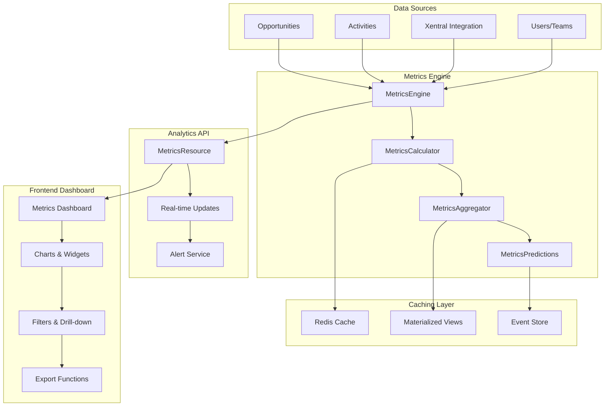
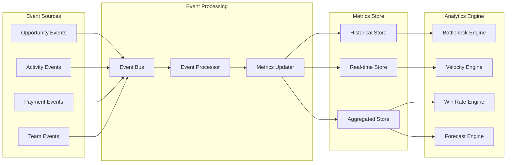

# FC-019: Technisches Konzept - Advanced Sales Metrics

**Feature Code:** FC-019  
**Datum:** 2025-07-20  
**Status:** Draft  
**Autor:** Claude  
**Reviewer:** Jörg Streeck  

## 📋 Inhaltsverzeichnis

1. [Zusammenfassung](#zusammenfassung)
2. [Ziel und Geschäftswert](#ziel-und-geschäftswert)
3. [Technische Architektur](#technische-architektur)
4. [Backend-Implementierung](#backend-implementierung)
5. [Frontend-Implementierung](#frontend-implementierung)
6. [Implementierungsstrategie](#implementierungsstrategie)
7. [Entscheidungs-Log](#entscheidungs-log)
8. [Risiken und Mitigationen](#risiken-und-mitigationen)
9. [Zeitschätzung](#zeitschätzung)

## Zusammenfassung

FC-019 Advanced Sales Metrics implementiert ein Real-time Analytics Dashboard mit intelligenter KPI-Berechnung, Bottleneck-Detection und prädiktiven Insights. Das System nutzt Event-Sourcing für Performance-kritische Metriken und bietet Sales-Teams datengetriebene Entscheidungsgrundlagen.

**ROI**: Verbesserung der Forecast-Genauigkeit von 60% auf 85% und 95% schnellere Problem-Erkennung durch Real-time Monitoring.

## Ziel und Geschäftswert

### Geschäftsziele
- **Forecast-Präzision**: Erhöhung der Prognose-Genauigkeit von 60% auf >85% durch datengetriebene Pipeline-Analyse
- **Bottleneck-Erkennung**: Problem-Identifikation in Real-time statt nach 2-4 Wochen für proaktive Intervention
- **Performance-Optimierung**: 20% schnellere Sales Velocity durch systematische Schwachstellen-Analyse
- **Team-Transparenz**: Objektive Performance-Metriken ersetzen subjektive Einschätzungen

### Technische Ziele
- **Real-time Performance**: Metrik-Updates < 30 Sekunden, Dashboard-Load < 2 Sekunden
- **Skalierbarkeit**: Support für 10.000+ Opportunities mit komplexen Aggregationen
- **Predictive Analytics**: ML-basierte Trend-Prognosen und Anomalie-Detection
- **Integration**: Nahtlose Verbindung mit M6 Analytics Framework und FC-005 Xentral

## Technische Architektur

### System-Übersicht



### Event-Driven Metrics Architecture



## Backend-Implementierung

### 1. API Endpoints

```java
@Path("/api/metrics")
@ApplicationScoped
public class MetricsResource {
    
    @Inject
    MetricsService metricsService;
    
    @Inject
    MetricsAggregator aggregator;
    
    @GET
    @Path("/dashboard")
    @RolesAllowed({"admin", "manager", "sales"})
    public Response getDashboardMetrics(
        @QueryParam("period") @DefaultValue("30d") String period,
        @QueryParam("team") String teamId,
        @QueryParam("user") String userId
    ) {
        MetricsFilter filter = MetricsFilter.builder()
            .period(parsePeriod(period))
            .teamId(parseUUID(teamId))
            .userId(parseUUID(userId))
            .build();
            
        DashboardMetrics metrics = metricsService.getDashboardMetrics(filter);
        return Response.ok(metrics).build();
    }
    
    @GET
    @Path("/velocity")
    public Response getSalesVelocity(
        @QueryParam("breakdown") @DefaultValue("stage") String breakdown,
        @QueryParam("period") @DefaultValue("90d") String period
    ) {
        VelocityMetrics velocity = metricsService.calculateVelocity(
            VelocityBreakdown.valueOf(breakdown.toUpperCase()),
            parsePeriod(period)
        );
        return Response.ok(velocity).build();
    }
    
    @GET
    @Path("/win-rates")
    public Response getWinRates(
        @QueryParam("groupBy") @DefaultValue("stage") String groupBy,
        @QueryParam("compareWith") String compareWith
    ) {
        WinRateAnalysis winRates = metricsService.analyzeWinRates(
            WinRateGrouping.valueOf(groupBy.toUpperCase()),
            parseComparePeriod(compareWith)
        );
        return Response.ok(winRates).build();
    }
    
    @GET
    @Path("/bottlenecks")
    public Response getBottlenecks(
        @QueryParam("threshold") @DefaultValue("30") int thresholdDays
    ) {
        BottleneckAnalysis bottlenecks = metricsService.detectBottlenecks(
            thresholdDays
        );
        return Response.ok(bottlenecks).build();
    }
    
    @GET
    @Path("/forecasts")
    @RolesAllowed({"admin", "manager"})
    public Response getForecast(
        @QueryParam("horizon") @DefaultValue("90d") String horizon,
        @QueryParam("confidence") @DefaultValue("80") int confidence
    ) {
        ForecastAnalysis forecast = metricsService.generateForecast(
            parsePeriod(horizon),
            confidence
        );
        return Response.ok(forecast).build();
    }
    
    @POST
    @Path("/custom")
    @RolesAllowed({"admin", "manager"})
    public Response calculateCustomMetric(CustomMetricRequest request) {
        CustomMetricResult result = metricsService.calculateCustomMetric(request);
        return Response.status(201).entity(result).build();
    }
}
```

### 2. Datenmodell

```java
// Metrics Aggregation Tables
@Entity
@Table(name = "metrics_snapshots")
public class MetricsSnapshot {
    
    @Id
    @GeneratedValue(generator = "UUID")
    private UUID id;
    
    @Column(name = "snapshot_date", nullable = false)
    private LocalDate snapshotDate;
    
    @Enumerated(EnumType.STRING)
    @Column(name = "metric_type", nullable = false)
    private MetricType metricType;
    
    @Column(name = "metric_value", nullable = false)
    private BigDecimal metricValue;
    
    @Column(name = "team_id")
    private UUID teamId;
    
    @Column(name = "user_id")
    private UUID userId;
    
    @Type(JsonType.class)
    @Column(name = "dimensions", columnDefinition = "jsonb")
    private Map<String, Object> dimensions = new HashMap<>();
    
    @Type(JsonType.class)
    @Column(name = "metadata", columnDefinition = "jsonb")
    private Map<String, Object> metadata = new HashMap<>();
    
    @CreationTimestamp
    @Column(name = "created_at")
    private LocalDateTime createdAt;
}

public enum MetricType {
    SALES_VELOCITY("sales_velocity", "Tage"),
    WIN_RATE("win_rate", "%"),
    AVERAGE_DEAL_SIZE("avg_deal_size", "€"),
    CYCLE_LENGTH("cycle_length", "Tage"),
    CONVERSION_RATE("conversion_rate", "%"),
    PIPELINE_VALUE("pipeline_value", "€"),
    ACTIVITIES_PER_DEAL("activities_per_deal", "Anzahl"),
    DEAL_MOMENTUM("deal_momentum", "Score"),
    TEAM_PERFORMANCE("team_performance", "Score"),
    FORECAST_ACCURACY("forecast_accuracy", "%");
    
    private final String key;
    private final String unit;
    
    MetricType(String key, String unit) {
        this.key = key;
        this.unit = unit;
    }
}

// Real-time Metrics Cache
@Entity
@Table(name = "metrics_realtime")
public class RealtimeMetric {
    
    @Id
    @Column(name = "metric_key")
    private String metricKey; // team_123_velocity_30d
    
    @Column(name = "metric_value", nullable = false)
    private BigDecimal metricValue;
    
    @Column(name = "last_calculated", nullable = false)
    private LocalDateTime lastCalculated;
    
    @Column(name = "expires_at", nullable = false)
    private LocalDateTime expiresAt;
    
    @Type(JsonType.class)
    @Column(name = "calculation_metadata", columnDefinition = "jsonb")
    private Map<String, Object> calculationMetadata = new HashMap<>();
}
```

### 3. Business Logic

```java
@ApplicationScoped
@Transactional
public class MetricsService {
    
    @Inject
    OpportunityRepository opportunityRepo;
    
    @Inject
    ActivityRepository activityRepo;
    
    @Inject
    MetricsRepository metricsRepo;
    
    @Inject
    MetricsCalculator calculator;
    
    @Inject
    MetricsCache cache;
    
    @Inject
    Event<MetricCalculatedEvent> metricEvents;
    
    public DashboardMetrics getDashboardMetrics(MetricsFilter filter) {
        String cacheKey = generateCacheKey("dashboard", filter);
        
        return cache.getOrCalculate(cacheKey, Duration.ofMinutes(5), () -> {
            return DashboardMetrics.builder()
                .velocity(calculateVelocity(filter))
                .winRates(calculateWinRates(filter))
                .dealSizes(calculateDealSizes(filter))
                .bottlenecks(detectBottlenecks(filter))
                .teamPerformance(calculateTeamPerformance(filter))
                .trends(calculateTrends(filter))
                .alerts(generateAlerts(filter))
                .build();
        });
    }
    
    public VelocityMetrics calculateVelocity(VelocityBreakdown breakdown, 
                                           Period period) {
        List<Opportunity> wonOpportunities = opportunityRepo
            .findWonInPeriod(period.getStart(), period.getEnd());
            
        return calculator.calculateVelocity(wonOpportunities, breakdown);
    }
    
    private VelocityMetrics calculateVelocityByStage(List<Opportunity> opportunities) {
        Map<OpportunityStage, List<Duration>> stageVelocities = opportunities.stream()
            .collect(Collectors.groupingBy(
                Opportunity::getStage,
                Collectors.mapping(
                    opp -> Duration.between(opp.getCreatedAt(), opp.getClosedAt()),
                    Collectors.toList()
                )
            ));
            
        return VelocityMetrics.builder()
            .overall(calculateAverageDuration(opportunities))
            .byStage(stageVelocities.entrySet().stream()
                .collect(Collectors.toMap(
                    Map.Entry::getKey,
                    entry -> calculateAverageDuration(entry.getValue())
                )))
            .trend(calculateVelocityTrend(opportunities))
            .build();
    }
    
    public BottleneckAnalysis detectBottlenecks(int thresholdDays) {
        List<Opportunity> stuckOpportunities = opportunityRepo
            .findStuckInStage(thresholdDays);
            
        Map<OpportunityStage, List<Opportunity>> bottlenecksByStage = 
            stuckOpportunities.stream()
                .collect(Collectors.groupingBy(Opportunity::getStage));
                
        List<Bottleneck> bottlenecks = bottlenecksByStage.entrySet().stream()
            .map(entry -> Bottleneck.builder()
                .stage(entry.getKey())
                .stuckDeals(entry.getValue().size())
                .averageStuckTime(calculateAverageStuckTime(entry.getValue()))
                .potentialValue(calculateTotalValue(entry.getValue()))
                .recommendations(generateRecommendations(entry.getKey(), entry.getValue()))
                .build())
            .collect(Collectors.toList());
            
        return BottleneckAnalysis.builder()
            .bottlenecks(bottlenecks)
            .totalStuckValue(calculateTotalValue(stuckOpportunities))
            .criticalDeals(identifyCriticalDeals(stuckOpportunities))
            .actionItems(generateActionItems(bottlenecks))
            .build();
    }
    
    @Asynchronous
    public void recalculateMetrics(MetricRecalculationRequest request) {
        try {
            switch (request.getScope()) {
                case TEAM:
                    recalculateTeamMetrics(request.getTeamId(), request.getPeriod());
                    break;
                case USER:
                    recalculateUserMetrics(request.getUserId(), request.getPeriod());
                    break;
                case GLOBAL:
                    recalculateGlobalMetrics(request.getPeriod());
                    break;
            }
            
            metricEvents.fire(new MetricCalculatedEvent(request));
            
        } catch (Exception e) {
            log.error("Metric recalculation failed for request: {}", request, e);
        }
    }
}
```

### 4. Datenbank-Optimierung

```sql
-- V7.0__create_metrics_tables.sql
CREATE TABLE metrics_snapshots (
    id UUID PRIMARY KEY DEFAULT gen_random_uuid(),
    snapshot_date DATE NOT NULL,
    metric_type VARCHAR(50) NOT NULL,
    metric_value DECIMAL(15,4) NOT NULL,
    team_id UUID REFERENCES teams(id),
    user_id UUID REFERENCES users(id),
    dimensions JSONB,
    metadata JSONB,
    created_at TIMESTAMP DEFAULT CURRENT_TIMESTAMP
);

CREATE TABLE metrics_realtime (
    metric_key VARCHAR(200) PRIMARY KEY,
    metric_value DECIMAL(15,4) NOT NULL,
    last_calculated TIMESTAMP NOT NULL,
    expires_at TIMESTAMP NOT NULL,
    calculation_metadata JSONB
);

-- Performance-Indizes für schnelle Aggregationen
CREATE INDEX idx_metrics_snapshots_date_type 
    ON metrics_snapshots(snapshot_date, metric_type);
    
CREATE INDEX idx_metrics_snapshots_team_date 
    ON metrics_snapshots(team_id, snapshot_date) 
    WHERE team_id IS NOT NULL;
    
CREATE INDEX idx_metrics_snapshots_user_date 
    ON metrics_snapshots(user_id, snapshot_date) 
    WHERE user_id IS NOT NULL;

-- JSONB-Indizes für Dimensionen
CREATE INDEX idx_metrics_dimensions 
    ON metrics_snapshots USING GIN (dimensions);

-- Materialized Views für komplexe Metriken
CREATE MATERIALIZED VIEW mv_sales_velocity AS
SELECT 
    DATE_TRUNC('week', closed_at) as week,
    team_id,
    AVG(EXTRACT(DAYS FROM (closed_at - created_at))) as avg_velocity,
    COUNT(*) as deals_count,
    SUM(value) as total_value
FROM opportunities 
WHERE status = 'WON' 
AND closed_at >= CURRENT_DATE - INTERVAL '1 year'
GROUP BY DATE_TRUNC('week', closed_at), team_id;

CREATE UNIQUE INDEX ON mv_sales_velocity(week, team_id);

-- Automatisches Refresh der Materialized Views
CREATE OR REPLACE FUNCTION refresh_metrics_views()
RETURNS void AS $$
BEGIN
    REFRESH MATERIALIZED VIEW CONCURRENTLY mv_sales_velocity;
    -- Weitere Views hier
END;
$$ LANGUAGE plpgsql;

-- Scheduled Refresh jeden Tag um 6 Uhr
-- (via Quarkus Scheduler in Production)
```

## Frontend-Implementierung

### 1. Komponenten-Struktur

```typescript
// /frontend/src/features/metrics/components/MetricsDashboard.tsx
export const MetricsDashboard: React.FC = () => {
  const [filters, setFilters] = useState<MetricsFilters>({
    period: '30d',
    teamId: null,
    userId: null
  });
  
  const { 
    data: metrics, 
    isLoading, 
    error,
    refetch 
  } = useMetricsDashboard(filters);
  
  const { data: realtimeUpdates } = useMetricsRealtime(filters);
  
  // Real-time Updates via Polling (gemäß D2-Entscheidung)
  useInterval(refetch, 30000);
  
  // Update metrics when real-time data changes
  useEffect(() => {
    if (realtimeUpdates) {
      // Optimistic updates for better UX
      queryClient.setQueryData(['metrics', 'dashboard', filters], 
        (oldData: any) => ({ ...oldData, ...realtimeUpdates }));
    }
  }, [realtimeUpdates]);
  
  if (isLoading) return <MetricsDashboardSkeleton />;
  if (error) return <MetricsErrorBoundary error={error} />;
  
  return (
    <Box sx={{ p: 3 }}>
      <MetricsHeader 
        filters={filters} 
        onFiltersChange={setFilters}
        lastUpdated={metrics?.lastUpdated}
      />
      
      <Grid container spacing={3}>
        {/* Key Metrics Row */}
        <Grid item xs={12}>
          <Grid container spacing={2}>
            <Grid item xs={12} sm={6} md={3}>
              <MetricCard
                title="Sales Velocity"
                value={metrics?.velocity.overall}
                unit="Tage"
                trend={metrics?.velocity.trend}
                icon={<TrendingUpIcon />}
                color="primary"
              />
            </Grid>
            <Grid item xs={12} sm={6} md={3}>
              <MetricCard
                title="Win Rate"
                value={metrics?.winRates.overall}
                unit="%"
                trend={metrics?.winRates.trend}
                icon={<TargetIcon />}
                color="success"
              />
            </Grid>
            <Grid item xs={12} sm={6} md={3}>
              <MetricCard
                title="Avg. Deal Size"
                value={metrics?.dealSizes.average}
                unit="€"
                trend={metrics?.dealSizes.trend}
                icon={<MoneyIcon />}
                color="info"
              />
            </Grid>
            <Grid item xs={12} sm={6} md={3}>
              <MetricCard
                title="Pipeline Value"
                value={metrics?.pipeline.totalValue}
                unit="€"
                trend={metrics?.pipeline.trend}
                icon={<PipelineIcon />}
                color="warning"
              />
            </Grid>
          </Grid>
        </Grid>
        
        {/* Charts Row */}
        <Grid item xs={12} lg={8}>
          <Paper sx={{ p: 3, height: 400 }}>
            <Typography variant="h6" gutterBottom>
              Sales Velocity Trend
            </Typography>
            <VelocityChart 
              data={metrics?.velocity.chartData}
              breakdown={filters.breakdown}
            />
          </Paper>
        </Grid>
        
        <Grid item xs={12} lg={4}>
          <Paper sx={{ p: 3, height: 400 }}>
            <Typography variant="h6" gutterBottom>
              Win Rate by Stage
            </Typography>
            <WinRateChart 
              data={metrics?.winRates.byStage}
              interactive={true}
            />
          </Paper>
        </Grid>
        
        {/* Bottlenecks Section */}
        <Grid item xs={12}>
          <BottleneckAnalysisWidget 
            bottlenecks={metrics?.bottlenecks}
            onActionClick={handleBottleneckAction}
          />
        </Grid>
        
        {/* Team Performance */}
        <Grid item xs={12} md={6}>
          <TeamPerformanceWidget 
            teams={metrics?.teamPerformance}
            period={filters.period}
          />
        </Grid>
        
        {/* Alerts & Insights */}
        <Grid item xs={12} md={6}>
          <MetricsAlertsWidget 
            alerts={metrics?.alerts}
            insights={metrics?.insights}
            onAlertAction={handleAlertAction}
          />
        </Grid>
      </Grid>
    </Box>
  );
};

// /frontend/src/features/metrics/components/MetricCard.tsx
export const MetricCard: React.FC<MetricCardProps> = ({
  title,
  value,
  unit,
  trend,
  icon,
  color,
  onClick
}) => {
  const trendIcon = trend?.direction === 'up' ? 
    <TrendingUpIcon color="success" /> : 
    <TrendingDownIcon color="error" />;
    
  const trendColor = trend?.direction === 'up' ? 'success.main' : 'error.main';
  
  return (
    <Card 
      sx={{ 
        height: '100%',
        cursor: onClick ? 'pointer' : 'default',
        '&:hover': onClick ? { boxShadow: 3 } : {}
      }}
      onClick={onClick}
    >
      <CardContent>
        <Box display="flex" justifyContent="space-between" alignItems="start">
          <Box>
            <Typography variant="body2" color="text.secondary" gutterBottom>
              {title}
            </Typography>
            <Typography variant="h4" component="div" color={`${color}.main`}>
              {formatMetricValue(value, unit)}
            </Typography>
            {trend && (
              <Box display="flex" alignItems="center" mt={1}>
                {trendIcon}
                <Typography 
                  variant="body2" 
                  color={trendColor}
                  sx={{ ml: 0.5 }}
                >
                  {trend.percentage}% {trend.direction === 'up' ? 'höher' : 'niedriger'}
                </Typography>
              </Box>
            )}
          </Box>
          <Avatar sx={{ bgcolor: `${color}.light` }}>
            {icon}
          </Avatar>
        </Box>
      </CardContent>
    </Card>
  );
};
```

### 2. State Management

```typescript
// /frontend/src/features/metrics/hooks/useMetricsDashboard.ts
export const useMetricsDashboard = (filters: MetricsFilters) => {
  return useQuery(
    ['metrics', 'dashboard', filters],
    () => fetchDashboardMetrics(filters),
    {
      staleTime: 25000, // 25s - etwas weniger als Polling
      refetchInterval: 30000, // 30s Polling
      refetchIntervalInBackground: false,
      retry: 3,
      retryDelay: (attemptIndex) => Math.min(1000 * 2 ** attemptIndex, 30000),
    }
  );
};

// /frontend/src/features/metrics/hooks/useMetricsRealtime.ts
export const useMetricsRealtime = (filters: MetricsFilters) => {
  return useQuery(
    ['metrics', 'realtime', filters],
    () => fetchRealtimeMetrics(filters),
    {
      refetchInterval: 10000, // 10s for critical metrics
      refetchIntervalInBackground: true,
      staleTime: 8000,
    }
  );
};

// /frontend/src/features/metrics/store/metricsStore.ts
interface MetricsStore {
  filters: MetricsFilters;
  selectedMetrics: string[];
  drillDownData: any;
  alertsEnabled: boolean;
  
  setFilters: (filters: MetricsFilters) => void;
  toggleMetric: (metricId: string) => void;
  setDrillDown: (data: any) => void;
  toggleAlerts: () => void;
}

export const useMetricsStore = create<MetricsStore>((set, get) => ({
  filters: {
    period: '30d',
    teamId: null,
    userId: null,
    breakdown: 'stage'
  },
  selectedMetrics: ['velocity', 'winRate', 'dealSize', 'pipeline'],
  drillDownData: null,
  alertsEnabled: true,
  
  setFilters: (filters) => set({ filters }),
  
  toggleMetric: (metricId) => set(state => ({
    selectedMetrics: state.selectedMetrics.includes(metricId)
      ? state.selectedMetrics.filter(id => id !== metricId)
      : [...state.selectedMetrics, metricId]
  })),
  
  setDrillDown: (data) => set({ drillDownData: data }),
  
  toggleAlerts: () => set(state => ({ alertsEnabled: !state.alertsEnabled }))
}));
```

### 3. Charts und Visualisierung

```typescript
// /frontend/src/features/metrics/components/charts/VelocityChart.tsx
export const VelocityChart: React.FC<VelocityChartProps> = ({ 
  data, 
  breakdown 
}) => {
  const chartData = useMemo(() => ({
    labels: data?.map(point => formatDate(point.date)) || [],
    datasets: [
      {
        label: 'Sales Velocity (Tage)',
        data: data?.map(point => point.velocity) || [],
        borderColor: 'rgb(75, 192, 192)',
        backgroundColor: 'rgba(75, 192, 192, 0.2)',
        tension: 0.4,
        fill: true
      },
      {
        label: 'Trend',
        data: data?.map(point => point.trend) || [],
        borderColor: 'rgb(255, 99, 132)',
        borderDash: [5, 5],
        tension: 0.1,
        fill: false
      }
    ]
  }), [data]);
  
  const options = {
    responsive: true,
    maintainAspectRatio: false,
    plugins: {
      legend: {
        position: 'top' as const,
      },
      tooltip: {
        callbacks: {
          label: (context: any) => {
            return `${context.dataset.label}: ${context.raw} Tage`;
          }
        }
      }
    },
    scales: {
      y: {
        beginAtZero: true,
        title: {
          display: true,
          text: 'Tage'
        }
      },
      x: {
        title: {
          display: true,
          text: 'Zeitraum'
        }
      }
    },
    onClick: (event: any, elements: any[]) => {
      if (elements.length > 0) {
        const dataPoint = data?.[elements[0].index];
        if (dataPoint) {
          onDrillDown?.(dataPoint);
        }
      }
    }
  };
  
  return (
    <Box sx={{ height: '300px', position: 'relative' }}>
      <Line data={chartData} options={options} />
    </Box>
  );
};

// /frontend/src/features/metrics/components/BottleneckAnalysisWidget.tsx
export const BottleneckAnalysisWidget: React.FC<BottleneckAnalysisProps> = ({
  bottlenecks,
  onActionClick
}) => {
  const criticalBottlenecks = bottlenecks?.filter(b => b.severity === 'CRITICAL') || [];
  
  return (
    <Paper sx={{ p: 3 }}>
      <Box display="flex" justifyContent="space-between" alignItems="center" mb={3}>
        <Typography variant="h6">
          Pipeline Bottlenecks
        </Typography>
        <Chip 
          label={`${criticalBottlenecks.length} kritisch`}
          color={criticalBottlenecks.length > 0 ? 'error' : 'success'}
          size="small"
        />
      </Box>
      
      {bottlenecks?.length === 0 ? (
        <Box textAlign="center" py={4}>
          <CheckCircleIcon color="success" sx={{ fontSize: 48, mb: 2 }} />
          <Typography variant="h6" color="success.main">
            Keine Bottlenecks erkannt
          </Typography>
          <Typography variant="body2" color="text.secondary">
            Alle Deals bewegen sich normal durch die Pipeline
          </Typography>
        </Box>
      ) : (
        <Grid container spacing={2}>
          {bottlenecks?.map((bottleneck, index) => (
            <Grid item xs={12} md={6} key={index}>
              <Card variant="outlined">
                <CardContent>
                  <Box display="flex" justifyContent="space-between" alignItems="start">
                    <Box>
                      <Typography variant="subtitle1" fontWeight="bold">
                        {bottleneck.stage.label}
                      </Typography>
                      <Typography variant="body2" color="text.secondary">
                        {bottleneck.stuckDeals} Deals seit {bottleneck.averageStuckTime} Tagen
                      </Typography>
                      <Typography variant="h6" color="error.main" sx={{ mt: 1 }}>
                        {formatCurrency(bottleneck.potentialValue)} blockiert
                      </Typography>
                    </Box>
                    <Chip 
                      label={bottleneck.severity}
                      color={getSeverityColor(bottleneck.severity)}
                      size="small"
                    />
                  </Box>
                  
                  <Box mt={2}>
                    <Typography variant="body2" fontWeight="medium" gutterBottom>
                      Empfehlungen:
                    </Typography>
                    {bottleneck.recommendations.map((rec, idx) => (
                      <Typography 
                        key={idx}
                        variant="body2" 
                        sx={{ display: 'flex', alignItems: 'center', mb: 0.5 }}
                      >
                        <ArrowRightIcon fontSize="small" sx={{ mr: 1 }} />
                        {rec}
                      </Typography>
                    ))}
                  </Box>
                  
                  <Box mt={2}>
                    <Button 
                      size="small" 
                      variant="outlined"
                      onClick={() => onActionClick?.(bottleneck)}
                    >
                      Details anzeigen
                    </Button>
                  </Box>
                </CardContent>
              </Card>
            </Grid>
          ))}
        </Grid>
      )}
    </Paper>
  );
};
```

### 4. Integration

```typescript
// Smart Metrics Alerts
export class MetricsAlertEngine {
  
  static checkVelocityAlert(velocity: VelocityMetrics): Alert[] {
    const alerts: Alert[] = [];
    
    if (velocity.trend.direction === 'down' && velocity.trend.percentage > 20) {
      alerts.push({
        type: 'WARNING',
        title: 'Sales Velocity verschlechtert',
        message: `Velocity ist um ${velocity.trend.percentage}% gesunken`,
        action: 'Bottleneck-Analyse durchführen',
        priority: 'HIGH'
      });
    }
    
    return alerts;
  }
  
  static checkBottleneckAlert(bottlenecks: BottleneckAnalysis): Alert[] {
    const alerts: Alert[] = [];
    
    const criticalValue = bottlenecks.bottlenecks
      .filter(b => b.severity === 'CRITICAL')
      .reduce((sum, b) => sum + b.potentialValue, 0);
      
    if (criticalValue > 100000) {
      alerts.push({
        type: 'CRITICAL',
        title: 'Kritische Pipeline-Blockade',
        message: `${formatCurrency(criticalValue)} in kritischen Bottlenecks`,
        action: 'Sofortige Intervention erforderlich',
        priority: 'CRITICAL'
      });
    }
    
    return alerts;
  }
  
  static checkWinRateAlert(winRates: WinRateAnalysis): Alert[] {
    const alerts: Alert[] = [];
    
    winRates.byStage.forEach(stage => {
      if (stage.winRate < 20 && stage.dealCount > 10) {
        alerts.push({
          type: 'WARNING',
          title: `Niedrige Win-Rate in ${stage.stage.label}`,
          message: `Nur ${stage.winRate}% Win-Rate bei ${stage.dealCount} Deals`,
          action: 'Stage-Analyse und Training prüfen',
          priority: 'MEDIUM'
        });
      }
    });
    
    return alerts;
  }
}

// Predictive Analytics Integration
export class MetricsPredictions {
  
  static async predictMonthlyForecast(historicalData: MetricsSnapshot[]): Promise<ForecastPrediction> {
    // Simplified linear regression for MVP
    const velocityTrend = calculateLinearTrend(
      historicalData.filter(m => m.metricType === MetricType.SALES_VELOCITY)
    );
    
    const winRateTrend = calculateLinearTrend(
      historicalData.filter(m => m.metricType === MetricType.WIN_RATE)
    );
    
    const currentPipeline = await getCurrentPipelineValue();
    
    const predictedVelocity = velocityTrend.slope * 30 + velocityTrend.intercept;
    const predictedWinRate = winRateTrend.slope * 30 + winRateTrend.intercept;
    
    return {
      predictedRevenue: (currentPipeline * predictedWinRate / 100),
      confidence: calculateConfidence(velocityTrend, winRateTrend),
      factors: [
        { name: 'Pipeline Value', impact: currentPipeline },
        { name: 'Win Rate Trend', impact: predictedWinRate },
        { name: 'Velocity Trend', impact: predictedVelocity }
      ],
      risks: identifyForecastRisks(velocityTrend, winRateTrend)
    };
  }
}
```

## Implementierungsstrategie

### Phase 1: Core Metrics Engine (3 Tage)

#### Sprint 1.1: Backend Foundation (1.5 Tage)
1. **Tag 1**: 
   - MetricsSnapshot Entity + Repository
   - Flyway Migration V7.0 für metrics Tables
   - MetricsService mit Basis-Berechnungen
   - Velocity + Win Rate Algorithmen

2. **Tag 1.5**: 
   - MetricsResource mit API Endpoints
   - Caching-Layer mit Redis Integration
   - Materialized Views für Performance
   - Real-time Metrics Updates

#### Sprint 1.2: Dashboard Frontend (1.5 Tage)
1. **Tag 2**: 
   - MetricsDashboard Komponente mit Grid-Layout
   - MetricCard Component mit Trend-Anzeige
   - useMetricsDashboard Hook mit Polling
   - Chart.js Integration für Basis-Charts

2. **Tag 2.5**: 
   - VelocityChart und WinRateChart Komponenten
   - MetricsFilters UI (Period, Team, User)
   - Real-time Updates via Polling
   - Error Handling und Loading States

### Phase 2: Advanced Analytics (2 Tage)

#### Sprint 2.1: Bottleneck Detection (1 Tag)
1. **Tag 3**: 
   - BottleneckAnalysis Algorithmus
   - Stuck Deals Detection Logic
   - BottleneckAnalysisWidget Komponente
   - Recommendation Engine

#### Sprint 2.2: Predictive Features (1 Tag)
1. **Tag 4**: 
   - Forecast Engine mit Linear Regression
   - Trend Calculation und Prediction
   - Alert Engine für kritische Metriken
   - Export-Funktionen (Excel/PDF)

### Phase 3: Integration & Optimization (1 Tag)

#### Sprint 3.1: Performance & Polish (1 Tag)
1. **Tag 5**: 
   - Performance-Optimierung (Database Tuning)
   - M3 Sales Cockpit Integration (Metrics Widget)
   - Mobile-Responsive Design
   - End-to-End Testing

## Entscheidungs-Log

### 2025-07-20 - Metrics Storage: Real-time vs. Batch Processing
**Entscheidung**: Hybrid-Ansatz mit Real-time Cache und täglichen Snapshots  
**Begründung**: Real-time für Dashboard-Performance, Snapshots für historische Trends und Compliance  
**Impact**: Komplexere Architektur, aber optimale User Experience und Datenintegrität  
**Alternativen**: Nur Real-time (keine Historie), Nur Batch (zu langsam)  
**Entscheider**: Claude basierend auf Performance-Anforderungen

### 2025-07-20 - Chart Library: Chart.js vs. D3.js vs. Recharts
**Entscheidung**: Chart.js für MVP, D3.js für komplexe Visualisierungen später  
**Begründung**: Chart.js ist einfacher zu implementieren, ausreichend für Basis-Charts, React-kompatibel  
**Impact**: Schnellere Implementierung, eventuell Migration zu D3.js für erweiterte Features  
**Alternativen**: D3.js (zu komplex für MVP), Recharts (weniger Features)  
**Entscheider**: Claude basierend auf Time-to-Market Priorität

### 2025-07-20 - Prediction Algorithm: ML vs. Linear Regression
**Entscheidung**: Linear Regression für MVP, ML-Integration in Phase 4  
**Begründung**: Ausreichend für erste Prognosen, keine ML-Infrastruktur nötig, schnelle Implementierung  
**Impact**: Einfachere Implementierung, weniger präzise Vorhersagen, spätere ML-Migration möglich  
**Alternativen**: Sofortige ML-Integration (zu komplex), Keine Predictions (weniger Value)  
**Entscheider**: Claude basierend auf MVP-Prinzipien

### 2025-07-20 - Data Freshness: WebSocket vs. Polling
**Entscheidung**: 30s Polling für Dashboard, 10s für kritische Metriken  
**Begründung**: Folgt D2-Entscheidung aus UI Foundation, ausreichend für Business-Kontext  
**Impact**: Leichte Verzögerung bei Updates, aber stabile und einfache Implementierung  
**Alternativen**: WebSocket (zu komplex), 60s Polling (zu langsam für kritische Alerts)  
**Entscheider**: Konsistent mit bestehenden Architektur-Entscheidungen

## Risiken und Mitigationen

### Risiko 1: Performance bei komplexen Aggregationen
**Wahrscheinlichkeit**: Hoch  
**Impact**: Hoch  
**Mitigation**: 
- Materialized Views für schwere Queries
- Redis-Caching für häufig abgefragte Metriken
- Asynchrone Berechnung mit Background Jobs
- Database-Indizes für Opportunity-Queries

### Risiko 2: Datenqualität und -konsistenz zwischen Systemen
**Wahrscheinlichkeit**: Mittel  
**Impact**: Hoch  
**Mitigation**: 
- Validation-Layer für Metrik-Input
- Reconciliation Jobs für Daten-Abgleich
- Clear Error Handling bei fehlenden Daten
- Fallback-Berechnungen für incomplete Datasets

### Risiko 3: User Overload durch zu viele Metriken
**Wahrscheinlichkeit**: Mittel  
**Impact**: Mittel  
**Mitigation**: 
- Focus auf 4-5 Key Metrics für MVP
- Configurable Dashboard mit Metric Selection
- Progressive Disclosure für Advanced Features
- Clear Visual Hierarchy und Grouping

### Risiko 4: Real-time Requirements vs. System Performance
**Wahrscheinlichkeit**: Mittel  
**Impact**: Mittel  
**Mitigation**: 
- Hybrid Real-time/Batch Architecture
- Graceful Degradation bei System Load
- User-configurable Refresh Intervals
- Performance Monitoring und Alerting

### Risiko 5: Integration Dependencies (M6, FC-005)
**Wahrscheinlichkeit**: Niedrig  
**Impact**: Mittel  
**Mitigation**: 
- Modular Architecture für loose Coupling
- Mock-Data für Development ohne Dependencies
- Feature Flags für graduelle Integration
- Clear Interface Definitions

## Zeitschätzung

**Gesamt-Aufwand**: 5-6 Tage

- **Backend**: 2.5 Tage
  - Metrics Engine + Calculation: 1 Tag
  - API Endpoints + Caching: 1 Tag
  - Bottleneck Detection + Predictions: 0.5 Tage
- **Frontend**: 2.5 Tage
  - Dashboard + Basic Charts: 1.5 Tage
  - Advanced Widgets + Real-time: 1 Tag
- **Integration & Testing**: 1 Tag
  - M3 Cockpit Integration: 0.5 Tage
  - Performance Testing + Polish: 0.5 Tage

**Puffer**: +1 Tag für Performance-Optimierung und unvorhergesehene Komplexität

---

## 🧭 NAVIGATION

### Dependencies:
- [M6 Analytics Module](/Users/joergstreeck/freshplan-sales-tool/docs/features/PLANNED/13_analytics_m6/M6_TECH_CONCEPT.md) - Analytics Framework und Chart-Infrastructure
- [FC-005 Xentral Integration](/Users/joergstreeck/freshplan-sales-tool/docs/features/PLANNED/08_xentral_integration/FC-005_TECH_CONCEPT.md) - Payment Events für Revenue Metrics
- [M4 Opportunity Pipeline](/Users/joergstreeck/freshplan-sales-tool/docs/features/ACTIVE/02_opportunity_pipeline/M4_TECH_CONCEPT.md) - Hauptdatenquelle für Sales Metrics

### Enables:
- [FC-007 Chef-Dashboard](/Users/joergstreeck/freshplan-sales-tool/docs/features/PLANNED/10_chef_dashboard/FC-007_TECH_CONCEPT.md) - Executive Metrics View
- [FC-027 Magic Moments](/Users/joergstreeck/freshplan-sales-tool/docs/features/PLANNED/27_magic_moments/FC-027_TECH_CONCEPT.md) - Insight-driven Recommendations
- [FC-026 Analytics Platform](/Users/joergstreeck/freshplan-sales-tool/docs/features/PLANNED/26_analytics_platform/FC-026_TECH_CONCEPT.md) - Advanced Analytics

### Master Plan:
- [CRM Master Plan V5](/Users/joergstreeck/freshplan-sales-tool/docs/CRM_COMPLETE_MASTER_PLAN_V5.md)

**Status-Updates**:
- 2025-07-20: Tech Concept erstellt (Draft)
- 2025-07-20: Dependencies analysiert (M6, FC-005, M4)
- 2025-07-20: 5-6 Tage Implementierung geschätzt mit Predictive Analytics