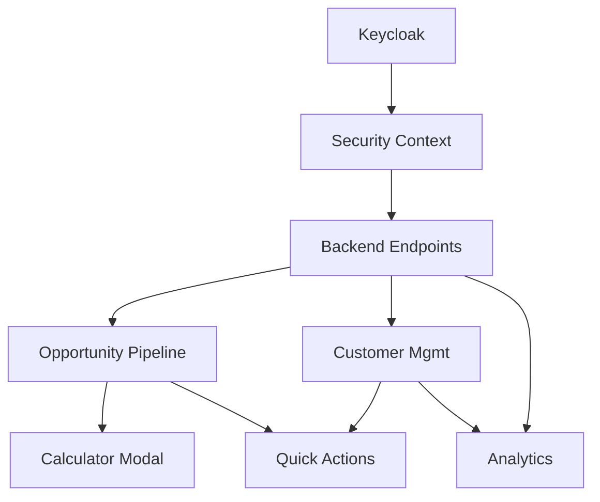

# 🎯 Optimierte Arbeitsreihenfolge für FreshPlan 2.0

**Erstellt:** 12.07.2025  
**Zweck:** Logische Reihenfolge unter Berücksichtigung von Abhängigkeiten, Quick Wins und funktionaler Vollständigkeit

## 📊 Zusammenfassung

Nach Analyse aller Module empfehle ich eine **Anpassung der ursprünglichen Planung**:

### ⚡ Quick Win Phase (1-2 Tage)
1. **Keycloak-Integration vervollständigen** (0.5 Tage)
2. **Calculator als Modal vorbereiten** (0.5 Tage)
3. **Backend Security Context** (1 Tag)

### 🚀 Core Features Phase (7-8 Tage)
4. **M4 - Opportunity Pipeline** (4.5 Tage)
5. **M8 - Calculator Integration** (0.5 Tage)
6. **Backend Performance-Endpoints** (2 Tage)

### 🔧 Consolidation Phase (5-6 Tage)
7. **M5 - Customer Management** (3.5 Tage)
8. **M2 - Kontextuelle Quick-Actions** (2 Tage)

### 📊 Enhancement Phase (5+ Tage)
9. **M6 - Embedded Analytics** (5 Tage)
10. **FC-003 bis FC-007** (35-40 Tage)

## 🎯 Detaillierte Begründung

### Warum diese Reihenfolge?

#### 1. **Keycloak First (0.5 Tage)**
```typescript
// In AuthContext.tsx - nur 2 TODOs!
const login = async () => {
  // TODO: Implement Keycloak login
  keycloak.login();
};

const logout = async () => {
  // TODO: Implement Keycloak logout
  keycloak.logout();
};
```
- **Blockiert**: Alle Backend-Endpoints mit User-Context
- **Einfach**: Nur 2 Funktionen implementieren
- **Impact**: Security von Anfang an

#### 2. **Calculator Modal Prep (0.5 Tage)**
```typescript
// Vorbereitung für M4-Integration
interface CalculatorModalProps {
  open: boolean;
  onClose: () => void;
  context: {
    opportunity?: Opportunity;
    customer?: Customer;
  };
  onComplete: (result: CalculationResult) => void;
}
```
- **Quick Win**: Zeigt Modal-Pattern
- **Wiederverwendbar**: Template für andere Modals
- **Unabhängig**: Kann ohne M4 getestet werden

#### 3. **Backend Security (1 Tag)**
```java
// CustomerResource.java - 8 TODOs
@GET
@Path("/stats")
public Response getCustomerStats() {
    // TODO: Get user from security context
    String userId = securityContext.getUserPrincipal().getName();
    return Response.ok(customerService.getStats(userId)).build();
}
```
- **Enabler**: Für alle user-spezifischen Daten
- **Parallel**: Backend-Team kann arbeiten

#### 4. **M4 - Opportunity Pipeline (4.5 Tage)**
Die **wichtigste Entscheidung**: M4 als erstes großes Feature!
- **Greenfield**: Keine Legacy-Abhängigkeiten
- **Prozess-Demo**: Zeigt Hybrid-Modell
- **Integration-Ready**: Calculator kann andocken

#### 5. **M8 - Calculator Integration (0.5 Tage)**
- **Minimal**: Nur Modal in Pipeline einbinden
- **High Impact**: Sofort nutzbar im Workflow
- **Showcase**: Prozessorientierung live

## 🔄 Abhängigkeits-Matrix



## 📈 Erwartete Ergebnisse

### Nach 1 Woche:
- ✅ Voll funktionsfähige Opportunity Pipeline
- ✅ Calculator im Workflow integriert
- ✅ Security komplett implementiert
- ✅ **Demo-fähiges System!**

### Nach 2 Wochen:
- ✅ Customer Management modernisiert
- ✅ Quick-Actions kontextuell
- ✅ Performance optimiert
- ✅ **Produktiv einsetzbar!**

## 🚨 Kritische Erfolgsfaktoren

### 1. **Feature-Toggles überall**
```typescript
if (features.opportunityPipeline.enabled) {
  // Neues Feature
} else {
  // Fallback
}
```

### 2. **Parallel-Entwicklung**
- Frontend-Team: UI-Komponenten
- Backend-Team: APIs + Security
- DevOps: CI/CD + Monitoring

### 3. **Tägliche Integration**
- Morgens: Stand-up & Blocker
- Mittags: Integration Test
- Abends: Deploy to Stage

## 💡 Alternative bei Ressourcen-Engpass

Wenn nur 1 Entwickler verfügbar:

1. **Woche 1**: Keycloak + M4 Backend
2. **Woche 2**: M4 Frontend + M8
3. **Woche 3**: M5 oder Performance

## 🎯 Empfehlung

**Beginne mit den Quick Wins!** 

Die Keycloak-Integration und Calculator-Modal-Vorbereitung sind in 1-2 Tagen erledigt und schaffen die Basis für alles weitere. Danach kann M4 als vorzeigbares Feature entwickelt werden, das den Wert des Hybrid-Modells demonstriert.

Diese Reihenfolge maximiert:
- **Frühe Erfolge** (Motivation)
- **Funktionale Vollständigkeit** (Demo-fähig)
- **Technische Solidität** (Security first)
- **Business Value** (Vertrieb profitiert schnell)