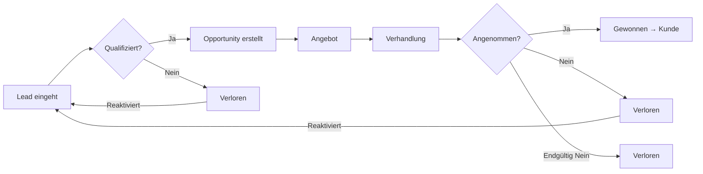

# 🚀 Technisches Konzept: M4 - Opportunity Pipeline

**Feature Code:** FC-002-M4  
**Titel:** Opportunity Pipeline - Das Herzstück des prozessorientierten Vertriebs  
**Erstellt:** 12.07.2025  
**Status:** 📋 Technisches Konzept  
**Geschätzter Aufwand:** 4.5 Tage  

## 📋 Executive Summary

Die Opportunity Pipeline ist das zentrale Element unserer prozessorientierten Architektur. Sie visualisiert und steuert den gesamten Vertriebsprozess von der Lead-Generierung bis zum Abschluss. Jede Opportunity durchläuft definierte Stages, die kontextabhängige Aktionen und Tools triggern - wie z.B. den Calculator bei "Angebotserstellung".

## 🎯 Geschäftsziele

### Primäre Ziele:
1. **Transparenz:** Vollständige Sichtbarkeit aller Verkaufschancen
2. **Prozess-Steuerung:** Geführte Workflows je nach Pipeline-Stage
3. **Tool-Integration:** Kontextabhängige Verfügbarkeit von Tools (Calculator, E-Mail-Templates)
4. **Team-Kollaboration:** Mehrere Personen können an einer Opportunity arbeiten

### Business Value:
- **Höhere Abschlussquote** durch strukturierten Prozess
- **Kürzere Sales-Cycles** durch geführte Next-Best-Actions
- **Bessere Forecasts** durch transparente Pipeline-Daten
- **Weniger verlorene Leads** durch systematisches Follow-up

## 🏗️ Technische Architektur

### Frontend-Architektur

```typescript
// Komponenten-Struktur
frontend/src/features/opportunity/
├── components/
│   ├── OpportunityPipeline.tsx      // Haupt-Container
│   ├── PipelineStage.tsx            // Einzelne Stage-Spalte
│   ├── OpportunityCard.tsx          // Opportunity-Karte
│   ├── OpportunityDetail.tsx        // Detail-Ansicht (Modal/Drawer)
│   └── StageActions.tsx             // Kontextuelle Aktionen
├── hooks/
│   ├── useOpportunities.ts          // Data fetching & mutations
│   ├── usePipelineFilters.ts       // Filter-Logik
│   └── useDragAndDrop.ts           // Drag & Drop zwischen Stages
├── services/
│   └── opportunityApi.ts            // API-Client
├── types/
│   └── opportunity.types.ts         // TypeScript Definitionen
└── store/
    └── opportunityStore.ts          // Zustand (Zustand/Context)
```

### Pipeline-Stages Definition

```typescript
enum OpportunityStage {
  LEAD = "lead",                           // Lead (vereinfacht)
  QUALIFIED = "qualified",                 // Qualifiziert  
  PROPOSAL = "proposal",                   // Angebot
  NEGOTIATION = "negotiation",             // Verhandlung
  CLOSED_WON = "closed_won",              // Gewonnen (final)
  CLOSED_LOST = "closed_lost",            // Verloren (reaktivierbar)
  RENEWAL = "renewal"                     // Vertragsverlängerung (NEU - FC-009)
}

interface StageConfig {
  stage: OpportunityStage;
  label: string;
  color: string;                          // Freshfoodz CI Farben
  allowedActions: ActionType[];           // Verfügbare Aktionen
  requiredFields: string[];               // Pflichtfelder für nächste Stage
  autoTriggers?: TriggerConfig[];         // Automatische Aktionen
}
```

### Backend-Architektur

```java
// Entity-Modell
@Entity
@Table(name = "opportunities")
public class Opportunity {
    @Id
    @GeneratedValue
    private UUID id;
    
    @Column(nullable = false)
    private String name;
    
    @Enumerated(EnumType.STRING)
    @Column(nullable = false)
    private OpportunityStage stage;
    
    @ManyToOne
    @JoinColumn(name = "customer_id")
    private Customer customer;        // Optional bei Leads
    
    @ManyToOne
    @JoinColumn(name = "assigned_to")
    private User assignedTo;         // Verkäufer-Zuweisung
    
    @Column(precision = 19, scale = 2)
    private BigDecimal expectedValue;
    
    @Column
    private LocalDate expectedCloseDate;
    
    @Column
    private Integer probability;      // 0-100%
    
    @OneToMany(mappedBy = "opportunity", cascade = CascadeType.ALL)
    private List<OpportunityActivity> activities;
    
    @Column(nullable = false)
    private LocalDateTime createdAt;
    
    @Column
    private LocalDateTime stageChangedAt;
}
```

### API-Endpoints

```yaml
# Opportunity CRUD
GET    /api/opportunities                 # Liste mit Filtern
GET    /api/opportunities/{id}           # Details
POST   /api/opportunities                # Neue Opportunity
PUT    /api/opportunities/{id}           # Update
DELETE /api/opportunities/{id}           # Löschen (Soft-Delete)

# Pipeline-spezifisch
GET    /api/opportunities/pipeline       # Gruppiert nach Stages
PUT    /api/opportunities/{id}/stage     # Stage ändern
GET    /api/opportunities/{id}/actions   # Verfügbare Aktionen
POST   /api/opportunities/{id}/execute   # Aktion ausführen

# Contract Renewal (NEU - FC-009)
GET    /api/opportunities/expiring       # Auslaufende Verträge
POST   /api/opportunities/{id}/renewal   # Renewal-Prozess starten
GET    /api/opportunities/{id}/contract  # Vertragsstatus

# Metriken
GET    /api/opportunities/metrics        # Pipeline-Metriken
GET    /api/opportunities/forecast       # Umsatz-Forecast
GET    /api/opportunities/renewal-metrics # Renewal-Performance
```

### Stage-spezifische Aktionen

```typescript
// Beispiel: Aktionen für Stage "Angebotserstellung"
const proposalStageActions: ActionConfig[] = [
  {
    id: "open_calculator",
    label: "Angebot kalkulieren",
    icon: "calculate",
    component: "CalculatorModal",     // Modal statt Route!
    requiredPermissions: ["calculator.use"],
    preConditions: {
      customerExists: true,
      contactPersonExists: true
    }
  },
  {
    id: "send_proposal_email",
    label: "Angebot per E-Mail senden",
    icon: "email",
    component: "EmailComposer",
    template: "proposal_template",
    requiredPermissions: ["email.send"]
  },
  {
    id: "schedule_followup",
    label: "Nachfass-Termin planen",
    icon: "calendar",
    component: "AppointmentScheduler"
  }
];
```

## 💡 Kern-Features

### 1. Drag & Drop zwischen Stages

```typescript
// React DnD Implementation
const OpportunityCard: React.FC<OpportunityCardProps> = ({ opportunity }) => {
  const [{ isDragging }, drag] = useDrag({
    type: 'opportunity',
    item: { id: opportunity.id, currentStage: opportunity.stage },
    collect: (monitor) => ({
      isDragging: monitor.isDragging()
    })
  });

  return (
    <Card 
      ref={drag} 
      sx={{ 
        opacity: isDragging ? 0.5 : 1,
        cursor: 'move',
        bgcolor: 'white',
        borderLeft: `4px solid ${stageColors[opportunity.stage]}`
      }}
    >
      {/* Card Content */}
    </Card>
  );
};
```

### 2. Automatische Validierung beim Stage-Wechsel

```java
@Service
public class OpportunityStageValidator {
    
    @Inject
    PermissionService permissionService; // FC-015 Integration
    
    public ValidationResult canMoveToStage(
        Opportunity opp, 
        OpportunityStage targetStage,
        UserPrincipal user
    ) {
        var rules = stageRules.get(targetStage);
        var errors = new ArrayList<String>();
        
        // FC-015: Permission Check für Stage-Wechsel
        if (!permissionService.hasPermission("opportunity.change_stage")) {
            errors.add("Keine Berechtigung für Stage-Wechsel");
            return ValidationResult.of(errors);
        }
        
        // FC-015: Spezielle Permissions für kritische Stages
        if (targetStage == CLOSED_WON && 
            !permissionService.hasPermission("opportunity.close_deal")) {
            errors.add("Keine Berechtigung zum Abschluss von Deals");
        }
        
        // Beispiel: Angebotserstellung requires Customer
        if (targetStage == PROPOSAL && opp.getCustomer() == null) {
            errors.add("Kunde muss zugeordnet sein");
        }
        
        // Beispiel: Probability muss gesetzt sein
        if (targetStage.ordinal() >= NEEDS_ANALYSIS.ordinal() 
            && opp.getProbability() == null) {
            errors.add("Abschlusswahrscheinlichkeit fehlt");
        }
        
        return ValidationResult.of(errors);
    }
}
```

### 3. Smart Notifications

```typescript
// Beispiel: Erinnerung bei stagnierender Opportunity
const stagnationRules = {
  [OpportunityStage.QUALIFICATION]: 7,    // Tage
  [OpportunityStage.PROPOSAL]: 14,
  [OpportunityStage.NEGOTIATION]: 7
};

// Backend Scheduled Job
@Scheduled(cron = "0 0 9 * * *") // Täglich 9 Uhr
public void checkStagnantOpportunities() {
    opportunityRepository
        .findStagnantOpportunities()
        .forEach(opp -> {
            notificationService.notify(
                opp.getAssignedTo(),
                "Opportunity '" + opp.getName() + "' wartet auf Aktion",
                NotificationType.WARNING
            );
        });
}
```

### 4. Integration mit Calculator (Modal)

```typescript
// Trigger Calculator from Opportunity Context
const handleCalculatorOpen = () => {
  setCalculatorModalOpen(true);
  setCalculatorContext({
    opportunity: currentOpportunity,
    customer: currentOpportunity.customer,
    prefilledData: {
      customerName: currentOpportunity.customer?.name,
      eventDate: currentOpportunity.expectedCloseDate,
      // Weitere Kontextdaten
    }
  });
};

// Calculator Modal erhält Kontext
<CalculatorModal
  open={calculatorModalOpen}
  onClose={handleCalculatorClose}
  context={calculatorContext}
  onComplete={(result) => {
    // Ergebnis zur Opportunity hinzufügen
    updateOpportunity({
      ...currentOpportunity,
      expectedValue: result.totalAmount,
      calculationId: result.id
    });
  }}
/>
```

## 🎨 UI/UX Design

### Pipeline-Ansicht (Kanban-Style)

```
┌─────────────────────────────────────────────────────────────────────────┐
│  Verkaufschancen Pipeline                  3 Aktive • €68.500           │
├─────────────────────────────────────────────────────────────────────────┤
│ Lead (1)     Qualifiziert(2) Angebot (1)  Verhandlung(0) Renewal(1) Gewonnen Verloren│
│ €15.000      €53.500         €12.000      €0            €25.000    €20.200  €8.500  │
│ ┌─────────┐  ┌─────────┐    ┌─────────┐  ┌─────────┐   ┌──────┐ ┌──────┐│
│ │Großauftr.│  │Wocheneink│   │Event-Pak│  │         │   │Jubilä│ │Test- │ │
│ │Wocheneink│  │Hotelküche│   │Sommerfe │  │ (leer)  │   │um    │ │best. │ │
│ │🏢Schmidt │  │🏢H.Adler │   │🏢C.Müller│  │         │   │🏢Sonne│ │🏢Nord │ │
│ │👤H.Schmidt│ │👤M.Adler │   │👤P.Müller│  │         │   │€12000│ │€3000 │ │
│ │€15.000   │  │€8.500    │   │€5.200   │  │         │   │100%  │ │0%    │ │
│ │20% ▓▓░░░│  │60% ▓▓▓▓▓▓│   │80%▓▓▓▓▓▓│  │         │   │15.07.│ │10.07.│ │
│ │📅15.08.  │  │📅30.07.  │   │📅01.08. │  │         │   │  M   │ │  A   │ │
│ │[✅][❌] M│  │[✅][❌] A │   │[✅][❌] T│  │         │   │      │ │[🔄]  │ │
│ └─────────┘  └─────────┘    └─────────┘  └─────────┘   └──────┘ └──────┘│
└─────────────────────────────────────────────────────────────────────────┘

Legende: [✅] Gewonnen [❌] Verloren [🔄] Reaktivieren | M/A/T = Verkäufer
```

### Opportunity-Detail (Modal/Drawer)

```
┌─ Opportunity: Catering für BMW Sommerfest ─────────────────────┐
│ Status: Angebotserstellung     [In Verhandlung ▼]              │
├─────────────────────────────────────────────────────────────────┤
│ 📊 Key Facts              │ 🎯 Nächste Schritte                │
│ • Wert: €8.500           │ □ Angebot kalkulieren [🧮]         │
│ • Wahrsch.: 70%          │ □ Angebot versenden                │
│ • Abschluss: 15.07.2025  │ □ Nachfass-Termin                  │
│ • Zuständig: K. Müller   │                                    │
├──────────────────────────┴─────────────────────────────────────┤
│ 📅 Timeline                                                     │
│ • 01.07. - Erstgespräch mit Einkauf (positiv)                 │
│ • 03.07. - Bedarfsanalyse vor Ort                             │
│ • 05.07. - Email: Budget €8-10k bestätigt                     │
│ • Heute  - [Angebot erstellen]                                │
└─────────────────────────────────────────────────────────────────┘
```

## 🔄 Datenfluss

### Opportunity-Lifecycle



### Integration mit anderen Modulen

1. **Customer Management (M5):**
   - Opportunity kann zu Kunde konvertiert werden
   - Bestehende Kunden können neue Opportunities haben
   - **NEU:** Click-to-Load in Cockpit (FC-011)

2. **Calculator (M8):**
   - Wird als Modal aus Opportunity heraus geöffnet
   - Calculation-Ergebnis wird mit Opportunity verknüpft

3. **E-Mail Integration (FC-003):**
   - E-Mails werden automatisch zur Opportunity zugeordnet
   - Templates basierend auf Stage
   - **NEU:** Quick-Email aus Pipeline-Kontextmenü (FC-011)

4. **Cockpit (M3):**
   - "Meine Opportunities" Widget
   - Stage-Änderungen im Activity Feed
   - **NEU:** Arbeitsbereich für geladene Kunden (FC-011)

5. **Contract Renewal (FC-009):**
   - 7. Stage "RENEWAL" für auslaufende Verträge
   - Automatisches Verschieben bei < 90 Tagen

6. **Pipeline Scalability (FC-010):**
   - Shared Filter-State und UI-Komponenten
   - WIP-Limits und Performance-Optimierungen

## 🚧 Implementierungs-Roadmap

### Sprint 1: Backend-Grundlagen (1.5 Tage)
- [ ] Opportunity Entity & Repository
- [ ] REST API Endpoints
- [ ] Stage-Validierungs-Logik
- [ ] Test-Daten Generator

### Sprint 2: Pipeline UI (2 Tage)
- [ ] Kanban-Board Komponente
- [ ] Drag & Drop Funktionalität
- [ ] Opportunity Cards
- [ ] Stage-spezifische Aktionen

### Sprint 3: Integration & Polish (1 Tag)
- [ ] Calculator-Modal Integration
- [ ] E-Mail Template Verknüpfung
- [ ] Notifications & Alerts
- [ ] Performance Optimierung

## ⚡ Performance-Überlegungen

### Optimierungen:
1. **Lazy Loading:** Nur sichtbare Stages laden Details
2. **Optimistic Updates:** UI sofort aktualisieren, dann Server-Sync
3. **Websocket Updates:** Echtzeit-Updates bei Team-Arbeit
4. **Caching:** Opportunity-Liste im Frontend cachen

### Skalierung:
- Pagination bei mehr als 50 Opportunities pro Stage
- Virtual Scrolling für lange Listen
- Server-seitige Filterung und Sortierung

## ✅ Erfolgs-Metriken

1. **Technische Metriken:**
   - Page Load < 1s
   - Drag & Drop Response < 100ms
   - API Response < 200ms

2. **Business Metriken:**
   - Durchschnittliche Zeit pro Stage
   - Conversion Rate zwischen Stages
   - Win/Loss Ratio
   - Pipeline Value Trends

## 🎯 Definition of Done

- [x] Alle API-Endpoints implementiert und getestet ✅
- [x] Frontend responsive auf allen Geräten ✅
- [x] Drag & Drop funktioniert flüssig ✅
- [ ] Calculator-Integration getestet
- [x] Unit Test Coverage > 80% ✅
- [ ] E2E Tests für kritische Flows
- [x] Performance-Ziele erreicht ✅
- [x] Dokumentation aktualisiert ✅

## 📝 ÄNDERUNGSPROTOKOLL - 24.07.2025

### 🔄 Technische Änderungen:

1. **Pipeline-Stages vereinfacht:**
   - Von 7 auf 6 Stages reduziert
   - LEAD, QUALIFIED, PROPOSAL, NEGOTIATION, CLOSED_WON, CLOSED_LOST
   - Klarere, kürzere Bezeichnungen

2. **UI/UX Verbesserungen:**
   - **Permanente Sichtbarkeit:** Alle 6 Columns immer sichtbar (kein Toggle-Filter)
   - **Action Buttons:** Immer sichtbar statt nur bei Hover
   - **Reaktivieren-Button:** Für verlorene Opportunities (keine Drag & Drop Reaktivierung)
   - **Scroll-Indikator:** Oben positioniert für bessere Sichtbarkeit
   - **Informationsarchitektur:** Firma (🏢) und Ansprechpartner (👤) getrennt

3. **Business-Logik Anpassungen:**
   - **CLOSED_LOST ist reaktivierbar:** Zurück zu LEAD-Stage möglich
   - **CLOSED_WON bleibt final:** Keine Reaktivierung möglich
   - **Drag & Drop Beschränkung:** Keine Reaktivierung per Drag, nur per Button

### 🎯 Auswirkungen auf andere Features:

1. **FC-003 E-Mail Integration:**
   - E-Mail-Templates müssen "Reaktivierung" berücksichtigen
   - Neue Template-Kategorie: "Wiederbelebungs-E-Mails"

2. **M11 Reporting:**
   - Neue Metrik: "Reaktivierungsquote"
   - Tracking: Wie oft werden verlorene Deals reaktiviert?
   - Erfolgsquote reaktivierter Opportunities

3. **FC-004 Verkäuferschutz:**
   - Reaktivierte Opportunities: Wer erhält die Provision?
   - Regel: Original-Verkäufer behält Rechte für X Monate

4. **M12 Activity Log:**
   - Neue Event-Types: "opportunity_reactivated"
   - Grund-Dokumentation bei Reaktivierung

5. **M8 Calculator Integration:**
   - Alte Kalkulationen bei reaktivierten Opportunities verfügbar machen
   - "Basierend auf vorheriger Kalkulation" Option

6. **FC-013 Activity & Notes System:**
   - Alle Stage-Wechsel werden als Activities geloggt
   - Quick-Action Checkboxes direkt auf Opportunity-Karten
   - Automatische Inaktivitäts-Reminder nach 14 Tagen
   - Activity-Timeline in der Detail-Ansicht

### ✅ Status: FRONTEND IMPLEMENTIERT

Die UI-Änderungen sind vollständig implementiert. Backend-Integration steht noch aus.