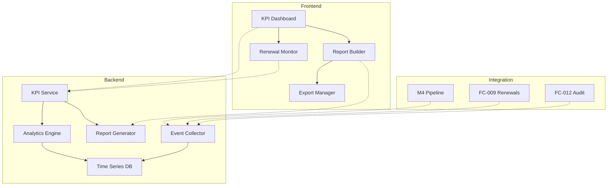

# FC-016: Technisches Konzept - KPI-Tracking & Reporting mit Renewal-Fokus

**Feature Code:** FC-016  
**Datum:** 2025-07-24  
**Status:** Draft  
**Autor:** Claude  
**Reviewer:** Jörg Streeck  

## 📋 Inhaltsverzeichnis

1. [Zusammenfassung](#zusammenfassung)
2. [Ziel und Geschäftswert](#ziel-und-geschäftswert)
3. [Technische Architektur](#technische-architektur)
4. [Backend-Implementierung](#backend-implementierung)
5. [Frontend-Implementierung](#frontend-implementierung)
6. [Implementierungsstrategie](#implementierungsstrategie)
7. [Entscheidungs-Log](#entscheidungs-log)
8. [Risiken und Mitigationen](#risiken-und-mitigationen)
9. [Zeitschätzung](#zeitschätzung)

## Zusammenfassung

Ein umfassendes KPI-Tracking & Reporting System mit Fokus auf Renewal-Management. Das System ermöglicht die Verfolgung von Kennzahlen wie Renewal-Quote, durchschnittlicher Zeit bis zum Vertragsabschluss und der Entwicklung verlagerter Deals im Zeitverlauf. Integriert sich nahtlos in bestehende Features (M4, FC-009, FC-011).

## Ziel und Geschäftswert

### Geschäftsziele
- **Transparenz**: Renewal-Performance auf einen Blick erfassen (Renewal-Quote >85% anstreben)
- **Früherkennung**: Gefährdete Renewals identifizieren bevor es zu spät ist (30-60 Tage vorher)
- **Optimierung**: Verkaufsprozesse durch Zeitanalysen verbessern (Zeit bis Abschluss um 20% reduzieren)
- **Forecasting**: Verlässliche Vorhersagen für verlagerte Deals und Renewals

### Technische Ziele
- **Performance**: Komplexe KPI-Berechnungen in <500ms
- **Skalierbarkeit**: Materialized Views für historische Daten
- **Real-Time**: Live-Updates für kritische Metriken via WebSocket
- **Export**: Standardisierte Berichte in PDF/Excel/CSV via **[Universal Export Framework](/Users/joergstreeck/freshplan-sales-tool/docs/features/UNIVERSAL_EXPORT_FRAMEWORK_PLAN.md)**

## Technische Architektur

### System-Übersicht



### Komponenten-Interaktion

1. **Event Collection**: Alle relevanten Events aus M4, FC-009 und FC-012 werden gesammelt
2. **Time Series Storage**: Optimierte Speicherung für zeitbasierte Analysen
3. **Real-Time Calculation**: KPIs werden bei jedem Event neu berechnet
4. **Historical Analysis**: Batch-Jobs für Trend-Analysen

## Backend-Implementierung

### 1. API Endpoints

```java
@Path("/api/kpi")
@RolesAllowed({"admin", "manager", "sales"})
public class KpiResource {
    
    @GET
    @Path("/renewal-metrics")
    public RenewalMetrics getRenewalMetrics(
        @QueryParam("from") LocalDate from,
        @QueryParam("to") LocalDate to,
        @QueryParam("teamId") UUID teamId
    ) {
        // Renewal-Quote, durchschnittliche Renewal-Zeit
    }
    
    @GET
    @Path("/deal-velocity")
    public DealVelocityMetrics getDealVelocity(
        @QueryParam("stageFrom") String stageFrom,
        @QueryParam("stageTo") String stageTo
    ) {
        // Zeit zwischen Stages, Bottlenecks
    }
    
    @GET
    @Path("/pipeline-trends")
    @Produces(MediaType.SERVER_SENT_EVENTS)
    public Multi<PipelineTrend> streamPipelineTrends() {
        // Real-time Updates für verlagerte Deals
    }
    
    @POST
    @Path("/reports/generate")
    public Response generateReport(ReportRequest request) {
        // AKTUALISIERT: Nutzt Universal Export Framework
        // Siehe: /Users/joergstreeck/freshplan-sales-tool/docs/features/UNIVERSAL_EXPORT_FRAMEWORK_PLAN.md
        // Keine Code-Duplikation, zentrale Export-Logik für alle Formate
    }
}
```

### 2. Datenmodell

```java
@Entity
@Table(name = "kpi_snapshots")
public class KpiSnapshot {
    @Id
    UUID id;
    
    @Enumerated(EnumType.STRING)
    KpiType type; // RENEWAL_QUOTE, DEAL_VELOCITY, etc.
    
    LocalDateTime timestamp;
    
    @ManyToOne
    User owner; // Für team-spezifische KPIs
    
    @Type(type = "jsonb")
    @Column(columnDefinition = "jsonb")
    Map<String, Object> metrics;
    
    @Type(type = "jsonb")
    @Column(columnDefinition = "jsonb")
    Map<String, Object> dimensions; // team, product, region
}

@Entity
@Table(name = "deal_transitions")
public class DealTransition {
    @Id
    UUID id;
    
    @ManyToOne
    Opportunity opportunity;
    
    String fromStage;
    String toStage;
    LocalDateTime transitionTime;
    
    @ManyToOne
    User performedBy;
    
    // Für Renewal-Tracking
    Boolean isRenewal;
    LocalDate originalContractEnd;
    LocalDate newContractEnd;
}
```

### 3. Business Logic

```java
@ApplicationScoped
public class KpiCalculationService {
    
    @Inject
    OpportunityRepository opportunityRepo;
    
    @Inject
    DealTransitionRepository transitionRepo;
    
    public RenewalMetrics calculateRenewalMetrics(LocalDate from, LocalDate to) {
        // 1. Alle Renewals im Zeitraum
        var renewals = opportunityRepo.findRenewalsInPeriod(from, to);
        
        // 2. Erfolgsquote berechnen
        var successfulRenewals = renewals.stream()
            .filter(o -> o.getStage().equals("CLOSED_WON"))
            .count();
        
        var renewalQuote = (double) successfulRenewals / renewals.size() * 100;
        
        // 3. Durchschnittliche Zeit berechnen
        var avgRenewalTime = calculateAverageRenewalTime(renewals);
        
        // 4. Verlagerte Deals analysieren
        var deferredDeals = analyzeDefferredDeals(renewals);
        
        return RenewalMetrics.builder()
            .renewalQuote(renewalQuote)
            .averageRenewalTime(avgRenewalTime)
            .deferredDeals(deferredDeals)
            .period(Period.between(from, to))
            .build();
    }
    
    @Scheduled(every = "1h")
    void createHourlySnapshot() {
        // Stündliche KPI-Snapshots für Trends
        var snapshot = new KpiSnapshot();
        snapshot.type = KpiType.HOURLY_PIPELINE;
        snapshot.timestamp = LocalDateTime.now();
        snapshot.metrics = calculateCurrentPipelineMetrics();
        
        kpiSnapshotRepo.persist(snapshot);
        
        // Event für Real-Time Dashboard
        eventBus.send("kpi.snapshot.created", snapshot);
    }
}
```

### 4. Datenbank-Änderungen

```sql
-- Materialized View für Performance
CREATE MATERIALIZED VIEW mv_renewal_performance AS
SELECT 
    DATE_TRUNC('month', o.created_at) as month,
    COUNT(*) FILTER (WHERE o.stage = 'CLOSED_WON') as won_renewals,
    COUNT(*) as total_renewals,
    AVG(EXTRACT(EPOCH FROM (o.closed_at - o.created_at))/86400) as avg_days_to_close,
    COUNT(*) FILTER (WHERE o.expected_close_date != o.closed_at) as deferred_count
FROM opportunities o
WHERE o.is_renewal = true
GROUP BY DATE_TRUNC('month', o.created_at);

-- Index für schnelle Zeitbereichs-Queries
CREATE INDEX idx_deal_transitions_time ON deal_transitions(transition_time);
CREATE INDEX idx_kpi_snapshots_lookup ON kpi_snapshots(type, timestamp);
```

## Frontend-Implementierung

### 1. Komponenten-Struktur

```typescript
// features/kpi-tracking/
├── components/
│   ├── KpiDashboard.tsx          // Haupt-Dashboard
│   ├── RenewalMetricsCard.tsx    // Renewal-spezifische KPIs
│   ├── DealVelocityChart.tsx     // Zeit-bis-Abschluss Visualisierung
│   ├── TrendAnalysis.tsx         // Zeitverlauf-Diagramme
│   └── ReportBuilder.tsx         // Custom Report Generator
├── hooks/
│   ├── useKpiMetrics.ts          // Real-time KPI Updates
│   ├── useRenewalTracking.ts     // Renewal-spezifische Hooks
│   └── useReportGeneration.ts    // Report Export
├── services/
│   ├── kpiApi.ts                 // API Integration
│   └── chartDataTransformer.ts   // Daten für Charts aufbereiten
└── types/
    └── kpi.types.ts              // TypeScript Definitionen
```

### 2. State Management

```typescript
// store/kpiStore.ts
interface KpiState {
    // Real-time Metriken
    currentMetrics: {
        renewalQuote: number;
        avgTimeToClose: number;
        openOpportunities: number;
        closedOpportunities: number;
    };
    
    // Historische Daten für Trends
    historicalData: {
        renewalTrends: RenewalTrend[];
        dealVelocity: DealVelocityPoint[];
        deferredDeals: DeferredDealAnalysis[];
    };
    
    // Filter & Einstellungen
    filters: {
        dateRange: DateRange;
        teams: string[];
        dealTypes: DealType[];
    };
}

const useKpiStore = create<KpiState>((set, get) => ({
    currentMetrics: initialMetrics,
    historicalData: {},
    filters: defaultFilters,
    
    updateMetrics: (metrics) => set({ currentMetrics: metrics }),
    
    subscribeToRealTimeUpdates: () => {
        const eventSource = new EventSource('/api/kpi/pipeline-trends');
        eventSource.onmessage = (event) => {
            const trend = JSON.parse(event.data);
            set(state => ({
                historicalData: {
                    ...state.historicalData,
                    renewalTrends: [...state.historicalData.renewalTrends, trend]
                }
            }));
        };
    }
}));
```

### 3. UI/UX Design

```tsx
// Renewal Metrics Card Component
const RenewalMetricsCard: React.FC = () => {
    const { renewalQuote, avgRenewalTime } = useKpiMetrics();
    
    return (
        <Card>
            <CardHeader>
                <Typography variant="h6">Renewal Performance</Typography>
                <IconButton onClick={onRefresh}>
                    <RefreshIcon />
                </IconButton>
            </CardHeader>
            <CardContent>
                <Grid container spacing={2}>
                    <Grid item xs={6}>
                        <MetricDisplay
                            label="Renewal Quote"
                            value={`${renewalQuote}%`}
                            trend={renewalTrend}
                            target={85}
                            format="percentage"
                        />
                    </Grid>
                    <Grid item xs={6}>
                        <MetricDisplay
                            label="Ø Zeit bis Abschluss"
                            value={`${avgRenewalTime} Tage`}
                            trend={timeTrend}
                            format="days"
                        />
                    </Grid>
                </Grid>
                
                <Box mt={2}>
                    <MiniChart
                        data={last30DaysRenewalData}
                        type="area"
                        height={100}
                    />
                </Box>
            </CardContent>
        </Card>
    );
};
```

### 4. Integration

```typescript
// Integration mit bestehenden Features
const KpiDashboard: React.FC = () => {
    // Integration mit M4 Pipeline
    const { opportunities } = useOpportunityPipeline();
    
    // Integration mit FC-009 Renewals
    const { upcomingRenewals } = useContractRenewals();
    
    // Integration mit FC-012 Audit Trail
    const { recentActivities } = useAuditTrail({
        entities: ['Opportunity', 'Contract'],
        limit: 100
    });
    
    // KPI Berechnung basierend auf integrierten Daten
    const kpis = useMemo(() => 
        calculateKpis(opportunities, upcomingRenewals, recentActivities),
        [opportunities, upcomingRenewals, recentActivities]
    );
    
    return (
        <DashboardLayout>
            <Grid container spacing={3}>
                {/* KPI Cards */}
                <Grid item xs={12} md={6}>
                    <RenewalMetricsCard data={kpis.renewals} />
                </Grid>
                <Grid item xs={12} md={6}>
                    <DealVelocityCard data={kpis.velocity} />
                </Grid>
                
                {/* Trend Charts */}
                <Grid item xs={12}>
                    <TrendAnalysisChart 
                        data={kpis.trends}
                        onDrillDown={handleDrillDown}
                    />
                </Grid>
                
                {/* Deferred Deals Analysis */}
                <Grid item xs={12}>
                    <DeferredDealsTable 
                        deals={kpis.deferredDeals}
                        onActionRequired={handleActionRequired}
                    />
                </Grid>
            </Grid>
        </DashboardLayout>
    );
};
```

## Implementierungsstrategie

### Phase 1: Backend Foundation (3 Tage)

#### Sprint 1.1: Datenmodell & Event Collection (2 Tage)
1. **Tag 1**: 
   - KpiSnapshot und DealTransition Entities
   - Event Listener für M4, FC-009, FC-012
   - Datenbank-Migration
2. **Tag 2**: 
   - KpiCalculationService Grundgerüst
   - Erste Unit Tests
   - Materialized View Setup

#### Sprint 1.2: API & Business Logic (1 Tag)
1. **Tag 3**: 
   - REST Endpoints implementieren
   - Renewal Metrics Berechnung
   - Integration Tests

### Phase 2: Frontend Dashboard (3 Tage)

#### Sprint 2.1: Komponenten-Entwicklung (2 Tage)
1. **Tag 4**: 
   - KpiDashboard Layout
   - RenewalMetricsCard
   - Store Setup
2. **Tag 5**: 
   - Chart-Komponenten
   - Real-time Updates
   - Responsive Design

#### Sprint 2.2: Integration & Polish (1 Tag)
1. **Tag 6**: 
   - Integration mit M4, FC-009
   - Error Handling
   - Loading States

### Phase 3: Reporting & Export (2 Tage)

#### Sprint 3.1: Report Builder (1 Tag)
1. **Tag 7**: 
   - Report Builder UI
   - Template System
   - Preview Funktion

#### Sprint 3.2: Export Implementation (1 Tag)
1. **Tag 8**: 
   - Universal Export Framework Integration
   - Alle Formate (PDF, Excel, CSV, JSON) über zentralen Service
   - Scheduled Reports

### Phase 4: Testing & Documentation (1 Tag)

1. **Tag 9**: 
   - E2E Tests
   - Performance Tests
   - Dokumentation

## Entscheidungs-Log

### 2025-07-24 - Time Series Storage
**Entscheidung**: PostgreSQL mit TimescaleDB Extension statt separater Time Series DB  
**Begründung**: Reduziert Komplexität, PostgreSQL bereits vorhanden  
**Impact**: Einfachere Wartung, aber potentiell weniger Performance bei sehr großen Datenmengen  
**Alternativen**: InfluxDB, Prometheus  
**Entscheider**: Claude (zur Review)

### 2025-07-24 - Real-Time Updates
**Entscheidung**: Server-Sent Events (SSE) statt WebSockets  
**Begründung**: Unidirektionale Updates ausreichend, einfacher zu implementieren  
**Impact**: Keine bidirektionale Kommunikation möglich  
**Alternativen**: WebSockets, Long Polling  
**Entscheider**: Claude (zur Review)

## Risiken und Mitigationen

### Risiko 1: Performance bei großen Datenmengen
**Wahrscheinlichkeit**: Mittel  
**Impact**: Hoch  
**Mitigation**: 
- Materialized Views für häufige Queries
- Pagination für historische Daten
- Caching-Layer (Redis) vorbereiten

### Risiko 2: Dateninkonsistenz bei Event-basierter Architektur
**Wahrscheinlichkeit**: Niedrig  
**Impact**: Hoch  
**Mitigation**: 
- Event Sourcing mit Replay-Möglichkeit
- Regelmäßige Konsistenz-Checks
- Audit Trail Integration (FC-012)

### Risiko 3: Komplexität der Renewal-Logik
**Wahrscheinlichkeit**: Hoch  
**Impact**: Mittel  
**Mitigation**: 
- Enge Abstimmung mit Business
- Iterative Entwicklung
- Flexible Regel-Engine

## Zeitschätzung

**Gesamt-Aufwand**: 9-11 Tage

- **Backend**: 3 Tage
- **Frontend**: 3 Tage  
- **Integration & Testing**: 2 Tage
- **Dokumentation**: 1 Tag

**Puffer**: +2 Tage für unvorhergesehene Probleme

---

**Status-Updates**:
- 2025-07-24: Konzept erstellt (Draft)