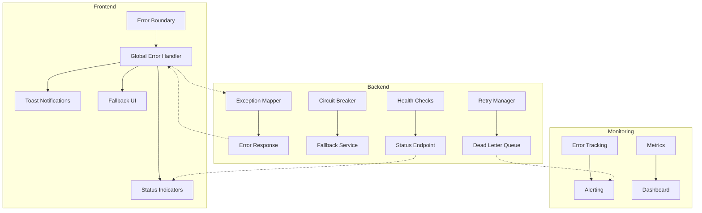

# FC-017: Technisches Konzept - Fehler- und Ausnahmehandling System

**Feature Code:** FC-017  
**Datum:** 2025-07-25  
**Status:** Draft (100% - Detail-Dokumente erstellt)  
**Autor:** Claude  
**Reviewer:** Jörg Streeck  

## 📋 Inhaltsverzeichnis

1. [Zusammenfassung](#zusammenfassung)
2. [Ziel und Geschäftswert](#ziel-und-geschäftswert)
3. [Technische Architektur](#technische-architektur)
4. [Backend-Implementierung](#backend-implementierung)
5. [Frontend-Implementierung](#frontend-implementierung)
6. [Implementierungsstrategie](#implementierungsstrategie)
7. [Entscheidungs-Log](#entscheidungs-log)
8. [Risiken und Mitigationen](#risiken-und-mitigationen)
9. [Zeitschätzung](#zeitschätzung)

## Zusammenfassung

Ein umfassendes Fehlerbehandlungssystem, das klare Benutzerführung bei Sync-/API-Fehlern bietet, mit sichtbaren Statusanzeigen auf UI-Komponenten, direkten Notifikationen an betroffene Personen und robusten Fallback-Mechanismen für temporäre Ausfälle externer Systeme (Xentral, E-Mail-Provider, etc.).

## Ziel und Geschäftswert

### Geschäftsziele
- **Transparenz**: Nutzer verstehen sofort, wenn etwas schiefläuft und warum
- **Vertrauen**: System arbeitet auch bei Teilausfällen weiter (degraded mode)
- **Produktivität**: Keine blockierten Workflows durch externe Ausfälle
- **Support-Reduktion**: Weniger Anrufe durch selbsterklärende Fehlermeldungen

### Technische Ziele
- **Resilience**: Circuit Breaker Pattern für externe Services
- **Observability**: Vollständiges Error Tracking und Monitoring
- **User Experience**: Konsistente, hilfreiche Fehlerkommunikation
- **Recovery**: Automatische Wiederherstellung nach Ausfällen

## Technische Architektur

### System-Übersicht



### Error-Kategorien

```typescript
enum ErrorCategory {
    // User Errors (4xx)
    VALIDATION_ERROR = "VALIDATION_ERROR",
    AUTHENTICATION_ERROR = "AUTHENTICATION_ERROR",
    AUTHORIZATION_ERROR = "AUTHORIZATION_ERROR",
    NOT_FOUND = "NOT_FOUND",
    
    // System Errors (5xx)
    INTERNAL_ERROR = "INTERNAL_ERROR",
    SERVICE_UNAVAILABLE = "SERVICE_UNAVAILABLE",
    
    // Integration Errors
    XENTRAL_ERROR = "XENTRAL_ERROR",
    EMAIL_PROVIDER_ERROR = "EMAIL_PROVIDER_ERROR",
    KEYCLOAK_ERROR = "KEYCLOAK_ERROR",
    
    // Business Logic Errors
    BUSINESS_RULE_VIOLATION = "BUSINESS_RULE_VIOLATION",
    CONCURRENCY_CONFLICT = "CONCURRENCY_CONFLICT",
    QUOTA_EXCEEDED = "QUOTA_EXCEEDED"
}
```

## Backend-Implementierung

### 1. Global Exception Handler

```java
@Provider
@Priority(Priorities.USER)
public class GlobalExceptionMapper implements ExceptionMapper<Throwable> {
    
    @Inject
    ErrorTrackingService errorTracker;
    
    @Inject
    NotificationService notificationService;
    
    @Override
    public Response toResponse(Throwable exception) {
        ErrorResponse errorResponse = buildErrorResponse(exception);
        
        // Track error for monitoring
        errorTracker.track(errorResponse);
        
        // Notify affected users if necessary
        if (shouldNotifyUsers(exception)) {
            notificationService.notifyAffectedUsers(errorResponse);
        }
        
        return Response
            .status(errorResponse.getStatus())
            .entity(errorResponse)
            .build();
    }
    
    private ErrorResponse buildErrorResponse(Throwable exception) {
        if (exception instanceof BusinessException) {
            return handleBusinessException((BusinessException) exception);
        } else if (exception instanceof IntegrationException) {
            return handleIntegrationException((IntegrationException) exception);
        } else if (exception instanceof ValidationException) {
            return handleValidationException((ValidationException) exception);
        }
        
        // Default internal error
        return ErrorResponse.builder()
            .errorId(UUID.randomUUID().toString())
            .category(ErrorCategory.INTERNAL_ERROR)
            .message("Ein unerwarteter Fehler ist aufgetreten")
            .userAction("Bitte versuchen Sie es später erneut")
            .timestamp(Instant.now())
            .build();
    }
}
```

### 2. Circuit Breaker für externe Services

```java
@ApplicationScoped
public class XentralServiceClient {
    
    @Inject
    @RestClient
    XentralApi xentralApi;
    
    private final CircuitBreaker circuitBreaker = CircuitBreaker.builder()
        .failureThreshold(5)
        .successThreshold(3)
        .delay(Duration.ofSeconds(30))
        .build();
    
    public CompletionStage<CustomerData> getCustomerData(String customerId) {
        return circuitBreaker.callAsync(() -> 
            xentralApi.getCustomer(customerId)
                .thenApply(this::mapToCustomerData)
        ).exceptionally(throwable -> {
            if (circuitBreaker.getState() == CircuitBreaker.State.OPEN) {
                // Use fallback
                return fallbackService.getCachedCustomerData(customerId)
                    .orElseThrow(() -> new ServiceUnavailableException(
                        "Xentral ist momentan nicht erreichbar",
                        "cached_data_not_available"
                    ));
            }
            throw new IntegrationException("Xentral", throwable);
        });
    }
}
```

### 3. Fallback Service

```java
@ApplicationScoped
public class FallbackService {
    
    @Inject
    CacheManager cache;
    
    @Inject
    LocalDataRepository localRepo;
    
    public Optional<CustomerData> getCachedCustomerData(String customerId) {
        // 1. Try cache first
        var cached = cache.get(cacheKey(customerId), CustomerData.class);
        if (cached != null) {
            return Optional.of(cached);
        }
        
        // 2. Try local database snapshot
        return localRepo.findLastKnownState(customerId)
            .map(this::toCustomerData);
    }
    
    public void createOfflineOperation(OfflineOperation operation) {
        // Queue for later sync
        offlineQueue.add(operation);
        
        // Notify user
        notificationService.notify(
            operation.getUserId(),
            "Operation wird ausgeführt sobald die Verbindung wiederhergestellt ist"
        );
    }
}
```

### 4. Health Check System

```java
@Path("/health")
@Produces(MediaType.APPLICATION_JSON)
public class HealthResource {
    
    @Inject
    ServiceHealthChecker healthChecker;
    
    @GET
    @Path("/services")
    public ServiceHealthStatus getServiceHealth() {
        return ServiceHealthStatus.builder()
            .xentral(healthChecker.checkXentral())
            .email(healthChecker.checkEmailProviders())
            .keycloak(healthChecker.checkKeycloak())
            .database(healthChecker.checkDatabase())
            .timestamp(Instant.now())
            .build();
    }
    
    @GET
    @Path("/ready")
    public Response readinessCheck() {
        var criticalServices = healthChecker.checkCriticalServices();
        
        if (criticalServices.allHealthy()) {
            return Response.ok().build();
        }
        
        // Degraded mode - some services down
        return Response.status(503)
            .entity(criticalServices)
            .build();
    }
}

@ApplicationScoped
public class ServiceHealthChecker {
    
    @Scheduled(every = "30s")
    void performHealthChecks() {
        var results = Map.of(
            "xentral", checkXentral(),
            "email", checkEmailProviders(),
            "keycloak", checkKeycloak()
        );
        
        // Update status cache
        statusCache.put("service-health", results);
        
        // Notify if status changed
        results.forEach((service, status) -> {
            if (statusChanged(service, status)) {
                eventBus.publish(new ServiceStatusChangedEvent(service, status));
            }
        });
    }
}
```

### 5. Retry & Recovery Manager

```java
@ApplicationScoped
public class RetryManager {
    
    @Inject
    DeadLetterQueue dlq;
    
    public <T> CompletionStage<T> executeWithRetry(
        Supplier<CompletionStage<T>> operation,
        RetryPolicy policy
    ) {
        return executeWithRetryInternal(operation, policy, 0);
    }
    
    private <T> CompletionStage<T> executeWithRetryInternal(
        Supplier<CompletionStage<T>> operation,
        RetryPolicy policy,
        int attempt
    ) {
        return operation.get()
            .exceptionally(throwable -> {
                if (attempt >= policy.getMaxAttempts()) {
                    // Send to DLQ
                    dlq.send(new FailedOperation(operation, throwable, attempt));
                    throw new RetryExhaustedException(throwable);
                }
                
                if (policy.shouldRetry(throwable)) {
                    Duration delay = policy.getDelay(attempt);
                    return Uni.createFrom().item(() -> null)
                        .onItem().delayIt().by(delay)
                        .onItem().transformToUni(__ -> 
                            executeWithRetryInternal(operation, policy, attempt + 1)
                        )
                        .await().indefinitely();
                }
                
                throw new CompletionException(throwable);
            });
    }
}
```

## Frontend-Implementierung

### 1. Global Error Boundary

```tsx
class GlobalErrorBoundary extends Component<Props, State> {
    state = { hasError: false, error: null };
    
    static getDerivedStateFromError(error: Error) {
        return { hasError: true, error };
    }
    
    componentDidCatch(error: Error, errorInfo: ErrorInfo) {
        // Log to error tracking service
        errorTracker.logError(error, errorInfo);
        
        // Show user-friendly notification
        showErrorNotification({
            title: 'Ein Fehler ist aufgetreten',
            message: this.getUserMessage(error),
            action: this.getRecoveryAction(error)
        });
    }
    
    render() {
        if (this.state.hasError) {
            return <ErrorFallbackUI 
                error={this.state.error}
                onRetry={() => this.setState({ hasError: false })}
            />;
        }
        
        return this.props.children;
    }
}
```

### 2. Status Indicators für Komponenten

```tsx
interface StatusIndicatorProps {
    syncStatus: SyncStatus;
    lastSync?: Date;
    onRetry?: () => void;
}

const StatusIndicator: React.FC<StatusIndicatorProps> = ({
    syncStatus,
    lastSync,
    onRetry
}) => {
    const getStatusIcon = () => {
        switch (syncStatus) {
            case 'synced':
                return <CheckCircleIcon color="success" />;
            case 'syncing':
                return <CircularProgress size={16} />;
            case 'error':
                return <ErrorIcon color="error" />;
            case 'offline':
                return <CloudOffIcon color="disabled" />;
            default:
                return <HelpIcon />;
        }
    };
    
    const getStatusMessage = () => {
        switch (syncStatus) {
            case 'synced':
                return `Synchronisiert ${formatRelativeTime(lastSync)}`;
            case 'syncing':
                return 'Wird synchronisiert...';
            case 'error':
                return 'Synchronisation fehlgeschlagen';
            case 'offline':
                return 'Offline-Modus';
        }
    };
    
    return (
        <Box display="flex" alignItems="center" gap={1}>
            <Tooltip title={getStatusMessage()}>
                <Box>{getStatusIcon()}</Box>
            </Tooltip>
            
            {syncStatus === 'error' && onRetry && (
                <IconButton size="small" onClick={onRetry}>
                    <RefreshIcon fontSize="small" />
                </IconButton>
            )}
        </Box>
    );
};
```

### 3. Opportunity Card mit Status

```tsx
const OpportunityCard: React.FC<OpportunityCardProps> = ({ opportunity }) => {
    const { syncStatus, syncError } = useOpportunitySync(opportunity.id);
    
    return (
        <Card 
            sx={{ 
                position: 'relative',
                border: syncError ? '1px solid' : 'none',
                borderColor: 'error.main'
            }}
        >
            {/* Status Indicator in Top Right */}
            <Box position="absolute" top={8} right={8}>
                <StatusIndicator 
                    syncStatus={syncStatus}
                    lastSync={opportunity.lastSyncedAt}
                    onRetry={() => retrySync(opportunity.id)}
                />
            </Box>
            
            <CardContent>
                {/* Opportunity Content */}
                <Typography variant="h6">{opportunity.title}</Typography>
                
                {/* Error Message if sync failed */}
                {syncError && (
                    <Alert severity="error" sx={{ mt: 1 }}>
                        <AlertTitle>Synchronisation fehlgeschlagen</AlertTitle>
                        {syncError.userMessage || 'Die Änderungen konnten nicht gespeichert werden.'}
                        <Box mt={1}>
                            <Button size="small" onClick={() => retrySync(opportunity.id)}>
                                Erneut versuchen
                            </Button>
                        </Box>
                    </Alert>
                )}
                
                {/* Offline Mode Indicator */}
                {opportunity.hasLocalChanges && (
                    <Chip
                        icon={<CloudOffIcon />}
                        label="Lokale Änderungen"
                        size="small"
                        color="warning"
                    />
                )}
            </CardContent>
        </Card>
    );
};
```

### 4. Service Status Dashboard

```tsx
const ServiceStatusDashboard: React.FC = () => {
    const { services, refresh } = useServiceHealth();
    
    return (
        <Paper sx={{ p: 2 }}>
            <Box display="flex" justifyContent="space-between" mb={2}>
                <Typography variant="h6">System Status</Typography>
                <IconButton onClick={refresh}>
                    <RefreshIcon />
                </IconButton>
            </Box>
            
            <Grid container spacing={2}>
                {Object.entries(services).map(([name, status]) => (
                    <Grid item xs={12} sm={6} md={3} key={name}>
                        <ServiceStatusCard
                            serviceName={name}
                            status={status}
                            onViewDetails={() => showServiceDetails(name)}
                        />
                    </Grid>
                ))}
            </Grid>
            
            {hasAnyServiceDown(services) && (
                <Alert severity="warning" sx={{ mt: 2 }}>
                    <AlertTitle>Eingeschränkter Betrieb</AlertTitle>
                    Einige externe Services sind nicht erreichbar. 
                    Das System arbeitet im Offline-Modus für betroffene Funktionen.
                </Alert>
            )}
        </Paper>
    );
};
```

### 5. Notification System

```tsx
interface NotificationService {
    notify(options: NotificationOptions): void;
    notifyError(error: AppError): void;
    notifyOfflineMode(): void;
    notifyBackOnline(): void;
}

const useNotifications = (): NotificationService => {
    const { enqueueSnackbar } = useSnackbar();
    const { user } = useAuth();
    
    const notify = (options: NotificationOptions) => {
        enqueueSnackbar(options.message, {
            variant: options.severity || 'info',
            action: options.action,
            persist: options.persist,
            anchorOrigin: {
                vertical: 'bottom',
                horizontal: 'right'
            }
        });
        
        // Also send to notification center
        if (options.important) {
            notificationApi.create({
                userId: user.id,
                ...options
            });
        }
    };
    
    const notifyError = (error: AppError) => {
        const action = error.recoverable ? (
            <Button color="inherit" size="small" onClick={error.onRetry}>
                Wiederholen
            </Button>
        ) : undefined;
        
        notify({
            message: error.userMessage || 'Ein Fehler ist aufgetreten',
            severity: 'error',
            action,
            important: error.severity === 'high'
        });
    };
    
    return {
        notify,
        notifyError,
        notifyOfflineMode: () => notify({
            message: 'Offline-Modus aktiviert. Änderungen werden lokal gespeichert.',
            severity: 'warning',
            persist: true
        }),
        notifyBackOnline: () => notify({
            message: 'Verbindung wiederhergestellt. Synchronisierung läuft...',
            severity: 'success'
        })
    };
};
```

### 6. Offline Mode Handler

```tsx
const OfflineModeProvider: React.FC<PropsWithChildren> = ({ children }) => {
    const [isOnline, setIsOnline] = useState(navigator.onLine);
    const [serviceStatus, setServiceStatus] = useState<ServiceStatus>({});
    const notifications = useNotifications();
    
    useEffect(() => {
        const handleOnline = () => {
            setIsOnline(true);
            notifications.notifyBackOnline();
            // Trigger sync
            syncManager.syncPendingChanges();
        };
        
        const handleOffline = () => {
            setIsOnline(false);
            notifications.notifyOfflineMode();
        };
        
        window.addEventListener('online', handleOnline);
        window.addEventListener('offline', handleOffline);
        
        // Check service health
        const interval = setInterval(async () => {
            const health = await checkServiceHealth();
            setServiceStatus(health);
        }, 30000);
        
        return () => {
            window.removeEventListener('online', handleOnline);
            window.removeEventListener('offline', handleOffline);
            clearInterval(interval);
        };
    }, []);
    
    return (
        <OfflineModeContext.Provider value={{ isOnline, serviceStatus }}>
            {children}
        </OfflineModeContext.Provider>
    );
};
```

## Implementierungsstrategie

### Phase 1: Backend Error Infrastructure (2 Tage)

#### Sprint 1.1: Exception Handling (1 Tag)
1. **Tag 1**: 
   - Global Exception Mapper
   - Error Response DTOs
   - Business Exception Hierarchy
   - Error Tracking Service

#### Sprint 1.2: Circuit Breaker & Health Checks (1 Tag)
1. **Tag 2**: 
   - Circuit Breaker für Xentral
   - Health Check Endpoints
   - Service Status Cache

### Phase 2: Frontend Error Handling (2 Tage)

#### Sprint 2.1: Error Boundaries & Notifications (1 Tag)
1. **Tag 3**: 
   - Global Error Boundary
   - Notification System
   - Error Recovery Actions

#### Sprint 2.2: Status Indicators (1 Tag)
1. **Tag 4**: 
   - Status Indicator Component
   - Card Status Integration
   - Service Status Dashboard

### Phase 3: Offline & Recovery (2 Tage)

#### Sprint 3.1: Offline Mode (1 Tag)
1. **Tag 5**: 
   - Offline Mode Provider
   - Local Storage Queue
   - Sync Manager

#### Sprint 3.2: Recovery Mechanisms (1 Tag)
1. **Tag 6**: 
   - Retry Manager
   - Dead Letter Queue
   - Auto-Recovery Logic

### Phase 4: Testing & Documentation (1 Tag)

1. **Tag 7**: 
   - Error Scenario Tests
   - Integration Tests
   - User Documentation

## Entscheidungs-Log

### 2025-07-25 - Circuit Breaker Library
**Entscheidung**: Eigene Implementation statt Library  
**Begründung**: Volle Kontrolle über Verhalten, keine zusätzliche Dependency  
**Impact**: Mehr Entwicklungsaufwand, aber bessere Anpassbarkeit  
**Alternativen**: Resilience4j, Hystrix  
**Entscheider**: Claude (zur Review)

### 2025-07-25 - Error ID Generation
**Entscheidung**: UUID für jeden Error  
**Begründung**: Eindeutige Identifikation für Support  
**Impact**: Einfacheres Debugging und Tracking  
**Alternativen**: Timestamp-basierte IDs, Sequenznummern  
**Entscheider**: Claude (zur Review)

## Risiken und Mitigationen

### Risiko 1: Zu viele Notifications
**Wahrscheinlichkeit**: Hoch  
**Impact**: Mittel  
**Mitigation**: 
- Notification Throttling
- Gruppierung ähnlicher Fehler
- User Preferences für Notification Level

### Risiko 2: Performance Impact durch Health Checks
**Wahrscheinlichkeit**: Mittel  
**Impact**: Niedrig  
**Mitigation**: 
- Caching von Health Status
- Asynchrone Checks
- Configurable Check Intervals

### Risiko 3: Inkonsistente Error Messages
**Wahrscheinlichkeit**: Hoch  
**Impact**: Mittel  
**Mitigation**: 
- Zentralisierte Message Templates
- i18n Integration
- Review Process für neue Messages

## Zeitschätzung

**Gesamt-Aufwand**: 7-8 Tage

- **Backend**: 2 Tage
- **Frontend**: 2 Tage  
- **Integration & Recovery**: 2 Tage
- **Testing & Dokumentation**: 1 Tag

**Puffer**: +1 Tag für unvorhergesehene Probleme

---

## Detail-Dokumente

Die folgenden Detail-Dokumente vertiefen spezifische Aspekte der Implementierung:

1. **[Frontend Components](./FC-017/frontend-components.md)**
   - Detaillierte Komponenten-Spezifikation
   - Status Indicators, Error Boundaries, Offline Mode
   - React/TypeScript Code-Beispiele

2. **[Backend Services](./FC-017/backend-services.md)**
   - Service-Implementierungen im Detail
   - Circuit Breaker, Fallback, Recovery Patterns
   - Java/Quarkus Code-Beispiele

3. **[Integration Guide](./FC-017/integration-guide.md)**
   - Feature-spezifische Integrationen
   - Migration Strategy
   - Testing & Monitoring

---

**Status-Updates**:
- 2025-07-25 00:25: Konzept erstellt (Draft)
- 2025-07-25 00:35: Detail-Dokumente hinzugefügt (100% komplett)