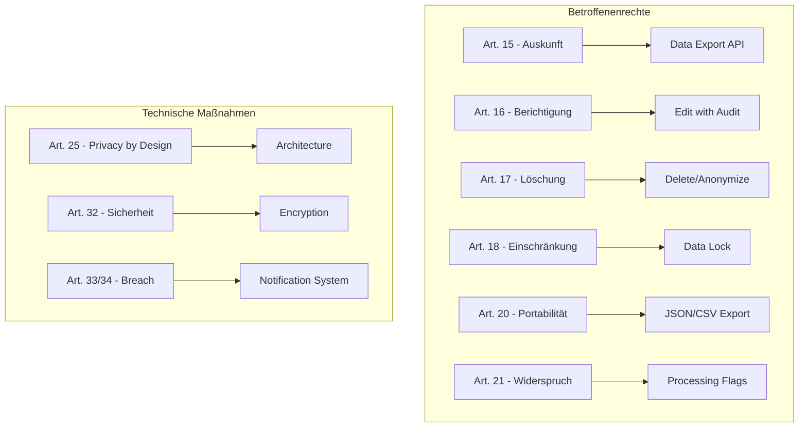
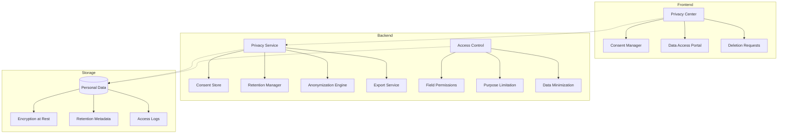

# FC-018: Technisches Konzept - Datenschutz & DSGVO-Compliance System

**Feature Code:** FC-018  
**Datum:** 2025-07-25  
**Status:** Draft  
**Autor:** Claude  
**Reviewer:** Jörg Streeck  

## 📋 Inhaltsverzeichnis

1. [Zusammenfassung](#zusammenfassung)
2. [Ziel und Geschäftswert](#ziel-und-geschäftswert)
3. [Rechtliche Anforderungen](#rechtliche-anforderungen)
4. [Technische Architektur](#technische-architektur)
5. [Backend-Implementierung](#backend-implementierung)
6. [Frontend-Implementierung](#frontend-implementierung)
7. [Implementierungsstrategie](#implementierungsstrategie)
8. [Entscheidungs-Log](#entscheidungs-log)
9. [Risiken und Mitigationen](#risiken-und-mitigationen)
10. [Zeitschätzung](#zeitschätzung)

## Zusammenfassung

Ein umfassendes Datenschutz- und DSGVO-Compliance-System, das Rechteverwaltung für personenbezogene Daten implementiert, Zugriff nur für berechtigte Nutzer sicherstellt und DSGVO-konformes Löschen/Deaktivieren abgelaufener Daten ermöglicht. Das System integriert sich nahtlos in alle bestehenden Features und stellt Compliance von Anfang an sicher.

## Ziel und Geschäftswert

### Geschäftsziele
- **Rechtssicherheit**: Vollständige DSGVO-Compliance ab Tag 1
- **Vertrauen**: Transparenter Umgang mit Kundendaten
- **Wettbewerbsvorteil**: "Privacy by Design" als USP
- **Risikominimierung**: Vermeidung von Bußgeldern (bis zu 4% des Jahresumsatzes)

### Technische Ziele
- **Privacy by Design**: Datenschutz in der Architektur verankert
- **Privacy by Default**: Restriktivste Einstellungen als Standard
- **Granulare Rechteverwaltung**: Field-Level Permissions
- **Automatisierte Prozesse**: Löschfristen, Anonymisierung, Exports

## Rechtliche Anforderungen

### DSGVO-Artikel Mapping



### Kern-Anforderungen

1. **Rechtmäßigkeit (Art. 6)**
   - Einwilligung dokumentieren
   - Rechtsgrundlage speichern
   - Widerruf ermöglichen

2. **Transparenz (Art. 12-14)**
   - Datenschutzerklärung
   - Verarbeitungszwecke
   - Speicherfristen

3. **Betroffenenrechte (Art. 15-22)**
   - Auskunft binnen 30 Tagen
   - Löschung/Anonymisierung
   - Datenportabilität

4. **Rechenschaftspflicht (Art. 24)**
   - Verarbeitungsverzeichnis
   - Dokumentation aller Prozesse
   - Nachweisbarkeit

## Technische Architektur

### System-Übersicht



### Datenklassifizierung

```typescript
enum DataClassification {
    PUBLIC = "PUBLIC",                    // Öffentliche Daten
    INTERNAL = "INTERNAL",                // Interne Geschäftsdaten
    CONFIDENTIAL = "CONFIDENTIAL",        // Vertrauliche Daten
    PERSONAL = "PERSONAL",                // Personenbezogene Daten
    SENSITIVE = "SENSITIVE",              // Besondere Kategorien (Art. 9)
    RESTRICTED = "RESTRICTED"             // Höchste Schutzstufe
}

enum LegalBasis {
    CONSENT = "CONSENT",                  // Art. 6(1)(a) - Einwilligung
    CONTRACT = "CONTRACT",                // Art. 6(1)(b) - Vertragserfüllung
    LEGAL_OBLIGATION = "LEGAL_OBLIGATION", // Art. 6(1)(c) - Rechtliche Pflicht
    VITAL_INTERESTS = "VITAL_INTERESTS",  // Art. 6(1)(d) - Lebenswichtige Interessen
    PUBLIC_TASK = "PUBLIC_TASK",          // Art. 6(1)(e) - Öffentliche Aufgabe
    LEGITIMATE_INTEREST = "LEGITIMATE_INTEREST" // Art. 6(1)(f) - Berechtigte Interessen
}
```

## Backend-Implementierung

### 1. Privacy Service Core

```java
@ApplicationScoped
@Transactional
public class PrivacyService {
    
    @Inject
    ConsentManager consentManager;
    
    @Inject
    RetentionManager retentionManager;
    
    @Inject
    AnonymizationEngine anonymizer;
    
    @Inject
    AuditService auditService;
    
    @Inject
    Event<PrivacyEvent> privacyEvent;
    
    /**
     * Prüft ob Zugriff auf personenbezogene Daten erlaubt ist
     */
    public boolean canAccess(
        String userId, 
        String dataSubjectId, 
        DataClassification classification,
        ProcessingPurpose purpose
    ) {
        // 1. Prüfe Rolle und Berechtigung
        if (!hasRole(userId, getRequiredRole(classification))) {
            auditService.logAccessDenied(userId, dataSubjectId, "INSUFFICIENT_ROLE");
            return false;
        }
        
        // 2. Prüfe Zweckbindung
        if (!isPurposeAllowed(dataSubjectId, purpose)) {
            auditService.logAccessDenied(userId, dataSubjectId, "PURPOSE_LIMITATION");
            return false;
        }
        
        // 3. Prüfe Einwilligung (falls erforderlich)
        if (requiresConsent(classification, purpose)) {
            if (!consentManager.hasValidConsent(dataSubjectId, purpose)) {
                auditService.logAccessDenied(userId, dataSubjectId, "NO_CONSENT");
                return false;
            }
        }
        
        // 4. Prüfe Sperrung
        if (isDataLocked(dataSubjectId)) {
            auditService.logAccessDenied(userId, dataSubjectId, "DATA_LOCKED");
            return false;
        }
        
        // Zugriff erlaubt - protokollieren
        auditService.logAccess(userId, dataSubjectId, purpose);
        return true;
    }
    
    /**
     * Implementiert das Recht auf Löschung (Art. 17 DSGVO)
     */
    public CompletionStage<DeletionResult> deletePersonalData(
        String dataSubjectId,
        DeletionRequest request
    ) {
        return CompletableFuture.supplyAsync(() -> {
            // 1. Validierung
            validateDeletionRequest(request);
            
            // 2. Prüfe Aufbewahrungspflichten
            var retentionObligations = retentionManager.checkObligations(dataSubjectId);
            if (retentionObligations.hasLegalObligations()) {
                // Kann nicht vollständig löschen - nur anonymisieren
                return performAnonymization(dataSubjectId, retentionObligations);
            }
            
            // 3. Sammle alle personenbezogenen Daten
            var personalData = collectPersonalData(dataSubjectId);
            
            // 4. Erstelle Backup für Compliance
            var backup = createDeletionBackup(personalData);
            
            // 5. Lösche oder anonymisiere
            personalData.forEach(data -> {
                if (data.canBeDeleted()) {
                    deleteData(data);
                } else {
                    anonymizeData(data);
                }
            });
            
            // 6. Event für nachgelagerte Systeme
            privacyEvent.fire(new PersonalDataDeletedEvent(
                dataSubjectId,
                request.getReason(),
                Instant.now()
            ));
            
            // 7. Dokumentiere für Audit
            return DeletionResult.builder()
                .dataSubjectId(dataSubjectId)
                .deletedRecords(personalData.size())
                .backupId(backup.getId())
                .completedAt(Instant.now())
                .build();
        });
    }
}
```

### 2. Consent Management

```java
@Entity
@Table(name = "privacy_consents")
public class Consent {
    
    @Id
    private UUID id;
    
    @Column(name = "data_subject_id", nullable = false)
    private String dataSubjectId;
    
    @Enumerated(EnumType.STRING)
    @Column(name = "purpose", nullable = false)
    private ProcessingPurpose purpose;
    
    @Enumerated(EnumType.STRING)
    @Column(name = "legal_basis", nullable = false)
    private LegalBasis legalBasis;
    
    @Column(name = "given_at", nullable = false)
    private Instant givenAt;
    
    @Column(name = "expires_at")
    private Instant expiresAt;
    
    @Column(name = "withdrawn_at")
    private Instant withdrawnAt;
    
    @Column(name = "ip_address")
    private String ipAddress;
    
    @Column(name = "user_agent")
    private String userAgent;
    
    @Column(name = "consent_text", columnDefinition = "TEXT")
    private String consentText;
    
    @Version
    private Long version;
    
    public boolean isValid() {
        if (withdrawnAt != null) return false;
        if (expiresAt != null && expiresAt.isBefore(Instant.now())) return false;
        return true;
    }
}

@ApplicationScoped
public class ConsentManager {
    
    @Inject
    EntityManager em;
    
    @Inject
    Event<ConsentEvent> consentEvent;
    
    public void recordConsent(ConsentRequest request) {
        var consent = Consent.builder()
            .id(UUID.randomUUID())
            .dataSubjectId(request.getDataSubjectId())
            .purpose(request.getPurpose())
            .legalBasis(LegalBasis.CONSENT)
            .givenAt(Instant.now())
            .expiresAt(calculateExpiry(request.getPurpose()))
            .ipAddress(request.getIpAddress())
            .userAgent(request.getUserAgent())
            .consentText(request.getConsentText())
            .build();
        
        em.persist(consent);
        
        consentEvent.fire(new ConsentGivenEvent(consent));
    }
    
    public void withdrawConsent(String dataSubjectId, ProcessingPurpose purpose) {
        var consents = findActiveConsents(dataSubjectId, purpose);
        
        consents.forEach(consent -> {
            consent.setWithdrawnAt(Instant.now());
            em.merge(consent);
            
            consentEvent.fire(new ConsentWithdrawnEvent(consent));
        });
    }
}
```

### 3. Retention Management

```java
@ApplicationScoped
public class RetentionManager {
    
    @Inject
    RetentionPolicyRepository policyRepo;
    
    @Inject
    @ConfigProperty(name = "privacy.retention.check-interval", defaultValue = "PT24H")
    Duration checkInterval;
    
    /**
     * Automatische Löschung abgelaufener Daten
     */
    @Scheduled(every = "24h")
    void processRetentionPolicies() {
        Log.info("Starting retention policy processing");
        
        var policies = policyRepo.findActive();
        var deletionCandidates = new ArrayList<RetentionCandidate>();
        
        for (var policy : policies) {
            var candidates = findDataExceedingRetention(policy);
            deletionCandidates.addAll(candidates);
        }
        
        Log.info("Found {} records exceeding retention period", deletionCandidates.size());
        
        // Batch-Verarbeitung für Performance
        processDeletionBatch(deletionCandidates);
    }
    
    private List<RetentionCandidate> findDataExceedingRetention(RetentionPolicy policy) {
        var cutoffDate = Instant.now().minus(policy.getRetentionPeriod());
        
        return em.createQuery(
            "SELECT new RetentionCandidate(e.id, e.type, e.createdAt) " +
            "FROM " + policy.getEntityType() + " e " +
            "WHERE e.createdAt < :cutoff " +
            "AND e.retentionStatus != :excluded",
            RetentionCandidate.class)
            .setParameter("cutoff", cutoffDate)
            .setParameter("excluded", RetentionStatus.LEGAL_HOLD)
            .getResultList();
    }
}

@Entity
@Table(name = "retention_policies")
public class RetentionPolicy {
    
    @Id
    private UUID id;
    
    @Column(name = "entity_type", nullable = false)
    private String entityType;
    
    @Enumerated(EnumType.STRING)
    @Column(name = "data_classification", nullable = false)
    private DataClassification classification;
    
    @Column(name = "retention_period", nullable = false)
    private Duration retentionPeriod;
    
    @Column(name = "legal_basis")
    private String legalBasis; // z.B. "HGB §257" oder "AO §147"
    
    @Enumerated(EnumType.STRING)
    @Column(name = "deletion_method", nullable = false)
    private DeletionMethod deletionMethod;
    
    @Column(name = "active", nullable = false)
    private boolean active = true;
}
```

### 4. Field-Level Access Control

```java
/**
 * Annotation für Field-Level Datenschutz
 */
@Target({ElementType.FIELD})
@Retention(RetentionPolicy.RUNTIME)
public @interface PersonalData {
    DataClassification classification() default DataClassification.PERSONAL;
    ProcessingPurpose[] allowedPurposes() default {};
    boolean encryptAtRest() default true;
    boolean auditAccess() default true;
}

/**
 * JPA AttributeConverter für verschlüsselte Felder
 */
@Converter
public class EncryptedStringConverter implements AttributeConverter<String, String> {
    
    @Inject
    EncryptionService encryptionService;
    
    @Override
    public String convertToDatabaseColumn(String attribute) {
        if (attribute == null) return null;
        return encryptionService.encrypt(attribute);
    }
    
    @Override
    public String convertToEntityAttribute(String dbData) {
        if (dbData == null) return null;
        return encryptionService.decrypt(dbData);
    }
}

/**
 * Entity mit Datenschutz-Annotations
 */
@Entity
@Table(name = "customers")
public class Customer {
    
    @Id
    private UUID id;
    
    @PersonalData(classification = DataClassification.PUBLIC)
    @Column(name = "company_name")
    private String companyName;
    
    @PersonalData(
        classification = DataClassification.PERSONAL,
        allowedPurposes = {ProcessingPurpose.CONTRACT, ProcessingPurpose.SUPPORT}
    )
    @Convert(converter = EncryptedStringConverter.class)
    @Column(name = "contact_email")
    private String contactEmail;
    
    @PersonalData(
        classification = DataClassification.SENSITIVE,
        allowedPurposes = {ProcessingPurpose.CONTRACT}
    )
    @Convert(converter = EncryptedStringConverter.class)
    @Column(name = "tax_id")
    private String taxId;
    
    @PersonalData(classification = DataClassification.PERSONAL)
    @Column(name = "created_at", nullable = false)
    private Instant createdAt;
    
    @Column(name = "anonymized", nullable = false)
    private boolean anonymized = false;
}
```

### 5. Anonymization Engine

```java
@ApplicationScoped
public class AnonymizationEngine {
    
    @Inject
    AnonymizationStrategyRegistry strategies;
    
    public void anonymizeEntity(Object entity) {
        var entityClass = entity.getClass();
        
        // Finde alle @PersonalData Felder
        Arrays.stream(entityClass.getDeclaredFields())
            .filter(field -> field.isAnnotationPresent(PersonalData.class))
            .forEach(field -> anonymizeField(entity, field));
        
        // Markiere als anonymisiert
        setAnonymizedFlag(entity, true);
    }
    
    private void anonymizeField(Object entity, Field field) {
        try {
            field.setAccessible(true);
            var annotation = field.getAnnotation(PersonalData.class);
            var strategy = strategies.getStrategy(field.getType(), annotation.classification());
            
            var originalValue = field.get(entity);
            if (originalValue != null) {
                var anonymizedValue = strategy.anonymize(originalValue);
                field.set(entity, anonymizedValue);
            }
        } catch (Exception e) {
            throw new AnonymizationException("Failed to anonymize field: " + field.getName(), e);
        }
    }
}

/**
 * Anonymisierungs-Strategien
 */
public interface AnonymizationStrategy<T> {
    T anonymize(T value);
}

@ApplicationScoped
public class EmailAnonymizationStrategy implements AnonymizationStrategy<String> {
    @Override
    public String anonymize(String email) {
        if (email == null || !email.contains("@")) return "anonymous@example.com";
        
        var parts = email.split("@");
        var localPart = parts[0];
        var domain = parts[1];
        
        // Behalte ersten und letzten Buchstaben
        if (localPart.length() > 2) {
            localPart = localPart.charAt(0) + "***" + localPart.charAt(localPart.length() - 1);
        } else {
            localPart = "***";
        }
        
        return localPart + "@" + domain;
    }
}
```

### 6. Data Subject Rights API

```java
@Path("/api/privacy")
@Produces(MediaType.APPLICATION_JSON)
@Consumes(MediaType.APPLICATION_JSON)
@RolesAllowed("user")
public class PrivacyResource {
    
    @Inject
    PrivacyService privacyService;
    
    @Inject
    ExportService exportService;
    
    @Inject
    SecurityContext securityContext;
    
    /**
     * Art. 15 DSGVO - Auskunftsrecht
     */
    @GET
    @Path("/my-data")
    public Response getMyData() {
        var userId = getCurrentUserId();
        var exportRequest = DataExportRequest.builder()
            .dataSubjectId(userId)
            .format(ExportFormat.JSON)
            .includeMetadata(true)
            .build();
        
        var export = exportService.createExport(exportRequest);
        
        return Response.ok(export)
            .header("Content-Disposition", "attachment; filename=\"my-data.json\"")
            .build();
    }
    
    /**
     * Art. 17 DSGVO - Recht auf Löschung
     */
    @DELETE
    @Path("/my-data")
    public Response deleteMyData(DeletionRequest request) {
        var userId = getCurrentUserId();
        
        // Validiere Berechtigung
        if (!userId.equals(request.getDataSubjectId())) {
            throw new ForbiddenException("Can only delete own data");
        }
        
        var result = privacyService.deletePersonalData(userId, request)
            .toCompletableFuture()
            .join();
        
        return Response.ok(result).build();
    }
    
    /**
     * Art. 18 DSGVO - Recht auf Einschränkung
     */
    @POST
    @Path("/my-data/restrict")
    public Response restrictProcessing(RestrictionRequest request) {
        var userId = getCurrentUserId();
        
        privacyService.restrictProcessing(userId, request.getPurposes());
        
        return Response.ok(Map.of(
            "status", "restricted",
            "purposes", request.getPurposes(),
            "until", request.getUntil()
        )).build();
    }
    
    /**
     * Art. 21 DSGVO - Widerspruchsrecht
     */
    @POST
    @Path("/consent/withdraw")
    public Response withdrawConsent(ConsentWithdrawal withdrawal) {
        var userId = getCurrentUserId();
        
        consentManager.withdrawConsent(userId, withdrawal.getPurpose());
        
        return Response.ok(Map.of(
            "status", "withdrawn",
            "purpose", withdrawal.getPurpose(),
            "timestamp", Instant.now()
        )).build();
    }
}
```

## Frontend-Implementierung

### 1. Privacy Center Dashboard

```tsx
const PrivacyCenter: React.FC = () => {
    const { user } = useAuth();
    const [activeTab, setActiveTab] = useState(0);
    
    return (
        <Container maxWidth="lg">
            <Typography variant="h4" gutterBottom>
                Datenschutz-Center
            </Typography>
            
            <Paper sx={{ mt: 3 }}>
                <Tabs value={activeTab} onChange={(e, v) => setActiveTab(v)}>
                    <Tab label="Meine Daten" />
                    <Tab label="Einwilligungen" />
                    <Tab label="Datenexport" />
                    <Tab label="Löschanfrage" />
                    <Tab label="Zugriffsprotokoll" />
                </Tabs>
                
                <Box p={3}>
                    {activeTab === 0 && <MyDataOverview userId={user.id} />}
                    {activeTab === 1 && <ConsentManager userId={user.id} />}
                    {activeTab === 2 && <DataExport userId={user.id} />}
                    {activeTab === 3 && <DeletionRequest userId={user.id} />}
                    {activeTab === 4 && <AccessLog userId={user.id} />}
                </Box>
            </Paper>
        </Container>
    );
};
```

### 2. Consent Management UI

```tsx
interface ConsentManagerProps {
    userId: string;
}

const ConsentManager: React.FC<ConsentManagerProps> = ({ userId }) => {
    const { data: consents, refetch } = useQuery({
        queryKey: ['consents', userId],
        queryFn: () => privacyApi.getConsents(userId)
    });
    
    const withdrawMutation = useMutation({
        mutationFn: (purpose: ProcessingPurpose) => 
            privacyApi.withdrawConsent(userId, purpose),
        onSuccess: () => {
            showSuccess('Einwilligung wurde widerrufen');
            refetch();
        }
    });
    
    return (
        <Box>
            <Typography variant="h6" gutterBottom>
                Ihre Einwilligungen
            </Typography>
            
            <Alert severity="info" sx={{ mb: 2 }}>
                Sie können Ihre Einwilligungen jederzeit widerrufen. 
                Dies kann jedoch die Nutzung bestimmter Funktionen einschränken.
            </Alert>
            
            <List>
                {consents?.map(consent => (
                    <ListItem key={consent.id}>
                        <ListItemIcon>
                            {consent.isValid ? (
                                <CheckCircleIcon color="success" />
                            ) : (
                                <CancelIcon color="error" />
                            )}
                        </ListItemIcon>
                        
                        <ListItemText
                            primary={getConsentTitle(consent.purpose)}
                            secondary={
                                <>
                                    Erteilt am: {formatDate(consent.givenAt)}
                                    {consent.expiresAt && (
                                        <> • Gültig bis: {formatDate(consent.expiresAt)}</>
                                    )}
                                </>
                            }
                        />
                        
                        <ListItemSecondaryAction>
                            {consent.isValid && (
                                <Button
                                    variant="outlined"
                                    size="small"
                                    onClick={() => withdrawMutation.mutate(consent.purpose)}
                                >
                                    Widerrufen
                                </Button>
                            )}
                        </ListItemSecondaryAction>
                    </ListItem>
                ))}
            </List>
        </Box>
    );
};
```

### 3. Data Access Control Component

```tsx
interface PrivacyGuardProps {
    dataClassification: DataClassification;
    purpose: ProcessingPurpose;
    dataSubjectId: string;
    children: React.ReactNode;
    fallback?: React.ReactNode;
}

const PrivacyGuard: React.FC<PrivacyGuardProps> = ({
    dataClassification,
    purpose,
    dataSubjectId,
    children,
    fallback = <PrivacyBlockedMessage />
}) => {
    const { user } = useAuth();
    const { data: canAccess, isLoading } = useQuery({
        queryKey: ['privacy-access', user.id, dataSubjectId, dataClassification, purpose],
        queryFn: () => privacyApi.checkAccess({
            userId: user.id,
            dataSubjectId,
            dataClassification,
            purpose
        })
    });
    
    if (isLoading) return <Skeleton />;
    if (!canAccess) return <>{fallback}</>;
    
    return <>{children}</>;
};

// Verwendung in Komponenten
const CustomerDetails: React.FC<{ customerId: string }> = ({ customerId }) => {
    const { data: customer } = useCustomer(customerId);
    
    return (
        <Card>
            <CardContent>
                <Typography variant="h6">
                    {customer.companyName}
                </Typography>
                
                <PrivacyGuard
                    dataClassification={DataClassification.PERSONAL}
                    purpose={ProcessingPurpose.CONTRACT}
                    dataSubjectId={customerId}
                >
                    <Typography>
                        E-Mail: {customer.contactEmail}
                    </Typography>
                </PrivacyGuard>
                
                <PrivacyGuard
                    dataClassification={DataClassification.SENSITIVE}
                    purpose={ProcessingPurpose.CONTRACT}
                    dataSubjectId={customerId}
                    fallback={
                        <Alert severity="warning">
                            Steuernummer: Zugriff verweigert - Keine Berechtigung
                        </Alert>
                    }
                >
                    <Typography>
                        Steuernummer: {customer.taxId}
                    </Typography>
                </PrivacyGuard>
            </CardContent>
        </Card>
    );
};
```

### 4. Deletion Request UI

```tsx
const DeletionRequest: React.FC<{ userId: string }> = ({ userId }) => {
    const [confirmOpen, setConfirmOpen] = useState(false);
    const [reason, setReason] = useState('');
    
    const deletionMutation = useMutation({
        mutationFn: (request: DeletionRequest) => 
            privacyApi.requestDeletion(request),
        onSuccess: () => {
            showSuccess('Löschantrag wurde eingereicht');
            // Logout nach erfolgreichem Löschantrag
            setTimeout(() => {
                auth.logout();
            }, 3000);
        }
    });
    
    const handleSubmit = () => {
        deletionMutation.mutate({
            dataSubjectId: userId,
            reason,
            confirmDeletion: true
        });
    };
    
    return (
        <Box>
            <Alert severity="error" sx={{ mb: 3 }}>
                <AlertTitle>Achtung</AlertTitle>
                Die Löschung Ihrer Daten ist unwiderruflich. Nach der Löschung:
                <ul>
                    <li>Verlieren Sie den Zugang zu Ihrem Konto</li>
                    <li>Können wir keine Unterstützung mehr leisten</li>
                    <li>Werden alle Ihre Daten gelöscht oder anonymisiert</li>
                </ul>
            </Alert>
            
            <TextField
                fullWidth
                multiline
                rows={4}
                label="Grund für die Löschung (optional)"
                value={reason}
                onChange={(e) => setReason(e.target.value)}
                sx={{ mb: 3 }}
            />
            
            <Button
                variant="contained"
                color="error"
                onClick={() => setConfirmOpen(true)}
                disabled={deletionMutation.isLoading}
            >
                Alle meine Daten löschen
            </Button>
            
            <Dialog open={confirmOpen} onClose={() => setConfirmOpen(false)}>
                <DialogTitle>Löschung bestätigen</DialogTitle>
                <DialogContent>
                    <Typography>
                        Sind Sie sicher, dass Sie alle Ihre Daten unwiderruflich 
                        löschen möchten?
                    </Typography>
                    <Typography variant="caption" color="error" sx={{ mt: 2 }}>
                        Diese Aktion kann nicht rückgängig gemacht werden.
                    </Typography>
                </DialogContent>
                <DialogActions>
                    <Button onClick={() => setConfirmOpen(false)}>
                        Abbrechen
                    </Button>
                    <Button 
                        onClick={handleSubmit}
                        color="error"
                        variant="contained"
                    >
                        Endgültig löschen
                    </Button>
                </DialogActions>
            </Dialog>
        </Box>
    );
};
```

### 5. Admin Privacy Dashboard

```tsx
const AdminPrivacyDashboard: React.FC = () => {
    const { data: metrics } = usePrivacyMetrics();
    const { data: requests } = usePendingRequests();
    
    return (
        <Grid container spacing={3}>
            <Grid item xs={12}>
                <Typography variant="h4">Privacy Management</Typography>
            </Grid>
            
            {/* Metriken */}
            <Grid item xs={3}>
                <MetricCard
                    title="Active Consents"
                    value={metrics?.activeConsents || 0}
                    icon={<VerifiedUserIcon />}
                    color="success"
                />
            </Grid>
            <Grid item xs={3}>
                <MetricCard
                    title="Deletion Requests"
                    value={metrics?.pendingDeletions || 0}
                    icon={<DeleteIcon />}
                    color="warning"
                />
            </Grid>
            <Grid item xs={3}>
                <MetricCard
                    title="Data Exports"
                    value={metrics?.exportsLastMonth || 0}
                    icon={<CloudDownloadIcon />}
                    color="info"
                />
            </Grid>
            <Grid item xs={3}>
                <MetricCard
                    title="Retention Violations"
                    value={metrics?.retentionViolations || 0}
                    icon={<WarningIcon />}
                    color="error"
                />
            </Grid>
            
            {/* Pending Requests */}
            <Grid item xs={12}>
                <Paper sx={{ p: 2 }}>
                    <Typography variant="h6" gutterBottom>
                        Offene Anfragen
                    </Typography>
                    <DataGrid
                        rows={requests || []}
                        columns={[
                            { field: 'id', headerName: 'ID', width: 150 },
                            { field: 'type', headerName: 'Typ', width: 150 },
                            { field: 'dataSubject', headerName: 'Betroffener', width: 200 },
                            { field: 'requestedAt', headerName: 'Eingegangen', width: 150 },
                            { field: 'deadline', headerName: 'Frist', width: 150 },
                            {
                                field: 'actions',
                                headerName: 'Aktionen',
                                width: 200,
                                renderCell: (params) => (
                                    <PrivacyRequestActions request={params.row} />
                                )
                            }
                        ]}
                        autoHeight
                    />
                </Paper>
            </Grid>
        </Grid>
    );
};
```

## Implementierungsstrategie

### Phase 1: Grundlegende Infrastruktur (3 Tage)

#### Sprint 1.1: Core Privacy Service (1.5 Tage)
1. **Tag 1 Vormittag**: 
   - Privacy Service Core
   - Consent Management Basis
   - Datenklassifizierung

2. **Tag 1 Nachmittag**: 
   - Field-Level Annotations
   - Encryption at Rest
   - Access Control Framework

3. **Tag 2 Vormittag**: 
   - Retention Manager
   - Deletion/Anonymization Engine

#### Sprint 1.2: API & Database (1.5 Tage)
1. **Tag 2 Nachmittag**: 
   - Privacy REST API
   - Database Schema
   - Migration Scripts

2. **Tag 3**: 
   - Audit Integration
   - Event System
   - Initial Policies

### Phase 2: Frontend Privacy Center (2 Tage)

#### Sprint 2.1: User Privacy Portal (1 Tag)
1. **Tag 4**: 
   - Privacy Center Dashboard
   - Consent Management UI
   - Data Export Feature

#### Sprint 2.2: Admin Tools (1 Tag)
1. **Tag 5**: 
   - Admin Dashboard
   - Request Management
   - Compliance Reports

### Phase 3: Feature Integration (3 Tage)

#### Sprint 3.1: Core Feature Updates (1.5 Tage)
1. **Tag 6**: 
   - M4 Opportunity: Privacy Guards
   - M5 Customer: Field Encryption
   - FC-003 Email: Consent Check

#### Sprint 3.2: Advanced Integration (1.5 Tage)
1. **Tag 7**: 
   - FC-012 Audit: Privacy Events
   - FC-015 Roles: Data Access Rules
   - FC-009 Contracts: Retention Rules

### Phase 4: Testing & Documentation (1 Tag)

1. **Tag 8**: 
   - Compliance Tests
   - Performance Tests
   - User Documentation
   - Admin Guide

## Entscheidungs-Log

### 2025-07-25 - Verschlüsselungs-Strategie
**Entscheidung**: Field-Level Encryption statt Full-DB Encryption  
**Begründung**: Granulare Kontrolle, Performance, Selective Decryption  
**Impact**: Mehr Entwicklungsaufwand, bessere Compliance  
**Alternativen**: Transparent Data Encryption (TDE)  
**Entscheider**: Claude (zur Review)

### 2025-07-25 - Lösch-Strategie
**Entscheidung**: Anonymisierung als Default, Hard Delete nur wenn rechtlich erlaubt  
**Begründung**: Erhält Datenintegrität, ermöglicht Statistiken  
**Impact**: Komplexere Logik, sicherere Lösung  
**Alternativen**: Immer Hard Delete, Soft Delete  
**Entscheider**: Claude (zur Review)

### 2025-07-25 - Consent Storage
**Entscheidung**: Separate Consent-Tabelle statt Flags in User-Tabelle  
**Begründung**: Historisierung, Audit-Trail, Flexibilität  
**Impact**: Zusätzliche Joins, bessere Compliance  
**Alternativen**: JSON-Column, Bitflags  
**Entscheider**: Claude (zur Review)

## Risiken und Mitigationen

### Risiko 1: Performance-Impact durch Verschlüsselung
**Wahrscheinlichkeit**: Hoch  
**Impact**: Mittel  
**Mitigation**: 
- Selective Encryption (nur sensitive Felder)
- Caching von entschlüsselten Daten
- Batch-Operations für Bulk-Decryption
- Performance-Tests von Anfang an

### Risiko 2: Zu restriktive Zugriffskontrolle
**Wahrscheinlichkeit**: Mittel  
**Impact**: Hoch  
**Mitigation**: 
- Break-Glass Procedures für Notfälle
- Admin Override mit Audit
- Granulare Purpose-Definitionen
- Feedback-Loop mit Nutzern

### Risiko 3: Rechtliche Änderungen
**Wahrscheinlichkeit**: Mittel  
**Impact**: Mittel  
**Mitigation**: 
- Flexible Policy-Engine
- Versionierung von Consent-Texten
- Regelmäßige Legal Reviews
- Konfigurierbare Retention-Zeiten

## Zeitschätzung

**Gesamt-Aufwand**: 8-9 Tage

- **Backend Infrastructure**: 3 Tage
- **Frontend Privacy Center**: 2 Tage  
- **Feature Integration**: 3 Tage
- **Testing & Dokumentation**: 1 Tag

**Puffer**: +1 Tag für unvorhergesehene Compliance-Anforderungen

---

## Detail-Dokumente

Die folgenden Detail-Dokumente werden bei Implementierungsstart erstellt:

1. **Privacy Policy Templates**
   - Datenschutzerklärung
   - Cookie-Policy
   - Verarbeitungsverzeichnis

2. **Integration Guides**
   - Feature-spezifische Privacy Guards
   - Migration Guide für bestehende Daten
   - Testing Compliance Checklist

3. **Operations Manual**
   - Deletion Request Handling
   - Breach Response Plan
   - Audit Procedures

---

**Status-Updates**:
- 2025-07-25: Konzept erstellt (Draft)