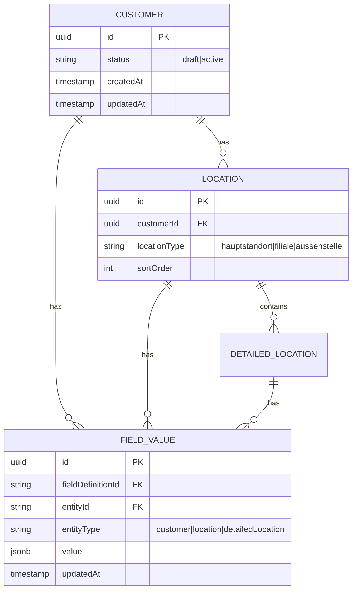

# 🏗️ FC-005 CUSTOMER MANAGEMENT - TECHNISCHES KONZEPT V2.0

**Datum:** 26.07.2025  
**Version:** 2.0 - Field-basierte Architektur  
**Status:** 🔄 In Planung  
**Feature Code:** FC-005  

## 📋 Inhaltsverzeichnis

1. [Executive Summary](#executive-summary)
2. [Kontext und Analyse](#kontext-und-analyse)
3. [Architektur-Entscheidungen](#architektur-entscheidungen)
4. [Datenmodell](#datenmodell)
5. [Implementierungsplan](#implementierungsplan)
6. [UI/UX Konzept](#uiux-konzept)
7. [API Design](#api-design)
8. [Referenzen](#referenzen)

---

## Executive Summary

Das Customer Management wird als **field-basiertes, branchenspezifisches CRM-System** implementiert. Statt die Legacy-Struktur 1:1 zu migrieren, nutzen wir ein flexibles **Hybrid Field System** mit globalem Feld-Katalog und späteren Custom Fields.

**Kernprinzipien:**
- 🎯 **Field-basiert:** Dynamische Felder statt starre Entitäten
- 🏢 **Branchenspezifisch:** Industry-abhängige Feld-Sets
- 🔄 **Wizard-Flow:** 3-stufiger Onboarding-Prozess
- 💾 **Draft-fähig:** Auto-Save und Fortsetzbarkeit

---

## Kontext und Analyse

### Legacy-Analyse
Die vollständige Feld-Analyse der Legacy-Anwendung ist dokumentiert in:
`/Users/joergstreeck/freshplan-sales-tool/docs/claude-work/daily-work/2025-07-26/2025-07-26_CUSTOMER_COMPLETE_FIELD_ANALYSIS.md`

**Wichtigste Erkenntnisse:**
- 3-stufiger Workflow: Kunde → Standorte → Detaillierte Standorte
- `chainCustomer` als zentraler Trigger für Standort-Verwaltung
- `industry` bestimmt branchenspezifische Felder
- Komplexe Validierungen (Deutsche PLZ, Telefon, E-Mail)

### Neue Anforderungen
Basierend auf der Diskussion vom 26.07.2025:
- **Keine Migration** von Altdaten notwendig (Greenfield)
- **Field Catalog** System für Flexibilität
- **Relations** für spätere Erweiterung vorbereiten
- **Mobile-First** Design

---

## Architektur-Entscheidungen

### ADR-005-1: Hybrid Field System

**Status:** Akzeptiert  
**Kontext:** Branchenspezifische Anforderungen vs. Flexibilität  
**Entscheidung:** Hybrid aus globalem Field Catalog + Custom Fields (später)  

```typescript
interface FieldDefinition {
  id: string
  key: string                    // z.B. "roomCount"
  label: string                  // "Anzahl Zimmer"
  entityType: 'customer' | 'location' | 'detailedLocation'
  industry?: string[]            // ['hotel', 'krankenhaus']
  fieldType: 'text' | 'number' | 'select' | 'date' | 'boolean'
  validation?: string            // Zod Schema als String
  defaultValue?: any
  isCustom: boolean             // false = Catalog, true = Custom
  isPlanned?: boolean           // für zukünftige Felder
}
```

### ADR-005-2: State Management

**Status:** Akzeptiert  
**Kontext:** Wizard mit vielen Schritten und Auto-Save  
**Entscheidung:** Zustand für Local State + React Query für Server State  

```typescript
// Store Location für Claude Reference:
// /Users/joergstreeck/freshplan-sales-tool/frontend/src/features/customers/stores/customerOnboardingStore.ts
interface CustomerOnboardingStore {
  // Wizard State
  currentStep: number
  isDirty: boolean
  lastSaved: Date | null
  
  // Data State
  customerData: Map<string, any>      // fieldKey -> value
  locations: Location[]
  detailedLocations: DetailedLocation[]
  
  // Actions
  setFieldValue: (fieldKey: string, value: any) => void
  saveAsDraft: () => Promise<void>
  loadDraft: (id: string) => Promise<void>
}
```

---

## Datenmodell

### Entity Relationship (basierend auf ER-Diagramm)



### Backend Entities (Quarkus/Java)

```java
// Package: de.freshplan.domain.customer.entity
@Entity
@Table(name = "locations")
public class Location extends BaseEntity {
    @ManyToOne(fetch = FetchType.LAZY)
    @JoinColumn(name = "customer_id")
    private Customer customer;
    
    @Column(name = "location_type")
    private String locationType;
    
    @OneToMany(mappedBy = "location", cascade = CascadeType.ALL)
    private List<DetailedLocation> detailedLocations = new ArrayList<>();
    
    // Field Values über Service laden (nicht als Relation)
}
```

---

## Implementierungsplan

### Phase 1: Foundation (2 Tage)

**Tag 1: Field System & Customer Step**
```bash
# File Locations für Claude:
/frontend/src/features/customers/
├── data/
│   └── fieldCatalog.json           # Initial 10 Felder
├── components/
│   ├── CustomerOnboardingWizard.tsx
│   └── steps/
│       └── CustomerDataStep.tsx
├── hooks/
│   └── useFieldDefinitions.ts
└── types/
    └── customer.types.ts
```

**Initial Field Catalog (MVP):**
```json
{
  "customer": [
    { "key": "companyName", "label": "Firmenname", "fieldType": "text", "required": true },
    { "key": "legalForm", "label": "Rechtsform", "fieldType": "select", "required": true },
    { "key": "industry", "label": "Branche", "fieldType": "select", "required": true },
    { "key": "chainCustomer", "label": "Kettenkunde", "fieldType": "select", "defaultValue": "nein" },
    { "key": "street", "label": "Straße", "fieldType": "text", "required": true },
    { "key": "postalCode", "label": "PLZ", "fieldType": "text", "validation": "germanPostalCode" },
    { "key": "city", "label": "Ort", "fieldType": "text", "required": true },
    { "key": "contactName", "label": "Ansprechpartner", "fieldType": "text", "required": true },
    { "key": "contactEmail", "label": "E-Mail", "fieldType": "email", "required": true },
    { "key": "contactPhone", "label": "Telefon", "fieldType": "text", "validation": "germanPhone" }
  ]
}
```

**Tag 2: Location Step (Branchenspezifisch)**
```typescript
// Branchen-Mapping aus Legacy-Analyse
const INDUSTRY_LOCATION_FIELDS: Record<string, FieldDefinition[]> = {
  'hotel': [
    { key: 'smallHotels', label: 'Kleine Hotels (<50 Zimmer)', fieldType: 'number' },
    { key: 'mediumHotels', label: 'Mittlere Hotels (50-150)', fieldType: 'number' },
    { key: 'largeHotels', label: 'Große Hotels (>150)', fieldType: 'number' }
  ],
  'krankenhaus': [
    { key: 'smallHospitals', label: 'Kleine KH (<200 Betten)', fieldType: 'number' },
    { key: 'privatePatientShare', label: 'Privatpatientenanteil %', fieldType: 'range', defaultValue: 15 }
  ]
  // ... weitere Branchen
};
```

### Phase 2: Advanced Features (3 Tage)

**Tag 3: DetailedLocations Step**
- Dynamische Karten-Verwaltung
- Synchronisierungs-Warnung (wenn Anzahl nicht stimmt)
- Bulk-Actions

**Tag 4: Backend Integration**
```java
// Neue REST Endpoints
@Path("/api/customers")
public class CustomerResource {
    @POST
    @Path("/draft")
    public Response createDraft(CustomerDraftRequest request) {
        // Mit Field Values
    }
    
    @GET
    @Path("/field-definitions/{entityType}")
    public List<FieldDefinition> getFieldDefinitions(
        @PathParam("entityType") String entityType,
        @QueryParam("industry") String industry
    ) {
        // Gefilterte Felder zurückgeben
    }
}
```

**Tag 5: Testing & Polish**
- Unit Tests für Field Validation
- Integration Tests für Wizard Flow
- E2E Test für kompletten Onboarding

---

## UI/UX Konzept

### Wizard Flow
```
┌─────────────────────────────────────────────────┐
│  CustomerOnboardingWizard                       │
│  ┌─────────────┬─────────────┬──────────────┐  │
│  │ 1. Stammdaten│ 2. Standorte│ 3. Details   │  │
│  └─────────────┴─────────────┴──────────────┘  │
│                                                 │
│  ┌─────────────────────────────────────────┐   │
│  │  Dynamic Field Renderer                  │   │
│  │  - Renders fields based on catalog       │   │
│  │  - Industry-specific visibility          │   │
│  │  - Real-time validation                  │   │
│  └─────────────────────────────────────────┘   │
│                                                 │
│  [Zurück] [Entwurf speichern] [Weiter]         │
└─────────────────────────────────────────────────┘
```

### Mobile Responsiveness
- Jeder Step als vollwertige "Page"
- Swipe-Gesten für Navigation
- Offline-Indicator prominent

---

## API Design

### REST Endpoints
```yaml
# Customer Draft Management
POST   /api/customers/draft              # Create/Update Draft
GET    /api/customers/draft/{id}         # Load Draft
DELETE /api/customers/draft/{id}         # Delete Draft
POST   /api/customers/draft/{id}/finalize # Convert to Active

# Field Management
GET    /api/field-definitions/customer
GET    /api/field-definitions/location?industry={industry}
GET    /api/field-definitions/detailed-location

# Location Management  
POST   /api/customers/{id}/locations
PUT    /api/locations/{id}
DELETE /api/locations/{id}
```

### Request/Response Examples
```json
// POST /api/customers/draft
{
  "fieldValues": [
    { "fieldKey": "companyName", "value": "Hotel Zur Post GmbH" },
    { "fieldKey": "industry", "value": "hotel" },
    { "fieldKey": "chainCustomer", "value": "ja" }
  ],
  "locations": [
    {
      "locationType": "hauptstandort",
      "fieldValues": [
        { "fieldKey": "roomCount", "value": 45 }
      ]
    }
  ]
}
```

---

## Referenzen

### Verwandte Dokumente
1. **Legacy-Analyse:** `/Users/joergstreeck/freshplan-sales-tool/docs/claude-work/daily-work/2025-07-26/2025-07-26_CUSTOMER_COMPLETE_FIELD_ANALYSIS.md`
2. **Master Plan:** `/Users/joergstreeck/freshplan-sales-tool/docs/CRM_COMPLETE_MASTER_PLAN_V5.md`
3. **API Contract:** `/Users/joergstreeck/freshplan-sales-tool/docs/technical/API_CONTRACT.md`

### Code Locations
- **Frontend:** `/Users/joergstreeck/freshplan-sales-tool/frontend/src/features/customers/`
- **Backend:** `/Users/joergstreeck/freshplan-sales-tool/backend/src/main/java/de/freshplan/domain/customer/`
- **Tests:** `/Users/joergstreeck/freshplan-sales-tool/backend/src/test/java/de/freshplan/domain/customer/`

### Nächste Schritte für Claude
1. Field Catalog JSON erstellen (siehe Phase 1)
2. CustomerOnboardingWizard.tsx implementieren
3. Zustand Store mit persist einrichten
4. Backend Entities erweitern

---

**WICHTIG FÜR NEUEN CLAUDE:**
- Dieses Dokument ist die SINGLE SOURCE OF TRUTH für Customer Management
- Bei Widersprüchen hat dieses Dokument Vorrang
- Field-basierte Architektur ist final entschieden
- Keine Legacy-Migration notwendig (Greenfield)