```mermaid
graph LR
    Start[README.md]
    
    %% Phase 1 Chain
    Start --> P1A[FRONTEND_FOUNDATION]
    P1A --> P1B[SMART_CONTACT_CARDS]
    P1B --> P1C[MOBILE_CONTACT_ACTIONS]
    P1C --> P1D[RELATIONSHIP_INTELLIGENCE]
    P1D --> P1E[CONTACT_TIMELINE]
    P1E --> P1F[SMART_SUGGESTIONS]
    P1F --> P1G[TESTING_INTEGRATION]
    
    %% Phase 2 Chain
    P1G --> P2A[BULK_OPERATIONS]
    P2A <--> P2B[FEATURE_ADOPTION_TRACKING]
    P2A --> P2C[IMPORT_EXPORT]
    P2C --> P2D[DUPLICATE_DETECTION]
    P2D --> P2E[COMMUNICATION_HISTORY]
    
    %% Phase 3 Chain
    P2E --> P3A[ORG_CHART_VISUALIZATION]
    P3A --> P3B[SOCIAL_MEDIA_INTEGRATION]
    P3B --> P3C[AI_DATA_ENRICHMENT]
    
    %% Phase 4 Chain
    P3C --> P4A[PERFORMANCE_OPTIMIZATION]
    P4A --> P4B[ACCESSIBILITY_MONITORING]
    
    %% Special Links
    Start --> AUDIT[AUDIT_TRAIL_SYSTEM]
    AUDIT --> P1B
```

# 🗺️ Step3 Navigation Index - Komplette Übersicht

**Zweck:** Schnelle Navigation durch alle Step3-Dokumente  
**Dokumente:** 41 Dateien  
**Status:** ✅ Alle mit Claude-Navigation  

## 🧭 NAVIGATION MAP

### Start → Phase 1 → Phase 2 → Phase 3 → Phase 4 → Ende

## 📑 QUICK JUMP NAVIGATION

### 🎯 Phase 1 - Core Requirements
| # | Dokument | Beschreibung | Link |
|---|----------|--------------|------|
| 1 | FRONTEND_FOUNDATION | Frontend-Basis Setup | [→ Öffnen](/Users/joergstreeck/freshplan-sales-tool/docs/features/FC-005-CUSTOMER-MANAGEMENT/Step3/FRONTEND_FOUNDATION.md) |
| 2 | SMART_CONTACT_CARDS | Intelligente Kontaktkarten | [→ Öffnen](/Users/joergstreeck/freshplan-sales-tool/docs/features/FC-005-CUSTOMER-MANAGEMENT/Step3/SMART_CONTACT_CARDS.md) |
| 3 | MOBILE_CONTACT_ACTIONS | Mobile-optimierte Aktionen | [→ Öffnen](/Users/joergstreeck/freshplan-sales-tool/docs/features/FC-005-CUSTOMER-MANAGEMENT/Step3/MOBILE_CONTACT_ACTIONS.md) |
| 4 | RELATIONSHIP_INTELLIGENCE | Beziehungs-Intelligenz | [→ Öffnen](/Users/joergstreeck/freshplan-sales-tool/docs/features/FC-005-CUSTOMER-MANAGEMENT/Step3/RELATIONSHIP_INTELLIGENCE.md) |
| 5 | CONTACT_TIMELINE | Aktivitäts-Timeline | [→ Öffnen](/Users/joergstreeck/freshplan-sales-tool/docs/features/FC-005-CUSTOMER-MANAGEMENT/Step3/CONTACT_TIMELINE.md) |
| 6 | SMART_SUGGESTIONS | KI-gestützte Vorschläge | [→ Öffnen](/Users/joergstreeck/freshplan-sales-tool/docs/features/FC-005-CUSTOMER-MANAGEMENT/Step3/SMART_SUGGESTIONS.md) |
| 7 | TESTING_INTEGRATION | Test-Strategie | [→ Öffnen](/Users/joergstreeck/freshplan-sales-tool/docs/features/FC-005-CUSTOMER-MANAGEMENT/Step3/TESTING_INTEGRATION.md) |
| 8 | QUICK_ACTION_BAR | Schnellaktionen | [→ Öffnen](/Users/joergstreeck/freshplan-sales-tool/docs/features/FC-005-CUSTOMER-MANAGEMENT/Step3/QUICK_ACTION_BAR.md) |
| 9 | WARMTH_INDICATOR | Beziehungswärme | [→ Öffnen](/Users/joergstreeck/freshplan-sales-tool/docs/features/FC-005-CUSTOMER-MANAGEMENT/Step3/WARMTH_INDICATOR.md) |
| 10 | **AUDIT_TRAIL_SYSTEM** ⭐ | Audit & DSGVO Compliance | [→ Öffnen](/Users/joergstreeck/freshplan-sales-tool/docs/features/FC-005-CUSTOMER-MANAGEMENT/Step3/AUDIT_TRAIL_SYSTEM.md) |

### 🚀 Phase 2 - Enhanced Features
| # | Dokument | Beschreibung | Link |
|---|----------|--------------|------|
| 11 | BULK_OPERATIONS | Massen-Operationen | [→ Öffnen](/Users/joergstreeck/freshplan-sales-tool/docs/features/FC-005-CUSTOMER-MANAGEMENT/Step3/BULK_OPERATIONS.md) |
| 12 | FEATURE_ADOPTION_TRACKING | Nutzungsanalyse | [→ Öffnen](/Users/joergstreeck/freshplan-sales-tool/docs/features/FC-005-CUSTOMER-MANAGEMENT/Step3/FEATURE_ADOPTION_TRACKING.md) |
| 13 | IMPORT_EXPORT | Daten Import/Export | [→ Öffnen](/Users/joergstreeck/freshplan-sales-tool/docs/features/FC-005-CUSTOMER-MANAGEMENT/Step3/IMPORT_EXPORT.md) |
| 14 | DUPLICATE_DETECTION | Duplikat-Erkennung | [→ Öffnen](/Users/joergstreeck/freshplan-sales-tool/docs/features/FC-005-CUSTOMER-MANAGEMENT/Step3/DUPLICATE_DETECTION.md) |
| 15 | IN_APP_HELP_SYSTEM | Kontextuelles Hilfe-System | [→ Öffnen](/Users/joergstreeck/freshplan-sales-tool/docs/features/FC-005-CUSTOMER-MANAGEMENT/Step3/IN_APP_HELP_SYSTEM.md) |
| 16 | COST_MANAGEMENT_EXTERNAL | Kosten-Management | [→ Öffnen](/Users/joergstreeck/freshplan-sales-tool/docs/features/FC-005-CUSTOMER-MANAGEMENT/Step3/COST_MANAGEMENT_EXTERNAL_SERVICES.md) |
| 17 | OFFLINE_CONFLICT_RESOLUTION | Konflikt-Auflösung | [→ Öffnen](/Users/joergstreeck/freshplan-sales-tool/docs/features/FC-005-CUSTOMER-MANAGEMENT/Step3/OFFLINE_CONFLICT_RESOLUTION.md) |
| 18 | DATA_STRATEGY_INTELLIGENCE | Daten-Strategie | [→ Öffnen](/Users/joergstreeck/freshplan-sales-tool/docs/features/FC-005-CUSTOMER-MANAGEMENT/Step3/DATA_STRATEGY_INTELLIGENCE.md) |

### 💎 Phase 3 - Premium Features
| # | Dokument | Beschreibung | Link |
|---|----------|--------------|------|
| 19 | COMMUNICATION_HISTORY | Kommunikations-Historie | [→ Öffnen](/Users/joergstreeck/freshplan-sales-tool/docs/features/FC-005-CUSTOMER-MANAGEMENT/Step3/COMMUNICATION_HISTORY.md) |
| 20 | ORG_CHART_VISUALIZATION | Organigramm-Darstellung | [→ Öffnen](/Users/joergstreeck/freshplan-sales-tool/docs/features/FC-005-CUSTOMER-MANAGEMENT/Step3/ORG_CHART_VISUALIZATION.md) |
| 21 | SOCIAL_MEDIA_INTEGRATION | LinkedIn/XING Integration | [→ Öffnen](/Users/joergstreeck/freshplan-sales-tool/docs/features/FC-005-CUSTOMER-MANAGEMENT/Step3/SOCIAL_MEDIA_INTEGRATION.md) |
| 22 | AI_DATA_ENRICHMENT | KI-Datenanreicherung | [→ Öffnen](/Users/joergstreeck/freshplan-sales-tool/docs/features/FC-005-CUSTOMER-MANAGEMENT/Step3/AI_DATA_ENRICHMENT.md) |
| 23 | AI_FEATURES | Weitere KI-Features | [→ Öffnen](/Users/joergstreeck/freshplan-sales-tool/docs/features/FC-005-CUSTOMER-MANAGEMENT/Step3/AI_FEATURES.md) |
| 24 | LOCATION_INTELLIGENCE | Standort-Intelligenz | [→ Öffnen](/Users/joergstreeck/freshplan-sales-tool/docs/features/FC-005-CUSTOMER-MANAGEMENT/Step3/LOCATION_INTELLIGENCE.md) |
| 25 | CONTACT_ANALYTICS | Kontakt-Analytik | [→ Öffnen](/Users/joergstreeck/freshplan-sales-tool/docs/features/FC-005-CUSTOMER-MANAGEMENT/Step3/CONTACT_ANALYTICS.md) |
| 26 | DSGVO_CONSENT | Datenschutz-Management | [→ Öffnen](/Users/joergstreeck/freshplan-sales-tool/docs/features/FC-005-CUSTOMER-MANAGEMENT/Step3/DSGVO_CONSENT.md) |

### ⚡ Phase 4 - System Excellence
| # | Dokument | Beschreibung | Link |
|---|----------|--------------|------|
| 27 | PERFORMANCE_OPTIMIZATION | Performance-Optimierung | [→ Öffnen](/Users/joergstreeck/freshplan-sales-tool/docs/features/FC-005-CUSTOMER-MANAGEMENT/Step3/PERFORMANCE_OPTIMIZATION.md) |
| 28 | ACCESSIBILITY_MONITORING | Barrierefreiheit & Monitoring | [→ Öffnen](/Users/joergstreeck/freshplan-sales-tool/docs/features/FC-005-CUSTOMER-MANAGEMENT/Step3/ACCESSIBILITY_MONITORING.md) |

### 🔧 Backend & Integration
| # | Dokument | Beschreibung | Link |
|---|----------|--------------|------|
| 29 | BACKEND_CONTACT | Backend Contact Entity | [→ Öffnen](/Users/joergstreeck/freshplan-sales-tool/docs/features/FC-005-CUSTOMER-MANAGEMENT/Step3/BACKEND_CONTACT.md) |
| 30 | BACKEND_INTELLIGENCE | Backend Intelligence Layer | [→ Öffnen](/Users/joergstreeck/freshplan-sales-tool/docs/features/FC-005-CUSTOMER-MANAGEMENT/Step3/BACKEND_INTELLIGENCE.md) |
| 31 | RELATIONSHIP_FIELDS | Beziehungsfeld-Definitionen | [→ Öffnen](/Users/joergstreeck/freshplan-sales-tool/docs/features/FC-005-CUSTOMER-MANAGEMENT/Step3/RELATIONSHIP_FIELDS.md) |
| 32 | OFFLINE_MOBILE_SUPPORT | Offline & Mobile Support | [→ Öffnen](/Users/joergstreeck/freshplan-sales-tool/docs/features/FC-005-CUSTOMER-MANAGEMENT/Step3/OFFLINE_MOBILE_SUPPORT.md) |
| 33 | THEME_ARCHITECTURE | Theme System Architektur | [→ Öffnen](/Users/joergstreeck/freshplan-sales-tool/docs/features/FC-005-CUSTOMER-MANAGEMENT/Step3/THEME_ARCHITECTURE.md) |
| 34 | TEAM_FEEDBACK_INTEGRATION | Team Feedback Integration | [→ Öffnen](/Users/joergstreeck/freshplan-sales-tool/docs/features/FC-005-CUSTOMER-MANAGEMENT/Step3/TEAM_FEEDBACK_INTEGRATION.md) |
| 35 | INTEGRATION_SUMMARY | Integration Übersicht | [→ Öffnen](/Users/joergstreeck/freshplan-sales-tool/docs/features/FC-005-CUSTOMER-MANAGEMENT/Step3/INTEGRATION_SUMMARY.md) |

### 📊 Meta & Status
| # | Dokument | Beschreibung | Link |
|---|----------|--------------|------|
| 36 | README | Hauptübersicht Step3 | [→ Öffnen](/Users/joergstreeck/freshplan-sales-tool/docs/features/FC-005-CUSTOMER-MANAGEMENT/Step3/README.md) |
| 37 | CRITICAL_SUCCESS_FACTORS | Kritische Erfolgsfaktoren | [→ Öffnen](/Users/joergstreeck/freshplan-sales-tool/docs/features/FC-005-CUSTOMER-MANAGEMENT/Step3/CRITICAL_SUCCESS_FACTORS.md) |
| 38 | CONSOLIDATED_ROADMAP | Konsolidierte Roadmap | [→ Öffnen](/Users/joergstreeck/freshplan-sales-tool/docs/features/FC-005-CUSTOMER-MANAGEMENT/Step3/CONSOLIDATED_ROADMAP.md) |
| 39 | IMPLEMENTATION_STATUS | Implementierungs-Status | [→ Öffnen](/Users/joergstreeck/freshplan-sales-tool/docs/features/FC-005-CUSTOMER-MANAGEMENT/Step3/IMPLEMENTATION_STATUS.md) |
| 40 | PLANNING_BACKUP_MANIFEST | Backup-Dokumentation | [→ Öffnen](/Users/joergstreeck/freshplan-sales-tool/docs/features/FC-005-CUSTOMER-MANAGEMENT/Step3/PLANNING_BACKUP_MANIFEST.md) |
| 41 | **_NAVIGATION_INDEX** | Diese Datei | [→ Aktualisieren](/Users/joergstreeck/freshplan-sales-tool/docs/features/FC-005-CUSTOMER-MANAGEMENT/Step3/_NAVIGATION_INDEX.md) |

## 🎯 Quick Implementation Path

### Empfohlene Implementierungs-Reihenfolge:

1. **Woche 1:** Backend Foundation
   - BACKEND_CONTACT → BACKEND_INTELLIGENCE → AUDIT_TRAIL_SYSTEM

2. **Woche 2:** Frontend Core
   - FRONTEND_FOUNDATION → SMART_CONTACT_CARDS → MOBILE_CONTACT_ACTIONS

3. **Woche 3:** Intelligence Layer
   - RELATIONSHIP_INTELLIGENCE → CONTACT_TIMELINE → SMART_SUGGESTIONS

4. **Woche 4:** Enhanced Features
   - BULK_OPERATIONS → IMPORT_EXPORT → DUPLICATE_DETECTION

5. **Woche 5:** Premium Features
   - SOCIAL_MEDIA_INTEGRATION → AI_DATA_ENRICHMENT → ORG_CHART_VISUALIZATION

6. **Woche 6:** Excellence & Polish
   - PERFORMANCE_OPTIMIZATION → ACCESSIBILITY_MONITORING → TESTING_INTEGRATION

## 📈 Coverage Statistics

| Kategorie | Dokumente | Status |
|-----------|-----------|--------|
| Core Requirements | 10 | ✅ Komplett |
| Enhanced Features | 8 | ✅ Komplett |
| Premium Features | 8 | ✅ Komplett |
| System Excellence | 2 | ✅ Komplett |
| Backend & Integration | 7 | ✅ Komplett |
| Meta & Status | 6 | ✅ Komplett |
| **GESAMT** | **41** | **✅ 100%** |

## 🔍 Spezial-Indizes

### Nach Priorität:
1. 🔴 **KRITISCH:** AUDIT_TRAIL_SYSTEM, DSGVO_CONSENT, BACKEND_CONTACT
2. 🟠 **HOCH:** SMART_CONTACT_CARDS, RELATIONSHIP_INTELLIGENCE, PERFORMANCE_OPTIMIZATION
3. 🟡 **MITTEL:** BULK_OPERATIONS, SOCIAL_MEDIA_INTEGRATION, AI_DATA_ENRICHMENT
4. 🟢 **NIEDRIG:** ORG_CHART_VISUALIZATION, LOCATION_INTELLIGENCE

### Nach Komplexität:
1. **Sehr Komplex:** AI_DATA_ENRICHMENT, OFFLINE_CONFLICT_RESOLUTION
2. **Komplex:** AUDIT_TRAIL_SYSTEM, PERFORMANCE_OPTIMIZATION
3. **Mittel:** SMART_CONTACT_CARDS, BULK_OPERATIONS
4. **Einfach:** WARMTH_INDICATOR, QUICK_ACTION_BAR

### Nach Dependencies:
1. **Keine Dependencies:** BACKEND_CONTACT, FRONTEND_FOUNDATION
2. **Wenige Dependencies:** SMART_CONTACT_CARDS, WARMTH_INDICATOR
3. **Viele Dependencies:** AI_DATA_ENRICHMENT, SMART_SUGGESTIONS

---

**Navigation Status:** ✅ VOLLSTÄNDIG  
**Letzte Aktualisierung:** 08.08.2025 02:20  
**Bereit für:** IMPLEMENTIERUNG