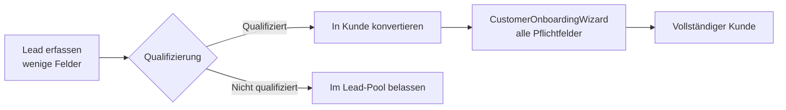

# 🎯 Sprint 2 Diskussion: Sidebar-Navigation & Lead-Konzept

**Datum:** 27.07.2025  
**Teilnehmer:** Jörg & Claude  
**Kontext:** Sprint 2 Customer UI Integration

---

## 📋 Navigation
**Parent:** [Sprint 2 Overview](/Users/joergstreeck/freshplan-sales-tool/docs/features/FC-005-CUSTOMER-MANAGEMENT/sprint2/README.md)  
**Next:** [Lead-Kunde-Trennung](/Users/joergstreeck/freshplan-sales-tool/docs/features/FC-005-CUSTOMER-MANAGEMENT/sprint2/LEAD_CUSTOMER_SEPARATION_DECISION.md)  
**Related:** [Sidebar Config](/Users/joergstreeck/freshplan-sales-tool/docs/features/FC-005-CUSTOMER-MANAGEMENT/sprint2/SIDEBAR_NAVIGATION_CONFIG.md) | [FC-020 Lead Management](/Users/joergstreeck/freshplan-sales-tool/docs/features/FC-020-LEAD-MANAGEMENT_TECH_CONCEPT.md)

---

## 📍 1. Sidebar-Navigation: Wo platzieren wir die Kundenerfassung?

### Aktuelle Sidebar-Struktur:
```
1. Mein Cockpit ✅ (funktional)
2. Neukundengewinnung
   2.1. E-Mail Posteingang
   2.2. Lead-Erfassung
   2.3. Kampagnen
3. Kundenmanagement
   3.1. Alle Kunden
   3.2. Verkaufschancen ✅ (funktional)
   3.3. Aktivitäten
4. Auswertungen
5. Einstellungen ✅ (funktional)
```

### Vorschlag für Kundenerfassung:
```
3. Kundenmanagement
   3.1. Alle Kunden
   3.2. Neuer Kunde ← NEU
   3.3. Verkaufschancen
   3.4. Aktivitäten
```

### Begründung:
- **Logische Gruppierung:** Alles rund um Kunden an einem Ort
- **User Journey:** Erst Kunden ansehen, dann neue anlegen
- **CRM-Standards:** Bewährte Praxis (Salesforce, HubSpot)
- **Semantische Trennung:** Klar getrennt von "Neukundengewinnung" (Leads)

### Komplementäre Lösung:
**Header Quick-Actions** für Power-User:
```
[+ Neuer Kunde] [+ Neue Chance] [🔔]
```

## 🤔 2. Lead vs. Kunde - Die kritische Diskussion

### Jörgs wichtige Frage:
> "Neue Lead leuchtet mir noch nicht ganz ein. Zu deutsch heißt es neuer Kontakt. Das würde ja heißen, dass sich ein Kontakt qualifiziert, um als Kunde angelegt zu werden. Vielleicht kann ich ja zu dieser Zeit noch nicht alle Pflichtfelder bei der Kundenanlage ausfüllen."

### Die Antwort: Ja, genau so ist es gedacht!

#### Lead (Kontakt/Interessent):
- **Wenige Pflichtfelder:** Name, E-Mail, Telefon, Firma
- **Unvollständige Daten OK:** Schnelle Erfassung wichtig
- **Status:** Potentieller Kunde, noch nicht qualifiziert
- **Beispiele:**
  - Messebesucher mit Visitenkarte
  - Website-Anfrage
  - Empfehlung eines Bestandskunden

#### Kunde:
- **Alle Pflichtfelder:** Vollständige Adresse, Branche, Kettenkunde, etc.
- **Qualifiziert:** Bedarf erkannt, Budget vorhanden, Entscheidungsbefugt
- **Status:** Aktive Geschäftsbeziehung möglich/vorhanden

### 📊 3. Der Qualifizierungsprozess

#### Wann wird aus einem Lead ein Kunde?

**BANT-Kriterien (Standard im B2B):**
- **B**udget: Gibt es ein Budget?
- **A**uthority: Ist der Kontakt entscheidungsbefugt?
- **N**eed: Gibt es einen konkreten Bedarf?
- **T**imeline: Gibt es einen realistischen Zeitrahmen?

**➡️ Sobald 2-3 Kriterien erfüllt sind = Lead qualifiziert**

### 🔄 4. Der technische Workflow



#### Implementierung in unserem System:
1. **Lead-Erfassung:** Unter "2.2 Lead-Erfassung" - minimale Felder
2. **Qualifizierung:** Vertrieb prüft BANT-Kriterien
3. **Konvertierung:** Button "Als Kunde übernehmen"
4. **Wizard öffnet:** Vorhandene Lead-Daten werden übernommen
5. **Pflichtfelder ergänzen:** Jetzt müssen alle Felder ausgefüllt werden

### 💡 5. Konkrete Empfehlungen für Sprint 2

#### A. Datenmodell-Trennung:
```typescript
// Lead - Minimal
interface Lead {
  id: string;
  firstName?: string;
  lastName?: string;
  company?: string;
  email: string;        // Pflicht
  phone?: string;
  source?: string;      // Woher kommt der Lead?
  status: 'new' | 'contacted' | 'qualified' | 'disqualified';
}

// Customer - Vollständig
interface Customer {
  // Alle Lead-Felder plus:
  street: string;       // Pflicht
  city: string;         // Pflicht
  postalCode: string;   // Pflicht
  industry: string;     // Pflicht
  chainCustomer: boolean; // Pflicht
  // ... etc
}
```

#### B. UI-Flow:
1. **Lead-Liste:** Einfache Tabelle mit Quick-Actions
2. **"Als Kunde übernehmen":** Prominent bei qualifizierten Leads
3. **CustomerOnboardingWizard:** Öffnet mit vorbefüllten Daten
4. **Validierung:** Erst im Wizard alle Pflichtfelder prüfen

#### C. Status-Verwaltung:
```
Lead-Status:
- Neu (unbearbeitet)
- Kontaktiert (erste Kontaktaufnahme)
- Qualifiziert (BANT erfüllt)
- Disqualifiziert (kein Potential)
- Konvertiert (wurde zu Kunde)
```

### 🎯 6. Fazit für Sprint 2

1. **Kundenerfassung:** Als "3.2 Neuer Kunde" unter Kundenmanagement ✅
2. **Zusätzlich:** Quick-Action Button im Header ✅
3. **Lead-Modul:** Bleibt unter "2.2 Lead-Erfassung" für unvollständige Kontakte
4. **Konvertierung:** Expliziter Workflow Lead → Kunde mit Wizard

### 🚀 Nächste Schritte:

1. **Sprint 2 Tag 2:** Task Engine implementieren (wie geplant)
2. **Parallel überlegen:** Lead-Datenmodell für spätere Phasen
3. **UI-Entscheidung:** Quick-Action Buttons in CustomersPageV2 einbauen?

---

**Wichtig:** Diese Diskussion zeigt, dass wir nicht nur technisch, sondern auch prozessual durchdacht vorgehen. Die Lead-Kunde-Trennung ist essentiell für effizientes CRM!