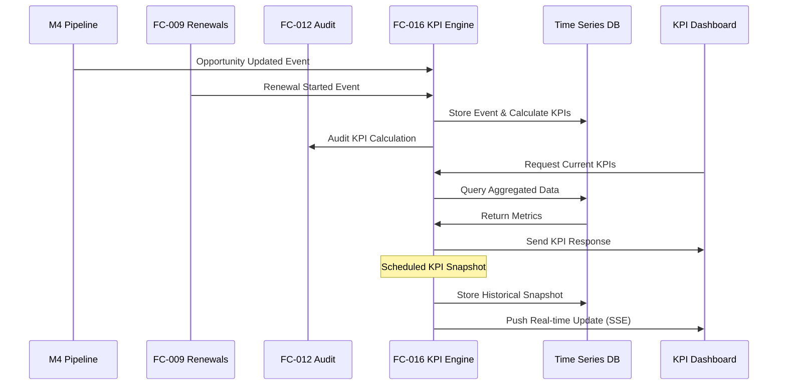

# FC-016: Integration & Impact Analysis

**Feature:** FC-016 KPI-Tracking & Reporting  
**Datum:** 2025-07-24  
**Autor:** Claude  

## 🔄 Cross-Feature Integrationen

### 1. M4 Opportunity Pipeline ← FC-016

**Technische Änderungen in M4:**
```java
// backend/src/main/java/de/freshplan/domain/opportunity/entity/Opportunity.java
@Entity
public class Opportunity {
    // NEU: Felder für KPI-Tracking
    @Column(name = "time_in_current_stage")
    private Duration timeInCurrentStage;
    
    @Column(name = "total_cycle_time")
    private Duration totalCycleTime;
    
    @Column(name = "is_deferred")
    private Boolean isDeferred;
    
    @Column(name = "deferral_reason")
    private String deferralReason;
    
    @Column(name = "original_close_date")
    private LocalDate originalCloseDate;
    
    // NEU: Event Publishing für KPI Updates
    @PostUpdate
    public void publishKpiEvent() {
        eventBus.publish(new OpportunityKpiEvent(this));
    }
}
```

**Frontend Änderungen:**
```typescript
// frontend/src/features/opportunity/components/OpportunityCard.tsx
// NEU: KPI Badges anzeigen
<Box className="kpi-indicators">
    <Chip 
        label={`${daysInStage}d in Stage`}
        size="small"
        color={daysInStage > avgStageTime ? "warning" : "default"}
    />
    {isDeferred && (
        <Chip label="Verlagert" color="error" size="small" />
    )}
</Box>
```

### 2. FC-009 Contract Renewal ← FC-016

**Backend Integration:**
```java
// Neue Service-Methode in ContractRenewalService
public RenewalKpiData getRenewalKpis(LocalDate from, LocalDate to) {
    return RenewalKpiData.builder()
        .totalRenewals(countRenewalsInPeriod(from, to))
        .successfulRenewals(countSuccessfulRenewals(from, to))
        .averageRenewalTime(calculateAvgRenewalTime(from, to))
        .upcomingRenewals(getUpcomingRenewals(30))
        .atRiskRenewals(identifyAtRiskRenewals())
        .build();
}

// Event Publisher für Renewal Actions
@ApplicationScoped
public class RenewalEventPublisher {
    @Inject EventBus eventBus;
    
    public void publishRenewalStarted(Contract contract) {
        eventBus.publish(new RenewalStartedEvent(
            contract.getId(),
            contract.getEndDate(),
            LocalDateTime.now()
        ));
    }
}
```

### 3. FC-011 Pipeline Cockpit ← FC-016

**Cockpit Erweiterungen:**
```typescript
// Neue KPI Widgets im Cockpit
interface CockpitConfig {
    widgets: {
        // Bestehende Widgets...
        renewalQuoteWidget: {
            type: 'kpi-metric',
            dataSource: 'fc016-renewal-metrics',
            refreshInterval: 300000, // 5 min
        },
        dealVelocityWidget: {
            type: 'kpi-chart',
            dataSource: 'fc016-deal-velocity',
            chartType: 'line'
        }
    }
}

// Integration in Cockpit Layout
<DashboardGrid>
    {/* Neue KPI Row */}
    <GridRow>
        <RenewalQuoteWidget />
        <AvgTimeToCloseWidget />
        <DeferredDealsWidget />
    </GridRow>
    {/* Bestehende Pipeline Widgets */}
</DashboardGrid>
```

### 4. FC-012 Audit Trail ← FC-016

**Audit Integration für KPI-relevante Events:**
```java
// Neue Audit Events
@Auditable(
    category = AuditCategory.KPI_TRACKING,
    sensitivity = DataSensitivity.INTERNAL
)
public class KpiCalculationEvent {
    private KpiType type;
    private Map<String, Object> calculatedValues;
    private LocalDateTime calculationTime;
    private String triggeredBy; // system/manual/scheduled
}

// Integration in AuditService
public void auditKpiAccess(User user, KpiType type, DateRange range) {
    auditTrail.record(
        AuditEvent.builder()
            .user(user)
            .action("VIEW_KPI")
            .resource(type.toString())
            .metadata(Map.of("dateRange", range))
            .build()
    );
}
```

### 5. FC-013 Activity & Notes ← FC-016

**Activity Tracking für KPI-relevante Aktionen:**
```java
// Automatische Activities für KPI-Ereignisse
@ApplicationScoped
public class KpiActivityGenerator {
    
    @ConsumeEvent("opportunity.deferred")
    public void createDeferralActivity(OpportunityDeferredEvent event) {
        activityService.create(
            Activity.builder()
                .type(ActivityType.SYSTEM)
                .title("Deal verschoben")
                .description(String.format(
                    "Opportunity '%s' wurde von %s auf %s verschoben. Grund: %s",
                    event.getOpportunityName(),
                    event.getOriginalDate(),
                    event.getNewDate(),
                    event.getReason()
                ))
                .relatedEntity(event.getOpportunityId())
                .build()
        );
    }
}
```

### 6. FC-015 Rights & Roles ← FC-016

**Neue Berechtigungen für KPI-Features:**
```java
// Erweiterte Permission Enum
public enum Permission {
    // Bestehende...
    
    // NEU: KPI Permissions
    KPI_VIEW_OWN_METRICS("Eigene KPIs einsehen"),
    KPI_VIEW_TEAM_METRICS("Team KPIs einsehen"),
    KPI_VIEW_COMPANY_METRICS("Unternehmens-KPIs einsehen"),
    KPI_EXPORT_REPORTS("KPI Reports exportieren"),
    KPI_CREATE_CUSTOM_REPORTS("Custom Reports erstellen"),
    KPI_SCHEDULE_REPORTS("Reports planen");
}

// Role-Permission Mapping Update
SALES_REP.permissions.add(KPI_VIEW_OWN_METRICS);
TEAM_LEAD.permissions.addAll(List.of(
    KPI_VIEW_OWN_METRICS,
    KPI_VIEW_TEAM_METRICS,
    KPI_EXPORT_REPORTS
));
SALES_MANAGER.permissions.addAll(List.of(
    KPI_VIEW_COMPANY_METRICS,
    KPI_CREATE_CUSTOM_REPORTS,
    KPI_SCHEDULE_REPORTS
));
```

### 7. FC-003 Email Integration ← FC-016

**Email Reports & Alerts:**
```java
// Automatische KPI Reports per Email
@ApplicationScoped
public class KpiEmailReporter {
    
    @Scheduled(cron = "0 0 9 ? * MON") // Montags 9 Uhr
    public void sendWeeklyKpiReport() {
        var managers = userService.findByRole("SALES_MANAGER");
        
        managers.forEach(manager -> {
            var report = kpiService.generateWeeklyReport(manager.getTeamId());
            
            emailService.sendTemplate(
                EmailTemplate.WEEKLY_KPI_REPORT,
                manager.getEmail(),
                Map.of(
                    "renewalQuote", report.getRenewalQuote(),
                    "dealsClosed", report.getDealsClosed(),
                    "avgTimeToClose", report.getAvgTimeToClose(),
                    "topPerformers", report.getTopPerformers()
                )
            );
        });
    }
    
    // Alert bei kritischen KPIs
    @ConsumeEvent("kpi.threshold.breached")
    public void sendKpiAlert(KpiThresholdEvent event) {
        if (event.getSeverity() == Severity.CRITICAL) {
            emailService.sendAlert(
                event.getResponsibleManager(),
                String.format("KPI Alert: %s unter kritischem Schwellwert", 
                    event.getKpiName())
            );
        }
    }
}
```

## 📊 Datenfluss-Diagramm



## 🔧 Migration Requirements

### Database Migrations

```sql
-- V1.16.0__add_kpi_tracking.sql
ALTER TABLE opportunities ADD COLUMN time_in_current_stage INTERVAL;
ALTER TABLE opportunities ADD COLUMN is_deferred BOOLEAN DEFAULT FALSE;
ALTER TABLE opportunities ADD COLUMN deferral_reason VARCHAR(500);
ALTER TABLE opportunities ADD COLUMN original_close_date DATE;

-- Trigger für Stage-Zeit-Tracking
CREATE OR REPLACE FUNCTION update_stage_time()
RETURNS TRIGGER AS $$
BEGIN
    IF NEW.stage != OLD.stage THEN
        NEW.time_in_current_stage = INTERVAL '0 seconds';
    ELSE
        NEW.time_in_current_stage = OLD.time_in_current_stage + 
            (NEW.updated_at - OLD.updated_at);
    END IF;
    RETURN NEW;
END;
$$ LANGUAGE plpgsql;

CREATE TRIGGER trg_update_stage_time
BEFORE UPDATE ON opportunities
FOR EACH ROW
EXECUTE FUNCTION update_stage_time();
```

### API Versioning

Alle bestehenden APIs bleiben kompatibel. Neue KPI-Endpoints werden unter `/api/v2/kpi` eingeführt.

## 🚨 Breaking Changes

**Keine!** FC-016 ist rein additiv und bricht keine bestehende Funktionalität.

## 📈 Performance Considerations

1. **Event Volume**: Bei 1000 Opportunities × 10 Stage-Wechsel/Tag = 10k Events/Tag
2. **Storage**: ~500KB/Tag für KPI Snapshots = 15MB/Monat
3. **Query Performance**: Materialized Views refreshen stündlich
4. **Memory**: KPI Cache benötigt ~50MB RAM

## 🔐 Security Implications

1. **Data Access**: KPI-Daten können sensible Umsatzinformationen enthalten
2. **Rate Limiting**: Export-Endpoints begrenzen (10 Requests/Stunde)
3. **Audit Trail**: Alle KPI-Zugriffe werden geloggt
4. **Encryption**: Reports werden verschlüsselt gespeichert