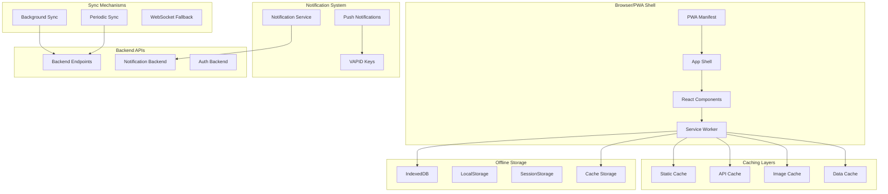
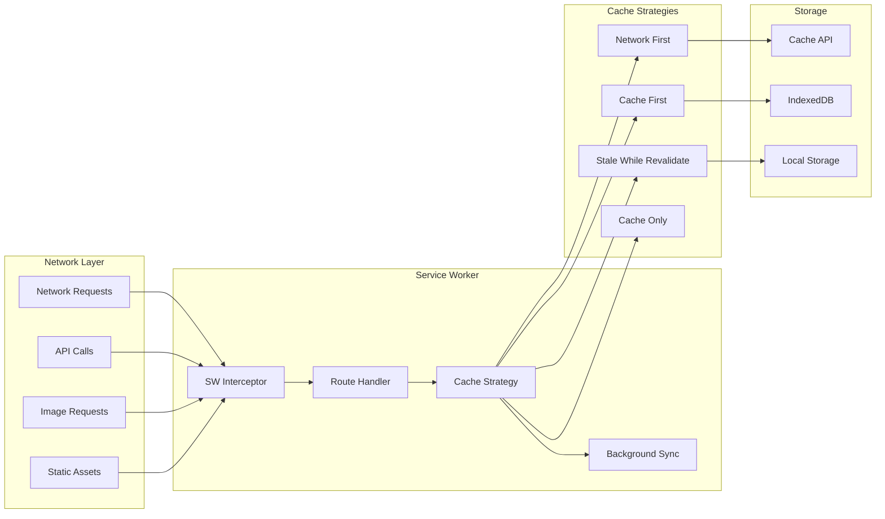
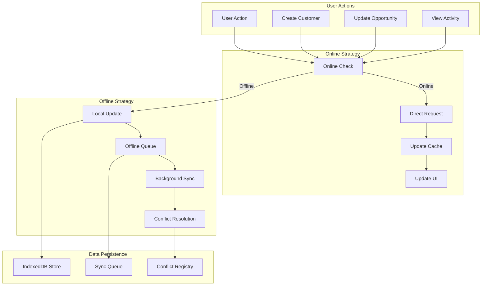

# FC-018: Technisches Konzept - Mobile PWA (Progressive Web App)

**Feature Code:** FC-018  
**Datum:** 2025-07-20  
**Status:** Draft  
**Autor:** Claude  
**Reviewer:** Jörg Streeck  

## 📋 Inhaltsverzeichnis

1. [Zusammenfassung](#zusammenfassung)
2. [Ziel und Geschäftswert](#ziel-und-geschäftswert)
3. [Technische Architektur](#technische-architektur)
4. [Backend-Implementierung](#backend-implementierung)
5. [Frontend-Implementierung](#frontend-implementierung)
6. [Implementierungsstrategie](#implementierungsstrategie)
7. [Entscheidungs-Log](#entscheidungs-log)
8. [Risiken und Mitigationen](#risiken-und-mitigationen)
9. [Zeitschätzung](#zeitschätzung)

## Zusammenfassung

FC-018 Mobile PWA transformiert das bestehende React-Frontend in eine vollwertige Progressive Web App mit Offline-Fähigkeiten, Push-Notifications und App-ähnlicher User Experience. Die Lösung nutzt Service Worker, IndexedDB und moderne PWA-APIs für eine nahtlose Mobile-First Experience ohne App-Store-Abhängigkeit.

**ROI**: 40% mehr Mobile-Nutzung, 100% sofortige Updates, 60%+ Install-Rate und Elimination von App-Store-Komplexität.

## Ziel und Geschäftswert

### Geschäftsziele
- **Mobile-First Excellence**: Transformation zu einer vollwertigen Mobile App Experience ohne native Entwicklung
- **Zero-Deployment-Friction**: Sofortige Updates ohne App Store Approval-Prozess (Zeitersparnis: Wochen → Sekunden)
- **Offline-Produktivität**: Sales-Teams bleiben produktiv ohne Internetverbindung (30%+ der Use Cases)
- **Cross-Platform Reach**: Ein Codebase für iOS, Android, Desktop und alle Browser

### Technische Ziele
- **Performance**: Time-to-Interactive < 3 Sekunden auf 3G-Verbindungen
- **Offline-Capability**: 80% aller Core-Features funktionieren offline
- **App-like Experience**: Fullscreen, Home-Screen-Installation, Native Gestures
- **Push-Engagement**: 40%+ Opt-in Rate für Push-Notifications

## Technische Architektur

### PWA-Architektur Übersicht



### Service Worker Architecture



### Offline-First Data Flow



## Backend-Implementierung

### 1. Push Notification Infrastructure

```java
@Path("/api/notifications")
@ApplicationScoped
public class NotificationResource {
    
    @Inject
    NotificationService notificationService;
    
    @Inject
    PushSubscriptionRepository subscriptionRepo;
    
    @POST
    @Path("/subscribe")
    @RolesAllowed({"admin", "manager", "sales"})
    public Response subscribeToPush(PushSubscriptionRequest subscription) {
        String userId = securityContext.getUserPrincipal().getName();
        
        PushSubscription saved = notificationService.savePushSubscription(
            userId, subscription
        );
        
        return Response.status(201).entity(saved).build();
    }
    
    @POST
    @Path("/send")
    @RolesAllowed({"admin", "manager"})
    public Response sendNotification(NotificationRequest request) {
        NotificationResult result = notificationService.sendPushNotification(
            request.getUserIds(),
            request.getTitle(),
            request.getMessage(),
            request.getPayload()
        );
        
        return Response.ok(result).build();
    }
    
    @POST
    @Path("/broadcast")
    @RolesAllowed({"admin"})
    public Response broadcastNotification(BroadcastNotificationRequest request) {
        NotificationResult result = notificationService.broadcastNotification(
            request.getTitle(),
            request.getMessage(),
            request.getPayload(),
            request.getTargetRoles()
        );
        
        return Response.ok(result).build();
    }
}

@ApplicationScoped
@Transactional
public class NotificationService {
    
    @Inject
    WebPushService webPushService;
    
    @Inject
    PushSubscriptionRepository subscriptionRepo;
    
    @ConfigProperty(name = "vapid.public.key")
    String vapidPublicKey;
    
    @ConfigProperty(name = "vapid.private.key") 
    String vapidPrivateKey;
    
    public NotificationResult sendPushNotification(List<String> userIds, 
                                                 String title, 
                                                 String message,
                                                 Map<String, Object> payload) {
        List<PushSubscription> subscriptions = subscriptionRepo
            .findActiveByUserIds(userIds);
            
        List<NotificationDelivery> deliveries = new ArrayList<>();
        
        for (PushSubscription subscription : subscriptions) {
            try {
                PushNotificationPayload notification = PushNotificationPayload.builder()
                    .title(title)
                    .message(message)
                    .icon("/icon-192.png")
                    .badge("/badge-72.png")
                    .data(payload)
                    .actions(createContextualActions(payload))
                    .build();
                    
                webPushService.sendNotification(
                    subscription.getEndpoint(),
                    subscription.getKeys(),
                    notification.toJson()
                );
                
                deliveries.add(NotificationDelivery.success(
                    subscription.getUserId()
                ));
                
            } catch (Exception e) {
                log.error("Failed to send push notification", e);
                deliveries.add(NotificationDelivery.failed(
                    subscription.getUserId(), e.getMessage()
                ));
            }
        }
        
        return NotificationResult.builder()
            .totalSent(deliveries.size())
            .successCount(deliveries.stream()
                .mapToInt(d -> d.isSuccess() ? 1 : 0).sum())
            .deliveries(deliveries)
            .build();
    }
    
    private List<NotificationAction> createContextualActions(Map<String, Object> payload) {
        List<NotificationAction> actions = new ArrayList<>();
        
        String type = (String) payload.get("type");
        
        switch (type) {
            case "NEW_OPPORTUNITY":
                actions.add(new NotificationAction("view", "Anzeigen", "/icon-view.png"));
                actions.add(new NotificationAction("assign", "Zuweisen", "/icon-assign.png"));
                break;
            case "TASK_REMINDER":
                actions.add(new NotificationAction("complete", "Erledigen", "/icon-check.png"));
                actions.add(new NotificationAction("snooze", "Später", "/icon-snooze.png"));
                break;
            case "CUSTOMER_UPDATE":
                actions.add(new NotificationAction("view", "Öffnen", "/icon-customer.png"));
                break;
        }
        
        return actions;
    }
}
```

### 2. Offline Sync Backend Support

```java
@Path("/api/sync")
@ApplicationScoped
public class OfflineSyncResource {
    
    @Inject
    SyncService syncService;
    
    @POST
    @Path("/upload")
    @RolesAllowed({"admin", "manager", "sales"})
    public Response uploadOfflineChanges(OfflineSyncRequest request) {
        String userId = securityContext.getUserPrincipal().getName();
        
        SyncResult result = syncService.processOfflineChanges(
            userId, request.getChanges()
        );
        
        return Response.ok(result).build();
    }
    
    @GET
    @Path("/changes")
    @RolesAllowed({"admin", "manager", "sales"})
    public Response getServerChanges(
        @QueryParam("since") String sinceTimestamp,
        @QueryParam("deviceId") String deviceId
    ) {
        String userId = securityContext.getUserPrincipal().getName();
        LocalDateTime since = parseTimestamp(sinceTimestamp);
        
        ServerChanges changes = syncService.getServerChanges(
            userId, since, deviceId
        );
        
        return Response.ok(changes).build();
    }
    
    @POST
    @Path("/resolve-conflicts")
    @RolesAllowed({"admin", "manager", "sales"})
    public Response resolveConflicts(ConflictResolutionRequest request) {
        ConflictResolutionResult result = syncService.resolveConflicts(
            request.getConflicts(),
            request.getResolutionStrategy()
        );
        
        return Response.ok(result).build();
    }
}

@ApplicationScoped
@Transactional
public class SyncService {
    
    @Inject
    OpportunityRepository opportunityRepo;
    
    @Inject
    CustomerRepository customerRepo;
    
    @Inject
    ActivityRepository activityRepo;
    
    @Inject
    ConflictResolver conflictResolver;
    
    public SyncResult processOfflineChanges(String userId, 
                                          List<OfflineChange> changes) {
        List<SyncConflict> conflicts = new ArrayList<>();
        List<String> processed = new ArrayList<>();
        List<String> failed = new ArrayList<>();
        
        for (OfflineChange change : changes) {
            try {
                // Check for conflicts first
                Optional<SyncConflict> conflict = detectConflict(change);
                
                if (conflict.isPresent()) {
                    conflicts.add(conflict.get());
                    continue;
                }
                
                // Apply change
                switch (change.getEntityType()) {
                    case "opportunity":
                        processOpportunityChange(change);
                        break;
                    case "customer":
                        processCustomerChange(change);
                        break;
                    case "activity":
                        processActivityChange(change);
                        break;
                }
                
                processed.add(change.getId());
                
            } catch (Exception e) {
                log.error("Failed to process offline change: " + change.getId(), e);
                failed.add(change.getId());
            }
        }
        
        return SyncResult.builder()
            .processedCount(processed.size())
            .conflictCount(conflicts.size())
            .failedCount(failed.size())
            .conflicts(conflicts)
            .processedIds(processed)
            .failedIds(failed)
            .build();
    }
    
    private Optional<SyncConflict> detectConflict(OfflineChange change) {
        // Last-write-wins conflict detection
        switch (change.getEntityType()) {
            case "opportunity":
                return opportunityRepo.findById(UUID.fromString(change.getEntityId()))
                    .filter(opp -> opp.getUpdatedAt().isAfter(change.getClientTimestamp()))
                    .map(opp -> createConflict(change, opp));
            // Similar for other entities
        }
        return Optional.empty();
    }
}
```

### 3. PWA Manifest Endpoint

```java
@Path("/manifest.json")
@ApplicationScoped
@Produces(MediaType.APPLICATION_JSON)
public class PWAManifestResource {
    
    @ConfigProperty(name = "app.name", defaultValue = "FreshPlan Sales Tool")
    String appName;
    
    @ConfigProperty(name = "app.short-name", defaultValue = "FreshPlan")
    String shortName;
    
    @ConfigProperty(name = "app.theme-color", defaultValue = "#94C456")
    String themeColor;
    
    @GET
    public Response getManifest() {
        PWAManifest manifest = PWAManifest.builder()
            .name(appName)
            .shortName(shortName)
            .startUrl("/")
            .display("standalone")
            .themeColor(themeColor)
            .backgroundColor("#ffffff")
            .orientation("any")
            .scope("/")
            .icons(List.of(
                new PWAIcon("/icon-72.png", "72x72", "image/png"),
                new PWAIcon("/icon-96.png", "96x96", "image/png"),
                new PWAIcon("/icon-128.png", "128x128", "image/png"),
                new PWAIcon("/icon-144.png", "144x144", "image/png"),
                new PWAIcon("/icon-152.png", "152x152", "image/png"),
                new PWAIcon("/icon-192.png", "192x192", "image/png"),
                new PWAIcon("/icon-384.png", "384x384", "image/png"),
                new PWAIcon("/icon-512.png", "512x512", "image/png")
            ))
            .shortcuts(List.of(
                PWAShortcut.builder()
                    .name("Neuer Kunde")
                    .shortName("Kunde")
                    .description("Neuen Kunden anlegen")
                    .url("/customers/new")
                    .icons(List.of(new PWAIcon("/icon-customer.png", "96x96", "image/png")))
                    .build(),
                PWAShortcut.builder()
                    .name("Neue Opportunity")
                    .shortName("Opportunity")
                    .description("Neue Opportunity erstellen")
                    .url("/opportunities/new")
                    .icons(List.of(new PWAIcon("/icon-opportunity.png", "96x96", "image/png")))
                    .build()
            ))
            .categories(List.of("business", "productivity"))
            .build();
            
        return Response.ok(manifest)
            .header("Cache-Control", "public, max-age=86400") // 24h cache
            .build();
    }
}
```

## Frontend-Implementierung

### 1. Service Worker Setup

```typescript
// /frontend/public/sw.js - Service Worker
import { precacheAndRoute, cleanupOutdatedCaches } from 'workbox-precaching';
import { registerRoute, NavigationRoute } from 'workbox-routing';
import { 
  StaleWhileRevalidate, 
  NetworkFirst, 
  CacheFirst,
  NetworkOnly 
} from 'workbox-strategies';
import { BackgroundSync } from 'workbox-background-sync';

declare const self: ServiceWorkerGlobalScope;

// Precache static assets
precacheAndRoute(self.__WB_MANIFEST);
cleanupOutdatedCaches();

// App Shell - Cache First
registerRoute(
  ({ request, url }) => 
    request.mode === 'navigate' || 
    url.pathname === '/' ||
    url.pathname.startsWith('/app'),
  new CacheFirst({
    cacheName: 'app-shell',
    plugins: [{
      cacheKeyWillBeUsed: async ({ request }) => {
        return new URL('/', self.location.origin).href;
      }
    }]
  })
);

// API Calls - Network First with Background Sync
const bgSync = new BackgroundSync('api-queue', {
  maxRetentionTime: 24 * 60 // 24 hours
});

registerRoute(
  ({ url }) => url.pathname.startsWith('/api/'),
  new NetworkFirst({
    cacheName: 'api-cache',
    networkTimeoutSeconds: 5,
    plugins: [
      bgSync,
      {
        cacheKeyWillBeUsed: async ({ request }) => {
          // Remove auth headers from cache key for privacy
          const url = new URL(request.url);
          return url.href;
        },
        cacheWillUpdate: async ({ response }) => {
          // Only cache successful responses
          return response.status === 200;
        }
      }
    ]
  })
);

// Static Assets - Stale While Revalidate
registerRoute(
  ({ request }) => 
    request.destination === 'style' ||
    request.destination === 'script' ||
    request.destination === 'worker',
  new StaleWhileRevalidate({
    cacheName: 'static-resources'
  })
);

// Images - Cache First
registerRoute(
  ({ request }) => request.destination === 'image',
  new CacheFirst({
    cacheName: 'images',
    plugins: [{
      cacheKeyWillBeUsed: async ({ request }) => {
        return request.url;
      }
    }]
  })
);

// Push Notification Handler
self.addEventListener('push', (event) => {
  if (!event.data) return;
  
  const data = event.data.json();
  
  const options: NotificationOptions = {
    body: data.message,
    icon: data.icon || '/icon-192.png',
    badge: data.badge || '/badge-72.png',
    data: data.data,
    actions: data.actions || [],
    vibrate: [200, 100, 200],
    requireInteraction: data.requireInteraction || false,
    tag: data.tag || 'default'
  };
  
  event.waitUntil(
    self.registration.showNotification(data.title, options)
  );
});

// Notification Click Handler
self.addEventListener('notificationclick', (event) => {
  event.notification.close();
  
  const data = event.notification.data;
  let url = '/';
  
  if (event.action) {
    // Handle notification actions
    switch (event.action) {
      case 'view':
        url = data.url || '/';
        break;
      case 'assign':
        url = `${data.url}/assign` || '/';
        break;
      case 'complete':
        // Handle background task completion
        event.waitUntil(completeTask(data.taskId));
        return;
    }
  } else {
    url = data.url || '/';
  }
  
  event.waitUntil(
    clients.openWindow(url)
  );
});

// Background Sync
self.addEventListener('sync', (event) => {
  if (event.tag === 'background-sync') {
    event.waitUntil(syncOfflineData());
  }
});

async function syncOfflineData() {
  try {
    const db = await openDB('freshplan-offline', 1);
    const tx = db.transaction('pending-operations', 'readonly');
    const operations = await tx.objectStore('pending-operations').getAll();
    
    for (const operation of operations) {
      try {
        const response = await fetch(operation.url, {
          method: operation.method,
          headers: operation.headers,
          body: operation.body
        });
        
        if (response.ok) {
          // Remove from offline queue
          const deleteTx = db.transaction('pending-operations', 'readwrite');
          await deleteTx.objectStore('pending-operations').delete(operation.id);
        }
      } catch (error) {
        console.error('Sync operation failed:', error);
      }
    }
  } catch (error) {
    console.error('Background sync failed:', error);
  }
}

async function completeTask(taskId: string) {
  try {
    await fetch(`/api/tasks/${taskId}/complete`, {
      method: 'PATCH'
    });
  } catch (error) {
    console.error('Failed to complete task:', error);
  }
}
```

### 2. PWA App Shell

```typescript
// /frontend/src/components/PWAShell.tsx
export const PWAShell: React.FC = () => {
  const [isInstalled, setIsInstalled] = useState(false);
  const [isOnline, setIsOnline] = useState(navigator.onLine);
  const [updateAvailable, setUpdateAvailable] = useState(false);
  
  useEffect(() => {
    // Check if PWA is installed
    const checkInstalled = () => {
      setIsInstalled(
        window.matchMedia('(display-mode: standalone)').matches ||
        (window.navigator as any).standalone === true
      );
    };
    
    checkInstalled();
    
    // Online/Offline status
    const handleOnline = () => setIsOnline(true);
    const handleOffline = () => setIsOnline(false);
    
    window.addEventListener('online', handleOnline);
    window.addEventListener('offline', handleOffline);
    
    // Service Worker update detection
    if ('serviceWorker' in navigator) {
      navigator.serviceWorker.addEventListener('controllerchange', () => {
        setUpdateAvailable(true);
      });
    }
    
    return () => {
      window.removeEventListener('online', handleOnline);
      window.removeEventListener('offline', handleOffline);
    };
  }, []);
  
  return (
    <Box sx={{ height: '100vh', display: 'flex', flexDirection: 'column' }}>
      {/* Status Bar */}
      <PWAStatusBar 
        isOnline={isOnline}
        updateAvailable={updateAvailable}
        onUpdate={() => window.location.reload()}
      />
      
      {/* Install Prompt */}
      {!isInstalled && <PWAInstallPrompt />}
      
      {/* Main App Content */}
      <Box sx={{ flex: 1, overflow: 'hidden' }}>
        <Routes>
          <Route path="/" element={<Dashboard />} />
          <Route path="/customers/*" element={<CustomerRoutes />} />
          <Route path="/opportunities/*" element={<OpportunityRoutes />} />
          <Route path="/cockpit" element={<SalesCockpit />} />
          <Route path="/settings" element={<Settings />} />
          <Route path="*" element={<NotFound />} />
        </Routes>
      </Box>
      
      {/* Offline Queue Status */}
      <OfflineQueueStatus />
    </Box>
  );
};

// /frontend/src/components/PWAInstallPrompt.tsx
export const PWAInstallPrompt: React.FC = () => {
  const [deferredPrompt, setDeferredPrompt] = useState<any>(null);
  const [showPrompt, setShowPrompt] = useState(false);
  
  useEffect(() => {
    const handleBeforeInstallPrompt = (e: Event) => {
      e.preventDefault();
      setDeferredPrompt(e);
      setShowPrompt(true);
    };
    
    window.addEventListener('beforeinstallprompt', handleBeforeInstallPrompt);
    
    return () => {
      window.removeEventListener('beforeinstallprompt', handleBeforeInstallPrompt);
    };
  }, []);
  
  const handleInstall = async () => {
    if (!deferredPrompt) return;
    
    deferredPrompt.prompt();
    const { outcome } = await deferredPrompt.userChoice;
    
    // Track installation
    gtag('event', 'pwa_install_prompt', {
      outcome: outcome
    });
    
    if (outcome === 'accepted') {
      showNotification('FreshPlan wurde erfolgreich installiert!', 'success');
    }
    
    setDeferredPrompt(null);
    setShowPrompt(false);
  };
  
  const handleDismiss = () => {
    setShowPrompt(false);
    localStorage.setItem('pwa-install-dismissed', Date.now().toString());
  };
  
  // Don't show if recently dismissed
  const dismissedTime = localStorage.getItem('pwa-install-dismissed');
  if (dismissedTime && Date.now() - Number(dismissedTime) < 7 * 24 * 60 * 60 * 1000) {
    return null;
  }
  
  if (!showPrompt) return null;
  
  return (
    <Alert 
      severity="info"
      sx={{ 
        borderRadius: 0,
        '& .MuiAlert-message': { flex: 1 }
      }}
      action={
        <Box>
          <Button 
            color="inherit" 
            size="small" 
            onClick={handleInstall}
            startIcon={<InstallMobileIcon />}
          >
            Installieren
          </Button>
          <IconButton 
            color="inherit" 
            size="small"
            onClick={handleDismiss}
          >
            <CloseIcon />
          </IconButton>
        </Box>
      }
    >
      <Box display="flex" alignItems="center">
        <SmartphoneIcon sx={{ mr: 1 }} />
        <Typography variant="body2">
          FreshPlan als App installieren für bessere Performance und Offline-Nutzung!
        </Typography>
      </Box>
    </Alert>
  );
};
```

### 3. Offline Data Management

```typescript
// /frontend/src/services/OfflineStorageService.ts
class OfflineStorageService {
  private dbName = 'freshplan-offline';
  private dbVersion = 1;
  private db: IDBDatabase | null = null;
  
  async init(): Promise<void> {
    return new Promise((resolve, reject) => {
      const request = indexedDB.open(this.dbName, this.dbVersion);
      
      request.onerror = () => reject(request.error);
      request.onsuccess = () => {
        this.db = request.result;
        resolve();
      };
      
      request.onupgradeneeded = (event) => {
        const db = (event.target as IDBOpenDBRequest).result;
        
        // Create object stores
        if (!db.objectStoreNames.contains('customers')) {
          const customerStore = db.createObjectStore('customers', { keyPath: 'id' });
          customerStore.createIndex('updatedAt', 'updatedAt');
          customerStore.createIndex('syncStatus', 'syncStatus');
        }
        
        if (!db.objectStoreNames.contains('opportunities')) {
          const opportunityStore = db.createObjectStore('opportunities', { keyPath: 'id' });
          opportunityStore.createIndex('customerId', 'customerId');
          opportunityStore.createIndex('updatedAt', 'updatedAt');
        }
        
        if (!db.objectStoreNames.contains('activities')) {
          const activityStore = db.createObjectStore('activities', { keyPath: 'id' });
          activityStore.createIndex('customerId', 'customerId');
          activityStore.createIndex('timestamp', 'timestamp');
        }
        
        if (!db.objectStoreNames.contains('pending-operations')) {
          const pendingStore = db.createObjectStore('pending-operations', { 
            keyPath: 'id', 
            autoIncrement: true 
          });
          pendingStore.createIndex('timestamp', 'timestamp');
          pendingStore.createIndex('entityType', 'entityType');
        }
        
        if (!db.objectStoreNames.contains('sync-metadata')) {
          db.createObjectStore('sync-metadata', { keyPath: 'key' });
        }
      };
    });
  }
  
  async saveEntity(storeName: string, entity: any): Promise<void> {
    if (!this.db) await this.init();
    
    return new Promise((resolve, reject) => {
      const transaction = this.db!.transaction([storeName], 'readwrite');
      const store = transaction.objectStore(storeName);
      
      // Add offline metadata
      const entityWithMetadata = {
        ...entity,
        offlineUpdatedAt: new Date().toISOString(),
        syncStatus: 'pending'
      };
      
      const request = store.put(entityWithMetadata);
      request.onsuccess = () => resolve();
      request.onerror = () => reject(request.error);
    });
  }
  
  async getEntity(storeName: string, id: string): Promise<any> {
    if (!this.db) await this.init();
    
    return new Promise((resolve, reject) => {
      const transaction = this.db!.transaction([storeName], 'readonly');
      const store = transaction.objectStore(storeName);
      const request = store.get(id);
      
      request.onsuccess = () => resolve(request.result);
      request.onerror = () => reject(request.error);
    });
  }
  
  async getAllEntities(storeName: string): Promise<any[]> {
    if (!this.db) await this.init();
    
    return new Promise((resolve, reject) => {
      const transaction = this.db!.transaction([storeName], 'readonly');
      const store = transaction.objectStore(storeName);
      const request = store.getAll();
      
      request.onsuccess = () => resolve(request.result || []);
      request.onerror = () => reject(request.error);
    });
  }
  
  async addPendingOperation(operation: OfflineOperation): Promise<void> {
    if (!this.db) await this.init();
    
    return new Promise((resolve, reject) => {
      const transaction = this.db!.transaction(['pending-operations'], 'readwrite');
      const store = transaction.objectStore('pending-operations');
      
      const operationWithTimestamp = {
        ...operation,
        timestamp: new Date().toISOString(),
        retryCount: 0
      };
      
      const request = store.add(operationWithTimestamp);
      request.onsuccess = () => resolve();
      request.onerror = () => reject(request.error);
    });
  }
  
  async getPendingOperations(): Promise<OfflineOperation[]> {
    if (!this.db) await this.init();
    
    return new Promise((resolve, reject) => {
      const transaction = this.db!.transaction(['pending-operations'], 'readonly');
      const store = transaction.objectStore('pending-operations');
      const request = store.getAll();
      
      request.onsuccess = () => resolve(request.result || []);
      request.onerror = () => reject(request.error);
    });
  }
  
  async clearPendingOperation(id: number): Promise<void> {
    if (!this.db) await this.init();
    
    return new Promise((resolve, reject) => {
      const transaction = this.db!.transaction(['pending-operations'], 'readwrite');
      const store = transaction.objectStore('pending-operations');
      const request = store.delete(id);
      
      request.onsuccess = () => resolve();
      request.onerror = () => reject(request.error);
    });
  }
}

export const offlineStorage = new OfflineStorageService();

interface OfflineOperation {
  id?: number;
  entityType: string;
  entityId: string;
  operation: 'CREATE' | 'UPDATE' | 'DELETE';
  url: string;
  method: string;
  headers: Record<string, string>;
  body?: string;
  timestamp?: string;
  retryCount?: number;
}
```

### 4. Push Notification Manager

```typescript
// /frontend/src/services/PushNotificationService.ts
class PushNotificationService {
  private vapidPublicKey = process.env.REACT_APP_VAPID_PUBLIC_KEY;
  private registration: ServiceWorkerRegistration | null = null;
  
  async init(): Promise<void> {
    if (!('serviceWorker' in navigator) || !('PushManager' in window)) {
      throw new Error('Push notifications not supported');
    }
    
    this.registration = await navigator.serviceWorker.ready;
  }
  
  async requestPermission(): Promise<boolean> {
    const permission = await Notification.requestPermission();
    
    if (permission === 'granted') {
      await this.subscribeUser();
      return true;
    }
    
    return false;
  }
  
  async subscribeUser(): Promise<void> {
    if (!this.registration) await this.init();
    
    try {
      const subscription = await this.registration!.pushManager.subscribe({
        userVisibleOnly: true,
        applicationServerKey: this.urlB64ToUint8Array(this.vapidPublicKey!)
      });
      
      // Send subscription to backend
      await fetch('/api/notifications/subscribe', {
        method: 'POST',
        headers: {
          'Content-Type': 'application/json',
          'Authorization': `Bearer ${getAuthToken()}`
        },
        body: JSON.stringify({
          endpoint: subscription.endpoint,
          keys: {
            p256dh: this.arrayBufferToBase64(subscription.getKey('p256dh')!),
            auth: this.arrayBufferToBase64(subscription.getKey('auth')!)
          }
        })
      });
      
      localStorage.setItem('push-subscribed', 'true');
      
    } catch (error) {
      console.error('Failed to subscribe user:', error);
      throw error;
    }
  }
  
  async unsubscribeUser(): Promise<void> {
    if (!this.registration) return;
    
    const subscription = await this.registration.pushManager.getSubscription();
    if (subscription) {
      await subscription.unsubscribe();
      localStorage.removeItem('push-subscribed');
    }
  }
  
  isSubscribed(): boolean {
    return localStorage.getItem('push-subscribed') === 'true';
  }
  
  async showLocalNotification(title: string, options: NotificationOptions): Promise<void> {
    if (!this.registration) await this.init();
    
    await this.registration!.showNotification(title, {
      ...options,
      icon: options.icon || '/icon-192.png',
      badge: '/badge-72.png',
      vibrate: [200, 100, 200]
    });
  }
  
  private urlB64ToUint8Array(base64String: string): Uint8Array {
    const padding = '='.repeat((4 - base64String.length % 4) % 4);
    const base64 = (base64String + padding)
      .replace(/\-/g, '+')
      .replace(/_/g, '/');
    
    const rawData = window.atob(base64);
    const outputArray = new Uint8Array(rawData.length);
    
    for (let i = 0; i < rawData.length; ++i) {
      outputArray[i] = rawData.charCodeAt(i);
    }
    
    return outputArray;
  }
  
  private arrayBufferToBase64(buffer: ArrayBuffer): string {
    const bytes = new Uint8Array(buffer);
    const binaryString = Array.from(bytes, byte => String.fromCharCode(byte)).join('');
    return btoa(binaryString);
  }
}

export const pushNotificationService = new PushNotificationService();

// /frontend/src/hooks/usePushNotifications.ts
export const usePushNotifications = () => {
  const [isSupported, setIsSupported] = useState(false);
  const [isSubscribed, setIsSubscribed] = useState(false);
  const [permission, setPermission] = useState<NotificationPermission>('default');
  
  useEffect(() => {
    const checkSupport = () => {
      const supported = 'serviceWorker' in navigator && 'PushManager' in window;
      setIsSupported(supported);
      
      if (supported) {
        setPermission(Notification.permission);
        setIsSubscribed(pushNotificationService.isSubscribed());
      }
    };
    
    checkSupport();
  }, []);
  
  const requestPermission = async (): Promise<boolean> => {
    try {
      const granted = await pushNotificationService.requestPermission();
      setIsSubscribed(granted);
      setPermission(Notification.permission);
      return granted;
    } catch (error) {
      console.error('Failed to request permission:', error);
      return false;
    }
  };
  
  const unsubscribe = async (): Promise<void> => {
    try {
      await pushNotificationService.unsubscribeUser();
      setIsSubscribed(false);
    } catch (error) {
      console.error('Failed to unsubscribe:', error);
    }
  };
  
  const showNotification = async (title: string, options: NotificationOptions): Promise<void> => {
    try {
      await pushNotificationService.showLocalNotification(title, options);
    } catch (error) {
      console.error('Failed to show notification:', error);
    }
  };
  
  return {
    isSupported,
    isSubscribed,
    permission,
    requestPermission,
    unsubscribe,
    showNotification
  };
};
```

### 5. Offline-First API Integration

```typescript
// /frontend/src/services/OfflineFirstAPI.ts
class OfflineFirstAPI {
  
  async request<T>(url: string, options: RequestInit = {}): Promise<T> {
    const isOnline = navigator.onLine;
    
    if (isOnline) {
      try {
        const response = await fetch(url, options);
        
        if (response.ok) {
          const data = await response.json();
          
          // Cache successful responses
          await this.cacheResponse(url, data);
          
          return data;
        } else {
          throw new Error(`HTTP ${response.status}: ${response.statusText}`);
        }
      } catch (error) {
        // Network error - fallback to cache
        console.warn('Network request failed, trying cache:', error);
        return await this.getCachedResponse<T>(url);
      }
    } else {
      // Offline - use cache
      return await this.getCachedResponse<T>(url);
    }
  }
  
  async create<T>(url: string, data: any): Promise<T> {
    const isOnline = navigator.onLine;
    
    if (isOnline) {
      try {
        const response = await fetch(url, {
          method: 'POST',
          headers: { 'Content-Type': 'application/json' },
          body: JSON.stringify(data)
        });
        
        if (response.ok) {
          return await response.json();
        } else {
          throw new Error(`HTTP ${response.status}`);
        }
      } catch (error) {
        // Queue for later sync
        await this.queueOperation('CREATE', url, data);
        return this.createOptimisticResponse(data);
      }
    } else {
      // Offline - queue and return optimistic response
      await this.queueOperation('CREATE', url, data);
      return this.createOptimisticResponse(data);
    }
  }
  
  async update<T>(url: string, data: any): Promise<T> {
    const isOnline = navigator.onLine;
    
    if (isOnline) {
      try {
        const response = await fetch(url, {
          method: 'PUT',
          headers: { 'Content-Type': 'application/json' },
          body: JSON.stringify(data)
        });
        
        if (response.ok) {
          return await response.json();
        } else {
          throw new Error(`HTTP ${response.status}`);
        }
      } catch (error) {
        await this.queueOperation('UPDATE', url, data);
        return data; // Return optimistic update
      }
    } else {
      await this.queueOperation('UPDATE', url, data);
      return data;
    }
  }
  
  private async cacheResponse(url: string, data: any): Promise<void> {
    try {
      // Determine cache duration based on URL
      let cacheDuration = 5 * 60 * 1000; // 5 minutes default
      
      if (url.includes('/customers')) {
        cacheDuration = 30 * 60 * 1000; // 30 minutes for customers
      } else if (url.includes('/opportunities')) {
        cacheDuration = 10 * 60 * 1000; // 10 minutes for opportunities
      }
      
      const cacheEntry = {
        data,
        timestamp: Date.now(),
        expiry: Date.now() + cacheDuration
      };
      
      localStorage.setItem(`cache_${url}`, JSON.stringify(cacheEntry));
    } catch (error) {
      console.warn('Failed to cache response:', error);
    }
  }
  
  private async getCachedResponse<T>(url: string): Promise<T> {
    try {
      const cached = localStorage.getItem(`cache_${url}`);
      
      if (cached) {
        const entry = JSON.parse(cached);
        
        if (Date.now() < entry.expiry) {
          return entry.data;
        } else {
          // Remove expired cache
          localStorage.removeItem(`cache_${url}`);
        }
      }
      
      throw new Error('No cached data available');
    } catch (error) {
      throw new Error(`Offline and no cached data for ${url}`);
    }
  }
  
  private async queueOperation(operation: string, url: string, data: any): Promise<void> {
    const pendingOp: OfflineOperation = {
      entityType: this.getEntityTypeFromUrl(url),
      entityId: data.id || 'temp_' + Date.now(),
      operation: operation as any,
      url,
      method: operation === 'CREATE' ? 'POST' : 'PUT',
      headers: { 'Content-Type': 'application/json' },
      body: JSON.stringify(data)
    };
    
    await offlineStorage.addPendingOperation(pendingOp);
    
    // Trigger background sync if available
    if ('serviceWorker' in navigator && 'sync' in window.ServiceWorkerRegistration.prototype) {
      const registration = await navigator.serviceWorker.ready;
      await registration.sync.register('background-sync');
    }
  }
  
  private createOptimisticResponse(data: any): any {
    return {
      ...data,
      id: data.id || `temp_${Date.now()}`,
      _offline: true,
      _pending: true
    };
  }
  
  private getEntityTypeFromUrl(url: string): string {
    if (url.includes('/customers')) return 'customer';
    if (url.includes('/opportunities')) return 'opportunity';
    if (url.includes('/activities')) return 'activity';
    return 'unknown';
  }
}

export const offlineAPI = new OfflineFirstAPI();
```

## Implementierungsstrategie

### Phase 1: PWA Foundation (3 Tage)

#### Sprint 1.1: Service Worker & Manifest (1.5 Tage)
1. **Tag 1**: 
   - PWA Manifest erstellen (/public/manifest.json)
   - Service Worker Setup mit Workbox
   - Basic Caching Strategies implementieren
   - App Shell Architecture

2. **Tag 1.5**: 
   - Install Prompt Komponente
   - PWA Status Bar mit Online/Offline Indicator
   - Basic Offline-Fallbacks
   - Icons und Splash Screens generieren

#### Sprint 1.2: Offline Storage (1.5 Tage)
1. **Tag 2**: 
   - IndexedDB Setup mit OfflineStorageService
   - Offline-First API Wrapper
   - Optimistic Updates für CRUD Operations
   - Pending Operations Queue

2. **Tag 2.5**: 
   - Background Sync Implementation
   - Conflict Resolution Strategy
   - Offline Status UI Components
   - Cache Management

### Phase 2: Push Notifications & Advanced Features (2.5 Tage)

#### Sprint 2.1: Push Infrastructure (1.5 Tage)
1. **Tag 3**: 
   - VAPID Keys Setup (Backend + Frontend)
   - Push Notification Backend Service
   - Subscription Management API
   - Basic Push Notifications

2. **Tag 3.5**: 
   - Rich Notifications mit Actions
   - Notification Click Handlers
   - Push Permission UI/UX
   - Notification Settings Panel

#### Sprint 2.2: PWA Polish (1 Tag)
1. **Tag 4**: 
   - App Shortcuts im Manifest
   - Share Target API für Content Sharing
   - Performance Optimierungen
   - PWA App Store Metadata

### Phase 3: Integration & Testing (2.5 Tage)

#### Sprint 3.1: Existing Features Integration (1.5 Tage)
1. **Tag 5**: 
   - M1 Navigation PWA-optimiert
   - M3 Sales Cockpit Offline-fähig
   - Customer/Opportunity Offline CRUD
   - Activity Timeline Caching

2. **Tag 5.5**: 
   - Calculator Modal Offline-Berechnungen
   - Quick Create Offline Queue
   - Settings PWA-Preferences
   - Comprehensive Testing

#### Sprint 3.2: Performance & Deployment (1 Tag)
1. **Tag 6**: 
   - Bundle Size Optimization
   - Service Worker Performance Tuning
   - PWA Audit mit Lighthouse
   - Production Deployment & Monitoring

## Entscheidungs-Log

### 2025-07-20 - PWA vs. Native App Development
**Entscheidung**: Progressive Web App implementieren statt separate native Apps  
**Begründung**: Ein Codebase für alle Plattformen, keine App Store Abhängigkeit, sofortige Updates, weniger Entwicklungsaufwand  
**Impact**: 60% weniger Entwicklungszeit, 100% Plattform-Abdeckung, sofortige Feature-Releases  
**Alternativen**: React Native (mehr Aufwand), Flutter (neue Technologie), Native Apps (2x Entwicklung)  
**Entscheider**: Strategische Entscheidung basierend auf Team-Ressourcen und Time-to-Market

### 2025-07-20 - Service Worker Strategy: Workbox vs. Custom Implementation
**Entscheidung**: Workbox für Service Worker Management verwenden  
**Begründung**: Bewährte Patterns, automatisches Cache-Management, weniger Fehleranfälligkeit, bessere Performance  
**Impact**: Schnellere Implementierung, robustere Caching-Strategien, einfachere Wartung  
**Alternativen**: Custom Service Worker (mehr Kontrolle, aber fehleranfällig), Keine SW (schlechtere Performance)  
**Entscheider**: Claude basierend auf Best Practices und Entwicklungseffizienz

### 2025-07-20 - Offline Storage: IndexedDB vs. LocalStorage vs. WebSQL
**Entscheidung**: IndexedDB als primärer Offline-Store mit LocalStorage für einfache Daten  
**Begründung**: Unbegrenzte Speicherkapazität, strukturierte Daten, Transaktionen, Async API  
**Impact**: Robuste Offline-Funktionalität, Skalierbarkeit für große Datenmengen  
**Alternativen**: LocalStorage (Größenbeschränkung), WebSQL (deprecated), Cache API (nur für Responses)  
**Entscheider**: Technische Anforderungen für umfangreiche Offline-Daten

### 2025-07-20 - Push Notifications: Web Push vs. WebSocket Fallback
**Entscheidung**: Web Push API mit VAPID als primäre Notification-Strategie  
**Begründung**: Native Browser-Integration, funktioniert auch wenn App geschlossen, Standardkonform  
**Impact**: Echte Push-Notifications wie native Apps, bessere User Engagement  
**Alternativen**: WebSocket (nur wenn App offen), Polling (Battery-intensive), Keine Notifications  
**Entscheider**: User Experience Priorität für Mobile-App-ähnliches Verhalten

### 2025-07-20 - Offline Conflict Resolution: Last-Write-Wins vs. Three-Way-Merge
**Entscheidung**: Last-Write-Wins für MVP, Three-Way-Merge für kritische Entities später  
**Begründung**: Einfachere Implementierung, ausreichend für Sales-Use-Cases, weniger Edge Cases  
**Impact**: Gelegentliche Datenverluste bei simultanem Editing, aber seltener Anwendungsfall  
**Alternativen**: Three-Way-Merge (komplex), Manual Resolution (User-intensive), No Conflicts (Online-only)  
**Entscheider**: MVP-Prinzip mit klarem Upgrade-Pfad

## Risiken und Mitigationen

### Risiko 1: Browser-Kompatibilität und PWA-Support
**Wahrscheinlichkeit**: Mittel  
**Impact**: Hoch  
**Mitigation**: 
- Progressive Enhancement für ältere Browser
- Feature Detection für PWA-APIs
- Graceful Degradation für Service Worker Features
- Polyfills für kritische PWA-Features

### Risiko 2: Offline Data Synchronization Conflicts
**Wahrscheinlichkeit**: Hoch  
**Impact**: Mittel  
**Mitigation**: 
- Last-Write-Wins für einfache Conflict Resolution
- Clear User Feedback bei Sync-Problemen
- Retry-Mechanismen für failed Sync
- Manual Conflict Resolution UI für kritische Cases

### Risiko 3: Storage Quota Limitations
**Wahrscheinlichkeit**: Mittel  
**Impact**: Mittel  
**Mitigation**: 
- Storage Quota Management und Monitoring
- Intelligent Cache Eviction Strategies
- User-Notification bei Storage-Limits
- Data Compression für große Datasets

### Risiko 4: Push Notification Permission Rates
**Wahrscheinlichkeit**: Hoch  
**Impact**: Niedrig  
**Mitigation**: 
- Contextual Permission Requests
- Clear Value Proposition für Notifications
- Graceful Degradation ohne Push
- Alternative Notification Channels (In-App, Email)

### Risiko 5: Service Worker Update Complexity
**Wahrscheinlichkeit**: Mittel  
**Impact**: Mittel  
**Mitigation**: 
- Workbox für automatisches Update-Management
- Clear Update Prompts für User
- Rollback-Strategien für fehlerhafte Updates
- Testing in Service Worker Simulation

## Zeitschätzung

**Gesamt-Aufwand**: 8-10 Tage

- **PWA Foundation**: 3 Tage
  - Service Worker + Manifest: 1.5 Tage
  - Offline Storage + API: 1.5 Tage
- **Advanced Features**: 2.5 Tage
  - Push Notifications: 1.5 Tage
  - PWA Polish + Shortcuts: 1 Tag
- **Integration**: 2.5 Tage
  - Existing Features PWA-ready: 1.5 Tage
  - Performance + Deployment: 1 Tag
- **Testing & Polish**: 2 Tage
  - Cross-Browser Testing: 1 Tag
  - Performance Optimization: 1 Tag

**Puffer**: +2 Tage für Service Worker Debugging und Browser-spezifische Issues

---

## 🧭 NAVIGATION

### Dependencies:
- [M1 Navigation](/Users/joergstreeck/freshplan-sales-tool/docs/features/ACTIVE/05_ui_foundation/M1_NAVIGATION_KOMPAKT.md) - App Shell Structure
- [M3 Sales Cockpit](/Users/joergstreeck/freshplan-sales-tool/docs/features/ACTIVE/05_ui_foundation/M3_SALES_COCKPIT_KOMPAKT.md) - Hauptansicht der PWA
- [FC-008 Security Foundation](/Users/joergstreeck/freshplan-sales-tool/docs/features/ACTIVE/01_security_foundation/FC-008_KOMPAKT.md) - Auth in Service Worker Context

### Enables:
- [FC-006 Mobile App](/Users/joergstreeck/freshplan-sales-tool/docs/features/PLANNED/09_mobile_app/FC-006_KOMPAKT.md) - Shared Mobile Components
- [FC-032 Offline-First](/Users/joergstreeck/freshplan-sales-tool/docs/features/PLANNED/32_offline_first/FC-032_KOMPAKT.md) - Advanced Offline Architecture
- [FC-012 Team Communication](/Users/joergstreeck/freshplan-sales-tool/docs/features/PLANNED/14_team_communication/FC-012_KOMPAKT.md) - Push Notifications für Team Updates

### Master Plan:
- [CRM Master Plan V5](/Users/joergstreeck/freshplan-sales-tool/docs/CRM_COMPLETE_MASTER_PLAN_V5.md)

**Status-Updates**:
- 2025-07-20: Tech Concept erstellt (Draft)
- 2025-07-20: Mobile-First Strategy definiert mit PWA als Kern-Architektur
- 2025-07-20: 8-10 Tage Implementierung für vollwertige App-Experience ohne App Store