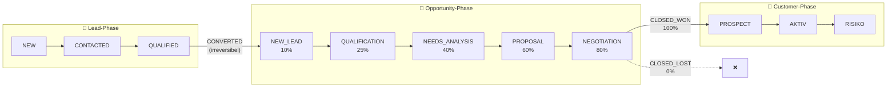

# 👥 FreshPlan Sales Tool - Vollständiger System-Guide

**📅 Letzte Aktualisierung:** 2025-12-01
**🎯 Zielgruppe:** Entwickler, Sales Team, Manager, Admins
**📊 Lesezeit:** ~25 Minuten (komplett) | ~10 Minuten (Quick Start)
**🏷️ Aktueller Stand:** E2E Tests Sprint - Critical Path Validation COMPLETE (PR #149)

---

## ⚡ TL;DR (5 Sätze)

**FreshPlan** ist ein B2B-Food-CRM für Gastronomiebetriebe (Restaurants, Hotels, Kantinen) in Deutschland und der Schweiz. Das Besondere: **Multi-Contact-Workflows** für CHEF + BUYER parallel, **Seasonal-Intelligence** (Spargel, Oktoberfest, Weihnachten), und ein **ROI-Calculator** für Verkäufer. Tech-Stack: **Quarkus + React + PostgreSQL** mit Row-Level-Security. Entwickler können mit dem [Quick Start](#quick-start-für-entwickler) in 5 Minuten loslegen. Bei Fragen: GitHub Issues oder Team-Slack (#freshplan-dev).

---

## 📑 Inhaltsverzeichnis

### Teil 1: Schnelleinstieg
- [1.1 Was ist FreshPlan?](#was-ist-freshplan)
- [1.2 Projekt-Identität](#projekt-identität)
- [1.3 Quick Start für Entwickler](#quick-start-für-entwickler)
- [1.4 Tech-Stack Übersicht](#tech-stack-übersicht)

### Teil 2: Business-Kontext
- [2.1 Das Geschäftsmodell](#das-geschäftsmodell)
- [2.2 Warum B2B-Food anders ist](#warum-b2b-food-anders-ist)
- [2.3 Die CRM-Vision](#die-crm-vision)

### Teil 3: Die 8 Module
- [3.1 Modul 01: Mein Cockpit](#modul-01-mein-cockpit)
- [3.2 Modul 02: Neukundengewinnung](#modul-02-neukundengewinnung)
- [3.3 Modul 03: Kundenmanagement](#modul-03-kundenmanagement)
- [3.4 Modul 04: Auswertungen](#modul-04-auswertungen)
- [3.5 Modul 05: Kommunikation](#modul-05-kommunikation)
- [3.6 Modul 06: Einstellungen](#modul-06-einstellungen)
- [3.7 Modul 07: Hilfe & Support](#modul-07-hilfe-und-support)
- [3.8 Modul 08: Administration](#modul-08-administration)

### Teil 4: Technische Architektur
- [4.1 Code-Struktur](#code-struktur)
- [4.2 Wichtige Enums](#wichtige-enums)
- [4.3 API-Endpoints](#api-endpoints)
- [4.4 Multi-Location Architektur](#multi-location-architektur)
- [4.5 Security (RLS + ABAC + Enterprise Security)](#security-architektur)
- [4.6 Event-Backbone](#event-backbone)
- [4.7 Infrastructure Layer (Modul 00)](#infrastructure-layer)
- [4.8 SLOs](#slos)

### Teil 5: Entwickler-Praxis
- [5.1 Befehle](#befehle)
- [5.2 Migrationen erstellen](#migrationen-erstellen)
- [5.3 Development Standards](#development-standards)
- [5.4 Testing Strategy](#testing-strategy)
- [5.5 Frontend-Code-Beispiele (React/TypeScript)](#frontend-code-beispiele)
- [5.6 Common Pitfalls](#common-pitfalls)
- [5.7 Troubleshooting](#troubleshooting)

### Teil 6: Workflows & Best Practices
- [6.1 Lead-to-Customer Journey](#lead-to-customer-journey)
- [6.2 Täglicher Verkäufer-Workflow](#täglicher-verkäufer-workflow)
- [6.3 Onboarding für neue Entwickler](#onboarding-für-neue-entwickler)

### Anhang
- [Weiterführende Dokumentation](#weiterführende-dokumentation)
- [Known Gaps](#known-gaps)
- [Glossar](#glossar)

---

<a id="was-ist-freshplan"></a>
## 1.1 🎯 Was ist FreshPlan?

**FreshPlan** ist ein **B2B-Food-CRM für Gastronomiebetriebe** - Restaurants, Hotels, Kantinen und Catering-Unternehmen in Deutschland und der Schweiz.

### Das Problem, das wir lösen

Gastronomiebetriebe haben komplexe Entscheidungsstrukturen:
- Der **Küchenchef** entscheidet über Qualität und Menüplanung
- Der **Einkäufer** entscheidet über Budget und Lieferkonditionen
- Beide müssen überzeugt werden, oft mit unterschiedlichen Argumenten

Standard-CRMs verstehen diese Komplexität nicht. FreshPlan wurde speziell dafür gebaut.

### Die Lösung

Ein CRM mit:
- **Multi-Contact-Management** (CHEF + BUYER parallel bearbeiten)
- **ROI-Calculator** (Kosteneinsparung + Zeitersparnis berechnen)
- **Sample-Management** (Testphasen mit Follow-up-Automation)
- **Seasonal-Intelligence** (Spargel-Saison, Oktoberfest, Weihnachten)

---

<a id="projekt-identität"></a>
## 1.2 🏷️ Projekt-Identität

| Begriff | Bedeutung |
|---------|-----------|
| **FreshFoodz** | Markenname des Unternehmens (B2B-Food-Großhandel) |
| **FreshPlan** | Technischer Projektname des CRM-Systems |
| **freshplan-sales-tool** | Name des Git-Repositories |

> **Merke:** FreshFoodz ist die Firma, FreshPlan ist das Tool.

---

<a id="quick-start-für-entwickler"></a>
## 1.3 🚀 Quick Start für Entwickler

### Voraussetzungen

- Java 17+
- Node.js 18+
- PostgreSQL 15+ (oder Docker)
- Maven (wird über `./mvnw` mitgeliefert)

### In 3 Schritten zur laufenden Entwicklungsumgebung

```bash
# 1. PostgreSQL starten (via Docker oder lokal)
docker run -d --name freshplan-db \
  -e POSTGRES_USER=freshplan \
  -e POSTGRES_PASSWORD=freshplan \
  -e POSTGRES_DB=freshplan \
  -p 5432:5432 postgres:15

# 2. Backend starten (Port 8080)
cd backend
./mvnw quarkus:dev

# 3. Frontend starten (Port 5173) - in neuem Terminal
cd frontend
npm install
npm run dev
```

### Ergebnis

- **Backend:** http://localhost:8080
- **Frontend:** http://localhost:5173
- **Swagger UI:** http://localhost:8080/q/swagger-ui
- **Health Check:** http://localhost:8080/q/health

### Login im Dev-Modus

Im Entwicklungsmodus ist **Auth-Bypass aktiviert** (`VITE_AUTH_BYPASS=true`):

| Umgebung | Login-Methode |
|----------|---------------|
| **Development** | Automatisch eingeloggt als Dev-User (kein Login nötig!) |
| **E2E-Tests** | `VITE_AUTH_BYPASS=true` in `playwright.config.ts` |
| **Mit Keycloak** | Setze `VITE_AUTH_BYPASS=false` in `.env.development` |

```bash
# Falls du echte Keycloak-Authentifizierung brauchst:
cd frontend
echo "VITE_AUTH_BYPASS=false" >> .env.development.local

# Keycloak muss dann laufen (siehe docs/planung/grundlagen/KEYCLOAK_SETUP.md)
```

> **Tipp:** Im Dev-Modus siehst du oben rechts ein "DEV"-Badge. Klicke darauf für Role-Switching (ADMIN, MANAGER, SALES).

---

<a id="tech-stack-übersicht"></a>
## 1.4 💻 Tech-Stack Übersicht

### Backend

| Technologie | Version | Zweck |
|-------------|---------|-------|
| **Quarkus** | 3.x | Framework (Java 17) |
| **PostgreSQL** | 15+ | Datenbank mit RLS |
| **Flyway** | - | Migrations |
| **Keycloak** | - | OIDC Authentication |

### Frontend

| Technologie | Version | Zweck |
|-------------|---------|-------|
| **React** | 18 | UI Framework |
| **TypeScript** | 5.x | Type Safety |
| **MUI** | v7 | Material UI Components |
| **Vite** | 6.x | Build Tool |
| **React Query** | v5 | Server State Management |

### Design System

- **Primary Color:** #94C456 (FreshFoodz Grün)
- **Secondary Color:** #004F7B (FreshFoodz Blau)
- **Schriften:** Antonio Bold (Überschriften), Poppins (Fließtext)
- **Sprache:** Deutsch (UI komplett deutsch)

> **Wichtig:** Niemals Farben oder Fonts hardcoden! Immer über MUI Theme nutzen.

---

<a id="das-geschäftsmodell"></a>
## 2.1 🍽️ Das Geschäftsmodell

**FreshFoodz** ist ein B2B-Hersteller von Convenience-Food mit einer patentierten Konservierungstechnologie, die Lebensmittel bis zu 40 Tage haltbar macht - ohne künstliche Konservierungsstoffe.

### Unsere Kunden

| Segment | Beispiel | Typisches Volumen |
|---------|----------|-------------------|
| 🏨 **Hotels** | Maritim, Hilton | €50.000-200.000/Jahr |
| 🍽️ **Restaurants** | Gehobene Küche | €10.000-50.000/Jahr |
| 🏢 **Betriebsgastronomie** | BMW Kantine | €100.000-500.000/Jahr |
| 🥤 **Vending** | Micro-Markets | €5.000-20.000/Jahr |

### Der Vertriebsansatz: "Genussberater"

Wir verkaufen nicht nur Produkte, sondern bieten:
- Individuelle ROI-Analyse (Personal + Food-Waste Einsparung)
- Kostenlose Testphasen mit Sample-Boxen
- Saisonale Menüberatung

---

<a id="warum-b2b-food-anders-ist"></a>
## 2.2 🎯 Warum B2B-Food anders ist

### 💡 Analogie für Entwickler: B2B-Sales = Enterprise Software Verkauf

Stell dir vor, du verkaufst eine Enterprise-Software an ein Unternehmen:

| Software-Verkauf | FreshFoodz-Verkauf |
|------------------|---------------------|
| **CTO** will beste Technologie | **CHEF** will beste Qualität |
| **CFO** will niedrige Kosten | **BUYER** will günstigen Preis |
| **POC/Trial** vor Kauf | **Sample-Box** zum Testen |
| **Lange Sales-Cycles** (3-12 Monate) | **Lange Sales-Cycles** (3-6 Monate) |
| **Mehrere Stakeholder** müssen zustimmen | **CHEF + BUYER** müssen beide überzeugt sein |

> **Merke:** Ein Lead ist wie ein GitHub Issue - er durchläuft Stages (NEW → QUALIFIED → CONVERTED), hat einen Owner, und kann "stale" werden wenn niemand dran arbeitet.

### Die Herausforderungen

1. **Hohes Risiko für Kunden:** Ein schlechtes Gericht kann den Ruf ruinieren
2. **Skeptische Köche:** Perfektionisten, die Convenience-Food kritisch sehen
3. **Gespaltene Entscheidung:** Chef will Qualität, Buyer will günstig
4. **Saisonale Schwankungen:** Spargel, Oktoberfest, Weihnachten

### Seasonal Business - Load Multipliers

| Saison | Zeitraum | Load-Faktor | Region |
|--------|----------|-------------|--------|
| 🥬 Spargel | März-Juni | 2x | BW, Bayern |
| 🍺 Oktoberfest | September-Oktober | 4x | Bayern |
| 🎄 Weihnachten | November-Dezember | 5x | Alle |

**Seasonal Business Support:**
- Felder: `is_seasonal_business`, `seasonal_months[]`, `seasonal_pattern`
- ChurnDetectionService: Saisonbetriebe werden NICHT als RISIKO markiert während Off-Season
- Beispiele: Eisdielen, Biergärten, Ski-Hütten

### Unsere Lösung im CRM

| Herausforderung | CRM-Feature |
|-----------------|-------------|
| Hohes Risiko | Sample-Management mit Testphasen |
| Gespaltene Entscheidung | Multi-Contact (CHEF + BUYER) |
| Saisonalität | Seasonal-Intelligence + Kampagnen |
| ROI-Nachweis | Integrierter ROI-Calculator |

---

<a id="die-crm-vision"></a>
## 2.3 🎯 Die CRM-Vision

> "Jeder Verkäufer wird zum Gastronomiebetrieb-Experten mit unserem intelligenten CRM."

### Die 3 Kern-Philosophien

#### 1. Geführte Freiheit (80/20)
- 80% Standard-Workflows für tägliche Aufgaben
- 20% Flexibilität für besondere Situationen

#### 2. Alles ist verbunden
- Jede Information führt zur nächsten Aktion
- Nahtlose Navigation zwischen allen Modulen

#### 3. Skalierbare Exzellenz
- Performance by Design (<200ms API Response)
- Automatische Duplikat-Erkennung

---

<a id="modul-01-mein-cockpit"></a>
## 3.1 🏠 Modul 01: Mein Cockpit

**Der tägliche Command Center für jeden Verkäufer.**

### Was es macht

- Personalisierte Dashboards mit den wichtigsten Aufgaben
- ROI-Quick-Check (60-Sekunden-Kalkulator)
- Pipeline-Übersicht und Forecasting

### Praxis-Beispiel

```
Morgens um 9:00 öffnet Verkäuferin Anna ihr Cockpit:

Linke Spalte - "Heute wichtig":
✅ Follow-up: Restaurant Goldener Hirsch (Test-Phase läuft)
⚠️ Termin: Hotel Vier Jahreszeiten um 14:00
🔥 Dringend: Angebot für BMW Kantine (Deadline morgen)

Rechte Spalte - Insights:
📈 Pipeline-Wert: €180.000 (15% über Ziel)
🎯 3 heiße Leads für Weihnachts-Catering identifiziert
```

---

<a id="modul-02-neukundengewinnung"></a>
## 3.2 👤 Modul 02: Neukundengewinnung

**Der Lead-Engine: E-Mails und Kontakte zu qualifizierten Verkaufschancen.**

### Backend-Status: ✅ 100% IMPLEMENTED

- Lead CRUD + Multi-Contact Support
- Lead Scoring (0-100, 4 Dimensionen)
- Enterprise Security (5-Layer)
- Idempotency Service (24h TTL)

### Frontend-Status: 🟡 IN PROGRESS

- Lead List + Create Dialog ✅
- ActivityDialog ✅
- Opportunities UI 🔶 In Planung

### Lead-Status Lifecycle

```
NEW → CONTACTED → QUALIFIED → CONVERTED
```

| Status | Bedeutung |
|--------|-----------|
| NEW | Neuer Lead erfasst |
| CONTACTED | Erstkontakt erfolgt |
| QUALIFIED | CHEF + BUYER identifiziert, Score ≥40 |
| CONVERTED | In Opportunity konvertiert (ONE-WAY!) |
| LOST | Lead verloren (mit Reason tracking) |

> 💡 **Entwickler-Analogie:** Lead-Status = Git Branch Status
> - `NEW` = Feature-Branch erstellt
> - `CONTACTED` = Erster Commit gepusht
> - `QUALIFIED` = Code-Review angefordert
> - `CONVERTED` = In main gemergt (irreversibel!)
> - `LOST` = Branch geschlossen ohne Merge

### Lead-Protection Reminder (Ownership-System)

```
T+60 ohne Aktivität → Reminder an Owner
   ↓
T+10 Grace Period
   ↓
Keine Aktivität? → Schutz erlischt automatisch

Aktivitäten die zählen:
• QUALIFIED_CALL
• ROI_PRESENTATION
• SAMPLE_FEEDBACK

Stop-the-Clock: Bei FreshFoodz-Gründen kann der Timer pausiert werden
```

### Lead Deduplication (Data Quality)

- **V247 Migration:** Email/Phone/Company werden normalisiert
- Partielle UNIQUE Indizes verhindern Duplikate
- Automatische Erkennung bei Import

### Lead Scoring System (0-100 Punkte)

Lead Scoring basiert auf **4 Dimensionen:**

| Dimension | Gewichtung | Kriterien |
|-----------|------------|-----------|
| **Pain** | 25% | Wie dringend ist der Bedarf? |
| **Revenue** | 25% | Erwartetes Umsatzpotential |
| **Fit** | 25% | Passt zum Ideal Customer Profile? |
| **Engagement** | 25% | Reaktionszeit, Interaktionen |

**Score-Interpretation:**
- **0-39:** Cold Lead (wenig Priorität)
- **40-69:** Warm Lead (Follow-up lohnt sich)
- **70-100:** Hot Lead (sofort kontaktieren!)

### ActivityOutcome Enum (7 Werte)

Jede dokumentierte Aktivität hat ein Ergebnis:

| Wert | Bedeutung |
|------|-----------|
| SUCCESSFUL | Erfolgreicher Kontakt |
| UNSUCCESSFUL | Nicht erfolgreich |
| NO_ANSWER | Keine Antwort |
| CALLBACK_REQUESTED | Rückruf gewünscht |
| INFO_SENT | Informationen versendet |
| QUALIFIED | Lead qualifiziert |
| DISQUALIFIED | Lead disqualifiziert |

---

<a id="modul-03-kundenmanagement"></a>
## 3.3 👥 Modul 03: Kundenmanagement

**Das Herzstück: 360°-Kundensicht mit Multi-Location-Support.**

### Neues in Sprint 2.1.7.7: Multi-Location Management

Filialen werden als **eigenständige Kunden** mit `parent_customer_id` angelegt - nicht als Locations unter einem Kunden. Das entspricht dem CRM Best Practice (Salesforce, HubSpot).

#### HierarchyType Enum

| Wert | Bedeutung |
|------|-----------|
| STANDALONE | Einzelstandort (Default) |
| HEADQUARTER | Zentrale mit Filialen |
| FILIALE | Gehört zu einem Headquarter |
| ABTEILUNG | Abteilung innerhalb einer Filiale |
| FRANCHISE | Franchise-Nehmer |

#### Beispiel: Restaurantkette

```
Burger King Deutschland (HEADQUARTER)
├── Burger King München Hbf (FILIALE)
├── Burger King Berlin Alexanderplatz (FILIALE)
└── Burger King Hamburg Jungfernstieg (FILIALE)
```

### Customer-Status Lifecycle

```
LEAD → PROSPECT → AKTIV → RISIKO → INAKTIV → ARCHIVIERT
```

| Status | Bedeutung | Übergang |
|--------|-----------|----------|
| PROSPECT | Opportunity gewonnen, wartet auf erste Bestellung | Automatisch bei CLOSED_WON |
| AKTIV | Hat mindestens 1 gelieferte Bestellung | Manuell oder via Xentral-Webhook |
| RISIKO | Keine Bestellung seit X Tagen | ChurnDetectionService |

### Opportunity-Types (FreshFoodz Business Types)

| Type | Beschreibung | Pipeline-Start |
|------|--------------|----------------|
| **NEUGESCHAEFT** | Neukunden-Akquise (Standard bei Lead-Conversion) | NEW_LEAD |
| **SORTIMENTSERWEITERUNG** | Produkterweiterung / Volumen-Erhöhung (Upsell + Cross-sell) | NEEDS_ANALYSIS |
| **NEUER_STANDORT** | Zusätzliche Location für bestehenden Kunden | NEEDS_ANALYSIS |
| **VERLAENGERUNG** | Rahmenvertrag-Renewal / Verlängerung | NEEDS_ANALYSIS |

> **Wichtig:** RENEWAL-Opportunities (SORTIMENTSERWEITERUNG, NEUER_STANDORT, VERLAENGERUNG) starten bei NEEDS_ANALYSIS, da der Kunde bereits bekannt ist.

### RENEWAL-Workflow für Bestandskunden

```
1. TRIGGER (automatisch oder manuell):
   • Churn-Alarm: Letzte Bestellung vor X Tagen
   • Zahlungsverhalten PROBLEMATIC → Innendienst informiert
   • Verkäufer-Aktion: Dashboard zeigt Alarm

2. OPPORTUNITY ERSTELLEN:
   POST /api/opportunities/for-customer/{customerId}
   • opportunityType = SORTIMENTSERWEITERUNG/NEUER_STANDORT/VERLAENGERUNG
   • Pipeline startet bei NEEDS_ANALYSIS (skip NEW_LEAD/QUALIFICATION)

3. VERKAUFSPROZESS:
   NEEDS_ANALYSIS → PROPOSAL → NEGOTIATION → CLOSED_WON/CLOSED_LOST
   • Bei CLOSED_WON: Customer-Daten aktualisieren (kein neuer Customer!)
```

### Multi-Contact Management (CHEF + BUYER)

```
Kunde: Restaurant "Goldener Hirsch"

👨‍🍳 Küchenchef Hans Müller (CHEF-Rolle):
   • Priorität: Qualität, Zubereitungszeit
   • Status: "Überzeugt von 8/12 Produkten"

👔 Geschäftsführer Maria Schmidt (BUYER-Rolle):
   • Priorität: Kosten, Lieferkonditionen
   • Status: "Wartet auf ROI-Berechnung"
```

---

<a id="modul-04-auswertungen"></a>
## 3.4 📊 Modul 04: Auswertungen

**Business-Intelligence: Sales-Daten in strategische Insights verwandeln.**

### Features

- Real-time Dashboards mit Hot-Projections
- Seasonal-Trends (Spargel/Oktoberfest/Weihnachten)
- Universal Export Framework (PDF, Excel, CSV)
- Territory-Performance (DE/CH/AT)

---

<a id="modul-05-kommunikation"></a>
## 3.5 💬 Modul 05: Kommunikation

**Team-Koordination und Wissenstransfer.**

### Features

- Team-Chats pro Deal
- Geteilte Notizen und Best Practices
- T+3/T+7 Follow-up Automation
- Activity-Feed für alle Team-Interaktionen

---

<a id="modul-06-einstellungen"></a>
## 3.6 ⚙️ Modul 06: Einstellungen

**Die Flexibilitäts-Engine für unterschiedliche Verkäufer und Territorien.**

### 5-Level Scope-Hierarchie

```
GLOBAL (alle Nutzer)
  └── TENANT (FreshFoodz Corporate)
        └── TERRITORY (Deutschland / Schweiz)
              └── ACCOUNT (Hotel / Restaurant / Kantine)
                    └── CONTACT_ROLE (CHEF / BUYER)
```

Jede Ebene kann Settings überschreiben. Das niedrigste Level gewinnt.

---

<a id="modul-07-hilfe-und-support"></a>
## 3.7 🆘 Modul 07: Hilfe & Support

**Proaktives Lernsystem mit CAR-Strategy (Weltweite Innovation!).**

### Was ist CAR?

**C**alibrated **A**ssistive **R**ollout - das System erkennt Struggle-Patterns und bietet Hilfe **bevor** der Nutzer frustriert wird.

### Wie es funktioniert

```
System erkennt:
• 3x schnell zwischen Seiten gewechselt (RAPID_NAVIGATION)
• 2x Formular abgebrochen (REPEATED_FAILED_ATTEMPTS)
• 5 Min auf Seite ohne Aktion (HESITATION_PATTERN)

→ Confidence Score: 0.85 (≥0.7 Threshold)
→ Proaktive Hilfe wird angeboten
```

### Limits (Anti-Nervfaktor)

- Max. 3 proaktive Hilfen pro Tag pro User
- 10 Min Cooldown zwischen Hilfen
- User kann Hilfen ablehnen

---

<a id="modul-08-administration"></a>
## 3.8 🔐 Modul 08: Administration

**Enterprise-Grade Management für Multi-User und Integrationen.**

### Features

- Benutzer- und Rollenverwaltung
- Xentral ERP-Integration (Umsatz, Zahlungsverhalten)
- Integration-Monitoring (Keycloak, E-Mail, ERP)
- Audit-Trail und DSGVO-Compliance

### Xentral-Integration

| Feature | Beschreibung |
|---------|--------------|
| Umsatz-Dashboard | 30/90/365 Tage Rechnungsdaten |
| Zahlungsverhalten | Ampel-System 🟢🟡🟠🔴 |
| Churn-Alarm | Variable Threshold pro Kunde (14-365 Tage) |
| Sales-Rep Sync | Email-basiertes Mapping (Nightly 02:00) |

### Zwei Kundennummern-Konzepte

| Nummer | Quelle | Format | Beispiel |
|--------|--------|--------|----------|
| `customerNumber` | CRM-intern | Auto-generiert | FP-00001 |
| `xentralCustomerId` | Xentral ERP | Extern, manuell verknüpft | 12345 |

> **Wichtig:** Bei Filialen wird `xentralCustomerId` vom HEADQUARTER geerbt.

---

<a id="code-struktur"></a>
## 4.1 📁 Code-Struktur

### Backend: `backend/src/main/java/de/freshplan/`

```
domain/              # Core-Entities (stabil, selten geändert)
  ├── customer/      # Customer, Contact, Location Entities
  ├── opportunity/   # Opportunity Entity + Services
  └── shared/        # Shared Enums (BusinessType, LeadSource)

modules/             # Feature-Module (aktiv entwickelt)
  ├── leads/         # Lead-Management (CRUD, Scoring, Protection)
  └── xentral/       # ERP-Integration

api/resources/       # REST-Endpoints (@Path Annotationen)

infrastructure/      # Querschnittsfunktionen
  ├── security/      # RLS, ABAC, Keycloak
  ├── cqrs/          # Event-Publisher
  └── settings/      # 5-Level Settings-Hierarchie
```

> **Faustregel:** `domain/` = etablierte Core-Entitäten, `modules/` = aktiv entwickelte Features

### Frontend: `frontend/src/`

```
features/            # Feature-Module (Domain-driven)
  ├── customers/     # Kunden-UI + Wizard + Multi-Location
  ├── leads/         # Lead-UI + Scoring
  └── opportunity/   # Kanban-Board + Pipeline

components/          # Shared UI-Components
theme/               # FreshFoodz Design System
hooks/               # Shared React Hooks
api/generated/       # OpenAPI-generierte Types
```

---

<a id="wichtige-enums"></a>
## 4.2 📋 Wichtige Enums

Das Backend definiert alle Enums, das Frontend konsumiert sie via `/api/enums/{type}`.

| Enum | Werte | Verwendung |
|------|-------|------------|
| `BusinessType` | RESTAURANT, HOTEL, CATERING, KANTINE, KRANKENHAUS, ALTENHEIM, BETRIEBSRESTAURANT | Kundensegment |
| `LeadStatus` | NEW, CONTACTED, QUALIFIED, CONVERTED, LOST | Lead-Lifecycle (LOST = mit Reason) |
| `CustomerStatus` | LEAD, PROSPECT, AKTIV, RISIKO, INAKTIV, ARCHIVIERT | Kunden-Lifecycle |
| `OpportunityStage` | NEW_LEAD, QUALIFICATION, NEEDS_ANALYSIS, PROPOSAL, NEGOTIATION, CLOSED_WON, CLOSED_LOST | Sales-Pipeline (siehe Tabelle unten) |
| `HierarchyType` | STANDALONE, HEADQUARTER, FILIALE, ABTEILUNG, FRANCHISE | Multi-Location |
| `ContactRole` | CHEF, BUYER | Ansprechpartner-Typ |

> **Wichtig:** Niemals Enum-Werte im Frontend hardcoden! Immer vom Backend via EnumResource holen.

### OpportunityStage Wahrscheinlichkeiten

| Stage | Wahrscheinlichkeit | Beschreibung |
|-------|-------------------|--------------|
| NEW_LEAD | 10% | Initialer Kontakt (aus Lead-Conversion oder direkt) |
| QUALIFICATION | 25% | Bedarf + Budget qualifiziert |
| NEEDS_ANALYSIS | 40% | Detaillierte Bedarfsanalyse abgeschlossen |
| PROPOSAL | 60% | Angebot erstellt + versendet |
| NEGOTIATION | 80% | Verhandlungen laufen |
| CLOSED_WON | 100% | ✅ Gewonnen → Customer wird erstellt |
| CLOSED_LOST | 0% | ❌ Verloren (mit Reason tracking) |

> **Pipeline-Regel:** Bei Stage-Wechsel wird die Wahrscheinlichkeit automatisch angepasst. Das beeinflusst den Pipeline-Forecast im Dashboard.

---

<a id="api-endpoints"></a>
## 4.3 🔌 API-Endpoints

### Haupt-Endpoints

| Endpoint | Methoden | Beschreibung |
|----------|----------|--------------|
| `/api/leads` | GET, POST, PUT, DELETE | Lead-Management |
| `/api/customers` | GET, POST, PUT, DELETE | Kunden-Management |
| `/api/opportunities` | GET, POST, PUT, DELETE | Verkaufschancen |
| `/api/enums/{type}` | GET | Backend-Enums für UI-Dropdowns |
| `/api/location-service-schema` | GET | Server-Driven Field Definitions |
| `/api/customers/{id}/branches` | GET, POST | Filialen eines Headquarters |

### Server-Driven UI (Sprint 2.1.7.7)

Seit Sprint 2.1.7.7 ist `fieldCatalog.json` **entfernt**. Das Backend ist Single Source of Truth für Field Definitions:

```typescript
// Frontend Hook
const { data: schema } = useLocationServiceSchema();

// Ersetzt das alte useFieldDefinitions()
```

---

<a id="multi-location-architektur"></a>
## 4.4 🏢 Multi-Location Architektur

### Warum Filialen als Kunden?

| Ansatz | Beschreibung | Verwendet von |
|--------|--------------|---------------|
| ❌ Filialen als Locations | Location-Entität unter Customer | Veraltet |
| ✅ Filialen als Customers | Separate Customer mit `parent_customer_id` | Salesforce, HubSpot, FreshPlan |

### Vorteile des Customer-Ansatzes

- Jede Filiale hat eigene Opportunities
- Jede Filiale hat eigene Contacts
- Jede Filiale hat eigene Activity-Timeline
- Roll-up Metriken am Headquarter

### Backend Services

| Service | Methoden |
|---------|----------|
| `BranchService` | createBranch(), getBranchesByHeadquarter(), updateBranch(), deleteBranch() |
| `HierarchyMetricsService` | Roll-up Umsätze für HEADQUARTER |
| `XentralAddressMatcher` | Fuzzy Address-Matching (Levenshtein, 80% Threshold) |

### Frontend Components

| Component | Beschreibung |
|-----------|--------------|
| `HierarchyDashboard` | Branch-Übersicht mit Metriken |
| `CreateBranchDialog` | Formular für neue Filialen |
| `HierarchyTreeView` | Visuelle Hierarchie-Darstellung |

---

<a id="security-architektur"></a>
## 4.5 🔒 Security-Architektur

### Row-Level-Security (RLS)

PostgreSQL filtert automatisch nach Territory:

```sql
CREATE POLICY customers_tenant ON customers
USING (territory_id = current_setting('app.territory_id'));
```

### RLS im Java-Code

```java
@RlsContext  // Setzt app.tenant_id + app.user_id in PostgreSQL Session
public List<Lead> findByTerritory() {
    return leadRepository.listAll();  // RLS-Policy filtert automatisch!
}
```

### ABAC (Attribute-Based Access Control)

```java
@PreAuthorize("hasPermission(#territoryId, 'CUSTOMER', 'READ')")
public CustomerResponse getCustomer(UUID id, String territoryId) {
    // ...
}
```

### Territory-Management

| Territory | Währung | MwSt | DSGVO |
|-----------|---------|------|-------|
| **Deutschland (DE)** | EUR | 19% | DE-DSGVO |
| **Schweiz (CH)** | CHF | 7.7% | CH-DSG |
| **Österreich (AT)** | EUR | 20% | AT-DSG |

> **Wichtig:** Territory ist ein **Datenraum** (RLS filtert automatisch), KEIN Gebietsschutz! Leads sind deutschland-weit verfügbar.

### Enterprise Security (5-Layer)

| Layer | Feature | Beschreibung |
|-------|---------|--------------|
| 1 | **Rate Limiting** | API-Schutz vor Abuse |
| 2 | **Audit Logs** | Vollständige Change-History |
| 3 | **XSS Sanitizer** | Input-Bereinigung |
| 4 | **Error Disclosure Prevention** | Keine internen Fehler nach außen |
| 5 | **HTTP Security Headers** | CSP, HSTS, X-Frame-Options |

### Security-Invarianten (NIEMALS verletzen!)

1. **Territory = Datenraum (RLS), NICHT Gebietsschutz**
2. **Lead-Protection = userbasiertes Ownership** (+ 60d Reminder)
3. **ABAC ergänzt RLS** (z.B. Kollaboratoren, Manager-Override)

---

<a id="event-backbone"></a>
## 4.6 🔔 Event-Backbone (PostgreSQL LISTEN/NOTIFY)

### Warum PostgreSQL statt Kafka?

Für 5-50 Nutzer ist PostgreSQL LISTEN/NOTIFY ausreichend und kosteneffizient - kein Overhead durch externe Message-Broker.

### Event Envelope v2 (CloudEvents-angelehnt)

```json
{
  "id": "uuid-v4",
  "source": "freshplan/leads",
  "type": "dashboard.lead_status_changed",
  "time": "2025-11-28T10:00:00Z",
  "idempotencyKey": "uuid-v5",
  "data": { ... }
}
```

### Channels

| Channel | Zweck |
|---------|-------|
| `dashboard_updates` | Real-time Dashboard-Aktualisierungen |
| `cross_module_events` | Modul-übergreifende Events |
| `settings_invalidated` | Cache-Invalidierung |

### Implementation-Pattern

```java
// Publisher: AFTER_COMMIT Pattern (verbindlich!)
@Transactional
public void updateLead(Lead lead) {
    leadRepository.persist(lead);
    // Event wird NACH erfolgreichem Commit gesendet
    eventPublisher.publishAfterCommit(new LeadStatusChanged(lead));
}
```

### Metriken (Micrometer/Prometheus)

- `freshplan_events_published{event_type,module,result}`
- `freshplan_events_consumed{event_type,module,result}`
- `freshplan_event_latency{event_type,path}`

---

<a id="infrastructure-layer"></a>
## 4.7 🏗️ Infrastructure Layer (Modul 00)

Querschnittsfunktionen, die alle Module unterstützen:

### 00.1 - INTEGRATION (API-Gateway + Event-Driven)

- **Pattern:** CQRS Light + PostgreSQL LISTEN/NOTIFY
- **Features:** Settings-Sync-Job, Event-Schemas, Gateway-Policies

### 00.2 - LEISTUNG (Performance + Optimization)

- **Pattern:** Hot-Projections + ETag-Caching + Query-Optimization
- **Features:** <200ms P95 API, GIN-Indexes, Bundle <200KB

### 00.3 - SKALIERUNG (Territory + Seasonal-Autoscaling)

- **Pattern:** KEDA + Prometheus + Territory-Labels
- **Features:** Bayern-Oktoberfest (4x), BW-Spargel (2x), Weihnachten (5x)

### 00.4 - BETRIEB (Operations-Excellence)

- **Pattern:** User-Lead-Protection + Seasonal-Operations
- **Features:** 6M+60T+10T State-Machine, Monitoring mit Prometheus + Grafana

---

<a id="slos"></a>
## 4.8 📊 SLOs (Service Level Objectives)

| Bereich | Normal | Peak (Saison) |
|---------|--------|---------------|
| **API P95** | <200ms | <300-500ms |
| **UI TTI** | <2s | <3s |
| **Settings Cache** | <50ms | <50ms |
| **Hot-Projections** | <50ms | <100ms |
| **LISTEN/NOTIFY Lag** | <10s | <10s |
| **Availability** | >99.5% | >99.5% |

> **Hinweis:** Geplante Wartungsfenster (Nightly 02:00-04:00 CET) zählen nicht gegen Availability.

---

<a id="befehle"></a>
## 5.1 💻 Befehle

### Entwicklungsumgebung

```bash
# Backend starten (Port 8080)
cd backend && ./mvnw quarkus:dev

# Frontend starten (Port 5173)
cd frontend && npm install && npm run dev

# Beide gleichzeitig (in separaten Terminals)
```

### Tests ausführen

```bash
# Backend Tests
cd backend && ./mvnw test

# Frontend Tests
cd frontend && npm run test

# E2E Tests (Standard Playwright)
cd frontend && npm run test:e2e

# E2E Critical Path Tests (gegen echtes Backend - Pure API)
cd frontend && VITE_API_URL=http://localhost:8080 npx playwright test e2e/critical-paths/
```

### Code-Qualität

```bash
# Backend Formatierung
cd backend && ./mvnw spotless:apply

# Frontend Formatierung
cd frontend && npm run format

# Frontend Linting
cd frontend && npm run lint
```

### Build

```bash
# Backend Build
cd backend && ./mvnw package

# Frontend Build
cd frontend && npm run build
```

---

<a id="migrationen-erstellen"></a>
## 5.2 🗄️ Migrationen erstellen

### Migrations-Hygiene (KRITISCH!)

| Sequenz | Bereich | Beispiel |
|---------|---------|----------|
| V10xxx | Production Migrations | V10049__fix_timestamps_timezone_utc.sql |
| V90xxx | DEV-SEED Data | V90016__fix_decision_levels.sql |

### Neue Migration erstellen

**NIEMALS Nummern manuell vergeben!**

```bash
# Nächste verfügbare Nummer holen
NEXT=$(./scripts/get-next-migration.sh | tail -1)

# Migration-Datei erstellen
touch backend/src/main/resources/db/migration/${NEXT}__beschreibung.sql
```

### Enum-Pattern (Architektur-Entscheidung)

**NIEMALS PostgreSQL ENUM Types verwenden!**

```sql
-- ❌ FALSCH
CREATE TYPE hierarchy_type AS ENUM ('STANDALONE', 'HEADQUARTER');

-- ✅ RICHTIG
ALTER TABLE customers ADD COLUMN hierarchy_type VARCHAR(30)
  DEFAULT 'STANDALONE'
  CHECK (hierarchy_type IN ('STANDALONE', 'HEADQUARTER', 'FILIALE'));
```

**Begründung:** JPA-Standard, einfache Schema-Evolution, nur ~5% langsamer.

---

<a id="development-standards"></a>
## 5.3 📝 Development Standards

### Coding-Konventionen

| Bereich | Standard |
|---------|----------|
| **Line-Length** | 80-100 Zeichen max |
| **Naming** | PascalCase (Classes), camelCase (Methods), UPPER_SNAKE (Constants) |
| **Comments** | KEINE Comments außer JavaDoc/JSDoc - Code soll self-explanatory sein |
| **Git-Commits** | Conventional Commits: `feat:`, `fix:`, `chore:` |

### Architektur-Entscheidungen (ADRs)

- **Modular-Monolith:** Module statt Microservices (5-50 Nutzer)
- **CQRS-Light:** PostgreSQL LISTEN/NOTIFY statt Event-Bus
- **RLS-Security:** Database-Level Security statt Application-Level
- **React-Query:** Server-State statt Redux

### Quality Gates

| Bereich | Minimum |
|---------|---------|
| Test-Coverage | ≥80% (Unit + Integration + E2E) |
| API Response | <200ms P95 |
| Bundle Size | <200KB |
| Lighthouse Score | >90 |

---

<a id="testing-strategy"></a>
## 5.4 🧪 Testing Strategy

### Testing-Pyramide (70/20/10)

```
       /\
      /  \      E2E (10%) - Critical User Journeys
     /    \     Playwright + Real DB
    /------\
   /        \   Integration (20%) - API + Database
  /          \  Testcontainers + RestAssured
 /------------\
/              \ Unit (70%) - Business Logic
                 Mockito + AssertJ
```

### Testing-Patterns

| Pattern | Beschreibung |
|---------|--------------|
| **Given-When-Then** | BDD-Style für Readability |
| **Test-Data-Builders** | Fluent APIs für Testdaten |
| **Contract-Testing** | OpenAPI-Schema-Validation |
| **Performance-Testing** | k6 für P95-Targets |

### Aktueller Test-Status

- **Backend:** 2400+ Tests GREEN
- **Frontend:** Tests GREEN
- **E2E Critical Paths:** 28/28 Tests GREEN (Pure API-Tests gegen echtes Backend)
- **CI:** Performance-optimiert (JUnit parallel), alle 8 Pipelines GREEN

---

<a id="frontend-code-beispiele"></a>
## 5.5 💻 Frontend-Code-Beispiele (React/TypeScript)

### Server-Driven UI: Field Definitions laden

Seit Sprint 2.1.7.7 ist `fieldCatalog.json` entfernt. Das Backend ist Single Source of Truth:

```typescript
// ✅ RICHTIG: Hook für Server-Driven Field Definitions
import { useLocationServiceSchema } from '@/hooks/useLocationServiceSchema';

function CustomerForm() {
  const { data: schema, isLoading, error } = useLocationServiceSchema();

  if (isLoading) return <CircularProgress />;
  if (error) return <Alert severity="error">Schema konnte nicht geladen werden</Alert>;

  return (
    <form>
      {schema?.fields.map((field) => (
        <DynamicFieldRenderer key={field.name} field={field} />
      ))}
    </form>
  );
}
```

```typescript
// ❌ FALSCH: Alte Methode (fieldCatalog.json existiert nicht mehr!)
import { useFieldDefinitions } from '@/hooks/useFieldDefinitions'; // ⛔ FEHLER!
```

### Daten laden mit React Query

```typescript
// Kunden-Liste laden
import { useQuery } from '@tanstack/react-query';
import { customerApi } from '@/api/generated';

function CustomerList() {
  const { data: customers, isLoading } = useQuery({
    queryKey: ['customers'],
    queryFn: () => customerApi.getCustomers({ page: 0, size: 20 }),
  });

  if (isLoading) return <Skeleton variant="rectangular" height={400} />;

  return (
    <DataGrid
      rows={customers?.content ?? []}
      columns={columns}
      loading={isLoading}
    />
  );
}
```

### Daten erstellen mit Mutation

```typescript
// Neuen Lead erstellen
import { useMutation, useQueryClient } from '@tanstack/react-query';

function CreateLeadButton() {
  const queryClient = useQueryClient();

  const createLead = useMutation({
    mutationFn: (newLead: CreateLeadRequest) => leadApi.createLead(newLead),
    onSuccess: () => {
      // Cache invalidieren → Liste wird automatisch neu geladen
      queryClient.invalidateQueries({ queryKey: ['leads'] });
      toast.success('Lead erfolgreich erstellt');
    },
    onError: (error) => {
      toast.error(`Fehler: ${error.message}`);
    },
  });

  const handleCreate = () => {
    createLead.mutate({
      companyName: 'Restaurant Goldener Hirsch',
      businessType: 'RESTAURANT',
      territory: 'DE',
    });
  };

  return (
    <Button
      onClick={handleCreate}
      disabled={createLead.isPending}
      startIcon={createLead.isPending ? <CircularProgress size={20} /> : <AddIcon />}
    >
      Lead erstellen
    </Button>
  );
}
```

### Enum-Werte vom Backend laden

```typescript
// ✅ RICHTIG: Enums vom Backend holen
import { useQuery } from '@tanstack/react-query';
import { enumApi } from '@/api/generated';

function BusinessTypeSelect({ value, onChange }: Props) {
  const { data: businessTypes } = useQuery({
    queryKey: ['enums', 'businessType'],
    queryFn: () => enumApi.getEnum('businessType'),
    staleTime: Infinity, // Enums ändern sich selten
  });

  return (
    <Select value={value} onChange={onChange}>
      {businessTypes?.map((type) => (
        <MenuItem key={type.value} value={type.value}>
          {type.label}
        </MenuItem>
      ))}
    </Select>
  );
}
```

```typescript
// ❌ FALSCH: Enum-Werte hardcoden
const BUSINESS_TYPES = ['RESTAURANT', 'HOTEL', 'CATERING']; // ⛔ Backend/Frontend Parity verletzt!
```

### Theme-Farben verwenden (Design System)

```typescript
// ✅ RICHTIG: Theme-Farben über sx-Prop
<Box sx={{ bgcolor: 'primary.main', color: 'primary.contrastText' }}>
  FreshFoodz Grün
</Box>

<Typography sx={{ color: 'secondary.main' }}>
  FreshFoodz Blau
</Typography>

// ❌ FALSCH: Hex-Farben hardcoden
<Box sx={{ bgcolor: '#94C456' }}> {/* ⛔ Design System Violation! */}
```

---

<a id="common-pitfalls"></a>
## 5.6 ⚠️ Common Pitfalls

| ❌ NICHT TUN | ✅ STATTDESSEN | Warum |
|--------------|----------------|-------|
| Territory = Gebietsschutz | Territory = RLS-Datenraum | Leads sind deutschland-weit, keine regionale Beschränkung |
| Microservices-Architektur | Modular-Monolith | 5-50 Nutzer, kein Overhead nötig |
| Migration-Nummer selbst vergeben | `./scripts/get-next-migration.sh` | Race-Conditions vermeiden |
| `CREATE TYPE ... AS ENUM` | `VARCHAR(30) + CHECK` | JPA-kompatibel, einfache Evolution |
| `useFieldDefinitions()` | `useLocationServiceSchema()` | fieldCatalog.json entfernt, Backend ist SoT |
| Filiale als Location | Filiale als Customer mit `parent_customer_id` | CRM Best Practice (Salesforce-Pattern) |
| Farben hardcoden `#94C456` | `theme.palette.primary.main` | Design System Compliance |
| Enum-Werte im Frontend hardcoden | Via `/api/enums/{type}` laden | Backend/Frontend Parity |

---

<a id="troubleshooting"></a>
## 5.7 🔧 Troubleshooting

### Häufige Probleme

| Problem | Lösung |
|---------|--------|
| Backend startet nicht | `docker ps` prüfen (PostgreSQL läuft?) |
| Port 8080 belegt | `lsof -i :8080` dann `kill -9 <PID>` |
| Port 5173 belegt | `lsof -i :5173` dann `kill -9 <PID>` |
| CORS-Error im Frontend | Backend auf Port 8080 starten, `.env` prüfen |
| Tests rot | `./mvnw clean && ./mvnw test` |
| Migration-Konflikt | `./scripts/get-next-migration.sh` |
| Flyway checksum error | Migration-Datei NICHT ändern! Siehe unten |
| ESLint Fehler | `npm run lint -- --fix` |

### Flyway Checksum Error beheben

```bash
# Problem: "Migration checksum mismatch for V10047"
# Ursache: Du hast eine bereits ausgeführte Migration geändert

# Lösung 1: Änderung rückgängig machen (empfohlen)
git checkout backend/src/main/resources/db/migration/V10047__*.sql

# Lösung 2: Checksum in DB korrigieren (nur lokal!)
psql -U freshplan -d freshplan -c \
  "UPDATE flyway_schema_history SET checksum = NULL WHERE version = '10047';"
```

### TypeScript Compile-Fehler

```bash
# Problem: "Cannot find module '@/api/generated'"
# Ursache: OpenAPI-Types nicht generiert

# Lösung: Types neu generieren
cd frontend
npm run generate-api

# Falls Backend läuft auf anderem Port:
VITE_API_BASE_URL=http://localhost:8080 npm run generate-api
```

### Tests rot nach Migration

```bash
# Problem: Tests schlagen fehl nach neuer Migration
# Ursache: Testdaten-Fixtures nicht aktualisiert

# Lösung 1: Dev-Seed prüfen
ls backend/src/main/resources/db/dev-seed/

# Lösung 2: Testdatenbank komplett neu aufsetzen
docker rm -f freshplan-db
docker run -d --name freshplan-db \
  -e POSTGRES_USER=freshplan \
  -e POSTGRES_PASSWORD=freshplan \
  -e POSTGRES_DB=freshplan \
  -p 5432:5432 postgres:15

# Backend mit frischer DB starten
cd backend && ./mvnw quarkus:dev
```

### React Query Cache-Probleme

```typescript
// Problem: Daten werden nicht aktualisiert nach Mutation
// Ursache: Cache nicht invalidiert

// Lösung: QueryClient invalidieren
const queryClient = useQueryClient();

const mutation = useMutation({
  mutationFn: updateCustomer,
  onSuccess: () => {
    // WICHTIG: Cache invalidieren!
    queryClient.invalidateQueries({ queryKey: ['customers'] });
  },
});
```

### Backend-Logs analysieren

```bash
# Quarkus Dev-Mode mit Debug-Logging
cd backend && ./mvnw quarkus:dev -Dquarkus.log.level=DEBUG

# Nur SQL-Queries anzeigen
./mvnw quarkus:dev -Dquarkus.hibernate-orm.log.sql=true
```

---

<a id="lead-to-customer-journey"></a>
## 6.1 🎯 Lead-to-Customer Journey

### 📊 Visueller Überblick



> **Hinweis:** Diagramm wird in GitHub/GitLab automatisch gerendert. In VS Code: [Mermaid Extension](https://marketplace.visualstudio.com/items?itemName=bierner.markdown-mermaid) installieren.

### 💡 Entwickler-Analogie: Sales-Funnel = CI/CD Pipeline

```
Lead (Input)                    Code (Input)
    ↓                               ↓
Qualification (Filter)          Lint + Tests (Filter)
    ↓                               ↓
Opportunity (Processing)        Build + Integration (Processing)
    ↓                               ↓
Customer (Output)               Deployment (Output)
```

Wie bei einer CI/CD Pipeline: Nicht jeder Input erreicht das Ende. Manche Leads werden "rejected" (LOST), manche Opportunities scheitern (CLOSED_LOST). Das ist normal und erwünscht - es filtert Qualität.

### Konkretes Beispiel: Restaurant "Goldener Hirsch"

**Ausgangssituation:**
- Restaurant in München, gehobene Küche
- Küchenchef Hans Müller (skeptisch gegenüber Convenience)
- Geschäftsführerin Maria Schmidt (will Kosten senken)
- Aktuelles Problem: 2 Köche gekündigt, Personalmangel

**Der Sales-Cycle im Detail:**

```
📧 Tag 1: E-Mail von Maria Schmidt
   └─ "Haben Sie Lösungen für Personalmangel?"
   └─ SYSTEM: Lead erstellt, Status: NEW, Score: 35
   └─ DATENBANK: INSERT INTO leads (company_name, lead_status, score)

📞 Tag 3: Verkäufer ruft an
   └─ Gespräch mit Maria: Budget €2.000/Monat vorhanden
   └─ SYSTEM: Status → CONTACTED, Activity: CALL logged
   └─ DATENBANK: UPDATE leads SET lead_status = 'CONTACTED'

👨‍🍳 Tag 5: Termin mit Küchenchef Hans
   └─ Hans ist skeptisch: "Convenience? Niemals!"
   └─ Aber: Probiert Spargel-Risotto → "Das ist gut!"
   └─ SYSTEM: Contact hinzugefügt (Rolle: CHEF)
   └─ DATENBANK: INSERT INTO lead_contacts (lead_id, role, name)

🧮 Tag 7: ROI-Präsentation
   └─ Berechnung: 15h/Woche Zeitersparnis = €3.200/Monat
   └─ Maria ist überzeugt, Hans braucht mehr Überzeugung
   └─ SYSTEM: Status → QUALIFIED, Score: 72 (Hot Lead!)
   └─ DATENBANK: UPDATE leads SET lead_status = 'QUALIFIED', score = 72

📦 Tag 10: Sample-Box versendet
   └─ 30 Produkte zum Testen (Wert: €400)
   └─ SYSTEM: Activity: SAMPLE_SENT logged
   └─ DATENBANK: INSERT INTO activities (lead_id, type, details)

📱 Tag 17: Follow-up (T+7 nach Sample)
   └─ SYSTEM: Automatischer Reminder an Verkäufer
   └─ Hans: "8 von 12 Produkten sind exzellent!"
   └─ SYSTEM: Activity: SAMPLE_FEEDBACK logged

🎯 Tag 20: Lead → Opportunity konvertiert
   └─ SYSTEM: Status → CONVERTED (irreversibel!)
   └─ SYSTEM: Opportunity erstellt, Stage: PROPOSAL
   └─ DATENBANK:
      UPDATE leads SET lead_status = 'CONVERTED';
      INSERT INTO opportunities (lead_id, stage, expected_value);

🤝 Tag 28: Verhandlung
   └─ Angebot: €1.800/Monat für 50 Produkte
   └─ Hans will Spargelprodukte für Frühjahr
   └─ SYSTEM: Opportunity Stage → NEGOTIATION

✅ Tag 35: Deal gewonnen!
   └─ Vertrag unterschrieben
   └─ SYSTEM: Opportunity Stage → CLOSED_WON
   └─ SYSTEM: Customer erstellt, Status: PROSPECT
   └─ DATENBANK:
      UPDATE opportunities SET stage = 'CLOSED_WON';
      INSERT INTO customers (company_name, status, original_lead_id);

📦 Tag 42: Erste Lieferung
   └─ XENTRAL: Bestellung #12345 geliefert
   └─ SYSTEM: Customer Status → AKTIV (echter Kunde!)
   └─ DATENBANK: UPDATE customers SET status = 'AKTIV'
```

### Was passiert im Code?

```java
// Tag 20: Lead zu Opportunity konvertieren
@POST("/api/opportunities/from-lead/{leadId}")
public OpportunityResponse convertLead(@PathParam("leadId") UUID leadId) {
    Lead lead = leadRepository.findById(leadId);

    // Validierung: Nur QUALIFIED Leads konvertieren
    if (lead.getStatus() != LeadStatus.QUALIFIED) {
        throw new BusinessException("Lead muss QUALIFIED sein");
    }

    // Opportunity erstellen
    Opportunity opp = new Opportunity();
    opp.setLeadId(leadId);
    opp.setStage(OpportunityStage.PROPOSAL);
    opp.setExpectedValue(lead.getExpectedAnnualVolume());
    opportunityRepository.persist(opp);

    // Lead-Status aktualisieren (ONE-WAY!)
    lead.setStatus(LeadStatus.CONVERTED);
    leadRepository.persist(lead);

    // Event publizieren
    eventPublisher.publish(new LeadConvertedEvent(lead, opp));

    return OpportunityResponse.from(opp);
}
```

### Der typische Verkaufszyklus (Timeline)

```
📧 Tag 1: E-Mail kommt rein
   → Modul 02: Auto-Kategorisierung als "Restaurant-Lead"

📞 Tag 3: Verkäufer ruft an
   → Modul 03: Kunden-Profil mit CHEF + BUYER angelegt

🧮 Tag 7: ROI-Beratungstermin
   → ROI-Calculator zeigt €3.200/Monat Einsparung

📦 Tag 14: Sample-Box versendet (30 Produkte)
   → Aktivität dokumentiert

📱 Tag 21: Follow-up (T+7 nach Sample)
   → System erinnert automatisch

🤝 Tag 35: Verhandlungstermin
   → Personalisiertes Angebot

✅ Tag 56: Deal geschlossen!
   → Lead → Opportunity → Customer konvertiert
```

---

<a id="täglicher-verkäufer-workflow"></a>
## 6.2 ⏱️ Täglicher Verkäufer-Workflow

Ein optimierter 90-Minuten-Block:

| Zeit | Aktivität | Modul |
|------|-----------|-------|
| 09:00-09:05 | Cockpit-Check (wichtige Termine, Follow-ups) | Cockpit |
| 09:05-09:20 | E-Mail-Triage (neue Leads kategorisieren) | Neukundengewinnung |
| 09:20-09:40 | ROI-Calculator Sessions | Cockpit |
| 09:40-10:10 | Kundenkontakte (Anrufe, Follow-ups) | Kundenmanagement |
| 10:10-10:20 | Pipeline-Update (Deals verschieben) | Kundenmanagement |
| 10:20-10:30 | Team-Kommunikation | Kommunikation |

---

<a id="onboarding-für-neue-entwickler"></a>
## 6.3 🎓 Onboarding für neue Entwickler

### Tag 1: Setup & Orientierung (4 Stunden)

- [ ] Repository klonen
- [ ] Docker + PostgreSQL aufsetzen
- [ ] Backend und Frontend starten
- [ ] Swagger UI erkunden
- [ ] `CLAUDE.md` lesen (Arbeitsregeln)
- [ ] Dieses Dokument durcharbeiten

### Tag 2: Code verstehen (4 Stunden)

- [ ] Backend: `domain/customer/` durchgehen
- [ ] Frontend: `features/customers/` durchgehen
- [ ] Eine Migration lesen und verstehen
- [ ] Einen API-Endpoint tracen (Frontend → Backend → DB)

### Tag 3: Erste Änderung (4 Stunden)

- [ ] Kleinen Bug fixen oder Mini-Feature bauen
- [ ] Tests schreiben
- [ ] PR erstellen
- [ ] Review-Feedback einarbeiten

---

<a id="weiterführende-dokumentation"></a>
## 📚 Weiterführende Dokumentation

| Dokument | Pfad | Inhalt |
|----------|------|--------|
| **Master Plan V5** | `/docs/planung/CRM_COMPLETE_MASTER_PLAN_V5.md` | Aktueller Projektstand |
| **Trigger Index** | `/docs/planung/TRIGGER_INDEX.md` | Sprint-Übersicht |
| **AI Context** | `/docs/planung/CRM_AI_CONTEXT_SCHNELL.md` | KI-optimierte Doku |
| **Migrations** | `/docs/planung/MIGRATIONS.md` | Alle Migrationen |
| **Design System** | `/docs/planung/grundlagen/DESIGN_SYSTEM.md` | FreshFoodz CI |
| **CLAUDE.md** | `/CLAUDE.md` | Arbeitsregeln für Claude |

### Abgeschlossene Sprints (Referenz)

| Sprint | Datum | PR | Inhalt |
|--------|-------|-----|--------|
| **E2E Tests** | 01.12.2025 | [#149](https://github.com/joergstreeck/freshplan-sales-tool/pull/149) | E2E Critical Path Validation + Timezone Fix |
| **2.1.7.7** | 28.11.2025 | [#145](https://github.com/joergstreeck/freshplan-sales-tool/pull/145) | Multi-Location Management + Server-Driven Architecture |
| **2.1.7.4** | 22.10.2025 | [#143](https://github.com/joergstreeck/freshplan-sales-tool/pull/143) | CustomerStatus Architecture + Seasonal Business |
| **2.1.7.3** | 19.10.2025 | - | Business-Type-Matrix + OpportunitySettingsPage |
| **2.1.7.2** | 31.10.2025 | [#144](https://github.com/joergstreeck/freshplan-sales-tool/pull/144) | Customer-Management + Xentral-Integration |
| **2.1.7.1** | 18.10.2025 | - | Lead → Opportunity UI + Kanban Pipeline |
| **2.1.7.0** | 15.10.2025 | - | FreshFoodz CI V2 (Design System Migration) |

**Nächster Sprint:** 2.1.7.5 (Advanced Filters) oder 2.1.8 (Team Management)

---

<a id="known-gaps"></a>
## ⚠️ Known Gaps (Was noch fehlt)

| Feature | Status | Hinweis |
|---------|--------|---------|
| Progressive Profiling UI | ❌ Geplant | Lead-Anreicherung über Zeit |
| Team Management | ⏳ In Entwicklung | Kollaboratoren + Lead-Transfer - Sprint 2.1.8 |
| KEDA Autoscaling | ⏳ In Entwicklung | Territory + Seasonal-aware - Deployment pending |
| Production Monitoring | ⏳ In Entwicklung | Prometheus + Grafana - Setup pending |

> **Entwicklungsstrategie:** Backend-First (Frontend folgt wenn Backend stabil)

---

<a id="glossar"></a>
## 📖 Glossar

| Begriff | Bedeutung |
|---------|-----------|
| **CHEF** | Küchenchef - entscheidet über Qualität und Menü |
| **BUYER** | Einkäufer - entscheidet über Budget und Preise |
| **Territory** | Datenraum für RLS (DE/CH/AT), NICHT Gebietsschutz! |
| **RLS** | Row-Level-Security - PostgreSQL filtert nach Territory |
| **ABAC** | Attribute-Based Access Control |
| **Sample-Box** | Testpaket mit 20-30 Produkten für Kunden |
| **T+3/T+7** | Follow-up nach 3 bzw. 7 Tagen |
| **CAR** | Calibrated Assistive Rollout (proaktives Hilfe-System) |
| **Hot-Projections** | Vorberechnete Dashboard-Daten (<50ms) |
| **SoT** | Single Source of Truth |
| **Seasonal** | Saisonbetriebe (Eisdielen, Biergärten) |

---

**🎯 Mit diesem Guide bist du in der Lage, das FreshPlan Sales Tool vollständig zu verstehen und produktiv zu entwickeln!**

*Fragen? → Team-Chat oder Issue erstellen*
