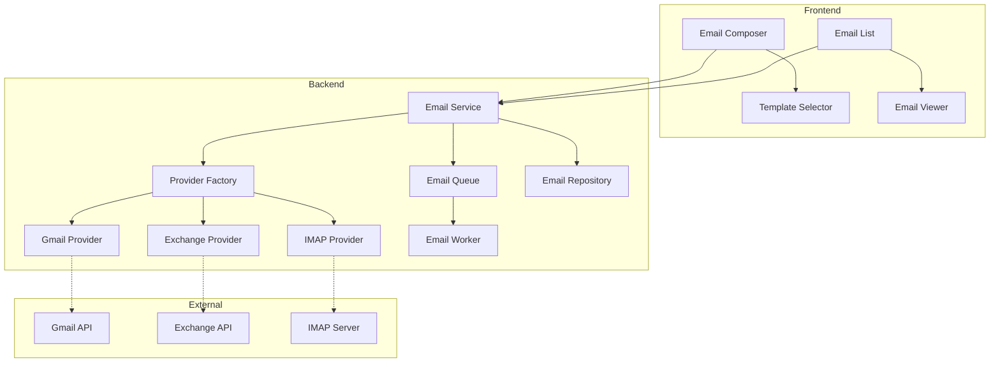

# FC-003: Technisches Konzept - E-Mail Integration

**Feature Code:** FC-003  
**Datum:** 2025-07-24  
**Status:** Draft  
**Autor:** Claude  
**Reviewer:** Jörg Streeck  

## 📋 Inhaltsverzeichnis

1. [Zusammenfassung](#zusammenfassung)
2. [Ziel und Geschäftswert](#ziel-und-geschäftswert)
3. [Technische Architektur](#technische-architektur)
4. [Backend-Implementierung](#backend-implementierung)
5. [Frontend-Implementierung](#frontend-implementierung)
6. [Implementierungsstrategie](#implementierungsstrategie)
7. [Integration mit anderen Features](#integration-mit-anderen-features)
8. [Risiken und Mitigationen](#risiken-und-mitigationen)
9. [Zeitschätzung](#zeitschätzung)

## Zusammenfassung

Die E-Mail Integration ermöglicht nahtlose Zwei-Wege-Kommunikation mit Kunden direkt aus FreshPlan heraus. Das System unterstützt alle gängigen E-Mail-Provider (Gmail, Outlook, IMAP), bietet ein Template-System für standardisierte Kommunikation und integriert sich vollständig mit Opportunities, Renewal Management und Activity Tracking.

## Ziel und Geschäftswert

### Geschäftsziele
- **Zentralisierte Kommunikation**: Alle Kundenkommunikation an einem Ort, reduziert Wechsel zwischen Systemen um 80%
- **Automatisierung**: Template-basierte E-Mails sparen 30 Minuten pro Opportunity
- **Lückenlose Historie**: Vollständige E-Mail-Historie pro Kunde/Opportunity erhöht Transparenz

### Technische Ziele
- **Multi-Provider Support**: OAuth2-basierte Integration für Gmail, Exchange, generisches IMAP/SMTP
- **Skalierbarkeit**: Background-Jobs für E-Mail-Sync, Queue-basierte Verarbeitung
- **Security**: Verschlüsselte Token-Speicherung, keine Passwörter im System

## Technische Architektur

### System-Übersicht



### Detail-Dokumentation

- **Provider-Integration**: [/docs/features/FC-003/provider-integration.md](/Users/joergstreeck/freshplan-sales-tool/docs/features/FC-003/provider-integration.md)
- **Template-System**: [/docs/features/FC-003/template-system.md](/Users/joergstreeck/freshplan-sales-tool/docs/features/FC-003/template-system.md)
- **Sync-Engine**: [/docs/features/FC-003/email-sync-engine.md](/Users/joergstreeck/freshplan-sales-tool/docs/features/FC-003/email-sync-engine.md)
- **Tracking**: [/docs/features/FC-003/email-tracking.md](/Users/joergstreeck/freshplan-sales-tool/docs/features/FC-003/email-tracking.md)

## Backend-Implementierung

### 1. API Endpoints

```java
@Path("/api/email")
public class EmailResource {
    // Provider Management
    POST   /providers/connect      // OAuth2 flow initiieren
    GET    /providers              // Verbundene Provider
    DELETE /providers/{id}         // Provider trennen
    
    // Email Operations
    POST   /send                   // E-Mail senden
    GET    /messages               // E-Mails abrufen (paginiert)
    GET    /messages/{id}          // Einzelne E-Mail
    POST   /messages/{id}/reply    // Antworten
    
    // Templates
    GET    /templates              // Template-Liste
    POST   /templates/render       // Template mit Daten füllen
}
```

### 2. Datenmodell

```java
@Entity
public class EmailAccount {
    UUID id;
    UUID userId;
    EmailProvider provider;
    String email;
    String encryptedTokens;
    boolean isDefault;
}

@Entity
public class EmailMessage {
    UUID id;
    UUID accountId;
    UUID customerId;
    UUID opportunityId;
    String messageId;
    String subject;
    String body;
    EmailDirection direction;
    Instant sentAt;
    boolean isRead;
    String threadId;
}
```

### 3. Integration Points

- **Customer Module**: Automatische E-Mail-Zuordnung via Domain/E-Mail
- **Opportunity Pipeline**: E-Mails als Timeline-Events
- **Activity System**: E-Mails als Activity-Type
- **Renewal Management**: Template-basierte Renewal-Benachrichtigungen

## Frontend-Implementierung

### 1. Komponenten

```typescript
// Email Composer mit Template-Support
<EmailComposer 
    customerId={customerId}
    opportunityId={opportunityId}
    templateId={selectedTemplate}
/>

// Email Thread View
<EmailThread 
    messages={emailThread}
    onReply={handleReply}
/>
```

### 2. State Management

```typescript
// Zustand für Email-Accounts und Messages
interface EmailState {
    accounts: EmailAccount[]
    selectedAccount: string
    messages: EmailMessage[]
    templates: EmailTemplate[]
    syncStatus: SyncStatus
}
```

## Integration mit anderen Features

### FC-009 Renewal Management
- Automatische Renewal-Reminder via E-Mail-Templates
- Tracking von Renewal-Kommunikation
- **Details:** [/docs/features/FC-009/integration-points.md](/Users/joergstreeck/freshplan-sales-tool/docs/features/FC-009/integration-points.md)

### M4 Opportunity Pipeline
- E-Mails automatisch Opportunities zuordnen
- E-Mail-Historie in Opportunity-Timeline
- Stage-spezifische Templates
- **Details:** [/docs/features/M4/email-integration.md](/Users/joergstreeck/freshplan-sales-tool/docs/features/M4/email-integration.md)

### FC-013 Activity System
- E-Mails als Activity-Type
- Automatisches Activity-Logging beim Senden/Empfangen
- E-Mail-basierte Reminder
- **Details:** [/docs/features/FC-013/email-activity-integration.md](/Users/joergstreeck/freshplan-sales-tool/docs/features/FC-013/email-activity-integration.md)

### FC-012 Audit Trail
- Alle E-Mail-Aktionen im Audit Log
- Compliance-konforme Speicherung
- DSGVO-Export Funktionalität
- **Details:** [/docs/features/FC-012/email-audit-integration.md](/Users/joergstreeck/freshplan-sales-tool/docs/features/FC-012/email-audit-integration.md)

## Implementierungsstrategie

### Phase 1: Provider-Integration (5 Tage)
- OAuth2-Setup für Gmail/Exchange
- IMAP/SMTP Basis-Implementation
- Token-Management und Verschlüsselung

### Phase 2: Core Email Features (8 Tage)
- Send/Receive Implementation
- Thread-Management
- Attachment-Support

### Phase 3: Template System (4 Tage)
- Template-Engine (Handlebars/Mustache)
- Variable-Replacement
- Template-Verwaltung UI

### Phase 4: Integration & Polish (5 Tage)
- Feature-Integration (M4, FC-009, FC-013)
- E-Mail-Tracking
- Performance-Optimierung

## Risiken und Mitigationen

### Risiko 1: API Rate Limits
**Wahrscheinlichkeit**: Hoch  
**Impact**: Mittel  
**Mitigation**: Intelligentes Caching, Batch-Operations, exponentielles Backoff

### Risiko 2: Provider-API Änderungen
**Wahrscheinlichkeit**: Mittel  
**Impact**: Hoch  
**Mitigation**: Abstraktion via Provider-Interface, Version-Pinning

## Zeitschätzung

**Gesamt-Aufwand**: 22-25 Tage

- **Backend**: 12 Tage
- **Frontend**: 8 Tage  
- **Integration & Testing**: 4 Tage
- **Dokumentation**: 1 Tag

**Puffer**: +3 Tage für Provider-spezifische Anpassungen

---

**Status-Updates**:
- 2025-07-24: Konzept erstellt (Draft)