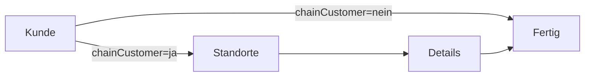

# 📋 FC-005 EXECUTIVE SUMMARY

**Modul:** FC-005 Customer Management  
**Typ:** Greenfield Implementation  
**Zeitrahmen:** 5 Tage (2 Entwickler)  
**ROI:** Reduzierung der Dateneingabezeit um 60%  

## 🎯 Vision & Ziele

### Vision Statement
> "Ein intelligentes, field-basiertes CRM-System, das sich automatisch an branchenspezifische Anforderungen anpasst und Vertriebsmitarbeitern einen intuitiven Wizard-Flow für die Kundenverwaltung bietet."

### Business Value
- **60% schnellere Dateneingabe** durch intelligenten Wizard
- **100% Datenqualität** durch Echtzeit-Validierung
- **Keine Entwicklung** für neue Branchen (nur Konfiguration)
- **Mobile-First** für Außendienst-Mitarbeiter

## 🏗️ Technische Innovation

### Field-basierte Architektur
Statt starrer Entitäten nutzen wir ein flexibles Field-System:

```typescript
// Statt:
class Customer {
  name: string
  industry: string
  roomCount?: number  // Nur Hotels
  bedCount?: number   // Nur Krankenhäuser
}

// Neu:
class Customer {
  id: UUID
  fieldValues: Map<FieldKey, Value>
}
```

**Vorteile:**
- ✅ Neue Branchen ohne Code-Änderung
- ✅ Custom Fields ohne Schema-Migration
- ✅ A/B Testing von Feldern möglich
- ✅ Reduzierte Komplexität

### Wizard-Flow mit Smart Triggers



**Smart Features:**
- Auto-Save alle 30 Sekunden
- Draft-Recovery nach Browser-Crash
- Conditional Fields basierend auf Branche
- Progressive Disclosure

## 📊 Technologie-Stack

### Frontend
- **React 18** mit TypeScript
- **Zustand** für Wizard State
- **React Query** für Server State
- **Material-UI** für konsistente UI
- **React Hook Form** + **Zod** für Validierung

### Backend
- **Quarkus 3.17.4** mit Java 17
- **PostgreSQL** mit JSONB für Field Values
- **Event-Driven** für Module-Kommunikation
- **Redis** für Draft-Caching

## 🚀 Implementierungsplan

### Phase 1: MVP (5 Tage)
1. **Tag 1-2:** Backend Foundation & Field System
2. **Tag 3-4:** Frontend Wizard & Components
3. **Tag 5:** Integration & Testing

### Phase 2: Erweiterungen (später)
- Custom Fields UI
- Import/Export
- Bulk Operations
- Advanced Search

## 🎯 MVP Scope

### In Scope ✅
- Field-basiertes Datenmodell
- 3-Step Wizard (Kunde → Standorte → Details)
- 10 Basis-Felder + 5 pro Branche
- Draft-Persistence
- Basis-Validierungen

### Out of Scope ❌
- Custom Fields (Phase 2)
- Legacy-Daten Migration
- Erweiterte Suche
- Bulk-Import

## 📈 Erfolgsmetriken

| Metrik | Ziel | Messung |
|--------|------|---------|
| Dateneingabe-Zeit | -60% | Wizard Completion Time |
| Datenqualität | 100% | Validation Success Rate |
| User Satisfaction | >4.5/5 | NPS Score |
| Performance | <200ms | API Response Time |

## 🚨 Risiken & Mitigation

### Technische Risiken
1. **Performance bei vielen Fields**
   - Mitigation: Indexed JSONB, Caching
   
2. **Komplexe Validierungen**
   - Mitigation: Zod Schemas, Server-side Validation

### Business Risiken
1. **User-Akzeptanz des neuen Workflows**
   - Mitigation: User Testing, Iteratives Feedback
   
2. **Branchenspezifische Anforderungen**
   - Mitigation: Flexibles Field System

## 👥 Team & Ressourcen

### Entwicklungsteam
- **1 Backend Developer** (Tag 1-2, dann Support)
- **1 Frontend Developer** (Tag 3-5)
- **Gemeinsame Integration** (Tag 4-5)

### Stakeholder
- **Product Owner:** Feature-Priorisierung
- **Vertriebsleitung:** Business Requirements
- **IT-Security:** DSGVO Compliance

## ✅ Definition of Success

Das Feature gilt als erfolgreich wenn:
1. Wizard-Flow in <3 Minuten durchlaufen
2. Alle Validierungen funktionieren
3. Draft-Recovery zu 100% zuverlässig
4. Performance <200ms bei 95% der Requests
5. Positive Rückmeldung von 3+ Pilot-Usern

## 🔗 Weiterführende Dokumente

- [Architecture Decisions →](./02-architecture-decisions.md)
- [Implementation Checklist →](/Users/joergstreeck/freshplan-sales-tool/docs/features/FC-005-CUSTOMER-MANAGEMENT/08-IMPLEMENTATION/README.md)
- [Test Strategy →](/Users/joergstreeck/freshplan-sales-tool/docs/features/FC-005-CUSTOMER-MANAGEMENT/05-TESTING/README.md)