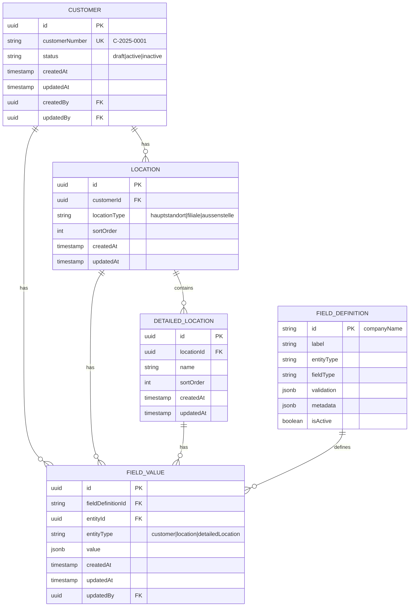

# 🗄️ FC-005 DATA MODEL

**Modul:** FC-005 Customer Management  
**Typ:** Entity Design & Relationships  
**Pattern:** Field-basierte Architektur  

## 📋 Entity Relationship Diagram



## 📋 Core Entities

### Customer Entity
```java
@Entity
@Table(name = "customers")
public class Customer extends BaseEntity {
    
    @Column(name = "customer_number", unique = true)
    private String customerNumber;
    
    @Enumerated(EnumType.STRING)
    @Column(nullable = false)
    private CustomerStatus status = CustomerStatus.DRAFT;
    
    @OneToMany(mappedBy = "customer", cascade = CascadeType.ALL)
    @OrderBy("sortOrder ASC")
    private List<Location> locations = new ArrayList<>();
    
    // Audit fields from BaseEntity
    // createdAt, updatedAt, createdBy, updatedBy
}
```

### Location Entity
```java
@Entity
@Table(name = "locations")
public class Location extends BaseEntity {
    
    @ManyToOne(fetch = FetchType.LAZY)
    @JoinColumn(name = "customer_id", nullable = false)
    private Customer customer;
    
    @Column(name = "location_type", nullable = false)
    private String locationType;
    
    @Column(name = "sort_order")
    private Integer sortOrder = 0;
    
    @OneToMany(mappedBy = "location", cascade = CascadeType.ALL)
    @OrderBy("sortOrder ASC")
    private List<DetailedLocation> detailedLocations = new ArrayList<>();
}
```

### Field Value Entity
```java
@Entity
@Table(name = "field_values", 
       indexes = {
           @Index(name = "idx_entity", columnList = "entity_id,entity_type"),
           @Index(name = "idx_field", columnList = "field_definition_id")
       })
public class FieldValue extends BaseEntity {
    
    @Column(name = "field_definition_id", nullable = false)
    private String fieldDefinitionId;
    
    @Column(name = "entity_id", nullable = false)
    private UUID entityId;
    
    @Enumerated(EnumType.STRING)
    @Column(name = "entity_type", nullable = false)
    private EntityType entityType;
    
    @Type(type = "jsonb")
    @Column(columnDefinition = "jsonb")
    private Object value;
    
    @Version
    private Long version; // Optimistic locking
}
```

## 📋 Frontend Types

### TypeScript Interfaces
```typescript
// Domain Types
export interface Customer {
  id: string
  customerNumber?: string
  status: 'draft' | 'active' | 'inactive'
  locations?: Location[]
  createdAt: Date
  updatedAt: Date
}

export interface Location {
  id: string
  customerId: string
  locationType: 'hauptstandort' | 'filiale' | 'aussenstelle'
  sortOrder: number
  detailedLocations?: DetailedLocation[]
}

export interface DetailedLocation {
  id: string
  locationId: string
  name: string
  sortOrder: number
}

// Field System Types
export interface FieldValue {
  id?: string
  fieldDefinitionId: string
  entityId: string
  entityType: EntityType
  value: any
  updatedAt?: Date
}

export interface FieldDefinition {
  id: string
  key: string
  label: string
  entityType: EntityType
  industry?: string[]
  fieldType: FieldType
  validation?: ValidationRule
  options?: SelectOption[]
  defaultValue?: any
  required?: boolean
  isCustom: boolean
  metadata?: FieldMetadata
}

// Helper Types
export type EntityType = 'customer' | 'location' | 'detailedLocation'
export type FieldType = 'text' | 'number' | 'select' | 'date' | 'boolean' | 'email' | 'url'

export interface ValidationRule {
  type: 'regex' | 'min' | 'max' | 'custom'
  value: string | number
  message?: string
}
```

## 📋 Value Objects

### Customer Number
```java
@Embeddable
public class CustomerNumber {
    private static final Pattern PATTERN = 
        Pattern.compile("C-\\d{4}-\\d{4}");
    
    @Column(name = "customer_number")
    private String value;
    
    public static CustomerNumber generate() {
        int year = Year.now().getValue();
        int sequence = // get next sequence
        return new CustomerNumber(
            String.format("C-%d-%04d", year, sequence)
        );
    }
}
```

### Field Value Wrapper
```typescript
export class FieldValueWrapper {
  constructor(
    private fieldDef: FieldDefinition,
    private value: any
  ) {}
  
  get displayValue(): string {
    switch (this.fieldDef.fieldType) {
      case 'select':
        return this.getOptionLabel(this.value);
      case 'boolean':
        return this.value ? 'Ja' : 'Nein';
      case 'date':
        return this.formatDate(this.value);
      default:
        return String(this.value || '');
    }
  }
  
  validate(): ValidationResult {
    // Use Zod or custom validation
  }
}
```

## 📋 Aggregates & Boundaries

### Customer Aggregate
```
Customer (Aggregate Root)
├── Locations[]
│   └── DetailedLocations[]
└── FieldValues[] (via Service)
```

**Invariants:**
- Customer mit `chainCustomer='nein'` darf keine Locations haben
- Mindestens 1 Location wenn `chainCustomer='ja'`
- CustomerNumber ist immutable nach Finalisierung

### Field Value Aggregate
```
FieldValue (Standalone)
├── References Entity (Customer/Location/DetailedLocation)
└── References FieldDefinition
```

**Invariants:**
- Value muss zum fieldType passen
- Validation Rules müssen erfüllt sein
- Keine Duplikate (entityId + fieldDefinitionId)

## 📋 Data Access Patterns

### Query Patterns
```sql
-- Customer mit allen Field Values
WITH customer_fields AS (
  SELECT 
    entity_id,
    jsonb_object_agg(field_definition_id, value) as fields
  FROM field_values
  WHERE entity_type = 'CUSTOMER'
  GROUP BY entity_id
)
SELECT c.*, cf.fields
FROM customers c
LEFT JOIN customer_fields cf ON c.id = cf.entity_id
WHERE c.id = ?;

-- Branchenspezifische Suche
SELECT DISTINCT c.*
FROM customers c
JOIN field_values fv ON c.id = fv.entity_id
WHERE fv.field_definition_id = 'industry'
  AND fv.value = '"hotel"'
  AND c.status = 'ACTIVE';
```

### Performance Optimizations
```sql
-- Indexes
CREATE INDEX idx_field_values_entity 
  ON field_values(entity_id, entity_type);

CREATE INDEX idx_field_values_field 
  ON field_values(field_definition_id);

CREATE INDEX idx_field_values_jsonb 
  ON field_values USING GIN (value);

-- Materialized View für Performance
CREATE MATERIALIZED VIEW customer_summary AS
SELECT 
  c.id,
  c.customer_number,
  c.status,
  fv_name.value->>'$' as company_name,
  fv_industry.value->>'$' as industry,
  COUNT(DISTINCT l.id) as location_count
FROM customers c
LEFT JOIN field_values fv_name 
  ON c.id = fv_name.entity_id 
  AND fv_name.field_definition_id = 'companyName'
LEFT JOIN field_values fv_industry 
  ON c.id = fv_industry.entity_id 
  AND fv_industry.field_definition_id = 'industry'
LEFT JOIN locations l ON c.id = l.customer_id
GROUP BY c.id, fv_name.value, fv_industry.value;
```

## 📚 Weiterführende Links

- [Implementation Plan →](./04-implementation-plan.md)
- [Backend Entities Detail →](/Users/joergstreeck/freshplan-sales-tool/docs/features/FC-005-CUSTOMER-MANAGEMENT/02-BACKEND/01-entities.md)
- [Database Migrations →](/Users/joergstreeck/freshplan-sales-tool/docs/features/FC-005-CUSTOMER-MANAGEMENT/02-BACKEND/04-database.md)