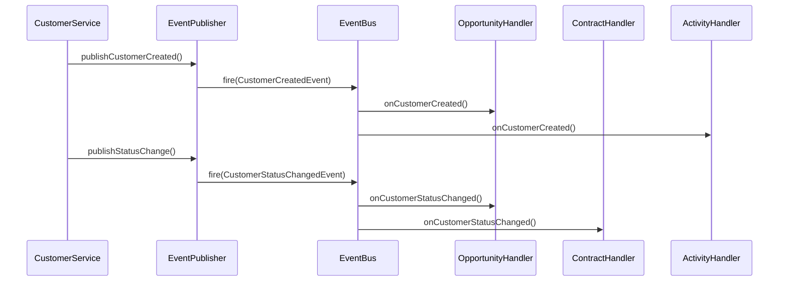

# 📡 FC-005 INTEGRATION - EVENT SYSTEM

**Navigation:**
- **Parent:** [04-INTEGRATION](/Users/joergstreeck/freshplan-sales-tool/docs/features/FC-005-CUSTOMER-MANAGEMENT/04-INTEGRATION/README.md)
- **Prev:** [01-module-dependencies.md](/Users/joergstreeck/freshplan-sales-tool/docs/features/FC-005-CUSTOMER-MANAGEMENT/04-INTEGRATION/01-module-dependencies.md)
- **Next:** [03-api-gateway.md](/Users/joergstreeck/freshplan-sales-tool/docs/features/FC-005-CUSTOMER-MANAGEMENT/04-INTEGRATION/03-api-gateway.md)

---

## Domain Events

### Event Definitionen

```java
// Customer Events
public class CustomerCreatedEvent extends DomainEvent {
    private final UUID customerId;
    private final String companyName;
    private final String industry;
    private final boolean isChainCustomer;
    
    public CustomerCreatedEvent(
        UUID customerId, 
        String companyName, 
        String industry,
        boolean isChainCustomer
    ) {
        super();
        this.customerId = customerId;
        this.companyName = companyName;
        this.industry = industry;
        this.isChainCustomer = isChainCustomer;
    }
    
    // Getters...
}

public class CustomerStatusChangedEvent extends DomainEvent {
    private final UUID customerId;
    private final CustomerStatus oldStatus;
    private final CustomerStatus newStatus;
    
    public CustomerStatusChangedEvent(
        UUID customerId,
        CustomerStatus oldStatus,
        CustomerStatus newStatus
    ) {
        super();
        this.customerId = customerId;
        this.oldStatus = oldStatus;
        this.newStatus = newStatus;
    }
    
    // Getters...
}

public class CustomerFieldUpdatedEvent extends DomainEvent {
    private final UUID customerId;
    private final String fieldKey;
    private final Object oldValue;
    private final Object newValue;
    
    public CustomerFieldUpdatedEvent(
        UUID customerId,
        String fieldKey,
        Object oldValue,
        Object newValue
    ) {
        super();
        this.customerId = customerId;
        this.fieldKey = fieldKey;
        this.oldValue = oldValue;
        this.newValue = newValue;
    }
    
    // Getters...
}

public class LocationAddedEvent extends DomainEvent {
    private final UUID customerId;
    private final UUID locationId;
    private final String locationType;
    
    public LocationAddedEvent(
        UUID customerId,
        UUID locationId,
        String locationType
    ) {
        super();
        this.customerId = customerId;
        this.locationId = locationId;
        this.locationType = locationType;
    }
    
    // Getters...
}
```

### Base Domain Event

```java
public abstract class DomainEvent {
    private final UUID eventId;
    private final LocalDateTime occurredAt;
    private final String eventType;
    
    protected DomainEvent() {
        this.eventId = UUID.randomUUID();
        this.occurredAt = LocalDateTime.now();
        this.eventType = this.getClass().getSimpleName();
    }
    
    // Getters...
}
```

---

## Event Publishers

### CustomerEventPublisher

```java
@ApplicationScoped
public class CustomerEventPublisher {
    
    @Inject
    Event<DomainEvent> eventBus;
    
    @Inject
    AuditService auditService;
    
    public void publishCustomerCreated(Customer customer) {
        Map<String, Object> fieldValues = getFieldValuesAsMap(customer);
        
        CustomerCreatedEvent event = new CustomerCreatedEvent(
            customer.getId(),
            (String) fieldValues.get("companyName"),
            (String) fieldValues.get("industry"),
            "ja".equals(fieldValues.get("chainCustomer"))
        );
        
        eventBus.fire(event);
        
        // Audit trail
        auditService.logEvent(event);
    }
    
    public void publishStatusChange(
        UUID customerId,
        CustomerStatus oldStatus,
        CustomerStatus newStatus
    ) {
        CustomerStatusChangedEvent event = new CustomerStatusChangedEvent(
            customerId, oldStatus, newStatus
        );
        
        eventBus.fire(event);
        auditService.logEvent(event);
    }
    
    public void publishFieldUpdate(
        UUID customerId,
        String fieldKey,
        Object oldValue,
        Object newValue
    ) {
        // Only publish for significant fields
        Set<String> significantFields = Set.of(
            "companyName", "industry", "chainCustomer",
            "creditLimit", "paymentTerms", "status"
        );
        
        if (significantFields.contains(fieldKey)) {
            CustomerFieldUpdatedEvent event = new CustomerFieldUpdatedEvent(
                customerId, fieldKey, oldValue, newValue
            );
            
            eventBus.fire(event);
            
            // Critical fields need immediate notification
            if (isCriticalField(fieldKey)) {
                notifyRelevantUsers(event);
            }
        }
    }
    
    public void publishLocationAdded(
        UUID customerId,
        UUID locationId,
        String locationType
    ) {
        LocationAddedEvent event = new LocationAddedEvent(
            customerId, locationId, locationType
        );
        
        eventBus.fire(event);
    }
    
    private Map<String, Object> getFieldValuesAsMap(Customer customer) {
        return customer.getFieldValues()
            .stream()
            .collect(Collectors.toMap(
                FieldValue::getFieldKey,
                FieldValue::getValue
            ));
    }
    
    private boolean isCriticalField(String fieldKey) {
        return Set.of("creditLimit", "paymentTerms", "status")
            .contains(fieldKey);
    }
}
```

---

## Event Subscribers

### OpportunityCustomerEventHandler

```java
@ApplicationScoped
public class OpportunityCustomerEventHandler {
    
    @Inject
    OpportunityRepository opportunityRepository;
    
    @Inject
    OpportunityService opportunityService;
    
    public void onCustomerStatusChanged(
        @Observes CustomerStatusChangedEvent event
    ) {
        if (event.getNewStatus() == CustomerStatus.INACTIVE) {
            // Pause all opportunities for inactive customers
            List<Opportunity> opportunities = opportunityRepository
                .findActiveByCustomerId(event.getCustomerId());
                
            opportunities.forEach(opp -> {
                opp.setStatus(OpportunityStatus.ON_HOLD);
                opp.setHoldReason("Customer inactive");
                opportunityService.updateOpportunity(opp);
            });
        } else if (event.getOldStatus() == CustomerStatus.INACTIVE 
                && event.getNewStatus() == CustomerStatus.ACTIVE) {
            // Reactivate paused opportunities
            List<Opportunity> opportunities = opportunityRepository
                .findOnHoldByCustomerId(event.getCustomerId());
                
            opportunities.stream()
                .filter(opp -> "Customer inactive".equals(opp.getHoldReason()))
                .forEach(opp -> {
                    opp.setStatus(OpportunityStatus.ACTIVE);
                    opp.setHoldReason(null);
                    opportunityService.updateOpportunity(opp);
                });
        }
    }
    
    public void onCustomerFieldUpdated(
        @Observes CustomerFieldUpdatedEvent event
    ) {
        // Update cached customer data
        if ("companyName".equals(event.getFieldKey())) {
            opportunityRepository
                .updateCompanyName(
                    event.getCustomerId(), 
                    (String) event.getNewValue()
                );
        }
    }
}
```

### ContractCustomerEventHandler

```java
@ApplicationScoped
public class ContractCustomerEventHandler {
    
    @Inject
    ContractRepository contractRepository;
    
    @Inject
    NotificationService notificationService;
    
    public void onCustomerStatusChanged(
        @Observes CustomerStatusChangedEvent event
    ) {
        if (event.getNewStatus() == CustomerStatus.INACTIVE) {
            // Notify about active contracts
            List<Contract> activeContracts = contractRepository
                .findActiveByCustomerId(event.getCustomerId());
                
            if (!activeContracts.isEmpty()) {
                notificationService.notifyContractManager(
                    "Customer deactivated with active contracts",
                    Map.of(
                        "customerId", event.getCustomerId(),
                        "activeContracts", activeContracts.size()
                    )
                );
            }
        }
    }
    
    public void onLocationAdded(
        @Observes LocationAddedEvent event
    ) {
        // Update contract location options
        contractRepository
            .findDraftsByCustomerId(event.getCustomerId())
            .forEach(contract -> {
                contract.addAvailableLocation(event.getLocationId());
            });
    }
}
```

### ActivityCustomerEventHandler

```java
@ApplicationScoped
public class ActivityCustomerEventHandler {
    
    @Inject
    ActivityService activityService;
    
    public void onCustomerCreated(
        @Observes CustomerCreatedEvent event
    ) {
        // Create welcome activity
        activityService.createActivity(
            ActivityType.SYSTEM,
            "Customer created",
            Map.of(
                "customerId", event.getCustomerId(),
                "companyName", event.getCompanyName()
            )
        );
    }
    
    public void onCustomerFieldUpdated(
        @Observes CustomerFieldUpdatedEvent event
    ) {
        // Log significant field changes as activities
        if (isSignificantChange(event.getFieldKey())) {
            activityService.createActivity(
                ActivityType.FIELD_UPDATE,
                String.format("Field '%s' updated", event.getFieldKey()),
                Map.of(
                    "customerId", event.getCustomerId(),
                    "field", event.getFieldKey(),
                    "oldValue", event.getOldValue(),
                    "newValue", event.getNewValue()
                )
            );
        }
    }
    
    private boolean isSignificantChange(String fieldKey) {
        return Set.of(
            "creditLimit", "paymentTerms", 
            "industry", "chainCustomer"
        ).contains(fieldKey);
    }
}
```

---

## Event Flow Diagramm



---

## Event Configuration

### CDI Event Configuration

```java
// EventConfiguration.java
@ApplicationScoped
public class EventConfiguration {
    
    @Produces
    @ApplicationScoped
    public ExecutorService eventExecutor() {
        return Executors.newFixedThreadPool(10);
    }
    
    public void observeAllEvents(@Observes DomainEvent event) {
        // Central logging for all events
        Log.infof("Domain Event: %s - %s", 
            event.getEventType(), 
            event.getEventId()
        );
    }
}
```

### Asynchronous Event Handling

```java
// Async event handler example
public void onCustomerCreatedAsync(
    @ObservesAsync CustomerCreatedEvent event
) {
    // Long-running operations
    generateWelcomePackage(event.getCustomerId());
    scheduleOnboardingTasks(event.getCustomerId());
}
```

---

## Best Practices

1. **Event Granularity**: Nur signifikante Änderungen als Events publizieren
2. **Event Payload**: Minimale Daten im Event, Details bei Bedarf nachladen
3. **Idempotency**: Event Handler müssen idempotent sein
4. **Error Handling**: Failed Events in Dead Letter Queue
5. **Performance**: Async für lange Operations verwenden