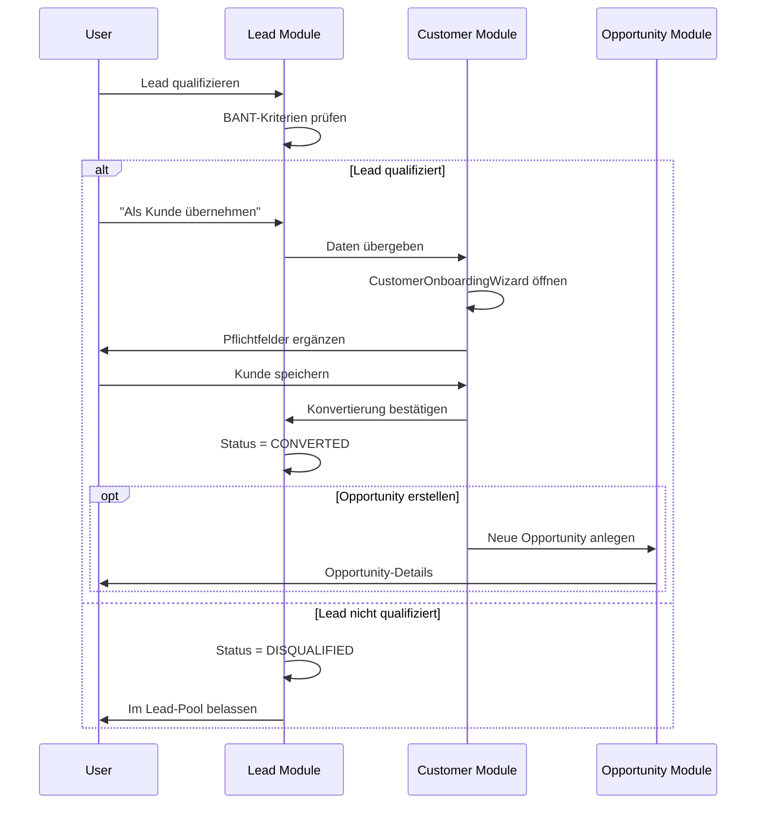

# 🎯 FC-020 LEAD MANAGEMENT - TECHNISCHES KONZEPT

**Feature Code:** FC-020  
**Status:** 📋 Planned  
**Erstellt:** 27.07.2025  
**Autor:** Claude  
**Phase:** 2 - Communication Hub

---

## 📋 Navigation
**Parent:** [Feature Roadmap](/Users/joergstreeck/freshplan-sales-tool/docs/features/2025-07-12_COMPLETE_FEATURE_ROADMAP.md)  
**Related:** 
- [FC-005 Customer Management](/Users/joergstreeck/freshplan-sales-tool/docs/features/FC-005-CUSTOMER-MANAGEMENT/README.md)
- [Sprint 2 Lead Discussion](/Users/joergstreeck/freshplan-sales-tool/docs/features/FC-005-CUSTOMER-MANAGEMENT/sprint2/SIDEBAR_LEAD_DISCUSSION.md)
- [Lead-Kunde-Trennung Decision](/Users/joergstreeck/freshplan-sales-tool/docs/features/FC-005-CUSTOMER-MANAGEMENT/sprint2/LEAD_CUSTOMER_SEPARATION_DECISION.md)
- [Master Plan V5](/Users/joergstreeck/freshplan-sales-tool/docs/CRM_COMPLETE_MASTER_PLAN_V5.md)

---

## 📋 Executive Summary

Das Lead Management System ermöglicht die schnelle Erfassung von potentiellen Kunden (Leads/Kontakte) mit minimalen Pflichtfeldern. Es bildet die Vorstufe zum vollständigen Customer Management (FC-005) und unterstützt den Vertrieb bei der Qualifizierung von Interessenten.

## 🎯 Kernziele

1. **Schnelle Erfassung:** Minimale Barrieren für Lead-Eingabe
2. **Qualifizierung:** BANT-Kriterien zur Lead-Bewertung  
3. **Nahtlose Konvertierung:** Lead → Kunde mit Datenübernahme
4. **Pipeline-Integration:** Automatische Opportunity-Erstellung

## 🏗️ Architektur

### Datenmodell

```typescript
// Lead - Minimale Struktur
interface Lead {
  id: string;
  
  // Basis-Informationen (wenige Pflichtfelder)
  firstName?: string;
  lastName?: string;
  company?: string;
  email: string;              // PFLICHT
  phone?: string;
  
  // Lead-spezifische Felder
  source: LeadSource;         // Woher kommt der Lead?
  status: LeadStatus;         // Qualifizierungsstatus
  score?: number;             // Lead-Scoring (0-100)
  assignedTo?: string;        // Zugewiesener Vertriebsmitarbeiter
  
  // Qualifizierung (BANT)
  budget?: number;
  authority?: boolean;
  need?: string;
  timeline?: string;
  
  // Tracking
  createdAt: Date;
  updatedAt: Date;
  convertedAt?: Date;
  convertedToCustomerId?: string;
  
  // Aktivitäten
  notes?: string;
  lastContactDate?: Date;
  nextActionDate?: Date;
}

enum LeadSource {
  WEBSITE = 'website',
  EMAIL_CAMPAIGN = 'email_campaign',
  TRADE_SHOW = 'trade_show',
  REFERRAL = 'referral',
  COLD_CALL = 'cold_call',
  SOCIAL_MEDIA = 'social_media',
  OTHER = 'other'
}

enum LeadStatus {
  NEW = 'new',                    // Unbearbeitet
  CONTACTED = 'contacted',        // Erster Kontakt erfolgt
  QUALIFIED = 'qualified',        // BANT erfüllt
  DISQUALIFIED = 'disqualified',  // Kein Potential
  CONVERTED = 'converted'         // Zu Kunde konvertiert
}
```

### API Design

```typescript
// REST Endpoints
POST   /api/leads              // Lead erfassen
GET    /api/leads              // Lead-Liste (mit Filtern)
GET    /api/leads/{id}         // Lead-Details
PUT    /api/leads/{id}         // Lead aktualisieren
POST   /api/leads/{id}/qualify // Lead qualifizieren
POST   /api/leads/{id}/convert // Lead → Kunde konvertieren
DELETE /api/leads/{id}         // Lead löschen (DSGVO)

// Spezielle Endpoints
GET    /api/leads/stats        // Lead-Statistiken
POST   /api/leads/import       // Bulk-Import (CSV)
GET    /api/leads/export       // Export für Reporting
```

### Konvertierungs-Workflow



## 🎨 UI/UX Design

### Lead-Liste
```
┌─────────────────────────────────────────────────────────┐
│ 🔍 Suche...          [+ Neuer Lead] [Import] [Export]   │
├─────────────────────────────────────────────────────────┤
│ Filter: [Alle ▼] [Neu ▼] [Diese Woche ▼]               │
├───┬──────────┬──────────┬─────────┬────────┬───────────┤
│ ⭐│ Name     │ Firma    │ Status  │ Score  │ Aktionen  │
├───┼──────────┼──────────┼─────────┼────────┼───────────┤
│ ⭐│ M. Müller│ ACME Corp│ Neu     │ 75     │ [👤][✏️]  │
│   │ S. Meyer │ Tech AG  │ Qualif. │ 90     │ [→Kunde]  │
└───┴──────────┴──────────┴─────────┴────────┴───────────┘
```

### Lead-Erfassung (Minimal-Form)
```
┌─────────────────────────────────────┐
│        Neuer Lead erfassen          │
├─────────────────────────────────────┤
│ E-Mail*     [___________________]  │
│ Vorname     [___________________]  │
│ Nachname    [___________________]  │
│ Firma       [___________________]  │
│ Telefon     [___________________]  │
│ Quelle      [Webseite ▼]          │
│ Notiz       [___________________]  │
│             [___________________]  │
├─────────────────────────────────────┤
│        [Abbrechen] [Speichern]      │
└─────────────────────────────────────┘
```

## 🔗 Integration mit FC-005

### Datenübernahme bei Konvertierung:
```typescript
// Lead → Customer Mapping
const customerData = {
  // Direkt übernommen
  email: lead.email,
  phone: lead.phone,
  
  // Angepasst für Customer-Format
  name: `${lead.firstName} ${lead.lastName}`.trim(),
  company: lead.company,
  
  // Neue Pflichtfelder (müssen ergänzt werden)
  street: '',           // NEU
  postalCode: '',      // NEU
  city: '',            // NEU
  industry: '',        // NEU
  chainCustomer: null, // NEU
  
  // Metadaten
  leadId: lead.id,
  leadSource: lead.source,
  leadConvertedAt: new Date()
};
```

## 📊 Metriken & KPIs

- **Lead Response Time:** Zeit bis zur ersten Kontaktaufnahme
- **Conversion Rate:** Leads → Kunden
- **Lead Velocity:** Neue Leads pro Woche/Monat
- **Qualifizierungs-Quote:** Qualifizierte vs. Disqualifizierte
- **Source Performance:** Welche Quellen bringen die besten Leads?

## 🚀 Implementierungs-Roadmap

### Phase 1: MVP (3 Tage)
- [ ] Lead-Entity & API
- [ ] Basis-UI (Liste + Erfassung)
- [ ] Einfache Konvertierung

### Phase 2: Erweitert (2 Tage)
- [ ] BANT-Qualifizierung
- [ ] Lead-Scoring
- [ ] Import/Export

### Phase 3: Automation (3 Tage)
- [ ] E-Mail-Integration
- [ ] Auto-Assignment Rules
- [ ] Lead-Nurturing Workflows

## 🔒 Datenschutz & DSGVO

- **Löschfristen:** Disqualifizierte Leads nach 6 Monaten
- **Datensparsamkeit:** Nur notwendige Felder
- **Einwilligung:** Bei Web-Formularen dokumentieren
- **Export/Löschung:** Auf Anfrage möglich

## 📋 Offene Entscheidungen

1. **Lead-Scoring Algorithmus:** Manuell vs. Automatisch?
2. **Duplikate-Handling:** E-Mail als Unique Key?
3. **Multi-Tenancy:** Leads pro Vertriebsteam trennen?
4. **Integration:** CRM-Aktivitäten automatisch tracken?

---

**Nächste Schritte:**
1. Review mit Vertriebsteam
2. Priorisierung in Sprint Planning
3. Detaillierte UI-Mockups