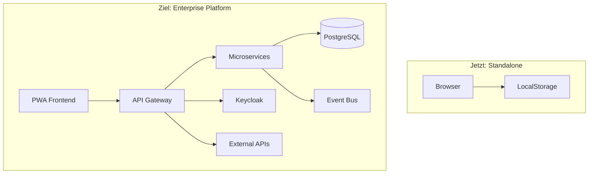

# FreshPlan 2.0 - Technical Implementation Roadmap

## 🎯 Vision: Von Browser-Tool zu Enterprise Sales Platform

### Architektur-Transformation



## 📦 Phase 1: Foundation (Wochen 1-4)

### 1.1 Repository Pattern Implementation
```typescript
// Aktuell (LocalStorage)
export class LocalStorageRepository implements ICustomerRepository {
  async save(customer: Customer): Promise<void> {
    localStorage.setItem(`customer_${customer.id}`, JSON.stringify(customer));
  }
}

// Neu (API)
export class ApiCustomerRepository implements ICustomerRepository {
  async save(customer: Customer): Promise<void> {
    await fetch('/api/customers', {
      method: 'POST',
      headers: { 'Authorization': `Bearer ${token}` },
      body: JSON.stringify(customer)
    });
  }
}

// Feature Flag für Migration
const repo = featureFlags.useApi 
  ? new ApiCustomerRepository() 
  : new LocalStorageRepository();
```

### 1.2 API Design (OpenAPI First)
```yaml
openapi: 3.0.0
paths:
  /api/calculations:
    post:
      summary: Rabattberechnung
      requestBody:
        content:
          application/json:
            schema:
              type: object
              properties:
                orderValue: { type: number }
                leadTime: { type: number }
                isPickup: { type: boolean }
      responses:
        200:
          content:
            application/json:
              schema:
                $ref: '#/components/schemas/CalculationResult'
```

### 1.3 Event-Driven Foundation
```typescript
// Event Bus Setup
export class DomainEventBus {
  private handlers = new Map<string, EventHandler[]>();
  
  emit(event: DomainEvent) {
    // Lokal verarbeiten
    this.handlers.get(event.type)?.forEach(h => h(event));
    
    // An Backend senden
    if (navigator.onLine) {
      fetch('/api/events', {
        method: 'POST',
        body: JSON.stringify(event)
      });
    } else {
      // Offline Queue
      this.offlineQueue.push(event);
    }
  }
}

// Events
class CustomerCreatedEvent {
  constructor(
    public customerId: string,
    public createdBy: string,
    public timestamp: Date
  ) {}
}
```

## 🏗️ Phase 2: Core Services (Wochen 5-8)

### 2.1 Microservices Architektur
```
freshplan-services/
├── customer-service/        # Kundenverwaltung
├── calculation-service/     # Rabattlogik
├── notification-service/    # Events & Alerts
├── reporting-service/       # Analytics & KPIs
└── integration-service/     # ERP/CRM Anbindung
```

### 2.2 Offline-First PWA
```typescript
// Service Worker für Offline-Sync
self.addEventListener('sync', async (event) => {
  if (event.tag === 'sync-customers') {
    event.waitUntil(
      syncOfflineData()
    );
  }
});

// Konfliktauflösung
class ConflictResolver {
  resolve(local: Customer, remote: Customer): Customer {
    // Last-Write-Wins mit Audit Trail
    return local.updatedAt > remote.updatedAt 
      ? { ...local, conflicts: [remote] }
      : { ...remote, conflicts: [local] };
  }
}
```

### 2.3 Security Layer
```typescript
// Keycloak Integration
@Injectable()
export class AuthService {
  constructor(private keycloak: KeycloakService) {}
  
  async checkPermission(resource: string, scope: string): boolean {
    const token = await this.keycloak.getToken();
    const permissions = token.authorization?.permissions || [];
    
    return permissions.some(p => 
      p.rsname === resource && p.scopes.includes(scope)
    );
  }
}

// Row-Level Security
@Entity()
@Check(`tenant_id = current_setting('app.current_tenant')::uuid`)
export class Customer {
  @Column()
  tenant_id: string;
}
```

## 🤖 Phase 3: Intelligence Layer (Wochen 9-12)

### 3.1 AI-Powered Features
```typescript
// Web Scraping für Kundenbriefing
export class CustomerIntelligenceService {
  async generateBriefing(customer: Customer): Promise<Briefing> {
    const webData = await this.scrapeCompanyInfo(customer.website);
    const newsData = await this.fetchRecentNews(customer.name);
    const socialData = await this.analyzeSocialMedia(customer);
    
    return this.aiService.generateBriefing({
      webData,
      newsData,
      socialData,
      historicalData: await this.getCustomerHistory(customer.id)
    });
  }
}

// KI-Routenplaner
export class RouteOptimizer {
  async optimizeRoute(appointments: Appointment[]): Promise<Route> {
    const factors = {
      distance: await this.calculateDistances(appointments),
      priority: appointments.map(a => a.customer.value),
      timeWindows: appointments.map(a => a.constraints),
      trafficPatterns: await this.getTrafficData()
    };
    
    return this.mlService.optimizeRoute(factors);
  }
}
```

### 3.2 Real-Time Analytics
```typescript
// Live Dashboard mit WebSockets
export class DashboardService {
  @WebSocketGateway()
  handleConnection(client: Socket) {
    // Rolle-basierte Daten
    const role = this.auth.getUserRole(client);
    
    if (role === 'MANAGER') {
      client.join('managers');
      this.emitTeamMetrics(client);
    } else {
      client.join(`sales_${client.userId}`);
      this.emitPersonalMetrics(client);
    }
  }
  
  @SubscribeMessage('pipeline-update')
  async handlePipelineUpdate(data: PipelineUpdate) {
    // Event an alle Manager
    this.server.to('managers').emit('pipeline-changed', {
      totalValue: await this.calculatePipelineValue(),
      forecast: await this.mlService.forecastRevenue()
    });
  }
}
```

## 🚀 Deployment & DevOps

### CI/CD Pipeline
```yaml
# .github/workflows/deploy.yml
name: FreshPlan 2.0 Deploy

on:
  push:
    branches: [main]

jobs:
  test:
    runs-on: ubuntu-latest
    steps:
      - name: Unit Tests
        run: npm test
      
      - name: Integration Tests
        run: npm run test:integration
      
      - name: E2E Tests
        run: npm run test:e2e
      
      - name: Security Scan
        uses: snyk/actions/node@master

  build:
    needs: test
    runs-on: ubuntu-latest
    steps:
      - name: Build Frontend
        run: |
          npm run build
          docker build -f Dockerfile.frontend -t freshplan-frontend .
      
      - name: Build Services
        run: |
          docker-compose build
      
      - name: Push to Registry
        run: |
          aws ecr get-login-password | docker login --username AWS --password-stdin $ECR_URL
          docker-compose push

  deploy:
    needs: build
    runs-on: ubuntu-latest
    steps:
      - name: Deploy to ECS
        run: |
          aws ecs update-service --cluster freshplan --service frontend --force-new-deployment
          aws ecs update-service --cluster freshplan --service api --force-new-deployment
```

### Monitoring & Observability
```typescript
// Distributed Tracing
import { trace } from '@opentelemetry/api';

export class CustomerService {
  async createCustomer(data: CreateCustomerDto) {
    const span = trace.getTracer('freshplan').startSpan('createCustomer');
    
    try {
      span.setAttributes({
        'customer.type': data.customerType,
        'user.id': this.context.userId
      });
      
      const customer = await this.repo.save(data);
      
      // Business Metrics
      this.metrics.increment('customers.created', {
        type: data.customerType,
        user: this.context.userId
      });
      
      return customer;
    } finally {
      span.end();
    }
  }
}
```

## 📊 Erfolgsmetriken

| Metrik | Ziel | Messung |
|--------|------|---------|
| Performance | <2s Ladezeit | Lighthouse Score >90 |
| Verfügbarkeit | 99.9% Uptime | CloudWatch Alarms |
| Offline-Fähigkeit | 100% Kernfunktionen | E2E Tests |
| Adoption | 80% aktive Nutzer | Analytics |
| Datenqualität | <1% Konflikte | Event Log Analysis |

## 🔐 Sicherheit & Compliance

- **Verschlüsselung**: TLS 1.3 + AES-256 at rest
- **Authentifizierung**: OAuth2/OIDC via Keycloak
- **Autorisierung**: RBAC + ABAC
- **Audit Trail**: Alle Änderungen protokolliert
- **DSGVO**: Datenlöschung, Export, Consent Management
- **Backup**: 3-2-1 Strategie, Point-in-Time Recovery

## 🎯 Quick Wins (sofort umsetzbar)

1. **Repository Pattern** einführen (1 Woche)
2. **API Skeleton** mit Quarkus (3 Tage)
3. **PWA Manifest** hinzufügen (1 Tag)
4. **Feature Flags** Setup (2 Tage)
5. **Basis-Telemetrie** (2 Tage)

Ready to transform FreshPlan! 🚀