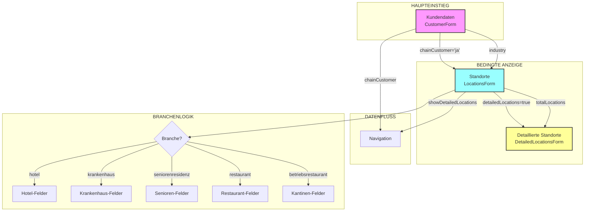

# 🔍 KUNDENVERWALTUNG - VOLLSTÄNDIGE FELDANALYSE MIT BEZIEHUNGEN

**Datum:** 26.07.2025  
**Autor:** Claude  
**Version:** 2.0 (Detaillierte Analyse mit allen Feinheiten)  
**Zweck:** Komplette Dokumentation für neue UI-Konzeption  

## 🗺️ ORGANIGRAMM - DATENBEZIEHUNGEN



## 📊 NAVIGATION & SICHTBARKEITSLOGIK

### Tab-Reihenfolge (WICHTIG!)
1. **calculator** - Immer sichtbar
2. **customer** - Immer sichtbar
3. **locations** - NUR sichtbar wenn `chainCustomer === 'ja'`
4. **detailedLocations** - NUR sichtbar wenn `showDetailedLocations === true && chainCustomer === 'ja'`
5. **creditcheck** - Immer sichtbar (Coming Soon)
6. **profile** - Immer sichtbar (Coming Soon)
7. **offer** - Immer sichtbar (Coming Soon)
8. **settings** - Immer sichtbar (Coming Soon)

### Sichtbarkeits-Trigger
```javascript
// LocationsForm wird angezeigt wenn:
showLocations = customerFormData.chainCustomer === 'ja'

// DetailedLocationsForm wird angezeigt wenn:
showDetailedLocations = true (gesetzt durch Checkbox in LocationsForm)
UND customerFormData.chainCustomer === 'ja'
```

## 🏢 1. KUNDENDATEN (CustomerForm.tsx)

### KRITISCHE DETAILS:

1. **chainCustomer** - TRIGGER-FELD!
   - Standard: `'nein'`
   - Bei `'ja'` → Standorte-Tab wird sichtbar
   - Steuert gesamten Workflow!

2. **industry** - KASKADIERENDES FELD!
   - Bestimmt welche Felder in LocationsForm angezeigt werden
   - Muss vor Standorte-Tab gesetzt sein

3. **expectedVolume** - SPEZIELLE FORMATIERUNG!
   - Automatische Tausender-Trennung mit Punkten
   - Nur Zahlen erlaubt, alle anderen Zeichen werden entfernt
   - Beispiel: "1234567" → "1.234.567"

### Validierungen (DETAILS!)
```javascript
// E-Mail: Standard-Regex
const isValidEmail = (email) => /^[^\s@]+@[^\s@]+\.[^\s@]+$/.test(email)

// Deutsche PLZ: Exakt 5 Zahlen
const isValidGermanPostalCode = (plz) => /^[0-9]{5}$/.test(plz)

// Telefon: Flexible deutsche Nummer
const isValidPhoneNumber = (phone) => {
  const cleaned = phone.replace(/\D/g, '');
  return cleaned.length >= 10 && cleaned.length <= 15;
}
```

### Feldliste mit ALLEN Details:

#### Grunddaten
| Feld | Typ | Pflicht | Standard | Besonderheiten |
|------|-----|---------|----------|----------------|
| companyName | string | ✓ | '' | - |
| legalForm | select | ✓ | '' | 7 Optionen |
| customerType | select | ✓ | '' | neukunde/bestandskunde |
| industry | select | ✓ | '' | TRIGGER für LocationsForm! |
| chainCustomer | select | - | 'nein' | TRIGGER für Standorte-Tab! |
| customerNumber | string | - | '' | Interne Nummer |

#### Adressdaten
| Feld | Typ | Pflicht | Standard | Besonderheiten |
|------|-----|---------|----------|----------------|
| street | string | ✓ | '' | Straße + Hausnummer |
| postalCode | string | ✓ | '' | maxLength=5, PLZ-Validierung |
| city | string | ✓ | '' | - |

#### Ansprechpartner
| Feld | Typ | Pflicht | Standard | Besonderheiten |
|------|-----|---------|----------|----------------|
| contactName | string | ✓ | '' | - |
| contactPosition | string | - | '' | - |
| contactPhone | string | ✓ | '' | Telefon-Validierung |
| contactEmail | string | ✓ | '' | E-Mail-Validierung |

#### Geschäftsdaten
| Feld | Typ | Pflicht | Standard | Besonderheiten |
|------|-----|---------|----------|----------------|
| expectedVolume | string | ✓ | '' | Auto-Formatierung Tausender |
| paymentMethod | select | ✓ | '' | vorkasse/barzahlung/rechnung |

#### Zusatzinformationen
| Feld | Typ | Pflicht | Standard | Besonderheiten |
|------|-----|---------|----------|----------------|
| notes | textarea | - | '' | rows=3 |
| customField1 | string | - | '' | Freies Feld |
| customField2 | string | - | '' | Freies Feld |

## 🏪 2. STANDORTE (LocationsForm.tsx)

### KRITISCHE MECHANISMEN:

1. **Automatische Berechnung totalLocations**
   ```javascript
   // Summe aller Größenkategorien der gewählten Branche
   totalLocations = smallHotels + mediumHotels + largeHotels // Bei Hotel
   ```

2. **Props-Kommunikation**
   - Empfängt: `customerIndustry` von CustomerForm
   - Sendet: `onDetailedLocationsChange(boolean)` → aktiviert DetailedLocations-Tab
   - Sendet: `onTotalLocationsChange(number)` → für Synchronisierungs-Check

3. **Bedingte Anzeige vendingDetails**
   - Style-Toggle über DOM-Manipulation
   - `display: block/none` basierend auf vendingInterest

4. **Service-Limits**
   - Alle Service-Felder haben `max={calculateTotalLocations()}`
   - Verhindert unmögliche Eingaben

### Standard-Werte (WICHTIG!)
```javascript
const [formData, setFormData] = useState<LocationsFormData>({
  totalLocations: 0,
  locationsManagementType: 'zentral', // STANDARD!
  detailedLocations: false,
  vendingInterest: false,
  vendingLocations: 0,
  vendingType: '',
  privatePatientShare: 15, // STANDARD für Krankenhäuser!
  careLevel: 'mixed', // STANDARD für Seniorenresidenzen!
});
```

### 🏨 BRANCHE: HOTEL - Komplette Struktur

#### Größen-Definition (implizit aus Labels):
- **Klein**: < 50 Zimmer
- **Mittel**: 50-150 Zimmer  
- **Groß**: > 150 Zimmer

#### UI-Besonderheiten:
- Service-Felder zeigen: "X von Y Hotels"
- Placeholder für Größen: Anzahl-Eingabe erwartet

### 🏥 BRANCHE: KRANKENHAUS - Spezialitäten

#### Größen-Definition:
- **Klein**: < 200 Betten
- **Mittel**: 200-500 Betten
- **Groß**: > 500 Betten

#### UNIQUE: Privatpatientenanteil
- Range-Slider: 0-100%
- Standard: 15%
- Live-Anzeige des Wertes neben Slider

### 🏛️ BRANCHE: SENIORENRESIDENZ - Pflegestufen

#### Größen-Definition:
- **Klein**: < 50 Bewohner
- **Mittel**: 50-150 Bewohner
- **Groß**: > 150 Bewohner

#### UNIQUE: Pflegestufe (careLevel)
- mixed: Gemischt (STANDARD!)
- assisted: Betreutes Wohnen
- nursing: Vollpflege

### 🍽️ BRANCHE: RESTAURANT - Einfachste Struktur

#### Größen-Definition:
- **Klein**: < 50 Plätze
- **Mittel**: 50-150 Plätze
- **Groß**: > 150 Plätze

#### Services nur:
- À la carte
- Bankett/Veranstaltungen

### 🍴 BRANCHE: BETRIEBSRESTAURANT - Zeitbasiert

#### Größen-Definition:
- **Klein**: < 100 Essen/Tag
- **Mittel**: 100-500 Essen/Tag
- **Groß**: > 500 Essen/Tag

#### Service-Zeiten statt Typen:
- Frühstück
- Mittagessen
- Abendessen

## 📍 3. DETAILLIERTE STANDORTE (DetailedLocationsForm.tsx)

### KRITISCHE FEATURES:

1. **Synchronisierungs-Warnung**
   ```javascript
   showSyncWarning = totalLocations > 0 && locations.length !== totalLocations
   ```
   - Rote Alert-Box mit detaillierter Meldung
   - Zeigt: "X von Y Standorten erfasst"

2. **Dynamische ID-Verwaltung**
   ```javascript
   const [nextId, setNextId] = useState(1);
   // Bei jedem neuen Standort: id = nextId++
   ```

3. **Lösch-Bestätigung**
   - Native `window.confirm()` Dialog
   - Übersetzter Text aus i18n

4. **Kategorie-Hierarchie**
   - hauptstandort: Hauptstandort/Zentrale
   - filiale: Standard-Filiale
   - aussenstelle: Externe Stelle

### UI-States:
1. **Leer-Zustand**: Zentrierte Nachricht + Hinweis
2. **Gefüllt**: Karten-Layout pro Standort
3. **Warnung**: Alert-Box bei Zahlen-Diskrepanz

### Standort-Karte Layout:
```
[Standort X]                              [Entfernen]
------------------------------------------------
Standortname* [_______________] Kategorie [Dropdown]
Straße*       [_____________________________]
PLZ*          [_____] Ort* [________________]
Ansprechpartner [___________________________]
Telefon         [___________________________]
E-Mail          [___________________________]
```

## 🔗 DATENFLUSS-DETAILS

### 1. State-Management in LegacyApp.tsx:
```javascript
// Zentrale States
const [customerFormData, setCustomerFormData] = useState<CustomerFormData>
const [showDetailedLocations, setShowDetailedLocations] = useState(false)
const [totalLocations, setTotalLocations] = useState(0)

// Weitergabe an Komponenten
<LocationsForm
  customerIndustry={customerFormData.industry} // Von Customer zu Locations
  onDetailedLocationsChange={setShowDetailedLocations} // Callback
  onTotalLocationsChange={setTotalLocations} // Callback
/>
```

### 2. Navigation-Steuerung:
```javascript
<Navigation
  showLocations={customerFormData.chainCustomer === 'ja'}
  showDetailedLocations={showDetailedLocations}
/>
```

### 3. Clear-Form Mechanismus:
- Header-Button löst `handleClearForm()` aus
- Setzt ALLE States zurück auf Initial-Werte
- `showDetailedLocations` wird auf `false` gesetzt

## 📋 FEHLENDE FEATURES (aus Code ersichtlich):

1. **Save-Funktion**: `handleSave()` ist TODO
2. **Creditcheck**: Tab vorhanden, aber "Coming Soon"
3. **Profile**: Tab vorhanden, aber "Coming Soon"
4. **Offer**: Tab vorhanden, aber "Coming Soon"
5. **Settings**: Tab vorhanden, aber "Coming Soon"

## 🎯 ZUSAMMENFASSUNG FÜR NEUE UI

### Workflow-Logik:
1. **Start**: Immer bei Kundendaten
2. **Verzweigung**: Bei chainCustomer='ja' → Standorte
3. **Optional**: Bei detailedLocations=true → Details
4. **Branchenabhängig**: industry bestimmt Felder in Standorte

### Kritische Abhängigkeiten:
- `industry` MUSS vor Standorte-Tab gesetzt sein
- `chainCustomer` steuert gesamte Tab-Sichtbarkeit
- `totalLocations` synchronisiert zwischen Forms
- `detailedLocations` Checkbox aktiviert dritten Tab

### Validierungs-Reihenfolge:
1. Pflichtfelder in CustomerForm
2. Bei Kettenkunde: Mindestens 1 Standort
3. Bei Details: Name + Adresse pro Standort

---

**DIESE DOKUMENTATION ENTHÄLT ALLE FEINHEITEN FÜR EINEN NEUEN CLAUDE!**